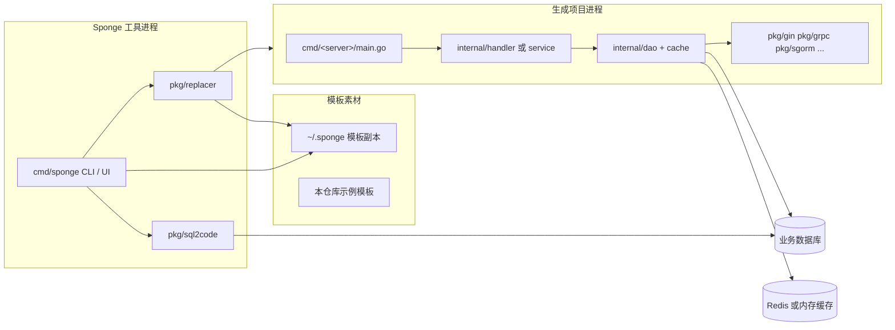
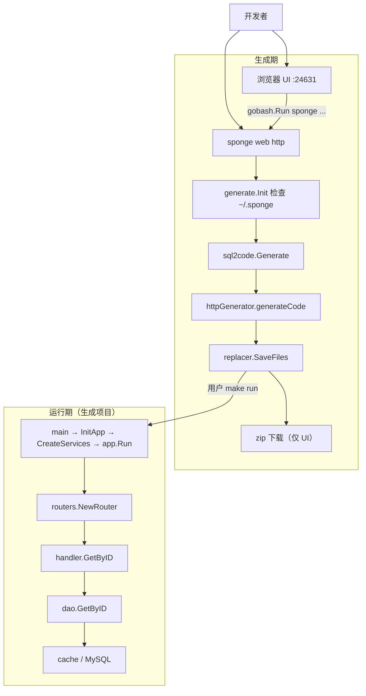

# 简单框架：系统骨架

> 状态：待复核生成稿
> 生成日期：2026-08-16
> 基准提交：`23807238c62e0f3b3e2d9a341bbef50547d3f5ec`
> 工作区：dirty
> 源码范围：`cmd/`、`internal/`、`pkg/`、`api/`、`configs/`、`deployments/`、`scripts/`、`test/`
> 生成方式：源码、测试、配置与部署资产静态分析

## 快速摘要

### 架构总览（模块与依赖）

Sponge 仓库里同时住着 **代码生成器** 和 **被生成服务的模板**。运行时最多同时出现两类进程：`sponge` CLI/UI 进程，以及用户生成出来的 HTTP/gRPC 服务进程。生成器依赖 `pkg/sql2code` 和 `pkg/replacer`；生成项目依赖 `pkg` 里的 Gin/gRPC/GORM 等库，不反向调用生成器。

### 核心调用序列（逐步逻辑）

1. 用户执行 `sponge web http`（或在 UI 里点生成，UI 最终仍执行同一条 CLI）。
2. `cmd/sponge/main.go:main` → `generate.Init` → `commands.NewRootCMD().Execute`。
3. `generate.HTTPCommand.RunE` → `sql2code.Generate` 读表结构 → `httpGenerator.generateCode` 写文件。
4. 用户进入输出目录 `make run`：`cmd/serverNameExample_httpExample/main.go` → `initial.InitApp` → `app.Run`。
5. 请求 `GET /api/v1/user/{id}`：router → handler.GetByID → dao.GetByID → cache/db → JSON 响应。

### 易错点与边界条件

- 把 `internal/handler` 读完并不等于读完 Sponge；那只是模板。
- 生成默认读取 `~/.sponge`，不是当前 Git 工作区。
- 本层不展开每个函数和失败分支；细节从第二层例子开始。

---

## 为什么先看骨架（Why）

Sponge 的官方定位是 Go 开发框架，核心口号是 **Definition is Code**：用 SQL、Protobuf、YAML 定义，生成可运行的后端工程。

如果按目录字母顺序读，很容易迷路：

- `cmd/sponge` 是真正的工具入口。
- `internal/` 和 `cmd/serverNameExample_*` 看起来像业务服务，其实是 **带占位符的模板**。
- `pkg/` 既被生成器使用，也被生成项目使用。

第一层只回答三件事：项目是干什么的、运行时有几块、数据从哪进到哪出。

## 它是什么（What）

### 两类进程

| 进程 | 入口 | 职责 | 何时出现 |
|---|---|---|---|
| Sponge 工具 | `cmd/sponge/main.go` | 初始化模板、生成代码、打开 UI、合并/修补、压测 | 开发者本机执行 `sponge ...` |
| 生成出的业务服务 | `cmd/serverNameExample_*/main.go`（生成后改名） | 对外提供 HTTP 和/或 gRPC | 用户对生成项目执行 `make run` |

另外还有三个独立的 `protoc` 插件进程（`cmd/protoc-gen-go-gin`、`cmd/protoc-gen-go-rpc-tmpl`、`cmd/protoc-gen-json-field`），只在生成 Protobuf 相关代码时由 `protoc` 拉起。第一层把它们视为生成器的附属工具。

### 顶层目录（只记边界）

```text
sponge/
├── cmd/sponge/          # 生成器 CLI + UI
├── cmd/protoc-gen-*     # protoc 插件
├── cmd/serverNameExample_*  # 被生成服务的 main 模板
├── cmd/perftest/        # 独立压测入口（与 sponge perftest 配套）
├── internal/            # 被生成服务的业务层模板（handler/dao/cache/...）
├── api/                 # protobuf 模板
├── pkg/                 # 生成器 + 生成项目共用的基础库
├── configs/             # YAML 配置模板
├── deployments/         # docker-compose / k8s / 二进制发布模板
├── scripts/             # 构建、镜像、部署脚本模板
└── test/                # 自动生成测试与依赖中间件 compose
```

`serverNameExample`、`userExample` 会在生成时被替换成真实服务名和表名。

### 依赖方向



箭头只表示运行时依赖：工具读数据库元数据并写文件；生成项目再连业务库。生成项目 **不** 调用 `cmd/sponge`。

## 请求大概怎么走（How，仅主路径）

Sponge 有两条必须同时记住的主路径。第一层只用一句话 + 一张图。

### 路径 A：生成代码

```text
CLI 参数或 UI 表单
  → Cobra 命令 HTTPCommand.RunE
  → sql2code.Generate（连库取 DDL）
  → parser.ParseSQL（DDL → 代码片段）
  → httpGenerator.generateCode
  → replacer.SaveFiles（复制模板并替换）
  → 磁盘上的完整 Go 工程
```

UI（`sponge run`，默认 `:24631`）并不自己实现生成算法：`cmd/sponge/server.GenerateCode` 用 `pkg/gobash.Run` 再拉起一条 `sponge web http ...` 进程，最后把输出目录打成 zip 下载。

### 路径 B：生成项目处理一次 HTTP 查询

```text
GET /api/v1/user/{id}
  → Gin 中间件（recovery / cors / request-id / logging）
  → routers.userExampleRouter
  → handler.GetByID
  → dao.GetByID（先 cache，未命中再 db，singleflight 防击穿）
  → response.Success JSON
```

本仓库里这条路径的模板符号是 `userExample`；生成 `user` 表后会变成 `user`。

### 骨架总图



## 数据从哪进，到哪出

| 方向 | 生成期 | 运行期 |
|---|---|---|
| 进入 | CLI flags / UI JSON：module、server、DSN、表名 | HTTP JSON 或 gRPC protobuf |
| 外部源 | MySQL `SHOW CREATE TABLE`（或 PG/SQLite/Mongo 的等价元数据） | 业务表 + 可选 Redis |
| 出去 | 输出目录中的 `.go` / `.yml` / `Makefile` / 部署文件；UI 再加 zip | `{"code":0,"msg":"...","data":{...}}` 或 gRPC 响应 |

## 第一层刻意不讲的内容

- 每个 Generator 的文件选择表、全部替换字段。
- ParseSQL 的类型映射和主键变体。
- 限流、熔断、Trace、TLS、服务注册的开关细节。
- gRPC、网关、AI assistant、自定义模板。

这些在第二层用一个真实例子串起来，再在第三、四层拆开。

## 阅读源码建议顺序

1. `cmd/sponge/main.go`
2. `cmd/sponge/commands/root.go`（看命令树，先不要跟进每个子命令）
3. `cmd/sponge/commands/generate/http.go` 的 `HTTPCommand` 与 `generateCode`
4. `cmd/serverNameExample_httpExample/main.go` 与 `internal/routers/userExample.go`

## 重新实现检查清单（骨架级）

- [ ] 能画出“工具进程”和“业务服务进程”两张框，并说明谁写文件、谁处理请求。
- [ ] 能指出生成器读的是 `~/.sponge` 而不是当前仓库现场。
- [ ] 能用三步复述 `sponge web http`：取 DDL → 生成片段 → 替换模板落盘。
- [ ] 能用三步复述 `GetByID`：路由 → handler → dao/cache/db。

下一篇：[02-简单例子-全路径走读.md](02-简单例子-全路径走读.md)
