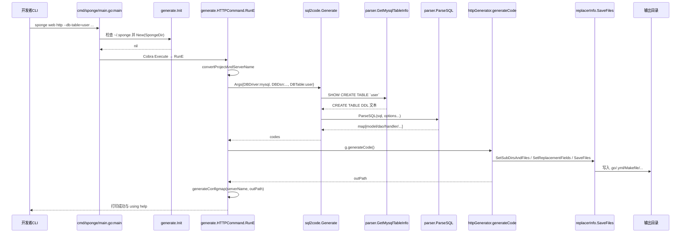
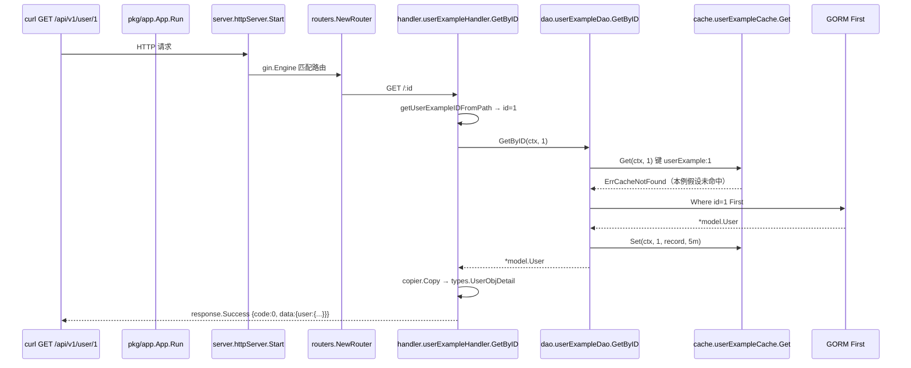

# 简单例子：从 `user` 表生成 HTTP 服务并查询一条记录

> 状态：待复核生成稿
> 生成日期：2026-08-16
> 基准提交：`23807238c62e0f3b3e2d9a341bbef50547d3f5ec`
> 工作区：dirty
> 源码范围：`cmd/sponge/`、`pkg/sql2code/`、`pkg/replacer/`、`cmd/serverNameExample_httpExample/`、`internal/handler/`、`internal/dao/`、`internal/cache/`、`internal/routers/`、`test/auto-test/files/1_web_http.sh`
> 生成方式：源码、测试、配置与部署资产静态分析

## 快速摘要

### 架构总览（模块与依赖）

本例只走一条真实主路径：**用 MySQL 表 `user` 生成一套 HTTP CRUD Web 服务，再 `GET /api/v1/user/1`。**

涉及模块：

- 工具入口：`cmd/sponge/main.go`、`commands.HTTPCommand`
- 元数据引擎：`pkg/sql2code.Generate` → `parser.ParseSQL`
- 模板写入：`httpGenerator.generateCode` → `pkg/replacer.SaveFiles`
- 生成项目：`cmd/serverNameExample_httpExample` 模板变成 `cmd/user`；`internal/handler` → `dao` → `cache`/`database`

UI（`sponge run`）不是另一套算法，它只是用 `gobash.Run` 再执行同一条 CLI。

### 核心调用序列（逐步逻辑）

1. `main` → `generate.Init` → `HTTPCommand.RunE`
2. `sql2code.Generate` → `parser.GetMysqlTableInfo`（`SHOW CREATE TABLE`）→ `parser.ParseSQL`
3. `httpGenerator.generateCode` → `replacer.SaveFiles`
4. 生成项目 `main` → `InitApp` → `CreateServices` → `app.Run`
5. `GET /api/v1/user/1` → `handler.GetByID` → `dao.GetByID` → cache/db → `response.Success`

### 易错点与边界条件

- 未 `sponge init` 时生成命令直接返回，不会进入 `RunE`。
- 输出目录已有同名文件时，`SaveFiles` **整批取消**，不会覆盖。
- 本篇只走主成功路径：单表、MySQL、非 Mongo、非 extended-api、非 mono-repo、缓存未命中后回源成功。
- 失败、重试、主键变体放到 [03-详细逐步说明-主链路拆解.md](03-详细逐步说明-主链路拆解.md)。

---

## 为什么选这个例子（Why）

仓库自动测试的第一份脚本就是它：`test/auto-test/files/1_web_http.sh`。它先调用 `sponge web http`，再 `make docs`、`make run`，最后 `curl GET /api/v1/user/1`。

这正好覆盖 Sponge 的核心价值：

1. 定义在数据库里（一张 `user` 表）。
2. 工具把定义变成可运行工程。
3. 生成出的服务用标准 HTTP JSON 把记录返回给调用方。

没有前端业务页面时，**CLI 就是客户端**；UI 只是同一条命令的外壳。

## 例子是什么（What）

脱敏后的命令（与自动测试相同，DSN 密码已替换）：

```bash
sponge web http \
  --module-name=user \
  --server-name=user \
  --project-name=edusys \
  --db-driver=mysql \
  --db-dsn='root:******@(127.0.0.1:3306)/account' \
  --db-table=user \
  --out=./auto-01-web-http
```

假设 MySQL 里已有与 `pkg/sql2code/sql2code_test.go` 中 `sqlData` 同类的表：

```sql
CREATE TABLE `user` (
  `id` bigint unsigned NOT NULL AUTO_INCREMENT,
  `created_at` datetime DEFAULT NULL,
  `updated_at` datetime DEFAULT NULL,
  `deleted_at` datetime DEFAULT NULL,
  `name` char(50) NOT NULL COMMENT 'username',
  `password` char(100) NOT NULL COMMENT 'password',
  `email` char(50) NOT NULL COMMENT 'email',
  `phone` bigint unsigned NOT NULL COMMENT 'phone number',
  `age` tinyint NOT NULL COMMENT 'age',
  `gender` tinyint NOT NULL COMMENT 'gender, 1:male, 2:female, 3:unknown',
  PRIMARY KEY (`id`),
  UNIQUE KEY `user_email_uindex` (`email`)
);
```

期望副作用：

- 当前目录出现 `auto-01-web-http/`（完整 Go 工程）。
- 终端打印 `generate user's web server code successfully, out = ...`
- 之后在该目录 `make run`，`GET http://localhost:8080/api/v1/user/1` 返回 `code=0` 的 JSON。

## 全路径时序图

节点使用真实文件与函数。分两段：生成期、运行期。



生成项目启动后：



说明：模板源码里类型名仍是 `UserExample`；生成时 `replacer` 会把 `UserExample` 替换成表名驼峰 `User`。下面为了能在本仓库里跟读，函数名仍写仓库里的真实符号。

## 逐步走读（How，只走成功）

### 第 0 步：前置条件

`cmd/sponge/main.go:main` 一开始就调用 `generate.Init()`（`cmd/sponge/commands/generate/init.go`）。

成功条件：`SpongeDir`（`用户家目录/.sponge`）已存在。`Init` 把 `replacer.New(SpongeDir)` 放进全局 `Replacers["sponge"]`。

若目录不存在且当前命令不是 `sponge` / `sponge -h` / `sponge init`，返回：

```text
⚠ not yet initialized, run the command "sponge init"
```

`sponge init` 本身走 `commands.InitCommand` → `runUpgrade("latest")` 下载模板，再检查并安装插件。本例假设这一步已经做过。

证据：`generate.isShowCommand` 用 `os.Args` 判断是否放行。

### 第 1 步：Cobra 找到 `web http`

`main` 调用 `commands.NewRootCMD().Execute()`。

`cmd/sponge/commands/root.go:NewRootCMD` 注册：

- `InitCommand`、`UpgradeCommand`、`PluginsCommand`
- `GenWebCommand`、`GenMicroCommand`
- `generate.ConfigCommand`、`OpenUICommand`、`MergeCommand`、`PatchCommand`
- `GenGraphCommand`、`TemplateCommand`、`AssistantCommand`、`PerftestCommand`

`cmd/sponge/commands/web.go:GenWebCommand` 再挂上 `generate.HTTPCommand()`。

用户输入的 `sponge web http ...` 最终进入 `cmd/sponge/commands/generate/http.go` 里 `RunE`。

### 第 2 步：解析参数并拆表名

`HTTPCommand` 绑定的关键 flags（成功路径取值）：

| Flag | 变量 | 本例值 |
|---|---|---|
| `--module-name` / `-m` | `moduleName` | `user` |
| `--server-name` / `-s` | `serverName` | `user` |
| `--project-name` / `-p` | `projectName` | `edusys` |
| `--db-driver` / `-k` | `sqlArgs.DBDriver` | `mysql`（默认） |
| `--db-dsn` / `-d` | `sqlArgs.DBDsn` | `root:******@(127.0.0.1:3306)/account` |
| `--db-table` / `-t` | `dbTables` | `user` |
| `--out` / `-o` | `outPath` | `./auto-01-web-http` |
| `--embed` / `--extended-api` / `--suited-mono-repo` | 布尔 | 全 false（本例） |

`RunE` 把 `dbTables` 按逗号拆分。本例只有一张表，所以：

- `firstTable = "user"`
- `handlerTableNames` 为空，后面的 `handlerGenerator` 循环不会执行

然后 `convertProjectAndServerName`：

- 拒绝 `serverName` 以 `-test` / `_test` 结尾
- `serverName` 中的 `-` 换成 `_`
- `projectName` 转 kebab-case（`edusys` 不变）

本例 `sqlArgs.DBDriver != mongodb`，不会把 `IsEmbed` 强制改 false。

### 第 3 步：从数据库取出 DDL

`sqlArgs.DBTable = firstTable` 后调用：

```go
codes, err := sql2code.Generate(&sqlArgs)
```

`pkg/sql2code/sql2code.go:Generate`：

1. `args.checkValid()`：DSN+表名已给，通过。MySQL 驱动默认就是 `mysql`。
2. `getSQL(args)`：`SQL` 和 `DDLFile` 都为空，走 `DBDsn` 分支。
3. `dbDriverName == mysql` 时调用 `utils.AdaptiveMysqlDsn`（只去掉可能的 `mysql://` 前缀），再调用 `parser.GetMysqlTableInfo(dsn, "user")`。

`pkg/sql2code/parser/mysql.go:GetMysqlTableInfo`：

- `sql.Open("mysql", dsn)`
- 执行 `SHOW CREATE TABLE \`user\``
- `rows.Scan(&table, &info)`，返回 `info`（DDL 字符串）

回到 `Generate`：`parser.ParseSQL(sql, opt...)`，`setOptions` 根据 Args 打开 `JSONTag`、`GormType`、`Package=model` 等。本例 `IsExtendedAPI=false`、`IsEmbed=false`。

测试证据：`pkg/sql2code/sql2code_test.go` 用内嵌 SQL 调用 `GenerateOne` / `Generate`，不断开真实库；从 DB 拉取的用例在测试里被注释掉。自动测试脚本才会连真实 MySQL。

### 第 4 步：DDL 变成代码片段 map

`pkg/sql2code/parser/parser.go:ParseSQL`：

1. `initTemplate()` / `initCommonTemplate()` 准备 `text/template`。
2. `parser.New().Parse(sql, charset, collation)` 得到 AST。
3. 对每个 `*ast.CreateTableStmt` 调用 `makeCode`。
4. 拼出 `map[string]string`：

| Key（常量） | 用途 |
|---|---|
| `parser.CodeTypeModel` (`"model"`) | 插入 `internal/model/userExample.go` 的结构体 |
| `parser.CodeTypeDAO` (`"dao"`) | 插入 DAO 里 `// todo generate the update fields code to here` |
| `parser.CodeTypeHandler` (`"handler"`) | 插入 types 请求/响应结构体 |
| `parser.CodeTypeJSON` | JSON 形态（本命令主路径不直接写文件） |
| `parser.CodeTypeProto` / `CodeTypeService` | HTTP 命令不用，给 gRPC/proto 生成器用 |
| `parser.TableName` (`"__table_name__"`) | 表名驼峰，本例为 `User` |
| `parser.CodeTypeCrudInfo` | JSON，用来判断是否走 `.tpl` 通用主键风格 |
| `parser.CodeTypeTableInfo` | 表信息 JSON |

本例主键是标准 `id` + 整型，`crudInfo.CheckCommonType()` 为 false，因此 `httpGenerator` **不会**切换到 `userExample.go.tpl` 那一套通用模板，而是用默认的 `userExample.go` 文件，再用标记替换写入片段。

### 第 5 步：选模板文件并替换落盘

`HTTPCommand.RunE` 构造 `httpGenerator`，调用 `g.generateCode()`。

`generateCode` 关键动作（成功路径）：

1. `replacer.New(SpongeDir)` 列出 `~/.sponge` 下全部文件。
2. 指定子目录：`cmd/serverNameExample_httpExample`、`sponge/configs`、`sponge/deployments`、`sponge/scripts`。
3. 指定根文件：`.gitignore`、`.golangci.yml`、`go.mod`、`go.sum`、`Jenkinsfile`、`Makefile-for-http`、`README.md`。
4. `selectFiles` 点名 `internal/cache|dao|handler|model|routers|server|types|ecode|config|database` 和 `docs/docs.go`。
5. `SetSelectFiles("mysql", selectFiles)` 把 `internal/database` 设为 `init.go`、`redis.go`、`mysql.go`。
6. 忽略 `cmd/sponge` 以及若干脚本。
7. `SetOutputDir("./auto-01-web-http", ...)`：因为 `outPath` 非空，就用该绝对路径。
8. `addFields` 组装几十条 `replacer.Field`，其中与本例直接相关的：

| Old | New |
|---|---|
| `// todo generate model code to here` 所在块 | `codes["model"]` |
| `// todo generate the update fields code to here` | `codes["dao"]` |
| `// todo generate the request and response struct to here` | `adjustmentOfIDType(codes["handler"], "mysql", false)` |
| `github.com/go-dev-frame/sponge` | `user`（moduleName） |
| `user/pkg` | `github.com/go-dev-frame/sponge/pkg`（避免把公共库也改成新 module） |
| `serverNameExample` | `user` |
| `UserExample`（大小写敏感拆成两种） | `User` |
| `_httpExample` | 空字符串，于是 `cmd/serverNameExample_httpExample` → `cmd/user` |
| 示例 DSN | 用户传入的 DSN |
| `Makefile-for-http` | `Makefile` |

`deleteFieldsMark` 会删掉 `// delete the templates code start` 到 `end` 之间的示例字段，避免和刚插入的生成代码重复。

9. `r.SetReplacementFields(fields)`：`IsCaseSensitive` 的字段会拆成首字母大小写两条。
10. `r.SaveFiles()`（`pkg/replacer/replacer.go`）：
    - 读每个模板文件
    - 对内容做 `bytes.ReplaceAll`
    - 对路径和文件名同样替换
    - 若目标文件已存在，返回错误并 **取消全部写入**
    - 否则 `saveToNewFile`

11. `saveGenInfo` 写入 `docs/gen.info`，内容形如 `user,user,false`（module、server、是否 mono-repo）。后续增量生成会读这个文件。

`RunE` 最后调用 `generateConfigmap("user", outPath)`：把 `configs/user.yml` 填进 `deployments/kubernetes/user-configmap.yml` 的标记处。失败被 `_ =` 忽略，不阻断主流程。

终端输出（成功）：

```text
using help:
  1. open a terminal and execute the command to generate the swagger documentation: make docs
  2. compile and run server: make run
  3. access http://localhost:8080/swagger/index.html in your browser, and test the http CRUD api.

generate user's web server code successfully, out = /.../auto-01-web-http
```

### 第 6 步：UI 入口如何接到同一条链

若用户走 `sponge run` 而不是 CLI：

1. `commands.OpenUICommand` 默认端口 `24631`，调用 `server.RunHTTPServer`。
2. 前端 POST `/api/v1/generate`，body 为 `GenerateCodeForm{Arg, Path}`。
3. `handleGenerateCode` 把 `Arg` 按空格拆成 args，追加 `--out=<临时目录>`，然后：

```go
result := gobash.Run(ctx, "sponge", args...)
```

4. 成功则把输出目录打 zip，`c.File(zipFile)` 下载；5 秒后后台删除临时目录。

因此 UI 与 CLI **共享** `HTTPCommand.RunE` 之后的全部逻辑。本例以 CLI 为准，避免把前端静态资源细节提前堆进来。

### 第 7 步：生成项目启动

用户在输出目录执行 `make run`（模板 `Makefile-for-http` 已被改名为 `Makefile`）。进程入口对应本仓库：

`cmd/serverNameExample_httpExample/main.go`（生成后为 `cmd/user/main.go`）：

```go
initial.InitApp()
services := initial.CreateServices()
closes := initial.Close(services)
a := app.New(services, closes)
a.Run()
```

`InitApp`（`cmd/serverNameExample_httpExample/initial/initApp.go`）：

1. 读 YAML 配置到 `internal/config`
2. `logger.Init`
3. 可选 `tracer.InitWithConfig`、`stat.Init`
4. `database.InitDB()` → 本例 MySQL 走 `InitMysql()`
5. `database.InitCache(cfg.App.CacheType)`（配置为空则不建缓存）

`CreateServices` 读取 `cfg.HTTP.Port`（模板默认 8080），调用 `server.NewHTTPServer`。

`pkg/app.App.Run` 用 `errgroup` 启动所有 `IServer.Start`，并监听 SIGINT/SIGTERM 做优雅退出。

`server.httpServer.Start` 调用 `httpsrv.Server.Run()`，即 `http.Server.ListenAndServe`。

### 第 8 步：`GET /api/v1/user/1` 成功返回

路由注册发生在包 `init`：

`internal/routers/userExample.go`：

```go
func init() {
    apiV1RouterFns = append(apiV1RouterFns, func(group *gin.RouterGroup) {
        userExampleRouter(group, handler.NewUserExampleHandler())
    })
}
```

`NewRouter` 创建 `gin.Engine`，挂 recovery/cors/timeout/request-id/logging，再 `registerRouters(r, "/api/v1", apiV1RouterFns)`。

生成替换后路由为：

```text
GET /api/v1/user/:id  →  handler.GetByID
```

`GetByID` 成功路径：

1. `getUserExampleIDFromPath`：`c.Param("id")` → `utils.StrToUint64E` → `1`
2. `middleware.WrapCtx(c)` 把 request-id 等放入 `context.Context`
3. `h.iDao.GetByID(ctx, 1)`
4. DAO 若 `cache==nil`：直接 `db.Where("id = ?", 1).First`
5. DAO 若有 cache：先 `cache.Get`；`ErrCacheNotFound` 时用 `singleflight.Group.Do` 查库，成功则 `cache.Set(..., 5*time.Minute)`
6. `copier.Copy` 到 `types.UserExampleObjDetail`（生成后为 `UserObjDetail`）
7. `response.Success(c, gin.H{"userExample": data})`  
   注意：`Success` 使用 HTTP 200，body 里 `code` 为 **0**，不是 HTTP 状态码。`userExample` 这个 JSON 键也会被大小写敏感替换成 `user`。

脱敏后的成功响应形态：

```json
{
  "code": 0,
  "msg": "ok",
  "data": {
    "user": {
      "id": 1,
      "name": "foo",
      "email": "foo@example.com",
      "phone": "13800000000",
      "age": 20,
      "gender": 1
    }
  }
}
```

Handler 单测 `internal/handler/userExample_test.go:Test_userExampleHandler_GetByID` 用 `sqlmock` 期望 `SELECT` 返回 `id=1`，再用 `httpcli.Get` 断言 `result.Code == 0`。它不启动真实 MySQL，但验证了 handler→dao 这条成功契约。

自动测试 `1_web_http.sh` 在真实生成项目上执行：

```bash
curl -X GET http://localhost:8080/api/v1/user/1
```

（脚本变量 `mysqlTable="user"`。）

## 关键调用关系表（本例）

| 调用方文件与符号 | 关系 | 被调用方文件与符号 | 触发与输入 | 返回与后续处理 | 错误、状态与副作用 |
|---|---|---|---|---|---|
| `cmd/sponge/main.go:main` | 调用 | `generate.Init` | 进程启动 | 初始化 `Replacers["sponge"]` | `~/.sponge` 缺失则打印错误并 return |
| `main` | 调用 | `commands.NewRootCMD().Execute` | 用户 CLI | 分发到 `HTTPCommand.RunE` | Cobra 错误则 `os.Exit(1)` |
| `HTTPCommand.RunE` | 调用 | `sql2code.Generate` | `Args` 含 DSN 与表名 | `map[string]string` 代码片段 | 连库失败则返回，不写文件 |
| `sql2code.Generate` | 调用 | `parser.GetMysqlTableInfo` | 适配后的 DSN、`user` | DDL 字符串 | 表不存在则错误 |
| `sql2code.Generate` | 调用 | `parser.ParseSQL` | DDL + Option | codes map | SQL 解析失败则错误 |
| `HTTPCommand.RunE` | 调用 | `httpGenerator.generateCode` | codes、模块名、驱动 | 输出目录路径 | replacer 失败则返回 |
| `httpGenerator.generateCode` | 调用 | `replacerInfo.SaveFiles` | 已设 Field 与文件列表 | 写入磁盘 | 目标已存在则整批取消 |
| `HTTPCommand.RunE` | 调用 | `generateConfigmap` | serverName、outPath | 改 k8s configmap | 错误被忽略 |
| `cmd/.../main.go:main` | 调用 | `initial.InitApp` | 进程启动 | 日志/DB/缓存就绪 | 配置或连库失败则 panic |
| `CreateServices` | 调用 | `server.NewHTTPServer` | `":" + port` | `app.IServer` | 无 |
| `httpServer.Start` | 调用 | `httpsrv.Server.Run` | 监听地址 | 阻塞服务 | Listen 失败向上返回 |
| `userExampleRouter` | 注册 | `handler.GetByID` | `GET /:id` | Gin 命中后调用 | 无 |
| `GetByID` | 调用 | `dao.GetByID` | `ctx, id` | `*model.UserExample` | not found → `ecode.NotFound`；其它 → 500 |
| `dao.GetByID` | 调用 | `cache.Get` / `db.First` | id | 记录 | 未命中回源；回源成功写缓存 |

## 本篇故意点到为止的分支

- 多表：`handlerTableNames` 会对第 2 张表起再跑 `handlerGenerator`。
- `--extended-api=true`：额外生成 DeleteByIDs / GetByCondition / ListByIDs / ListByLatestID，自动测试脚本开了这个开关，本例为降低噪声关掉。
- MongoDB：换 `.mgo` 文件，且 `IsEmbed` 被强制 false。
- 非标准主键：`CheckCommonType()` 为 true 时改用 `.tpl` 文件。
- `suited-mono-repo`：输出路径和 go.mod 处理不同。
- GetByID 的 id=0、记录不存在、缓存占位符、copier 失败。
- UI zip、跨域、临时目录清理。

这些在第三层按跳拆开。

## 阅读源码建议顺序

1. `test/auto-test/files/1_web_http.sh`（先看期望行为）
2. `cmd/sponge/main.go` → `commands/generate/http.go` 的 `RunE`
3. `pkg/sql2code/sql2code.go` → `parser/mysql.go` → `parser/parser.go:ParseSQL`
4. `http.go:generateCode` → `pkg/replacer/replacer.go:SaveFiles`
5. `cmd/serverNameExample_httpExample/main.go` → `internal/routers/userExample.go` → `handler.GetByID` → `dao.GetByID`

## 重新实现检查清单

- [ ] 用同一组 flags 能从 `SHOW CREATE TABLE` 得到 DDL，再得到至少包含 `model`/`dao`/`handler`/`__table_name__` 的 map。
- [ ] 能把模板目录中的 `serverNameExample` / `UserExample` / `_httpExample` 替换成用户值并写出可编译工程。
- [ ] 目标文件已存在时取消生成，而不是覆盖。
- [ ] 生成项目 `GET /api/v1/<table>/{id}` 在记录存在时返回 HTTP 200 且 body.`code` 为 0。
- [ ] UI 路径若要实现，必须是“拼 CLI 参数 + 执行 sponge + zip”，而不是第二套生成器。

上一篇：[01-简单框架-系统骨架.md](01-简单框架-系统骨架.md)  
下一篇：[03-详细逐步说明-主链路拆解.md](03-详细逐步说明-主链路拆解.md)
