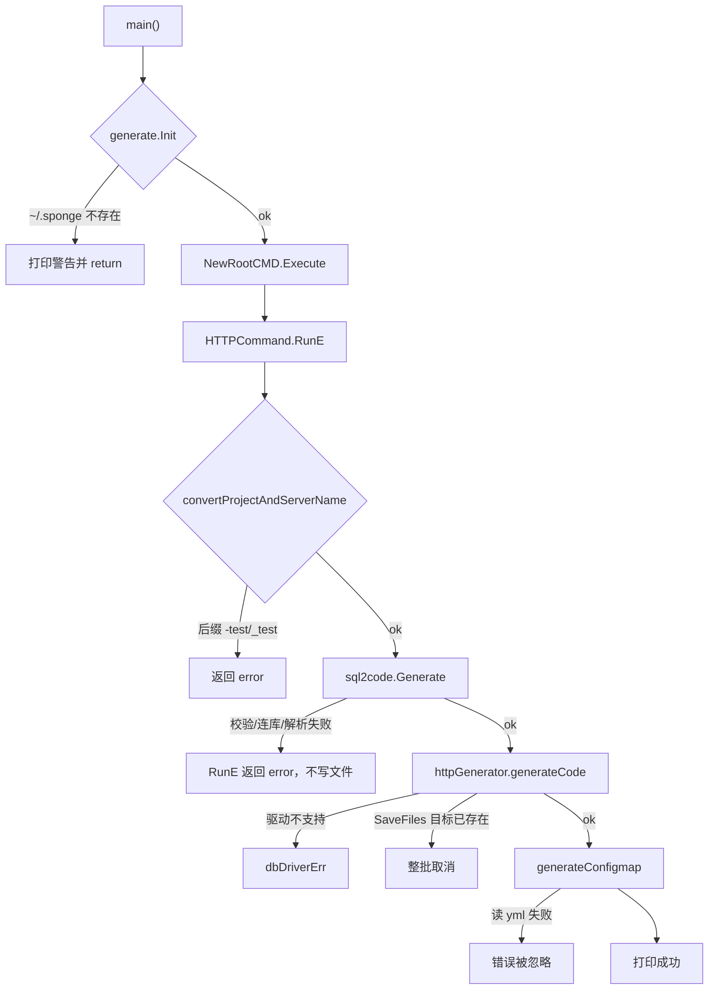
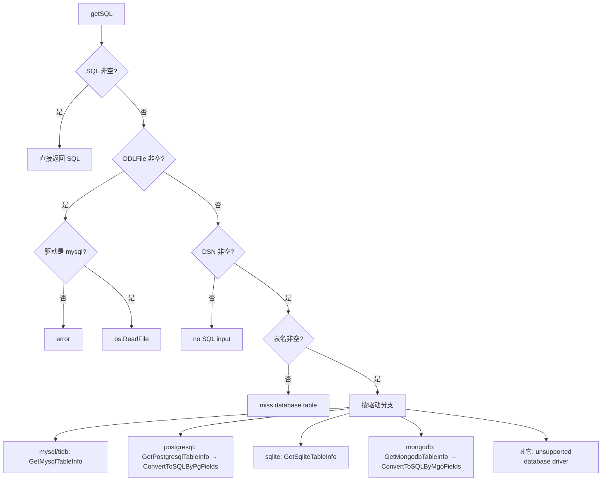
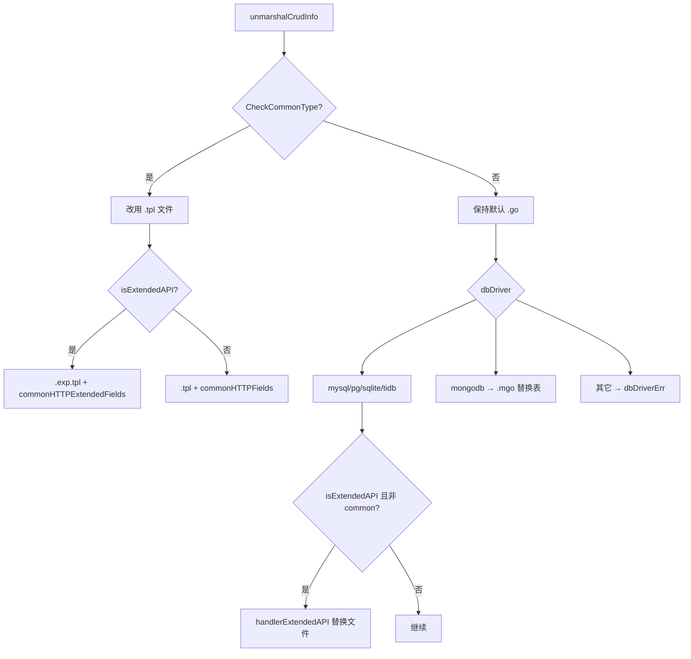
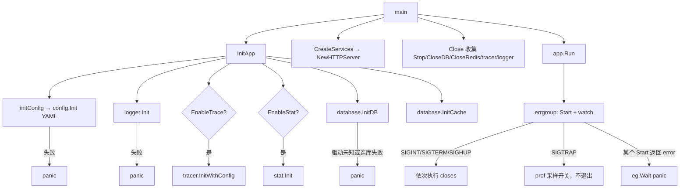
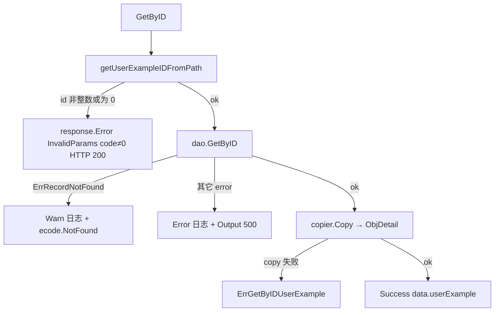
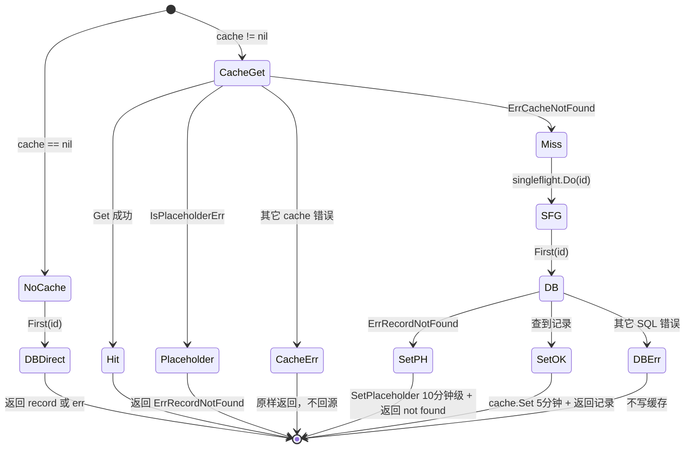

# 详细逐步说明：主链路拆解

> 状态：待复核生成稿
> 生成日期：2026-08-16
> 基准提交：`23807238c62e0f3b3e2d9a341bbef50547d3f5ec`
> 工作区：dirty
> 源码范围：`cmd/sponge/main.go`、`cmd/sponge/commands/generate/{init,http,common}.go`、`pkg/sql2code/`、`pkg/replacer/`、`cmd/serverNameExample_httpExample/`、`internal/{handler,dao,cache,database,routers,server}`、`pkg/app`、`pkg/httpsrv`、`pkg/gin/{middleware,response}`
> 生成方式：源码、测试、配置与部署资产静态分析

## 快速摘要

### 架构总览（模块与依赖）

本篇把 [02-简单例子-全路径走读.md](02-简单例子-全路径走读.md) 的同一条例子按跳拆开，仍只围绕：

1. **生成链**：`sponge web http` → sql2code → replacer → 磁盘。
2. **运行链**：`make run` 后 `GET /api/v1/user/{id}` → handler → dao → cache/db → JSON。

不在这里倾倒 `micro rpc`、AI assistant、全部 `pkg` 子包；那些属于第四层。

### 核心调用序列（逐步逻辑）

生成链 10 跳：`main` → `Init` → `RunE` 参数处理 → `Generate` → `getSQL` → `ParseSQL/makeCode` → 选模板 → `addFields` → `SaveFiles` → `generateConfigmap`。

运行链 10 跳：`InitApp` → `CreateServices` → `app.Run` → `httpServer.Start` → `NewRouter` → 中间件 → `GetByID` → `dao.GetByID` → cache/db 分支 → `response.Success/Error`。

### 易错点与边界条件

- `SaveFiles` 先收集全部写入再落盘；任一目标已存在则整批取消。
- GetByID 的“找不到”有两条：SQL `ErrRecordNotFound`，以及缓存占位符 `ErrPlaceholder`。
- `code` 字段：业务错误走 HTTP 200 + body.code≠0；系统错误才用 `response.Output` 改 HTTP 状态码。
- `generateConfigmap` 失败被故意忽略，生成仍算成功。

---

## 本篇怎么读

第二层已经能跟读成功路径。本篇对每一跳补四件事：谁调用谁、参数怎么传、返回值怎么用、错误/状态/副作用。每跳先给正常，再给失败与边界。

---

## 一、生成链逐步拆解

### 总流程图（含失败出口）



### 跳 1：进程入口 `main`

| 项目 | 内容 |
|---|---|
| 文件 | `cmd/sponge/main.go` |
| 符号 | `main` |
| 调用 | `generate.Init()`，成功后再 `commands.NewRootCMD().Execute()` |
| 输入 | `os.Args` |
| 成功 | Cobra 分发到子命令 |
| 失败 | `Init` 失败：打印错误并 **return（退出码 0）**；`Execute` 失败：`PrintErrln` 后 `os.Exit(1)` |

边界：`Init` 失败不会 `os.Exit(1)`。这与 `Execute` 失败不对称。推断：设计上把“未初始化”当成可提示的使用错误，而不是命令执行失败。

### 跳 2：`generate.Init` 与模板目录

| 项目 | 内容 |
|---|---|
| 文件 | `cmd/sponge/commands/generate/init.go` |
| 符号 | `Init`、`isShowCommand`、`SpongeDir` |
| `SpongeDir` | `os.UserHomeDir() + delimiter + ".sponge"` |
| 成功 | `Replacers[TplNameSponge] = replacer.New(SpongeDir)` |
| 失败 | 目录不存在且 `isShowCommand()==false` → 返回 `not yet initialized` |
| 恐慌 | 若 `Replacers["sponge"]` 已存在，`panic`（正常 CLI 不会重复 Init） |

`isShowCommand` 放行条件：

- `len(os.Args)==1`（只输入 `sponge`）
- `len==2` 且为 `init` 或 `-h`
- `len>2` 且前三个参数拼起来包含 `"init"`（覆盖 `sponge init` 带额外参数）

边界：`sponge version`、`sponge web -h` 在 `len==2` 且不是 `init`/`-h` 时 **不会** 被放行，仍要求模板目录存在。`web http -h` 因为 `len>2` 且不含 `init`，同样要求已 init。待确认：Cobra 的 `-h` 是否在 `RunE` 前就返回；若是，则 `Init` 仍会先执行。

副作用：`init()` 里 `rand.Seed(time.Now().UnixNano())`，供后续错误码序号 `rand.Intn(99)+1` 使用。

### 跳 3：`HTTPCommand.RunE` 参数与表名拆分

文件：`cmd/sponge/commands/generate/http.go`。

必填 flags：`module-name`、`server-name`、`project-name`、`db-dsn`、`db-table`。缺任何一个，Cobra 在进入 `RunE` 前报错。

表名拆分：

```text
"user"        → firstTable=user，不再跑 handlerGenerator
"user,order"  → firstTable=user 生成整工程；order 再跑 handlerGenerator 往同一 outPath 追加 handler/dao/cache
"" 元素       → continue 跳过
```

`convertProjectAndServerName`（`generate/common.go`）：

- 输入 `serverName` 后缀 `-test` 或 `_test` → 返回 error，整次生成停止。
- `serverName`：`-` → `_`（例如 `user-api` → `user_api`）。
- `projectName`：`xstrings.ToKebabCase`。

Mongo 分支：`sqlArgs.DBDriver == mongodb` 时强制 `sqlArgs.IsEmbed = false`。原因：Mongo 模板不嵌入 `gorm.Model`。

`suitedMonoRepo==true`：`changeOutPath` 把输出改到以 serverName 为名的目录，且 `selectFiles` 会去掉 `go.mod`/`go.sum`（由 mono-repo 根模块提供）。

### 跳 4：`sql2code.Generate` 校验

文件：`pkg/sql2code/sql2code.go`。

`Args.checkValid`：

| 条件 | 结果 |
|---|---|
| `SQL`、`DDLFile`、`(DSN 且 Table)` 都空 | `you must specify sql or ddl file` |
| 任一表名后缀 `_test` | 拒绝 |
| `DBDriver==""` | 默认 `mysql` |
| `DBDriver==sqlite` 且本地文件不存在 | `sqlite db file ... not found` |

优先级：`SQL` 文本 > `DDLFile` > `DBDsn+DBTable`。CLI 的 `web http` 走第三档。

`DDLFile` 仅支持 MySQL 驱动；其它驱动读 SQL 文件会报 `not support driver`。

### 跳 5：`getSQL` 连库取 DDL



MySQL 成功路径：

1. `utils.AdaptiveMysqlDsn`：去掉 `mysql://` 前缀，其它格式原样。
2. `parser.GetMysqlTableInfo`：`sql.Open` → `SHOW CREATE TABLE \`user\`` → `Scan` 第二列。
3. 无下一行：`not found found table 'user'`（原文双写 found，属于源码笔误）。
4. `Generate` 若得到空 sql：`get sql from mysql error, maybe the table user doesn't exist`。

PostgreSQL / Mongo 会额外返回 `fieldTypes` map，写回 `args.fieldTypes`，再通过 `parser.WithFieldTypes` 进入类型映射。这是因为它们先抽列信息，再合成伪 DDL，原始类型不能只靠 MySQL AST。

错误传播：全部以 `error` 返回 `RunE`，Cobra 打印后进程退出码 1。此时 **尚未创建 `httpGenerator`，磁盘无输出**。

测试缺口：`sql2code_test.go` 的“从 DB 取 SQL”用例被注释；连库失败路径依赖自动测试环境，本任务未运行。

### 跳 6：`ParseSQL` / `makeCode`

文件：`pkg/sql2code/parser/parser.go`。

`ParseSQL`：

1. 初始化内置 `text/template`。
2. `github.com/zhufuyi/sqlparser/parser` 解析 DDL。解析失败（非法 SQL）直接返回。
3. 只处理 `*ast.CreateTableStmt`。其它语句（`INSERT`、`ALTER`）被静默跳过。
4. 若没有任何 CreateTable，后续 `modelStructCodes` 为空，仍会返回 map，但 model 代码几乎是空包。推断：CLI 连库路径通常恰好一条 CREATE TABLE。

`makeCode` 关键决策：

| 决策 | 代码 | 本例 `user` 表结果 |
|---|---|---|
| 结构体名 | `toCamel(rawTableName)` | `User` |
| 是否生成 `TableName()` | 前缀剥离、`ForceTableName`、或表名不是英语复数 | `user` 不是 `users`，会生成 |
| 主键 | constraint 中 PrimaryKey；否则 `*_id`；否则第一个整型/字符串列；否则第一列 | `id` |
| `IsCommonType` | `!mongodb && !embed && !isIDPrimaryKey()` | `id` 为整型 → false |
| 无列 | `no columns found in table` | 不会发生 |

JSON 名：`JSONNamedType==1`（CLI 默认）用 camelCase（`loginAt`）；`0` 用 snake_case。

GORM tag：`column:` + 列名；`GormType==true` 时追加 `;type:` + `InfoSchemaStr()`。

空列与可空：`NullStyle` 在 CLI 路径默认 `NullDisable`（`setOptions` 在 `NullStyle==""` 时设置），因此 SQL `NULL` 列仍生成非 sql.Null* 的普通 Go 类型。这与 `defaultOptions.NullStyle=NullInSql` 不同：CLI 显式覆盖了默认。重新实现时必须跟 CLI 的 `setOptions`，不能只看 `defaultOptions`。

`opt.IsCustomTemplate==true` 时 `makeCode` 只返回 `tableInfo` JSON，不渲染 model/dao/handler。`web http` 不会开这个开关；自定义模板命令会。

返回 map 后，`HTTPCommand` 把 `codes` 交给 `httpGenerator`。`TableName` 键用于替换 `UserExample`。

### 跳 7：模板选择与变体

`generateCode` 里 `selectFiles` 默认指向无后缀的 `userExample.go`。然后：



本例：`CheckCommonType()==false`、`extended-api==false`、`mysql` → 使用 `internal/handler/userExample.go` 等默认文件，并把 `internal/server` 选为 `http.go.noregistry`（生成 HTTP 单体默认不带注册中心，随后字段把文件名改回 `http.go`）。

`SetSelectFiles("mysql")` 追加 `internal/database/{init.go,redis.go,mysql.go}`。

忽略：`cmd/sponge` 整个目录，以及 `scripts/protoc.sh` 等与纯 HTTP 无关的脚本。

### 跳 8：`addFields` 替换语义

三类 Field：

1. **标记替换**：把 `// todo generate ... here` 换成 sql2code 片段。
2. **标记删除**：`deleteFieldsMark` 读取文件，找到 start/end 标记之间的字节，把这段变成空 `New`，从而删掉模板里的示例字段。
3. **全局字符串替换**：module 路径、服务名、表名、DSN、Dockerfile 片段。

关键顺序与陷阱：

- `github.com/go-dev-frame/sponge` 先被换成 `g.moduleName`（本例 `user`），紧接着 `user/pkg` 再被换回 `github.com/go-dev-frame/sponge/pkg`。顺序不能反：否则生成项目会错误地依赖 `user/pkg/...`。
- `UserExample` 设置了 `IsCaseSensitive: true`，`SetReplacementFields` 会拆成 `UserExample→User` 与 `userExample→user`。JSON 键 `"userExample"`、路由 `/userExample`、错误码名都会一起变。
- `_httpExample` → 空字符串，必须在路径替换阶段生效，才能把 `cmd/serverNameExample_httpExample` 变成 `cmd/user`。
- `adjustmentOfIDType`：Mongo 把详情里的 ID 改成 `string`；非 common style 把 ByIDRequest / ObjDetail 的 ID 统一成 `uint64`。本例走后一条。

`deleteFieldsMark` 依赖模板文件里确实存在成对标记。若用户改过 `~/.sponge` 弄丢标记，删除不会发生，生成代码可能重复字段。推断：这是模板完整性契约。

### 跳 9：`SaveFiles` 事务性落盘

文件：`pkg/replacer/replacer.go`。

算法：

1. 遍历已过滤的 `r.files`。
2. 读字节（本地 `os.ReadFile` 或 embed FS）。
3. 对内容逐条 `bytes.ReplaceAll`。
4. 计算新路径，并对路径中的 Old/New 再替换。
5. 若 `gofile.IsExists(newFilePath)`，记入 `existFiles`，**仍继续扫描**，不立刻返回。
6. 全部扫描完：若 `existFiles` 非空，返回错误列表，**一个文件都不写**。
7. `isForbiddenFile`：禁止写回模板源目录（防止把生成结果写进 `~/.sponge`）。
8. 逐文件 `saveToNewFile`（创建父目录并写入）。

失败语义：这是“检测后整批取消”，不是数据库事务；若第 8 步写到一半磁盘满，前面的文件不会回滚。重新实现时若要更强保证，需要额外临时目录+rename。

`SetOutputDir`：`outPath` 为空时，在 cwd 生成 `serverName_http_HHMMSS`。本例指定了 `--out`，使用绝对路径。

测试证据：`pkg/replacer/replacer_test.go` 覆盖本地目录替换与忽略规则。未宣称本任务已运行该测试。

### 跳 10：收尾副作用

| 调用 | 失败时 | 副作用 |
|---|---|---|
| `saveGenInfo` | `generateCode` 里 `_ =`，忽略 | `docs/gen.info` = `module,server,false` |
| `generateConfigmap` | `RunE` 里 `_ =`，忽略 | k8s configmap 嵌入 YAML |
| `fmt.Printf` using help | 无 | 提示 `make docs` / `make run` |

多表时：`RunE` 对 `handlerTableNames` 再构造 `handlerGenerator`，`outPath` 传入同一目录。`handlerGenerator` 只追加 CRUD 文件，不再复制整份 `cmd/` 骨架。失败会让已经写好的第一张表工程留在磁盘上（非原子）。

---

## 二、运行链逐步拆解

以下假设生成已完成，进程在输出目录启动。符号仍用本仓库模板名 `UserExample`，生成后请自行替换为 `User`。

### 启动与关闭流程图



### 跳 11：`InitApp` 与配置

文件：`cmd/serverNameExample_httpExample/initial/initApp.go`。

`initConfig`：

- `-c` 指定配置文件；空则 `configs.Location("serverNameExample.yml")`（生成后文件名随 serverName 变）。
- `config.Init` 失败 → `panic`。没有重试。

随后：

- `logger.Init`：level/format/是否落盘。失败 panic。
- `EnableTrace`：Jaeger agent host/port + sampling rate。
- `EnableStat`：CPU/内存打印；`WithAlarm` 在 Windows 上无效（代码注释）。
- `database.InitDB`：按 `config.Database.Driver` 分支；HTTP 模板的 `init.go` **没有 Mongo 分支**（Mongo 用 `init.go.mgo` 替换整个文件）。
- `InitCache(cacheType)`：字符串 `"redis"` 才去 `GetRedisCli()`；`"memory"` 只记类型；空字符串表示不用缓存。

`InitMysql`（`internal/database/mysql.go`）：

- 连接池：MaxIdle / MaxOpen / ConnMaxLifetime（分钟）。
- `EnableLog` 才挂 GORM logger 并带 `request_id`。
- `EnableTrace` 才 `WithEnableTrace`。
- 主从 `WithRWSeparation` 在模板里注释掉，默认不启用。
- `mysql.Init` 失败 → panic。

没有连接重试循环。推断：启动失败即进程死亡，交给编排系统重启。

### 跳 12：`CreateServices` 与 HTTP 选项

文件：`initial/createService.go`。

```go
httpAddr := ":" + strconv.Itoa(cfg.HTTP.Port)
server.NewHTTPServer(httpAddr,
    server.WithHTTPIsProd(cfg.App.Env == "prod"),
    server.WithHTTPTLS(cfg.HTTP.TLS),
)
```

本模板 **不** 调用 `WithHTTPRegistry`。对比 gRPC 示例会注册 Consul/Etcd/Nacos。HTTP 默认 `http.go.noregistry` 就是为了去掉注册逻辑。

`NewHTTPServer`：

- `isProd` → `gin.ReleaseMode`，否则 `DebugMode`。
- `routers.NewRouter()` 作为 `http.Server.Handler`。
- `IdleTimeout=60s`，`MaxHeaderBytes=1<<20`。
- `newServer` 按 `tls.EnableMode` 选择：自签 / ACME 自动证书 / 外部证书 / 明文 HTTP。

`httpsrv.Server.Run`：无 TLS 时 `ListenAndServe`；`http.ErrServerClosed` 不当错误。

### 跳 13：`app.Run` 生命周期

文件：`pkg/app/app.go`。

- 每个 `IServer.Start` 一个 goroutine。
- 另起 `watch`：等 `ctx.Done()`（某个 Start 出错）或系统信号。
- `stop` **只执行 `closes` 切片**，不直接调 `server.Stop`。因此 `initial.Close` 必须把 `s.Stop` 放进 closes——它确实这么做了。
- `SIGTRAP`：`prof.NewProfile().StartOrStop()`，用于运行时开关 pprof 采样，**不退出**。
- `eg.Wait` 非 nil → `panic`。也就是说某个 HTTP Listen 失败会把整个进程打爆，而不是记录日志后继续。

关闭顺序（`initial/close.go`）：先 `httpServer.Stop`（含 3s Shutdown；若有注册则 2s 内 Deregister），再 `CloseDB`，可选 `CloseRedis`，可选 `tracer.Close`（2s），最后 `logger.Sync`。

`httpServer.Stop` 里 Deregister 在独立 goroutine，主 goroutine 只等 2s timeout。HTTP 模板无 registry 时跳过。

### 跳 14：路由装配

`internal/routers/userExample.go` 的 `init()` 在 **import 包时** 就把闭包追加到 `apiV1RouterFns`。闭包内调用 `handler.NewUserExampleHandler()`。

因此 Handler/DAO/Cache/DB 的依赖树在 **第一次匹配该路由组之前** 就构造好：

```text
NewUserExampleHandler
  → dao.NewUserExampleDao(database.GetDB(), cache.NewUserExampleCache(database.GetCacheType()))
```

`GetDB` 若尚未 Init，会 `sync.Once` 再 Init（防御性）。正常 `InitApp` 已先连库。

`NewUserExampleCache`：

- `CType=="redis"` → `cache.NewRedisCache`
- `"memory"` → `cache.NewMemoryCache`
- 其它（含空）→ **返回 nil**

DAO：`xCache==nil` 时不创建 `singleflight.Group`，GetByID 直查库。

`NewRouter` 中间件顺序（请求进入方向）：

1. `gin.Recovery`
2. `middleware.Cors`
3. 可选 `Timeout`（`HTTP.Timeout>0`）
4. `RequestID`
5. `Logging`（忽略 `/metrics`）
6. 可选 Metrics / RateLimit / CircuitBreaker / Tracing
7. 可选 pprof
8. `/health` `/ping` `/codes`；非 prod 还有 `/config` 和 Swagger
9. `/api/v1` 组

熔断 `ValidCode` 包含 `InternalServerError` 与 `ServiceUnavailable` 的业务码。限流默认窗口/桶/CPU 阈值见 `middleware.RateLimit` 注释（10s / 100 / 800），本模板不改。

JWT：`userExampleRouter` 里 `g.Use(middleware.Auth())` 被注释，默认 **匿名可访问 CRUD**。

### 跳 15：RequestID 与 `WrapCtx`

`RequestID` 中间件：

- 读请求头 `X-Request-Id`；空则 `krand.String(R_All, 10)` 并写回请求头。
- `c.Set("request_id", id)`，响应头同样设置。

`GetByID` 调用 `middleware.WrapCtx(c)`：

- 把 gin 里的 request_id 放入标准 `context.Context` 值 `request_id`
- 再放入完整 `http.Header`

DAO/GORM 日志用这个 ctx 关联同一请求。它 **不是** 取消传播：超时取消仍取决于 Timeout 中间件是否包装了 `c.Request.Context()`。

### 跳 16：`GetByID` 参数与错误出口

文件：`internal/handler/userExample.go`。



`getUserExampleIDFromPath`：`utils.StrToUint64E`；`id==0` 也视为非法。测试 `Test_userExampleHandler_GetByID` 对 id=0 断言 `assert.NoError`（HTTP 调用本身成功，body.code 非 0）。对 id=111 在未 mock SQL 时 `assert.Error`（httpcli 把非 0 或网络失败当 error——以测试实现为准）。

`response.Error` vs `response.Output`：

| API | HTTP 状态 | body.code | 使用场景 |
|---|---|---|---|
| `Error(c, ecode.X)` | 200 | 业务码 | 参数错、找不到、copier 失败 |
| `Output(c, ecode.InternalServerError.ToHTTPCode())` | 500 | 与 HTTP 相同量级 | DAO 非 not-found 错误 |
| `Success(c, data)` | 200 | 0 | 成功 |

重新实现必须保持这套“业务错误扁平 200”契约，否则前端/httpcli 行为会变。

### 跳 17：`dao.GetByID` 缓存状态机

文件：`internal/dao/userExample.go`。



要点：

- **缓存击穿**：同 id 并发只打一次 DB（`singleflight`，key 为 id 的十进制字符串）。
- **缓存穿透**：不存在的 id 写占位符；之后 `IsPlaceholderErr` 直接当 not found，不再打库。
- **缓存其它错误**（Redis 宕机等）：**不会回源**，直接把错误交给 handler，变成 HTTP 500。这是明确行为，不是疏忽。推断：避免 Redis 故障时打爆 MySQL。代价是缓存层故障时读接口整体失败。
- `Set` / `SetPlaceholder` 失败只 `logger.Warn`，不改变返回值。
- 写路径 `UpdateByID`/`DeleteByID` 在 DB 成功后 `deleteCache`，错误同样忽略。

无缓存时 `First` 的 `ErrRecordNotFound` 原样返回，handler 用 `errors.Is(..., database.ErrRecordNotFound)` 识别。`database.ErrRecordNotFound` 等于 `sgorm.ErrRecordNotFound`（GORM 的 record not found）。

`cache.Get` 的 miss 哨兵是 `database.ErrCacheNotFound`（`goredis.ErrRedisNotFound`），与 record not found **不是**同一个值。

过期时间：`UserExampleExpireTime = 5 * time.Minute`。占位符 TTL 在 `pkg/cache` 的 `SetCacheWithNotFound` 内（第四层展开，默认注释写 10 分钟）。

### 跳 18：响应与日志字段

成功：`gin.H{"userExample": data}`，替换后键为表名小驼峰。

日志：

- 参数错误：`Warn` + `GCtxRequestIDField`
- not found：`Warn`
- DAO 系统错误：`Error` + id
- copier 失败：**不打日志**，只返回业务错误码 `ErrGetByIDUserExample`（`internal/ecode/userExample_http.go`，基码 `errcode.HCode(userExampleNO)`，NO 在生成时随机 1–99）

`userExampleNO` 随机是为了多服务合并时减少 HTTP 业务码冲突；不能保证全局唯一。`patch modify-dup-err-code` 用于事后修补。

---

## 三、两链之间的数据契约

生成链写入、运行链消费的同一批符号：

| 生成时写入 | 运行时谁读 |
|---|---|
| `codes["model"]` → `internal/model/*.go` | DAO `First` 扫描目标、copier 源 |
| `codes["dao"]` → Update 字段 if 块 | `UpdateByID` 才用；GetByID 不用 |
| `codes["handler"]` → types 请求/响应 | GetByID 用 `ObjDetail` |
| DSN / driver → `configs/*.yml` 与 `InitMysql` | `InitApp` |
| `UserExample` → 表名驼峰 | 路由、JSON 键、错误码名 |
| `docs/gen.info` | 后续 `sponge web handler` 增量生成 |

GetByID **不依赖** dao 更新字段片段；但依赖 model 结构体字段与 types.ObjDetail 字段对齐，否则 copier 静默漏字段（零值）。handler 注释要求手工补赋值。

---

## 四、测试如何钉住本链路

| 测试 | 覆盖的跳 | 替身 | 断言 | 未覆盖 |
|---|---|---|---|---|
| `pkg/sql2code/sql2code_test.go` | Generate / ParseSQL | 内嵌 SQL、本地 `test.sql` | 不报错并打印代码 | 真实 MySQL SHOW CREATE TABLE |
| `pkg/sql2code/parser/parser_test.go` | makeCode 类型映射 | SQL fixture | 生成文本 | 全部驱动差异 |
| `pkg/replacer/replacer_test.go` | SaveFiles | `testDir/` | 替换与忽略 | 已存在文件取消的集成场景需对照实现 |
| `internal/handler/userExample_test.go` GetByID | 跳 16–18 | sqlmock + miniredis 风格 cache | `result.Code==0`；id=0；id=111 错误 | 真实 Redis 占位符 TTL |
| `internal/dao/userExample_test.go` | GetByID 缓存分支 | sqlmock | 命中/回源 | Redis 宕机不回源 |
| `test/auto-test/files/1_web_http.sh` | 端到端 | 真实 MySQL（脚本内 DSN） | curl GET `/api/v1/user/1` | 本任务未执行；脚本还开了 `--extended-api=true`，比本例多四个 API |

冲突：自动测试使用 `--extended-api=true`，本篇主例子为 false。行为差在多四条路由，GetByID 本身相同。

---

## 五、主链路调用关系总表（含失败）

| 调用方 | 关系 | 被调用方 | 触发与输入 | 返回与后续 | 错误、状态与副作用 |
|---|---|---|---|---|---|
| `main` | 调用 | `generate.Init` | 启动 | 填充 Replacers | 未 init：打印并 return |
| `HTTPCommand.RunE` | 调用 | `convertProjectAndServerName` | project/server | 规范化名字 | `-test` 后缀失败 |
| `RunE` | 调用 | `sql2code.Generate` | Args | codes map | 校验/连库/解析失败，无文件 |
| `Generate` | 调用 | `GetMysqlTableInfo` | DSN, table | DDL | 表不存在 |
| `ParseSQL` | 调用 | `makeCode` | AST CreateTable | 片段 | 无列则 error |
| `generateCode` | 调用 | `SetSelectFiles` | driver, map | 改 database 文件列表 | 未知驱动 |
| `generateCode` | 调用 | `SaveFiles` | Field+文件 | 落盘 | 已存在则整批取消 |
| `RunE` | 调用 | `generateConfigmap` | 路径 | 改 configmap | 忽略错误 |
| `InitApp` | 调用 | `config.Init` / `InitDB` | YAML | 全局 gdb | panic |
| `NewHTTPServer` | 调用 | `routers.NewRouter` | 无 | `*gin.Engine` | 中间件按开关装配 |
| `GetByID` | 调用 | `StrToUint64E` | path id | uint64 | 非法 → InvalidParams |
| `GetByID` | 调用 | `dao.GetByID` | ctx, id | *Model | not found / 500 |
| `dao.GetByID` | 调用 | `cache.Get` | id | *Model 或哨兵错误 | miss 回源；占位符当 not found；其它错误不回源 |
| `dao.GetByID` | 调用 | `sfg.Do` + `db.First` | id 字符串 | record | not found 写占位符 |
| `GetByID` | 调用 | `copier.Copy` | model→DTO | DTO | 失败业务码 |
| `GetByID` | 调用 | `response.Success` | gin.H | HTTP 200 code=0 | 无 |

---

## 阅读源码建议顺序

1. 对着本篇流程图打开 `generate/http.go` 的 `RunE`，每个 `if err != nil` 标到上图出口。
2. 打开 `parser.go` 的 `makeCode`，用 `user` 表在脑子里填 `tmplData.Fields`。
3. 打开 `replacer.go` 的 `SaveFiles`，确认“先扫描后写入”。
4. 打开 `dao/userExample.go` 的 `GetByID`，把四种 cache 结果画成状态。
5. 对照 `userExample_test.go` 的 GetByID 三个子场景。

## 重新实现检查清单

- [ ] 未 init 与 Execute 失败的退出码行为与现实现一致，或有文档化的故意差异。
- [ ] SQL 来源优先级：内存 SQL > 文件 > DSN。
- [ ] CLI 默认 NullStyle 为 Disable，不是 parser 包默认的 NullInSql。
- [ ] 标准 `id` 整型主键走默认 `.go` 模板；非标准主键走 `.tpl`。
- [ ] 已存在文件 → 零写入。
- [ ] Redis 非 miss、非占位符错误时不回源 MySQL。
- [ ] 业务错误 HTTP 200 + body.code；系统错误才 500。
- [ ] 关闭顺序：服务 Stop → DB → Redis → tracer → logger.Sync。

上一篇：[02-简单例子-全路径走读.md](02-简单例子-全路径走读.md)  
下一篇：[04-CLI入口命令树与生命周期.md](04-CLI入口命令树与生命周期.md)
