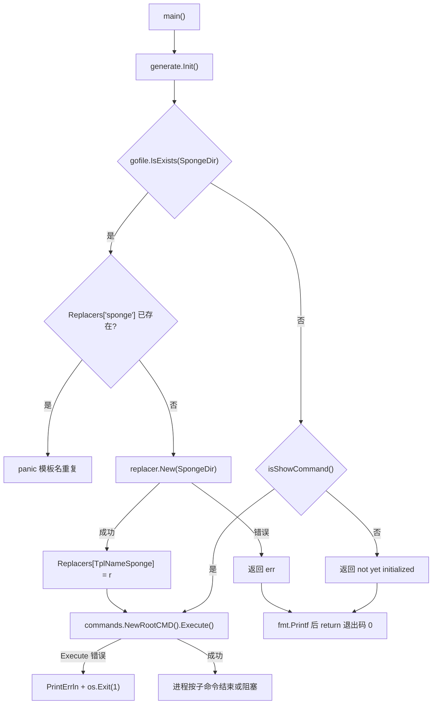
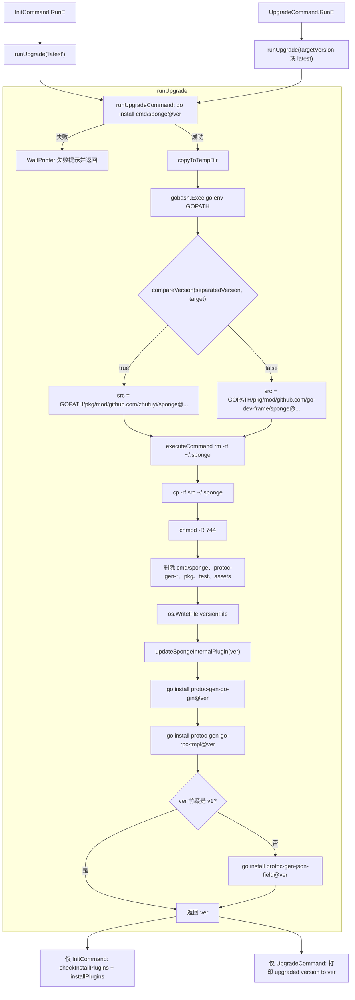

# CLI 入口、命令树与生命周期

> 状态：待复核生成稿
> 生成日期：2026-08-16
> 基准提交：`23807238c62e0f3b3e2d9a341bbef50547d3f5ec`
> 工作区：dirty
> 源码范围：`cmd/sponge/main.go`、`cmd/sponge/commands/root.go`、`cmd/sponge/commands/init.go`、`cmd/sponge/commands/upgrade.go`、`cmd/sponge/commands/plugins.go`、`cmd/sponge/commands/web.go`、`cmd/sponge/commands/micro.go`、`cmd/sponge/commands/run.go`、`cmd/sponge/commands/merge.go`、`cmd/sponge/commands/patch.go`、`cmd/sponge/commands/graph.go`、`cmd/sponge/commands/template.go`、`cmd/sponge/commands/assistant.go`、`cmd/sponge/commands/perftest.go`、`cmd/sponge/commands/generate/init.go`、`cmd/sponge/commands/generate/config.go`（命令入口与职责；生成器内部交给 [05](05-代码生成器与模板写入.md)）
> 生成方式：源码、测试、配置与部署资产静态分析

## 目录

- [快速摘要](#快速摘要)
- [为什么这样设计（Why）](#为什么这样设计why)
- [它是什么（What）](#它是什么what)
- [代码如何实现（How）](#代码如何实现how)
  - [进程入口 `main`](#进程入口-main)
  - [根命令 `NewRootCMD` 与版本](#根命令-newrootcmd-与版本)
  - [`generate.Init` / `isShowCommand` / `SpongeDir` / `Replacers`](#generateinit--isshowcommand--spongedir--replacers)
  - [`sponge init` 与 `sponge upgrade`](#sponge-init-与-sponge-upgrade)
  - [`sponge plugins`](#sponge-plugins)
  - [完整 Cobra 命令树](#完整-cobra-命令树)
  - [各一级命令的入口与职责](#各一级命令的入口与职责)
- [启动与升级流程图](#启动与升级流程图)
- [关键调用关系表](#关键调用关系表)
- [相关测试与覆盖缺口](#相关测试与覆盖缺口)
- [阅读源码建议顺序](#阅读源码建议顺序)
- [重新实现检查清单](#重新实现检查清单)
- [交叉链接](#交叉链接)

## 快速摘要

### 架构总览（模块与依赖）

`cmd/sponge` 编译出的 `sponge` 二进制是生成器进程，不是业务服务。它用 [spf13/cobra](https://github.com/spf13/cobra) 把全部子命令挂到根命令 `Use: "sponge"` 上。

依赖方向固定为：

1. `cmd/sponge/main.go:main` 先调用 `generate.Init`，再调用 `commands.NewRootCMD().Execute`。
2. `generate.Init` 检查用户家目录下的 `.sponge` 模板树，并用 `pkg/replacer.New` 把它登记进全局表 `generate.Replacers["sponge"]`。
3. 生成类命令（`web` / `micro` / `config` / 部分 `patch`）只从这张表取模板，不读当前 Git 工作区。
4. `init` / `upgrade` 通过 `go install` 拉二进制，再从 `$GOPATH/pkg/mod` 把模块源码拷到 `.sponge`，并写 `.sponge/.github/version`。
5. `plugins` 用 `which` 检查依赖，再用 `go install` 安装缺失的 protoc 插件与 `swag`。

本篇只覆盖 CLI 入口、命令注册、模板目录生命周期、版本与插件。`sql2code` 算法、各 `*Generator.generateCode`、UI handler、`pkg` 内部实现分别见 [05](05-代码生成器与模板写入.md)、[06](06-SQL到代码片段引擎.md)、[08](08-UI-Assistant-Patch与性能测试.md)。

### 核心调用序列（逐步逻辑）

1. 用户执行 `sponge <子命令>`。`main` 调用 `generate.Init()`（`cmd/sponge/commands/generate/init.go`）。
2. 若 `.sponge` 不存在，且当前 `os.Args` 不是 `sponge` / `sponge -h` / `sponge init`（及带额外参数的 init），`Init` 返回 `not yet initialized`；`main` 打印后 **return，退出码 0**。
3. 若目录存在，`Init` 执行 `replacer.New(SpongeDir)`，写入 `Replacers[TplNameSponge]`（常量 `"sponge"`）。
4. `commands.NewRootCMD` 读取 `GetSpongeDir()+"/.sponge/.github/version"` 作为 Cobra `Version`，再 `AddCommand` 全部一级命令。
5. `rootCMD.Execute()` 按 `os.Args` 分发。`init` 走 `InitCommand.RunE` → `runUpgrade("latest")` → `checkInstallPlugins` → `installPlugins`。`upgrade` 只走 `runUpgrade`。其余命令进入各自 `RunE`。
6. `Execute` 返回错误时，`main` 调用 `rootCMD.PrintErrln` 并 `os.Exit(1)`。

### 易错点与边界条件

- `generate.Init` 失败与 `Execute` 失败的退出码不对称：未初始化是退出码 0，命令执行失败才是 1。
- `isShowCommand` 只放行字面量 `-h`，不放行 `--help`、`--version`、`upgrade`、`plugins`。未 init 时这些命令同样被拦在 `Init`。
- `init` 与 `upgrade` 先 `rm -rf` 目标 `.sponge` 再 `cp`。若 `cp` 失败，旧模板已被删掉，本机处于无模板状态。
- 组织名切换阈值是常量 `separatedVersion = "v1.11.2"`：目标版本低于该值时，模块路径从 `github.com/go-dev-frame` 换成 `github.com/zhufuyi`。
- `getLatestVersion` 把 `sponge@v1.15.0` 拆成 `["v1","15","0"]` 后对 `"v1"` 做 `Atoi`，主版本号被读成 0。同主版本的 minor/patch 比较仍可用；跨主版本排序不可靠。
- `copyToTempDir` / `checkInstallPlugins` 依赖 Unix 命令 `ls`、`rm`、`cp`、`chmod`、`which`。Windows 上即使做了路径分隔符替换，这些命令本身仍可能不存在。
- `installPlugins` 对安装失败只打印 `❌`，`RunE` 仍返回 `nil`。`go` 与 `protoc` 永远不会被自动安装。
- `cmd/sponge/` 下没有任何 `*_test.go`。init/upgrade/plugins/命令树均无直接测试。
- 本仓库工作区 dirty；结论以基准提交为准。

---

## 为什么这样设计（Why）

Sponge 的生成素材不是嵌在二进制里的一小份文本，而是一整棵与本仓库同构的模板树：`internal/`、`api/`、`cmd/serverNameExample_*`、`configs/`、`deployments/`、`scripts/`、`.github/`。生成命令需要一份**稳定、与当前 CLI 版本对应**的模板源。

若每次生成都读当前 Git 工作区，会出现：

- 开发者在本仓库改模板实验时，误把半成品生成进业务项目；
- 用户用 `go install` 装的 CLI 与本地 clone 的模板版本不一致。

因此生命周期被拆成两段：

| 阶段 | 命令 | 目的 |
|---|---|---|
| 引导 | `sponge init` | 下载 CLI + 模板 + 内置插件 + 检查第三方插件 |
| 日常 | `sponge web http` 等 | 只读已落地的 `.sponge`，不再访问 GitHub 或 GOPATH |

`upgrade` 与 `init` 共用 `runUpgrade`，差别是：`init` 固定 `latest` 并继续装插件；`upgrade` 可指定版本且不扫第三方插件。

全局 `Replacers` 是为了让几十个 Generator 用同一个模板根，避免每个命令各自 `replacer.New`。代价是进程级可变状态、重复 `Init` 会 `panic`，也让单测很难替换模板源。`InitFS` 本意是给 `embed.FS` 留口，但本仓库没有任何调用点。

---

## 它是什么（What）

### 进程与包

| 实体 | 路径 | 职责 |
|---|---|---|
| 进程入口 | `cmd/sponge/main.go` | 调 `Init`，再执行 Cobra |
| 根命令 | `cmd/sponge/commands/root.go` | 组装命令树、读版本、解析家目录 |
| 模板生命周期 | `cmd/sponge/commands/generate/init.go` | `SpongeDir`、`Replacers`、`isShowCommand` |
| 引导/升级 | `cmd/sponge/commands/init.go`、`upgrade.go` | `go install` + 拷模板 + 装内置插件 |
| 依赖插件 | `cmd/sponge/commands/plugins.go` | `which` 检查与并发 `go install` |
| 生成入口 | `web.go`、`micro.go`、`generate/config.go` | 只注册子命令，算法在 generate 包 |
| 辅助入口 | `run.go`、`merge.go`、`patch.go`、`graph.go`、`template.go`、`assistant.go`、`perftest.go` | UI / 合并 / 补丁 / 图 / 自定义模板 / AI / 压测 |

### 必须保持的行为契约

1. 除帮助与 `init` 外，生成与大多数运维命令都要求 `.sponge` 已存在。
2. 模板根路径是 `os.UserHomeDir() + 路径分隔符 + ".sponge"`，不是仓库根目录。
3. 版本字符串来自 `.sponge/.github/version`，不是编译期 `-ldflags`。包级变量 `version` 默认 `"v0.0.0"`，仅在 `checkInstallPlugins` 读文件后被覆盖。
4. `init`/`upgrade` 成功后，`.sponge` 里不应再保留 `cmd/sponge`、三个 `protoc-gen-*`、`pkg/`、`test/`、`assets/`（这些在拷贝后被删除）。
5. 所有一级命令都设置 `SilenceErrors: true` 与 `SilenceUsage: true`，错误由 `main` 统一打印。

### 可以替换的技术实现

- Cobra 可换成任意命令行框架，只要保留同样的 `Use` 字符串与 flag 名。
- `gobash.Run` / `gobash.Exec` 可换成直接 `os/exec`，但必须排空 stdout channel（`Run` 的契约）。
- `utils.NewWaitPrinter` 只是终端动画，不影响功能。
- `InitFS` 目前未被使用，重实现时可以不做，或改成真正的 embed 模板。

---

## 代码如何实现（How）

### 进程入口 `main`

文件：`cmd/sponge/main.go`。包注释把 sponge 定位为“代码自动生成 + Gin/gRPC 的基础开发框架”。

```text
main
  → generate.Init()
       失败：fmt.Printf("\n    %v\n\n", err); return   // 不 os.Exit
  → commands.NewRootCMD()
  → rootCMD.Execute()
       失败：rootCMD.PrintErrln("Error:", err); os.Exit(1)
```

没有 `defer`、没有 signal 处理、没有配置文件。CLI 进程的生命周期就是“Init + 一次 Cobra 分发”。`sponge run` 是唯一会阻塞到 HTTP server 退出的命令。

`generate` 包的 `init()` 会执行 `rand.Seed(time.Now().UnixNano())`，供后续错误码序号 `rand.Intn(99)+1` 使用（生成器内部，见 [05](05-代码生成器与模板写入.md)）。这发生在 `main` 之前，与模板目录无关。

### 根命令 `NewRootCMD` 与版本

文件：`cmd/sponge/commands/root.go`。

包级变量：

| 符号 | 初值 | 谁改它 |
|---|---|---|
| `version` | `"v0.0.0"` | `checkInstallPlugins` 读到 version 文件后覆盖 |
| `versionFile` | `GetSpongeDir()+"/.sponge/.github/version"` | 包初始化时算死，之后不变 |

`NewRootCMD` 构造 `*cobra.Command`：

- `Use: "sponge"`
- `Long` 含仓库 URL `https://github.com/go-dev-frame/sponge` 与文档站 `https://go-sponge.com`（用 `color.HiCyanString` 着色）
- `SilenceErrors: true`、`SilenceUsage: true`
- `Version: getVersion()` —— Cobra 因此自动提供 `--version`

`AddCommand` 的真实函数与顺序（源码字面顺序）：

1. `InitCommand()`
2. `UpgradeCommand()`
3. `PluginsCommand()`
4. `GenWebCommand()`
5. `GenMicroCommand()`
6. `generate.ConfigCommand()`
7. `OpenUICommand()`
8. `MergeCommand()`
9. `PatchCommand()`
10. `GenGraphCommand()`
11. `TemplateCommand()`
12. `AssistantCommand()`
13. `PerftestCommand()`

未设置 `CompletionOptions.DisableDefaultCmd`。推断：Cobra 仍可能自动挂上 `completion` 子命令；本仓库没有显式注册。

#### `getVersion`

```text
os.ReadFile(versionFile)   // 错误被丢掉
若内容非空 → 原样返回（不 TrimSpace、不校验 semver）
否则 → `unknown, execute command "sponge init" to get version`
```

`sponge run` 的横幅也会调用 `getVersion()`，因此 UI 启动日志里的版本与 `--version` 同源。

#### `GetSpongeDir`

```text
os.UserHomeDir()
  失败：打印 `can't get home directory'`（原文多一个单引号），返回 ""
  成功：返回家目录，不含 `.sponge`
```

`generate.getHomeDir` 与它逻辑相同，是重复实现。`versionFile` 用硬编码 `/` 拼接 `.sponge/.github/version`；`generate.SpongeDir` 用 `gofile.GetPathDelimiter()`。Unix 上两者一致；Windows 上 version 路径仍是 `/`，Go 的 `os.ReadFile` 通常仍能打开，但这是两套规则。

---

### `generate.Init` / `isShowCommand` / `SpongeDir` / `Replacers`

文件：`cmd/sponge/commands/generate/init.go`。

#### 全局状态

| 符号 | 类型 | 含义 |
|---|---|---|
| `Replacers` | `map[string]replacer.Replacer` | 模板源注册表。CLI 主路径只用键 `"sponge"` |
| `SpongeDir` | `string` | `getHomeDir() + gofile.GetPathDelimiter() + ".sponge"` |
| `TplNameSponge` | 常量，定义在 `generate/common.go` | `"sponge"` |
| `Template` | 结构体 `{Name, FS embed.FS, FilePath}` | 给 `InitFS` 用的描述，本仓库无调用方 |

`replacer.New(path)`（`pkg/replacer/replacer.go`）会 `gofile.ListFiles` 列出目录下全部文件，把 `isActual=true` 的磁盘 Replacer 返回给 `Init`。接口与 `SaveFiles` 细节见 [05](05-代码生成器与模板写入.md)。

#### `Init` 逐步逻辑

1. `gofile.IsExists(SpongeDir)`：内部是 `os.Stat`，不存在则 `false`。
2. 目录不存在：
   - `isShowCommand()==true` → 返回 `nil`，**不**往 `Replacers` 里写任何东西。
   - 否则返回 `fmt.Errorf("%s not yet initialized, run the command \"sponge init\"", warnSymbol)`，其中 `warnSymbol` 是 `"⚠ "`。
3. 目录存在：若 `Replacers[TplNameSponge]` 已有值，`panic("template name \"sponge\" already exists")`。正常 CLI 每个进程只 `Init` 一次，不会走到这里。
4. `replacer.New(SpongeDir)` 失败则原样返回错误（例如目录不可读）。
5. 成功则 `Replacers["sponge"] = r`，返回 `nil`。

#### `isShowCommand` 的真实判定

输入是 `os.Args`，不是 Cobra 解析后的命令名。

| `len(os.Args)` | 条件 | 结果 | 典型命令 |
|---|---|---|---|
| 1 | 无 | `true` | `sponge`（Cobra 打印根帮助） |
| 2 | `os.Args[1]=="init"` 或 `"-h"` | `true` | `sponge init`、`sponge -h` |
| 2 | 其它 | `false` | `sponge --help`、`sponge --version`、`sponge upgrade`、`sponge plugins`、`sponge run` |
| >2 | `strings.Contains(strings.Join(os.Args[:3], ""), "init")` | 含 `"init"` 则为 `true` | `sponge init --foo`；前三个参数无分隔符拼接后含 `init` 也会误放行 |
| 其它 |  | `false` | `sponge web http`、`sponge web http -h` |

边界：

- `sponge --help` 在未初始化时会被 `Init` 拒绝，尽管 Cobra 自己认识 `--help`。
- `sponge web -h` 的 `len==3` 且拼接结果不含 `init`，同样要求模板目录存在。
- `sponge init` 被放行时 `Replacers` 仍为空。这没问题，因为 `InitCommand` 不读模板，它负责创建模板。
- 家目录路径或二进制路径里若碰巧含有 `"init"`，且参数个数大于 2，可能误放行。这是字符串包含而非精确匹配。

#### `InitFS`

```text
若 Replacers[name] 已存在 → panic
replacer.NewFS(filepath, fs) 失败 → panic（不是 return error）
成功 → Replacers[name] = r
```

全仓库 `InitFS(` 的唯一定义就在本文件，没有任何调用。重实现时不要假设二进制内嵌模板已被注册。

---

### `sponge init` 与 `sponge upgrade`

#### 命令入口

`InitCommand`（`cmd/sponge/commands/init.go`）：

- `Use: "init"`，`Short: "Initialize sponge"`
- 无 flag
- `RunE` 固定 `targetVersion := latestVersion`（常量 `"latest"`）
- 调用 `runUpgrade(targetVersion)`；失败则返回错误
- 再 `checkInstallPlugins()`，把 `lackNames` 交给 `installPlugins`
- 始终 `return nil`（插件安装失败不会让 `init` 失败）

`UpgradeCommand`（`cmd/sponge/commands/upgrade.go`）：

- `Use: "upgrade"`，`Short: "Upgrade sponge version"`
- flag：`--version` / `-v`，默认 `latestVersion`
- `RunE`：若 `targetVersion==""` 再赋值为 `"latest"`（与 flag 默认重复，防御空字符串）
- 只调用 `runUpgrade`；成功则 `fmt.Printf("upgraded version to %s successfully.\n", ver)`
- **不**调用 `checkInstallPlugins` / `installPlugins`

常量：

| 符号 | 值 | 用途 |
|---|---|---|
| `latestVersion` | `"latest"` | go install 的版本后缀；拷贝时触发“找 GOPATH 里最新目录” |
| `separatedVersion` | `"v1.11.2"` | 旧组织 `zhufuyi` 与新组织 `go-dev-frame` 的分界 |

#### `runUpgrade` 三阶段

每一阶段都用 `utils.NewWaitPrinter(500ms)` 打循环提示，失败时 `StopPrint` 附带 `lackSymbol`（`"❌ "`）和 `err.Error()`，成功时附带 `installedSymbol`（`"✔ "`）。

```text
runUpgrade(targetVersion)
  1. runUpgradeCommand(targetVersion)     // go install CLI 二进制
  2. copyToTempDir(targetVersion) → ver   // 从 module cache 拷到 ~/.sponge
  3. updateSpongeInternalPlugin(ver)      // go install 三个内置 protoc 插件
  返回 ver
```

任一步失败立即返回，后续步骤不执行。第 1 步成功、第 2 步失败时：新二进制可能已经装上，但模板未更新。第 2 步里若已 `rm -rf` 目标目录，模板可能已被清空。

#### 阶段 1：`runUpgradeCommand`

```text
ctx = context.WithTimeout(3 * time.Minute)   // cancel 被丢掉（源码 //nolint）
module = "github.com/go-dev-frame/sponge/cmd/sponge@" + targetVersion
若 compareVersion(separatedVersion, targetVersion) == true
    把 go-dev-frame 换成 zhufuyi
gobash.Run(ctx, "go", "install", module)
排空 result.StdOut
若 result.Err != nil → 返回该错误
```

`gobash.Run`（`pkg/gobash/gobash.go`）在 goroutine 里 `exec.LookPath` + `exec.CommandContext`。调用方必须 `for range result.StdOut` 直到 channel 关闭，否则可能堵死。这里排空但不使用输出。

`go install` 会把二进制放到 `$GOBIN` 或 `$GOPATH/bin`，并把模块源码放进 `$GOPATH/pkg/mod`。这是阶段 2 的前置条件。

超时后 `CommandContext` 会杀进程，`result.Err` 非 nil。

#### 阶段 2：`copyToTempDir`

目标不是“临时目录”这个名字所暗示的位置，而是用户家目录下的 `.sponge`。

1. `gobash.Exec("go", "env", "GOPATH")`。失败则 `execute command failed`。输出去换行后若为空，返回 `$GOPATH is empty, you need set $GOPATH in your $PATH`。
2. 多 GOPATH：Unix 用 `:`、Windows 用 `;` 分割，**只取第一段**。
3. 解析源目录名 `spongeDirName`：
   - `targetVersion == "latest"`：`ls $GOPATH/pkg/mod/github.com/go-dev-frame`（旧版本换 `zhufuyi`），把 stdout 交给 `getLatestVersion`。找不到则报 `not found sponge directory in '$GOPATH/pkg/mod/github.com/go-dev-frame'`（报错文案不随组织名切换）。
   - 否则：`spongeDirName = "sponge@" + targetVersion`（例如 `sponge@v1.5.6`）。
4. 源路径：`$GOPATH/pkg/mod/github.com/<org>/<spongeDirName>`，同样按 `compareVersion` 换组织。
5. 目标：`GetSpongeDir() + "/.sponge"`，经 `adaptPathDelimiter` 处理。
6. `executeCommand("rm", "-rf", targetDir)` —— 失败则返回，**尚未拷贝**。
7. `executeCommand("cp", "-rf", srcDir, targetDir)` —— 失败则返回；此时目标可能已不存在。
8. `executeCommand("chmod", "-R", "744", targetDir)` —— 失败则返回；模板已在但权限未改。
9. 以下删除错误被丢掉（`_ = executeCommand(...)`）：
   - `targetDir+"/cmd/sponge"`
   - `targetDir+"/cmd/protoc-gen-go-gin"`
   - `targetDir+"/cmd/protoc-gen-go-rpc-tmpl"`
   - `targetDir+"/cmd/protoc-gen-json-field"`
   - `targetDir+"/pkg"`
   - `targetDir+"/test"`
   - `targetDir+"/assets"`
10. `versionNum = strings.Replace(spongeDirName, "sponge@", "", 1)`。对 `latest` 解析出的目录名，这就是 `vX.Y.Z`；对指定版本就是去掉前缀后的 `targetVersion`。
11. `os.WriteFile(versionFile, []byte(versionNum), 0644)`。失败则整个 `copyToTempDir` 失败，但模板已经落盘。
12. 返回 `versionNum`。

`executeCommand` 使用 30 秒超时的 `gobash.Run`，同样排空 stdout。`adaptPathDelimiter` 仅在 Windows 把 `/` 换成 `\`。

拷贝后 `.sponge` 里仍然保留（从而成为生成素材）的典型内容：`internal/`、`api/`、`cmd/serverNameExample_*`、`configs/`、`deployments/`、`scripts/`、`.github/`、顶层 `Makefile` 等。这与 [01](01-简单框架-系统骨架.md) 中“模板仓库不是当前 Git 工作区”的结论一致。

#### `getLatestVersion`

输入是 `ls` 的整段 stdout。按行扫描，只处理包含 `"sponge@"` 的行：

1. 去掉 `"sponge@"`，按 `.` 分成恰好 3 段，否则跳过（因此伪版本 `v1.2.3-0.20240102xxxxxx-abcdef` 会被跳过）。
2. 若第三段包含 `"v0.0.0"` 则跳过。
3. `num = StrToInt(ss[0])*10000 + StrToInt(ss[1])*100 + StrToInt(ss[2])`。
4. `sort.Ints` 后取最大 `num` 对应的**原始行字符串**（仍带 `sponge@`）。

`utils.StrToInt` 是 `strconv.Atoi` 忽略错误。`sponge@v1.15.0` 去掉前缀后是 `v1.15.0`，`ss[0]=="v1"`，`Atoi("v1")` 得到 0。因此：

- `v1.9.0` → `0*10000+9*100+0 = 900`
- `v1.15.0` → `1500`（minor/patch 仍可比）
- `v2.0.0` → `0`（主版本被吃掉，会被当成比 `v1.15.0` 更旧）

module cache 里若同时有 `v1` 与 `v2` 目录，`latest` 可能选错。这是重实现时必须决定是否修复的行为。

#### `compareVersion(v1, v2)` —— 注释写的是 `v1 >= v2`

实际实现：

| 输入 | 返回 |
|---|---|
| `v1 == "latest"` | `true`（调用处 v1 是 `separatedVersion`，不会走这条） |
| `v2 == "latest"` | `false` → `latest` **不**切换到 `zhufuyi` |
| 去掉 `v` 后分段不足 3 | `false` |
| 主/次/修订逐级比较 | 仅当对应段 **大于**（不是大于等于）时 `true`；完全相等时最后一段 `>` 为 `false` |

因此 `compareVersion("v1.11.2", "v1.11.2")` 为 `false`：恰好 `v1.11.2` 仍用 `go-dev-frame`。低于该版本（如 `v1.5.6`、`v1.11.1`）用 `zhufuyi`。

调用点全部是 `compareVersion(separatedVersion, targetVersion)`，即“分界版本是否高于目标版本”。

#### 阶段 3：`updateSpongeInternalPlugin(ver)`

对每个内置插件 `go install github.com/<org>/sponge/cmd/<plugin>@<ver>`，超时 3 分钟，排空 stdout：

1. `protoc-gen-go-gin`
2. `protoc-gen-go-rpc-tmpl`
3. `protoc-gen-json-field` —— 仅当 `!strings.HasPrefix(targetVersion, "v1")`。这里的 `targetVersion` 是 `copyToTempDir` 返回的 `ver`（例如 `v1.16.0`），不是用户传入的 `"latest"`。因此走到 v1 线时**不会**在 upgrade 阶段安装 json-field。该插件仍在 `pluginNames` 里，由后续的 `installPlugins` 按 `@latest` 或 version 文件中的版本安装。

组织名替换规则与阶段 1 相同，但比较的是已经解析出的 `ver`，不是用户传入的 `"latest"`。

---

### `sponge plugins`

文件：`cmd/sponge/commands/plugins.go`。

#### 命令入口

- `Use: "plugins"`，`Short: "Manage sponge dependency plugins"`
- `--install` / `-i`：`bool`，默认 `false`
- `--skip` / `-s`：逗号分隔的插件名，默认 `""`
- `RunE` 永远返回 `nil`

```text
installed, lack := checkInstallPlugins()
lack = filterLackNames(lack, skipPluginName)
若 installFlag → installPlugins(lack)
否则 → showDependencyPlugins(installed, lack)
```

未加 `--install` 时 `--skip` 仍会过滤“未安装列表”，展示结果会少掉被 skip 的项，但并不会安装。

#### 插件清单 `pluginNames`（检查顺序）

`go`、`protoc`、`protoc-gen-go`、`protoc-gen-go-grpc`、`protoc-gen-validate`、`protoc-gen-gotag`、`protoc-gen-go-gin`、`protoc-gen-go-rpc-tmpl`、`protoc-gen-json-field`、`protoc-gen-openapiv2`、`protoc-gen-doc`、`swag`。

`golangci-lint` 与 `go-callvis` 在切片和 map 里都被注释掉，但 Example 仍写 `--skip=go-callvis`。对当前清单，这个 skip 不会匹配任何项。

#### `installPluginCommands`

| 名字 | 值 |
|---|---|
| `go` | 提示手工安装，URL `https://go.dev/dl/` 或 `https://golang.google.cn/dl/` |
| `protoc` | 提示手工安装，指向 protobuf releases 的 `v31.1` |
| `protoc-gen-go` | `google.golang.org/protobuf/cmd/protoc-gen-go@latest` |
| `protoc-gen-go-grpc` | `google.golang.org/grpc/cmd/protoc-gen-go-grpc@latest` |
| `protoc-gen-validate` | `github.com/envoyproxy/protoc-gen-validate@latest` |
| `protoc-gen-gotag` | `github.com/srikrsna/protoc-gen-gotag@latest` |
| `protoc-gen-go-gin` | `github.com/go-dev-frame/sponge/cmd/protoc-gen-go-gin@latest` |
| `protoc-gen-go-rpc-tmpl` | `github.com/go-dev-frame/sponge/cmd/protoc-gen-go-rpc-tmpl@latest` |
| `protoc-gen-json-field` | `github.com/go-dev-frame/sponge/cmd/protoc-gen-json-field@latest` |
| `protoc-gen-openapiv2` | `github.com/grpc-ecosystem/grpc-gateway/v2/protoc-gen-openapiv2@latest` |
| `protoc-gen-doc` | `github.com/pseudomuto/protoc-gen-doc/cmd/protoc-gen-doc@latest` |
| `swag` | `github.com/swaggo/swag/cmd/swag@v1.8.12`（钉死版本，不是 latest） |

#### `checkInstallPlugins`

对每个名字 `gobash.Exec("which", name)`。`LookPath` 失败或命令失败 → 记入 `lackNames`，否则记入 `installedNames`。

随后 `os.ReadFile(versionFile)`，非空则 `version = v`（覆盖包级 `"v0.0.0"`）。读失败被忽略，`version` 保持原值。

`which` 在 Windows 上通常不存在，推断：未 init 且在 Windows 上运行 `plugins` 时，几乎所有插件都会显示未安装。未做运行验证，标为待确认。

#### `showDependencyPlugins`

已安装块标题 `installed dependency plugins:`，每行 `✔  <name>`。未安装块标题 `uninstalled dependency plugins:`，每行 `❌  <name>`，并提示 `sponge plugins --install`。若 `lackNames` 为空，打印 `all dependency plugins installed.`。

#### `installPlugins`

- `len(lackNames)==0`：打印 `all dependency plugins installed.` 并返回。
- 否则打印将要安装的数量。
- `go` 与 `protoc` 不进 goroutine，收集到 `manuallyNames`。
- 其余每个名字 `wg.Add(1)` 后并发：
  1. 3 分钟超时的 `context.WithTimeout`（cancel 同样丢掉）
  2. 查 `installPluginCommands`；没有则静默 `return`（当前清单不会发生）
  3. `adaptInternalCommand` 可能把三个 sponge 插件的 `@latest` 换成 `@`+`version`
  4. `gobash.Run(ctx, "go", "install", pkgAddr)`，排空 stdout
  5. 失败打印 `❌  name, err`；成功打印 `✔  name`
- `wg.Wait()` 后，对 `manuallyNames` 打印 `⚠  ` + 手工安装文案。

`adaptInternalCommand`：仅当名字是 `protoc-gen-go-gin` / `protoc-gen-go-rpc-tmpl` / `protoc-gen-json-field`，且 `version != "v0.0.0"` 时，把地址里的 `@latest` 换成 `@`+当前 `version`。其它插件（含 `swag` 已钉的 `@v1.8.12`）原样返回。

因此：从未执行过 `checkInstallPlugins` 读到 version 文件时，`version` 仍是 `"v0.0.0"`，三个内置插件会装 `@latest`。`init` 的顺序是先 `runUpgrade`（已写 version 文件）再 `checkInstallPlugins`（更新 `version` 变量）再 `installPlugins`，所以 `init` 路径会按刚写入的版本号钉内置插件。单独执行 `sponge plugins --install` 也会先 `checkInstallPlugins`，同样能钉版本。

#### `filterLackNames`

`skipPluginName==""` 原样返回。否则按逗号切开，从 `lackNames` 去掉精确相等的项。内层循环在匹配后 `continue` 的是内层，不是外层；因为 `isMatch` 已为 true，功能仍正确，只是多比几次。

---

### 完整 Cobra 命令树

节点格式：`Use` ← 工厂函数。叶子的 `Short` 来自源码。

```text
sponge                          ← commands.NewRootCMD
├── init                        ← InitCommand
├── upgrade                     ← UpgradeCommand          flag: --version/-v
├── plugins                     ← PluginsCommand          flag: --install/-i, --skip/-s
├── web                         ← GenWebCommand
│   ├── model                   ← generate.ModelCommand("web")
│   ├── dao                     ← generate.DaoCommand("web")
│   ├── cache                   ← generate.CacheCommand("web")
│   ├── handler                 ← generate.HandlerCommand
│   ├── http                    ← generate.HTTPCommand
│   ├── http-pb                 ← generate.HTTPPbCommand
│   ├── swagger                 ← generate.HandleSwaggerJSONCommand
│   └── handler-pb              ← generate.HandlerPbCommand
├── micro                       ← GenMicroCommand
│   ├── protobuf                ← generate.ProtobufCommand
│   ├── model                   ← generate.ModelCommand("micro")
│   ├── dao                     ← generate.DaoCommand("micro")
│   ├── cache                   ← generate.CacheCommand("micro")
│   ├── service                 ← generate.ServiceCommand
│   ├── rpc                     ← generate.RPCCommand
│   ├── rpc-gw-pb               ← generate.RPCGwPbCommand
│   ├── rpc-pb                  ← generate.RPCPbCommand
│   ├── rpc-conn                ← generate.GRPCConnectionCommand
│   ├── grpc-http               ← generate.GRPCAndHTTPCommand
│   ├── grpc-http-pb            ← generate.GRPCAndHTTPPbCommand
│   └── service-handler         ← generate.ServiceAndHandlerCRUDCommand
├── config                      ← generate.ConfigCommand
│   └── cm                      ← generate.ConfigmapCommand
├── run                         ← OpenUICommand            flag: --port/-p=24631, --addr/-a, --log/-l
├── merge                       ← MergeCommand
│   ├── http-pb                 ← merge.GinHandlerCode
│   ├── rpc-gw-pb               ← merge.GinServiceCode
│   └── rpc-pb                  ← merge.GRPCServiceCode
├── patch                       ← PatchCommand
│   ├── del-omitempty           ← patch.DeleteJSONOmitemptyCommand
│   ├── gen-db-init             ← patch.GenerateDBInitCommand
│   ├── gen-types-pb            ← patch.GenTypesPbCommand
│   ├── copy-proto              ← patch.CopyProtoCommand
│   ├── copy-third-party-proto  ← patch.CopyThirdPartyProtoCommand
│   ├── copy-go-mod             ← patch.CopyGOModCommand
│   ├── modify-dup-num          ← patch.ModifyDuplicateErrorCodeNumCommand
│   ├── modify-dup-err-code     ← patch.ModifyDuplicateErrorCodeOffsetCommand
│   ├── adapt-mono-repo         ← patch.AdaptMonoRepoCommand
│   └── modify-proto-package    ← patch.ModifyProtoPackageCommand
├── graph                       ← GenGraphCommand          flag: --all/-a, --project-dir/-p, --server-dir/-s
├── template                    ← TemplateCommand
│   ├── field                   ← template.FieldCommand
│   ├── sql                     ← template.SQLCommand
│   └── protobuf                ← template.ProtobufCommand
├── assistant                   ← AssistantCommand
│   ├── chat                    ← assistant.ChatCommand
│   ├── generate                ← assistant.GenerateCommand
│   ├── merge                   ← assistant.MergeAssistantCode
│   └── clean                   ← assistant.CleanUpAssistantCode
└── perftest                    ← PerftestCommand
    ├── http                    ← http.PerfTestHTTPCMD
    ├── http2                   ← http.PerfTestHTTP2CMD
    ├── http3                   ← http.PerfTestHTTP3CMD
    ├── websocket               ← websocket.PerfTestWebsocketCMD
    ├── grpc                    ← grpc.PerfTestGRPCCMD
    ├── collector               ← http.PerfTestCollectorCMD
    └── agent                   ← http.PerfTestAgentCMD
```

`web model` 与 `micro model` 是同一个 `ModelCommand(parentName string)`，Example 字符串里的父命令名不同，实现共用。`dao`、`cache` 同样如此。

---

### 各一级命令的入口与职责

以下只写命令如何被挂上、`RunE` 第一层做什么、关键 flag。Generator / sql2code / UI handler / AST 合并的内部算法指向其它文档，不在本篇展开。

#### `web`：`GenWebCommand`

`cmd/sponge/commands/web.go`。自身无 `RunE`，只是分组。

| Use | 工厂 | Short | `RunE` 第一层（入口符号） |
|---|---|---|---|
| `model` | `generate.ModelCommand("web")` | Generate model code based on sql | 按逗号拆表名，循环 `sql2code.Generate` + model Generator。见 [05](05-代码生成器与模板写入.md)、[06](06-SQL到代码片段引擎.md) |
| `dao` | `generate.DaoCommand("web")` | Generate dao code based on sql | 可从 `--out` 目录的 `docs/gen.info` 反推 module；再按表生成 dao |
| `cache` | `generate.CacheCommand("web")` | Generate cache code | 按 `--cache-name/--key-name/--value-name` 等生成 KV cache，不连库 |
| `handler` | `generate.HandlerCommand` | Generate handler CRUD code based on sql | 表 → sql2code → handler Generator |
| `http` | `generate.HTTPCommand` | Generate web server code based on sql | 必填 `--module-name/--server-name/--project-name/--db-dsn/--db-table`；第一张表走完整 http 工程，其余表只补 handler。主链路见 [02](02-简单例子-全路径走读.md)、[03](03-详细逐步说明-主链路拆解.md) |
| `http-pb` | `generate.HTTPPbCommand` | Generate web server code based on protobuf file | 必填 module/server/project/`--protobuf-file`；`httpPbGenerator.generateCode` 后调用 `generateConfigmap` |
| `swagger` | `generate.HandleSwaggerJSONCommand` | Handle swagger json file | 默认 `--file=docs/apis.swagger.json`；按三个 bool flag 依次做 64 位字段转换、统一响应、Swagger2→OpenAPI3。`--enable-string-to-integer` 默认 **true** |
| `handler-pb` | `generate.HandlerPbCommand` | Generate handler and protobuf CRUD code based on sql | 同时要 module 与 server；`sqlArgs.IsWebProto=true` |

`HTTPCommand` 的 DSN flag 帮助原文是 `user:password@(host:port)/database`。sqlite 时 `--db-dsn` 必须是本地文件路径。文档示例一律写成 `user:***@(host:port)/database`。

#### `micro`：`GenMicroCommand`

`cmd/sponge/commands/micro.go`。自身无 `RunE`。

| Use | 工厂 | Short | 入口职责 |
|---|---|---|---|
| `protobuf` | `ProtobufCommand` | Generate protobuf code based on sql | 表结构 → proto 文件 |
| `model` / `dao` / `cache` | 与 web 共用工厂，`parentName="micro"` | 同 web | Example 变成 `sponge micro ...` |
| `service` | `ServiceCommand` | Generate grpc service CRUD code based on sql | 表 → gRPC service 模板 |
| `rpc` | `RPCCommand` | Generate grpc server code based on sql | 完整 gRPC 工程；必填 module/server/project/dsn/table |
| `rpc-gw-pb` | `RPCGwPbCommand` | Generate grpc gateway server code based on protobuf file | proto → grpc-gateway 工程 |
| `rpc-pb` | `RPCPbCommand` | Generate grpc server code based on protobuf file | proto → gRPC 工程 |
| `rpc-conn` | `GRPCConnectionCommand` | Generate grpc connection code | `--rpc-server-name` 可逗号分隔，循环生成客户端连接代码 |
| `grpc-http` | `GRPCAndHTTPCommand` | Generate grpc+http servers code based on sql | 双协议工程；`sqlArgs.IsWebProto=true` |
| `grpc-http-pb` | `GRPCAndHTTPPbCommand` | Generate grpc+http servers code based on protobuf file | proto 版双协议 |
| `service-handler` | `ServiceAndHandlerCRUDCommand` | Generate both grpc service and http handler CRUD code based on sql | 同一组表同时出 service 与 handler。帮助里的错误提示误写为 `sponge micro service -h` |

gRPC 运行时行为见 [10](10-gRPC服务网关与RPC客户端.md)。protoc 插件见 [07](07-Protoc插件与增量合并.md)。

#### `config`：`generate.ConfigCommand`

文件：`cmd/sponge/commands/generate/config.go`。本篇只写命令入口与控制流；yaml→struct 的字段规则与 `config cm` 的模板替换见 [05](05-代码生成器与模板写入.md)。

flag：

| flag | 绑定 | 默认 | 作用 |
|---|---|---|---|
| `--server-dir` / `-d` | `serverDir` | `""` | 扫描该目录下 `configs/` |
| `--yaml-file` / `-f` | `ysArgs.InputFile` | `""` | 单文件转换 |
| `--out` / `-o` | `outPath` | `""` | 仅单文件模式使用 |

`jy2struct.Args` 在命令里写死：`Format:"yaml"`、`Tags:"json"`、`SubStruct:true`。

`RunE` 分支：

1. `ysArgs.InputFile != ""` → `convertToGoFile`，忽略 `serverDir`。
2. 否则若 `serverDir==""` → 错误 `set at least one of the parameters "service-dir" and "yaml-file"`。flag 实际名叫 `server-dir`，报错文案写成了 `service-dir`。
3. `getYAMLFile(serverDir)` 得到 `map[输出go路径]configType`。
4. 长度为 0 → `not found yaml configuration files in server directory %s/configs`。
5. `runGenConfigCommand`：对每个文件 `jy2struct.Convert`，拼上文件头后 `saveFile`。

`getYAMLFile` 规则：

- 配置目录：`<serverDir>/configs`；输出目录：`<serverDir>/internal/config`。
- 分别 `ListFiles` 收集 `.yml` 与 `.yaml`。两者都为空则报错；**两者同时非空则拒绝混合后缀**。
- `.yml`：输出 `internal/config/<去掉.yml>.go`；文件名含 `cc.yml` 则 `isConfigCenter=true`。
- `.yaml`：同样规则，中心配置文件名含 `cc.yaml`。

`runGenConfigCommand`：中心配置用 `ysArgs.Name="Center"` + 头 `configFileCcCode`；普通配置用 `Name="Config"` + `configFileCode`。这两个头字符串定义在 `generate/template.go`，分别生成 `config.Init/Get/Set` 与 `NewCenter`。转换失败或写文件失败向上返回。成功打印 `convert yaml to go struct successfully.`

`convertToGoFile`（`--yaml-file`）：

- `Name="Config"`，头只用 `configFileCode`（单文件模式不当成配置中心）。
- `outPath==""`：当前工作目录 + `/yaml-to-go-struct-<HHMMSS>/internal/config`，时间格式 `150405`。
- 否则：`filepath.Abs(outPath)+"/internal/config"`。
- `MkdirAll(..., 0766)` 错误被丢掉。
- 输出文件名是输入文件去掉后缀 + `.go`。Windows 再把 `/` 换成 `\`。
- 权限 `0666` 写入。

`saveFile` 把内容写入已算好的 `internal/config/*.go`，打印 `cutPath(input) --> cutPath(output)`。

子命令 `config cm` ← `ConfigmapCommand`：必填 `--server-name`、`--project-name`，可选 `--config-file`、`--out`。`RunE` 调 `convertYamlConfig` 再 `copyConfigGenerator.generateCode`，从 `Replacers["sponge"]` 取 `deployments/kubernetes` 模板。内部见 [05](05-代码生成器与模板写入.md)。

#### `run`：`OpenUICommand`

`cmd/sponge/commands/run.go`。`Use` 是 `run` 不是 `ui`。

默认 `--port=24631`。`--addr` 空则拼 `http://localhost:<port>`。非空则 `checkSpongeAddr`：

- `url.Parse` 失败，或 scheme 不是 `http`/`https`，或 `Host` 为空 → 固定错误文案（示例 IP `192.168.1.10:24631`）。
- 若 hostname 能被 `net.ParseIP` 解析成 IP，则 URL 端口必须等于 `--port`；域名不检查端口。

然后打印 `Code generation engine service running <getVersion()>. Access <addr>...`，goroutine 里 `open(addr)` 调系统浏览器（Windows `cmd /c start`，darwin `open`，其它 `xdg-open`），错误被丢掉。主 goroutine 调用 `server.RunHTTPServer(spongeAddr, port, isLog)`，内部 `ListenAndServe`，非 `ErrServerClosed` 的错误会 **panic**。路由与 handler 见 [08](08-UI-Assistant-Patch与性能测试.md)。

#### `merge`：`MergeCommand`

`cmd/sponge/commands/merge.go`。Long 写明事故备份目录 `/tmp/sponge_merge_backup_code`。自身无 `RunE`。

三个子命令的 `--dir/-d` 默认 `"."`。`RunE` 对一组 `mergeType` 循环 `newMergeParams(dir, codeType).runMerge()`，失败只 `fmt.Printf("[Warning] ...")`，**最终仍返回 nil**。

| Use | 工厂 | 合并的 `mergeType` |
|---|---|---|
| `http-pb` | `merge.GinHandlerCode` | `errCodeType`、`routersType`、`handlerType` |
| `rpc-gw-pb` | `merge.GinServiceCode` | `errCodeType`、`routersType`、`serviceGRPCTmplType` |
| `rpc-pb` | `merge.GRPCServiceCode` | `errCodeType`、`serviceGRPCTmplType`、`serviceGRPCClientType` |

AST 合并算法见 [07](07-Protoc插件与增量合并.md)。

#### `patch`：`PatchCommand`

`cmd/sponge/commands/patch.go`。自身无 `RunE`。子命令职责（实现见 [07](07-Protoc插件与增量合并.md) / [08](08-UI-Assistant-Patch与性能测试.md)）：

| Use | 工厂 | 必填/默认 | `RunE` 入口 |
|---|---|---|---|
| `del-omitempty` | `DeleteJSONOmitemptyCommand` | `--dir` 必填；`--suffix-name` 可选 | `replaceFiles` 去掉 json tag 里的 `omitempty` |
| `gen-db-init` | `GenerateDBInitCommand` | `--db-driver` 支持 mysql/mongodb/postgresql/sqlite | 从模板生成 `internal/database/init.go`，读 `Replacers["sponge"]` |
| `gen-types-pb` | `GenTypesPbCommand` | `--module-name`、`--out` | 生成 `types.proto`，读 `Replacers["sponge"]` |
| `copy-proto` | `CopyProtoCommand` | `--server-dir` 必填 | 从 grpc 服务目录拷 proto；覆盖前备份到 `/tmp/sponge_copy_backup_proto_files` |
| `copy-third-party-proto` | `CopyThirdPartyProtoCommand` | `--out` 默认 `.` | 从模板拷 `third_party` proto，读 `Replacers["sponge"]` |
| `copy-go-mod` | `CopyGOModCommand` | `--module-name`、`--out` 默认 `.` | 从模板拷 `go.mod`；`--is-force-replace` 控制覆盖 |
| `modify-dup-num` | `ModifyDuplicateErrorCodeNumCommand` | `--dir` 默认 `internal/ecode` | 改重复的错误码数字 |
| `modify-dup-err-code` | `ModifyDuplicateErrorCodeOffsetCommand` | `--dir` 默认 `internal/ecode` | 改重复的错误码 offset |
| `adapt-mono-repo` | `AdaptMonoRepoCommand` | `--dir` 默认 `.` | 从 `docs/gen.info` 取 module/server，改 api 目录以适配单体仓 |
| `modify-proto-package` | `ModifyProtoPackageCommand` | `--dir` 必填 | 改 proto 的 `package` / `go_package` |

其中 `gen-db-init`、`gen-types-pb`、`copy-third-party-proto`、`copy-go-mod` 依赖 `generate.Init` 已经填好的 `Replacers["sponge"]`。未 init 时这些命令过不了 `Init`；若有人绕过 `Init` 直接测，会遇到 `replacer is nil`。

#### `graph`：`GenGraphCommand`

`cmd/sponge/commands/graph.go`。

- `--project-dir` 与 `--server-dir`（可重复）至少提供一个，否则返回错误并附带 Example。
- 先 `gobash.Exec("spograph", "-h")`。失败则打印 `go install github.com/go-dev-frame/spograph@latest`，**返回 nil**（Cobra 视为成功）。
- 把 flag 翻译成 `spograph` 的同名参数：`--project-dir=`、多份 `--server-dir=`、可选 `--all`。
- `gobash.Exec("spograph", params...)` 失败则返回错误；成功把 stdout 原样打印。

本仓库不包含 `spograph` 源码。

#### `template`：`TemplateCommand`

`cmd/sponge/commands/template.go`。自定义模板，不走 `serverNameExample` 那套默认骨架。细节见 [08](08-UI-Assistant-Patch与性能测试.md)。

| Use | 工厂 | 必填 | 入口 |
|---|---|---|---|
| `field` | `template.FieldCommand` | `--tpl-dir`、`--fields`（JSON） | 按字段 JSON 替换自定义模板；`--only-print` 只打印 |
| `sql` | `template.SQLCommand` | `--tpl-dir`，以及 sql2code 所需 dsn/table | `sql2code.Args.IsCustomTemplate=true` |
| `protobuf` | `template.ProtobufCommand` | `--protobuf-file`、`--tpl-dir` | proto + 自定义模板；可选 `--fields`、`--dep-proto-dir`。内部可回退到 `generate.Replacers["sponge"]` |

#### `assistant`：`AssistantCommand`

`cmd/sponge/commands/assistant.go`。AI 调用与合并见 [08](08-UI-Assistant-Patch与性能测试.md)。

| Use | 工厂 | 必填 flag | `RunE` 入口 |
|---|---|---|---|
| `chat` | `ChatCommand` | `--type`、`--api-key` | 构造 `assistantParams`（`enableContext=true`），`chat()` 读 stdin，`q/quit/exit` 退出，`r` 刷新上下文 |
| `generate` | `GenerateCommand` | `--type`、`--api-key` | 对目录或 `--file` 列表调 LLM 生成 Go 代码；`--only-print-prompt` 不发请求 |
| `merge` | `MergeAssistantCode` | `--type` | 把助手生成的代码合并进源文件；`--is-clean` 合并后删除 |
| `clean` | `CleanUpAssistantCode` | `--dir` 标记了 Required，默认 `"."` | 按 deepseek/gemini/chatgpt 三种后缀列出文件并删除 |

`--type` 支持 `chatgpt`、`deepseek`、`gemini`。不要把 API key 写进文档或提交。

#### `perftest`：`PerftestCommand`

`cmd/sponge/commands/perftest.go`。压测实现见 [08](08-UI-Assistant-Patch与性能测试.md)，独立二进制入口在 `cmd/perftest/`。

| Use | 工厂 | 要点 |
|---|---|---|
| `http` / `http2` / `http3` | `PerfTestHTTP{,2,3}CMD` | `--url` 必填；默认 worker=`3*NumCPU`，total=5000；`--duration` 优先于 `--total`；支持 `--cluster-enable` 接入 collector/agent |
| `websocket` | `PerfTestWebsocketCMD` | `--url` 必填；默认 10 客户端、10s |
| `grpc` | `PerfTestGRPCCMD` | 不是直接打负载。对 sponge 生成的项目，提示去填 `internal/service/xxx_client_test.go` 里的 `Test_service_xxx_benchmark`；对其它项目则先按 `--proto`/`--dir` 生成代码 |
| `collector` | `PerfTestCollectorCMD` | 集群主控，默认端口 8888 |
| `agent` | `PerfTestAgentCMD` | `--config` yaml 必填；集群 worker |

---

## 启动与升级流程图

### 图 1：进程启动与 `isShowCommand`



`isShowCommand` 为 true 时跳过 Replacer 注册，因此 `sponge init` 可以在空模板目录上运行。

### 图 2：`InitCommand` / `UpgradeCommand` 与模板落地



---

## 关键调用关系表

| 调用方文件与符号 | 关系 | 被调用方文件与符号 | 触发与输入 | 返回与后续处理 | 错误、状态与副作用 |
|---|---|---|---|---|---|
| `cmd/sponge/main.go:main` | 调用 | `generate.Init` | 进程启动，读 `os.Args` 间接影响放行 | 成功则继续构造根命令 | 失败打印后 return，退出码 0；不写 Replacers |
| `main` | 调用 | `commands.NewRootCMD` | Init 成功或被放行 | 得到 `*cobra.Command` | `Version` 在构造时读 version 文件；文件缺失则 Version 为 unknown 文案 |
| `main` | 调用 | `cobra.Command.Execute` | 用户 CLI 参数 | 分发到子命令 `RunE` | 错误 `PrintErrln` + `os.Exit(1)` |
| `generate.Init` | 调用 | `gofile.IsExists` | `SpongeDir` | bool | `os.Stat` 其它错误被当成“存在”（`!os.IsNotExist`） |
| `generate.Init` | 调用 | `isShowCommand` | 目录不存在时 | bool | 只看 `os.Args`，不看 Cobra |
| `generate.Init` | 调用 | `replacer.New` | `SpongeDir` | `Replacer` 写入 `Replacers["sponge"]` | 列目录失败向上返回；键冲突 panic |
| `generate.InitFS` | 调用 | `replacer.NewFS` | name + embed.FS | 写入 `Replacers[name]` | 失败或重名都 panic；仓库内无调用方 |
| `NewRootCMD` | 调用 | `getVersion` | 构造根命令 | 设 `cmd.Version` | `ReadFile` 错误忽略 |
| `getVersion` / `copyToTempDir` / `checkInstallPlugins` | 读/写 | `versionFile` | 路径=`GetSpongeDir()+"/.sponge/.github/version"` | 字符串版本号 | 写失败让 upgrade 失败；读失败当 unknown / 保持 `v0.0.0` |
| `GetSpongeDir` / `generate.getHomeDir` | 调用 | `os.UserHomeDir` | 包初始化与运行时 | 家目录 | 失败打印并返回 `""`，后续路径变成 `/.sponge` |
| `InitCommand.RunE` | 调用 | `runUpgrade` | 固定 `"latest"` | 忽略返回的 ver | 失败结束 init；成功后仍装插件且忽略插件错误 |
| `UpgradeCommand.RunE` | 调用 | `runUpgrade` | `--version` 或 `"latest"` | 打印成功 ver | 不安装第三方插件 |
| `runUpgrade` | 调用 | `runUpgradeCommand` | 目标版本字符串 | 无返回值 | `go install` CLI；可能已替换本机 `sponge` 二进制 |
| `runUpgrade` | 调用 | `copyToTempDir` | 用户传入的 targetVersion（`latest` 或 `vX.Y.Z`） | `ver` 如 `v1.16.0` | `rm -rf` 后拷贝；删工具源码；写 version 文件 |
| `runUpgrade` | 调用 | `updateSpongeInternalPlugin` | `ver` | nil | 再 `go install` 2～3 个插件 |
| `runUpgradeCommand` / `copyToTempDir` / `updateSpongeInternalPlugin` | 调用 | `compareVersion` | `("v1.11.2", target)` | bool | true 则模块路径改 `zhufuyi` |
| `runUpgradeCommand` | 调用 | `gobash.Run` | `go install github.com/<org>/sponge/cmd/sponge@ver`，3 分钟 | 排空 stdout 后看 `Err` | 超时或 LookPath 失败向上返回 |
| `copyToTempDir` | 调用 | `gobash.Exec` | `go env GOPATH`；latest 时再 `ls` 模块目录 | GOPATH 字符串 / 目录列表 | GOPATH 空或 ls 失败则返回 |
| `copyToTempDir` | 调用 | `getLatestVersion` | `ls` stdout | `sponge@vX.Y.Z` 或 `""` | 主版本 `v` 前缀导致 Atoi 为 0 |
| `copyToTempDir` | 调用 | `executeCommand` | `rm`/`cp`/`chmod`/`rm` 子目录 | error | 前三次失败中止；后一组删除忽略错误 |
| `InitCommand.RunE` / `PluginsCommand.RunE` | 调用 | `checkInstallPlugins` | 无参数 | 已装列表、缺失列表 | 副作用：更新包级 `version` |
| `PluginsCommand.RunE` | 调用 | `filterLackNames` | `--skip` | 过滤后的缺失列表 | 精确匹配插件名 |
| `InitCommand.RunE` / `PluginsCommand.RunE` | 调用 | `installPlugins` | 缺失名列表 | 无返回 | 并发 `go install`；`go`/`protoc` 只打印手工说明；错误不向上传 |
| `installPlugins` | 调用 | `adaptInternalCommand` | 插件名与地址 | 可能改 `@latest` 为 `@version` | 仅三个 sponge 插件且 `version!="v0.0.0"` |
| `installPlugins` / `checkInstallPlugins` | 调用 | `gobash.Run` / `gobash.Exec` | `go install ...` / `which name` | 安装结果 / 是否在 PATH | `which` 失败即视为未安装 |
| `GenWebCommand` | 注册 | `HTTPCommand` 等 8 个工厂 | Cobra 匹配 `web <use>` | 进入对应 `RunE` | 未 init 时根本到不了这里（除非被 isShowCommand 误放行） |
| `GenMicroCommand` | 注册 | `RPCCommand` 等 12 个工厂 | `micro <use>` | 进入对应 `RunE` | 与 web 共用 Model/Dao/Cache |
| `NewRootCMD` | 注册 | `generate.ConfigCommand` | `config` / `config cm` | yaml→go 或 k8s configmap | 报错文案 `service-dir` 与 flag `server-dir` 不一致 |
| `OpenUICommand.RunE` | 调用 | `checkSpongeAddr`、`open`、`server.RunHTTPServer` | port/addr/log | 阻塞在 ListenAndServe | 非法 addr 返回错误；浏览器打开失败忽略；Listen 失败 panic |
| `MergeCommand` 子命令 `RunE` | 调用 | `merge.newMergeParams().runMerge` | `--dir` 默认 `.` | 打印 Warning | 子步骤失败不导致命令失败 |
| `GenGraphCommand.RunE` | 调用 | `gobash.Exec("spograph", ...)` | project-dir / server-dir / all | 打印 stdout | 未安装 spograph 时返回 nil |
| `HTTPCommand.RunE` | 调用 | `sql2code.Generate`、`httpGenerator.generateCode` | 脱敏 DSN、表名 | 输出目录 | 细节见 05/06；`generateConfigmap` 错误被 `_ =` 丢掉 |

---

## 相关测试与覆盖缺口

`cmd/sponge/` 及其 `commands/`、`commands/generate/` **没有任何** `*_test.go`。下列行为没有命令级测试钉住：

- `isShowCommand` 的放行集合（尤其 `--help` / `--version` / `upgrade` 未放行）
- `runUpgrade` 三阶段顺序、`rm -rf` 后再 `cp` 的失败窗口
- `compareVersion` 与 `zhufuyi` 切换
- `getLatestVersion` 对 `v` 前缀主版本的解析
- `checkInstallPlugins` / `installPlugins` / `--skip`
- `getVersion` 空文件与缺文件
- `Replacers` 重复注册 panic
- 整棵 Cobra 树是否与 `AddCommand` 列表一致

间接相关、但不覆盖 CLI 契约的测试：

| 文件 | 覆盖什么 | 不覆盖什么 |
|---|---|---|
| `pkg/gobash/gobash_test.go` | `Run`/`Exec` 能跑 `pwd`、`go env GOPATH` | 不测 `go install`、不测 `which` 失败语义 |
| `pkg/utils/wait_print_test.go` | `NewWaitPrinter` 动画起停 | 不测 upgrade 文案 |
| `test/auto-test/` 下的 shell | 生成链路（见 [02](02-简单例子-全路径走读.md)） | 假定本机已 `sponge init` |

本次文档任务未运行任何测试。以上结论来自阅读测试文件，不宣称测试通过。

重实现最低验收建议（需另写测试，源码里目前没有）：

1. 临时 `HOME` 下无 `.sponge` 时，`Init` 对 `os.Args=["sponge"]`、`["sponge","-h"]`、`["sponge","init"]` 返回 nil，对其它返回错误。
2. 创建空 `.sponge` 后 `Init` 向 `Replacers["sponge"]` 写入非 nil。
3. `compareVersion("v1.11.2","v1.5.6")==true`，`compareVersion("v1.11.2","latest")==false`。
4. `getLatestVersion` 在给定 fixture 目录列表上选出期望的 `sponge@...`（并明确是否接受当前 v 前缀缺陷）。

---

## 阅读源码建议顺序

1. `cmd/sponge/main.go` —— 只有 Init 与 Execute 两步。
2. `cmd/sponge/commands/generate/init.go` —— 弄清谁被放行、`SpongeDir` 和 `Replacers` 何时有值。
3. `cmd/sponge/commands/root.go` —— 命令树顺序与 `getVersion`。
4. `cmd/sponge/commands/init.go` → `upgrade.go`（整文件）→ `plugins.go`（整文件）。这三份是本篇要能重实现的核心。
5. `web.go` / `micro.go` —— 只记 `AddCommand` 列表，然后按需跳进某个 `generate.*Command` 的 flag 与 `RunE` 第一层。
6. 带着一个具体命令回到 [02](02-简单例子-全路径走读.md) / [03](03-详细逐步说明-主链路拆解.md) 看生成链，或到 [05](05-代码生成器与模板写入.md) 看写入。
7. `run.go`、`merge.go`、`patch.go`、`graph.go`、`template.go`、`assistant.go`、`perftest.go` 只读工厂与 flag，实现分别进 [08](08-UI-Assistant-Patch与性能测试.md) / [07](07-Protoc插件与增量合并.md)。

不要从 `pkg/replacer` 或 `pkg/sql2code` 开始读 CLI；那些是被调用方。

---

## 重新实现检查清单

- [ ] 进程启动必须先检查模板目录，再构造命令树；未初始化时 `init`/`-h`/无参数仍能运行。
- [ ] 模板根路径 = 用户家目录 + `.sponge`；生成不读当前 Git 工作区。
- [ ] 全局模板表以 `"sponge"` 为键；重复注册要失败（源码是 panic）。
- [ ] `init` = 升级到 latest + 检查并安装缺失插件；`upgrade` = 只升级 CLI/模板/内置插件。
- [ ] `go install` 的模块路径在目标版本 `< v1.11.2` 时使用 `github.com/zhufuyi/sponge/...`，否则 `github.com/go-dev-frame/sponge/...`。
- [ ] 模板从 `$GOPATH/pkg/mod/.../sponge@<ver>` 拷到 `.sponge` 后删除 `cmd/sponge`、三个 `protoc-gen-*`、`pkg`、`test`、`assets`。
- [ ] 成功拷贝后把版本号写入 `.sponge/.github/version`；`--version` 与 `sponge run` 横幅读同一文件。
- [ ] `latest` 通过 `ls` 模块目录 + 数值排序选目录；需文档化或修复 `v` 前缀主版本问题。
- [ ] 拷贝前 `rm -rf` 目标目录；要在失败路径上决定是否保留旧模板（源码不保留）。
- [ ] 插件检查用 PATH 中是否有同名可执行文件；`go`/`protoc` 只提示手工安装。
- [ ] 三个 sponge 插件在已知版本号时 `go install @<version>`，其它第三方多用 `@latest`，`swag` 钉 `v1.8.12`。
- [ ] `v1.x` 的 `updateSpongeInternalPlugin` 不安装 `protoc-gen-json-field`；`plugins --install` 仍可能安装它。
- [ ] 根命令 `AddCommand` 顺序与 Use 名称与本文命令树一致，包含 `web` 8 个叶子、`micro` 12 个叶子、`config cm`、`merge` 3 个、`patch` 10 个、`template` 3 个、`assistant` 4 个、`perftest` 7 个。
- [ ] 所有命令 `SilenceErrors` + `SilenceUsage`；`Execute` 失败退出码 1，`Init` 失败退出码 0。
- [ ] `sponge run` 默认端口 24631；IP 形式的 `--addr` 必须与 `--port` 一致。
- [ ] 为 `isShowCommand`、`compareVersion`、`getLatestVersion`、`filterLackNames` 补单测（上游目前缺失）。

---

## 交叉链接

| 文档 | 关系 |
|---|---|
| [01-简单框架-系统骨架.md](01-简单框架-系统骨架.md) | 第一层：两类进程、`.sponge` 是模板仓库而非 Git 工作区 |
| [02-简单例子-全路径走读.md](02-简单例子-全路径走读.md) | 第二层：`sponge web http` 从本篇的 `HTTPCommand` 走进 sql2code/replacer |
| [03-详细逐步说明-主链路拆解.md](03-详细逐步说明-主链路拆解.md) | 第三层：`main`/`Init`/`isShowCommand` 的跳级拆解，本篇补全其余命令与 upgrade 全部分支 |
| [05-代码生成器与模板写入.md](05-代码生成器与模板写入.md) | `web`/`micro`/`config` 各 Generator、`replacer.SaveFiles`、`config cm` 模板替换 |
| [08-UI-Assistant-Patch与性能测试.md](08-UI-Assistant-Patch与性能测试.md) | `sponge run` 的 `server` 路由、assistant、template、graph、perftest 的内部实现 |

相关但本篇不展开：[06](06-SQL到代码片段引擎.md)（`sql2code.Generate`）、[07](07-Protoc插件与增量合并.md)（merge/patch 的 AST 与 protoc 插件进程）。
