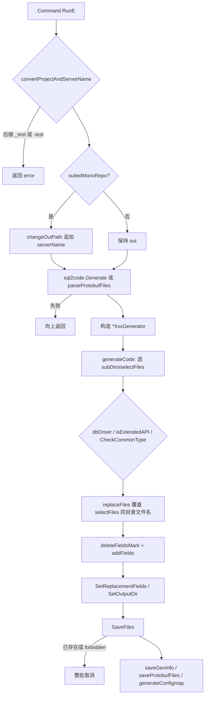
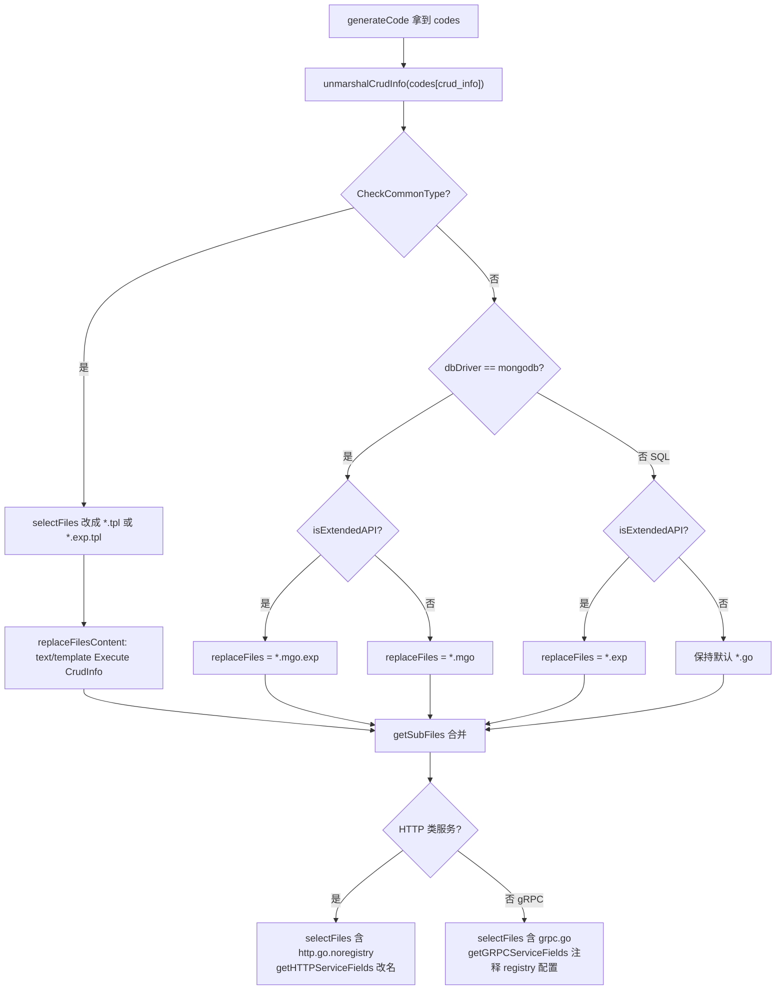

# 代码生成器与模板写入

> 状态：待复核生成稿
> 生成日期：2026-08-16
> 基准提交：`23807238c62e0f3b3e2d9a341bbef50547d3f5ec`
> 工作区：dirty
> 源码范围：`cmd/sponge/commands/generate/` 全部 `.go`、`pkg/replacer/` 实现与测试
> 生成方式：源码、测试、配置与部署资产静态分析

本篇是第四层模块文档。它补齐 [02-简单例子-全路径走读.md](02-简单例子-全路径走读.md) 和 [03-详细逐步说明-主链路拆解.md](03-详细逐步说明-主链路拆解.md) 只展开过的 `sponge web http` 之外，全部内置生成器调度与 `pkg/replacer` 写入契约。SQL 片段如何从 `SHOW CREATE TABLE` 变成 `codes[parser.CodeTypeModel]` 见 [06-SQL到代码片段引擎.md](06-SQL到代码片段引擎.md)；`make proto` 之后三个 protoc 插件如何增量合并见 [07-Protoc插件与增量合并.md](07-Protoc插件与增量合并.md)。

命名对照：仓库里**没有** `cmd/sponge/commands/generate/grpc.go`。基于 SQL 的 gRPC 服务生成器入口是 `rpc.go` 的 `RPCCommand`（CLI：`sponge micro rpc`）。`grpc-http.go` / `grpc-http-pb.go` 才是混合服务。下文按真实文件名写。

## 快速摘要

### 架构总览（模块与依赖）

生成期只有一条依赖方向：

```text
Cobra 命令（web / micro / config）
  → generate.*Command.RunE
    →（SQL 类）sql2code.Generate           详见 06
    →（Protobuf 类）parseProtobufFiles
    → *Generator.generateCode
      → pkg/replacer.Replacer（New 或 Replacers["sponge"]）
        → SetSubDirsAndFiles / SetIgnore* / SetReplacementFields / SetOutputDir
        → SaveFiles（先探测已存在文件，整批取消或整批写入）
      → saveGenInfo / saveProtobufFiles / generateConfigmap
```

`cmd/sponge/commands/generate/` 负责**选哪些模板、填哪些 Field、输出到哪**。`pkg/replacer` 负责**复制、替换、拒绝覆盖、拒绝写回模板目录**。模板源默认是 `generate.SpongeDir`（用户家目录下的 `.sponge`），由 `generate.Init` 在 CLI 启动时装进全局 `Replacers["sponge"]`。部分生成器故意再 `replacer.New(SpongeDir)` 拿一份独立实例，避免共享 Replacer 被 `SetSubDirsAndFiles` 永久裁剪。

运行期模板目录（被复制的骨架）包括：`cmd/serverNameExample_httpExample`、`cmd/serverNameExample_httpPbExample`、`cmd/serverNameExample_grpcExample`、`cmd/serverNameExample_grpcPbExample`、`cmd/serverNameExample_grpcHttpPbExample`、`cmd/serverNameExample_grpcGwPbExample`，以及 `internal/`、`sponge/`（go.mod、Makefile、deployments、scripts）下的占位文件。

### 核心调用序列（逐步逻辑）

以 `sponge web http` 为调度骨架（其它命令在第 4 步换生成器，不换 replacer 契约）：

1. `cmd/sponge/main.go:main` 调用 `generate.Init`；`~/.sponge` 不存在则除 `sponge` / `sponge -h` / `sponge init` 外全部拒绝。
2. `commands.NewRootCMD` → `GenWebCommand` → `generate.HTTPCommand`。
3. `HTTPCommand.RunE`：校验服务名后缀 → 可选 `changeOutPath`（mono-repo）→ `sql2code.Generate` 拿第一张表的 `codes`。
4. `httpGenerator.generateCode`：选 `selectFiles` / 变体 / `addFields` → `r.SaveFiles`。
5. 多表时对第 2 张表起循环 `handlerGenerator.generateCode`，输出目录复用第 4 步结果。
6. `saveGenInfo` 写 `docs/gen.info`；`generateConfigmap` 把 `configs/<server>.yml` 嵌进 k8s configmap（失败被忽略）。
7. 用户后续 `make proto` / `make docs` 才进入 [07-Protoc插件与增量合并.md](07-Protoc插件与增量合并.md) 描述的增量合并。

`SaveFiles` 内部固定顺序：过滤 ignore → 读文件 → 按 Field 替换内容 → 按 Field 替换路径名 → 若任一目标已存在则返回错误、**一个文件都不写** → `isForbiddenFile` 拒绝写回模板树 → `saveToNewFile`。

### 易错点与边界条件

- **module 替换顺序**：必须先把 `github.com/go-dev-frame/sponge` 换成用户 module，再把 `userModule/pkg` 换回 `github.com/go-dev-frame/sponge/pkg`。反了会把 `pkg` 也变成用户模块路径，生成项目无法编译。
- **已存在即整批取消**：`SaveFiles` 先扫描再写入。增量命令（`handler`/`dao`/`service`）对已有工程特别危险：目标文件在就全部取消。
- **共享 Replacer 会被裁剪**：`Replacers["sponge"]` 是进程级单例。`SetSubDirsAndFiles` 直接改 `r.files`。SQL 全量生成器多数用 `replacer.New(SpongeDir)` 避开这个问题；Protobuf 骨架生成器多数用单例。
- **`.tpl` / `.exp` / `.mgo` / `.noregistry` 不会自动去掉后缀**，必须由 Field 把文件名旧串换成无后缀名。漏一条 Field，磁盘上就会留下 `userExample.go.mgo`。
- **delete/todo 标记是生成锚点**，不是注释。`deleteFieldsMark` 读失败时静默返回空 Field，对应标记不会被清掉。
- **服务名 / 表名禁止 `_test`、`-test` 后缀**（`convertProjectAndServerName`）。表名细节见 [06-SQL到代码片段引擎.md](06-SQL到代码片段引擎.md)。
- **`DaoCommand --include-init-db` 是死 flag**：值被写入 `daoGenerator.isIncludeInitDB`，但 `generateCode` / `addFields` 从未读取。
- **`generateConfigmap` 失败被 `_ =` 丢掉**，生成仍打印成功。
- **`pkg/replacer` 的 README 示例 API 已过时**（`NewWithFS` / `SetIgnoreDirs` / `SetOutPath`），以 `replacer.go` 接口为准。

---

## 目录

- [为什么这样设计（Why）](#为什么这样设计why)
- [它是什么（What）](#它是什么what)
- [代码如何实现（How）](#代码如何实现how)
  - [进程入口与 Replacer 装载](#进程入口与-replacer-装载)
  - [通用调度骨架](#通用调度骨架)
  - [文件变体含义与选择流程](#文件变体含义与选择流程)
  - [delete / todo 标记机制](#delete--todo-标记机制)
  - [module 替换后再换回 sponge/pkg 的顺序陷阱](#module-替换后再换回-spongepkg-的顺序陷阱)
  - [已存在文件取消生成](#已存在文件取消生成)
  - [mono-repo 差异](#mono-repo-差异)
  - [pkg/replacer 完整契约](#pkgreplacer-完整契约)
  - [共享辅助：common.go / template.go / readme-template.go](#共享辅助commongo--templatego--readme-templatego)
- [每个内置生成器](#每个内置生成器)
- [对比总表](#对比总表)
- [调用关系表](#调用关系表)
- [测试覆盖](#测试覆盖)
- [阅读源码建议顺序](#阅读源码建议顺序)
- [重新实现检查清单](#重新实现检查清单)
- [源码索引](#源码索引)

---

## 为什么这样设计（Why）

Sponge 的产品承诺是：用户描述一张表或一份 proto，工具吐出可运行工程。这件事有三个互相冲突的约束：

1. **模板必须是能编译的真实 Go 工程**，而不是一堆 `{{.Name}}` 碎片。所以仓库里存在 `cmd/serverNameExample_*`、`internal/handler/userExample.go` 这种带业务味道的占位符。生成器的工作是把这些占位符换成用户的 module、server、表名。
2. **同一套分层代码要覆盖 MySQL / PostgreSQL / SQLite / MongoDB、标准 CRUD / 扩展 CRUD、普通主键 / 非 `id` 主键、单体 / mono-repo。** 若为每种组合复制一整棵目录，维护成本会爆炸。于是用文件后缀变体（`.mgo` `.exp` `.tpl` `.noregistry`）叠加 `selectFiles` 覆盖。
3. **生成必须可撤销、不可静默覆盖。** 用户可能已经改过 handler。所以 `SaveFiles` 发现目标存在就整批取消，而不是 merge。真正的增量合并留给 [07-Protoc插件与增量合并.md](07-Protoc插件与增量合并.md) 的 `sponge merge` 与 protoc 插件。

`pkg/replacer` 被做成无业务的字符串替换库，是为了让 `cmd/sponge/commands/template` 的自定义模板和内置生成器共用同一套落盘规则。内置生成器几乎只用 `SaveFiles`；`SaveTemplateFiles` 走 `text/template`，给自定义模板命令用。

---

## 它是什么（What）

内置生成器分成四类：

| 类别 | CLI 前缀 | 输入 | 输出粒度 | 典型命令 |
|---|---|---|---|---|
| SQL 全量服务 | `sponge web` / `sponge micro` | DSN + 表名 | 整棵可运行工程 | `http`、`rpc`、`grpc-http` |
| Protobuf 全量服务 | `sponge web` / `sponge micro` | `.proto` 文件 | 整棵可运行工程，业务逻辑留 `panic("implement me")` | `http-pb`、`rpc-pb`、`grpc-http-pb`、`rpc-gw-pb` |
| SQL 增量 CRUD | `web` / `micro` 子命令 | DSN + 表名 | 只吐 `internal/`（及部分 `api/`） | `handler`、`handler-pb`、`dao`、`model`、`service`、`service-handler`、`protobuf` |
| 非 CRUD 辅助 | `web` / `micro` / `config` | yaml、swagger、cache 键类型 | 单文件或 k8s 清单 | `cache`、`rpc-conn`、`config`、`swagger`、`config cm` |

命令注册位置：

- `commands.GenWebCommand`（`cmd/sponge/commands/web.go`）：`model`、`dao`、`cache`、`handler`、`http`、`http-pb`、`swagger`、`handler-pb`
- `commands.GenMicroCommand`（`cmd/sponge/commands/micro.go`）：`protobuf`、`model`、`dao`、`cache`、`service`、`rpc`、`rpc-gw-pb`、`rpc-pb`、`rpc-conn`、`grpc-http`、`grpc-http-pb`、`service-handler`
- `commands.NewRootCMD` 直接挂 `generate.ConfigCommand`（含子命令 `cm`）

`model` / `dao` / `cache` 同时出现在 `web` 和 `micro` 下，实现函数带 `parentName string`，只影响 Example 文案和帮助里的 `sponge %s dao`。

---

## 代码如何实现（How）

### 进程入口与 Replacer 装载

`cmd/sponge/main.go` 在执行 Cobra 之前调用 `generate.Init`（`cmd/sponge/commands/generate/init.go`）。

`Init` 行为：

1. `SpongeDir = os.UserHomeDir() + delimiter + ".sponge"`。
2. 目录不存在：若 `isShowCommand()` 为真（参数是空、`-h`、`init`，或前三个参数拼接后包含 `init`）则返回 `nil`；否则返回 `"⚠  not yet initialized, run the command \"sponge init\""`。
3. 若 `Replacers[TplNameSponge]` 已存在则 `panic`（模板名 `"sponge"` 冲突）。
4. `Replacers["sponge"], err = replacer.New(SpongeDir)`，列出该目录下全部文件。

`InitFS(name, filepath, fs embed.FS)` 把 embed 模板登记进同一个 `Replacers` map，失败则 panic。内置生成器**没有**走 `InitFS`；它给自定义模板预留。`cmd/sponge/main.go` 只调 `Init`。

两个取 Replacer 的方式：

| 方式 | 调用 | 谁用 | 副作用 |
|---|---|---|---|
| 全局单例 | `r := Replacers[TplNameSponge]` | `http-pb`、`rpc-pb`、`grpc-http`/`grpc-http-pb` 共用的 `httpAndGRPCPbGenerator`、`rpc-gw-pb`、`model`、`cache`、`rpc-conn`、`configmap` | `SetSubDirsAndFiles` 永久缩小 `r.files` |
| 独立实例 | `r, _ := replacer.New(SpongeDir)` | `http`、`rpc`、`handler`、`handler-pb`、`dao`、`service`、`service-handler` | 每次从磁盘重新 ListFiles；`New` 的 error 被 `_` 丢掉，只判断 `r == nil` |

`New` 失败时返回 `(nil, err)`，所以 `r == nil` 能抓住“模板目录不存在”。独立实例适合多表循环：每张表重新 `New`，不会被上一张表的 `selectFiles` 污染。

### 通用调度骨架

绝大多数 SQL 全量 / 增量生成器的 `generateCode` 都按下面顺序编排。Protobuf 骨架生成器跳过 `sql2code` 和 CRUD 变体选择。



`getSubFiles(selectFiles, replaceFiles)` 的规则：对 `selectFiles` 的每个目录，若 `replaceFiles` 有同 key，则**整表替换该目录的文件名列表**，不是合并。这就是 `.mgo` / `.exp` 覆盖 `.go` 的机制。

`SetSelectFiles(dbDriver, selectFiles)` 只改 `internal/database`：

| dbDriver | 选中文件 |
|---|---|
| mysql / tidb | `init.go`, `redis.go`, `mysql.go` |
| postgresql | `init.go`, `redis.go`, `postgresql.go` |
| sqlite | `init.go`, `redis.go`, `sqlite.go` |
| mongodb | `init.go.mgo`, `redis.go`, `mongodb.go.mgo` |
| 其它 | `unsupported db driver` |

MongoDB 路径里，生成器还会把 `init.go.mgo` → `init.go`、`mongodb.go.mgo` → `mongodb.go` 写成 Field，落盘后后缀消失。

默认输出目录：`SetOutputDir(absPath, name...)`。若 `--out` 为空，则在 cwd 下生成 `name1_name2_HHmmss`。全量服务传入 `serverName+"_"+subTplName`（如 `user_http`）；增量命令只传 `subTplName`（如 `handler`）。

### 文件变体含义与选择流程

模板树里同一逻辑常有多份文件，靠后缀区分。生成器**不会**按后缀自动挑选，必须显式写进 `selectFiles` / `replaceFiles`，再用 Field 把后缀从文件名里剥掉。

| 后缀常量 | 值 | 含义 | 何时选用 |
|---|---|---|---|
| （无） | `.go` | 默认：GORM + 标准主键 `id` + 基础 CRUD | MySQL/PG/TiDB/SQLite 且非 extended 且非 common style |
| `tplSuffix` | `.tpl` | `text/template` 源，占位符是 `{{.ColumnNameCamel}}` 等 `parser.CrudInfo` 字段 | `crudInfo.CheckCommonType()` 为真（非 Mongo、未 embed `gorm.Model`、主键不是标准 `id` 整型） |
| `expSuffix` | `.exp` | 扩展 API：额外 `DeleteByIDs`、`GetByCondition`、`ListByIDs`、`ListByLatestID` | `--extended-api=true` 且非 common style |
| `.exp.tpl` | 两后缀叠加 | 扩展 API + common style | 两者同时成立 |
| `mgoSuffix` | `.mgo` | MongoDB DAO/handler/cache/types | `db-driver=mongodb` |
| `.mgo.exp` | 叠加 | MongoDB + 扩展 API | Mongo 且 extended |
| `.noregistry` | `.noregistry` | 去掉服务注册发现的 HTTP server | HTTP 类服务调用 `getHTTPServiceFields`，把 `http.go.noregistry` 重命名为 `http.go` |
| `.service` / `.service.tpl` / `.service.exp.tpl` | 混合服务专用 handler | `service-handler` / `grpc-http` 的 HTTP 入口调用 gRPC service，而不是直接写 DAO | 仅 `serviceAndHandlerGenerator` |

`CheckCommonType` 来自 [06-SQL到代码片段引擎.md](06-SQL到代码片段引擎.md)：`parser.tmplData.isCommonStyle` 在「不是 Mongo、没有 embed、主键不是 `id`+整型」时把 `CrudInfo.IsCommonType=true`。此时生成器改选 `.tpl`，并调用 `replaceFilesContent`：对每个 `.tpl` 文件 `template.Must.Parse` + `Execute(crudInfo)`，把整文件旧内容 → 渲染结果做成一条 Field。渲染前若内容含 `{{{.ColumnNameCamelFCL}}}`，先替换成 `{fieldName}`（给 gin 路由参数用）。渲染后若结果不再引用 `utils.` / `math.MaxInt32`，会删掉对应 import。



选择完成后还有一次**文件名 Field**，例如 `"userExample.go.mgo" → "userExample.go"`。内容替换发生在路径替换之前（`SaveFiles` 先改 `data` 再改 `newFilePath`），所以文件名 Field 既改路径也改文件内字符串引用。

### delete / todo 标记机制

模板里有两类锚点，定义在 `common.go`：

**1. 删除块（生成时整段抹掉）**

```text
// delete the templates code start
... 示例工程才需要的代码 ...
// delete the templates code end
```

`symbolConvert` 把开头的 `//` 换成 `#`，得到 yaml/shell/Makefile 用的 `wellStartMark` / `wellEndMark`。

| 函数 | 行为 |
|---|---|
| `deleteFieldsMark(r, filename, start, end)` | `r.ReadFile` → `gofile.FindSubBytes` 找**第一对**标记 → Field `{Old: 中间含标记的子串, New: ""}` |
| `deleteAllFieldsMark` | `FindAllSubBytes`，每一对都生成一条 Field |
| `DeleteCodeMark` | 导出别名，行为同 `deleteFieldsMark` |

`ReadFile` 失败时这两个函数**返回空切片且不报错**（`deleteFieldsMark` 把 printf 注释掉了）。结果是模板里的示例代码会泄漏进用户工程。

`ReadFile` 的匹配规则：遍历 `r.files`，路径包含 `filename` 且基名相等。匹配数不是 1 则报 `total N file named '...'`。这就是为什么标记路径写成 `"model/userExample.go"` 这种后缀，而不是绝对路径。

**2. 插入块（生成时用 sql2code 片段替换标记行）**

| 常量 | 标记字符串 | 替换成 |
|---|---|---|
| `modelFileMark` | `// todo generate model code to here` | `codes[parser.CodeTypeModel]` |
| `databaseInitDBFileMark` | `// todo generate initialisation database code here` | `getInitDBCode(dbDriver)` |
| `daoFileMark` | `// todo generate the update fields code to here` | `codes[parser.CodeTypeDAO]` |
| `handlerFileMark` | `// todo generate the request and response struct to here` | `adjustmentOfIDType(codes[handler])` |
| `protoFileMark` | `// todo generate the protobuf code here` | `codes[parser.CodeTypeProto]` |
| `serviceFileMark` | `// todo generate the service struct code here` | `adjustmentOfIDType(codes[service])` |
| `embedTimeMark` | `// todo generate the conversion createdAt and updatedAt code here` | `getEmbedTimeCode(isEmbed)` |
| `appConfigFileMark` | `# todo generate http or rpc server configuration here` | `httpServerConfigCode` / `rpcServerConfigCode` / … |
| `appConfigFileMark2` | `# todo generate the database configuration here` | `getDBConfigCode(driver)` |
| `appConfigFileMark3` | `# todo generate the registry and discovery configuration here` | HTTP 清空；gRPC 填注释掉的 consul/etcd/nacos |
| `dockerFileMark` 等 | `# todo generate dockerfile code for http or grpc here` 等 | `template.go` 里的 HTTP 或 gRPC 片段 |
| `spongeTemplateVersionMark` | `// todo generate the local sponge template code version here` | `github.com/go-dev-frame/sponge <version>` |
| `configmapFileMark` | `# todo generate server configuration code here` | 缩进后的 yaml |
| `showDbNameMark` | `// todo show db driver name here` | `// db driver is mysql` 等 |

`replaceFileContentMark(r, filename, newContent)` 把**整个文件**换成 `newContent`。全量生成器用它覆盖 `sponge/README.md`，内容来自 `readme-template.go` 的 `getReadmeContent`。

`adjustmentOfIDType(handlerCodes, dbDriver, isCommonStyle)`：Mongo 把 `ObjDetail.ID` 改成 `string`；common style 原样返回；否则把 `ByIDRequest.ID` 和 `ObjDetail.ID` 改成 `uint64`。这是为了让 SQL 生成的 handler 类型与模板里的路由绑定一致。

### module 替换后再换回 sponge/pkg 的顺序陷阱

几乎所有生成器的 `addFields` 末尾都有这一对（顺序不可互换）：

```go
{Old: "github.com/go-dev-frame/sponge", New: g.moduleName},
{Old: g.moduleName + pkgPathSuffix,     New: "github.com/go-dev-frame/sponge/pkg"},
```

`pkgPathSuffix` 是 `"/pkg"`。`SaveFiles` 按切片顺序对**每个文件内容**做 `bytes.ReplaceAll`，然后对**路径**再做一遍。

正向（当前实现）：

1. 模板里的 `github.com/go-dev-frame/sponge/pkg/gin` 先变成 `yourModule/pkg/gin`。
2. 第二条把 `yourModule/pkg` 换回 `github.com/go-dev-frame/sponge/pkg`。
3. 用户业务 import（`yourModule/internal/...`）保持用户 module。

若颠倒：

1. 第二条的 Old 是 `yourModule/pkg`，模板里还不存在，空操作。
2. 第一条把 `github.com/go-dev-frame/sponge`（含 `/pkg`）全部换成用户 module。
3. 生成项目会去 `yourModule/pkg/gin` 找包，而 `pkg` 仍发布在 `github.com/go-dev-frame/sponge/pkg`。编译失败。

还有第三条相关 Field，SQL 全量生成器会加：

```go
{Old: selfPackageName + "/" + r.GetSourcePath(), New: g.moduleName}
```

`selfPackageName` 仍是 `github.com/go-dev-frame/sponge`，`GetSourcePath()` 是 `~/.sponge` 的绝对路径。它处理“模板被当成 Go 源码时出现的 `sponge/<abs-path>` import”。必须放在全局 module 替换附近；因为它包含 `selfPackageName`，若在第一条之后执行，Old 已经对不上。`httpGenerator.addFields` 把它放在 `github.com/go-dev-frame/sponge → moduleName` **之前**，这是对的。

`GetGoModFields(moduleName)`（`common.go`）打包了 module、Go 版本、镜像版本、sponge 版本四条 Field，但内置全量生成器多数是手写等价切片，而不是调用它。重实现时用 `GetGoModFields` 更不容易漏。

`serverCodeFields` 在 mono-repo 下还有一条反向替换：`go get <moduleName>@` → `go get github.com/go-dev-frame/sponge@`，避免脚本去用户 module 拉 sponge 自身。

### 已存在文件取消生成

`replacerInfo.SaveFiles`：

1. `outPath` 为空则落到 `gofile.GetRunPath()/generate_HHmmss`。
2. 遍历 `r.files`，跳过 `isInIgnoreDir` / `isIgnoreFile`。
3. 读内容，按 Field 替换，计算 `getNewFilePath`（`outPath + strings.Replace(file, r.path, "", 1)`），再对目录名和文件名做 Field 替换。
4. 若 `gofile.IsExists(newFilePath)`，加入 `existFiles`，**仍继续扫描**，不提前返回。
5. `len(existFiles) > 0` 时返回：

   ```text
   existing files detected
       <path1>
       <path2>
   Code generation has been cancelled
   ```

   此时 `writeData` 全部丢弃，磁盘无变更。
6. 对每个待写路径调用 `isForbiddenFile(file, r.path)`：若目标路径字符串包含模板源路径（Windows 先统一分隔符），返回 `disable writing file(...) to directory(...)`。这阻止把生成结果写回 `~/.sponge`。
7. 最后才 `os.MkdirAll` + `os.WriteFile(..., 0666)`。

`SaveTemplateFiles` 的策略更严：循环中**第一个**已存在文件就立刻返回 `"file %s already exists, cancel code generation"`，且**没有** `isForbiddenFile` 检查。内置 CRUD 生成器不用这条路径。

增量命令把 `--out` 指到已有服务目录时，第一次生成 `internal/handler/user.go` 成功；第二次再生成同一张表必然整批取消。这是刻意的，不是 bug。多表循环能成功，是因为每张表文件名不同（`UserExample` → 各自表名）。

`saveProtobufFiles` 有自己的存在检查：目标 `api/<server>/v1/<name>.proto` 已存在则返回 `file %s already exists`，但**已经 SaveFiles 成功的 Go 文件不会回滚**。Protobuf 骨架命令的顺序是先 `SaveFiles` 再 `saveProtobufFiles`，所以 proto 冲突会留下半成品工程。

### mono-repo 差异

`--suited-mono-repo=true` 时：

1. `changeOutPath`：若 `--out` 为空、`.`、`./`、`serverName` 或 `./serverName`，输出就是 `serverName`；否则是 `outPath + delimiter + serverName`。即每个服务一个子目录。
2. 从 `subFiles` 去掉 `sponge/go.mod`、`sponge/go.sum`（mono-repo 根目录已有模块文件）。
3. 从 `subDirs` 去掉 `sponge/third_party`（共享第三方 proto）。
4. 去掉 `api/types/types.proto` 或整个 `selectFiles["api/types"]`（由 `rpcGenerator` 的 `delete(selectFiles, "api/types")`）。
5. `addFields` 追加 `serverCodeFields(serverType, moduleName, serverName)` 或增量用的 `SubServerCodeFields`。

`serverCodeFields` 把 import 和脚本路径从 `module/internal` 改成 `module/serverName/internal`，并改写：

- `docs/gen.info` 读取路径
- `protoc` 的 `--dir=internal/ecode`：HTTP 保持原样，其它类型改成 `--dir=<server>/internal/ecode`（`adaptDupCode`）
- `sponge merge http-pb|rpc-pb|rpc-gw-pb` 追加 `--dir=<server>`
- `protoBasePath="api"` 换成先 `bash scripts/patch-mono.sh` 再 `cd ..`
- `HOST_ADDR=$1` 换成先执行 `patch-mono.sh`
- `sponge patch gen-types-pb --out=./` 换成检测 `../api/types` 不存在才生成并 `mv`

`SubServerCodeFields` 只改三个 import 前缀：`internal/`、`configs`、`api`。增量 CRUD 用这个短列表。

带 proto 输出的生成器在 `SaveFiles` 之后调用 `moveProtoFileToAPIDir`：先按当前输出列出 `api/**/*.proto`，再 `saveProtobufFiles`（mono-repo 时会 `TrimSuffix(outputDir, serverName)`，把 proto 写到仓库根的 `api/<server>/v1`），最后 `os.RemoveAll(outputDir/api)`。失败则生成失败。`saveProtobufFiles` 还会改 proto 的 `package api.<server>.v1;` 和 `go_package = "<module>/api/<server>/v1;v1"`。

`saveGenInfo` 写入 `outputDir/docs/gen.info`，内容 `moduleName,serverName,true|false`。增量命令用 `getNamesFromOutDir` 读它来省略 `--module-name`。两段时默认 `suitedMonoRepo=false`；三段及以上时第三段 `== "true"` 才为真。

---

### pkg/replacer 完整契约

包路径：`pkg/replacer/replacer.go`。唯一实现是未导出的 `replacerInfo`，用 `var _ Replacer = (*replacerInfo)(nil)` 锁住接口。

#### 接口

```go
type Replacer interface {
    SetReplacementFields(fields []Field)
    SetSubDirsAndFiles(subDirs []string, subFiles ...string)
    SetIgnoreSubDirs(dirs ...string)
    SetIgnoreSubFiles(filenames ...string)
    SetOutputDir(absDir string, name ...string) error
    GetOutputDir() string
    GetSourcePath() string
    SaveFiles() error
    ReadFile(filename string) ([]byte, error)
    GetFiles() []string
    SaveTemplateFiles(m map[string]interface{}, parentDir ...string) error
}
```

#### 构造

- `New(path)`：`gofile.ListFiles(path)`，`filepath.Abs`，`isActual=true`。目录不存在则返回 error。
- `NewFS(path, fs embed.FS)`：`listFiles` 递归 `fs.ReadDir`，拼 `dirPath+"/"+file.Name()`，`isActual=false`。embed 路径始终用 `/`。

#### Field

```go
type Field struct {
    Old             string
    New             string
    IsCaseSensitive bool // 名称有误导：实际是“首字母大小写各生成一条”
}
```

`SetReplacementFields`：若 `IsCaseSensitive && isFirstAlphabet(Old)`：

- `New == ""` 则**整条丢弃**（不会生成大小写两条）。
- 否则拆成 `Upper(Old[0])+Old[1:] → Upper(New[0])+New[1:]` 和 lower 对应。
- 不再保留原始 Field。

注释写明：**Old 之间不要互相包含；若包含，必须自己控制切片顺序。** 这正是 module/`pkg` 陷阱的根源。

`isFirstAlphabet`：长度为 0 为 false；只认 ASCII `A-Z` `a-z`。UTF-8 服务名的首字母大小写拆分不会发生。

#### 子集与忽略

`SetSubDirsAndFiles`：Windows 且 `isActual` 时先把 `/` 换成 `\`。然后：

- 文件路径的目录部分 `strings.Contains(dir, subPath)` 则收录（`isSubPath`）。注意是 Contains 不是前缀匹配，`internal/dao` 会匹配 `internal/dao` 也会误伤名字更长的目录。
- `isMatchFile`：基名必须相等，且 `filePath` 的目录后缀等于 `sf` 的目录。
- 用 map 去重。
- **若过滤结果为空，函数直接 return，保留原来的全量 `r.files`。** 这是静默失败：写错子目录名等于“处理全部模板”。

`SetIgnoreSubFiles` / `SetIgnoreSubDirs` 是 append。`isIgnoreFile` 用 `isMatchFile`；`isInIgnoreDir` 用 `strings.Contains(dir, v)`，同样是包含匹配。

#### 路径计算与 Windows

`getNewFilePath`：`outPath + strings.Replace(file, r.path, "", 1)`，Windows 再把 `/` 换成 `\`。`NewFS` 的 `r.path` 是 embed 逻辑路径，输出仍拼到本地 `outPath`。

`convertPathDelimiter` 只在 `isActual && Windows` 时转换 `ReadFile` 的查询串。

#### SaveTemplateFiles（自定义模板，非内置 CRUD）

对每个文件：`os.ReadFile`（**只用本地文件，忽略 embed**）→ 若含 `{{` 则 `text/template` Execute → `getNewFilePath2` 可选插入 parentDir → `trimExt` 去掉 `.tmpl` `.tpl` `.template` → 已存在则立刻失败 → 路径本身也可含 `{{`，再 Execute 一次 → 写入。无 ignore、无 Field、无 `isForbiddenFile`。

`cmd/sponge/commands/template/{field,sql,protobuf}.go` 走这条 API，不属于本篇命令清单，但重实现 replacer 时必须保留。

#### 测试证据（`pkg/replacer/replacer_test.go`）

| 用例 | 覆盖 |
|---|---|
| `TestNewWithFS/New` | 本地目录：子集 `testDir/replace` + 文件 `testDir/foo.txt`，忽略目录 `testDir/ignore`、文件 `test.txt`，Field `1234→....` 与大小写敏感 `abcdef→hello_`，`ReadFile("replace.txt")`，`SaveFiles` |
| `TestNewWithFS/NewFS` | embed.FS 同样参数 |
| `TestSaveTemplateFiles` | `m={service:{name,version}, port, isSecure}` 渲染 `testDir` |
| `TestReplacerError` | `New("/notfound")`、`NewFS("/notfound")` 报错；空 `SetIgnoreSubFiles` / `SetSubDirsAndFiles(nil)`；空 `replacerInfo{}.SaveFiles` 因 `files` 为空而成功 |

测试夹具：

- `testDir/foo.txt`：含 `456` 和 `{{.service}}` 等。
- `testDir/replace/replace.txt`：`1234567890` + 大小写字母表。
- `testDir/replace/abcdef.txt`：内容 `change file name`，文件名会被 `abcdef→hello_` 改掉。
- `testDir/replace/test.txt`：应被 `SetIgnoreSubFiles("test.txt")` 跳过。
- `testDir/ignore/ignore.txt`：应被忽略目录跳过。

未覆盖（实现有、测试没有）：

- 已存在文件取消生成
- `isForbiddenFile`
- `IsCaseSensitive` 且 `New==""` 丢弃
- `SetSubDirsAndFiles` 匹配为零时保留全量
- `ReadFile` 0 个或多个匹配
- Windows 分隔符
- `SaveTemplateFiles` 路径中的 `{{`
- 并发使用同一个 `Replacer`

---

### 共享辅助：common.go / template.go / readme-template.go

`common.go` 还提供：

| 符号 | 作用 |
|---|---|
| `parseProtobufFiles` | 扩展名必须 `.proto`；`FuzzyMatchFiles`；统计 `service Xxx` 与是否 import `api/types/types.proto`；零 service 则报错 |
| `ParseFuzzyProtobufFiles` | 逗号分隔多个 glob |
| `sqliteDSNAdaptation` | Windows 下 sqlite DSN 的 `\` `/` 换成 `\\` |
| `adaptPgDsn` | 补 `postgres://`、去括号、默认 `sslmode=disable`，再剥掉 scheme 写回 yaml |
| `parseImageRepoAddr` | 无 `/` 视为 Docker Hub `https://index.docker.io/v1`；否则最后一段是 name，前面是 host |
| `getLocalGoVersion` / `extractImageGoVersion` | `go version` 与默认 `go 1.23.0` 取较大者；镜像 `golang:X.Y-alpine` |
| `getExpectedSQLForDeletionField` | 非 embed 时把测试里的 `UPDATE` 软删改成 `DELETE`，并清掉时间参数 |
| `flagTip` | 增量命令 `--out` 帮助：指定已有工程目录时可省略 module/server |
| `removeElements` | 从切片删指定字符串 |

`template.go` 存放写入 Dockerfile、compose、k8s、`protoc.sh` 片段、HTTP/gRPC/网关 yaml 配置、各驱动 database yaml、`InitDB` switch 代码。Protobuf 骨架的 `protoc.sh` 标记替换为：

| 常量 | 用于 | 效果 |
|---|---|---|
| `protoShellGRPCMark` | rpc / rpc-pb / grpc-http* / rpc-gw | 生成 `*_grpc_pb.go` |
| `protoShellServiceTmplCode` | rpc / rpc-pb | `--go-rpc-tmpl` + `sponge merge rpc-pb` |
| `protoShellHandlerCode` | http-pb | openapiv2 + `sponge web swagger` + `--go-gin plugin=handler` + `merge http-pb` |
| `protoShellServiceCode` | rpc-gw-pb | openapiv2 + `sponge web swagger` + `--go-gin plugin=service` + `merge rpc-gw-pb` |
| `protoShellServiceAndHandlerCode` | grpc-http / grpc-http-pb | rpc-tmpl 与 gin `plugin=mix` 两套，再分别 merge |

这些 shell 片段是 [07-Protoc插件与增量合并.md](07-Protoc插件与增量合并.md) 的调用方，本篇只说明它们如何被 Field 嵌进 `scripts/protoc.sh`。

`readme-template.go`：`newReadmeTemp` 按 `serverType` 选中文 README 模板，`suitedMonoRepo` 决定 RepoType 为 `mono-repo` / HTTP 的 `monolith` / 其它的 `multi-repo`。Mongo 的 ORM 写成 `mongodb`，其余 `gorm`。模板里的 `<BQ>` 渲染后换成反引号。

---

## 每个内置生成器

下列每一节都独立给出：入口函数、关键 flags、生成器类型名、模板子目录、特殊 Field、失败条件。禁止把未展开的命令理解成“和 http 一样”。

### `HTTPCommand`（`http.go`）— SQL → HTTP 全量服务

- **入口函数**：`HTTPCommand` → CLI `sponge web http`
- **生成器类型名**：`httpGenerator`；多表从第 2 张起改用 `handlerGenerator`
- **模板子目录 `subTplName`**：`codeNameHTTP` = `"http"`；cmd 骨架 `cmd/serverNameExample_httpExample`
- **关键 flags**（`*` 必填）：`--module-name/-m*`、`--server-name/-s*`、`--project-name/-p*`、`--db-driver/-k` 默认 mysql、`--db-dsn/-d*`、`--db-table/-t*`（逗号多表）、`--embed/-e`、`--extended-api/-a`、`--suited-mono-repo/-l`、`--json-name-type/-j` 默认 1（camel）、`--repo-addr/-r`、`--out/-o` 默认 `./serverName_http_<time>`，mono-repo 时为 `serverName`
- **RunE 步骤**：
  1. `strings.Split(dbTables, ",")`：第 1 张给 `httpGenerator`，其余给 `handlerGenerator`。
  2. `convertProjectAndServerName`：project 转 kebab-case，server 的 `-` 改 `_`；后缀 `-test`/`_test` 失败。
  3. Mongo 强制 `IsEmbed=false`。
  4. mono-repo 则 `changeOutPath`。
  5. `sqlArgs.DBTable=firstTable` → `sql2code.Generate`（失败见 [06-SQL到代码片段引擎.md](06-SQL到代码片段引擎.md)）。
  6. `httpGenerator.generateCode`；成功后循环 handler。
  7. 打印 `make docs` / `make run` / swagger 帮助；`generateConfigmap` 错误忽略。
- **selectFiles（默认 SQL）**：`docs/docs.go`；`internal/{cache,dao,handler,model,types,routers,ecode,config,database}` 的 `userExample*`；`internal/server` 为 `http.go.noregistry`、`http_option.go.noregistry`。`SetSelectFiles` 覆盖 database。
- **变体**：common style → cache/dao/handler/routers/types/ecode 改 `.tpl`（extended 则 `.exp.tpl`），并 `commonHTTPFields`=`commonHandlerFields`。SQL extended 且非 common → `handlerExtendedAPI(r, codeNameHTTP)` 选 `.exp`，含 `systemCode_http.go`、`routers.go`、`swagger_types.go`。Mongo 非 extended → cache/dao/handler/types 的 `.mgo`；Mongo extended → `handlerMongoDBExtendedAPI`。
- **subDirs / subFiles**：`cmd/serverNameExample_httpExample`、`sponge/configs|deployments|scripts`；文件含 `.gitignore` `.golangci.yml` `go.mod` `go.sum` `Jenkinsfile` `Makefile-for-http` `README.md`。mono-repo 去掉 go.mod/sum。
- **ignore**：目录 `cmd/sponge`；文件 `scripts/image-rpc-test.sh`、`patch.sh`、`protoc.sh`、`proto-doc.sh`、`configs/serverNameExample_cc.yml`。HTTP **故意忽略 proto 脚本**，因为走 swag 而不是 protoc。
- **Replacer 来源**：`replacer.New(SpongeDir)` 独立实例。
- **特殊 Field**：
  - 配置：`appConfigFileMark` → `httpServerConfigCode`（端口 8080）；`appConfigFileMark2` → 对应驱动 DSN yaml。
  - CRUD 插入：model/dao/handler 三个 todo；handler 经 `adjustmentOfIDType`。
  - 部署：Dockerfile/compose/k8s 全部 HTTP 片段（curl health，8080）。
  - `Makefile-for-http` → `Makefile`。
  - `getHTTPServiceFields`：清空 registry 标记；`http.go.noregistry` → `http.go`；注释 `registryDiscoveryType`。
  - `UserExample` 大小写敏感 → `codes[parser.TableName]`。
  - 随机 `userExampleNO = rand.Intn(99)+1`。
  - DSN 三套占位（mysql/mongo/pg）+ sqlite 路径。
  - README 整文件替换为 HTTP 模板。
- **输出**：可运行 HTTP 工程 + `docs/gen.info` + 尝试写 configmap。
- **失败条件**：服务名后缀非法；`sql2code.Generate` 失败；`replacer` nil；`SetSelectFiles` 未知驱动；`dbDriverErr`；`replaceFilesContent` 的 template panic/error；`SaveFiles` 已存在或 forbidden；后续 handler 生成失败则骨架已落盘（无回滚）。
- **与自身基线的差异**：本命令就是基线。特点是无 `third_party`、无 proto、Makefile 用 `Makefile-for-http`、server 用 `.noregistry`。

### `HTTPPbCommand`（`http-pb.go`）— Protobuf → HTTP 骨架

- **入口函数**：`HTTPPbCommand` → `sponge web http-pb`
- **生成器类型名**：`httpPbGenerator`
- **模板子目录**：`codeNameHTTPPb` = `"http-pb"`；cmd 骨架 `cmd/serverNameExample_httpPbExample`
- **关键 flags**：`--module-name*` `--server-name*` `--project-name*` `--protobuf-file/-f*` `--suited-mono-repo` `--repo-addr` `--out`（默认 `./serverName_http-pb_<time>`）。**无 DSN、无表名、无 embed/extended。**
- **RunE 步骤**：`convertProjectAndServerName` → 可选 `changeOutPath` → `generateCode` → `generateConfigmap`。帮助文案要求 `make proto` 后手写 `internal/handler/xxx.go` 的 `panic("implement me")`。
- **selectFiles**：`docs/apis.go`、`apis.swagger.json`；`internal/config`；`internal/ecode/systemCode_http.go`；`internal/routers/routers_pbExample.go`；`internal/server` 的两个 `.noregistry`。**没有** cache/dao/handler/model/types。
- **subDirs**：比 HTTP 多 `sponge/third_party`。若 proto import 了 `api/types/types.proto`，追加该文件。mono-repo 去掉 third_party、go.mod/sum、types.proto。
- **ignore**：`cmd/sponge`、`configs/serverNameExample_cc.yml`。**不忽略** `protoc.sh`。
- **Replacer 来源**：`Replacers[TplNameSponge]` 单例。
- **特殊 Field**：无 model/dao/handler 插入。`appConfigFileMark2` 用 `undeterminedDBDriver`（占位 mysql 注释 + `reference-db-config-url`）。`protoShellFileGRPCMark` 清空；`protoShellFileMark` → `protoShellHandlerCode`（go-gin plugin=handler）。删除 Makefile 全部 well 标记。`_httpPbExample` `_pbExample` `_mixExample` 清空。`getHTTPServiceFields` 同 HTTP。`saveProtobufFiles` + `saveEmptySwaggerJSON`。
- **失败条件**：非 `.proto`；模糊匹配失败；proto 无 `service`；replacer nil；SaveFiles；目标 proto 已存在。
- **与 http 的差异**：输入是 proto 不是 SQL；无 CRUD 层文件；用单例 Replacer；保留 protoc 脚本；数据库配置未定；生成后必须 `make proto`（见 [07-Protoc插件与增量合并.md](07-Protoc插件与增量合并.md)）。

### `RPCCommand`（`rpc.go`）— SQL → gRPC 全量服务

- **入口函数**：`RPCCommand` → `sponge micro rpc`（这就是“grpc 生成器”，文件不叫 grpc.go）
- **生成器类型名**：`rpcGenerator`；多表从第 2 张起用 `serviceGenerator`
- **模板子目录**：`codeNameGRPC` = `"grpc"`；cmd 骨架 `cmd/serverNameExample_grpcExample`
- **关键 flags**（`*` 必填）：`--module-name/-m*`、`--server-name/-s*`、`--project-name/-p*`、`--db-driver/-k` 默认 mysql、`--db-dsn/-d*`、`--db-table/-t*`、`--embed/-e`、`--extended-api/-a`、`--suited-mono-repo/-l`、`--json-name-type/-j` 默认 1、`--repo-addr/-r`、`--out/-o` 默认 `./serverName_rpc_<time>`。
- **RunE 步骤**：拆表 → 名称校验 → mono-repo 改路径 → Mongo 关 embed → 第一张 `rpcGenerator`，其余 `serviceGenerator` → 打印 `make proto` 和 `internal/service/xxx_client_test.go` → configmap。
- **selectFiles**：`api/serverNameExample/v1/userExample.proto`、`api/types/types.proto`；cache/dao/model/database；`ecode/systemCode_rpc.go` + `userExample_rpc.go`；`server/grpc.go` + `grpc_option.go`；`service/service.go` `service_test.go` `userExample.go`（client_test 在源码里被注释掉，不选）。mono-repo 删除 `api/types`。
- **变体**：common → cache/dao/ecode/service 的 `.tpl` / `.exp.tpl`，`commonGRPCFields`=`commonServiceFields`。SQL extended → `serviceExtendedAPI(r, codeNameGRPC)`（含 `systemCode_rpc.go` 和 `service.go`）。Mongo 非 extended → cache/dao/service `.mgo`，并删除 `userExample.go.mgo` 的 delete 块。Mongo extended → `serviceMongoDBExtendedAPI(r, codeNameHTTP)`（**第二个参数传的是 `codeNameHTTP` 而不是 `codeNameGRPC`**，因此不会走 `codeName==codeNameService` 的精简分支，会保留 `systemCode_rpc.go` 和 `service.go`。对全量 rpc 工程这是合理的；若误用于增量 service 则文件偏多）。
- **subDirs**：含 `sponge/third_party`。
- **ignore**：`scripts/swag-docs.sh`、`configs/serverNameExample_cc.yml`（gRPC 不用 swag）。
- **Replacer 来源**：`replacer.New(SpongeDir)`。
- **特殊 Field**：
  - `appConfigFileMark` → `rpcServerConfigCode`（grpc 8282、httpPort 8283、grpcClient 块）。
  - proto 插入 `codes[CodeTypeProto]`；service 插入 `adjustmentOfIDType(codes[CodeTypeService])`；`embedTimeMark`。
  - `protoShellFileGRPCMark` → `protoShellGRPCMark`；`protoShellFileMark` → `protoShellServiceTmplCode`。
  - 部署全套 **gRPC** 片段（`grpc_health_probe`，端口 8282/8283）。
  - 目录名 `api/userExample/v1` → `api/<server>/v1`（注意 HTTP 没有这条）；`api.userExample.v1` protobuf package。
  - `getGRPCServiceFields`：写入注释掉的 consul/etcd/nacos，并注释 `registryDiscoveryType`。**不使用** `.noregistry`。
  - 错误码随机 `_userExampleNO = 2` 这一行（下划线前缀，与 HTTP 的 `userExampleNO = 1` 不同）。
  - mono-repo 后 `moveProtoFileToAPIDir`。
- **失败条件**：服务名后缀 `-test`/`_test`；`sql2code.Generate` 失败；`replacer` nil；`SetSelectFiles` 未知驱动；`dbDriverErr`；`replaceFilesContent` 的 template panic/error；`SaveFiles` 已存在或 forbidden；mono-repo 下 `moveProtoFileToAPIDir` 失败；后续 `serviceGenerator` 失败则骨架已落盘（无回滚）。
- **与 http 的差异**：有 proto 与 third_party；server 是 grpc 不是 http.noregistry；部署健康检查是 grpc_health_probe；配置是 grpc+client；多表补的是 service 不是 handler；必须 `make proto`；ecode 是 `_rpc.go`。

### `RPCPbCommand`（`rpc-pb.go`）— Protobuf → gRPC 骨架

- **入口函数**：`RPCPbCommand` → `sponge micro rpc-pb`
- **生成器类型名**：`rpcPbGenerator`；`generateCode() error`（不返回 outPath，RunE 用闭包里的 `outPath` 调 configmap）
- **模板子目录**：`codeNameGRPCPb` = `"grpc-pb"`；cmd 骨架 `cmd/serverNameExample_grpcPbExample`
- **关键 flags**（`*` 必填）：`--module-name/-m*`、`--server-name/-s*`、`--project-name/-p*`、`--protobuf-file/-f*`、`--suited-mono-repo/-l`、`--repo-addr/-r`、`--out/-o` 默认 `./serverName_rpc-pb_<time>`。无 DSN、无表名、无 embed/extended。
- **RunE 步骤**：名称校验 → changeOutPath → `g.generateCode()` → configmap。注意 **configmap 用的是 changeOutPath 之后、generateCode 内部 SetOutputDir 之前的 `outPath`**。若用户没传 `--out`，generateCode 会在 cwd 下新建带时间戳目录，而 `generateConfigmap(serverName, outPath)` 的 `outPath` 可能仍是空字符串，configmap 会失败并被忽略。这是与 `HTTPPbCommand`（用 generateCode 返回值）的真实差异。
- **selectFiles**：`internal/config`；`ecode/systemCode_rpc.go`；`server/grpc.go` `grpc_option.go`；`service/service.go` `service_test.go`。无 docs swagger、无 dao。
- **Replacer 来源**：单例 `Replacers[TplNameSponge]`。
- **特殊 Field**：gRPC 部署与 `rpcServerConfigCode`；未定数据库；`protoShellGRPCMark` + `protoShellServiceTmplCode`；`getGRPCServiceFields`；清空 `_grpcPbExample` `_mixExample` `_pbExample`；`saveProtobufFiles`；**无** `saveEmptySwaggerJSON`（gRPC 不提供 HTTP swagger）。
- **失败条件**：proto 解析、replacer nil、SaveFiles、proto 已存在。
- **与 http 的差异**：见上；与 http-pb 比：grpc server、grpc 部署、无 swagger 空文件、RunE 的 configmap 路径可能对不上实际输出目录。

### `GRPCAndHTTPCommand`（`grpc-http.go`）— SQL → gRPC+HTTP 全量

- **入口函数**：`GRPCAndHTTPCommand` → `sponge micro grpc-http`
- **生成器类型名**：先 `httpAndGRPCPbGenerator`（`isHandleProtoFile=false`，`isAddDBInitCode=true`），再对每张表 `serviceAndHandlerGenerator`
- **模板子目录**：骨架阶段 `codeNameGRPCHTTP` = `"grpc-http"`（因为 `isAddDBInitCode`）；cmd 骨架 `cmd/serverNameExample_grpcHttpPbExample`。表阶段 `codeNameServiceHTTP` = `"service-handler"`。
- **关键 flags**（`*` 必填）：`--module-name/-m*`、`--server-name/-s*`、`--project-name/-p*`、`--db-driver/-k` 默认 mysql、`--db-dsn/-d*`、`--db-table/-t*`、`--embed/-e`、`--extended-api/-a`、`--suited-mono-repo/-l`、`--json-name-type/-j` 默认 1、`--repo-addr/-r`、`--out/-o`。`sqlArgs.IsWebProto=true`（生成带 HTTP 路由注解的 proto）。`--out` 帮助文本写着 `./serverName_rpc_<time>`，与真实 `SetOutputDir(..., serverName+"_grpc-http")` **不一致**。
- **RunE 步骤**：
  1. 名称校验、changeOutPath。
  2. **不**在此处强制 Mongo `IsEmbed=false`（与 http/rpc 不同；embed 对 Mongo 的处理推到 sql2code 或表循环里的 service-handler，后者会关 embed）。
  3. 构造 `httpAndGRPCPbGenerator`：`extraReplaceFields=extraFields(driver,dsn)`（InitDB 代码、DSN 占位、`.mgo` 改名）。
  4. `generateCode` 出骨架。
  5. **立刻** `generateConfigmap`（第一次）。
  6. 按表循环 `sql2code.Generate` + `serviceAndHandlerGenerator`。
  7. 再 `generateConfigmap`（第二次，冗余）。
- **骨架 selectFiles**（在 `grpc-http-pb.go` 的 `httpAndGRPCPbGenerator`）：docs apis；config；`systemCode_http.go` **和** `systemCode_rpc.go`；`routers_pbExample.go`；`http.go` `http_option.go` `grpc.go` `grpc_option.go`（**不是** `.noregistry`）；`service.go` `service_test.go`；`SetSelectFiles` 加入 database。`isImportTypes` 在非 handle proto 时被硬编码为 true，因此带上 `api/types/types.proto`。
- **特殊 Field（骨架）**：`grpcAndHTTPServerConfigCode`（http+grpc+grpcClient）；部署用 **gRPC** 镜像（同时暴露 HTTP 时仍用 grpc_health_probe 那段）；`protoShellServiceAndHandlerCode`；`prof.Register` 改成注释 `implemented on port 8283` 并删 gin/prof import；`isAddDBInitCode` 时把包级变量 `undeterminedDBDriver = g.dbDriver`（**进程内副作用**）；然后 `getDBConfigCode(undeterminedDBDriver)`；`getGRPCServiceFields`；mono-repo 时 `serverCodeFields` 的类型被 **强制成 `codeNameGRPC`**（注释写 force to use grpc type）。`extraFields` 补 InitDB 与 DSN。
- **失败条件**：骨架 SaveFiles；未知驱动；表循环 sql2code/service-handler 失败则骨架已存在。
- **与 http 的差异**：先骨架后 CRUD；CRUD 是 service+handler 不是纯 handler；server 同时有 http 与 grpc 且 http **带 registry**；proto 为 web proto；Mongo embed 未在 RunE 入口关闭；configmap 调用两次；mono-repo 脚本按 grpc 类型适配。

### `GRPCAndHTTPPbCommand`（`grpc-http-pb.go`）— Protobuf → gRPC+HTTP 骨架

- **入口函数**：`GRPCAndHTTPPbCommand` → `sponge micro grpc-http-pb`
- **生成器类型名**：同一 `httpAndGRPCPbGenerator`，`isHandleProtoFile=true`，`isAddDBInitCode=false`
- **模板子目录**：`codeNameGRPCHTTPPb` = `"grpc-http-pb"`
- **关键 flags**（`*` 必填）：`--module-name/-m*`、`--server-name/-s*`、`--project-name/-p*`、`--protobuf-file/-f*`、`--suited-mono-repo/-l`、`--repo-addr/-r`、`--out/-o` 默认 `./serverName_grpc-http-pb_<time>`。无 DSN、无表名、无 embed/extended。
- **RunE 步骤**：名称 → changeOutPath → `generateCode`（返回 outPath）→ configmap → 打印 handler `panic("implement me")` 与双协议测试说明。
- **selectFiles**：与 grpc-http 骨架相同，但**不** `SetSelectFiles`（无 database）。`parseProtobufFiles` 决定是否带 types.proto。
- **特殊 Field**：`adaptGRPCHTTPType(false)` → README 类型 `grpc-http-pb`；数据库仍是 `undeterminedDBDriver`（若本进程先前跑过 grpc-http，包级变量可能已被改成真实驱动——副作用）；不追加 `extraReplaceFields`；`saveProtobufFiles`。
- **失败条件**：proto 解析、SaveFiles、proto 已存在。
- **与 http 的差异**：双 server、双 ecode、mix 版 protoc.sh、无 SQL；与 grpc-http 比：无 database 初始化、会拷贝用户 proto。

### `RPCGwPbCommand`（`rpc-gw-pb.go`）— Protobuf → gRPC Gateway

- **入口函数**：`RPCGwPbCommand` → `sponge micro rpc-gw-pb`
- **生成器类型名**：`rpcGwPbGenerator`；`generateCode() error`
- **模板子目录**：`codeNameGRPCGW` = `"grpc-gw-pb"`；cmd 骨架 `cmd/serverNameExample_grpcGwPbExample`
- **关键 flags**（`*` 必填）：`--module-name/-m*`、`--server-name/-s*`、`--project-name/-p*`、`--protobuf-file/-f*`、`--suited-mono-repo/-l`、`--repo-addr/-r`、`--out/-o` 默认 `./serverName_rpc-gw-pb_<time>`。无 DSN、无表名、无 embed/extended。
- **RunE 步骤**：同 rpc-pb（configmap 同样可能用未更新的 outPath）。
- **selectFiles**：docs apis；config；`ecode/systemCode_rpc.go`；`routers_pbExample.go`；`server/http.go` `http_option.go`（**不是** noregistry，也 **没有** grpc.go）。网关进程只起 HTTP，后端是 grpcClient。
- **特殊 Field**：
  - `rpcGwServerConfigCode`（http + grpcClient，无 grpc server 块）。
  - `getDBConfigCode("")`：switch 全不匹配，**数据库配置为空字符串**（与 http-pb 的 undetermined 占位不同）。
  - 部署用 **HTTP** 片段（curl / 8080），因为进程对外是 HTTP。
  - `protoShellGRPCMark` 仍替换为生成 grpc pb 的脚本；`protoShellFileMark` → `protoShellServiceCode`（go-gin plugin=service）。
  - `serverNameExample` 带 `IsCaseSensitive: true`（http-pb 这条不加大小写拆分）。
  - `getGRPCServiceFields`（网关也需要发现 grpc 后端）。
  - `saveEmptySwaggerJSON`。
- **失败条件**：非 `.proto`；模糊匹配失败；proto 无 `service`；replacer nil；SaveFiles；目标 proto 已存在。`generateCode` 返回 error 不返回目录，RunE 里 `generateConfigmap(serverName, outPath)` 在未传 `--out` 时可能指向空路径。
- **与 http 的差异**：无 DAO；HTTP 入口 + gRPC 客户端配置；README 类型 grpc-gw-pb；serverName 大小写敏感替换。

### `HandlerCommand`（`handler.go`）— SQL → HTTP CRUD 增量

- **入口函数**：`HandlerCommand` → `sponge web handler`
- **生成器类型名**：`handlerGenerator`（`HTTPCommand` 多表时复用）
- **模板子目录**：`codeNameHandler` = `"handler"`；**无 cmd 骨架，subDirs 为空**
- **关键 flags**：`--module-name` 非 MarkRequired，若 `--out` 指向已有工程则从 `docs/gen.info` 读取；否则 module 为空报错。`--server-name` 仅 mono-repo 必填。`--db-dsn*` `--db-table*` `--db-driver` `--embed` `--extended-api` `--suited-mono-repo` `--json-name-type` `--out`。无 project-name、无 repo-addr。
- **RunE 步骤**：`getNamesFromOutDir` 覆盖 module/server/mono 标记 → Mongo 关 embed → **每张表都** `sql2code.Generate` + `handlerGenerator`（没有“第一张表特殊”）。
- **selectFiles**：cache/dao/handler/model/routers/types/ecode 的 userExample，**无** `systemCode_http.go`、`routers.go`、`swagger_types.go`、`database`、`server`、`docs`。common / extended / mongo 变体由 `handlerExtendedAPI(r, codeNameHandler)` 等处理：当 `codeName==codeNameHandler` 时 **去掉** 全量才需要的 `systemCode_http.go`、`routers.go`、`swagger_types.go`。
- **Replacer 来源**：`replacer.New(SpongeDir)`。无 ignore 列表（依赖 selectFiles 已把文件集缩到最小）。
- **特殊 Field**：只插入 model/dao/handler；module 替换对；`.mgo` 改名；`UserExample` 大小写敏感；随机 `userExampleNO`；mono-repo 用 `SubServerCodeFields` 不是 `serverCodeFields`。无 Dockerfile、无 README 整文件替换、无 DSN yaml、无 `getHTTPServiceFields`。
- **失败条件**：module 未设且无 gen.info；mono-repo 缺 server-name；sql2code；未知驱动；SaveFiles 遇到已有 `internal/handler/<Table>.go`。
- **与 http 的差异**：增量、无工程骨架、无部署文件、多表每张同等处理、extended 的 replaceFiles 更瘦。

### `HandlerPbCommand`（`handler-pb.go`）— SQL → handler + proto 增量（给 http-pb 工程补 CRUD）

- **入口函数**：`HandlerPbCommand` → `sponge web handler-pb`
- **生成器类型名**：`handlerPbGenerator`
- **模板子目录**：`codeNameHandlerPb` = `"handler-pb"`
- **关键 flags**：`--module-name/-m`、`--server-name/-s` 均可从 gen.info 来；缺 server 且 gen.info 也没有则报错。`--db-driver/-k`、`--db-dsn/-d*`、`--db-table/-t*`、`--embed/-e`、`--extended-api/-a`、`--suited-mono-repo/-l`、`--json-name-type/-j`、`--out/-o`。`sqlArgs.IsWebProto=true`。无 project-name、无 repo-addr。
- **RunE 步骤**：读 gen.info（**不**用它覆盖 serverName，除非 srvName 非空）→ `convertServerName` → Mongo 关 embed → 每表生成。
- **selectFiles**：`api/serverNameExample/v1/userExample.proto`；cache/dao/model；`ecode/userExample_http.go`；`handler/userExample_logic.go` + `_test.go`（不是 `handler/userExample.go`）。无 routers/types。
- **变体**：common → `userExample_logic.go.tpl` / `.exp.tpl`。SQL extended → `handlerPbExtendedAPI`（dao `.exp`，handler `*_logic.go.exp`）。Mongo → `userExample_logic.go.mgo` 或 `.mgo.exp`。
- **特殊 Field**：插入 model/dao/proto；`embedTimeMark`；**路径** `api/serverNameExample/v1` → `api/<server>/v1`；`UserExamplePb` → `UserExample`（大小写敏感，先于 `UserExample` → 表名）；`userExample_logic.go` → `userExample.go`（落盘去掉 `_logic`）；mono-repo `moveProtoFileToAPIDir`。
- **失败条件**：缺 module 或 server；sql2code；SaveFiles；moveProto。
- **与 http 的差异**：产出 proto + logic handler；给已有 http-pb 骨架填肉；`IsWebProto` 让 [06-SQL到代码片段引擎.md](06-SQL到代码片段引擎.md) 生成带 google.api.http 的 proto。

### `DaoCommand`（`dao.go`）— SQL → dao/cache/model 增量

- **入口函数**：`DaoCommand(parentName)` → `sponge web dao` 或 `sponge micro dao`
- **生成器类型名**：`daoGenerator`
- **模板子目录**：`codeNameDao` = `"dao"`
- **关键 flags**：`--module-name/-m`（`--out` 有 gen.info 时可省略）、`--server-name/-s`（仅 mono-repo 必填）、`--db-driver/-k`、`--db-dsn/-d*`、`--db-table/-t*`、`--embed/-e`、`--extended-api/-a`、`--suited-mono-repo/-l`、`--json-name-type/-j`、`--out/-o`、`--include-init-db/-i`（帮助写“includes mysql and redis initialization code”）。无 project-name、无 repo-addr。
- **RunE 步骤**：gen.info 补 module；mono-repo 校验 server；每表 Generate；`count==0 && isIncludeInitDB` 时保持 true，否则 false——**意图是只给第一张表带 InitDB**。
- **selectFiles**：仅 `internal/cache`、`internal/dao`、`internal/model`。变体：`.tpl` / `.exp.tpl` / `.mgo` / `.mgo.exp`（`daoExtendedAPI` / `daoMongoDBExtendedAPI` / `commonDaoFields`）。
- **特殊 Field**：model + dao 插入；**没有** handler。有 `init.go.mgo` → `init.go` 的 Field，但 selectFiles **并未**包含 database 文件，这条 Field 对路径无目标。
- **失败条件**：module 未设且无 gen.info；mono-repo 缺 server-name；`sql2code.Generate` 失败；未知 dbDriver；SaveFiles 遇到已有 `internal/dao/<Table>.go` 或 cache/model 同名文件。
- **死 flag**：`isIncludeInitDB` 写入结构体后，`generateCode`/`addFields` **零引用**。`--include-init-db=true` 与 false 生成结果相同。重实现若要兑现帮助文案，需要在 flag 为真时把 `internal/database` 加入 selectFiles 并插入 `getInitDBCode`。
- **与 http 的差异**：三件套增量；不注册路由；include-init-db 未实现。

### `ModelCommand`（`model.go`）— SQL → 仅 model

- **入口函数**：`ModelCommand(parentName)` → `sponge web model` / `sponge micro model`
- **生成器类型名**：`modelGenerator`
- **模板子目录**：`codeNameModel` = `"model"`
- **关键 flags**：`--db-driver` `--db-dsn*` `--db-table*` `--embed` `--json-name-type` `--out`。**无 module-name、无 server-name、无 mono-repo、无 extended-api。** Mongo 仍关 embed。
- **RunE 步骤**：每表 `sql2code.Generate` → `modelGenerator`。
- **selectFiles**：硬编码 `subFiles := []string{"internal/model/userExample.go"}`，不用 map。
- **Replacer 来源**：单例。
- **特殊 Field**：只 `modelFileMark` + `UserExample` 大小写敏感。**不做** `github.com/go-dev-frame/sponge` → module 替换。生成的 model 文件若 import 了 sponge 包，会保持模板 module（通常 model 只依赖 gorm/标准库，风险较低）。
- **失败条件**：sql2code；replacer nil；SaveFiles。
- **与 http 的差异**：最小生成器；无 module 替换；无 mono-repo 适配。

### `CacheCommand`（`cache.go`）— 手工 KV cache，不读 SQL

- **入口函数**：`CacheCommand(parentName)` → `sponge web cache` / `sponge micro cache`
- **生成器类型名**：`stringCacheGenerator`（不是 `cacheGenerator`）
- **模板子目录**：`codeNameCache` = `"cache"`
- **关键 flags**：`--module-name`（可用 gen.info）；`--cache-name/-c*`；`--prefix-key/-p` 默认 `cacheName:`；`--key-name/-k*` `--key-type/-t*` `--value-name/-v*` `--value-type/-w*`；`--server-name` `--suited-mono-repo` `--out`。无 DSN。
- **RunE 步骤**：读 gen.info；mono-repo 校验；`cacheName` 去掉 `:`；规范化 prefix（空或 `:` → `name:`；否则确保以 `:` 结尾）→ `generateCode`。
- **selectFiles**：`internal/cache/cacheNameExample.go` 单文件。
- **Replacer 来源**：单例。
- **特殊 Field**：删除该文件 delete 块；若 `valueType[0]=='*'`，把 `var valueNameExample valueTypeExample` 换成 `name := &Type{}` 并让 `&valueNameExample` 变成变量名（避免对指针再取址）。然后：
  - `sponge/internal/model` → `module/internal/model`
  - `sponge/internal/database` → `module/internal/database`
  - `cacheNameExample` 大小写敏感 → cacheName
  - `prefixKeyExample:` → prefixKey（注意 Old 带冒号）
  - key/value 的 name/type **大小写不敏感**（`IsCaseSensitive: false`）
  - **没有** 全局 `sponge → module` 再换回 `pkg` 的对子；只改了 model/database 两条 import。若模板以后 import `sponge/pkg/cache`，不会被改成用户 module，这是有意保持 pkg 路径。
- **失败条件**：`valueType` 为空会在 `valueType[0]` panic（flag 虽 required，空字符串仍可能）；SaveFiles。
- **与 http 的差异**：完全不走 sql2code；单文件；指针 value 的特判；prefix 规范化。

### `ServiceCommand`（`service.go`）— SQL → gRPC service CRUD 增量

- **入口函数**：`ServiceCommand` → `sponge micro service`
- **生成器类型名**：`serviceGenerator`（`RPCCommand` 多表复用）
- **模板子目录**：`codeNameService` = `"service"`
- **关键 flags**：`--module-name/-m`、`--server-name/-s`（均可从 gen.info 来，缺一不可）、`--db-driver/-k`、`--db-dsn/-d*`、`--db-table/-t*`、`--embed/-e`、`--extended-api/-a`、`--suited-mono-repo/-l`、`--json-name-type/-j`、`--out/-o`。`IsWebProto` **false**（纯 gRPC proto）。无 project-name、无 repo-addr。
- **RunE 步骤**：校验 → convertServerName → Mongo 关 embed → 每表生成。
- **selectFiles**：`api/serverNameExample/v1/userExample.proto`；cache/dao/model；`ecode/userExample_rpc.go`；`service/userExample.go`。无 `service.go` 注册文件（全量 rpc 才有）。`serviceExtendedAPI(r, codeNameService)` 在增量时去掉 `systemCode_rpc.go` 和 `service.go`。
- **特殊 Field**：model/dao/proto/service 插入；`embedTimeMark`；api 路径与 `api.serverNameExample.v1`；`_userExampleNO       = 2` 随机化；`.mgo` 改名；`SubServerCodeFields`；mono-repo `moveProtoFileToAPIDir`。
- **失败条件**：缺 module/server；sql2code；SaveFiles；moveProto。
- **与 http 的差异**：增量 gRPC 层；ecode 是 `_rpc.go`；多表时被 rpc 全量命令复用。

### `ServiceAndHandlerCRUDCommand`（`service-handler.go`）— SQL → 双协议 CRUD 增量

- **入口函数**：`ServiceAndHandlerCRUDCommand` → `sponge micro service-handler`；也被 `grpc-http` 表循环调用
- **生成器类型名**：`serviceAndHandlerGenerator`
- **模板子目录**：`codeNameServiceHTTP` = `"service-handler"`
- **关键 flags**：`--module-name/-m`、`--server-name/-s`（均可从 gen.info 来，缺一不可）、`--db-driver/-k`、`--db-dsn/-d*`、`--db-table/-t*`、`--embed/-e`、`--extended-api/-a`、`--suited-mono-repo/-l`、`--json-name-type/-j`、`--out/-o`。`sqlArgs.IsWebProto=true`。成功打印写 `generate "service-http"`（与命令名 service-handler 不一致）。
- **selectFiles**：proto；cache/dao/model；`handler/userExample.go.service`；`service/userExample.go`。**无 ecode**（extended 的 replaceFiles 才加 `userExample_rpc.go.exp`）。common → `userExample.go.service.tpl` / `.service.exp.tpl`。
- **特殊 Field**：同时随机化 `userExampleNO = 1` 和 `_userExampleNO = 2`；`userExample.go.service` → `userExample.go`；`UserExamplePb` → `UserExample` 再 → 表名；handler 通过调用 service，不插入 `handlerFileMark` 的 types 片段，而是 `embedTimeMark` + proto + service struct。
- **Mongo 非 extended**：replaceFiles **没有**改 handler 的 `.service` 为 `.mgo`，handler 仍用 `userExample.go.service`（SQL/GORM 风格的混合 handler）。Mongo 的差异主要在 dao/cache/service。
- **失败条件**：缺 module-name 或 server-name（且 gen.info 补不上）；`sql2code.Generate` 失败；未知 dbDriver；SaveFiles；mono-repo 下 `moveProtoFileToAPIDir` 失败。
- **与 http 的差异**：一份 proto 同时喂 HTTP handler 与 gRPC service；handler 文件后缀 `.service`；给 grpc-http 工程补表。

### `ProtobufCommand`（`protobuf.go`）— SQL → 仅 proto

- **入口函数**：`ProtobufCommand` → `sponge micro protobuf`
- **生成器类型名**：`protobufGenerator`
- **模板子目录**：`codeNameProtobuf` = `"protobuf"`
- **关键 flags**：`--module-name/-m`、`--server-name/-s` 均可从 gen.info 来（**忽略** gen.info 的 mono-repo 第三段，`getNamesFromOutDir` 的 bool 被 `_` 丢掉）；缺一不可。`--db-driver/-k`、`--db-dsn/-d*`、`--db-table/-t*`、`--json-name-type/-j`、`--web-type/-w` → `IsWebProto`、`--extended-api/-a`、`--out/-o`。无 embed flag（但 Mongo 仍关 embed）；无 `--suited-mono-repo`。
- **selectFiles**：`api/serverNameExample/v1/userExample.proto` 单文件。
- **Replacer 来源**：单例。
- **特殊 Field**：`protoFileMark` → `codes[CodeTypeProto]`；module 替换（**没有**换回 `pkg` 的第二条，因为 proto 文件通常不含 `/pkg` import）；api 路径与 package；`UserExample` → 表名。
- **失败条件**：缺 module/server；sql2code；SaveFiles。
- **与 http 的差异**：单 proto；`--web-type` 决定是否带 HTTP 注解（见 06）；不处理 mono-repo 目录上移。

### `GRPCConnectionCommand`（`rpc-conn.go`）— gRPC 客户端连接代码

- **入口函数**：`GRPCConnectionCommand` → `sponge micro rpc-conn`
- **生成器类型名**：`grpcConnectionGenerator`
- **模板子目录**：`codeNameGRPCConn` = `"grpc-conn"`
- **关键 flags**：`--module-name`（gen.info 可补）；`--rpc-server-name/-r*` 逗号分隔多个 **被连接的** grpc 服务名；`--server-name` `--suited-mono-repo` `--out`。无 DSN。
- **RunE 步骤**：每个 grpcName 一次 `generateCode`。
- **selectFiles**：`internal/rpcclient/serverNameExample.go`
- **特殊 Field**：`sponge/configs` → `module/configs`；`sponge/internal/config` → `module/internal/config`；`serverNameExample` 大小写敏感 → **grpcName**（不是本服务 serverName）。mono-repo 用 `SubServerCodeFields`。无全局 sponge→module 对子。
- **失败条件**：缺 module；mono-repo 缺 server-name；SaveFiles 时 `internal/rpcclient/<GrpcName>.go` 已存在。
- **与 http 的差异**：客户端存根；替换的是对端服务名。

### `ConfigCommand`（`config.go`）— yaml → Go struct，不走 replacer

- **入口函数**：`ConfigCommand` → `sponge config`；子命令 `ConfigmapCommand`
- **生成器类型名**：无 `*Generator`；函数 `runGenConfigCommand` / `convertToGoFile`
- **模板子目录**：无。输出写到 `<server>/internal/config/<yaml名>.go`
- **关键 flags**：`--server-dir/-d` 与 `--yaml-file/-f` 至少一个；`--out/-o` 仅 yaml-file 模式使用。
- **RunE 步骤**：
  - 若 `--yaml-file` 非空：`jy2struct.Convert`，Name=`Config`，前置 `configFileCode`，写到 `out/internal/config/<name>.go` 或 `cwd/yaml-to-go-struct-<time>/internal/config/`。
  - 否则扫描 `serverDir/configs` 的 `.yml` **或** `.yaml`（**不能混用**），`cc.yml`/`cc.yaml` 视为配置中心，Name=`Center`，前置 `configFileCcCode`；普通文件 Name=`Config`，前置 `configFileCode`。`jy2struct.Args`：Format=yaml，Tags=json，SubStruct=true。
- **特殊 Field**：无 replacer Field。`configFileCode` / `configFileCcCode` 在 `template.go`，含 `conf.Parse`/`conf.Show` 与 `DO NOT EDIT`。
- **失败条件**：两个输入都空（报错文案写 `service-dir`，flag 实际是 `server-dir`）；configs 目录无文件；yml 与 yaml 混用；jy2struct 失败；写文件失败。此命令**会覆盖**已有 `internal/config/*.go`（`os.WriteFile` 无存在检查），与 SaveFiles 哲学相反。
- **与 http 的差异**：转换而非复制模板；可覆盖；挂在根命令不是 web/micro。

### `HandleSwaggerJSONCommand`（`swagger.go`）— 改 swagger JSON，不走 replacer

- **入口函数**：`HandleSwaggerJSONCommand` → `sponge web swagger`；也被 `protoShellHandlerCode` 在 `make proto` 里调用
- **生成器类型名**：无。三个 action 函数。
- **模板子目录**：无
- **关键 flags**：`--file/-f` 默认 `docs/apis.swagger.json`；`--enable-standardize-response/-u` 默认 false；`--enable-to-openapi3/-o` 默认 false；`--enable-string-to-integer/-t` 默认 **true**；`--enable-integer-to-string/-s` 已废弃。
- **RunE 步骤**（固定顺序）：
  1. 若 string-to-integer：`handleSwaggerFieldStringToInteger`——逐行扫描，若本行是 `"format": "uint64"|"int64"` 且上一行是 `"type": "string"`，把上一行改成 `"type": "integer"`。写回原文件（先 `.tmp` 再 rename）。
  2. 若 standardize：把每个 HTTP 方法的 200 schema 包进 `{code,msg,data}` 的 `*HTTPResponse` definition；删 `responses.default`；已是该结构则 skip。用 `OrderedMap` 保持 swagger 顶层键顺序。
  3. 若 to-openapi3：`openapi2conv.ToV3`，写出旁路 `openapi3.json` 与 `openapi3.yaml`（若文件名以 `swagger.json` 结尾则替换该后缀，否则替换整个文件名）。
- **特殊 Field**：无。
- **失败条件**：读文件；JSON 非法；deepCopy 失败；非 json 却转 openapi3。`handleStandardizeResponseAction` 在 schema 不是 map 的分支里调用了 `adjustHTTPResponseName` 但**没把返回值赋给 `newHTTPResponseDefName`**，随后 `$ref` 可能拼出空名字。这是源码缺陷，测试未覆盖。
- **与 http 的差异**：原地修改文档产物；默认就会改 int64 的 type；是 [07-Protoc插件与增量合并.md](07-Protoc插件与增量合并.md) 链路的一环，不是工程生成器。

### `ConfigmapCommand`（`configmap.go`）— yaml → k8s ConfigMap 模板

- **入口函数**：`ConfigmapCommand` → `sponge config cm`（Use 是 `cm` 不是 `configmap`）
- **生成器类型名**：`copyConfigGenerator`
- **模板子目录**：`"configmap"`（字符串字面量，不在 codeName 常量里）；处理 `deployments/kubernetes` 整个子目录
- **关键 flags**：`--server-name*` `--project-name*` `--config-file/-f` `--out`。`--config-file` **未** MarkRequired，空路径会在 `convertYamlConfig` 的 `os.Open` 失败。
- **RunE 步骤**：`convertYamlConfig` 给每一行加 4 空格缩进 → `generateCode`。
- **ignoreFiles**：`projectNameExample-namespace.yml`、`README.md`、`serverNameExample-deployment.yml`、`serverNameExample-svc.yml`。因此实际写出的是 configmap yml（及目录里其它未被忽略的文件）。
- **Replacer 来源**：单例。
- **特殊 Field**：`configmapFileMark` → 缩进后的 yaml；`serverNameExample` 大小写敏感；kebab-case server；`project-name-example`。
- **失败条件**：读配置文件；replacer nil；SaveFiles。
- **与 http 的差异**：只做 k8s 配置；全量生成器结束时调用的 `generateConfigmap` 是另一条路——它原地 `strings.ReplaceAll` 已生成的 `*-configmap.yml`，不经过这个 Command。

全量生成器共用的 `generateConfigmap(serverName, outPath)`（`common.go`）：读 `outPath/configs/<server>.yml`，缩进，替换 `outPath/deployments/kubernetes/<server>-configmap.yml` 里的 `configmapFileMark`，写回。失败返回 error，调用方全部 `_ =`。

---

## 对比总表

### 命令身份（每条命令最低必填列）

| CLI | 入口函数 | 生成器类型 | subTplName / 模板 cmd 目录 | 关键必填 flags | 特殊 Field 要点 | 失败条件要点 |
|---|---|---|---|---|---|---|
| `web http` | `HTTPCommand` | `httpGenerator` | `http` / `cmd/serverNameExample_httpExample` | m,s,p,d,t | HTTP 配置、noregistry、Makefile-for-http、DSN | 后缀、sql2code、SaveFiles |
| `web http-pb` | `HTTPPbCommand` | `httpPbGenerator` | `http-pb` / `httpPbExample` | m,s,p,f | undetermined DB、protoShellHandlerCode | proto 无 service、SaveFiles |
| `micro rpc` | `RPCCommand` | `rpcGenerator` | `grpc` / `grpcExample` | m,s,p,d,t | rpc 配置、proto 插入、health_probe | 同 http + moveProto |
| `micro rpc-pb` | `RPCPbCommand` | `rpcPbGenerator` | `grpc-pb` / `grpcPbExample` | m,s,p,f | protoShellServiceTmplCode；configmap 可能路径错 | proto、SaveFiles |
| `micro grpc-http` | `GRPCAndHTTPCommand` | `httpAndGRPCPbGenerator` + `serviceAndHandlerGenerator` | `grpc-http` 然后 `service-handler` / `grpcHttpPbExample` | m,s,p,d,t | 双端口配置、mix protoc、改 undeterminedDBDriver | 骨架已写后表失败无回滚 |
| `micro grpc-http-pb` | `GRPCAndHTTPPbCommand` | `httpAndGRPCPbGenerator` | `grpc-http-pb` / `cmd/serverNameExample_grpcHttpPbExample` | m,s,p,f | 双端口配置、mix protoc、无 database、拷贝用户 proto | proto 解析、SaveFiles、proto 已存在 |
| `micro rpc-gw-pb` | `RPCGwPbCommand` | `rpcGwPbGenerator` | `grpc-gw-pb` / `grpcGwPbExample` | m,s,p,f | rpcGw 配置、DB Field 为空、HTTP 部署 | proto、SaveFiles |
| `web handler` | `HandlerCommand` | `handlerGenerator` | `handler` / 无 cmd | d,t（m 可省略） | 仅 CRUD 三层 + types/routers/ecode | gen.info、已存在文件 |
| `web handler-pb` | `HandlerPbCommand` | `handlerPbGenerator` | `handler-pb` / 无 | d,t（m,s 可省略） | proto+logic.go、UserExamplePb | 缺 server、moveProto |
| `web/micro dao` | `DaoCommand` | `daoGenerator` | `dao` / 无 | d,t | 无 handler；include-init-db 无效 | 缺 module、未知驱动、SaveFiles 已存在 |
| `web/micro model` | `ModelCommand` | `modelGenerator` | `model` / 无 | d,t | 无 module 替换 | sql2code、SaveFiles |
| `web/micro cache` | `CacheCommand` | `stringCacheGenerator` | `cache` / 无 | c,k,t,v,w | 指针 value；prefix 规范化 | valueType[0]、SaveFiles |
| `micro service` | `ServiceCommand` | `serviceGenerator` | `service` / 无 | d,t（m,s 可省略） | proto+rpc ecode | 缺 server、moveProto |
| `micro service-handler` | `ServiceAndHandlerCRUDCommand` | `serviceAndHandlerGenerator` | `service-handler` / 无 | d,t（m,s 可省略） | `.service` 后缀、双 NO 随机 | 缺 module/server、sql2code、SaveFiles、moveProto |
| `micro protobuf` | `ProtobufCommand` | `protobufGenerator` | `protobuf` / 无 | d,t（m,s 可省略） | 仅 proto；web-type | 缺 server |
| `micro rpc-conn` | `GRPCConnectionCommand` | `grpcConnectionGenerator` | `grpc-conn` / 无 | r=rpc-server-name | 对端名替换 serverNameExample | 缺 module、已存在 |
| `config` | `ConfigCommand` | （jy2struct） | 无 | d 或 f | 无 Field；可覆盖写 | yml/yaml 混用 |
| `web swagger` | `HandleSwaggerJSONCommand` | （JSON 改写） | 无 | f 有默认 | 无 Field | 读 JSON 失败 |
| `config cm` | `ConfigmapCommand` | `copyConfigGenerator` | `configmap` / `deployments/kubernetes` | s,p | configmap 标记 + 缩进 yaml | Open 配置文件 |

### HTTP 生成器 vs 其它全量生成器

| 维度 | http | http-pb | rpc | rpc-pb | grpc-http | grpc-http-pb | rpc-gw-pb |
|---|---|---|---|---|---|---|---|
| 输入 | SQL | proto | SQL | proto | SQL | proto | proto |
| Replacer | New() | 单例 | New() | 单例 | 单例 | 单例 | 单例 |
| cmd 模板 | httpExample | httpPbExample | grpcExample | grpcPbExample | grpcHttpPbExample | 同左 | grpcGwPbExample |
| HTTP server 文件 | `.noregistry` | `.noregistry` | 无 | 无 | `http.go`（有 registry） | 同左 | `http.go` |
| gRPC server 文件 | 无 | 无 | `grpc.go` | `grpc.go` | 有 | 有 | 无 |
| 部署健康检查 | curl :8080 | curl | grpc_health_probe | probe | probe | probe | curl |
| 数据库 yaml | 真实驱动 | undetermined | 真实驱动 | undetermined | 真实驱动（改全局变量） | undetermined | 空字符串 |
| 多表追加 | handler | 无 | service | 无 | service-handler | 无 | 无 |
| Makefile | Makefile-for-http | 普通 Makefile 删标记 | 普通 | 普通 | 普通 | 普通 | 普通 |
| 生成后下一步 | `make docs` | `make proto` | `make proto` | `make proto` | `make proto` | `make proto` | `make proto` |

---

## 调用关系表

| 调用方文件与符号 | 关系 | 被调用方文件与符号 | 触发与输入 | 返回与后续处理 | 错误、状态与副作用 |
|---|---|---|---|---|---|
| `cmd/sponge/main.go:main` | 调用 | `generate.Init` | CLI 启动 | `Replacers["sponge"]` 就绪 | `~/.sponge` 不存在则非 init/help 命令失败 |
| `commands.GenWebCommand` | 注册 | `HTTPCommand` 等 | Cobra AddCommand | 用户执行子命令时 RunE | 无 |
| `HTTPCommand.RunE` | 调用 | `sql2code.Generate` | `sql2code.Args` 含 DSN/表 | `map[string]string` codes | 错误向上；详见 06 |
| `HTTPCommand.RunE` | 调用 | `httpGenerator.generateCode` | module/server/codes/out | 输出目录字符串 | SaveFiles 失败则无文件 |
| `HTTPCommand.RunE` | 调用 | `handlerGenerator.generateCode` | 第 2+ 张表、同一 outPath | 更新 outPath | 第一张已写入，无回滚 |
| `httpGenerator.generateCode` | 构造 | `replacer.New(SpongeDir)` | 模板根目录 | 独立 `*replacerInfo` | err 被丢弃，只判 nil |
| `httpPbGenerator.generateCode` | 读取 | `Replacers[TplNameSponge]` | Init 登记的单例 | 同一指针 | `SetSubDirsAndFiles` 裁剪全局 files |
| `*Generator.generateCode` | 调用 | `SetSelectFiles` | dbDriver、selectFiles map | 改 database 文件列表 | 未知驱动 error |
| `*Generator.generateCode` | 调用 | `replaceFilesContent` → `replaceTemplateFileContent` | `.tpl` 路径 + `*parser.CrudInfo` | 整文件 Field | template panic 被 recover 成 error |
| `*Generator.addFields` | 调用 | `deleteFieldsMark` / `deleteAllFieldsMark` | Replacer + 相对文件名 + 标记 | `[]Field` 把块换成空 | ReadFile 失败则静默跳过 |
| `*Generator.addFields` | 调用 | `getHTTPServiceFields` / `getGRPCServiceFields` | 无参 | registry 相关 Field | 无错误 |
| `*Generator.addFields` | 调用 | `serverCodeFields` / `SubServerCodeFields` | module、server、类型 | import/脚本路径 Field | 无错误 |
| `replacerInfo.SetReplacementFields` | 变换 | 自身 `replacementFields` | `[]Field` | 大小写拆分后的新切片 | `New==""` 的敏感字段被丢弃 |
| `replacerInfo.SaveFiles` | 调用 | `isForbiddenFile` | 目标路径、模板源路径 | bool | true 则拒绝写回 `.sponge` |
| `replacerInfo.SaveFiles` | 调用 | `saveToNewFile` | 路径与字节 | 目录 0766、文件 0666 | Mkdir/Write 错误向上 |
| `httpGenerator.generateCode` | 调用 | `saveGenInfo` | module, server, mono, out | 写 `docs/gen.info` | 写失败返回 error（http 用 `_ =` 忽略） |
| `HTTPCommand.RunE` | 调用 | `generateConfigmap` | serverName, outPath | 改 k8s configmap 文件 | 失败忽略 |
| `httpPbGenerator.generateCode` | 调用 | `parseProtobufFiles` | glob 路径 | 文件列表、是否 import types | 非 proto / 无 service |
| `httpPbGenerator.generateCode` | 调用 | `saveProtobufFiles` | module, server, files | 写 `api/<server>/v1/*.proto` 并改 package | 已存在则 error，Go 文件不回滚 |
| `rpcGenerator.generateCode` | 调用 | `moveProtoFileToAPIDir` | mono-repo 为真 | proto 上移到仓库 `api/`，删服务内 api 目录 | saveProtobufFiles 失败则中止 |
| `GRPCAndHTTPCommand.RunE` | 调用 | `extraFields` | driver, dsn | InitDB + DSN Field | `getInitDBCode("mongodb")` 返回空串，不 panic |
| `httpAndGRPCPbGenerator.addFields` | 赋值 | 包级 `undeterminedDBDriver` | `isAddDBInitCode` | 后续 `getDBConfigCode` 用新值 | 污染同进程其它 pb 生成器 |
| `HandlerCommand.RunE` | 调用 | `getNamesFromOutDir` | `--out` | module, server, mono | 文件不存在则全空 |
| `CacheCommand.RunE` | 调用 | `stringCacheGenerator.generateCode` | 手工 KV 参数 | 单文件 cache | 指针 value 改写 Field |
| `ConfigCommand.RunE` | 调用 | `jy2struct.Convert` | yaml + Args | Go struct 源码 | 可覆盖已有 go 文件 |
| `HandleSwaggerJSONCommand.RunE` | 调用 | `handleSwaggerFieldStringToInteger` 等 | swagger json 路径 | 原地或旁路文件 | 默认启用 int64 类型变换 |
| `cmd/sponge/commands/template/*.go` | 调用 | `Replacer.SaveTemplateFiles` | `map[string]interface{}` | 渲染自定义模板 | 已存在立刻失败；无 forbidden 检查 |

静态引用 vs 运行期：`Replacer` 接口的唯一实现是 `replacerInfo`。`Replacers` map 在 `Init`/`InitFS` 时写入，生成器按字符串 `"sponge"` 取出。不存在其它实现注册。

---

## 测试覆盖

`cmd/sponge/commands/generate/` **没有** `*_test.go`。命令行为的证据来自：

1. `pkg/replacer/replacer_test.go`：New/NewFS 过滤与替换、SaveTemplateFiles、构造失败。
2. 仓库自动测试脚本（如 `test/auto-test/files/1_web_http.sh`）从 CLI 黑盒跑 `sponge web http`，见 [02-简单例子-全路径走读.md](02-简单例子-全路径走读.md)。
3. `pkg/sql2code` 的单元测试覆盖 codes 的生产，不覆盖 Field 是否插进正确文件，见 [06-SQL到代码片段引擎.md](06-SQL到代码片段引擎.md)。

覆盖缺口（静态结论，本次未跑测试）：

- 任一 `*Command.RunE` 的 flag 组合
- 已存在文件取消（replacer 测试也没写）
- module/`pkg` 替换顺序
- `.mgo` `.exp` `.tpl` `.noregistry` 文件名剥除
- `include-init-db` 死 flag
- `rpc-pb`/`rpc-gw-pb` 的 configmap 输出路径
- swagger schema 非 map 分支
- `isForbiddenFile`
- 多表循环部分失败的半成品

---

## 阅读源码建议顺序

1. [01-简单框架-系统骨架.md](01-简单框架-系统骨架.md) → [02-简单例子-全路径走读.md](02-简单例子-全路径走读.md) → [03-详细逐步说明-主链路拆解.md](03-详细逐步说明-主链路拆解.md)，先把 `web http` 走通。
2. `pkg/replacer/replacer.go`：接口、`SaveFiles`、`isForbiddenFile`、`SetReplacementFields`。对照 `replacer_test.go` 与 `testDir/`。
3. `generate/init.go` + `common.go` 的常量、delete/todo、`SetSelectFiles`、`serverCodeFields`、`GetGoModFields`。
4. `http.go` 全文，当作全量 SQL 生成器范本。
5. 按差异读：`http-pb.go`（proto 骨架）→ `rpc.go`（gRPC SQL）→ `grpc-http.go` + `grpc-http-pb.go`（共用结构体）→ `rpc-gw-pb.go`。
6. 增量：`handler.go`（含 extended 辅助函数）→ `service.go` → `service-handler.go` → `dao.go` / `model.go` / `protobuf.go`。
7. 辅助：`cache.go`、`rpc-conn.go`、`config.go`、`swagger.go`、`configmap.go`、`template.go`、`readme-template.go`。
8. 再读 [06-SQL到代码片段引擎.md](06-SQL到代码片段引擎.md) 弄清 `codes` 各键；读 [07-Protoc插件与增量合并.md](07-Protoc插件与增量合并.md) 弄清 `make proto` 如何消费本篇写入的 `protoc.sh`。

---

## 重新实现检查清单

若要从零实现等价的“内置生成器调度 + replacer”，必须能勾选：

**Replacer**

- [ ] `New` 列本地文件，`NewFS` 递归 embed；`isActual` 决定 Read 走 os 还是 fs。
- [ ] `SetSubDirsAndFiles` 匹配为零时**不**清空文件列表。
- [ ] `IsCaseSensitive` 拆首字母大小写；`New==""` 丢弃。
- [ ] `SaveFiles`：先替换内容再替换路径；任意目标存在则整批取消；`isForbiddenFile` 拒绝写回模板根。
- [ ] `SaveTemplateFiles`：os.ReadFile + text/template + trimExt + 路径模板；无 forbidden 检查。
- [ ] Windows 分隔符只在 `isActual` 时转换。

**调度**

- [ ] `Init` 检查 `~/.sponge`，登记 `Replacers["sponge"]`。
- [ ] SQL 全量用独立 `replacer.New`；Protobuf 骨架可用单例，但要接受 files 被裁剪，或每次重新 New。
- [ ] Field 顺序：delete 块 → todo 插入 → `sponge`→module → `module/pkg`→`sponge/pkg` → 文件名剥后缀 → 部署片段 → registry 字段 → 可选 mono-repo 字段。
- [ ] `selectFiles` + `replaceFiles` 按目录整表覆盖；`.tpl` 先 Execute 再作为整文件 Field。
- [ ] `saveGenInfo` 格式 `module,server,bool`；增量命令读取以省略 flags。
- [ ] 已存在 proto 不回滚已写 Go 文件——要么做成事务，要么文档化与现实现一致。

**每个命令的可观察契约**

- [ ] `web http` 产出可 `make docs && make run` 的工程，server 无 registry，端口 8080。
- [ ] `micro rpc` 产出可 `make proto && make run` 的工程，端口 8282/8283，含 proto。
- [ ] `http-pb`/`rpc-pb`/`grpc-http-pb`/`rpc-gw-pb` 不生成业务 DAO，handler/service 留实现点。
- [ ] `grpc-http` 先骨架后按表 `service-handler`；`IsWebProto=true`。
- [ ] 增量命令默认目录是 `./<subTpl>_<time>`，`--out` 已有文件则取消。
- [ ] `config` 可覆盖；`SaveFiles` 类命令不可覆盖。
- [ ] Mongo 选用 `.mgo` 并关 embed（grpc-http 入口除外，重实现建议补上）。
- [ ] 服务名禁止 `-test`/`_test` 后缀。

**验收建议（客观）**

- 对 `testDir` 复现 `TestNewWithFS`：忽略目录/文件生效，`abcdef.txt` 被改名，内容 `1234` 被替换。
- 对同一输出目录跑两次 `model`：第二次报 `existing files detected` 且文件内容不变。
- 生成 HTTP 工程后 `grep -R "yourModule/pkg"` 应为 0；`grep sponge/pkg` 应命中。
- 主键非 `id` 的表：选中 `.tpl` 且渲染后无 `{{{` 残留。
- Mongo 表：磁盘无 `.mgo` 后缀残留，有 `mongodb.go`。

---

## 源码索引

| 路径 | 本篇角色 |
|---|---|
| `cmd/sponge/main.go` | 调用 `generate.Init` |
| `cmd/sponge/commands/root.go` | 挂 web/micro/config |
| `cmd/sponge/commands/web.go` | 注册 HTTP 侧命令 |
| `cmd/sponge/commands/micro.go` | 注册 gRPC 侧命令 |
| `cmd/sponge/commands/generate/init.go` | `SpongeDir`、`Replacers`、`Init`/`InitFS` |
| `cmd/sponge/commands/generate/common.go` | 标记、变体辅助、mono-repo Field、configmap、DSN 适配 |
| `cmd/sponge/commands/generate/template.go` | 部署与 yaml/shell 片段常量 |
| `cmd/sponge/commands/generate/readme-template.go` | 按 serverType 生成 README |
| `cmd/sponge/commands/generate/http.go` | SQL HTTP 全量 |
| `cmd/sponge/commands/generate/http-pb.go` | proto HTTP 骨架 |
| `cmd/sponge/commands/generate/rpc.go` | SQL gRPC 全量（无 grpc.go） |
| `cmd/sponge/commands/generate/rpc-pb.go` | proto gRPC 骨架 |
| `cmd/sponge/commands/generate/grpc-http.go` | SQL 双协议入口 + `extraFields` |
| `cmd/sponge/commands/generate/grpc-http-pb.go` | 双协议骨架实现 `httpAndGRPCPbGenerator` |
| `cmd/sponge/commands/generate/rpc-gw-pb.go` | gRPC Gateway |
| `cmd/sponge/commands/generate/handler.go` | HTTP CRUD 增量 + extended 辅助 |
| `cmd/sponge/commands/generate/handler-pb.go` | HTTP+proto CRUD 增量 |
| `cmd/sponge/commands/generate/dao.go` | dao 增量；死 flag `include-init-db` |
| `cmd/sponge/commands/generate/model.go` | model 增量 |
| `cmd/sponge/commands/generate/cache.go` | KV cache |
| `cmd/sponge/commands/generate/service.go` | gRPC CRUD 增量 + extended 辅助 |
| `cmd/sponge/commands/generate/service-handler.go` | 双协议 CRUD 增量 |
| `cmd/sponge/commands/generate/protobuf.go` | 仅 proto |
| `cmd/sponge/commands/generate/rpc-conn.go` | grpc 客户端 |
| `cmd/sponge/commands/generate/config.go` | yaml→struct |
| `cmd/sponge/commands/generate/swagger.go` | swagger 后处理 |
| `cmd/sponge/commands/generate/configmap.go` | `config cm` |
| `pkg/replacer/replacer.go` | Replacer 实现 |
| `pkg/replacer/replacer_test.go` | 库测试 |
| `pkg/replacer/testDir/` | 测试夹具 |
| `pkg/replacer/README.md` | 示例过时，勿当 API 契约 |
| `internal/**/*.tpl|.exp|.mgo|.noregistry` | 变体模板 |
| `cmd/serverNameExample_*` | 各服务类型 cmd 骨架 |

交叉链接：[02](02-简单例子-全路径走读.md) 给了 http 全路径例子；[03](03-详细逐步说明-主链路拆解.md) 拆了 http 的 SaveFiles 与运行链；[06](06-SQL到代码片段引擎.md) 解释 `codes` 各键与 `CheckCommonType`；[07](07-Protoc插件与增量合并.md) 解释本篇写入的 `protoc.sh` 在生成之后如何被执行。
