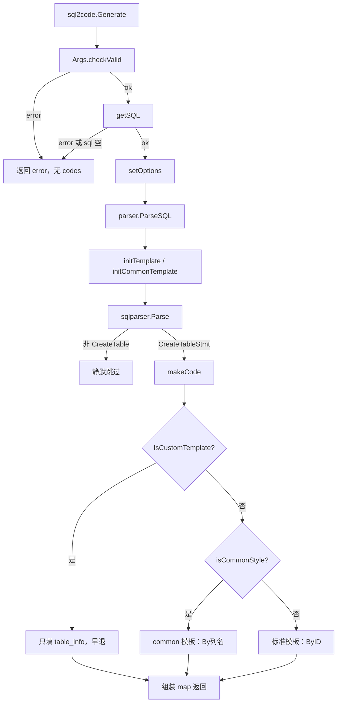
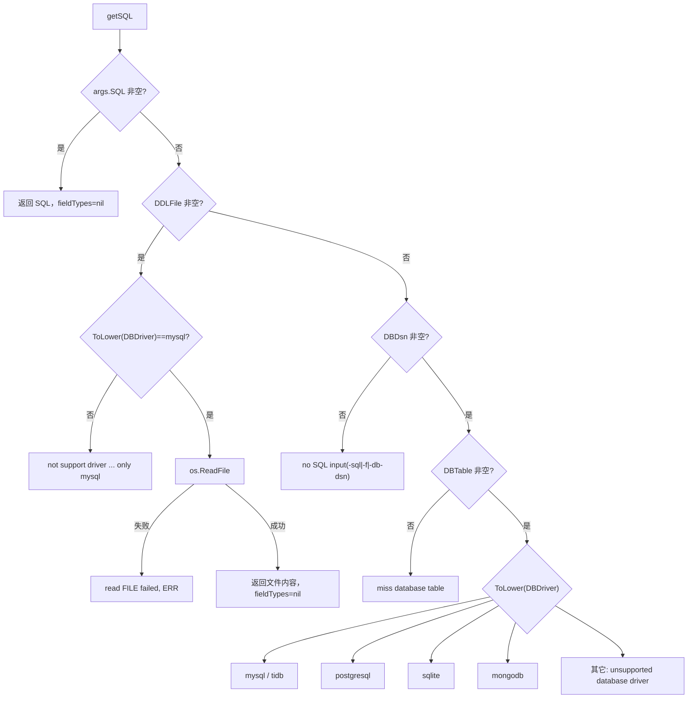

# SQL 到代码片段引擎

> 状态：待复核生成稿
> 生成日期：2026-08-16
> 基准提交：`23807238c62e0f3b3e2d9a341bbef50547d3f5ec`
> 工作区：dirty
> 源码范围：`pkg/sql2code/sql2code.go`、`pkg/sql2code/sql2code_test.go`、`pkg/sql2code/parser/`（`parser.go`、`option.go`、`template.go`、`commonTemplate.go`、`commonParser.go`、`mysql.go`、`postgresql.go`、`sqlite.go`、`mongodb.go`、`tableInfo.go`、`nameFormat.go` 及对应测试）、`pkg/sql2code/test.sql`；消费方交叉引用 `cmd/sponge/commands/generate/`、`cmd/sponge/commands/template/sql.go`、`pkg/utils/dsn.go`
> 生成方式：源码、测试、配置与部署资产静态分析

本篇是第四层文档，补齐 `pkg/sql2code` 的全部逻辑与技术点，达到可重新实现该引擎的深度。主路径例子见 [02-简单例子-全路径走读.md](02-简单例子-全路径走读.md)；主链路逐步拆解见 [03-详细逐步说明-主链路拆解.md](03-详细逐步说明-主链路拆解.md)；generate 层如何把本引擎的 `map[string]string` 写进模板见 [05-代码生成器与模板写入.md](05-代码生成器与模板写入.md)。

## 快速摘要

### 架构总览（模块与依赖）

`pkg/sql2code` 是生成期引擎，不进入生成项目的运行时依赖。它把三种输入（内存 DDL、`.sql` 文件、四种数据库的 DSN+表名）统一成 **MySQL 方言的 `CREATE TABLE`**，再用 `github.com/zhufuyi/sqlparser` 解析 AST，渲染出 model / dao / handler / proto / service 等文本片段。

依赖方向：

```text
cmd/sponge/commands/generate.*Command
        │ 构造 sql2code.Args
        ▼
pkg/sql2code.Generate
        │ getSQL：按驱动取 DDL / fieldTypes
        ▼
pkg/sql2code/parser.ParseSQL
        │ makeCode + text/template
        ▼
map[string]string（codes）
        │
        ▼
generate 层 replacer.Field.New ← 各 CodeType 片段
```

内部模块边界：

| 包 / 文件 | 职责 |
|---|---|
| `pkg/sql2code/sql2code.go` | 公开入口 `Generate` / `GenerateOne`；`Args` 校验；输入优先级；把 CLI 字段译成 `parser.Option` |
| `parser/mysql.go` | MySQL / TiDB：`SHOW CREATE TABLE` 取真实 DDL |
| `parser/postgresql.go` | PostgreSQL：查系统目录 → 合成伪 MySQL DDL + `fieldTypes` |
| `parser/sqlite.go` | SQLite：`PRAGMA table_info` → 合成伪 MySQL DDL |
| `parser/mongodb.go` | MongoDB：抽样最新文档 → 合成伪 MySQL DDL + Go/proto 子结构 |
| `parser/parser.go` | `ParseSQL`、`makeCode`、类型映射、tag、embed |
| `parser/option.go` | 函数式 Option；**包默认 `NullInSql`，CLI 路径会被覆盖** |
| `parser/commonParser.go` | `CrudInfo`、非标准主键的 common style |
| `parser/template.go` / `commonTemplate.go` | 标准主键 vs 自定义主键两套 `text/template` |
| `parser/tableInfo.go` | 自定义模板用的 `TableInfo` JSON |
| `parser/nameFormat.go` | 驼峰 / 蛇形 / 缩写词（`ID`、`HTTP` 等） |
| `pkg/utils/dsn.go` | MySQL / PostgreSQL / MongoDB 的 DSN 适配（SQLite 在本引擎里不用适配函数） |

### 核心调用序列（逐步逻辑）

1. 生成命令（例如 `HTTPCommand.RunE`）填好 `sql2code.Args`，一次只放一张表到 `DBTable`，调用 `sql2code.Generate`。
2. `Args.checkValid`：必须有 SQL / DDL 文件 /（DSN+表名）三者之一；表名后缀 `_test` 拒绝；空驱动默认 `mysql`；`sqlite` 还要本地文件存在。
3. `getSQL` 按 **`SQL` > `DDLFile` > `DBDsn`** 取 DDL；PostgreSQL / MongoDB 额外返回 `fieldTypes`，写回 `args.fieldTypes`。
4. `setOptions` 把 Args 译成 `[]parser.Option`。`NullStyle` 为空时强制 `NullDisable`，覆盖 `defaultOptions.NullInSql`。
5. `parser.ParseSQL`：`initTemplate` + `initCommonTemplate` → sqlparser 出 AST → 只处理 `*ast.CreateTableStmt` → `makeCode`。
6. `makeCode` 填 `tmplData` / `tmplField`，算 `CrudInfo` 与 `isCommonStyle`。`IsCustomTemplate==true` 时只返回 `table_info` JSON 并早退。
7. 否则按是否 common style 选标准模板或 common 模板，渲染 model / dao / handler / proto / service / json。
8. 返回 `map[string]string`。generate 层用 `codes["model"]` 等替换 `// todo generate ... here`，用 `codes["crud_info"]` 决定是否切到 `.tpl` 文件，用 `codes["__table_name__"]` 替换 `UserExample`。

### 易错点与边界条件

- **NullStyle 双默认**：`parser.defaultOptions.NullStyle = NullInSql`；`sql2code.setOptions` 在 CLI 未填 `NullStyle` 时追加 `WithNullStyle(NullDisable)`。直接调用 `ParseSQL` 不经 `Generate` 时，可空列会变成 `sql.Null*`。重新实现必须跟 CLI 路径，不能只看 `defaultOptions`。
- **非法 `NullStyle`**：`setOptions` 打印 `invalid null style` 后返回 `nil`。`Generate` 仍会调用 `ParseSQL(sql)`（无 option），于是退回包默认 `NullInSql`，且 JSONTag / GormType 等全部丢失。
- **DDL 文件只支持 MySQL 驱动**；其它驱动读文件会报 `not support driver`。
- **四种驱动拿到的都不是“最终 Go 类型”**：统一先变成 MySQL `CREATE TABLE`，再走同一套 `mysqlToGoType`。PostgreSQL 的 `bool`、MongoDB 的全部 Go 类型靠 `FieldTypes` 回写纠正。
- **MongoDB 从最新一条文档推断 schema**，空集合或字段缺失会生成残缺结构；`deleted_at` 被丢掉；缺 `created_at` / `updated_at` 会补上。
- **`IsCustomTemplate` 早退**：`model`/`dao`/`handler`/`proto`/`service`/`json`/`crud_info` 都是空字符串，只有 `table_info` 有内容。`sponge template sql` 依赖这一点。
- **连库测试全部被注释**。单元测试只钉住内存 SQL 与本地 `test.sql`；四种 `Get*TableInfo` 的成功路径没有 CI 保证。
- **`AdaptivePostgresqlDsn` 在 DSN 非法时 `panic`**，不会变成 `error` 返回。
- 本任务未运行测试套件；下列测试结论来自阅读测试代码。

---

## 目录

1. [为什么这样设计（Why）](#为什么这样设计why)
2. [它是什么（What）](#它是什么what)
3. [代码如何实现（How）](#代码如何实现how)
4. [调用关系表](#调用关系表)
5. [测试对照](#测试对照)
6. [阅读源码建议顺序](#阅读源码建议顺序)
7. [重新实现检查清单](#重新实现检查清单)
8. [源码索引](#源码索引)

---

## 为什么这样设计（Why）

Sponge 的生成器要同时服务 HTTP、gRPC、只生成 model、自定义模板等命令。这些命令需要的不是完整工程，而是 **按表动态变化的那几段文本**：GORM 结构体、DAO 更新字段、Handler 请求/响应、Protobuf message、gRPC 客户端测试桩。

如果每个 generate 命令自己连库、自己映射类型，四种数据库会把命令层撑爆。因此把“表结构 → 代码片段”收成独立引擎：

1. **输入多样化，解析单一化。** MySQL 能直接给 `SHOW CREATE TABLE`；PostgreSQL / SQLite / MongoDB 不能。引擎把后三者翻译成伪 MySQL DDL，复用同一套 sqlparser 与模板。
2. **片段与骨架分离。** 本引擎只产出字符串 map；文件复制、占位符、安全写入属于 `pkg/replacer` 与 generate 层（见 [05-代码生成器与模板写入.md](05-代码生成器与模板写入.md)）。
3. **主键风格分叉。** 标准整型 `id` 走 `ByID` 模板；字符串主键或 `user_id` 这类列走 common style（`ByUserID`），否则生成项目编译不过。
4. **自定义模板只要表元数据。** `IsCustomTemplate` 跳过 CRUD 渲染，只给 `TableInfo` JSON，避免用户模板被内置 CRUD 绑架。

必须保持的行为契约：同一张表、同一组 Args，`Generate` 返回的 map key 集合固定，value 可被 `replacer` 直接当作 `Field.New`。可以替换的实现：sqlparser 库、DSN 适配细节、模板字符串的排版，只要输出契约不变。

---

## 它是什么（What）

公开 API 只有两个函数，都在 `pkg/sql2code/sql2code.go`：

| 函数 | 输入 | 输出 |
|---|---|---|
| `Generate(args *Args)` | 完整 Args | `map[string]string`，含全部 code type |
| `GenerateOne(args *Args)` | 完整 Args | 先调 `Generate`，再按 `args.CodeType` 取一条；空则默认 `model` |

`GenerateOne` 在未知 `CodeType` 时返回 `unknown code type %s`。`sql2code_test.go` 用 `CodeType: "unknown"` 钉住这条失败路径。

### Args 字段

`fieldTypes` 未导出，只由 `getSQL` 在 PostgreSQL / MongoDB 路径回写，再经 `WithFieldTypes` 进入 parser。调用方不能从包外直接赋 Go 类型表。

| 字段 | 类型 | 含义与生效点 |
|---|---|---|
| `SQL` | `string` | 内存 DDL，优先级最高 |
| `DDLFile` | `string` | 本地 SQL 文件路径；仅 `mysql` 驱动可读 |
| `DBDriver` | `string` | `mysql` / `tidb` / `postgresql` / `sqlite` / `mongodb`；空则 `mysql` |
| `DBDsn` | `string` | 连接串；SQLite 时是本地 db 文件路径 |
| `DBTable` | `string` | 表名。`checkValid` 按逗号拆开检查后缀；`getSQL` **不会**拆逗号，一次只应放一张表。多表由 generate 命令循环调用 |
| `fieldTypes` | `map[string]string` | 列名 → 原始/Go 类型；PG / Mongo 填充 |
| `Package` | `string` | 只影响 `model` 文件的 `package` 行；CLI 常填 `model` |
| `GormType` | `bool` | GORM tag 是否带 `;type:` |
| `JSONTag` | `bool` | 是否追加 `json:"..."` |
| `JSONNamedType` | `int` | `0` 蛇形（`my_field`），非 0 小驼峰（`myField`）。CLI 默认 `1` |
| `IsEmbed` | `bool` | 是否嵌入 `sgorm.Model` / `sgorm.Model2` |
| `IsWebProto` | `bool` | proto 是否带 HTTP 路由与 swagger；`web http` 默认 false，`grpc-http` / `handler-pb` 设 true |
| `CodeType` | `string` | 仅 `GenerateOne` 用来挑 map 中的一条 |
| `ForceTableName` | `bool` | 强制生成 `TableName()` 方法 |
| `Charset` / `Collation` | `string` | 传给 sqlparser.Parse，不是连库字符集 |
| `TablePrefix` | `string` | 从表名去掉前缀再转驼峰，并生成 `TableName()` |
| `ColumnPrefix` | `string` | 从列名去掉前缀再转 Go 字段名；JSON 名仍基于原列名 |
| `NoNullType` | `bool` | `parseOption` 末尾把 `NullStyle` 改成 `NullDisable` |
| `NullStyle` | `string` | `"sql"` → `NullInSql`；`"ptr"` → `NullInPointer`；空 → `NullDisable` |
| `IsExtendedAPI` | `bool` | proto 用 9 个 RPC 的模板，否则 5 个 |
| `IsCustomTemplate` | `bool` | `makeCode` 早退，只产 `table_info` |

CLI 侧常见赋值（以 `HTTPCommand` 为证，细节见 [05-代码生成器与模板写入.md](05-代码生成器与模板写入.md)）：`Package="model"`、`JSONTag=true`、`GormType=true`、`JSONNamedType` 默认 1、`IsEmbed` / `IsExtendedAPI` 由 flag 控制。Mongo 时命令层会把 `IsEmbed` 强制改 `false`。

### 输出 map 的每一个 key

常量定义在 `parser/parser.go`。`ParseSQL` 组装的 map **总是包含这 9 个 key**，即使某段是空字符串：

| Key 常量 | 字面量 | 内容 | generate 层谁消费 |
|---|---|---|---|
| `CodeTypeModel` | `model` | 完整 Go 文件：`package` + import + 结构体 + `TableName()` + `XxxColumnNames` 白名单 | `modelFileMark` → `internal/model/userExample.go` |
| `CodeTypeDAO` | `dao` | 一组 `if table.Field != zero { update["col"] = table.Field }` | `daoFileMark` → DAO 更新字段 |
| `CodeTypeHandler` | `handler` | Create / Update / Detail 三个请求响应结构体 | `handlerFileMark`，再经 `adjustmentOfIDType` |
| `CodeTypeProto` | `proto` | 完整 `.proto` 文本（service + message） | `protoFileMark` → `api/.../userExample.proto` |
| `CodeTypeService` | `service` | gRPC 客户端测试里 Create / Update 的请求字面量 | `serviceFileMark`，再经 `adjustmentOfIDType` |
| `CodeTypeJSON` | `json` | 表的示例 JSON 对象（冒号、逗号已处理） | 本仓库 generate 命令 **不写入文件**；`GenerateOne` 可按 `CodeType` 取出 |
| `CodeTypeCrudInfo` | `crud_info` | `CrudInfo` 的 JSON。多表用 ` \|\|\|\| ` 拼接 | `unmarshalCrudInfo` → `CheckCommonType()` 决定是否改用 `.tpl` |
| `CodeTypeTableInfo` | `table_info` | `TableInfo` 的 JSON。多表同样 ` \|\|\|\| ` 拼接 | `sponge template sql`：`UnMarshalTableInfo` |
| `TableName` | `__table_name__` | 表名驼峰，多表用 `, ` 拼接 | `UserExample` → 该值（`IsCaseSensitive`） |

`IsCustomTemplate==true` 时：`table_info` 有 JSON；`__table_name__` 仍有驼峰名（`ParseSQL` 循环里无条件 `append`）；其余 key 为空字符串。`crud_info` 在早退路径 **不会**写入，因为 `makeCode` 返回的 `codeText.crudInfo` 是零值。

多条 `CREATE TABLE` 时：model 结构体会进同一个 `package` 文件；dao / handler / proto / service / json 用 `\n\n` 拼接；`crud_info` 与 `table_info` 用 ` |||| `。CLI 每次 `Generate` 只放一张表，这条多语句路径主要由直接调用 `ParseSQL` 触发。

---

## 代码如何实现（How）

### 总流程



### 1. `checkValid`

文件：`pkg/sql2code/sql2code.go`。

逐步逻辑：

1. 若 `SQL`、`DDLFile` 都空，且 **DSN 与表名同时空**，返回 `you must specify sql or ddl file`。注意：只给了 DSN 没给表名、或只给了表名没给 DSN，这一关会通过，失败推迟到 `getSQL`。
2. 若 `DBTable` 非空，按 `,` 拆分，任一片段后缀 `_test` 则 `the table name (%s) suffix "_test" is not supported...`。这与命令层拒绝 `serverName` 后缀 `-test` / `_test` 是同一类约束（见 [03-详细逐步说明-主链路拆解.md](03-详细逐步说明-主链路拆解.md)）。
3. `DBDriver==""` → 写成 `parser.DBDriverMysql`（`"mysql"`）。
4. `DBDriver=="sqlite"` 时调用 `gofile.IsExists(a.DBDsn)`，不存在则 `sqlite db file %s not found in local host`。这里在 `getSQL` 之前就检查文件，即使调用方其实打算走 `SQL` 字段——只要驱动写成 sqlite 且 DSN 指向不存在的文件，仍会失败。
5. `fieldTypes==nil` 时改成空 map，避免后续 `WithFieldTypes(nil)` 跳过赋值。

无副作用，不连库。

### 2. `getSQL` 优先级：`SQL` > `DDLFile` > `DSN`



驱动名比较前会 `strings.ToLower`。`tidb` 与 `mysql` 走同一条函数，没有单独的 TiDB 文件。

`Generate` 拿到结果后：若 `fieldTypes != nil` 则 `args.fieldTypes = fieldTypes`（覆盖 checkValid 里的空 map）；若 `sql==""` 则 `get sql from %s error, maybe the table %s doesn't exist`。SQLite / PostgreSQL 在表不存在时往往返回空字段切片再合成空字符串，从而命中这条，而不是驱动函数自己报“表不存在”。

下面四种驱动各自写全：入口、DSN 适配、如何拿到表结构、如何变成 DDL 或 `fieldTypes`、与 `ParseSQL` 的衔接、失败信息。禁止互相“同上”。

---

### 3. MySQL / TiDB 驱动

**入口函数**

- `parser.GetMysqlTableInfo(dsn, tableName) (string, error)`，文件 `parser/mysql.go`。
- 废弃别名 `GetTableInfo` 直接转调 `GetMysqlTableInfo`。

`getSQL` 分支：

```go
dsn := utils.AdaptiveMysqlDsn(args.DBDsn)
sqlStr, err := parser.GetMysqlTableInfo(dsn, args.DBTable)
return sqlStr, nil, err   // fieldTypes 恒为 nil
```

**DSN 适配**

`pkg/utils/dsn.go:AdaptiveMysqlDsn`：`strings.ReplaceAll(dsn, "mysql://", "")`。只去掉字面量前缀 `mysql://`，**不**解析括号、用户、库名。CLI 文档中的形态 `user:password@(host:port)/database` 原样交给 `github.com/go-sql-driver/mysql`。

**如何拿到表结构**

1. `sql.Open("mysql", dsn)`。blank import `_ "github.com/go-sql-driver/mysql"`。
2. `defer db.Close()`。
3. 查询：`` SHOW CREATE TABLE `tableName` ``，表名直接拼接，无占位符。
4. `rows.Next()` 为 false → `not found found table '%s'`（原文双写 `found`，源码笔误，重实现若要字节级兼容需保留）。
5. `rows.Scan(&table, &info)`，返回第二列 `info`（完整 `CREATE TABLE` 文本）。

MySQL / TiDB 返回的是 **服务器认可的真实 DDL**，含列类型、默认值、注释、主键、唯一索引。引擎不再查 `information_schema`。

**如何变成 DDL 或 fieldTypes**

不转换。`fieldTypes` 为 `nil`。`Generate` 不会覆盖 `args.fieldTypes`（仍是 checkValid 的空 map）。`WithFieldTypes` 得到空 map，GORM `;type:` 走 `col.Tp.InfoSchemaStr()`。

**与 ParseSQL 的衔接**

真实 MySQL DDL 直接进 `parser.New().Parse`。`makeCode` 的 `opt.DBDriver` 为 `mysql` 或 `tidb` 时：

- GORM tag 的 type 用 `InfoSchemaStr()`。
- Go 类型用 `mysqlToGoType`。
- `tinyint(1)` / `bit(1)` / `json` / `decimal` 会挂 `rewriterField`，model 里再改成指针包装类型。

**失败信息**

| 场景 | 错误 |
|---|---|
| `sql.Open` 失败 | `GetMysqlTableInfo error, %v` |
| `SHOW CREATE TABLE` 失败（无权限、语法、表不存在等，由驱动报） | `query show create table error, %v` |
| 结果集空 | `not found found table '%s'` |
| `Scan` 失败 | 原始 `err` |
| 返回空字符串（理论上少见） | `Generate` 包装：`get sql from mysql error, maybe the table X doesn't exist` |

副作用：打开并关闭一条短连接。无连接池复用。

测试：`TestGetMysqlTableInfo` 连局域网真实库，**未注释**，但失败只 `t.Log`，不断言，CI 无库时不会红。`sql2code_test.go` 里 `"sql from mysql"` / `"sql from db"` 整段注释掉。

---

### 4. PostgreSQL 驱动

**入口函数**

- `parser.GetPostgresqlTableInfo(dsn, tableName) (PGFields, error)`
- 内部 `getPostgresqlTableFields(db, tableName)`
- 合成：`ConvertToSQLByPgFields(tableName, fields) (sqlStr, pgTypeMap)`

`getSQL` 分支：

```go
dsn := utils.AdaptivePostgresqlDsn(args.DBDsn)
fields, err := parser.GetPostgresqlTableInfo(dsn, args.DBTable)
sqlStr, pgTypeMap := parser.ConvertToSQLByPgFields(args.DBTable, fields)
return sqlStr, pgTypeMap, nil
```

**DSN 适配**

`AdaptivePostgresqlDsn` 逐步：

1. 若空格超过 3 个，视为已经是 `host=... port=...` 形式，原样返回。
2. 若不含 `postgres://`，加上该前缀。
3. `DeleteBrackets`：把 `user:pass@(host:port)/db` 改成 `user:pass@host:port/db`。
4. `url.Parse`；**失败则 `panic(err)`**，不会变成 `Generate` 的 error。非法 DSN 会让 CLI 进程崩溃。
5. 缺 `sslmode` 时补 `sslmode=disable`。
6. 输出 kv：`host=%s port=%s user=%s password=%s dbname=%s %s`，供 `gorm.io/driver/postgres` 使用。

**如何拿到表结构**

1. `gorm.Open(postgres.Open(dsn), &gorm.Config{})`。
2. `defer closeDB(db)`：`db.DB()` 再 `sqlDB.Close()`；取底层失败则静默返回。
3. `getPostgresqlTableFields` 执行一条把 `tableName` **用 `%s` 嵌进 SQL** 的查询（`pg_class` + `pg_attribute` + `pg_type` + `information_schema` 主键子查询）。表名未参数化。
4. `db.Raw(query).Scan(&fields)` 填 `[]*PGField`。

`PGField` 列：`Name`、`Type`（`typname`）、`Comment`、`Length`、`Lengthvar`（`atttypmod`）、`Notnull`、`IsPrimaryKey`。

查询失败返回 `failed to get table fields: %v`。表不存在时 GORM 常得到空切片而不是 error。

**如何变成 DDL 或 fieldTypes**

`ConvertToSQLByPgFields`：

1. `len(fields)==0` → 返回 `""` 与空 map。随后 `Generate` 报 maybe the table doesn't exist。
2. 对每列：`pgTypeMap[field.Name] = getType(field)`。`getType` 对 `varchar/char/bpchar` 若 `Lengthvar>4` 写成 `varchar(Lengthvar-4)`，否则保留 PG 原类型名。
3. `field.getMysqlType()` 把 PG 类型译成 MySQL 类型字符串，拼：
   `` `name` mysqlType not null|null comment 'escaped', ``
   注释里的 `'` 换成 `\'`。
4. `fields.getPrimaryField()`：第一个 `IsPrimaryKey==true` **或** `Name=="id"` 的列。命中则追加 `PRIMARY KEY (`name`)`；否则去掉最后的 `,\n`。
5. 外包 `CREATE TABLE `table` (\n...\n);`。

`getMysqlType` 对照：

| PG `Type` | 伪 MySQL 类型 |
|---|---|
| `smallint` / `integer` / `smallserial` / `serial` / `int2` / `int4` | `int` |
| `bigint` / `bigserial` / `int8` | `bigint` |
| `real` / `float4` | `float` |
| `double precision` / `float8` | `double` |
| `decimal` / `numeric` / `money` | `decimal(10, 2)`（精度写死） |
| `character` / `varchar` / `char` / `bpchar` | `varchar(Lengthvar-4)` 或 `varchar(100)` |
| `text` | `text` |
| `timestamp` / `timestamptz` | `timestamp` |
| `date` | `date` |
| `time` | `time` |
| `interval` | `year` |
| `json` / `jsonb` | `json` |
| `boolean` / `bool` | `bit(1)`（让 `mysqlToGoType` 走到 bool + `sgorm.Bool`） |
| `bit` | `bit` |
| 其它 | **改写 `field.Type` 本身为 `varchar(100)`** 并返回它（有副作用） |

**与 ParseSQL 的衔接**

伪 DDL 被 sqlparser 当成 MySQL 解析。`setOptions` 带上 `WithDBDriver("postgresql")` 与 `WithFieldTypes(pgTypeMap)`。`makeCode` 中：

- `GormType==true` 时 `;type:` 用 `opt.FieldTypes[colName]`（PG 原始/修正类型），**不用** `InfoSchemaStr()`。
- Go 类型仍先走 `mysqlToGoType`；随后若 `opt.FieldTypes[colName]=="bool"`，强制 `field.GoType="bool"`。这是因为伪 DDL 里 bool 变成了 `bit(1)`，而 GORM tag 仍希望记住 PG 的 bool。

**失败信息**

| 场景 | 错误 |
|---|---|
| DSN 无法 `url.Parse` | **panic**（适配层） |
| `gorm.Open` 失败 | `GetPostgresqlTableInfo error: %v` |
| Raw/Scan 失败 | `failed to get table fields: %v` |
| 空字段 | `Generate`：`get sql from postgresql error, maybe the table X doesn't exist` |

副作用：打开 GORM 连接并在 defer 关闭。`Test_getPostgresqlTableFields(nil, ...)` 用 `recover` 防 panic。`TestGetPostgresqlTableInfo` 连真实库，失败 `t.Log` 后 return。`sql2code_test.go` 的 `"sql from postgresql"` 已注释。

---

### 5. SQLite 驱动

**入口函数**

- `parser.GetSqliteTableInfo(dbFile, tableName) (string, error)`
- 内部 `convertToSQLBySqliteFields(tableName, fields) string`（未导出）

`getSQL` 分支：

```go
sqlStr, err := parser.GetSqliteTableInfo(args.DBDsn, args.DBTable)
return sqlStr, nil, err   // 不调用 AdaptiveSqlite；fieldTypes 恒 nil
```

`pkg/utils/dsn.go` 虽有 `AdaptiveSqlite`（注释写 convert to absolute path，实际原样返回），**本引擎不调用它**。DSN 就是本地文件路径。

**DSN 适配**

没有运行期适配。`checkValid` 已用 `gofile.IsExists` 确认文件存在。`sqlite.Init` 会把路径拼成 `file?_journal=WAL&_vacuum=incremental` 再 `gorm.Open`。

**如何拿到表结构**

1. `sqlite.Init(dbFile)`（`pkg/sgorm/sqlite`），默认 SingularTable、静默日志。
2. `defer sqlite.Close(db)`。
3. `PRAGMA table_info('tableName')`，表名用 `%s` 嵌进字符串，有单引号包裹。
4. Scan 到 `SqliteFields`（`[]*SqliteField`）。

`SqliteField`：`Cid`、`Name`、`Type`、`Notnull`（0/1）、`DefaultValue`（读了但 **合成 DDL 时丢弃**）、`Pk`（0/1）。

**如何变成 DDL 或 fieldTypes**

`convertToSQLBySqliteFields`：

1. 空切片 → `""` → 触发 `Generate` 的 maybe the table doesn't exist。
2. 每列：`Notnull==0` 则 `null` 否则 `not null`。注释恒为 `comment ''`（PRAGMA 无 comment）。
3. `getMysqlType()`：先 `ToLower(Type)` 查表。

| SQLite 类型（小写） | 伪 MySQL |
|---|---|
| `integer` | `INT` |
| `text` | `TEXT`；但列名为 `id` 时改 `VARCHAR(50)`（给字符串主键留空间） |
| `real` | `FLOAT` |
| `datetime` | `DATETIME` |
| `blob` | `BLOB` |
| `boolean` | `TINYINT` |
| `numeric` | ` VARCHAR(255)`（源码值带前导空格） |
| 未登记 | `VARCHAR(100)` |

4. `getPrimaryField()`：第一个 `Pk==1` **或** `Name=="id"`。有则 `PRIMARY KEY`，否则去掉尾逗号。
5. 外包 `CREATE TABLE`。默认值不写入 GORM `default:`，因为伪 DDL 没带 `DEFAULT` 子句。

**与 ParseSQL 的衔接**

伪 DDL 当 MySQL 解析。`fieldTypes` 为 nil。`opt.DBDriver==sqlite` 时 GORM `;type:` 用 `InfoSchemaStr()`（来自伪 MySQL 类型，不是 SQLite 原类型）。Go 类型走 `mysqlToGoType`。`isCommonStyle` 对 sqlite 与 mysql 相同：非 embed 且主键不是整型 `id` 则为 true（例如 `id` 为 `VARCHAR(50)` 的字符串主键）。

**失败信息**

| 场景 | 错误 |
|---|---|
| 本地文件不存在 | `checkValid`：`sqlite db file %s not found in local host`（发生在 `getSQL` 前） |
| `sqlite.Init` 失败 | 原样返回（打开损坏文件等） |
| `PRAGMA` Scan 失败 | 原样返回 |
| 空字段 | `Generate`：`get sql from sqlite error, maybe the table X doesn't exist` |

副作用：WAL 模式打开文件并关闭。`TestGetSqliteTableInfo` 使用 Windows 风格相对路径 `..\..\..\test\sql\sqlite\sponge.db`，在 macOS/Linux 上路径无效，只 `t.Log`。`sql2code_test.go` 的 `"sql from sqlite"` 已注释，且 DSN 是另一台机器上的绝对路径。

---

### 6. MongoDB 驱动

**入口函数**

- `parser.GetMongodbTableInfo(dsn, tableName) ([]*MgoField, error)`
- 内部 `getMongodbTableFields(db, collectionName)`
- 合成：`ConvertToSQLByMgoFields(tableName, fields) (sqlStr, mongoTypeMap)`
- 另有 `MgoFieldToGoStruct`：测试/辅助，把字段直接拼 Go 结构体，**不在 `Generate` 主路径上**。

`getSQL` 分支：

```go
dsn := utils.AdaptiveMongodbDsn(args.DBDsn)
fields, err := parser.GetMongodbTableInfo(dsn, args.DBTable)
sqlStr, mongoTypeMap := parser.ConvertToSQLByMgoFields(args.DBTable, fields)
return sqlStr, mongoTypeMap, nil
```

**DSN 适配**

`AdaptiveMongodbDsn`：若不含 `mongodb://` 且不含 `mongodb+srv://`，加 `mongodb://`；再 `DeleteBrackets`。`GetMongodbTableInfo` **内部会再调一次** `AdaptiveMongodbDsn`，对已带 scheme 的串幂等。

`mgo.Init`：从 URL path 取数据库名，空则 `database name is empty`；`mongo.Connect` + `Ping`；超时 5 秒（`ClientOptions.Timeout`）。

**如何拿到表结构**

Mongo 没有 `CREATE TABLE`。引擎：

1. `FindOne` 空 filter，`Sort: {_id: -1}`，即 **最新一条文档**。
2. `result.Raw()` 失败（空集合 → `mongo.ErrNoDocuments` 等）直接返回。
3. 遍历顶层元素：键名 `deleted_at` **跳过**（留给软删除模板）。
4. `getTypeFromMgo` 按 BSON 类型映射 Go 类型；嵌套 document 生成子 struct 字符串；数组取 **第一个元素** 推断 `[]T`。
5. `embedTimeField`：若没有 `created_at`/`createdAt` 则追加 `created_at time.Time`；`updated_at`/`updatedAt` 同理。循环里对 `names` 再 `append` 自己（无功能，只拉长切片）。

BSON → Go（`mgoTypeToGo`）：

| BSON | Go |
|---|---|
| ObjectID | `primitive.ObjectID` |
| Int32 | `int` |
| Int64 | `int64` |
| Double | `float64` |
| String | `string` |
| Array | 先 `[]interface{}`，再按首元素细化 |
| Embedded document | 解析为 `*CamelName` + `type CamelName struct {...}` |
| Timestamp / DateTime | `time.Time` |
| Boolean | `bool` |
| Null / 未识别 | `nil` / `interface{}` |
| Binary | `[]byte` |
| Decimal128 等 | `interface{}` |

嵌套对象的 JSON tag 格式由包级原子量 `jsonTagFormat` 控制：`SetJSONTagCamelCase` / `SetJSONTagSnakeCase`。`makeCode` 在 `DBDriver==mongodb` 时按 `opt.JSONNamedType` 调用这两个函数（`!=0` 驼峰，`==0` 蛇形）。这是 **包级可变状态**，并发两次 Mongo 生成且 JSON 风格不同会互相干扰。

**如何变成 DDL 或 fieldTypes**

`ConvertToSQLByMgoFields`：

1. 普通字段：`mongoTypeMap[name] = Go类型`；`interface{}` / `[]interface{}` 则映射为 `ToCamelCase(name)`（子结构名）。
2. `_id`：写入 `mongoTypeMap["id"]` 与 `mongoTypeMap["_id"]`，**不**出现在列列表里；最后在 DDL 头部插入 `` `id` varchar(24) `` 并 `PRIMARY KEY (id)`。无 `_id` 则没有主键子句。
3. 列类型 `convertMongoToMysqlType`：int→`int`，int64→`bigint`，float64→`double`，string→`varchar(255)`，time.Time→`timestamp`，bool→`bit(1)`，ObjectID/nil/bytes/interface/切片→`json`。
4. 若有嵌套：`mongoTypeMap["_sub_struct_"]` = 拼接的 Go struct 文本；`mongoTypeMap["_proto_sub_struct_"]` = proto message 文本。这两个 key 是 `SubStructKey` / `ProtoSubStructKey` 常量。

**与 ParseSQL 的衔接**

伪 DDL 只有列名与粗类型，**Go 类型不以 `mysqlToGoType` 为准**。`makeCode` 在 `DBDriver==mongodb` 分支：

- tag 前缀是 `bson` 而不是先 `gorm`；JSON 名 `_id` 改成 `id`。
- `field.GoType = opt.FieldTypes[colName]`。
- `time.Time` 才往 importPath 加 `"time"`。
- 之后 `getModelStructCode`：名为 `ID` 的字段强制 `primitive.ObjectID` 并 import `go.mongodb.org/mongo-driver/bson/primitive`。
- 结构体文本再做字符串替换：`bson:"column:` → `bson:"`；清掉空 `;type:`；`bson:"id" json:"id"` → `bson:"_id" json:"id"`。
- `ColumnNames` 白名单里 ID 的 `ColName` 改成 `_id`。
- `tmplData.SubStructs` / `ProtoSubStructs` 从 `FieldTypes` 的两个特殊 key 取出，追加到 model / proto 末尾。
- `isCommonStyle`：Mongo **恒为 false**（函数开头 `DBDriver != mongodb` 才可能 true）。主键风格走标准 `ByID`，ID 在 handler/proto 里当 `string`。

`adaptedDbType` 对 Mongo 把 proto 里的 id 字段从默认 `uint64` 换成 `string` + `min_len = 6`。

**失败信息**

| 场景 | 错误 |
|---|---|
| 库名为空 | `database name is empty` |
| Connect / Ping 失败 | mongo 驱动 error |
| 空集合 / FindOne 失败 | `Raw()` 的 error（常为 `mongo.ErrNoDocuments`） |
| BSON Elements 失败 | 原样返回 |
| 空 fields | 合成仍可能得到只有时间字段的 DDL；若完全空则 `Generate` 的 maybe the table doesn't exist |
| 未知驱动名 | `get sql error, unsupported database driver: ...`（四种之外） |

副作用：`GetMongodbTableInfo` **没有 Close**。每次生成泄漏一个 mongo client，直到进程退出。对比 MySQL `db.Close`、PG `closeDB`、SQLite `sqlite.Close`。

`sql2code_test.go` 的 `"sql from mongodb"` 已注释，且 `IsCustomTemplate: true`。`TestGetMongodbTableInfo` 连真实库，失败则 return。`Test_getMongodbTableFields` 用手工 `[]*MgoField` 走 `ConvertToSQLByMgoFields` + `ParseSQL`，**不连库**，是 Mongo 主路径最完整的离线证据。

---

### 7. `setOptions` 与 NullStyle

`setOptions` 把 Args 译成 `[]parser.Option`。空字符串 / false 的字段不加 Option，让 `parseOption` 保留 `defaultOptions`。例外：

**`NullStyle` 无论是否为空都会处理：**

| `args.NullStyle` | 行为 |
|---|---|
| `"sql"` | `WithNullStyle(NullInSql)` |
| `"ptr"` | `WithNullStyle(NullInPointer)` |
| 其它非空 | `fmt.Printf("invalid null style: %s\n", ...)` 然后 **`return nil`**（丢弃已经 append 的其它 Option） |
| `""`（CLI 默认） | `WithNullStyle(NullDisable)` |

`parser/option.go`：

```go
var defaultOptions = options{
    DBDriver:   "mysql",
    FieldTypes: map[string]string{},
    NullStyle:  NullInSql,   // 包默认
    Package:    "model",
}
```

`parseOption` 在所有 Option 执行完后：若 `NoNullType==true`，再把 `NullStyle` 改成 `NullDisable`。因此 `WithNoNullType()` 能覆盖先前的 `WithNullStyle(NullInSql)`。

**必须强调的覆盖关系：**

1. 直接 `ParseSQL(sql)` 不传 Option → 可空列用 `sql.Null*`（`NullInSql`）。
2. `sql2code.Generate` 经 CLI（不填 `NullStyle`）→ `setOptions` 追加 `NullDisable` → 可空列仍是普通 `*time.Time` / `string` / `int`。
3. `web http` 等命令从未给 `Args.NullStyle` 赋值，所以生成项目 **看不到** `database/sql` 的 Null 类型。

`mysqlToGoType` 里，仅当列的 AST 带 `ColumnOptionNull`（`canNull==true`）时才应用 `opt.NullStyle`；`NOT NULL` 列强制 `NullDisable`。未声明 NULL/NOT NULL 的列 `canNull` 为 false，同样不用 Null 包装。

`NullInPointer`：在非 sql 分支算出基础类型后加 `*`。`NullInSql`：改用 `sql.NullInt32` 等，import `database/sql`，**不**挂 `rewriterField`（JSON/decimal/bool 包装在此风格下不会出现）。

`Test_setOptions` 只断言返回的 slice 非 nil；把 `NullStyle` 改成 `"default"` 后 **没有重新调用** `setOptions`，因此非法值返回 `nil` 的分支没有被断言。

---

### 8. `ParseSQL` 逐步逻辑

文件：`parser/parser.go`。

1. `initTemplate()`：`sync.Once` 解析 `template.go` 里全部 raw 字符串；失败 `panic`。
2. `initCommonTemplate()`：同样解析 `commonTemplate.go`。
3. `opt := parseOption(options)`。
4. `parser.New().Parse(sql, opt.Charset, opt.Collation)`。非法 SQL 原样返回 error。Charset/Collation 只影响 sqlparser，默认空字符串。
5. 遍历 `stmts`，类型断言 `*ast.CreateTableStmt`。`INSERT` / `ALTER` / 其它语句 **静默跳过**，不报错。
6. 对每个建表语句 `makeCode(ct, opt)`；失败立即返回。
7. 收集 import 路径到 set，再 `sort.Strings` 保证 model 文件 import 顺序稳定。
8. `getModelCode` 用 `modelTmpl` 包一层 `package` + import + 各结构体，再 `go/format.Source`。
9. 组装 9 key 的 map 返回。

若没有任何 `CreateTableStmt`：各切片为空，`model` 仍是一个几乎空的 `package model` 文件，其它 key 为空字符串。推断：CLI 连库路径每次恰好一条 CREATE TABLE。

---

### 9. `makeCode` 逐步逻辑

输入：`*ast.CreateTableStmt`、`options`。输出：`*codeText`。

**表名**

- `RawTableName = stmt.Table.Name`
- 若 `TablePrefix` 非空且是表名前缀：剥前缀再 `toCamel`，`NameFunc=true`（生成 `TableName()`）。
- 否则整表名 `toCamel`。
- 若 `ForceTableName` 或 `RawTableName != inflection.Plural(RawTableName)`：`NameFunc=true`。英语复数表（`users`）且无前缀、未强制时，**不**生成 `TableName()`，GORM 默认复数规则刚好命中。
- `TName = firstLetterToLower(TableName)`，用于 proto service 名、JSON 示例键。

**表注释**

遍历 `stmt.Options`，`TableOptionComment` 经 `replaceCommentNewline`：把换行变成 `//` 续行，避免打爆结构体行注释。

**主键集合**

- 约束里 `ConstraintPrimaryKey` 的第一列记入 `isPrimaryKey`。
- `ConstraintForeignKey`：空 `TODO`，忽略。
- 列级 `ColumnOptionPrimaryKey` 也会标记并给 GORM `;primary_key`。

**逐列**

对 `stmt.Cols`：

1. 列名；若有 `ColumnPrefix` 且匹配，Go 字段名去掉前缀。
2. JSON 名：`JSONNamedType==0` → `customToSnake`，否则 `customToCamel`。注意 JSON 名基于 **未去前缀的列名**。
3. Go 字段名：`toCamel(goFieldName)`。
4. 拼 GORM tag：`column:colName`；`GormType` 时按驱动追加 `;type:`（mysql/tidb/sqlite 用 `InfoSchemaStr()`，postgresql 用 `FieldTypes[col]`，mongodb 此 switch 不写 type）。
5. 列选项：PK、NOT NULL、AUTO_INCREMENT、DEFAULT（`getDefaultValue`：字面量或函数名如 `CURRENT_TIMESTAMP`）、UNIQUE、NULL、COMMENT。`OnUpdate` / `Fulltext` 空分支。
6. **Mongo 分支**：tags 为 bson + 可选 json；`GoType = FieldTypes[colName]`。
7. **默认（GORM）分支**：非主键且 NOT NULL 则 `;not null`；tags 为 gorm + 可选 json；`mysqlToGoType`；PG 的 bool 回写。

列选项处理完后，`FieldTypes[SubStructKey]` / `ProtoSubStructKey` 填入 `tmplData`（Mongo 子结构）。

`len(Fields)==0` → `no columns found in table %s`。

**CrudInfo 与 common style**

```go
data.CrudInfo = newCrudInfo(data)
data.CrudInfo.IsCommonType = data.isCommonStyle(opt.IsEmbed)
```

`tmplData.isCommonStyle(isEmbed)`：

```text
DBDriver != mongodb  &&  !isEmbed  &&  !CrudInfo.isIDPrimaryKey()
```

`isIDPrimaryKey()`：列名是 `id` 且 Go 类型属于 `uint64|int64|uint|int|uint32|int32`。字符串 `id`（SQLite 文本主键、订单号）**不是**标准主键，会走 common style。

**`IsCustomTemplate` 早退**

```go
if opt.IsCustomTemplate {
    tableInfo := newTableInfo(data)
    return &codeText{tableInfo: tableInfo.getCode()}, nil
}
```

此时已经算完 Fields 与 CrudInfo，所以 `TableInfo` JSON 含列和主键。但 `codeText` 其它字段为零值。`sponge template sql` 设 `IsCustomTemplate: true`，只读 `codes["table_info"]`。

**未早退时的渲染顺序**

1. `getModelStructCode`：embed 过滤 / ID 强制类型 / rewriter 指针化 → `modelStructTmpl` → `go/format` → embed 占位符还原 → 追加 SubStructs → Mongo bson 清理 → 追加 `getTableColumnsCode`。
2. `getUpdateFieldsCode`：去掉 id / `_id` / 忽略列；JSON 列的 GoType 改 `[]byte`；`updateFieldTmpl`（`ConditionZero`）。`isEmbed` 参数被 `_ = isEmbed` 丢掉，embed 与否不影响 dao 片段（因为 embed 时 id/时间列已从 Fields 去掉）。
3. `getModelJSONCode`：`modelJSONTmpl`（`GoZero`）→ format → `=` 改 `:` → `addCommaToJSON` 给除最后一行外的字段加逗号。
4. 若 `isCommonStyle(opt.IsEmbed)`：`getCommonHandlerStructCodes` / `getCommonServiceStructCode` / `getCommonProtoFileCode`。
5. 否则：`getHandlerStructCodes` / `getServiceStructCode` / `getProtoFileCode`。
6. `crudInfo: data.CrudInfo.getCode()`（JSON 序列化；`json.Marshal` 失败被忽略，可能得到空/残缺）。

---

### 10. `mysqlToGoType`、JSON/GORM tag、embed

**`mysqlToGoType(colTp, style)`**（`parser.go`）

`style==NullInSql` 时（包默认，CLI 默认不会走到）：

| MySQL Tp | Go |
|---|---|
| Tiny | `sql.NullInt8` |
| Short / Int24 / Long / Year | `sql.NullInt32` |
| Longlong / Duration | `sql.NullInt64` |
| Float / Double | `sql.NullFloat64` |
| 字符串 / Blob | `sql.NullString` |
| 时间 | `sql.NullTime` |
| Decimal / JSON / Enum / Set / Geometry | `sql.NullString` |
| Bit | `sql.NullBool` |
| 未知 | `UnknownCustomType` |

否则（`NullDisable` 或先算基础类型再 `NullInPointer`）：

| MySQL Tp | Go | rewriterField |
|---|---|---|
| Tiny 且 `tinyint(1)` | `bool` | `sgorm.TinyBool` |
| Tiny unsigned | `uint` | |
| Tiny signed | `int` | |
| Short/Int24/Long/Year unsigned | `uint` | |
| Short/Int24/Long/Year signed | `int` | |
| Longlong/Duration unsigned | `uint64` | |
| Longlong/Duration signed | `int64` | |
| Float/Double | `float64` | |
| 字符串/Blob | `string` | |
| 时间 | `time.Time`，import `time` | |
| Enum/Set/Geometry | `string` | |
| JSON | `string` | `datatypes.JSON`（`gorm.io/datatypes`） |
| Bit 且 `bit(1)` | `bool` | `sgorm.Bool` |
| 其它 Bit | `[]byte` | |
| Decimal | `string` | `decimal.Decimal`（`github.com/shopspring/decimal`） |
| 未知 | `UnknownCustomType` | |

`NullInPointer` 在基础名前面加 `*`。`rewriterField` 仍按未加星的语义记录，`getModelStructCode` 再改成 `*sgorm.Bool` 等。

**GORM tag**（`makeTagStr` 按成对 key/value 拼 `` gorm:"..." json:"..." ``）：

- 恒有 `column:列名`。
- 主键：`;primary_key`。
- 自增：`;AUTO_INCREMENT`。
- 默认值：`;default:值`。
- 唯一：`;unique`。
- 非主键 NOT NULL：`;not null`。
- `GormType`：`;type:` + 驱动相关类型串。

**JSON tag**

仅 `opt.JSONTag==true`（CLI 为 true）。名字由 `JSONNamedType` 决定。Mongo 额外把 `_id` 显示成 `id`。

**embed（`opt.IsEmbed`）**

`getModelStructCode`：

1. 插入伪字段 `Name=__mysqlModel__`、`GoType=__type__`、`Tag=gorm:"embedded"`。
2. 跳过 `ignoreColumns`：`id`、`created_at`、`updated_at`、`deleted_at`、`__mysqlModel__`。
3. mysql/tidb/postgresql 上，含 `time.Time` 的改 `*time.Time`；rewriter 类型改指针并补 import。
4. 渲染后把 `__mysqlModel__` 换成 `sgorm.Model`；若 `JSONNamedType==0` 则换成 `sgorm.Model2`（蛇形 JSON 的嵌入模型）。`__type__` 换成空。
5. import 追加 `github.com/go-dev-frame/sponge/pkg/sgorm`；若 embed 后没有剩余 time 字段，从 import 去掉 `"time"`。
6. `getTableColumnsCode` 在 embed 时 **把 id/created_at/updated_at/deleted_at 加回** 白名单，因为运行时仍要按列名查询。

非 embed：所有 `time.Time` 改 `*time.Time`；名为 `ID` 的字段强制 `uint64`，但 common style 时改用 `CrudInfo.GoType`（保留 `string` / `int` 等）。Mongo 的 `ID` 强制 `primitive.ObjectID`。

命令层：Mongo 生成前 `sqlArgs.IsEmbed=false`，避免给 Mongo 结构体嵌入 `gorm.Model`。

---

### 11. `CrudInfo`、`isCommonStyle`、`CheckCommonType`

文件：`parser/commonParser.go`。

`newCrudInfo` 选“逻辑主键”的优先级：

1. 第一个 `IsPrimaryKey==true` 的列。
2. 否则第一个列名后缀 `_id` 且 `isDesiredGoType`（`string|uint64|int64|uint|int|uint32|int32`）。
3. 否则第一个 `isDesiredGoType` 的列。
4. 否则第一列（例如全是 `json`/`float` 时）。

`TestCrudInfo` 用无主键、无 `_id` 的 `name/age/created_at`，走到第 3 档，选中 `name string`。`isIDPrimaryKey()` 为 false。

填好后补表名单复数：`inflection.Plural` + `customEndOfLetterToLower`（避免 `ID` 复数变成 `IDS` 而是 `IDs`）。若单复数相同，强制加 `s`（`ColumnNamePluralCamel += "s"`）。

`IsCommonType` **不是**在 `newCrudInfo` 里算的，而是 `makeCode` 赋值：`IsCommonType = isCommonStyle(opt.IsEmbed)`。因此 JSON 里的 `isCommonType` 已经是“生成时是否走 common 模板”的结论。

`CheckCommonType()`：`info==nil` 则 false，否则返回 `IsCommonType`。generate 层：

```go
info := g.codes[parser.CodeTypeCrudInfo]
crudInfo, _ := unmarshalCrudInfo(info)  // 空字符串会 error；调用方忽略 error
if crudInfo.CheckCommonType() {
    g.isCommonStyle = true
    // 改用 userExample.go.tpl / .exp.tpl
}
```

`unmarshalCrudInfo` 失败时 `crudInfo` 为 nil，`CheckCommonType` 为 false，静默走标准模板。自定义模板早退导致 `crud_info` 为空时，正好不会误切 `.tpl`。

common 模板与标准模板的差异（必须能重实现）：

| 点 | 标准（`id` 整型） | Common |
|---|---|---|
| RPC / Handler 方法名 | `DeleteByID` / `GetByID` | `DeleteByUserID`（`ColumnNameCamel`） |
| 批量 | `DeleteByIDs` / `ids` | `DeleteByUserIDs` / `userIDs` |
| proto 主键类型 | `uint64`（Mongo 为 `string` min_len=6） | `CrudInfo.ProtoType` + `GetGRPCProtoValidation` / `GetWebProtoValidation` |
| 路径参数 | `{id}` | `{userID}`；web 模板用 `left_curly_bracket` 占位，渲染后再替换成 `{` `}` |
| 列表字段名 | `{{.TName}}s` | `TableNamePluralCamelFCL` |
| ID 调整 | `adjustmentOfIDType` 把 handler 里的 ID 拧成 `uint64`（Mongo 拧成 `string`） | `isCommonStyle==true` 时 **跳过** 拧类型 |

`goTypeToProto(..., isCommonStyle)`：非 Mongo 时，若字段名是 `id` 且 **不是** common style，强制 proto 类型 `uint64`。common style 保留真实类型（字符串订单号保持 `string`）。

---

### 12. 模板文件在做什么

两套模板都是 Go `text/template`，`sync.Once` 解析，raw 字符串与 `*Template` 成对出现。

**`template.go`（标准主键）**

| 模板 | 产物 |
|---|---|
| `modelStructTmpl` | `type User struct { ... }` 与可选 `TableName()` |
| `tableColumnsTmpl` | `UserColumnNames map[string]bool` |
| `modelTmpl` | 完整 Go 文件外壳 |
| `updateFieldTmpl` | DAO `if` 更新块，调用 `ConditionZero` |
| `handlerCreate/Update/DetailStructTmpl` | types 三个结构体；Update/Detail 通过 `tmplExecuteWithFilter` 保留 id / 时间列 |
| `modelJSONTmpl` | 示例 JSON |
| `protoFileTmpl` / `protoFileSimpleTmpl` | 9 RPC / 5 RPC，无 HTTP 注解 |
| `protoFileForWebTmpl` / `protoFileForSimpleWebTmpl` | 带 `google.api.http` 与 swagger option |
| `protoMessageCreate/Update/DetailTmpl` | 替换 `// protoMessageCreateCode` 等标记；Update 用 `AddOneWithTag` 给 `id` 加 uri validate |
| `serviceStructTmpl` + Create/Update | 客户端测试桩；`ID:` 再替换成 `Id:` 以匹配 proto Go 名 |

`getProtoFileCode` 末尾：`*time.Time`/`time.Time` → `int64`；`adaptedDbType` 用六处标记替换 id 字段定义（Mongo 用 string 表，其它用 uint64 表）。

**`commonTemplate.go`（自定义主键）**

结构平行，方法名带 `{{.CrudInfo.ColumnNameCamel}}`。Web 路径里不能直接写 `{{.TName}}/{id}` 这种花括号冲突，故写成 `left_curly_bracket{{.CrudInfo.ColumnNameCamelFCL}}right_curly_bracket`，`getCommonProtoFileCode` 再替换。`adaptedDbType2` 仍套用 **默认 uint64 标记表**（不是 Mongo 那套），因为 common style 排除 Mongo。

`protoMessageUpdateCommonTmpl` 使用 `AddOneWithTag2`：主键或列名 `id` 时带 uri tag，JSON 名用 `field.JSONName`。

handler 的 Go 类型经 `getHandlerGoType`：JSON/decimal → `string`；bool 包装 → `*bool`；`time.Time` → `*time.Time`。Mongo handler 里 `ID` → `string`，指针子结构前缀 `*model.`。

`tmplExecuteWithFilter` / `tmplExecuteWithFilter2`：按 `ignoreColumns` 过滤，可用 `reservedColumns` 把 id、时间列加回来。Create 不保留 id/时间；Update 保留 id；Detail 保留 id + created_at + updated_at（仍忽略 deleted_at）。

---

### 13. 命名：`nameFormat.go`

`peculiarNouns` 把 `Id→ID`、`Http→HTTP` 等缩写在驼峰末尾还原成全大写。`toCamel`：`xstrings.ToCamelCase` 后处理；整串若本身是缩写则全大写；`_ID` 特判为 `ID`。

- `customToCamel`：先 `toCamel`，若是缩写则全小写（`id`），否则首字母小写（`orderID`）。
- `customToSnake`：缩写末尾插 `_` 再 `ToSnakeCase`；前缀 `__` 削成 `_`。
- `firstLetterToLower`：非字母开头不改（中文列名）。

`nameFormat_test.go` 只 `t.Log` 对照表，无 `assert`。重实现时应用同一套缩写表，否则 JSON 名与 proto 字段会对不齐。

`commonParser.go` 的 `customFirstLetterToLower` 额外把 `iD`→`id`、`iDs`→`ids`。`customEndOfLetterToLower` 处理 `Plural` 把 `ID` 变成 `IDS` 的问题。

---

### 14. `TableInfo` 与自定义模板

`newTableInfo` 把 `tmplData` 展成给用户模板用的 JSON：表名的多种大小写、列列表、主键、`DBDriver`、子结构。`handleTag` 对 Mongo 做与 model 相同的 bson 字符串清理。

`UnMarshalTableInfo` 解成 `map[string]interface{}` 而不是 `TableInfo` 结构体，方便与用户 JSON 字段文件 `mergeFields`。`tableInfo.getCode` 在 `json.Marshal` 失败时只 `fmt.Printf`，仍返回可能为 nil 的 `[]byte`。

---

### 15. generate 层如何消费 codes

本引擎不写磁盘。消费契约集中在 `cmd/sponge/commands/generate/`，完整文件变体见 [05-代码生成器与模板写入.md](05-代码生成器与模板写入.md)。这里只固定 **codes 的用法**，达到重实现引擎时能对接现有命令。

**谁调用 `Generate`**

| 命令文件 | 每次一张表 | 读哪些 key |
|---|---|---|
| `generate/http.go` | 第一张表走 `httpGenerator`，其余走 `handlerGenerator` | `model` `dao` `handler` `crud_info` `__table_name__` |
| `generate/rpc.go` | 第一张表走 `rpcGenerator`，其余走 `serviceGenerator` | `model` `dao` `proto` `service` `crud_info` `__table_name__` |
| `generate/handler.go` | 循环每张表 | `model` `dao` `handler` `crud_info` `__table_name__` |
| `generate/dao.go` | 循环每张表 | `model` `dao` `crud_info` `__table_name__` |
| `generate/model.go` | 循环每张表 | `model` `__table_name__` |
| `generate/protobuf.go` | 每张表 | `proto` `__table_name__` |
| `generate/handler-pb.go` / `service.go` / `service-handler.go` | 每张表 | 含 `proto` + `crud_info` |
| `template/sql.go` | 每张表，`IsCustomTemplate=true` | **只** `table_info` |

典型替换（`httpGenerator.addFields`）：

| `replacer.Field.Old` | `New` |
|---|---|
| `// todo generate model code to here` | `codes["model"]` |
| `// todo generate the update fields code to here` | `codes["dao"]` |
| `// todo generate the request and response struct to here` | `adjustmentOfIDType(codes["handler"], dbDriver, isCommonStyle)` |
| `UserExample`（大小写敏感） | `codes["__table_name__"]` |

gRPC 命令额外：`protoFileMark` ← `codes["proto"]`；`serviceFileMark` ← `adjustmentOfIDType(codes["service"], ...)`。

`adjustmentOfIDType`（`generate/common.go`）：

1. Mongo → `idTypeToStr`：详情结构体的 ID 改 `string`。
2. `isCommonStyle` → 原样返回。
3. 否则 `idTypeFixToUint64`（ByIDRequest）再 `idTypeToUint64`（ObjDetail），把 sql2code 按列类型生成的 ID 拧成 `uint64`，与路由 `StrToUint64E` 一致。

`codes["json"]` 在 generate 命令中无引用。`codes["table_info"]` 仅自定义模板命令使用。

多表：`getSQL` 不会拆逗号。`HTTPCommand` 把 `t1,t2` 拆开，先对 `t1` 生成整站，再对 `t2` 只跑 handler 增量。每张表一次独立的 `Generate`，因此 `__table_name__` 不会出现 `"User, Order"` 这种拼接（那是 `ParseSQL` 吃到两条 CREATE TABLE 时的行为）。

全路径例子如何从 `user` 表走到 `GET /api/v1/user/1`，见 [02-简单例子-全路径走读.md](02-简单例子-全路径走读.md)。

---

## 调用关系表

| 调用方文件与符号 | 关系 | 被调用方文件与符号 | 触发与输入 | 返回与后续处理 | 错误、状态与副作用 |
|---|---|---|---|---|---|
| `generate/http.go:HTTPCommand.RunE` | 调用 | `sql2code.Generate` | `Args`：DSN、单表名、JSONTag/GormType | `codes` 交给 `httpGenerator` | 失败则 RunE 返回，不写文件 |
| `sql2code.Generate` | 调用 | `Args.checkValid` | 整个 Args | 可能改写 `DBDriver`、`fieldTypes` | 缺输入 / `_test` 后缀 / sqlite 文件缺失 |
| `sql2code.Generate` | 调用 | `getSQL` | Args | `(ddl, fieldTypes, err)`；PG/Mongo 的 map 写回 Args | 见各驱动失败表 |
| `getSQL` | 调用 | `utils.AdaptiveMysqlDsn` | 原始 DSN | 去掉 `mysql://` | 无 error |
| `getSQL` | 调用 | `parser.GetMysqlTableInfo` | 适配后 DSN、表名 | 真实 DDL，`fieldTypes=nil` | 打开/查询/空结果 |
| `getSQL` | 调用 | `utils.AdaptivePostgresqlDsn` | 原始 DSN | kv DSN | **非法 URL 时 panic** |
| `getSQL` | 调用 | `parser.GetPostgresqlTableInfo` | kv DSN、表名 | `PGFields` | Open / Scan |
| `getSQL` | 调用 | `parser.ConvertToSQLByPgFields` | 表名、`PGFields` | 伪 DDL + `pgTypeMap` | 空字段 → 空 SQL |
| `getSQL` | 调用 | `parser.GetSqliteTableInfo` | 文件路径、表名 | 伪 DDL，`fieldTypes=nil` | Init / PRAGMA |
| `getSQL` | 调用 | `utils.AdaptiveMongodbDsn` | 原始 DSN | 补 scheme、去括号 | 无 error |
| `getSQL` | 调用 | `parser.GetMongodbTableInfo` | DSN、集合名 | `[]*MgoField` | 连接/空集合；内部再适配 DSN；**不 Close** |
| `getSQL` | 调用 | `parser.ConvertToSQLByMgoFields` | 集合名、字段 | 伪 DDL + 含子结构的 map | `_id` 变成 `id varchar(24)` |
| `sql2code.Generate` | 调用 | `setOptions` | Args | `[]parser.Option`；非法 NullStyle 返回 nil | 打印 invalid null style |
| `sql2code.Generate` | 调用 | `parser.ParseSQL` | DDL + Option | 9 key 的 map | 解析失败 / 无列 |
| `parser.ParseSQL` | 调用 | `initTemplate` / `initCommonTemplate` | 无 | 填充包级 `*template.Template` | raw 非法则 panic（Once） |
| `parser.ParseSQL` | 调用 | `sqlparser.Parse` | SQL、Charset、Collation | `[]ast.Stmt` | 语法错误 |
| `parser.ParseSQL` | 调用 | `makeCode` | `*CreateTableStmt`、options | `*codeText` | `no columns found` |
| `makeCode` | 调用 | `newCrudInfo` | `tmplData` | 逻辑主键元数据 | 空 Fields 返回 nil（makeCode 已拦） |
| `makeCode` | 调用 | `tmplData.isCommonStyle` | embed 开关 | 写入 `CrudInfo.IsCommonType` | 无 |
| `makeCode` | 调用 | `newTableInfo` + `getCode` | 仅自定义模板 | `tableInfo` JSON 字节 | Marshal 失败只打印 |
| `makeCode` | 调用 | `getModelStructCode` 等 | `tmplData` | 各片段字符串 | `template.Execute` / `format.Source` 失败 |
| `httpGenerator.generateCode` | 调用 | `unmarshalCrudInfo` | `codes["crud_info"]` | `*parser.CrudInfo` | 空/非法 JSON 时 error 被忽略 |
| `httpGenerator.generateCode` | 调用 | `CrudInfo.CheckCommonType` | 无 | 是否改用 `.tpl` | nil receiver → false |
| `httpGenerator.addFields` | 消费 | `codes["model"|"dao"|"handler"|"__table_name__"]` | 标记字符串 | `replacer.Field` | handler 再经 `adjustmentOfIDType` |
| `rpcGenerator.addFields` | 消费 | `codes["proto"|"service"]` | proto/service 标记 | 写入 `.proto` 与 client test | service 再经 `adjustmentOfIDType` |
| `template/sql.go:SQLCommand.RunE` | 调用 | `parser.UnMarshalTableInfo` | `codes["table_info"]` | `map[string]interface{}` | JSON 失败则命令失败 |
| `sql2code.GenerateOne` | 调用 | `Generate` 再索引 map | `CodeType` 默认 `model` | 单段字符串 | 未知类型 |

静态引用但运行期主路径不走：`GetTableInfo`（废弃）、`MgoFieldToGoStruct`、`utils.AdaptiveSqlite`。

---

## 测试对照

本次任务未执行测试。下表是测试代码与实现的交叉阅读，不是“测试通过”声明。

| 测试 | 覆盖的实现 | 输入 / 替身 | 断言 | 缺口 |
|---|---|---|---|---|
| `sql2code_test.go:TestGenerateOne` `sql form param` | `GenerateOne`←`Generate`←`ParseSQL` | 内嵌 `sqlData`（与 `test.sql` 同类 `user` 表） | `wantErr=false`，`t.Log` 打印 | 不检查 map 内容 |
| `TestGenerateOne` `sql from file` | `getSQL` 读文件 | `DDLFile: "test.sql"`（相对测试工作目录） | 不报错 | 依赖 cwd；非 mysql 驱动未测 |
| `TestGenerateOne` **注释块** `sql from db` | `GetMysqlTableInfo` | 局域网 MySQL DSN + 表 `user`（测试源码内含凭据，正文不抄） | 本应不报错 | **整段注释，CI 永不跑真实 MySQL** |
| `TestGenerate` `sql form param` | `Generate` 全 map | 内嵌 SQL | 不报错 | 不检查 9 个 key |
| `TestGenerate` **注释** `sql from sqlite` | `GetSqliteTableInfo` | Windows 本机 sqlite 文件绝对路径 | — | 注释；路径不可移植 |
| `TestGenerate` **注释** `sql from mysql` | MySQL DSN 路径 | `.../account` + `user` | — | 注释 |
| `TestGenerate` **注释** `sql from postgresql` | PG 路径 | 同主机 `5432` | — | 注释 |
| `TestGenerate` **注释** `sql from mongodb` | Mongo 路径 + `IsCustomTemplate` | `people` 集合 | — | 注释；即便启用也只测自定义模板早退 |
| `TestGenerateError` | checkValid / 读文件 / 缺表 / 未知 CodeType | 空 Args；`notfound.sql`；只有 DSN；DSN+表连不上；`CodeType=unknown` | `assert.Error` | 不覆盖 `_test` 后缀、非法驱动名、DDLFile+非 mysql |
| `Test_setOptions` | Option 组装 | 全字段 + `NullStyle` sql/ptr/default | 只 `NotNil` | 非法 NullStyle 返回 nil **未重新调用**；不检查 Option 语义 |
| `parser_test.go:TestParseMysqlSQL` | 复杂类型：decimal/json/enum/set/bit | 内存 DDL，`WithJSONTag(1)` | 非空 | 只打印 |
| `TestParseSQL` | 四张表：标准 id、varchar id、user_id 主键、无主键 | embed / web proto / 冒充 PG·sqlite 驱动 / `WithCustomTemplate` | 非 `table_info` 的 key 非空；自定义模板只查 `table_info` | 冒充 PG/sqlite **没有**真实 `fieldTypes`，GormType 也未开 |
| `TestParseSqlWithTablePrefix` | `t_` 前缀、NullDisable、embed、web proto、自定义模板、`UnMarshalTableInfo` | `t_person_info` | 非空；打印 JSON |  |
| `TestParseSQLs` | `testData` 各列类型 + `WithNoNullType` | 单列 DDL | 无 error，截断打印 | 期望字符串在 `testData` 里但 **未 assert 相等** |
| `Test_parseOption` | 全部 With* | 含 `WithNoNullType` | 非 nil | 不断言 NullDisable 覆盖 |
| `Test_mysqlToGoType` | NullInSql 与 NullInPointer | 若干 `types.FieldType` | 只 Log | 未覆盖 `tinyint(1)` / `bit(1)` 字符串判断 |
| `Test_goTypeToProto` | int/uint/time | 三字段 | 非 nil | 未覆盖 Mongo / rewriter / common |
| `Test_initTemplate` | Once + 故意弄坏 raw | 第二次应 panic | `recover` | 不测 `initCommonTemplate` 损坏 |
| `TestGetMysqlTableInfo` | 真连 MySQL | 局域网 DSN | 只 Log | **未跳过也不断言**；无库时噪声 |
| `TestGetPostgresqlTableInfo` | 真连 PG + `ConvertToSQLByPgFields` | 局域网 DSN | 失败则 return | 无库即跳过成功路径 |
| `Test_getPostgresqlTableFields` | nil db | `foobar` | recover | 只证明会 panic |
| `TestGetSqliteTableInfo` | 真打开 sqlite 文件 | Windows 相对路径 | 只 Log | macOS/Linux 路径失败 |
| `TestGetMongodbTableInfo` | 真连 Mongo | `people` | 失败 return | 无库即跳过 |
| `TestConvertToSQLByPgFields` / `Test_PGField_getMysqlType` | 类型对照表 | 手工 `PGField` | Log | 无 assert |
| `Test_SqliteField_getMysqlType` | sqlite 类型表含 unknown | 手工字段 | Log | `id+text→VARCHAR(50)` 未列入 |
| `Test_getMongodbTableFields` | 离线 Mongo→DDL→`ParseSQL` | 含嵌套、数组、时间 | 第二次 `ParseSQL` 不报错 | 第一次出错才 `t.Error`；不 print codes |
| `Test_toSingular` / `Test_embedTimeFields` | 单数化、补时间列 | 字符串 / 名字列表 | Log | `embedTimeField` 自 append 无断言 |
| `TestCrudInfo` | `newCrudInfo`、nil receiver | 无主键 tmplData | `isIDPrimaryKey==false`；JSON 含表名；validate 串含 `validate.rules` | 未覆盖标准 `id uint64` 为正例 |
| `Test_customEndOfLetterToLower` | 复数尾部大小写 | ID/IP/bus 等 | Log |  |
| `nameFormat_test.go:TestNameFormat` | `toCamel` / `customToCamel` / `customToSnake` | id/ip/url/中文 | Log | 无 assert，回归靠人眼 |

与 [03-详细逐步说明-主链路拆解.md](03-详细逐步说明-主链路拆解.md) 一致的结论：连库成功路径的证据在自动测试脚本 `test/auto-test/files/1_web_http.sh`，不在 `pkg/sql2code` 单测。

`pkg/sql2code/test.sql` 与测试内嵌 `sqlData` 同构，是 `DDLFile` 路径的本地夹具。

---

## 阅读源码建议顺序

1. 对着 [02-简单例子-全路径走读.md](02-简单例子-全路径走读.md) 第 3–4 步，打开 `sql2code.go` 的 `Generate` → `checkValid` → `getSQL` → `setOptions`。
2. 只跟 MySQL：`AdaptiveMysqlDsn` → `GetMysqlTableInfo` → 把 `test.sql` 想象成 `SHOW CREATE TABLE` 的返回值。
3. 打开 `parser.go` 的 `ParseSQL` 与 `makeCode`，用 `user` 表在纸上填 `tmplField`（id uint64、时间 `*time.Time`、email unique）。确认 `isCommonStyle==false`。
4. 读 `option.go` 的 `defaultOptions` 与 `setOptions` 的 `NullStyle` 空分支，把两个默认值写在旁边。
5. 再分别读 `postgresql.go`、`sqlite.go`、`mongodb.go` 的“取结构 → 合成 CREATE TABLE → 返回的第二值”，不要合并成一张表。
6. `commonParser.go` 的 `newCrudInfo` + `TestParseSQL` 里的 `user_order`（varchar id）和 `user_str`（`user_id` 主键），对照 `.tpl` 切换条件。
7. `template.go` 只看 `modelStructTmplRaw` 与 `updateFieldTmplRaw`；`commonTemplate.go` 只看 handler/proto 的方法名如何插入 `CrudInfo`。
8. 打开 `generate/http.go` 的 `addFields` 与 `unmarshalCrudInfo`，把 9 个 key 对到 `replacer.Field`。其余命令的差异放到 [05-代码生成器与模板写入.md](05-代码生成器与模板写入.md)。

---

## 重新实现检查清单

- [ ] 公开 API：`Generate` 返回固定 9 个 key 的 map；`GenerateOne` 默认 `model`，未知类型报错。
- [ ] `checkValid`：三者皆空才报 `you must specify sql or ddl file`；表名后缀 `_test` 拒绝；空驱动=`mysql`；sqlite 先查本地文件。
- [ ] `getSQL` 优先级严格为内存 SQL > DDL 文件 > DSN；DDL 文件拒绝非 mysql 驱动。
- [ ] MySQL：`SHOW CREATE TABLE`；适配只剥 `mysql://`；空结果文案含双写 `found found`（若要兼容）。
- [ ] PostgreSQL：系统目录查询 → 伪 DDL + `fieldTypes`；`bool`→伪 `bit(1)` 且 map 里保留 `bool`；DSN 适配失败允许 panic 或文档化改为 error。
- [ ] SQLite：`PRAGMA table_info` → 伪 DDL；`id`+`text`→`VARCHAR(50)`；注释为空；默认值丢弃；不调用 `AdaptiveSqlite`。
- [ ] MongoDB：按最新文档推断；过滤 `deleted_at`；补时间列；`_id`→`id varchar(24)` + FieldTypes 子结构；`isCommonStyle` 恒 false；注意连接是否 Close。
- [ ] `setOptions` 在 `NullStyle==""` 时写入 `NullDisable`，覆盖 parser 包默认 `NullInSql`。
- [ ] `mysqlToGoType` 含 tinyint(1)/bit(1)/json/decimal 的 rewriter；embed 时这些类型改指针并加对应 import。
- [ ] JSONNamedType `0` 蛇形、非 0 小驼峰；缩写词表与 `nameFormat.go` 一致。
- [ ] embed：结构体嵌 `sgorm.Model`（蛇形 JSON 用 `Model2`），ColumnNames 仍含 id/时间列。
- [ ] `CrudInfo` 四级主键回退；`CheckCommonType` 与 `!mongo && !embed && !整型id` 一致。
- [ ] `IsCustomTemplate` 只填充 `table_info`，其它 CRUD 片段为空。
- [ ] 标准 vs common 两套模板：方法名、proto validate、web 花括号占位。
- [ ] generate 消费：`model`/`dao`/`handler`/`proto`/`service`/`__table_name__`/`crud_info`/`table_info` 各有明确接收方；`json` 可空实现。
- [ ] 多表由调用方循环 `Generate`，引擎一次一张表。
- [ ] 单测至少覆盖：内存 SQL、缺失输入、未知 CodeType、前缀表、varchar 主键、自定义模板 JSON；连库用例允许跳过但应 `t.Skip` 而不是永久注释。

---

## 源码索引

| 路径 | 本篇对应节 |
|---|---|
| `pkg/sql2code/sql2code.go` | Args、checkValid、getSQL、setOptions、Generate/GenerateOne |
| `pkg/sql2code/sql2code_test.go` | 测试对照（含注释掉的四种 DB 用例） |
| `pkg/sql2code/test.sql` | DDLFile 夹具 |
| `pkg/sql2code/parser/parser.go` | ParseSQL、makeCode、mysqlToGoType、goTypeToProto、handler/proto/service 标准路径 |
| `pkg/sql2code/parser/option.go` | Option、defaultOptions.NullInSql、parseOption |
| `pkg/sql2code/parser/mysql.go` | GetMysqlTableInfo |
| `pkg/sql2code/parser/postgresql.go` | GetPostgresqlTableInfo、ConvertToSQLByPgFields |
| `pkg/sql2code/parser/sqlite.go` | GetSqliteTableInfo、convertToSQLBySqliteFields |
| `pkg/sql2code/parser/mongodb.go` | GetMongodbTableInfo、ConvertToSQLByMgoFields |
| `pkg/sql2code/parser/commonParser.go` | CrudInfo、common 渲染、CheckCommonType |
| `pkg/sql2code/parser/commonTemplate.go` | 自定义主键模板 |
| `pkg/sql2code/parser/template.go` | 标准主键模板、initTemplate |
| `pkg/sql2code/parser/tableInfo.go` | TableInfo、UnMarshalTableInfo |
| `pkg/sql2code/parser/nameFormat.go` | toCamel / JSON 名 |
| `pkg/sql2code/parser/parser_test.go` | 类型、驱动离线、CrudInfo、连库 Log 用例 |
| `pkg/sql2code/parser/nameFormat_test.go` | 命名对照 |
| `pkg/utils/dsn.go` | 三种 Adaptive*Dsn |
| `cmd/sponge/commands/generate/*.go` | codes 消费；见 [05-代码生成器与模板写入.md](05-代码生成器与模板写入.md) |
| `cmd/sponge/commands/template/sql.go` | IsCustomTemplate 消费方 |

未覆盖（有意留给其它第四层文档）：`pkg/replacer` 落盘算法、各 generate 命令的文件变体表、`pkg/sgorm` 运行时 Model 定义。DSN 中的主机与密码以测试源码为准，正文已脱敏为“局域网测试机”，未复制完整凭据。
