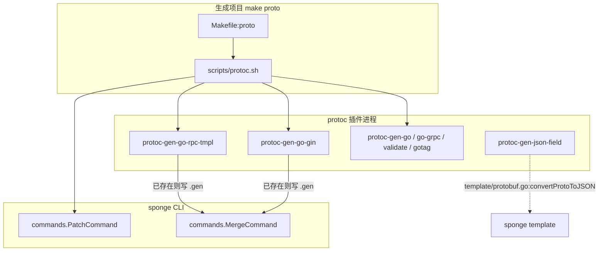
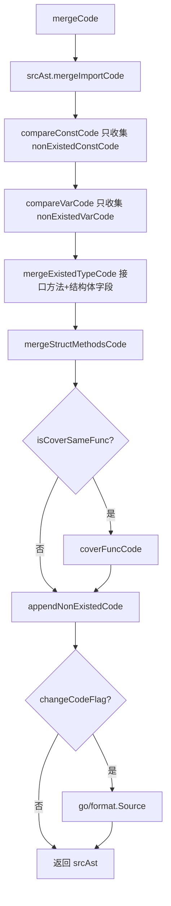

# Protoc 插件与增量合并

> 状态：待复核生成稿
> 生成日期：2026-08-16
> 基准提交：`23807238c62e0f3b3e2d9a341bbef50547d3f5ec`
> 工作区：dirty
> 源码范围：`cmd/protoc-gen-go-gin/`、`cmd/protoc-gen-go-rpc-tmpl/`、`cmd/protoc-gen-json-field/`、`pkg/goast/`、`cmd/sponge/commands/merge.go`、`cmd/sponge/commands/merge/`、`cmd/sponge/commands/patch.go`、`cmd/sponge/commands/patch/`、`scripts/protoc.sh`、`scripts/patch.sh`、`scripts/patch-mono.sh`、`Makefile`、`cmd/sponge/commands/generate/template.go`、`cmd/sponge/commands/plugins.go`
> 生成方式：源码、测试、配置与部署资产静态分析

## 目录

- [快速摘要](#快速摘要)
- [为什么这样设计（Why）](#为什么这样设计why)
- [它是什么（What）](#它是什么what)
- [代码如何实现（How）](#代码如何实现how)
  - [插件如何被 Makefile / protoc.sh 调用](#插件如何被-makefile--protocsh-调用)
  - [protoc-gen-go-gin 全链路](#protoc-gen-go-gin-全链路)
  - [protoc-gen-go-rpc-tmpl 全链路](#protoc-gen-go-rpc-tmpl-全链路)
  - [protoc-gen-json-field 全链路](#protoc-gen-json-field-全链路)
  - [pkg/goast 增量合并算法](#pkggoast-增量合并算法)
  - [sponge merge：把 .gen 临时文件合进已有 Go 文件](#sponge-merge把-gen-临时文件合进已有-go-文件)
  - [sponge patch：每个子命令的 flags、改哪些文件、失败行为](#sponge-patch每个子命令的-flags改哪些文件失败行为)
- [调用关系表](#调用关系表)
- [测试与覆盖缺口](#测试与覆盖缺口)
- [阅读源码建议顺序](#阅读源码建议顺序)
- [重新实现检查清单](#重新实现检查清单)

相关文档：[05-代码生成器与模板写入.md](05-代码生成器与模板写入.md)（`protoc.sh` 锚点如何被生成器替换）、[09-生成项目启动与HTTP请求链.md](09-生成项目启动与HTTP请求链.md)（`*_router.pb.go` 与 handler 运行时）、[10-gRPC服务网关与RPC客户端.md](10-gRPC服务网关与RPC客户端.md)（rpc-tmpl 产出的 service 如何注册）。

---

## 快速摘要

### 架构总览（模块与依赖）

本篇覆盖 **Protobuf 胶水代码的生成期**，不是 HTTP/gRPC 运行期。运行时有三类独立进程：

1. **`protoc` 拉起的插件进程**：`cmd/protoc-gen-go-gin`、`cmd/protoc-gen-go-rpc-tmpl`、`cmd/protoc-gen-json-field`。它们读 `CodeGeneratorRequest`，把 Go 文件直接 `os.WriteFile` 到磁盘（多数产物不走 protogen 的 `NewGeneratedFile`）。
2. **`sponge` CLI 进程**：`commands.MergeCommand` 把插件写出的 `*.go.gen20*` 合进已有 `.go`；`commands.PatchCommand` 在生成后修补 omitempty、错误码、types.proto、go.mod、third_party、mono-repo 导入路径。
3. **生成项目的 `make proto`**：根 `Makefile` 的 `proto` 目标执行 `scripts/protoc.sh`。该脚本是模板；[05-代码生成器与模板写入.md](05-代码生成器与模板写入.md) 里的 `protoShellFileMark` 会按服务类型替换成不同的 `--go-gin_opt=plugin=...` / `--go-rpc-tmpl_out` 片段。

依赖方向：`protoc` → 三个插件 → 磁盘上的 `.go` / `.json`；`sponge merge` → `commands/merge/module`（专用 AST）以及（AI 路径）`pkg/goast.MergeGoCode`；`sponge patch` → `pkg/replacer` / 文本替换 / AST 改错误码。生成项目运行时只消费产物，不反向调用插件。详见 [09-生成项目启动与HTTP请求链.md](09-生成项目启动与HTTP请求链.md)、[10-gRPC服务网关与RPC客户端.md](10-gRPC服务网关与RPC客户端.md)。

### 核心调用序列（逐步逻辑）

以生成项目执行 `make proto`（HTTP-PB 形态，`plugin=handler`）为主路径：

1. `Makefile:proto` 调用 `bash scripts/protoc.sh $(FILES)`，再 `go mod tidy`、`gofmt`。
2. `scripts/protoc.sh:generateByAllProto` 对全部 proto 跑 `protoc --go_out` / `--validate_out` / `--gotag_out`（gRPC 段由模板锚点 `# todo generate grpc files here` 决定是否保留）。
3. `generateBySpecifiedProto` 对业务 proto 跑 `--openapiv2_out`，再跑 `--go-gin_out` 并带 `--go-gin_opt=plugin=handler|service|mix`（具体哪段由生成器写入，见下文模板表）。
4. `protoc-gen-go-gin/main.go:main` → `protogen.Options.Run` → 每个 `f.Generate==true` 的文件：`saveGinRouterFiles` 覆盖写 `*_router.pb.go`；逻辑/路由/错误码若目标已存在则写成 `*.go.gen<时间戳>`。
5. `sponge merge http-pb|rpc-pb|rpc-gw-pb` 按类型扫描 `internal/{ecode,routers,handler,service}/*.go.gen20*`，备份到 `/tmp/sponge_merge_backup_code/<时间戳>/`，把新符号合进已有 `.go`，再删除 `.gen` 文件。
6. 脚本末尾固定调用 `sponge patch del-omitempty`、`modify-dup-num`、`modify-dup-err-code`。

### 易错点与边界条件

- 插件对已有逻辑文件 **从不覆盖**：`saveFile` / `saveFileSimple` 的 `isNeedCovered` 在全部调用点都是 `false`。第二次 `make proto` 一定产出 `.gen` 文件，必须再跑 merge。
- `*_router.pb.go` 是例外：`saveGinRouterFiles` 每次直接覆盖，文件头写 `DO NOT EDIT`。
- `protoc-gen-go-gin` 的 `plugin` 为空会走 `default` 并 `return fmt.Errorf("unknown plugin name")`。`helpInfo`、插件 `README.md`、插件 `Makefile` 的 `router` 目标声称可以只生成 `*_router.pb.go`，与当前 `switch` **冲突**。
- `sponge merge` 三个子命令的 `RunE` 把 `runMerge` 错误打印成 `[Warning]` 后 **返回 `nil`**，所以 `protoc.sh` 里 `checkResult $?` 不会因 merge 失败而退出。
- `pkg/goast.MergeGoFile` **不是** `sponge merge` 的实现。CLI merge 走 `commands/merge/module`；`MergeGoCode` 的调用方是 `cmd/sponge/commands/assistant/merge.go:mergeGoFile`（AI 助手路径，见文档库 08）。
- proto 文件名后缀 `_test.proto` 被两个 Go 插件拒绝。`protoc-gen-go-rpc-tmpl` 遇到该错误时 `continue` 跳过，**不中断**整个插件进程。
- 错误码 `xxxNO` 合法范围注释写 1~999；`modify-dup-num` 把重复编号改到 `max+1` 且封顶 999。偏移量重复由 `modify-dup-err-code` 改 `BaseCode+%d`，封顶 99。

---

## 为什么这样设计（Why）

Protobuf 定义变更是常态：加一个 RPC、改一条 `google.api.http` 路径。如果每次都整文件覆盖 `internal/handler` / `internal/service`，用户已经写进去的业务逻辑会丢。

Sponge 把产物分成三类，用三种策略：

| 产物类别 | 代表文件 | 策略 | 原因 |
|---|---|---|---|
| 机械绑定代码 | `api/.../*_router.pb.go` | 每次覆盖 | 由 proto 完全决定，禁止手改 |
| 业务模板 | `internal/handler/*.go`、`internal/service/*.go`、`internal/routers/*_router.go` | 已存在则写 `.gen` 时间戳文件，再 AST 合并 | 保留已有函数体、已有中间件行 |
| 错误码 | `internal/ecode/*_http.go`、`*_rpc.go` | 同上，合并后再跑 dup patch | `errcode.HCode`/`RCode` 要求编号全局唯一，重复会 panic |

`pkg/goast` 提供通用的「按声明名合并两个 Go 文件」算法；`commands/merge/module` 在它之上针对 router 的 `c.setSinglePath`、ecode 的 `BaseCode+N`、gRPC 测试里的 `tests` 切片做了专用解析。不把这套逻辑塞进插件本身，是为了让 `protoc` 插件保持「只负责生成」，合并策略可以在 CLI 里演进。

---

## 它是什么（What）

### 三个插件进程

`protoc --<plugin>_out` 会在 `PATH` 里找名为 `protoc-gen-<plugin>` 的可执行文件，通过 stdin/stdout 交换 `pluginpb.CodeGeneratorRequest/Response`。本仓库三个插件都用 `google.golang.org/protobuf/compiler/protogen`，`ParamFunc: flags.Set` 把 `--xxx_opt=k=v` 送进各自的 `flag.FlagSet`。

安装入口是 `cmd/sponge/commands/plugins.go`：`pluginNames` 含 `protoc-gen-go-gin`、`protoc-gen-go-rpc-tmpl`、`protoc-gen-json-field`；`installPluginCommands` 对应 `go install github.com/go-dev-frame/sponge/cmd/<name>@latest`。`adaptInternalCommand` 在 `version != "v0.0.0"` 时把 `@latest` 换成 `@`+当前 sponge 版本。

| 插件二进制 | 包路径 | 输入 | 主要产物 |
|---|---|---|---|
| `protoc-gen-go-gin` | `cmd/protoc-gen-go-gin` | service + `google.api.http` | `*_router.pb.go`；按 plugin 再出 handler/service 模板、`*_router.go`、`*_http.go`/`*_rpc.go` |
| `protoc-gen-go-rpc-tmpl` | `cmd/protoc-gen-go-rpc-tmpl` | service（含流式） | `internal/service/*.go`、`*_client_test.go`、`internal/ecode/*_rpc.go` |
| `protoc-gen-json-field` | `cmd/protoc-gen-json-field` | service + message 字段 | 与 proto 同前缀的 `.json`，给 `sponge template` 用 |

### 两套增量合并

| 实现 | 入口符号 | 谁调用 | 合什么 |
|---|---|---|---|
| `pkg/goast.mergeCode` | `MergeGoFile` / `MergeGoCode` | `assistant/merge.go:mergeGoFile`；测试 `pkg/goast/merge_test.go` | import / const / var / interface 方法 / struct 字段 / 方法 / 可选覆盖同名函数 / 追加新声明 |
| `commands/merge/module` | `ParseHandlerAndServiceCode`、`ParseRouterCode`、`ParseErrorCode`、`ParseGRPCMethodsTestAndBenchmarkCode` | `sponge merge http-pb\|rpc-pb\|rpc-gw-pb` | 逻辑文件的 import+方法；router 的 `setSinglePath`；ecode 的错误码项；`_client_test.go` 的 `tests` 切片元素 |

### CLI 挂载

`commands/root.go:NewRootCMD` 把 `MergeCommand()` 与 `PatchCommand()` 加到根命令。`MergeCommand` 再挂 `merge.GinHandlerCode`（`http-pb`）、`merge.GinServiceCode`（`rpc-gw-pb`）、`merge.GRPCServiceCode`（`rpc-pb`）。`PatchCommand` 挂十个子命令，见 patch 专节。



---

## 代码如何实现（How）

### 插件如何被 Makefile / protoc.sh 调用

#### 仓库模板脚本 `scripts/protoc.sh`

这是生成项目 `scripts/protoc.sh` 的源模板。关键函数：

| 符号 | 行为 |
|---|---|
| `checkResult` | 参数非 0 则 `exit` |
| `getSpecifiedProtoFiles` | `$1` 为空返回 0；否则把逗号换成空格，逐个检查文件存在，返回 1 |
| `listProtoFiles` | 递归列出 `$protoBasePath`（默认 `api`）下全部 `.proto`，路径裁成 `api/...` |
| `deleteUnusedPkg` | `sed` 删掉 `*.pb.go` 里 validate / openapiv2 / gotag / annotations 的 blank import；Darwin 用 `sed -i ''` |
| `handlePbGoFiles` | 递归对 `*.pb.go` 调 `deleteUnusedPkg` |
| `autoDetectTypesProto` | 若参数列表没有 `api/types/types.proto` 但某文件 `grep` 到该路径，则追加它并 `sponge patch gen-types-pb --out=.`（stdout 丢弃） |
| `autoDetectInitDbFile` | `sponge patch gen-db-init --out=.`（stdout 丢弃） |
| `generateByAllProto` | 全量或指定 proto → types/db 探测 → `--go_out` → 可选 `--go-grpc_out` → `--validate_out` → `--gotag_out` |
| `generateBySpecifiedProto` | 只处理 `api/serverNameExample` 下的 proto（与 `$1` 求交）；跑 swagger + **胶水插件** + merge |

脚本末尾固定顺序：

1. `generateByAllProto`
2. `generateBySpecifiedProto`
3. `handlePbGoFiles $protoBasePath`
4. `sponge patch del-omitempty --dir=$protoBasePath --suffix-name=pb.go`（stdout 丢弃）
5. `sponge patch modify-dup-num --dir=internal/ecode`
6. `sponge patch modify-dup-err-code --dir=internal/ecode`

仓库里这份模板的胶水段（`# delete the templates code start` 到 `end`）是 **rpc-gw 形态**：`--go-gin_opt=plugin=service`，然后 `sponge merge rpc-gw-pb`。用户项目不会原样使用这段，生成器会替换锚点。

两个锚点：

- `# todo generate grpc files here`（常量 `generate.protoShellFileGRPCMark`）
- `# todo generate api template code command here`（常量 `generate.protoShellFileMark`）

#### 生成器如何改写 `protoc.sh`

`cmd/sponge/commands/generate/template.go` 定义四段替换文本；各 Generator 的 `addFields` 用 `replacer.Field` 写入。细节属于 [05-代码生成器与模板写入.md](05-代码生成器与模板写入.md)，本篇只记与插件相关的契约：

| 生成命令 | 替换 `protoShellFileGRPCMark` | 替换 `protoShellFileMark` | 插件与 merge |
|---|---|---|---|
| `sponge web http`（`generate/http.go`） | `""`（删掉 go-grpc） | `""`（无胶水插件） | 不跑 gin/rpc-tmpl |
| `sponge web http-pb`（`http-pb.go`） | `""` | `protoShellHandlerCode` | `--go-gin_opt=plugin=handler` → `sponge merge http-pb` |
| `sponge micro rpc` / `rpc-pb` | `protoShellGRPCMark` | `protoShellServiceTmplCode` | `--go-rpc-tmpl_out` → `sponge merge rpc-pb` |
| `sponge micro grpc-gw-pb`（`rpc-gw-pb.go`） | `protoShellGRPCMark` | `protoShellServiceCode` | `--go-gin_opt=plugin=service` → `sponge merge rpc-gw-pb` |
| `sponge micro grpc-http-pb`（`grpc-http-pb.go`） | `protoShellGRPCMark` | `protoShellServiceAndHandlerCode` | 先 rpc-tmpl + `merge rpc-pb`，再 `--go-gin_opt=plugin=mix` + `merge http-pb` |

四段胶水脚本的共同步骤：从 `docs/gen.info` 用 `cut -d , -f 1/2/3` 读出 `moduleName`、`serverName`、`suitedMonoRepo`，传给 `--go-gin_opt` / `--go-rpc-tmpl_opt`。`saveGenInfo`（`generate/common.go`）写入格式为 `moduleName,serverName,true|false`。

HTTP/网关段还会先跑 `--openapiv2_out` 和 `sponge web swagger --enable-standardize-response --enable-to-openapi3 --enable-integer-to-string`。

mono-repo 时 `generate.serverCodeFields` 把 `sponge merge http-pb` 改成 `sponge merge http-pb --dir=<serverName>`（rpc-pb / rpc-gw-pb 同理），并把 `=$(cat docs/gen.info` 改成 `=$(cat <serverName>/docs/gen.info`。

模板仓库这份 `protoc.sh` 末尾还有：

```bash
  if [ "$suitedMonoRepo" == "true" ]; then
    sponge patch adapt-mono-repo --dir=serverNameExample
  fi
```

生成后 `serverNameExample` 会被替换成真实服务名。

#### 生成项目 Makefile

根 `Makefile`：

```make
proto:
	@bash scripts/protoc.sh $(FILES)
	go mod tidy
	@gofmt -s -w .
```

`FILES` 可逗号分隔，例如 `make proto FILES=api/user/v1/user.proto`。

同文件还把 patch 暴露给用户：

| Make 目标 | 实际命令 |
|---|---|
| `make patch TYPE=mysql`（也支持 mongodb/postgresql/sqlite/types-pb） | `bash scripts/patch.sh $(TYPE)` |
| `make copy-proto SERVER=... PROTO_FILE=...` | `sponge patch copy-proto --server-dir=$(SERVER) --proto-file=$(PROTO_FILE)` |
| `make modify-proto-pkg-name` | `sponge patch modify-proto-package --dir=api --server-dir=.` |

`scripts/patch.sh` 把 `TYPE` 映射到 `gen-types-pb` 或 `gen-db-init --db-driver=...`。`scripts/patch-mono.sh` 在 mono-repo 子服务里：没有上级 `go.mod` 则 `sponge patch copy-go-mod -f` 并 `mv` 到上级；非 http 则 `copy-third-party-proto`；grpc 则 `gen-types-pb` 并把 `api/types` 挪到上级 `api`。

#### 插件自己的 Makefile（开发用，不是生成项目）

| 文件 | 目标 | 作用 |
|---|---|---|
| `cmd/protoc-gen-go-gin/Makefile` | `router` / `handler` / `service` / `mix` 及 `*-mr` | `go build` 后 `--plugin=./protoc-gen-go-gin*` 调本地二进制；`mr` 加 `suitedMonoRepo=true` |
| `cmd/protoc-gen-go-rpc-tmpl/Makefile` | `proto` / `proto-mr` | 同时 `--go_out` `--go-grpc_out` `--go-rpc-tmpl_out` |
| `cmd/protoc-gen-json-field/Makefile` | `json` | `--json-field_out=. --plugin=./protoc-gen-json-field*` |

---

### protoc-gen-go-gin 全链路

#### `main.go`：参数、分支、落盘

`main` 先解析自己的 `-h`（不经过 protogen）。无 `-h` 时构造 `flag.FlagSet`：

| flag | 默认 | 含义 |
|---|---|---|
| `plugin` | `""` | `handler` / `service` / `mix` |
| `moduleName` | `""` | 替换模板里的 `moduleNameExample`；`saveFile` 为空则 **panic** |
| `serverName` | `""` | 替换 `serverNameExample`；为空 panic |
| `logicOut` | 空则按 plugin 填 | handler/mix → `internal/handler`；service → `internal/service`；mono-repo 前缀 `serverName/` |
| `routerOut` | 空则 `internal/routers` | 注入路由文件目录 |
| `ecodeOut` | 空则 `internal/ecode` | mix **不写** ecode，该值被忽略 |
| `suitedMonoRepo` | `false` | 目录改 `serverName/internal/...`，内容走 `adaptMonoRepo` |

`protogen.Options.Run` 回调：

1. `gen.SupportedFeatures = FEATURE_PROTO3_OPTIONAL`。
2. 跳过 `!f.Generate`。
3. 文件名（不含目录）以 `_test.proto` 结尾则返回 error，**中断整个插件**。
4. 每个文件先 `saveGinRouterFiles(f)`。
5. `handlerFlag` → `saveHandlerAndRouterFiles(..., mixFlag)`；否则 `serviceFlag` → `saveServiceAndRouterFiles`。

`plugin` 的 `switch`：`mix` 同时置 `mixFlag=true` 和 `handlerFlag=true`。空字符串或其它值走 `default` 返回 error（与 help/README 冲突，见易错点）。

`saveGinRouterFiles`：

1. `router.GenerateFiles(f)`；空则返回。
2. 若内容不含 `errors.`，删掉 `"errors"` import。
3. 若不含 `middleware.`，删掉 `"github.com/go-dev-frame/sponge/pkg/gin/middleware"` import。
4. 写到 `f.GeneratedFilenamePrefix + "_router.pb.go"`，权限 `0666`，**覆盖**。

`saveHandlerAndRouterFiles` 调 `handler.GenerateFiles(f, isMixType, moduleName)` 得到三份字节：

| 内容 | 目标名 | 落盘函数 | mix 时 |
|---|---|---|---|
| 逻辑模板 | `<prefix>.go` | `saveFile(..., handlerPlugin)` | 写入 `logicOut` |
| 注入路由 | `<prefix>_router.go` | `saveFile` | 写入 `routerOut` |
| 错误码 | `<prefix>_http.go` | `saveFileSimple` | **跳过** |

`saveServiceAndRouterFiles` 调 `service.GenerateFiles(f, moduleName)`：逻辑进 `logicOut` 的 `<prefix>.go`，路由进 `routerOut` 的 `<prefix>_router.go`，错误码进 `ecodeOut` 的 `<prefix>_rpc.go`。

`saveFile`：

1. `content` 空则 return。
2. `moduleName`/`serverName` 空则 `panic(optErrFormat)`（不是 return error）。
3. `os.MkdirAll(out, 0766)`。
4. 目标已存在且 `!isNeedCovered`：`removeOldGenFile`（`gofile.FuzzyMatchFiles(file+".gen*")` 后 `os.Remove`），再把文件名改成 `file + ".gen" + time.Now().Format("20060102T150405")`。
5. 替换 `moduleNameExample`、`serverNameExample`、首字母大写的 `ServerNameExample`。
6. `suitedMonoRepo` 为真则 `adaptMonoRepo`。
7. `os.WriteFile(..., 0666)`。

`adaptMonoRepo` 三组替换：

- `"<module>/internal/` → `"<module>/<server>/internal/`
- `"<module>/configs` → `"<module>/<server>/configs`
- `"<module>/api` → `"<module>/<server>/api`

后面 `sponge patch adapt-mono-repo` 会把 **api** 这一条改回去（mono-repo 的 `api` 在仓库根，不在服务子目录）。internal/configs 保持带服务名的路径。

`saveFileSimple` 不做 module/server 替换，也不走 `adaptMonoRepo`。`isExists`：`os.Stat` 失败时若 **不是** `IsNotExist` 则当成存在（权限错误会走 `.gen` 路径）。

#### `internal/parse`：proto → 结构体

**给 handler/service 模板用的 `GetServices`：**

`GetServices(file, moduleName)` → 对每个 `file.Services` 调 `parsePbService`。

`parsePbService` 对每个 RPC：

1. `proto.GetExtension(m.Desc.Options(), annotations.E_Http)` 得到主 `HttpRule`。有则 `buildHTTPRule`；无则 `Path`/`Method` 为空（注释掉的 `defaultMethod` 未启用）。
2. **不展开** `AdditionalBindings`。因此 handler 模板每个 RPC 只有一条 HTTP 路径；`*_router.pb.go` 才会为 extra binding 生成第二个 handler。
3. 填 `ServiceMethod`：Go 名、请求/响应类型、`getFields`、`getMethodComment`、`getInvokeType`、服务名大小写变体、HTTP 三件套、`IsPassGinContext`/`IsIgnoreShouldBind`、导入包名。

`Field`：`Name`=`f.GoName`，`FieldType`=`Kind().String()`，repeated 则前缀 `[]`。`GoTypeZero()`：bool→`false`；整数族→`0`；float/double→`0.0`；string→`""`；其它→`nil`。

`getCutServiceName`：若名字以 `Service` 结尾且去掉后非空，则去掉该后缀（`GreeterService`→`Greeter`；光一个 `Service` 则保留）。

`getInvokeType(clientStream, serverStream)`：双流 3，仅客户端流 1，仅服务端流 2，否则 0。handler/service **模板用 `eq .InvokeType 0` 且 `.Path` 非空才生成方法**，流式 RPC 和没有 http 注解的 RPC 不会出现在 HTTP handler 里。

`convertToPkgName`：去掉引号，按 `/` 拆。最后一段若匹配 `^v\d+$`、等于 `pb`、或长度 `<2`，则用倒数第二段去掉 `-` 再拼上首字母大写的最后一段（`api/user/v1`→`userV1`）。否则用最后一段去 `-`。

`GetImportPkg`：合并所有 service 的 `ImportPkgMap`；若自身 `pkgName` 已在 map 中，**覆盖**为 `` `pkgName "moduleName/protoFileDir"` ``（注释写明 real package path priority）。`GetSourceImportPkg` 只取第一个遇到的 service 的 map 来拿 `protoFileDir`/`moduleName`，返回那一个自身包 import。

`getMethodComment`：把 leading comment 规范成 `// MethodName ...`；没有可用注释则 `// MethodName ......`。

**给 `*_router.pb.go` 用的 `ParseHTTPPbServices`：**

对每个 RPC 调 `GetMethods(m, goImportPath)`。`GetMethods` 若有 http 扩展：先遍历 `rule.AdditionalBindings` 各生成一个 `RPCMethod`，再生成主 rule。返回切片。`HTTPPbService.UniqueMethods = removeDuplicates(methods)`，按 `method.Name`（RPC 名）去重，供 `XxxLogicer` 接口每个 RPC 只声明一次。

`HTTPPbServices.MergeImportPkgPath` 合并所有 service 的 `ImportPkgMap` 为 import 块字符串。

#### `internal/parse/method.go`：HTTP 规则

包级 `methodSets map[string]int`：**整个插件进程共享**，按 RPC Go 名计数。`buildMethodDesc` 用当前计数作为 `Num`，`defer methodSets[m.GoName]++`。`HandlerName()` 返回 `fmt.Sprintf("%s_%d", m.Name, m.Num)`，例如 `Create_0`、`Upload_1`。

`buildHTTPRule` 按 `rule.Pattern` 类型设置 path 与标准 HTTP 方法；`Custom` 时 path 取 `Custom.Path`，`customKind` 取 `strings.ToLower(Custom.Kind)`，HTTP 方法先默认 POST，再由 `checkCustomKind` 改写。

`checkCustomKind`：`parseVariable` 解析 `[ctx]`/`[no_bind]`；再把 kind 映射到 GET/POST/PUT/DELETE/PATCH/OPTIONS/HEAD/TRACE/CONNECT，未知则 POST。

`checkSelector`：再次 `parseVariable(m.Selector)` 并 **覆盖** `IsPassGinContext`/`IsIgnoreShouldBind`。因此 selector 里的标记优先于 custom kind 里的标记。

`parseVariable`：去空格，取最后一个 `]` 与第一个 `[` 之间，按逗号拆。`ctx`→只传 gin.Context；`no_bind`→忽略 ShouldBind **并且** 传 gin.Context。括号前的字符串作为 prefix（用于 custom HTTP 方法名）。

`InitPathParams`：路径段 `{xx}` 改成 `:xx`（Gin 风格）。`HasPathParams` 检测 `{...}` 或前缀 `:`。

请求/响应若 `GoImportPath != protoSelfPkgPath`，则 `RequestImportPkgName`/`ReplyImportPkgName` 为 `convertToPkgName(...) + "."`（注意带点，供模板直接拼 `userV1.CreateRequest`）。

#### `internal/generate/router`：`*_router.pb.go`

`GenerateFiles`：无 service 返回 nil。否则 `ParseHTTPPbServices` → `genGinRouterFile`：先 `importPkgTmpl`（package 名、合并 import），再对每个 service 执行 `ginRouterTmpl`。

模板生成的真实符号（以 service 名 `Greeter` 为例）：

- 接口 `GreeterLogicer`：每个 UniqueMethod 在 unary 且 Path 非空时声明 `Name(ctx, req) (reply, error)`。
- `GreeterOption` / `greeterOptions`：字段 `isFromRPC`、`responser`、`zapLog`、`httpErrors`、`rpcStatus`、`wrapCtxFn`。
- 选项函数：`WithGreeterHTTPResponse`（`isFromRPC=false`）、`WithGreeterRPCResponse`（true）、`WithGreeterResponser`、`WithGreeterLogger`、`WithGreeterErrorToHTTPCode`、`WithGreeterRPCStatusToHTTPCode`、`WithGreeterWrapCtx`。
- `RegisterGreeterRouter(iRouter, groupPathMiddlewares, singlePathMiddlewares, iLogic, opts...)`：默认 `errcode.NewResponser(o.isFromRPC, ...)`；logger 默认 `zap.NewProduction()`；构造 `greeterRouter` 后 `register()`。
- `register`：对每个 Method（含 additional binding）`iRouter.Handle(Method, Path, withMiddleware(...))`。流式或无 Path 的跳过。
- `withMiddleware`：groupPath 左前缀匹配（`""` 或 `"/"` 对所有路径生效）；单路径 key 为 `strings.ToUpper(method)+"->"+path`；最后 append 真正的 handler。
- 每个 handler `Name_Num`：构造 req；除非 `IsIgnoreShouldBind`：有路径参数则 `ShouldBindUri`；GET/DELETE 再 `ShouldBindQuery`；POST/PUT/PATCH 再 `ShouldBindJSON`；其它 `ShouldBind`。失败打 Warn 并 `iResponse.ParamError`。`IsPassGinContext` 时 `ctx = c`，否则 `wrapCtxFn(c)` 或 `middleware.WrapCtx(c)`。调 `iLogic.Name`；`errors.Is(err, errcode.SkipResponse)` 则直接 return；其它错误 `iResponse.Error`；成功 `iResponse.Success`。

运行时这些函数如何被 [09-生成项目启动与HTTP请求链.md](09-生成项目启动与HTTP请求链.md) 的 `internal/routers` 调用：`init` 里 `allRouteFns` 最终在 `NewRouter` 执行。

#### `internal/generate/handler`：plugin=handler / mix

`GenerateFiles(file, isMixType, moduleName)`：无 service 返回三个 nil。`parse.GetServices` 后：

- 非 mix：`handlerLogicTmpl` + `routerTmpl` + `httpErrCodeTmpl`
- mix：`mixLogicTmpl` + `mixRouterTmpl`，ecode 为 nil

`execute` 把占位注释 `// import api service package here` 换成 `GetImportPkg` 或 `GetSourceImportPkg`。mix 逻辑若内容含 `ctx = middleware.AdaptCtx(ctx)`，额外 append gin middleware import。

**handler 逻辑模板**（`package handler`）：

- `var _ ProtoPkg.NameLogicer = (*lowerNameHandler)(nil)`
- 结构体 `lowerNameHandler`，构造函数 `NewNameHandler() ProtoPkg.NameLogicer`，体内 `panic("implement me")` 的示例注释调用 dao。
- 仅 unary 且 Path 非空的方法。

**handler 注入路由模板**（`package routers`）：

- `init()`：`allMiddlewareFns` 追加 `lowerNameMiddlewares`；`allRouteFns` 追加调用 `lowerNameRouter(..., handler.NewNameHandler())`。
- `lowerNameRouter`：`RegisterNameRouter` + `WithNameLogger` + `WithNameHTTPResponse` + `WithNameErrorToHTTPCode`。
- `lowerNameMiddlewares`：注释掉的 `c.setSinglePath("METHOD", "path", middleware.Auth())`。

**HTTP ecode 模板**（`package ecode`）：

```text
lowerNameNO = 1
lowerNameName = "lowerName"
lowerNameBaseCode = errcode.HCode(lowerNameNO)
ErrMethodNameService = errcode.NewError(lowerServiceNameBaseCode+AddOne(i), "failed to MethodName "+lowerServiceNameName)
```

`AddOne(i)` 是 `i+1`，所以第一个方法偏移是 1。`// --blank line--` 在 `execute` 里被删掉。注释写明 NO 范围 1~999，相同会 panic。

**mix 逻辑**：handler 内嵌 `server ProtoPkg.NameServer`，`NewNameHandler` 里 `service.NewNameServer()`。方法体：若 `IsIgnoreShouldBind || IsPassGinContext` 则 `_, ctx = middleware.AdaptCtx(ctx)`，然后 `return h.server.Method(ctx, req)`。这是 [10-gRPC服务网关与RPC客户端.md](10-gRPC服务网关与RPC客户端.md) 双协议形态：HTTP 入口转调本进程 gRPC service。

**mix 注入路由**：`WithNameRPCResponse` + `WithNameWrapCtx`；`ctxFn` 用 `metadata.NewIncomingContext` 塞 `middleware.ContextRequestIDKey`。

#### `internal/generate/service`：plugin=service（RPC 网关客户端）

结构与 handler 对称，但：

- 包名 `service`，类型 `lowerNameClient`，`NewNameClient() Logicer`，注释示例 `rpcclient.GetCutServiceNameRPCConn()`。
- 错误码文件 `*_rpc.go`：`_lowerNameNO`、`errcode.RCode`、`StatusMethodNameService = errcode.NewRPCStatus(...)`。
- 注入路由：`service.NewNameClient()`，`WithNameRPCResponse`，`metadata.NewOutgoingContext`（HTTP→后端 gRPC 的 outgoing metadata）。

示例 proto：`cmd/protoc-gen-go-gin/api/v1/greeter.proto` 覆盖 CRUD、`additional_bindings`、`selector: "[ctx]"`/`[no_bind]`、`custom.kind: "HEAD"`；`mixed.proto` 覆盖无 http 的 Delete、三类 stream。

---

### protoc-gen-go-rpc-tmpl 全链路

#### `main.go`

flag：`moduleName`、`serverName`、`tmplDir`（默认 `internal/service` 或 `serverName/internal/service`）、`ecodeOut`（默认 `internal/ecode`）、`suitedMonoRepo`。

与 gin 的关键差异：`saveRPCTmplFiles` 返回 error 时 **`continue` 处理下一个 proto**，插件整体仍 `return nil`。`_test.proto` 因此只会跳过该文件，不会让 `protoc` 失败。

每个文件生成三份：

| 内容 | 文件名 | 落盘 |
|---|---|---|
| service 实现模板 | `<prefix>.go` | `saveFile` → `tmplDir` |
| 客户端测试+压测 | `<prefix>_client_test.go` | `saveFile` → `tmplDir` |
| RPC 错误码 | `<prefix>_rpc.go` | `saveFileSimple` → `ecodeOut` |

`saveFile` / `adaptMonoRepo` / `.gen` 时间戳规则与 gin 插件相同。helpInfo 误写成 `--go-gin_opt=suitedMonoRepo`，实际 flag 是 `--go-rpc-tmpl_opt=suitedMonoRepo`。

插件 README 写「共 2 个文件」，漏了 `*_client_test.go`，以 `main.go:saveRPCTmplFiles` 为准。

#### `internal/parse`

无 HTTP 规则。`ServiceMethod` 没有 Path/Method/Body。`PbService` 多了 `ProtoName`（`getProtoFilename`：Windows 把 `\\` 换成 `/` 再取最后一段 + `.proto`），给压测模板里的 `configs.Path("../api/.../foo.proto")` 用。

`GetImportPkg`：若自身 pkg 不在 map 中则 **补上** `moduleName/protoFileDir`（gin 版是覆盖已有项）。`GetSourceImportPkg`：若 map 里有自身 pkg 则返回该项，否则构造同样格式。

`getFields` / `GoTypeZero` / `getInvokeType` / `convertToPkgName` 与 gin 同逻辑。

#### `internal/generate/service`

`GenerateFiles`：无 service 返回三个 nil。否则三份模板。

**service 实现模板**（`package service`）：

- `init()`：`registerFns = append(registerFns, func(server *grpc.Server) { ProtoPkg.RegisterNameServer(server, NewNameServer()) })`。运行时由 [10-gRPC服务网关与RPC客户端.md](10-gRPC服务网关与RPC客户端.md) 的 gRPC server 遍历 `registerFns`。
- `var _ ProtoPkg.NameServer = (*lowerName)(nil)`，嵌入 `UnimplementedNameServer`。
- `NewNameServer() ProtoPkg.NameServer`。
- 按 `InvokeType` 四套方法签名，方法体都是 `panic("implement me")` 加注释示例：
  - 1 客户端流：`(stream Service_MethodServer) error`，循环 `Recv`，EOF 时 `SendAndClose`。
  - 2 服务端流：`(req, stream) error`，循环 `Send`。
  - 3 双向流：循环 Recv/Send。
  - 0 unary：`(ctx, req) (*Reply, error)`。

错误码模板对 **全部** Methods 生成 `StatusMethodNameService`（不要求有 HTTP path）。

**测试模板**：每个 service 两个测试函数。

- `Test_service_lowerName_methods`：`getRPCClientConnForTest()`，`tests` 切片每个 RPC 一个匿名 struct `{name, fn, wantErr}`。流式分支用 `stream.Send`/`CloseAndRecv`/`Recv`。服务端流分支写 `err == ioEOF`（标识符，**不是** `io.EOF`，生成后不能直接编译，需手改）。
- `Test_service_lowerName_benchmark`：`config.Init(configs.Path("serverNameExample.yml"))`（随后被 `saveFile` 换成真实服务名），`benchmark.New(host, protoFile, methodName, message, dependentProtoFilePath, total)`。unary 的 `total=1000`，流式 `total=100`。

示例 proto 与 gin 插件目录结构平行：`api/v1/greeter.proto`、`mixed.proto`。

---

### protoc-gen-json-field 全链路

#### `main.go`

无业务 flag。每个 `f.Generate` 的文件：`generate.GenerateFiles(f)` → 写 `GeneratedFilenamePrefix + ".json"`，权限 0666，**覆盖**。失败则插件返回 error。

调用方：`cmd/sponge/commands/template/protobuf.go:convertProtoToJSON`。它把用户 proto 拷到临时目录，执行：

```text
protoc --proto_path=. --proto_path=<thirdPartyDir>
  --json-field_out=. --json-field_opt=paths=source_relative
  <copied.proto>
```

返回同名 `.json`，再 `getProtoDataFromJSON` `json.Unmarshal` 成 `map[string]interface{}` 给模板渲染。`paths=source_relative` 由 protogen 自己消化，插件 FlagSet 是空的。

#### `parser/parser.go` 与 `parser/method.go`

`GetServices`：无 service 返回空切片（不是 nil 检查后的三个 nil 文件，这里只返回 `[]*PbService{}`）。

`Field` 比 gin 版多：`GoType`、`GoTypeCrossPkg`、`IsList`、`IsMap`、`ImportPkgName`、`ImportPkgPath`。`getFields`：

- `f.Desc.IsList()` / `IsMap()`。
- 若 `f.Message != nil`：`newFieldPkgInfo` 得到 `*Type` / `*pkg.Type`。map 的 value 若是 message，再扫子 field 取 value 类型，拼 `map[keyGoType]*Value`；value 非 message 则 `map[k]v` 标量。list of message 则 `[]*T`。
- 否则 `toGoType(Kind)`：enum→`int32`，bytes→`[]byte`，未识别 `unsported(%s)`（源码拼写如此）。

`HTTP` 解析与 gin `method.go` 同结构（`buildHTTPRule`/`checkCustomKind`/`checkSelector`/`InitPathParams`），同样 **不赋值 `RPCMethod.Body`**，因此 JSON 里 `HTTPRequestBody` 实际恒为空字符串。`GetMethods` 不存在；`parsePbService` 只对主 `HttpRule` 调一次 `buildHTTPRule`，**不含 additional_bindings**。

`GetProtoFileDir`：只有一段时返回整段（gin 的 `getProtoFileDir` 在只有一段时返回 `""`）。

#### `generate/gen.go`

`GenerateFiles` → `parser.GetServices` → `newProtoInfo` → 填 `Package`（`file.Desc.Package()`）、`FileDir`（包名 `.` 换 `/`）、`GoPackage`、`GoPkgName`、`FileNamePrefix`（`filepath.Split` 的文件名部分）、`FileNamePrefixCamel`（`xstrings.ToCamelCase`）、`FileName`。最后 `json.MarshalIndent(v, "", "  ")`。

`Service` 名变体：`ServiceNameCamel`、`ServiceNameCamelFCL`（首字母小写）、`ServiceNamePluralCamel`（`inflection.Plural` 后再 `customEndOfLetterToLower`：若只多一个 `S` 改成 `s`，多 `ES` 改成 `es`）、`ServiceNamePluralCamelFCL`。

`getInvokeType(int)` 输出字符串：`unary_call` / `client_side_streaming` / `server_side_streaming` / `bidirectional_streaming`。

JSON 顶层类型是 `ProtoInfo`，字段名即 JSON key（无 json tag，Go 导出字段原样序列化）。

---

### pkg/goast 增量合并算法

#### `ast.go`：把 Go 源码切成声明块

常量：`PackageType`/`ImportType`/`ConstType`/`VarType`/`FuncType`/`TypeType`；类型细类 `StructType`/`InterfaceType`/`ArrayType`/`MapType`/`ChanType`。

`AstInfo`：`Type`、`Names`（func 无接收者一个名字；方法则 `[方法名, 结构体名]`）、`Comment`、`Body`（从源码切片出的原文）。

`ParseFile` → `os.ReadFile` → `ParseGoCode`。`ParseGoCode` 用 `parser.ParseFile(..., parser.ParseComments)`，先 `getPackageCode`，再 `ast.Inspect`：

- `*ast.FuncDecl` → `getFuncDeclCode`：接收者解 `*T` 或 `T`；Body 从 `func` 关键字到 `Rbrace+1`。
- `*ast.GenDecl` → `getGenDeclCode`：`Tok.String()` 作为 Type（`import`/`const`/`var`/`type`）；有括号用 `Rparen+1`，否则最后一个 Spec 的 End。

`getGenName`：import 用路径字面量；const/var 用每个 ValueSpec 的 **第一个** 名字；type 用 TypeSpec 名。

分组解析（都先 `adaptPackage`：若前 50 字节或全文没有 `package ` 则前面加 `package parse\n\n`）：

| 函数 | 产出 |
|---|---|
| `ParseImportGroup` | `[]*ImportInfo{Path, Alias, Comment, Body}` |
| `ParseConstGroup` | `[]*ConstInfo{Name, Value(仅 BasicLit), Comment, Body}` |
| `ParseVarGroup` | `[]*VarInfo` 同上 |
| `ParseTypeGroup` | `[]*TypeInfo{Type, Name, Comment, Body, IsIdent}`，Type 为 struct/interface/func/map/array/chan 或 ident 名 |
| `ParseInterface` | `[]*InterfaceInfo` + `[]*MethodInfo`，嵌入接口 `IsIdent=true` |
| `ParseStruct` | `map[string]*StructInfo`，字段含嵌入 `*T`/`T`，`getTypeString` 递归 |
| `ParseStructMethods` | 从已有 `[]*AstInfo` 收集 `Names==2` 的 func，`map[结构体名][]*MethodInfo` |

`getSrcContent`：按 1-based 行号从 `srcLines` 切片；越界返回 `""`。

#### `merge.go`：`mergeCode` 的固定顺序

`CodeAstOption`：`WithCoverSameFunc` 置 `isCoverSameFunc`；`WithIgnoreMergeFunc(names...)` 填 `ignoreFuncNameMap`。

`NewCodeAst(filePath)` / `NewCodeAstFromData`：Parse 后 `setSlices` 按 Type 分到 `packageInfo`/`importInfos`/`constInfos`/`varInfos`/`typeInfos`/`funcInfos`。

`MergeGoFile` / `MergeGoCode` 都进 `mergeCode(srcAst, genAst)`：



**import**：源没有 import 则插到 package 行后；有则解析两边 `ParseImportGroup`，按 `Path` 差集，重建整个 `import (...)` 块插到 package 后，再把旧 import 声明 `Replace` 成空。package 行在源码中出现超过一次则 `errDuplication`。

**const / var**：源没有则整段收集到 `nonExisted*Code`；有则按 Name 差集包进新的 `const (` / `var (`。var 的特殊规则：名字为 `_` 且源码 `strings.Contains` 不含该 Body 时也当作不存在（可追加多个 blank assign）。

**已有 type**：`parseTypeCode` 得到 `map[typeName][]*TypeInfo`。gen 中源没有的名字进入 `nonExistedTypeInfoMap`。同名 interface 走 `mergeInterfaceMethodCode`（按方法名差集，插到源最后一个方法 Body 后；源方法为空则重写整个 `type Name interface { ... }`）。同名 struct 走 `mergeStructFieldsCode`（按字段名差集）。替换原文超过一处则 duplication error。

**结构体方法**：`ParseStructMethods` 两边。源已有该结构体时，把 gen 中没有的方法（`Comment+"\n"+Body`）接到源最后一个方法后面，并记入 `mergedStructMethodsMap`，避免后面再整段追加。

**coverFuncCode**（仅 `WithCoverSameFunc`）：按 `AstInfo.GetName()`（`strings.Join(Names, ",")`）匹配。跳过名为 `init` 或 `_` 的 **gen** 函数。忽略列表：方法用 `Names[0]`（方法名），普通函数用完整 GetName。匹配则 `strings.Replace` 一次函数 Body；源无注释且 gen 有则把注释拼到前面。

**appendNonExistedCode**：先把收集的 const/var 接到文件末尾。再遍历 gen 的 AstInfos：跳过 package/import/const/var；跳过已在 `mergedStructMethodsMap` 里的方法。名字不在源 map：type 且 `len(Names)>1`（type 组）时只把 `nonExistedTypeInfoMap` 里的项包成 `type (...)`；否则 `comment+"\n"+body` 追加。名字已在源：`_` 且 Body 不在源码中，或 `init` 且 Body 不在源码中，也追加（因此多个 `init` 可以并存）。

`format.Source` 失败则保留未格式化的 `Code`（`err == nil` 才写回）。`changeCodeFlag` 为 false 时不 format。

测试夹具 `pkg/goast/data/src.go.code` 与 `gen.go.code`：src 有 `person.Say/Hi`、`iSayer`、`GetByID` 空实现；gen 增加 `bytes` import、新 const `pi`/`Timeout1`、`person` 新字段 `email/age`、新方法 `SayHello/GetEmail`、给 `GetByID` 加了函数体。`TestMergeGoFile` 断言默认合并 `changeCodeFlag==true`；同文件合并 flag 为 false；`WithCoverSameFunc` 会覆盖 `GetByID`；`WithIgnoreMergeFunc("GetByID","Hi")` 跳过这两项覆盖。

#### `filter.go`：按 `panic("implement me")` 筛函数

`FilterFuncCode` / `FilterFuncCodeByFile`：

1. 解析带注释的 AST。
2. 非 `FuncDecl` 一律保留。
3. 函数名以 `New` 开头保留。
4. `Body==nil` 保留。
5. `containsPanicCall`：AST 里 `panic` 调用，第一个参数是 string literal，且 `HasPrefix(s, "implement me")` 或 `Contains` 任一 `customFlag`。命中则记入 `[]FuncInfo`。**仅当该函数有 Doc 注释时才保留进 `decls` 并置 `isMatch`**；无注释的 panic 函数既不进 `decls` 也不进 `removeIntervals`（从声明列表消失，但其 CommentGroup 可能残留）。
6. 其它函数（无 panic 标记）记入 `removeIntervals`（含 Doc 起始到 End），不进 `decls`。
7. 若没有任何「panic 标记 + 有注释」的函数，返回 error：`no function satisfies both conditions...`。
8. 过滤落在删除区间内的 CommentGroup，`printer.Fprint` 输出。

`FuncInfo.ExtractComment`：去掉 `//` 与 `/* */`，去掉函数名前缀。

调用方：`assistant/generate.go:extractFuncCodeBlock` → `FilterFuncCodeByFile`，用来把「还是 implement me」的方法交给 AI。`filter_test.go` 用本文件里三个带注释的 `demoFn1/2/3`（都是 `panic("implement me")`）断言筛出 3 个名字。

`sponge merge` **不调用** FilterFuncCode。

---

### sponge merge：把 .gen 临时文件合进已有 Go 文件

#### 命令树

`commands/merge.go:MergeCommand`：`Use=merge`，Long 提到备份目录 `/tmp/sponge_merge_backup_code`。三个子命令均 `SilenceErrors/SilenceUsage`，flag `--dir/-d` 默认 `"."`。

| 子命令 Use | 工厂函数 | `codeTypes` 顺序 |
|---|---|---|
| `http-pb` | `GinHandlerCode` | `errCodeType`, `routersType`, `handlerType` |
| `rpc-gw-pb` | `GinServiceCode` | `errCodeType`, `routersType`, `serviceGRPCTmplType` |
| `rpc-pb` | `GRPCServiceCode` | `errCodeType`, `serviceGRPCTmplType`, `serviceGRPCClientType` |

`grpc-http-pb` **不是** merge 子命令。`commands/merge/README.md` 第 4 条写了 `sponge merge grpc-http-pb`，与 `MergeCommand.AddCommand` **不一致**。双协议项目由 `protoc.sh` 先后调用 `merge rpc-pb` 和 `merge http-pb`。

每个 `RunE`：循环 `newMergeParams(dir, codeType).runMerge()`，错误 `fmt.Printf("[Warning] %v\n")`，函数返回 `nil`。

#### `common.go`：找 `.gen`、备份、分发

`defaultFuzzyFilename = "*.go.gen20*"`（只匹配 20xx 时间戳前缀，与 `20060102T150405` 一致）。

`adaptDir`：` ` / `./` / `.\\` → `"."`；去掉末尾 `/` 或 `\\`。

`newMergeParams` 按 type 设 `genCodeDir`：

| mergeType | 目录 |
|---|---|
| `errCodeType=1` | `internal/ecode` |
| `routersType=2` | `internal/routers` |
| `handlerType=3` | `internal/handler` |
| `serviceGRPCTmplType=4`、`serviceGRPCClientType=5` | `internal/service` |

`runMerge`：

1. `gofile.FuzzyMatchFiles(serverDir/genCodeDir/*.go.gen20*)`。
2. 用 `.go.gen20` 切开，左边 + `.go` 作为 `srcFile`。`len(filePrefix)!=2` 则 skip。
3. `groupFiles[srcFile]=genFile`。若 `groupFiles[genFile]` 已存在（按 **genFile** 做 key 查找），则保留字典序更大的 gen 路径。实际存储 key 是 `srcFile`，用 `genFile` 去查几乎总是 miss，因此 **后遍历到的 gen 覆盖前者**，字典序分支基本走不到。
4. 按 Type 调对应 `merge*File`，返回待删列表。
5. `deleteGenFiles`：`os.Remove` 每个 gen（忽略错误）。

`getBackupDir`：`os.TempDir()+"/sponge_merge_backup_code/"+time.Now().Format("20060102T150405")`。`backupFile`：按相对目录 `MkdirAll` 0744，`gobash.Exec("cp", file, bkDir)`。

`mergeErrCodeFile`：`module.ParseErrorCode`；`isNeedSave && SrcCode!=""` 才备份并 `WriteFile` 0666。gen 总是加入删除列表。

`mergeRoutersFile` / `mergeHandlerAndServiceFile` / `mergeServiceGRPCClientFile`：若 **src 与 gen 都不存在** 则 `return nil, nil`（**整个**该类型合并提前结束，后面的文件对不再处理）。内容变化判定：`len(SrcCode) != FileSize`。handler 路径 **跳过** `*_test.go`；grpc client 路径 **只处理** `*_test.go`。

#### `module/merge.go`：handler / service / 测试

`module.CodeAst`：`FilePath`、`SrcCode`、`FileSize`、`AstInfos`、`replaceCodeMap`、`excludeReceiverNameMap`、`appendCodes`。`NewCodeAst` 读文件 + `goast.ParseGoCode`。

`ParseHandlerAndServiceCode`：

1. `compareExistedImportCode`：两边 `parseImportCode`（对每个 import AstInfo 调 `goast.ParseImportGroup`，parse 失败 `continue`）。源无 import 则把 gen 的 import 块接到 package 后。有则按 Path 差集：`lastImportPath` 若是分组（Body 同时含一个 `(` 和一个 `)`）则在最后一个路径字符串后插入；否则把单行 `import "x"` 改成 `import (\n ... \n)`。
2. `compareExistedStructMethodsCode`：`goast.ParseStructMethods`。源已有该结构体时，把缺失方法接到最后一个方法后，并把结构体名放入 `excludeReceiverNameMap`。
3. `findNonExistedCode`：跳过 package/import；跳过已 exclude 的方法；名字不在源中则追加；名字为 `_` 且 Body 不在源码中也追加。
4. `replaceCode`：`strings.ReplaceAll` 所有 replaceCodeMap，再把 appendCodes 接到末尾。

**不做** goast 那套 interface/struct 字段合并、const/var 分组、`go/format`、同名函数覆盖。用户改过的函数体一律保留。

`ParseGRPCMethodsTestAndBenchmarkCode`：import 同上；`compareExistedGRPCMethodsTestCode` 只处理名字匹配 `Test_service_*_methods` 或 `Test_service_*_benchmark` 的无接收者函数。`parseGRPCMethodsTestCode` 给源码补 `package demo`（若无），`parser.ParseFile`，`ast.Inspect` 找赋给 `tests` 的 `CompositeLit`，每个元素里 `name:` 字符串作为方法名，切片为 `\t\t` + 从 `{` 到 `}` 的源码。缺失的测试 case 接到源最后一个 case 后，中间 `,\n\n`。找不到 `tests` 切片则 error。

`lastImportPath`：遍历 import AstInfo，分组时 `lastPath=info.Names[len-1]`（带引号的路径），非分组 `lastPath=info.Body`。

#### `module/router.go`

`ParseRouterCode`：`NewRouterCodeAst` 后：

1. `CompareExistedMiddlewareFunc`：`parseMiddlewareFunc` 找名字后缀 `Middlewares`、且唯一参数为 `*middlewareConfig` 的函数。`extractSinglePaths` 用正则 `^\s*(//)?\s*c\.setSinglePath\("(\w+)",\s*"([^"]+)",.*\)` 抽 `METHOD->path`（注释掉的行也算已存在）。`findNonExistedSinglePaths` 把 gen 有、源没有的整行接到源最后一条 `setSinglePath` 后；源一条都没有则接到函数 `{` 那一行后面。
2. `FindNonExistedName`：跳过 package/import，按 `Join(Names,",")` 追加新声明（新的 `fooRouter`/`fooMiddlewares`/`init` 块等）。
3. `ReplaceAll` + 追加。

**不合并 import。** 新路由文件第一次出现时整个 `init`/函数被 append；已有文件只加新的 `setSinglePath` 行和新顶层声明。

`parseMiddlewareFunc` 里条件写成 `astInfo.Type != goast.FuncType && !strings.HasSuffix(funcName, "Middlewares")` 才 continue，即 **非 Func 但名字以 Middlewares 结尾** 也会尝试解析。正常生成代码里 Middlewares 都是 func，可工作。

#### `module/errorCode.go`

`ParseErrorCode` 用 **patch 包** 的 `NewErrorCodeOffsetAst`（不是 goast.MergeGoFile）：

1. 对 gen 的每个 serviceName：源已有则 `CheckMergedItems`（按 VarName 把源没有的错误码行插到源 `offsetIndex` 那一行后面）；源没有则把整个 `codeInfo.Body` 追加到文件末尾。
2. 再对源每个 service 调 `CheckDuplicateErrorCodeOffset`。
3. 返回 `isNeedSave`。

---

### sponge patch：每个子命令的 flags、改哪些文件、失败行为

`commands/patch.go:PatchCommand` 注册顺序如下。`common.go` 提供 `getNamesFromOutDir`（读 `dir/docs/gen.info`，2 段则 mono=false，≥3 段第三段 `=="true"` 为 mono）、`listErrorCodeFiles`（列出 `*_http.go`/`*_rpc.go`，排除 `systemCode_http.go`/`systemCode_rpc.go`）、`Visitor`（AST 走访 `errcode.NewError`/`NewRPCStatus` 调用，取变量名和 `BaseCode+N` 的 N）。

`httpMark = "errcode.NewError"`，`grpcMark = "errcode.NewRPCStatus"`。

#### 1. `del-omitempty` — `DeleteJSONOmitemptyCommand`

| 项 | 值 |
|---|---|
| flags | `--dir/-d` **必填**；`--suffix-name/-s` 默认空（所有文件） |
| 改哪些文件 | `gofile.ListFiles(dir, WithSuffix(suffixName))` 每个文件 |
| 改法 | `bytes.ReplaceAll(..., `,omitempty"`, `"`)` 后写回 0666 |
| 失败 | `ListFiles` 或读写错误 **return err**（命令失败）。成功打印 `delete the json tag omitempty was successful.` |
| 调用 | `protoc.sh`：`--dir=api --suffix-name=pb.go`，stdout 丢弃 |

#### 2. `gen-db-init` — `GenerateDBInitCommand`

| 项 | 值 |
|---|---|
| flags | `--db-driver/-k`；`--module-name/-m`；`--out/-o` |
| 改哪些文件 | 通过 `generate.SetSelectFiles` 选出 `internal/database/` 下文件：mysql/tidb → `init.go, redis.go, mysql.go`；postgresql → `init.go, redis.go, postgresql.go`；sqlite → `init.go, redis.go, sqlite.go`；mongodb → `init.go.mgo, redis.go, mongodb.go.mgo`（再改名为 `init.go`/`mongodb.go`） |
| 已存在 | `outPath/internal/database/init.go` 已存在则打印并 **return nil**，不覆盖 |
| moduleName | 优先 `out/docs/gen.info`；否则必须 `--module-name`。mono-repo 还要求 serverName 非空 |
| dbDriver 空 | `detectDbDriverName`：先扫 `internal/handler/*.go` 再 `internal/service/*.go`，内容含 `// db driver is mysql` 等（`generate.CurrentDbDriver`）则采用；仍空则打印 ignored，**return nil** |
| 失败 | replacer nil、不支持的驱动、`SaveFiles` 错误 **return err**。`--out=./` 先被改成 `"."` |
| 字段 | `DeleteCodeMark` 去掉 init.go 模板锚点；替换 sponge internal/configs 导入；`ModelInitDBFileMark` 换成 `GetInitDataBaseCode(dbDriver)`（mongodb 返回空串）；mono 再叠加 `SubServerCodeFields` |

#### 3. `gen-types-pb` — `GenTypesPbCommand`

| 项 | 值 |
|---|---|
| flags | `--module-name/-m`；`--out/-o` |
| 改哪些文件 | 模板子目录 `api/types`，忽略 `types.pb.go`、`types.pb.validate.go`，写出 `api/types/types.proto` |
| 已存在 | 若 `--out` 非空且 **当前工作目录** 下 `api/types/types.proto` 已存在（`gofile.IsExists("api/types/types.proto")`，**不是** `outPath+targetFile`），打印并 return nil |
| moduleName | 从 `outPath/docs/gen.info` 或 `--module-name` |
| 失败 | moduleName 仍空、replacer nil、`SaveFiles` **return err** |
| 调用 | `protoc.sh:autoDetectTypesProto`；`scripts/patch.sh TYPE=types-pb`；`patch-mono.sh` 在 grpc 且上级没有 `api/types` 时 |

#### 4. `copy-proto` — `CopyProtoCommand`

| 项 | 值 |
|---|---|
| flags | `--server-dir/-s` **必填**（逗号分隔多目录）；`--proto-file/-p` 可选；`--target-module/-t`；`--version-folder/-v` 默认 `v1`；`--out/-o` 默认 `api` |
| 改哪些文件 | 源 `serverDir/api/<srcServerName>/<v>/` 下 `.proto`（可按文件名过滤），目标 `out/<srcServerName>/<v>/`；再按 `import "api/xxx.proto"` 递归拷依赖，超过 1000 次报 `import dependencies circle or too many files` |
| 覆盖 | **强制覆盖**。拷贝前 `backupProtoFiles`：把 out 下已有 `.proto` 拷到 `TempDir/sponge_copy_backup_proto_files/<时间戳>/` |
| go_package | 非依赖：改成 `"<targetModule>/api/<srcServerName>/<v>;<v>"`；依赖：只把源 moduleName 换成 targetModule |
| 失败 | `docs/gen.info` 读失败、读文件失败、`mv` 失败 **return err**。`--target-module` 空则读 **当前目录** `docs/gen.info`。过滤后一个文件都不匹配则该 server 静默 `return nil`（不算错误）。全部 server 拷贝计数为 0 则打印 `no proto files to copy` |
| 去重 | `copiedFiles` map，同一目标路径只写一次 |

#### 5. `copy-third-party-proto` — `CopyThirdPartyProtoCommand`

| 项 | 值 |
|---|---|
| flags | `--out/-o` 默认 `"."`；`--is-log-exist/-l` 默认 false |
| 改哪些文件 | `generate.Replacers[TplNameSponge]` 的子目录 `sponge/third_party` → 输出 `out/third_party` |
| 已存在 | `out/third_party` 存在则 return nil；`-l` 时打印 skip |
| 失败 | replacer nil、`SaveFiles` **return err** |
| 调用 | `scripts/patch-mono.sh` 非 http 且上级没有 `third_party` |

#### 6. `copy-go-mod` — `CopyGOModCommand`

| 项 | 值 |
|---|---|
| flags | `--module-name/-m`；`--out/-o` 默认 `"."`；`--is-log-exist/-l`；`--is-force-replace/-f` |
| 改哪些文件 | 写出 `go.mod`、`go.sum`（模板 `sponge/go.mod`、`sponge/go.sum`），字段 `generate.GetGoModFields(moduleName)` |
| 已存在 | `out/go.mod` 存在且 **没有** `-f`：return nil（`-l` 时打印 skip）。有 `-f`：删掉 `go.mod` 和对应 `go.sum` 再拷 |
| moduleName | flag 或 `out/docs/gen.info`；仍空 **return error** `module-name is required` |
| 调用 | `patch-mono.sh`：`sponge patch copy-go-mod -f` |

#### 7. `modify-dup-num` — `ModifyDuplicateErrorCodeNumCommand`

| 项 | 值 |
|---|---|
| flags | `--dir/-d` 默认 `internal/ecode` |
| 改哪些文件 | `listErrorCodeFiles` 得到的全部 `*_http.go` 与全部 `*_rpc.go` **分别**查重（http 编号空间与 grpc 编号空间分开） |
| 改法 | `NewErrorCodeNOAst`：每个含 `NewError`/`NewRPCStatus` 的 var 块，找 `serviceNameNO` 或 `_serviceNameNO` 的整型字面量。同值多个则留下排序后的第一个，其余 `SaveToFile` 把那一行换成 `\tVarName = max+1`，max 封顶 **999** |
| 失败 | `listErrorCodeFiles` 失败：打印 `listErrCodeFiles:` 后 **return nil**（命令成功）。http/grpc 各自 `checkAndModifyGoFileErrorCodeNO` 失败只打印，不令命令失败。文件少于 1 个直接 nil |

`getServiceName`：在 var 块正文里找 `Name="xxx"`（去空格后），且 map 里存在 `xxxNO`。

#### 8. `modify-dup-err-code` — `ModifyDuplicateErrorCodeOffsetCommand`

| 项 | 值 |
|---|---|
| flags | `--dir/-d` 默认 `internal/ecode` |
| 改哪些文件 | 同上，**每个文件内部** 按 service 检查 `BaseCode+N` 是否重复 |
| 改法 | `Visitor.parseParts` 收集 `NewError`/`NewRPCStatus` 第一个参数为 `x+INT` 的调用。重复的 N：保留每个 N 的第一个变量，其余把 `BaseCode+%d,` 换成新的 max+1，封顶 **99**。`baseOffset==0` 的调用会被 Visitor 丢掉（`varName != "" && baseOffset != 0`） |
| 失败 | list 失败打印后 return nil。单文件 `NewErrorCodeOffsetAst` 失败（含 `no error code found`）打印后 return nil。写文件失败才是该函数的 error，但 RunE 仍打印后 return nil |
| 与 merge | `module.ParseErrorCode` 合并新码后也会对每个 service 调 `CheckDuplicateErrorCodeOffset` |

`NewErrorCodeOffsetAst` 要求文件里至少有一个可识别的错误码 var 块，否则 `fmt.Errorf("no error code found")`。空的 ecode 目录对 `modify-dup-err-code` 是可忽略警告。

#### 9. `adapt-mono-repo` — `AdaptMonoRepoCommand`

| 项 | 值 |
|---|---|
| flags | `--dir/-d` 默认 `"."`（没有 `--module-name`/`--server-name` flag，只能从 `docs/gen.info` 读） |
| 改哪些文件 | `gofile.ListFiles(dir, WithSuffix(".go"))` 全部 `.go` |
| 改法 | 若内容含 `"<module>/<server>/api`，替换成 `"<module>/api`，写回 **0766** |
| 失败 | gen.info 缺 module/server **return error**；读/写失败 return err。不含 oldStr 的文件跳过 |
| 调用 | `protoc.sh` 在 `suitedMonoRepo==true` 时 `--dir=serverName` |

这是对插件 `adaptMonoRepo` 把 api 路径也加上 serverName 的修正：mono-repo 共享根目录 `api/`。

#### 10. `modify-proto-package` — `ModifyProtoPackageCommand`

| 项 | 值 |
|---|---|
| flags | `--dir/-d` **必填**；`--server-dir/-s` 可选（从该处 `docs/gen.info` 取 moduleName）；`--module-name/-m` |
| 改哪些文件 | `dir` 下全部 `.proto`（`WithNoAbsolutePath`） |
| 改法 | `splitProtoFilePath` 按路径分隔符拆目录（丢掉开头的 `.`/`..`）。`getPackageName`：0 段 → `package v1` / `go_package "v1"`；1 段 → package=该段，go_package=`"module/段;段"`；2 段 → package=`a.b`，go_package=`"module/a/b;b"`；更长 → package=最后三段用 `.` 连接，go_package=`"module/"+全程;/最后一段`。`replaceProtoPackages`：正则替换已有 `go_package ...;\n` 和 `\npackage ...;`；没有则在第一个 `\n\n` 处插入。`\r\n` 先换成 `\n` |
| 失败 | moduleName 空 **return error** `'module-name' is required`。无 proto 打印后 return nil。读写失败 return err |
| 调用 | `Makefile:modify-proto-pkg-name` → `--dir=api --server-dir=.` |

---

## 调用关系表

| 调用方文件与符号 | 关系 | 被调用方文件与符号 | 触发与输入 | 返回与后续处理 | 错误、状态与副作用 |
|---|---|---|---|---|---|
| `Makefile:proto` | 调用 | `scripts/protoc.sh` | `make proto FILES=...` | 再 `go mod tidy`、`gofmt` | 脚本非 0 退出则 make 失败 |
| `scripts/protoc.sh:generateBySpecifiedProto` | 拉起进程 | `protoc-gen-go-gin`（via `--go-gin_out`） | `plugin/moduleName/serverName/suitedMonoRepo` 来自 `docs/gen.info` | 写出 `*_router.pb.go` 与模板/`.gen` | `checkResult` 非 0 则 exit |
| `scripts/protoc.sh:generateBySpecifiedProto` | 拉起进程 | `protoc-gen-go-rpc-tmpl` | 仅 rpc / grpc-http 替换后的脚本 | `internal/service/*.go`、`*_client_test.go`、`*_rpc.go` 或 `.gen` | 单文件 `_test.proto` 被插件跳过 |
| `protoc-gen-go-gin/main.go:options.Run` | 调用 | `router.GenerateFiles` | 每个 `f.Generate` | `[]byte` 路由绑定代码 | 空 service 返回 nil，不写文件 |
| `protoc-gen-go-gin/main.go:saveHandlerAndRouterFiles` | 调用 | `handler.GenerateFiles` | `isMixType`、`moduleName` | 逻辑、注入路由、ecode 三份 | mix 第三份为 nil |
| `protoc-gen-go-gin/internal/generate/handler.GenerateFiles` | 调用 | `parse.GetServices` | `*protogen.File` | `[]*PbService` | 无 http 则 Path 空，模板跳过该方法 |
| `protoc-gen-go-gin/internal/generate/router.GenerateFiles` | 调用 | `parse.ParseHTTPPbServices` | 含 `AdditionalBindings` | `[]*HTTPPbService` | `UniqueMethods` 按 RPC 名去重 |
| `protoc-gen-go-gin/main.go:saveFile` | 调用 | `gofile.FuzzyMatchFiles` | `file+".gen*"` | 删除旧 `.gen` | 写新 `.gen<时间戳>` 或首次 `.go` |
| `commands/merge/http-pb.go:RunE` | 调用 | `newMergeParams.runMerge` | `errCodeType`→`routersType`→`handlerType` | 警告后继续下一 type | `RunE` 恒 `nil` |
| `merge/common.go:mergeHandlerAndServiceFile` | 调用 | `module.ParseHandlerAndServiceCode` | `src.go` + 最新 `.gen` | 更长的 `SrcCode` 则备份并覆盖 src | 解析失败向上；`RunE` 变成 Warning |
| `module.ParseErrorCode` | 调用 | `patch.NewErrorCodeOffsetAst` | ecode 源与 gen | `CheckMergedItems` + `CheckDuplicateErrorCodeOffset` | 无错误码块则 error |
| `scripts/protoc.sh` 末尾 | 调用 | `patch.DeleteJSONOmitemptyCommand` 等 | `api/*.pb.go`、`internal/ecode` | 去掉 omitempty；改 NO 与偏移 | del-omitempty 失败会 `checkResult` 退出；dup 命令自身吞掉 list 错误 |
| `commands/template/protobuf.go:convertProtoToJSON` | 拉起进程 | `protoc-gen-json-field` | 临时目录中的 proto | `.json` → `json.Unmarshal` | protoc 失败 return err |
| `assistant/merge.go:mergeGoFile` | 调用 | `goast.MergeGoCode` | 源码+生成码，`WithCoverSameFunc`，dao 目录再 `WithIgnoreMergeFunc(Create,...)` | `codeAst.Code` | 解析失败 return err |
| `assistant/generate.go:extractFuncCodeBlock` | 调用 | `goast.FilterFuncCodeByFile` | handler/service 文件 | 保留带注释的 `panic("implement me")` 函数 | 不满足双条件则 err，调用方当 nil |
| `protoc.sh` mono 分支 | 调用 | `patch.AdaptMonoRepoCommand` | `--dir=serverName` | 全部 `.go` 的 api 导入去掉中间 server 段 | gen.info 缺失则命令 error；因 merge 一样可能被脚本 `checkResult` 捕获 |
| `generate/http-pb.go:addFields` | 替换文本 | `template.go:protoShellHandlerCode` | 生成项目时 | 用户仓库的 `scripts/protoc.sh` 带上 `--go-gin_opt=plugin=handler` | 见 [05-代码生成器与模板写入.md](05-代码生成器与模板写入.md) |

核心链（HTTP-PB）：

`make proto` → `scripts/protoc.sh:generateBySpecifiedProto` → `protoc --go-gin_out plugin=handler` → `protoc-gen-go-gin/main.go` → `saveGinRouterFiles` + `saveHandlerAndRouterFiles` → `handler.GenerateFiles` / `router.GenerateFiles` → 磁盘 `.go` 或 `.gen` → `sponge merge http-pb` → `mergeParams.runMerge` → `module.Parse*` → 覆盖已有 `.go` 并删 `.gen` → `patch del-omitempty` / `modify-dup-*`。

谁创建对象：插件进程由 `protoc` 按二进制名创建；`CodeAst` 由 merge 的 `NewCodeAst` 读文件创建；`ErrorCodeOffsetAst` 由 patch/merge 创建。

参数在哪解析：`--go-gin_opt` 在插件 `flags.Set`；merge `--dir` 在 Cobra；`docs/gen.info` 在 shell `cut` 与 `getNamesFromOutDir`。

错误在哪：插件 `return err` 让 protoc 失败；merge 打印 Warning；patch 各子命令不一致（见上表）。

副作用：写 `.go`/`.gen`/`.json`、改 pb.go 的 json tag、改 ecode 数字、备份到 `/tmp/sponge_merge_backup_code` 与 `/tmp/sponge_copy_backup_proto_files`。

---

## 测试与覆盖缺口

本次任务未运行测试套件。以下结论来自阅读测试代码。

| 测试文件 | 覆盖的符号 | 断言要点 | 未覆盖 |
|---|---|---|---|
| `pkg/goast/ast_test.go` | `ParseFile`、`ParseGoCode`、`ParseImportGroup`、`ParseConstGroup`、`ParseVarGroup`、`ParseTypeGroup`、`ParseInterface`、`ParseStructMethods`、`ParseStruct` | 多数字符串打印；`ParseFile("ast.go")` 要求 `len(astInfos)>10` | 失败路径、`adaptPackage`、`getTypeString` 的 unknown 分支 |
| `pkg/goast/merge_test.go` | `MergeGoFile`、`MergeGoCode`、`NewCodeAstFromData`、`WithCoverSameFunc`、`WithIgnoreMergeFunc` | 不同文件 `changeCodeFlag==true`；同文件 false | `errDuplication`、空 import、空 struct 插字段、`format.Source` 失败 |
| `pkg/goast/filter_test.go` | `FilterFuncCodeByFile` | 3 个 demoFn；`ExtractComment` 含 `"implement me"` / `"foobar"` | 无注释的 panic 函数被删、`New*` 保留、无匹配时的 error |
| 三个 `cmd/protoc-gen-*` | 无 `*_test.go` | — | 全部生成路径仅靠 Makefile 手工跑 |
| `cmd/sponge/commands/merge/` | 无测试 | — | `.gen` 分组、备份、`RunE` 吞错误、router 正则 |
| `cmd/sponge/commands/patch/` | 无测试 | — | 十个子命令的 flags 与失败语义 |

插件自带 `api/v1/greeter.proto` / `mixed.proto` 是生成器手工验收夹具，不是 `go test`。

与实现冲突的文档：

- `protoc-gen-go-gin` 的 `helpInfo`/`README`/`Makefile:router`：空 plugin 应只出 `*_router.pb.go`；`main.go` 的 `switch default` 会报错。
- `protoc-gen-go-rpc-tmpl/README.md` 写生成 2 个文件；`saveRPCTmplFiles` 写 3 个。
- `commands/merge/README.md` 列出 `sponge merge grpc-http-pb`；`MergeCommand` 未注册该 Use。

---

## 阅读源码建议顺序

1. `cmd/sponge/commands/generate/template.go` 里四段 `protoShell*` 字符串，对照自己生成项目的 `scripts/protoc.sh`。
2. `scripts/protoc.sh` 从头跑到 `sponge merge` / `sponge patch`。
3. `cmd/protoc-gen-go-gin/main.go` → `internal/parse/parse.go` + `method.go` → `internal/generate/router` → `handler` → `service`。
4. `cmd/protoc-gen-go-rpc-tmpl/main.go` → `internal/parse` → `internal/generate/service/template.go`（四类 InvokeType）。
5. `cmd/protoc-gen-json-field/main.go` → `parser` → `generate/gen.go`，再看 `commands/template/protobuf.go:convertProtoToJSON`。
6. `pkg/goast/ast.go` → `merge.go:mergeCode` → `merge_test.go` 夹具。
7. `commands/merge.go` → `merge/common.go:runMerge` → `module/merge.go` / `router.go` / `errorCode.go`。
8. `commands/patch.go` 按 `protoc.sh` 实际调用顺序：`del-omitempty` → `modify-dup-num` → `modify-dup-err-code`，再读其余七个。
9. 把产物接到运行时：[09-生成项目启动与HTTP请求链.md](09-生成项目启动与HTTP请求链.md) 的 `RegisterXxxRouter`；[10-gRPC服务网关与RPC客户端.md](10-gRPC服务网关与RPC客户端.md) 的 `registerFns`。

---

## 重新实现检查清单

实现一套等价的「protoc 胶水插件 + 增量合并 + 生成后 patch」时，下列行为必须可验收：

1. **插件协议**：二进制名 `protoc-gen-<x>`；用 protogen；`paths=source_relative` 由 protogen 处理；自定义 opt 进 FlagSet。
2. **go-gin plugin 三值**：`handler` 出 handler 模板 + HTTP ecode + `WithHTTPResponse`；`service` 出网关 client 模板 + RPC ecode + `WithRPCResponse` + outgoing metadata；`mix` 出转调 gRPC 的 handler、无 ecode、incoming metadata。空 plugin 若要兼容当前代码必须报错；若要兼容 README 则只写 `*_router.pb.go`。
3. **机械文件覆盖、逻辑文件 `.gen`**：`*_router.pb.go` 每次覆盖；handler/service/router 注入/ecode 已存在则 `*.go.gen<YYYYMMDDTHHMMSS>`，并删掉旧的 `.gen*`。
4. **HTTP 映射**：`google.api.http` 主规则 + additional_bindings 只进入 `*_router.pb.go`；handler 模板只用主规则。`{id}`→`:id`。`[ctx]`/`[no_bind]`。无 Path 或非 unary 不生成 HTTP handler。
5. **`_test.proto`**：gin 插件失败整个 generation；rpc-tmpl 跳过该文件。
6. **mono-repo**：写出 `serverName/internal/...`；内容里 internal/configs/api 导入加 server 段；随后 `adapt-mono-repo` 去掉 api 中间段。
7. **merge 扫描**：`internal/{ecode,routers,handler,service}/*.go.gen20*`；http-pb / rpc-gw-pb / rpc-pb 三种 type 组合不可混。备份到临时目录时间戳子目录。merge 子命令对用户退出码为 0。
8. **merge 语义**：不覆盖已有函数体；只追加缺失方法、缺失 import、缺失 `setSinglePath`、缺失 ecode 项、缺失 `tests` 元素。handler 不碰 `_test.go`；rpc-pb 的 client 测试只碰 `_test.go`。
9. **通用 AST 合并**（若实现 assistant）：`mergeCode` 顺序必须与 `pkg/goast/merge.go` 一致；`WithCoverSameFunc` 跳过 `init`/`_`；dao 路径忽略 CRUD 方法名。
10. **patch 十命令**：flags、目标文件、已存在跳过/强制覆盖、失败是 return err 还是打印后 nil，与上表一致。`del-omitempty` 只替换 `,omitempty"`。dup-num 分 http/grpc 两个空间、封顶 999。dup-offset 按文件内 service、封顶 99。
11. **脚本编排**：`make proto` 必须先插件再 merge 再 dup patch；`gen-types-pb`/`gen-db-init` 在全量 `protoc --go_out` 之前探测。
12. **验收**：用 `greeter.proto` 跑 handler 插件，应得到 `Create` 等 unary HTTP 方法、`Upload` 的 additional PUT 只出现在 `*_router.pb.go` 的第二个 `Handle`、`Head` 为 HEAD、`Login` 无 ShouldBind。第二次生成出现 `.gen`；`sponge merge http-pb` 后 `.gen` 消失且手写函数体仍在。改两个 service 的 `xxxNO=1` 后 `modify-dup-num` 把其中一个改成 2。

`pkg/goast.FilterFuncCode` 不是 merge 的前置条件，而是 AI 填 `panic("implement me")` 的筛选器；重实现 merge CLI 可以没有它。
