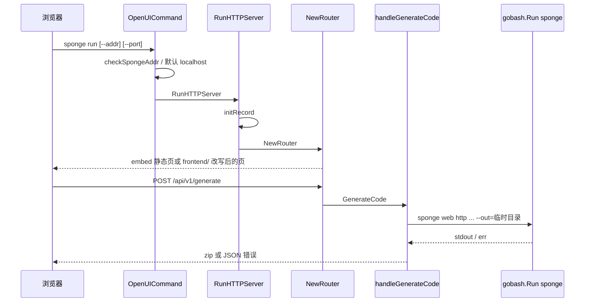
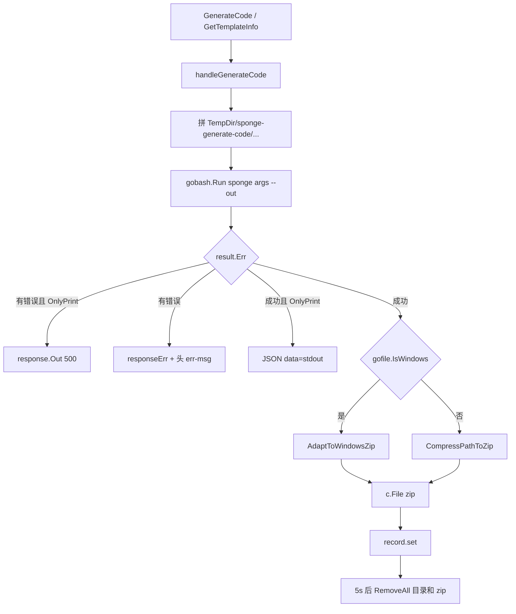
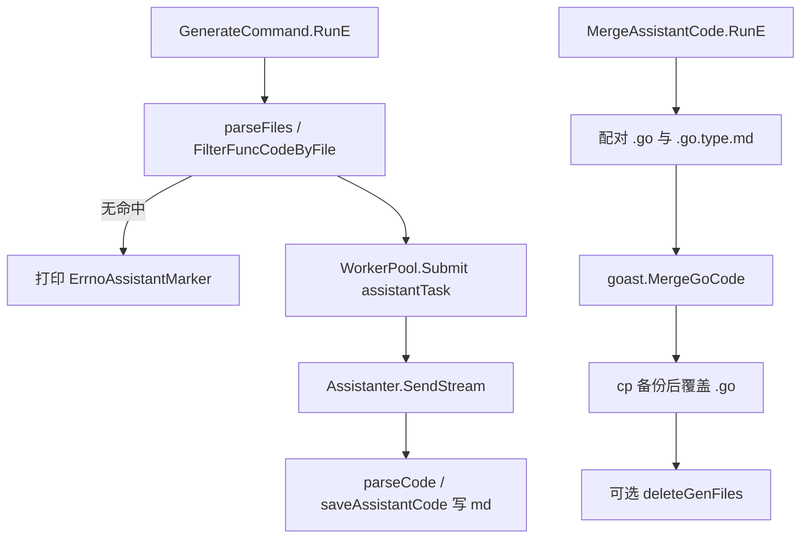
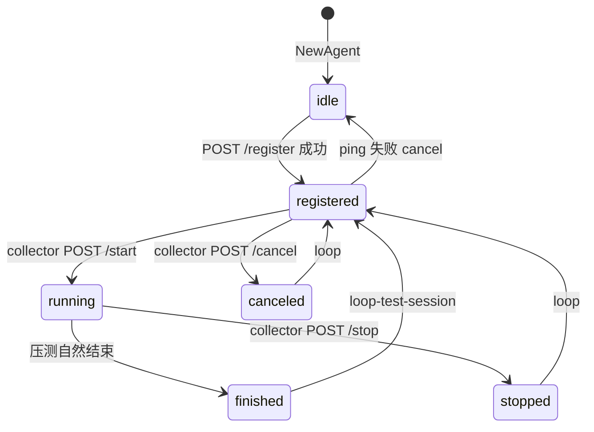

# UI、Assistant、自定义模板与性能测试

> 状态：待复核生成稿
> 生成日期：2026-08-16
> 基准提交：`23807238c62e0f3b3e2d9a341bbef50547d3f5ec`
> 工作区：dirty
> 源码范围：`cmd/sponge/commands/run.go`、`cmd/sponge/server/`、`cmd/sponge/commands/assistant.go`、`cmd/sponge/commands/assistant/`、`cmd/sponge/commands/template.go`、`cmd/sponge/commands/template/`、`cmd/sponge/commands/graph.go`、`cmd/sponge/commands/perftest.go`、`cmd/sponge/commands/perftest/`、`cmd/perftest/`
> 生成方式：源码、测试、配置与部署资产静态分析

本篇是第四层文档。第一层骨架见 [01-简单框架-系统骨架.md](01-简单框架-系统骨架.md)，第二层 UI 如何接到 `sponge web http` 见 [02-简单例子-全路径走读.md](02-简单例子-全路径走读.md)，CLI 命令树与 `generate.Init` 见 [04-CLI入口命令树与生命周期.md](04-CLI入口命令树与生命周期.md)，生成器与 `replacer` 见 [05-代码生成器与模板写入.md](05-代码生成器与模板写入.md)。`merge` / `patch` 命令属于 [07-Protoc插件与增量合并.md](07-Protoc插件与增量合并.md)，本篇只在命令树交叉处点到，不展开其子命令。

## 快速摘要

### 架构总览（模块与依赖）

本篇覆盖 **Sponge 工具进程里、代码生成主链路之外的四块能力**：本地 UI、AI 助手、自定义模板、性能测试。它们共用同一个 CLI 进程入口 `cmd/sponge/main.go`，但职责互不替代：

| 模块 | 入口符号 | 职责 | 依赖方向 |
|---|---|---|---|
| UI 引擎 | `commands.OpenUICommand` → `server.RunHTTPServer` | 嵌入 Vue 静态页，把浏览器表单转成 `sponge ...` 子进程 | `pkg/gobash`、`pkg/sgorm`、`pkg/mgo`、`pkg/gin` |
| AI 助手 | `commands.AssistantCommand` | 扫描 `panic("implement me")`、调 LLM、把 `.go.<type>.md` 合并回源文件 | `pkg/aicli`、`pkg/goast`、`assistant.WorkerPool` |
| 自定义模板 | `commands.TemplateCommand` | 用用户自己的模板目录 + SQL/Protobuf/JSON 字段生成文件 | `pkg/sql2code`、`pkg/replacer.SaveTemplateFiles`、`protoc-gen-json-field` |
| 架构图 | `commands.GenGraphCommand` | 检查并转发到外部命令 `spograph` | `pkg/gobash.Exec` |
| 压测 | `commands.PerftestCommand` / `cmd/perftest.main` | HTTP/1.1、HTTP/2、HTTP/3、WebSocket、gRPC 脚手架、分布式 collector/agent | `net/http`、`quic-go`、`gorilla/websocket`、Prometheus Pushgateway |

依赖方向固定为：UI Handler → `gobash.Run("sponge", args...)` → 对应 Cobra 子命令。UI **不实现** 生成算法、不实现 LLM、不实现压测循环；它只拼命令、收 stdout、打 zip 或回 JSON。独立二进制 `cmd/perftest` 复用同一套 `perftest/*` 包，但 **不调用** `generate.Init`，因此可以在没有 `~/.sponge` 的环境里跑压测。

### 核心调用序列（逐步逻辑）

以 UI 点「生成 HTTP 服务」再下载 zip 为主路径（与 [02](02-简单例子-全路径走读.md) 第 6 步衔接）：

1. `cmd/sponge/main.go:main` 调用 `generate.Init()`，再 `commands.NewRootCMD().Execute()`。
2. `OpenUICommand.RunE` 校验 `--addr`，打印版本，后台 `open(spongeAddr)` 打开浏览器，阻塞在 `server.RunHTTPServer`。
3. `RunHTTPServer` 调用 `initRecord()` 读 `~/.sponge_record/data.json`，再 `NewRouter` 注册 `/api/v1/*`。
4. 浏览器 `POST /api/v1/generate`，body 为 `GenerateCodeForm{Arg, Path}`。
5. `GenerateCode` → `handleGenerateCode`：拼临时 `--out`，`gobash.Run(ctx, "sponge", args...)`，超时 2 分钟。
6. 子进程走进 [05](05-代码生成器与模板写入.md) 的 `HTTPCommand.RunE`（或其它生成器），把文件写到临时目录。
7. 成功则 `CompressPathToZip` / `AdaptToWindowsZip`，`c.File(zipFile)` 下载；`record.set` 记下参数；5 秒后后台删临时目录和 zip。

AI 生成路径：`POST /api/v1/assistant` → `gobash.Run("sponge", "assistant", "generate", ...)` → `assistant.GenerateCommand.RunE` → `goast.FilterFuncCodeByFile` → `WorkerPool` → `aicli.Assistanter.SendStream` → 写 `*.go.<type>.md`。合并走 `assistant merge`，不是 UI 自己做 AST。

压测路径：`POST /api/v1/performanceTest` → `gobash.Run("sponge", "perftest", "http", ...)`（超时 24 小时）→ `PerfTestHTTP.Run` → worker 循环 `requestOnce` → `statsCollector.printReport`。停止走 `POST /api/v1/performanceTest/stop` → `process.Kill(pid)`。

### 易错点与边界条件

- `generate.Init` 只对 `sponge`、`sponge -h`、`sponge init` 放行；**`sponge run` / `assistant` / `template` / `perftest` / `graph` 都要求已执行 `sponge init`**。独立入口 `perftest` 无此限制。
- UI 生成代码时 `Arg` 按空格 `Split`，带空格的 JSON body 会被拆坏；压测 POST body 更稳妥的方式是 CLI `--body-file`。
- `handleGenerateCode` 成功路径返回的是 zip 文件流，不是 `{code:0,data:...}`；失败才走 JSON，并把原文放进响应头 `err-msg`。
- `GetTemplateInfo` 与 `GenerateCode` 共用 `handleGenerateCode`。只有 `parseCommandArgs` 看到 `--only-print` 时才返回文本；否则也会打 zip。
- Assistant 只处理「函数体含 `panic("implement me")` **且** 有函数注释」的 Go 函数；无命中时打印 `ErrnoAssistantMarker` 并成功退出。
- `GenerateCommand` 的 `--enable-context` 被解析但未使用，实际 `enableContext` 被写死为 `true`。
- 压测 HTTP 非 2xx 记为失败；gRPC 子命令 **并不发 RPC 负载**，只生成 `sponge micro rpc-pb` 工程并 `make proto`。
- 命令记录 `~/.sponge_record/data.json` 会写入 `--db-dsn` 和 `--api-key` 明文。文档示例一律脱敏；生产使用需自行视为密钥存储。
- `cmd/sponge/` 下 **没有** `*_test.go`。本篇测试结论来自阅读 `pkg/goast`、`pkg/aicli`、`pkg/sql2code`、`pkg/process` 的测试，**未运行测试套件，不宣称通过**。

---

## 目录

1. [为什么这样设计（Why）](#为什么这样设计why)
2. [它是什么（What）](#它是什么what)
3. [代码如何实现（How）](#代码如何实现how)
   - [3.1 进程入口与命令挂载](#31-进程入口与命令挂载)
   - [3.2 `sponge run` 启动、静态嵌入、地址改写](#32-sponge-run-启动静态嵌入地址改写)
   - [3.3 HTTP API 全量](#33-http-api-全量)
   - [3.4 `handleGenerateCode`：CLI、zip、清理、Windows](#34-handlegeneratecodeclizip清理windows)
   - [3.5 命令记录 `record`](#35-命令记录-record)
   - [3.6 Assistant 子命令全量](#36-assistant-子命令全量)
   - [3.7 自定义模板子命令全量](#37-自定义模板子命令全量)
   - [3.8 `sponge graph`](#38-sponge-graph)
   - [3.9 Perftest 子命令全量](#39-perftest-子命令全量)
   - [3.10 独立入口 `cmd/perftest`](#310-独立入口-cmdperftest)
4. [调用关系表](#调用关系表)
5. [测试缺口](#测试缺口)
6. [阅读源码建议顺序](#阅读源码建议顺序)
7. [重新实现检查清单](#重新实现检查清单)

---

## 为什么这样设计（Why）

Sponge 的核心价值是 **Definition is Code**：SQL / Protobuf / YAML 进，可运行工程出。这条主链已经由 CLI 走通（见 [02](02-简单例子-全路径走读.md)）。本篇这四块是为了补三类真实摩擦：

1. **不会记命令的人需要表单。** 生成器参数多（DSN、表名、模块名、是否单体仓库）。UI 把表单序列化成 `Arg` 字符串，再 exec 同一条 CLI，避免维护两套生成器。
2. **生成出来的 handler/service 仍是 `panic("implement me")`。** Assistant 用函数注释当 prompt，让 LLM 补业务逻辑，再用 `pkg/goast.MergeGoCode` 合回，避免手工复制代码块。
3. **官方模板不够时要带自己的模板；生成完要压测。** `template` 把 `sql2code` 的表信息（或 protobuf JSON）喂给 `text/template`；`perftest` 提供可嵌入二进制的压测器，并支持 collector/agent 分布式。

设计约束可以从代码直接读出来：

- UI 必须能改前端请求地址（局域网 IP / HTTPS 域名），但静态资源默认是 `embed.FS` 只读。所以非默认地址会把 embed 复制到本地 `frontend/`，改写 `appConfig.js`。
- 生成结果要给浏览器下载，不能把临时目录永久留在 `/tmp`。所以成功后立刻 zip，5 秒后循环删除。
- LLM 调用慢且要并发多个文件，所以 assistant 自带 `WorkerPool`，而不是在 HTTP handler 里直接调模型。
- 压测要能从 UI 点停止，所以 `gobash.Run` 第一行 stdout 带 `[pid]=`，handler 用 `sync.Map` 记住 pid，停止时 `process.Kill`。

必须保持的行为契约是「UI 只是 CLI 外壳」。可以替换的是前端实现、zip 库、LLM 供应商、压测进度条画法。

---

## 它是什么（What）

### 运行时有几块

```text
sponge 工具进程（cmd/sponge）
├── sponge run          本地 UI，默认 :24631
│   └── 子进程 sponge <web|micro|template|assistant|perftest|...>
├── sponge assistant    generate / merge / chat / clean
├── sponge template     sql / protobuf / field
├── sponge graph        转发 spograph
└── sponge perftest     http / http2 / http3 / websocket / grpc / collector / agent

独立进程（cmd/perftest）
└── perftest            同上 7 个子命令，不依赖 ~/.sponge
```

### 公开协议一览

UI 路由全部在 `server.NewRouter`，前缀 `/api/v1`：

| 方法 | 路径 | Handler | 成功输出 |
|---|---|---|---|
| POST | `/generate` | `GenerateCode` | zip 文件流 |
| POST | `/getTemplateInfo` | `GetTemplateInfo` | JSON `data` 为打印文本（需 `--only-print`） |
| POST | `/assistant` | `HandleAssistant` | JSON `data` 为 CLI stdout |
| POST | `/performanceTest` | `HandlePerformanceTest` | JSON `data` 为报告文本 |
| POST | `/performanceTest/stop` | `HandleStopPerformanceTest` | JSON 成功空 data |
| POST | `/uploadFiles` | `UploadFiles` | JSON `data` 为保存路径 |
| POST | `/listTables` | `ListTables` | JSON `[{label,value}]` |
| GET | `/listDrivers` | `ListDbDrivers` | JSON 驱动列表 |
| GET | `/listLLM` | `ListLLM` | JSON 模型下拉选项 |
| GET | `/record/:path` | `GetRecord` | JSON 上次表单参数 |

JSON 成功体由 `pkg/gin/response.Success` 写成 `code=0, msg=ok`。生成失败走 `responseErr`：HTTP 状态随 `errcode` 变化，并设置响应头 `err-msg`。

### 静态资源

- UI：`//go:embed static` → `server/static/`（`index.html`、`appConfig.js`、打包 JS）。`appConfig.spongeServiceAddr` 默认 `http://localhost:24631/api/v1`。
- 压测 collector UI：`//go:embed perftest` → `commands/perftest/http/perftest/`。`appConfig.perftestServiceAddr` 默认 `http://localhost:8888`。

### 术语

| 术语 | 含义 |
|---|---|
| `Arg` | 前端拼好的 CLI 参数字符串，例如 `web http --module-name=user ...`，**不含** `sponge` 前缀 |
| `Path` | 前端页面路径，用作 `record` 的 commandType，例如生成页标识 |
| `OnlyPrint` | `--only-print`：模板命令只打印字段，不写文件；UI 据此决定返回文本还是 zip |
| assistant 产物 | `foo.go.deepseek.md` / `foo.go.chatgpt.md` / `foo.go.gemini.md` |
| collector | 分布式压测主节点，默认 `:8888` |
| agent | 分布式压测工作节点，默认回调 `:6601` |

---

## 代码如何实现（How）

### 3.1 进程入口与命令挂载

`cmd/sponge/main.go:main`：

1. `generate.Init()`：若 `~/.sponge` 不存在且当前命令不是 `sponge` / `sponge -h` / `sponge init`，打印 `not yet initialized` 并 **直接 return**（进程退出码 0，不是 `os.Exit(1)`）。
2. `commands.NewRootCMD().Execute()`。

`commands/root.go:NewRootCMD` 按顺序挂载：`init`、`upgrade`、`plugins`、`web`、`micro`、`config`、**`run`**、`merge`、`patch`、**`graph`**、**`template`**、**`assistant`**、**`perftest`**。

版本字符串 `getVersion()` 读 `{home}/.sponge/.github/version`；文件不存在则显示 `unknown, execute command "sponge init" to get version`。`OpenUICommand` 启动时会把它打印到终端。

独立压测入口 `cmd/perftest/main.go:main` **不** 调 `generate.Init`，只 `perftestCommand().Execute()`，失败 `os.Exit(1)`。

### 3.2 `sponge run` 启动、静态嵌入、地址改写

**入口符号：** `commands.OpenUICommand`（`Use: run`）

**输入：**

| Flag | 默认 | 含义 |
|---|---|---|
| `--port` / `-p` | `24631` | HTTP 监听端口 |
| `--addr` / `-a` | 空 → `http://localhost:{port}` | 前端页面请求后端的绝对地址 |
| `--log` / `-l` | `false` | 是否挂 `middleware.Logging` |

**调用链：**

1. `RunE`：若 `spongeAddr==""`，设为 `http://localhost:{port}`；否则 `checkSpongeAddr`。
2. 打印 `Code generation engine service running {version}`。
3. `go open(spongeAddr)`：Windows `cmd /c start`，Darwin `open`，其它 `xdg-open`。失败被 `_ =` 吞掉。
4. `server.RunHTTPServer(spongeAddr, port, isLog)` **阻塞**。

`checkSpongeAddr`：

- `url.Parse` 失败，或 scheme 不是 `http`/`https`，或 Host 为空 → 固定错误文案（示例 `http://192.168.1.10:24631`）。
- 若 Hostname 能被 `net.ParseIP` 解析成 IP，则 URL 端口必须等于 `--port`；域名不检查端口一致性。

**`RunHTTPServer`：**

1. `initRecord()`。
2. `NewRouter(spongeAddr, isLog)`。
3. `http.Server{Addr: ":{port}", MaxHeaderBytes: 1<<20}`，`ListenAndServe`。非 `ErrServerClosed` 则 `panic`。没有优雅关闭。

**`NewRouter`：**

- `gin.ReleaseMode` + `gin.Recovery()` + `middleware.Cors()`；`--log` 时再加 Logging。
- `NoRoute` → `handlerfunc.BrowserRefreshFS(staticFS, "static/index.html")`，解决 Vue history 刷新 404。
- 静态：`checkIsUseEmbedFS("frontend", spongeAddr)` 为真则 `http.FileServer(http.FS(staticFS))`；为假则从本地 `frontend/static` + `c.File`。
- 注册 10 条 `/api/v1` 路由（见上表）。

**何时不用 embed：** `spongeAddr != "http://localhost:24631"`。此时 `saveFSToLocal`：

1. `os.RemoveAll(frontend/static)`，睡 10ms。
2. `fs.WalkDir(staticFS, ".")` 把 embed 写到 `frontend/`。
3. 遇到路径 `static/appConfig.js` 时，把字节 `http://localhost:24631` **全部替换** 为 `spongeAddr`。
4. 失败 `panic`。

副作用：工作目录下出现可写的 `frontend/`。再次用默认地址启动时不会自动删掉这份本地副本，但会走 embed 分支，本地文件不影响默认模式。



### 3.3 HTTP API 全量

下列每个 API 的 JSON 外壳相同：成功 `response.Success` → HTTP 200、`code=0`；参数错误多数走 `errcode.InvalidParams`（`Error` 方法仍 HTTP 200 + 业务码，或 `responseErr`/`Out` 映射到 4xx/5xx）。`GenerateCode` 成功例外：直接 `c.File`。

公共输入结构：

```text
GenerateCodeForm { Arg string `binding:"required"`; Path string `binding:"required"` }
dbInfoForm      { Dsn string `binding:"required"`; DbDriver string }
kv              { Label string; Value string }
```

`Arg` / `Path` 对 listDrivers、listLLM、listTables、uploadFiles 不适用。

---

#### POST `/api/v1/generate` — `GenerateCode`

**入口：** `server.GenerateCode`

**输入：** JSON `GenerateCodeForm`。`Arg` 例（DSN 已脱敏）：

```text
web http --module-name=user --server-name=user --project-name=edusys --db-driver=mysql --db-dsn=root:******@(127.0.0.1:3306)/account --db-table=user
```

`Path` 是前端路由标识，只用于 record key，不参与生成。

**调用链：** `ShouldBindJSON` → 设 `Access-Control-Expose-Headers: content-disposition, err-msg` → `handleGenerateCode(c, form.Path, form.Arg)`。

**输出：** 成功为 `Content-Type: application/zip`，`Content-Disposition` 为 zip 文件名，body 为 zip。失败 JSON + 头 `err-msg`。

**错误：** bind 失败 `InvalidParams`；子进程失败 `InternalServerError`；zip 失败或文件不存在同上。

**副作用：** 临时目录、zip、record 写入、5 秒后删除；见 3.4。

---

#### POST `/api/v1/getTemplateInfo` — `GetTemplateInfo`

**入口：** `server.GetTemplateInfo`

**输入：** 同样 `GenerateCodeForm`。前端约定 `Arg` 里带 `--only-print`，例如：

```text
template sql --db-driver=mysql --db-dsn=root:******@(127.0.0.1:3306)/account --db-table=user --tpl-dir=/path/to/tpl --only-print
```

**调用链：** bind → **同一个** `handleGenerateCode`。

**输出：** 若 `parseCommandArgs` 得到 `OnlyPrint=true` 且子进程成功，`response.Success(c, resultInfo)`，`data` 为 CLI stdout（去掉第一行命令）。若忘记 `--only-print`，行为与 generate 相同：打 zip 并下载。

**错误：** bind 失败；子进程失败时 `OnlyPrint` 走 `response.Out`（HTTP 500），非 OnlyPrint 走 `responseErr`（额外写 `err-msg` 头）。这是两条失败路径的差异。

---

#### POST `/api/v1/assistant` — `HandleAssistant`

**入口：** `server.HandleAssistant`

**输入：** `GenerateCodeForm`。`Arg` 例（api-key 已脱敏）：

```text
assistant generate --type=deepseek --api-key=sk-****** --dir=/path/to/project
```

也可是 `assistant merge --type=deepseek --dir=... --is-clean=true`。

**调用链：**

1. bind → `parseCommandArgs`（为 record 准备，不改变 args）。
2. `context.WithTimeout(60*time.Minute)`（cancel 被丢弃，依赖超时自动取消）。
3. `gobash.Run(ctx, "sponge", args...)`。
4. 读 stdout：跳过第 1 行（命令+pid）；跳过含 `Waiting for assistant responses` 的行；其余拼进 `resultInfo`。
5. `result.Err != nil` → `responseErr` InternalServerError。
6. `recordObj().set(ClientIP, form.Path, params)`。
7. `response.Success(c, resultInfo)`。

**输出：** JSON `data` 为助手 CLI 的可见 stdout（成功/失败计数、输出文件列表）。

**错误：** bind；`exec.LookPath("sponge")` 失败；子进程非 0；60 分钟超时（`ctx.Err` 进入 `result.Err`）。

**副作用：** 子进程在用户项目里写 `*.go.<type>.md` 或改写 `.go`（merge）；record 可能含 `apiKey` 明文。

---

#### POST `/api/v1/performanceTest` — `HandlePerformanceTest`

**入口：** `server.HandlePerformanceTest`

**输入：** `GenerateCodeForm`。`Arg` 例：

```text
perftest http --url=http://127.0.0.1:8080/api/v1/user/1 --total=5000 --worker=8
```

**调用链：**

1. bind → `parseCommandArgs`。
2. 若 `len(args)>2`，`params.Protocol = args[1]`（即 `http` / `http2` / `http3` / `websocket` / `grpc` / `collector` / `agent`）。
3. `TotalRequests>0` → `TestType=requests`；否则若 `Duration!=""` → `TestType=duration`。
4. `JobName` 且 `PushURL` 非空 → `PushType=prometheus`，把 PushURL 挪到 `PrometheusURL`；仅 PushURL → `PushType=custom`。
5. 超时 **24 小时** 的 `gobash.Run`。
6. 第一行 stdout：`gobash.ParsePid`；若 pid>0，`getCommand(args)` 作 key，把 `result.Pid` 存进 `processMap`。
7. 跳过 `Waiting for assistant responses`（压测路径上通常不会出现）。
8. 结束后 `record.set`；若 `result.Pid>0` 则 `removeProcess`。
9. `splitString(resultInfo, "Performance Test Report ==========")` 取报告段，插入 Command / End Time，`response.Success`。

**`getCommand`：** `len(args)<4` 返回空串。否则 `["sponge", args[0], args[1]]` 加上所有含 `--url` / `--method` 的参数，**排序后**用 `&` 拼接。停止压测必须用同一套 url+method 才能命中 pid。

**输出：** JSON `data` 为改写后的报告文本。找不到分隔符时整份 stdout 原样返回。

**错误：** bind；子进程失败（含 Ctrl+C 被 Kill 后的非 0）；24 小时超时。

**副作用：** 对目标 URL 发真实负载；可能 push Prometheus / collector；record 写入。

---

#### POST `/api/v1/performanceTest/stop` — `HandleStopPerformanceTest`

**入口：** `server.HandleStopPerformanceTest`

**输入：** 同样 `GenerateCodeForm`，`Arg` 必须能让 `getCommand` 算出与启动时相同的 key。

**调用链：** bind → `getCommand` → `getPid` → 若 pid>0 则 `process.Kill(pid)` → `removeProcess` → `response.Success(c)`（无 data）。

**`process.Kill`：** 先 Unix `SIGTERM` / Windows 优雅退出，最多约 5 秒轮询；再 `SIGKILL` / 强制结束。pid&lt;1 直接报错。

**输出：** JSON 成功。pid 不存在或已结束时 **仍成功**（`getPid` 失败被 `_` 忽略）。

**错误：** bind；Kill 失败（权限/进程不存在且强制杀也失败）。

---

#### POST `/api/v1/uploadFiles` — `UploadFiles`

**入口：** `server.UploadFiles`

**输入：** `multipart/form-data` 文件字段（字段名不限）。历史上校验 `.proto`/yaml 与 `spongeArg` 的代码已注释掉，**当前接受任意扩展名**。

**调用链：**

1. `c.MultipartForm()`；无文件 → InvalidParams `upload file is empty`。
2. `getSavePath()`：`{home}/.sponge_record/s_{10位小写数字字母}`，`MkdirAll 0766`。
3. 每个文件 `filepath.Base` 后 `c.SaveUploadedFile`；同路径跳过。
4. 若最后一个文件扩展名是 `.proto`，返回路径改成 `savePath/*.proto`（给后续 `--protobuf-file` 通配）。

**输出：** JSON `data` 为最后一个保存路径，或 `*.proto` 通配串。

**错误：** multipart 解析失败；SaveUploadedFile 失败 InternalServerError。

**副作用：** 磁盘写入。`handleGenerateCode` 清理时，若参数里的 protobuf/yaml 路径包含 `sponge_record`，会 `RemoveAll` 该文件所在目录。

---

#### POST `/api/v1/listTables` — `ListTables`

**入口：** `server.ListTables`

**输入：** `dbInfoForm`。`DbDriver` 大小写不敏感。DSN 示例：`root:******@(127.0.0.1:3306)/account`。

**调用链：** bind → switch：

| Driver | 函数 | 实际查询 |
|---|---|---|
| mysql / tidb | `getMysqlTables` | `utils.AdaptiveMysqlDsn` → `mysql.Init` → `show tables` → `mysql.Close` |
| postgresql | `getPostgresqlTables` | `AdaptivePostgresqlDsn` → `postgresql.Init` → 解析 DSN `search_path=` 或 `SELECT schema_name FROM information_schema.schemata` → 每 schema `information_schema.tables`，跳过 `information_schema`/`pg_catalog`/`pg_toast` |
| sqlite | `getSqliteTables` | 本地文件必须存在，否则报 `sqlite db file %s not found`；`sqlite_master type=table`，过滤 `sqlite_sequence` |
| mongodb | `getMongodbTables` | `AdaptiveMongodbDsn` → `mgo.Init` → `ListCollectionNames`；空则报 `mongodb db {path} has no tables`（path 来自 URL，不含密码） |
| 空 | — | InvalidParams `database type cannot be empty` |
| 其它 | — | InvalidParams `unsupported database type` |

PostgreSQL 关闭连接调用的是 **`mysql.Close(db)`**（源码注释 nolint）。这是共享 `*sgorm.DB` 的关闭函数，不是串库；行为上能关，但名字易误导。

**输出：** `[]kv` 表名。PostgreSQL 当前只返回 `table_name`，**不含 schema 前缀**；多 schema 下可能撞名。

**错误：** 连库/查询失败 → InternalServerError，消息为驱动错误原文（可能含主机信息，一般不含密码）。

---

#### GET `/api/v1/listDrivers` — `ListDbDrivers`

**入口：** `server.ListDbDrivers`

**输入：** 无。

**调用链：** 写死切片 `mysql`、`mongodb`、`postgresql`、`tidb`、`sqlite`（常量来自 `sgorm`/`mgo`），转 `[]kv`。

**输出：** JSON 列表。无错误路径。

---

#### GET `/api/v1/listLLM` — `ListLLM`

**入口：** `server.ListLLM`

**输入：** 无。

**输出：**

```text
llmTypeOptions: deepseek / chatgpt / gemini
allLLMOptions:
  deepseek: deepseek-chat, deepseek-reasoner
  chatgpt: gpt-5, gpt-5-thinking, gpt-4.1, gpt-4.1-mini, gpt-4o, gpt-4o-mini
  gemini: gemini-2.5-flash, gemini-2.5-pro, gemini-2.5-flash-lite, gemini-2.0-flash, gemini-2.0-pro
```

这是 **UI 下拉白名单**，与 CLI 默认模型不完全相同：CLI 默认 chatgpt=`gpt-4o`、deepseek=`deepseek-chat`、gemini=`gemini-2.5-flash`（`pkg/aicli` 常量）。UI 列出的 `gpt-5` 能否调用取决于运行时 API，本仓库无校验。

无错误路径。

---

#### GET `/api/v1/record/:path` — `GetRecord`

**入口：** `server.GetRecord`

**输入：** 路径参数 `path`；客户端 IP 来自 `c.ClientIP()`。`::1` 在 `getKey` 里归一成 `127.0.0.1`。

**调用链：** path 空 → `response.Out` InvalidParams；`record.get(ip, path)`；nil 则返回 `&parameters{Embed: true}`（不是 404）。

**输出：** JSON `data` 为 `parameters`。`ProtobufFile`/`YamlFile` 的 json tag 是 `-`，**不会**回传给前端；`Dsn`、`APIKey` **会**回传。

**错误：** 仅 path 为空。文件损坏时 `initRecord` 的 Unmarshal 失败被忽略，表现为空记录。

### 3.4 `handleGenerateCode`：CLI、zip、清理、Windows

**入口：** `server.handleGenerateCode(c, outPath, arg)`

这是 UI 生成与模板预览的唯一实现。

#### 临时目录名

1. `out := "-" + 当前时分秒(150405)`。
2. `outPath` 长度&gt;1：若以 `/` 开头则去掉首字符再拼接，否则直接拼。这把前端 path 嵌进目录名。
3. `parseCommandArgs(args)`：有 `ServerName` 则前缀 `serverName-`；否则有 `ModuleName` 用模块名；`SuitedMonoRepo` 再追加 `-mono-repo`。
4. 最终路径：`os.TempDir() + 分隔符 + sponge-generate-code + 分隔符 + out`。
5. `args = append(args, "--out="+out)`。前端 Arg **不应**自带 `--out`，否则 CLI 会收到两个 `--out`（Cobra 通常以后者为准，属未测试约定）。

#### 跑 CLI

```text
ctx, _ := context.WithTimeout(Background, 2*time.Minute)  // cancel 丢弃
result := gobash.Run(ctx, "sponge", args...)
```

`pkg/gobash.Run`：

1. 新 goroutine：`exec.LookPath("sponge")`，`exec.CommandContext`。
2. `Start` 后第一行 stdout：`strings.Join(cmd.Args," ") + " [pid]="+pid`。
3. 逐行转发 stdout；结束后读完 stderr，`Wait`。非 0 时优先用 stderr 文本作为 `result.Err`。
4. ctx 取消会杀掉子进程。

Handler 消费 stdout：`count==1` 的第一行丢掉；其余拼接为 `resultInfo`。

#### 成功后的两种出口

- `params.OnlyPrint`：`response.Success(resultInfo)`，**不 zip、不删目录约定上目录可能为空或仅有打印**。
- 否则：Windows → `AdaptToWindowsZip(out, out+".zip")`；其它 → `CompressPathToZip`。文件不存在则报错。然后：
  - `Content-Type: application/zip`
  - `Content-Disposition` = `gofile.GetFilename(zipFile)`（只有文件名，无 `attachment;` 前缀）
  - `c.File(zipFile)`
  - `record.set(ClientIP, outPath, params)`

#### 两种 zip

`CompressPathToZip`（非 Windows）：`os.Create` zip → 打开 `outPath` → 递归 `compress`。目录条目名是 `prefix/info.Name()`，文件用 `io.Copy`。目录的 `*os.File` **没有 Close**（子文件有 Close）。zip 内路径带前导逻辑由 prefix 累积，根目录名会出现在压缩包内。

`AdaptToWindowsZip`：`filepath.Walk`，`filepath.Rel(baseDir, path)` 后 `ToSlash`，目录名补 `/`。这是为了避免 Windows 反斜杠进入 zip 条目，导致其它系统解压失败。

#### 后台清理

`go func` + 10 分钟超时：

```text
每 5 秒：
  RemoveAll(out)
  RemoveAll(zipFile)
  若 ProtobufFile 路径包含 sponge_record → RemoveAll(该文件目录)
  若 YamlFile 同理
  两次 RemoveAll 都成功才 return
  失败 continue 重试，直到 10 分钟
```

下载尚未结束时 5 秒删除可能让大 zip 下载中断。属实现选择，无测试覆盖。`c.File` 是同步读文件，通常在 handler 返回前已读完；goroutine 在 `c.File` **之后**启动，因此正常大小 zip 风险较低。推断：超大生成结果叠加慢磁盘时仍可能竞态。



### 3.5 命令记录 `record`

**文件：** `cmd/sponge/server/record.go`

**对象：** 包级 `rcd *record`，`initRecord` 在 UI 启动时创建。`HostRecord map[string]*parameters`，key = `ip + "-" + commandType`。

**持久化路径：** `{home}/.sponge_record/data.json`（Windows 写文件时把 `/` 换成 `\`）。

**`set`：** `utils.SafeRunWithTimeout(5s)` 内加锁、赋值、`json.Marshal` 整张 map、`CreateDir`、`WriteFile 0666`。超时只放弃这次写，不回滚内存。Marshal/写失败打 `logger.Warn`，不返回给 HTTP。

**`parseCommandArgs`：** 按 `=` 拆每个 token。布尔 flag 支持 `--embed` / `--embed=true` 两种。`--server-name` 会把 `-` 换成 `_`。`--duration` 去掉后缀 `s` 后当整数秒存字符串。`--header` 可出现多次。`--api-key`、`--db-dsn` 原样保存。

**敏感字段：** `Dsn`、`APIKey` 在 JSON 中明文。本文件示例不引用真实值。

### 3.6 Assistant 子命令全量

**挂载：** `commands.AssistantCommand` → `chat` / `generate` / `merge` / `clean`。

LLM 客户端工厂：`assistantParams.newClient` → 接口 `aicli.Assistanter`（`Send` / `SendStream` / `RefreshContext` / `ListModelNames`）。

| Type | 实现 | 默认模型 | 选项 |
|---|---|---|---|
| `chatgpt` | `chatgpt.NewClient` | `gpt-4o` | model、context、role、maxToken、temperature |
| `deepseek` | `deepseek.NewClient`（复用 chatgpt option） | `deepseek-chat` | 同上 |
| `gemini` | `gemini.NewClient` | `gemini-2.5-flash` | 仅 model、context（无 role/maxToken/temperature） |
| 其它 | 返回 `unsupported assistant type` | | |

`enableContext=true` 时加 `WithEnableContext()`。Chat 与 Generate 都把该字段设为 true。

---

#### `sponge assistant generate` — `assistant.GenerateCommand`

**输入 flag：**

| Flag | 必填 | 默认 | 作用 |
|---|---|---|---|
| `--type` / `-t` | 是 | | chatgpt / deepseek / gemini |
| `--api-key` / `-k` | 是 | | 传给供应商，文档用 `sk-******` |
| `--model` / `-m` | 否 | 上表默认 | 空且 type 非法 → `invalid assistant type` |
| `--role` / `-r` | 否 | 中文注释则 `GopherRoleDescCN` 否则 EN | 系统角色 |
| `--max-token` / `-s` | 否 | 0 表示不设 | |
| `--temperature` / `-e` | 否 | 0 表示不设 | |
| `--enable-context` / `-c` | 否 | false | **解析后未读**，代码写死 true |
| `--only-print-prompt` / `-p` | 否 | false | 不调 LLM，打印 prompt |
| `--max-assistant-num` / `-n` | 否 | 10 | 并发 worker 上限，且不超过文件数 |
| `--dir` / `-d` | 与 file 至少一 | | 项目目录 |
| `--file` / `-f` | 可重复 | | 指定 Go 文件 |

**调用链：**

1. `checkDirAndFile`：都空报错；`os.Stat` 不存在分别报 directory/file does not exist。
2. `parseFiles`：指定文件 + 目录下所有 `.go`（跳过 `_test.go`、`.pb.go`、`.validate.go`）。每个文件 `extractFuncCodeBlock` → `goast.FilterFuncCodeByFile`。解析失败或无匹配时 **返回 nil，静默跳过**。
3. `fileCodeMap` 为空 → 打印 `ErrnoAssistantMarker`（说明需要函数 + 注释 + `panic("implement me")`），**返回 nil**（CLI 成功）。
4. `initPromptTemplate` 解析四份 `text/template`。
5. `NewWorkerPool(ctx, maxAssistantNum, fileCount)` → `Start`（N 个 `worker` goroutine）。
6. 每个文件：`getPrompt` → `asst.newClient()` → 构造 `assistantTask` → `Submit(timeout 20ms)`。队列满返回 `ErrJobQueueFull`。
7. 另 goroutine `Wait()`：关闭 job 通道、等 worker、关闭 result 通道。
8. 主循环读 `Results()`：only-print 则打印 File/Prompt；失败累计并打印 ERROR；成功收集输出路径。
9. `Stop()` cancel ctx；打印 Jobs Summary 与 Output Files。**部分失败仍返回 nil。**

**`getPrompt` 分支：**

- 文件所在最后一层目录是 `handler`/`service`/`biz`/`logic`，且再上一层是 `internal`，且源码含 `// fill in the business logic code here` 或 `// 依赖dao`：走 **双文件 prompt**（目标文件 + dao 文件），分隔符 `/**code-delimiter**/`；再追加 model 文件代码（读得到才加）。`dependentFileFullPath` 指向对应 dao 文件。
- 否则走 default 单文件 prompt。
- 中英文：任一函数注释含汉字则中文模板。

**`assistantTask.Execute`：**

1. `client.SendStream(ctx, prompt)` 拼完整回复。
2. `parseCode` 抽出 markdown ` ```go ` 块或按 delimiter 拆。
3. `saveAssistantCode` 写 `{file}.{type}.md`，权限 0666；目录不存在则 `MkdirAll 0666`。
4. 若有 dependentFile 且 codes&gt;1，再写 dao 对应 md。

**输出 / 副作用：** 每个命中文件旁边出现 markdown；终端进度。不修改原 `.go`。

**错误：** 目录/文件不存在；非法 type；workerSize≤0（默认 10 不会）；Submit 超时；`newClient` 失败（缺 key 等）会在提交阶段整批失败。单任务 LLM 错误只记 failedCount。

**测试交叉：** `pkg/goast/filter_test.go:TestFilterFuncCodeByFile` 用自身三个带注释+`panic("implement me")` 的 demo 函数，断言筛出 3 个名字。Assistant 命令本身无测试。

---

#### `sponge assistant merge` — `assistant.MergeAssistantCode`

**输入：** `--type` 必填；`--dir`；`--file` 可重复（可以是 `.go` 或 `.go.<type>.md`）；`--is-clean` 合并后删 md。

**调用链：**

1. `checkDirAndFile`。
2. `parseAssistantFiles`：指定文件用 `getGoAndMDFile`（go↔md 成对且都存在）；目录用后缀 `.go.{type}.md` 列表，反推 `{stem}.go` 存在才收录。
3. 空 map：打印 nothing to merge，成功返回。
4. 每个 pair：`mergeGoFile` 读源与 md → `extractGoCode` 抽 go 块 → `checkPackageName` 选项 → `goast.MergeGoCode`。
5. `getBackupDir` = `{TempDir}/sponge_merge_backup_code/{20060102T150405}`。每个源文件 `backupFile`：`cp` 到 backup 下相对路径。
6. `os.WriteFile` 覆盖源 `.go`。
7. `isClean` 则 `deleteGenFiles`。

**`checkPackageName`：** 默认 `WithCoverSameFunc()`（同名函数用生成代码覆盖）。若路径含 `/dao/` 且生成代码含 `package dao`，再 `WithIgnoreMergeFunc` 忽略 `Create`、`GetByID`（重复一次）、`UpdateByID`、`GetByColumns`、`CreateByTx`、`DeleteByTx`、`UpdateByTx`，避免覆盖官方 CRUD。

**输出：** 终端 Merged Files 列表与 backup 路径。

**错误：** 读文件失败；`MergeGoCode` 失败（包装 `merge A into B failed`）；写源文件失败。`cp` 失败被 `_` 忽略，backup 可能缺失。Windows 无 `cp` 时备份无效（推断）。

**测试交叉：** `pkg/goast/merge_test.go` 覆盖 `MergeGoCode`/`WithCoverSameFunc`/`WithIgnoreMergeFunc`，不覆盖 merge 命令的文件配对与 backup。

---

#### `sponge assistant chat` — `assistant.ChatCommand`

**输入：** `--type`、`--api-key` 必填；`--model`、`--role`、`--max-token`、`--temperature`。无 `--enable-context` flag，但 `assistantParams.enableContext=true`。

**调用链：** `newClient` → 循环 `stdin.ReadString`：

| 输入 | 行为 |
|---|---|
| `q` / `quit` / `exit` | 打印 Exited，break，返回 nil |
| `r` / `R` | `client.RefreshContext()`，新会话 |
| 其它非空 | `SendStream`，`WaitPrinter` 显示 `{Type}: `，首包到达后停转圈并打印流式内容 |
| EOF | 返回 nil |
| 读错误 | `reading input error` |
| `answer.Err` | `error : %v` 整个 chat 退出 |

**输出：** 仅终端。无文件副作用。不写 record（除非经 UI `HandleAssistant` 调起，但 chat 是交互式，UI 通常只调 generate/merge）。

**错误：** 非法 type；API 错误中断循环。

---

#### `sponge assistant clean` — `assistant.CleanUpAssistantCode`

**输入：** `--dir` **MarkFlagRequired**，默认 `"."`。Required 与默认同时存在时，Cobra 仍要求显式传 `--dir`（未传会失败）。

**调用链：** 对 `deepseek`、`gemini`、`chatgpt` 三种后缀分别 `gofile.ListFiles(dir, WithSuffix(".go."+type+".md"))` → `deleteGenFiles`。删除失败的文件跳过。

**输出：** 每种 type 若有删成功则打印列表。无文件则无输出，返回 nil。

**错误：** `ListFiles` 失败（目录不可读）。

---

#### Worker 池 — `assistant/woker.go`（文件名拼写为 woker）

| 符号 | 职责 |
|---|---|
| `Task.Execute(ctx)` | 接口，`assistantTask` 实现 |
| `NewWorkerPool(ctx, workerSize, jobQueueSize)` | workerSize≤0 报错；缓冲通道容量=文件数 |
| `Start` | 启动 workerCount 个 `worker` |
| `Submit(job, timeout)` | closed/ctx done → `ErrJobQueueClosed`；超时 → `ErrJobQueueFull` |
| `Wait` | close jobQueue，WaitGroup，close resultChan |
| `Results` | 只读 result 通道 |
| `Stop` | `closed=true` + `cancel` |

worker 在 `ctx.Done` 时退出，可能丢弃未取完的 job。Generate 先 Wait 再 Stop，正常路径先排空。

---

#### Prompt / DAO / 解析辅助（`common.go` + `template.go`）

- 四份 prompt 原文在 `assistant/template.go`，反引号用占位符 `<BQ>`，Execute 后再替换，避免嵌套模板冲突。
- `newDaoInfo`：dao 文件存在则 `goast.ParseFile` 抽方法名；失败或不存在则用内嵌 `gormDao` / `mongoDao` 字符串，把 `UserExample` 换成对象名。Mongo 判定：`internal/database/init.go` 含 `"github.com/go-dev-frame/sponge/pkg/mgo"`。
- `parseCode`：0 个 ` ```go ` 时尝试 delimiter 或裸 `package`；1 个则 extract 后再按 delimiter 切；多个则去掉 delimiter 再 extract。最后 `reassembleGoMarkdown` 包回 fence，供 `saveAssistantCode` 整文件写入。
- `ErrnoAssistantMarker` 是 **fmt.Errorf 值**，Generate 在无文件时 `fmt.Println` 它，不是 `return err`。



### 3.7 自定义模板子命令全量

**挂载：** `commands.TemplateCommand` → `field` / `sql` / `protobuf`。没有名为 `common` 的子命令；`template/common.go` 是共享函数。

共同写盘：`replacer.New(tplDir)` → `SetOutputDir(outPath, subTplName)` → `SaveTemplateFiles(fields, gofile.GetSuffixDir(tplDir))`。模板与路径都走 Go `text/template`，字段来自 map。目标文件已存在则 `file already exists, cancel code generation`（整批已读入内存后才写，遇已存在立即返回，可能部分已写入——`SaveTemplateFiles` 先填 `writeData` 再循环 `saveToNewFile`，**已存在检查在填充阶段**，因此取消时磁盘上不应有新文件）。

`mergeFields(m1,m2)`：用户 JSON 的 key 若与自动字段重名，报 `'X' is a reserved field`。

---

#### `sponge template sql` — `template.SQLCommand`

**输入：**

| Flag | 必填 | 说明 |
|---|---|---|
| `--db-driver` | 是 | mysql/mongodb/postgresql/sqlite |
| `--db-dsn` | 是 | sqlite 时为本地 db 文件 |
| `--db-table` | 是 | 逗号分隔多表，每表独立生成到同一 out |
| `--table-prefix` | 否 | 传给 `sql2code.Args.TablePrefix` |
| `--tpl-dir` | 是 | 模板目录，空文件列表报错 |
| `--fields` | 否 | 用户 JSON，merge 进表信息 |
| `--only-print` | 否 | 只打印模板路径和字段 |
| `--out` | 否 | 默认 `./sql_to_template_<time>`（由 replacer 命名） |

`sql2code.Args` 固定 `JSONTag=true`、`GormType=true`、`IsCustomTemplate=true`。后者让 parser 产出 `CodeTypeTableInfo` JSON。

**调用链（每张表）：**

1. `sql2code.Generate(&sqlArgs)` → 见 [05](05-代码生成器与模板写入.md) / SQL 引擎文档；DSN 适配与 `SHOW CREATE TABLE` 与主链相同。
2. `parser.UnMarshalTableInfo(codes["table_info"])` → `map[string]interface{}`，键对应 `TableInfo` 导出字段：`TableName`、`TableNameCamel`、`Columns`、`PrimaryKey`、`DBDriver` 等。
3. `mergeFields(tableInfo, userJSON)`。
4. `sqlGenerator.generateCode`：only-print 则 `listTemplateFiles`（once）+ `listFields`；否则 `SaveTemplateFiles`。

多表 only-print 用分隔线拼接。非 print 的 `outPath` 被循环覆盖为最后一次 `GetOutputDir()`。

**输出：** 成功打印 `generate custom code successfully, out = ...` 或字段 JSON。

**错误：** 无模板文件；DSN/表不存在（来自 sql2code）；JSON 解析失败；保留字段冲突；replacer nil；写盘已存在。

**测试交叉：** `parser_test.go` 用 `WithCustomTemplate()` 断言 `table_info` 非空，并调用 `UnMarshalTableInfo`。`template.SQLCommand` 本身无测试。源码 Example 中的 DSN 含明文口令，本文不转载，也不把它当作可连环境。

脱敏调用例：

```bash
sponge template sql \
  --db-driver=mysql \
  --db-dsn='root:******@(127.0.0.1:3306)/account' \
  --db-table=user \
  --tpl-dir=./mytpl \
  --only-print
```

---

#### `sponge template protobuf` — `template.ProtobufCommand`

**输入：** `--protobuf-file` 必填（支持 `*` 与逗号，走 `generate.ParseFuzzyProtobufFiles`）；`--dep-proto-dir`；`--tpl-dir` 必填；`--fields`；`--only-print`；`--out`。

**调用链：**

1. `copyThirdPartyProtoFiles`：若当前目录没有 `third_party/google`，用 `generate.Replacers[TplNameSponge]` 从 `~/.sponge` 抽出 `sponge/third_party` 到 `.`（即工作目录出现 `third_party/`）。再把 dep 目录下所有 `.proto` `copyProtoFileToDir`：按文件内 `package foo.bar;` 写到 `third_party/foo/bar/文件名`，已存在则跳过。
2. `defer deleteFileOrDir(thirdPartyDir)`：对路径含 `third_party` 的目录最多删 10 次、间隔 200ms。这会删掉刚拷出来的 **整个** `third_party/`，包括本次为 google API 拉出来的文件。副作用：若用户原本就有 `third_party/google` 则不拷贝、defer 仍 `RemoveAll("third_party")`——**会删除用户已有 third_party**。推断：命令假定在空目录或不在意该目录的场景运行。
3. 每个 proto：`convertProtoToJSON` 把文件 `cp` 到 `third_party/{rand8}/`，执行  
   `protoc --proto_path=. --proto_path=third_party --json-field_out=. --json-field_opt=paths=source_relative`  
   产出同名 `.json`（插件 `cmd/protoc-gen-json-field`，细节见 07）。
4. `getProtoDataFromJSON` Unmarshal 为 map，包一层 `{"Proto": protoData}`，再 merge 用户 fields。
5. `protoGenerator.generateCode`，subTplName=`protobuf_to_template`。
6. 删 json 临时文件。全部 proto 都被跳过（不存在或后缀不是 `.proto`）→ `no proto file found`。

**输出：** 与 sql 类似。

**错误：** Replacers 未 init（未 `sponge init`）；`protoc` 不在 PATH；插件不在 PATH；package 行缺失；JSON 非法。

**副作用：** 短暂出现 `third_party/`；依赖 `cp` 与 `protoc`。

---

#### `sponge template field` — `template.FieldCommand`

**输入：** `--tpl-dir`、`--fields` 均必填；`--only-print`；`--out` 默认 `./custom_<time>`。

**调用链：** `parseFields` → map 为空报错 → `customGenerator.generateCode`（subTplName=`custom`）。没有 sql2code，没有 proto。用户 JSON 就是模板根对象。

**错误：** JSON 读失败；无字段；模板空；文件已存在。

---

#### 共享：`copyProtoFileToDir` / `parseFields`

`parseFields`：整文件 `json.Unmarshal` 到 `map[string]interface{}`，不支持 JSON 数组根。

`copyProtoFileToDir` 用正则 `(?m)^package\s+([a-zA-Z0-9._]+);`，没有 package 则失败。

### 3.8 `sponge graph`

**入口：** `commands.GenGraphCommand`

**输入：** `--project-dir` / `-p`；`--server-dir` / `-s` 可重复；`--all` / `-a` 是否含数据库相关服务。两者都空 → 错误并附 Example。

**调用链：**

1. `gobash.Exec("spograph", "-h")` 失败：打印 `go install github.com/go-dev-frame/spograph@latest`，**返回 nil**（CLI 成功，未画图）。
2. 组装 `--project-dir` / 多个 `--server-dir` / `--all`。
3. `gobash.Exec("spograph", params...)`，stdout 原样打印。失败把 Exec 错误上抛。

**输出：** `spograph` 的 stdout（通常是图文件路径或 DOT/HTML，取决于该外部工具；本仓库无其源码）。

**错误：** 未指定目录；spograph 执行失败。未安装时不报错码。

本仓库不实现画图算法，只做安装检查与参数转发。

### 3.9 Perftest 子命令全量

**挂载：** `commands.PerftestCommand` 与 `cmd/perftest.perftestCommand` 子命令相同：`http` `http2` `http3` `websocket` `grpc` `collector` `agent`。差异仅 `common.CommandPrefix`：sponge 下是 `sponge perftest`，独立二进制在 `main` 里 `SetCommandPrefix("perftest")` 变成 `perftest`。

公共 HTTP 参数解析 `common.ParseHTTPParams`：

- GET：忽略 body。
- Header 按第一个 `:` 切开。
- Body 优先 `--body`（去掉包裹单引号），否则读 `--body-file`。
- 已有 Content-Type：json 则校验 `json.Unmarshal`；form 则必须含 `=`；text 原样；其它类型原样。
- 无 Content-Type：能当 JSON 则补 `application/json`；`=` 个数 = `&` 个数+1 则当 form；否则 `text/plain`。

压测 ID：`common.NewStringID()` = 毫秒时间戳×1e6 + 随机，再转 hex。

---

#### `perftest http` — `http.PerfTestHTTPCMD`

**输入：** `--url` 必填；`--method` 默认 GET；`--header` 可重复；`--body` 优先于 `--body-file`；`--worker` 默认 `3*NumCPU`；`--total` 默认 5000；`--duration` 优先于 total；`--out` JSON 报告；`--push-url`；`--push-interval` 默认 1s，越界被夹到 1s（合法范围 100ms–10s）；`--prometheus-job-name` 非空时 push-url 当 Prometheus Pushgateway；集群：`--cluster-enable`、`--collector-host`、`--agent-host`、`--agent-id`、`--loop-test-session`。

**调用链：** `ParseHTTPParams` → `PerfTestHTTP{Client: newHTTPClient(worker), version: HTTP/1.1}` → `checkParams` → `captureSignal`（SIGINT/SIGTERM cancel）→ 集群则 `NewAgent` 并把 `runPerformanceTestFn` 设为改 PushURL 后 `p.Run`；否则 `p.Run`。ctx 已取消则多睡 500ms。

**`newHTTPClient`：** `MaxIdleConnsPerHost=worker`，`TLS InsecureSkipVerify=true`，Timeout 15s。压测客户端故意跳过证书校验。

**`checkParams`：** worker==0 错误；total 与 duration 都 0 错误；设了 prometheus job 但没 push-url 错误。

**`Run`：** duration&gt;0 → `RunWithFixedDuration`，否则 `RunWithFixedRequestsNum`。最后可选 `stats.Save(out)`。

**固定请求数：** worker 从 `jobs` 通道取令牌；`requestOnce` 结果进 `resultCh`；`Bar` 按总数刷新。`collect` 或 `collectAndPush`。取消时 `bar.Stop`，状态 `stopped`，否则 `finished`。

**固定时长：** worker 在 `default` 分支狂发，直到 timeout/cancel。总数 = success+error。`TimeBar` 按时间走。

**`requestOnce`：** POST/PUT/PATCH/DELETE 带 body；其它无 body。`client.Do` 错误记失败；状态码非 2xx 记失败（含状态码与 URL）；读 body 失败记失败；成功丢弃 body 只计字节。

**输出：** 终端报告（Requests/Latency/Data/Status/Errors）；`--out` 写 `Statistics` JSON。Push 时额外 `[Push Statistics] ok` 或错误。

**错误：** 参数；集群 NewAgent；Save 文件失败。单请求错误不中止测试。

---

#### `perftest http2` — `http.PerfTestHTTP2CMD`

与 http **同一套** `PerfTestHTTP`，区别：

- `version = "HTTP/2"`
- `newHTTP2Client`：`ForceAttemptHTTP2: true`，同样跳过 TLS 校验。

URL 示例在源码里是 `https://...`。用 http:// 时客户端仍可能降级，属运行期行为，待确认。

集群、统计、push 与 http 完全相同。

---

#### `perftest http3` — `http.PerfTestHTTP3CMD`

与 http 相同编排，区别：

- `version = "HTTP/3"`
- `newHTTP3Client`：`http3.Transport` + `quic.Config`（流窗口、`MaxIncomingStreams=worker`），`InsecureSkipVerify`。
- 本地变量是值类型 `PerfTestHTTP` 而非指针，方法调用仍取址，行为等价。

依赖第三方 `github.com/quic-go/quic-go`。目标必须是 HTTP/3 端口，否则 `requestOnce` 会大量失败。

---

#### `perftest websocket` — `websocket.PerfTestWebsocketCMD`

**输入：** `--url` 必填（`ws://` 或 `wss://`）；`--worker`/`-c` 默认 10；`--duration` 默认 10s；`--send-interval` 默认 0（全速发）；`--ramp-up` 连接爬升；`--body` JSON 优先于 `--body-file` 再 `--body-string`；都空则 `krand.Bytes` 10 字节随机；`--out`。

`CheckBodyParam` 要求 JSON 合法；`--body-string` 不走该校验。

**调用链：** `perfTestParams.run`：

1. duration 到时 cancel；SIGINT/SIGTERM cancel。
2. rampUpDelay = rampUp/worker。
3. 每个 worker `NewClient` → `go client.Run`，中间 `Sleep(rampUpDelay)`。
4. `Wait` 后 `PrintReport`；可选 Save。

**`Client.Run`：** `Dial`（HandshakeTimeout 5s）失败则 `AddConnectFailure` 并 return。成功后 `writeLoop`+`readLoop`。ctx done 后最多等 3s 关循环。`defer AddDisconnect`。

**writeLoop：** 有 ticker 则按间隔 `WriteMessage(TextMessage)`；无 ticker 则循环全速发。失败 `AddError` 并退出写循环。

**readLoop：** `ReadMessage`；非预期关闭记错误；TextMessage 计收包与字节。**不解析 payload、不计 RTT。** 注释里的 deadline 已关掉。

**统计：** 全原子计数。`RecordConnectTime` 在 `ns < minTime` 分支里 CAS 的是 **`maxConnectTime` 而非 min**（`websocket/stats.go`）。这是源码缺陷：最小连接延迟可能偏大。文档按代码描述，重实现时不应复制该分支。

**输出：** Connections（含 min/avg/max 连接延迟）+ Messages Sent/Received QPS + Errors。连接全失败返回 nil Statistics，不写 `--out`。

**错误：** JSON body 非法；Save 失败。Dial 失败只影响该 worker。

---

#### `perftest grpc` — `grpc.PerfTestGRPCCMD`

**这不是负载发生器。** Long 文本写明：Sponge 生成的 gRPC 项目应在 `internal/service/xxx_client_test.go` 的 `Test_service_xxx_benchmark` 里填参数跑测试。本命令只生成工程。

**输入：** `--proto` 可重复；`--dir` proto 目录；`--out`。都空则 `cmd.Usage()`。

**调用链：**

1. 收集 proto 路径；dir 下所有 `.proto` 追加。
2. 空 → `no proto file found`。
3. 拷到 `./protoFilesTemp/`，`defer RemoveAll`。
4. `out` 默认 `perftest_grpc`；已存在则加 `_`+当前分秒。
5. `gobash.Exec("sponge", "micro", "rpc-pb", "--module-name=perftest_grpc", ... "--protobuf-file="+tempDir+"/*.proto", "--out="+out)`。
6. `gobash.Exec("bash", "-c", "cd "+out+"&& make proto")`。
7. 打印：去改 `config/xxx.yml` 的 grpcClient，并填写 benchmark 函数。

**输出：** 生成目录 + make proto 日志。

**错误：** 读 proto 失败；`sponge`/`bash`/`make` 不在 PATH；Windows 无 bash 会失败（代码写死 bash）。

**副作用：** 工作目录出现 `protoFilesTemp/`（defer 删除）和输出工程。

---

#### `perftest collector` — `http.PerfTestCollectorCMD`

**输入：** `--port` 默认 8888；`--collector-address` 浏览器访问地址，用于改写嵌入的 `appConfig.js`；`--agent_num` 若&gt;0 则启动时预创建 session。

**调用链：** `NewCollectorServer`（address 非法则 Parse 失败）→ 可选 `createTest(agents)` → 后台 `openBrowser` → `server.Run`。

**HTTP 路由（Gin ReleaseMode + Recovery + cors.Default）：**

| 方法 | 路径 | Handler | 作用 |
|---|---|---|---|
| POST | `/tests?agent_num=` | `handleCreateTest` | 创建或返回已有 pending session |
| POST | `/register` | `handleRegister` | Agent 报名，满员后 `coordinateTestStart` |
| POST | `/tests/:testID/report` | `handleReport` | 收运行中/最终统计并聚合打印 |
| GET | `/tests/:testID/report` | `handleGetReport` | UI 拉聚合报告 |
| POST | `/tests/:testID/stop` | `handleStopTest` | pending 广播 `/cancel`，running 广播 `/stop` |
| POST | `/ping/:testID?agent_id=` | `handlePing` | Agent 探活 collector |

前端：`frontend.New("perftest", WithEmbedFS, WithHandleContent 替换 localhost:8888)`；`/` 与 `/index.html` 重定向到 `/perftest/index.html`。

**注册规则：** 只加入 `StatusPending` 的 session。已有 agent 时 URL+Method 必须一致，agent-id 不能重复。空 session 可接收第一名。满员 → `checkAllAgentsReady`（POST 各 agent `/ready`）循环直到全员 200，再 `broadcastSignal("/start")`。

**聚合：** 请求数/成功/失败/字节相加；QPS 相加；总时长取 **max**；平均延迟按请求数加权；P25/P50/P95/P99 取各 agent 百分位的 **算术平均**（源码注释：简化，不是全局重算）。`Status` 字段被改写成 `status→[]agentID` 的 JSON 字符串。

**生命周期：** SIGINT/SIGTERM → 5s `Shutdown`。`printHelp` 提示用 `sponge perftest agent -c agent.yml`。

**错误：** Listen 失败；创建 session 时 `agent_num` 非正整数 400。

---

#### `perftest agent` — `http.PerfTestAgentCMD`

两种用法：

1. **内嵌在 http/http2/http3 的 `--cluster-enable`**：不读 yaml，用 CLI flag 构造 `NewAgent`。
2. **独立子命令 `agent --config`：** 读 yaml，`pkg/conf.Parse` + fsnotify 热更新。

**独立 agent 输入：** `--config` 必填；`--agent-ip` 可覆盖 host 为 `http://{ip}:6601`；`--agent-id` 空则 `aid_`+10 位随机。

**`agentConfig.validate`：** protocol ∈ http/http2/http3；testURL 必填可 Parse；method ∈ GET/POST/PUT/PATCH/DELETE；worker 默认 3*CPU；total 与 duration 都≤0 则 total=5000；集群默认 true，此时 collectorHost/agentHost/agentID 必填；push 间隔默认 1s。`adaptAgentHost`：端口占用则 `utils.GetAvailablePort()` 换端口并改写 host。

**热更新：** 配置变了且 `DeepEqual` 为假 → `cancel` 旧实例 → `go restartService`。SIGINT 再 cancel + 睡 250ms。

**`runAgent`：** 按 protocol 选 client → `PerfTestHTTP` → 集群 `Agent.Run(loop)` 否则 `p.Run`。

**`Agent.Run` 状态机：**

```text
startListener :port
  /ready /start /stop /cancel /ping
循环（loop=true 时 goto LOOP）：
  每 5s register POST collector/register → 得 testID，status=registered
  后台每 5s ping collector /ping/{testID}
  等 startSignal 或 cancel
  收到 /start → runPerformanceTestFn
```

查询参数 `test_id`、`agent_id` 必须匹配，否则 400。状态不对 409。

loopback agent-host 会打印 WARNING，提醒 collector 可能连不上。

示例配置见 `cmd/sponge/commands/perftest/http/agent.yml`（token 处为占位 `<token>`）。



---

#### 统计与 Push — `http/stats.go`

`statsCollector.collect`：成功把 duration（纳秒 float）追加；失败进 errSet；状态码计数（含 0）。

`toStatistics`：排序后下标百分位 `(n-1)*p`；延迟 `/1e6` 成 ms 再保留两位；QPS = success/秒；body 超过 300 字节截断。successCount==0 时 `printReport` 返回 `(nil, nil)`，仍打印失败报告。

Prometheus：`newStatsPrometheusCollector` 注册一组 Gauge，**没有 p99 指标**（有 p25/p50/p95）。`PushToPrometheus` 用 `push.New(gateway, job).Collector(...).PushContext`。异步版本丢弃错误。

自定义 HTTP：POST JSON `Statistics`，TLS 同样跳过校验；2xx/3xx 算成功。

`collectAndPush` 在收结果循环里用 `select`+ticker：到点才 copy+push，否则 `default: continue`。高 QPS 下可能多条 result 才 push 一次，符合 interval 设计。

### 3.10 独立入口 `cmd/perftest`

| 文件 | 作用 |
|---|---|
| `main.go` | `SetCommandPrefix("perftest")`，挂载与 sponge 相同的 7 个子命令，错误 `os.Exit(1)` |
| `Dockerfile` | alpine，拷贝二进制 `/app/perftest`，暴露 8888 与 6601，ENTRYPOINT `./perftest` |
| `build-perftest-image.sh` | `CGO_ENABLED=0 GOOS=linux GOARCH=amd64 go build -ldflags all=-s -w`，可选 `upx -9`，`docker build -t zhufuyi/perftest:$TAG` 并打 latest；push 命令注释掉 |
| `README.md` | 指向官方文档 `https://go-sponge.com/component/monitor/perftest.html` |

构建脚本在 `cmd/perftest/` 目录执行 `go build`，产出文件名 `perftest`。镜像内没有 `sponge` 二进制，因此 **镜像里的 `perftest grpc` 会因找不到 `sponge` 失败**；http/collector/agent 不依赖 sponge，可独立跑。

与 `sponge perftest` 的契约差异：

1. 不需要 `~/.sponge`。
2. Example 字符串前缀不同。
3. 进程名/容器里命令是 `perftest http ...` 不是 `sponge perftest http ...`。

---

## 调用关系表

### UI 与生成

| 调用方文件与符号 | 关系 | 被调用方文件与符号 | 触发与输入 | 返回与后续处理 | 错误、状态与副作用 |
|---|---|---|---|---|---|
| `cmd/sponge/main.go:main` | 调用 | `generate.Init` | 进程启动 | 模板 Replacer 就绪 | `~/.sponge` 缺失且非 init/help 则打印并 return |
| `commands/root.go:NewRootCMD` | 注册 | `OpenUICommand` 等 | Cobra Execute | 子命令可调度 | 无 |
| `run.go:OpenUICommand.RunE` | 调用 | `server.RunHTTPServer` | port/addr/log | 阻塞至进程死 | listen 失败 panic |
| `http.go:RunHTTPServer` | 调用 | `initRecord`、`NewRouter` | spongeAddr | 内存+磁盘记录、路由 | 读 data.json 失败则空 map |
| `http.go:checkIsUseEmbedFS` | 调用 | `saveFSToLocal` | 非默认 addr | 写 `frontend/`，改写 appConfig.js | 失败 panic |
| `handler.go:GenerateCode` | 调用 | `handleGenerateCode` | Arg/Path | zip 下载 | bind 失败 400 类 |
| `handler.go:handleGenerateCode` | 调用 | `gobash.Run` | `sponge`+args+`--out` | 读 stdout | LookPath/非 0/2min 超时 |
| `handler.go:handleGenerateCode` | 调用 | `CompressPathToZip` 或 `AdaptToWindowsZip` | 临时目录 | zip 路径 | 创建/walk 失败 |
| `handler.go:handleGenerateCode` | 调用 | `record.set` | ip+path+params | 写 data.json | 5s 超时则可能只改内存 |
| `handler.go:HandleAssistant` | 调用 | `gobash.Run` | assistant 子命令 | JSON stdout | 60min 超时 |
| `handler.go:HandlePerformanceTest` | 调用 | `gobash.Run` + `processMap` | perftest 子命令 | 插入 Command/EndTime 后 JSON | 24h 超时；pid 供 stop |
| `handler.go:HandleStopPerformanceTest` | 调用 | `process.Kill` | 同 url+method 的 key | 成功 JSON | Kill 失败 500；无 pid 仍 200 |
| `handler.go:ListTables` | 调用 | `getMysqlTables` 等 | DSN+driver | `[]kv` | 连库失败 500 |
| `handler.go:UploadFiles` | 调用 | `c.SaveUploadedFile` | multipart | 路径或 `*.proto` | 空文件 400 |

### Assistant

| 调用方文件与符号 | 关系 | 被调用方文件与符号 | 触发与输入 | 返回与后续处理 | 错误、状态与副作用 |
|---|---|---|---|---|---|
| `assistant.go:AssistantCommand` | 注册 | `Chat/Generate/Merge/Clean` | CLI | 子命令 | 无 |
| `generate.go:GenerateCommand.RunE` | 调用 | `goast.FilterFuncCodeByFile` | 每个 .go | 待实现函数切片 | 失败当无命中跳过 |
| `generate.go:generateCode` | 实现接口 | `WorkerPool` + `assistantTask.Execute` | 每文件一个 Job | md 路径列表 | 单任务失败计入 failedCount |
| `assistantTask.Execute` | 接口实现 | `aicli.Assistanter.SendStream` | prompt | 流式文本 | stream.Err 返回给 Result |
| `common.go:newClient` | 工厂 | `chatgpt/deepseek/gemini.NewClient` | type+key | Assistanter | 未知 type 错误 |
| `merge.go:mergeGoFile` | 调用 | `goast.MergeGoCode` | 源码+抽出的 go 块 | 新文件文本 | AST 合并失败上抛 |
| `merge.go:RunE` | 调用 | `backupFile` → `gobash.Exec("cp")` | 覆盖前 | 备份目录 | cp 失败忽略 |
| `clean.go:RunE` | 调用 | `deleteGenFiles` | 三种后缀 | 删 md | 单文件删除失败跳过 |
| `chat.go:chat` | 调用 | `SendStream` / `RefreshContext` | stdin | 终端打印 | API 错误结束进程 |

运行期动态分派：`Assistanter` 在 `newClient` 的 switch 选定；`Task` 在 Submit 时绑定为 `*assistantTask`。没有注册表插件机制。

### 自定义模板

| 调用方文件与符号 | 关系 | 被调用方文件与符号 | 触发与输入 | 返回与后续处理 | 错误、状态与副作用 |
|---|---|---|---|---|---|
| `sql.go:SQLCommand.RunE` | 调用 | `sql2code.Generate` | Args+表名 | codes map | DSN/表错误 |
| `sql.go:RunE` | 调用 | `parser.UnMarshalTableInfo` | `table_info` JSON | 模板根 map | JSON 错误 |
| `sqlGenerator.generateCode` | 调用 | `replacer.SaveTemplateFiles` | fields+tplDir | 输出目录 | 目标已存在取消 |
| `protobuf.go:RunE` | 调用 | `copyThirdPartyProtoFiles` | dep dir | `third_party/` | Replacer nil |
| `protobuf.go:convertProtoToJSON` | 调用 | `gobash.Exec("protoc")` | proto+json-field 插件 | `.json` | protoc 失败 |
| `field.go:FieldCommand.RunE` | 调用 | `parseFields` + `SaveTemplateFiles` | 用户 JSON | 输出目录 | 空 fields 错误 |

### Graph 与 Perftest

| 调用方文件与符号 | 关系 | 被调用方文件与符号 | 触发与输入 | 返回与后续处理 | 错误、状态与副作用 |
|---|---|---|---|---|---|
| `graph.go:GenGraphCommand.RunE` | 调用 | `gobash.Exec("spograph")` | project/server/all | 打印 stdout | 未安装时 return nil |
| `http1.go:RunE` | 调用 | `PerfTestHTTP.Run` 或 `Agent.Run` | URL/method/body | 报告 | checkParams 失败 |
| `run.go:RunWithFixedRequestsNum` | 调用 | `requestOnce` × N | jobs 通道 | Result | 非 2xx 当失败 |
| `run.go:requestOnce` | 调用 | `http.Client.Do` | 构建的 Request | 耗时/字节 | 超时 15s |
| `stats.go:collectAndPush` | 调用 | `PushToPrometheus` 或 `PushToServer` | interval | 外部系统 | 异步丢错 |
| `collector.go:handleRegister` | 调用 | `coordinateTestStart` | 满员 | `/ready` 然后 `/start` | URL 不一致 409 |
| `agent.go:Agent.Run` | 调用 | `registerWithCollector` + `runPerformanceTestFn` | loop 标志 | 压测 | ping 失败 cancel |
| `grpc.go:RunE` | 调用 | `gobash.Exec("sponge micro rpc-pb")` 再 `bash -c make proto` | proto 文件 | 工程目录 | 无 bash/sponge 失败 |
| `cmd/perftest/main.go:main` | 调用 | 同上 7 个 CMD | 无 Init | 独立进程 | Execute 错误 exit 1 |

谁创建对象：

- `http.Server`（UI）：`RunHTTPServer` 字面量，无关闭函数。
- `record`：`initRecord` 单例。
- `WorkerPool`：`generateCode` 每次命令一次。
- `http.Client`（压测）：各 `newHTTP*Client`，随 `PerfTestHTTP` 生命周期，无显式 Close（HTTP/3 Transport 未关闭）。
- `CollectorServer`：`NewCollectorServer`，进程级 map 存 session。
- `Agent`：CLI 或 yaml `runAgent` 创建；HTTP server 在 `startListener`。

---

## 测试缺口

`cmd/sponge/` 与 `cmd/perftest/` **零** `*_test.go`。下列行为只存在于实现，没有命令级断言。

| 缺口 | 风险 | 邻近测试（只证明依赖，不证明本模块） |
|---|---|---|
| `handleGenerateCode` 临时目录、zip、Windows 路径、清理 goroutine | 解压路径错误、临时文件泄漏、下载中删除 | 无 |
| `parseCommandArgs` / record 持久化 / `::1` 归一 | 表单回填错、密钥落盘 | 无 |
| `ListTables` 四驱动与 PG schema | 连错库、表名撞车 | sql2code 测试覆盖 SHOW CREATE，不覆盖 UI 的 `show tables` |
| `HandleStopPerformanceTest` 的 key 排序规则 | 停错进程或停不掉 | `pkg/process/kill_*_test.go` 测 Kill，不测 map key |
| `GenerateCommand` 端到端（扫描+并发+写 md） | 漏文件、prompt 错语言、只成功一半仍 exit 0 | `goast/filter_test.go`；`aicli/*_test.go` 需真实或 mock 网络，本任务未运行 |
| `merge` 的 dao ignore 列表与 backup `cp` | 覆盖官方 CRUD；Windows 无备份 | `goast/merge_test.go` |
| `template sql/protobuf/field` 命令 | 保留字段冲突、删 third_party、protoc 依赖 | `parser_test.go` 的 `WithCustomTemplate` |
| `PerfTestHTTP` 固定次数/时长、非 2xx、push | 统计偏差、push 丢数据 | 无 |
| collector 聚合百分位用平均 | 报告偏乐观或偏悲观 | 无 |
| WebSocket `RecordConnectTime` min CAS | min 延迟统计错误 | 无 |
| `perftest grpc` + bash | Windows 必失败 | 无 |
| `OpenUICommand` addr/port 校验 | 域名与端口不一致被放行 | 无 |

已读未跑：`pkg/gobash/gobash_test.go`、`pkg/goast/filter_test.go`、`pkg/goast/merge_test.go`、`pkg/aicli/*/client_test.go`、`pkg/sql2code/parser/parser_test.go`、`pkg/process/kill_test.go`。本次任务未执行这些测试。

---

## 阅读源码建议顺序

1. `cmd/sponge/commands/root.go` 确认命令挂在哪。
2. `run.go` + `server/http.go` 看 UI 如何起来、静态资源何时落地。
3. `server/handler.go` 的 `handleGenerateCode`，对照 [02](02-简单例子-全路径走读.md) 第 6 步和 [05](05-代码生成器与模板写入.md)。
4. `server/record.go` 看表单如何记住 DSN/模型。
5. `assistant.go` → `generate.go` → `woker.go` → `common.go` 的 `newClient`/`parseCode` → `merge.go` → `chat.go`/`clean.go` → `template.go`（prompt 原文）。
6. `template.go`（命令）→ `sql.go` → `field.go` → `protobuf.go` + `common.go`。
7. `graph.go`（短）。
8. `perftest.go` → `http/http1.go` + `run.go` + `stats.go` → `http2.go`/`http3.go` 只看 Client 差异 → `websocket/*` → `grpc/grpc.go` → `collector.go` → `agent.go`。
9. `cmd/perftest/main.go` 与 Dockerfile，理解为何需要第二入口。

不要从 `assistant/template.go` 的超长 prompt 或 collector 前端 bundle 开始。

---

## 重新实现检查清单

实现等价系统时，按阶段验收。标「契约」的必须保持行为；标「可替换」的可换技术。

1. **CLI 外壳（契约）**  
   - 存在 `run` 命令，默认端口 24631。  
   - 所有生成/助手/压测最终仍是 argv 数组，而不是第二套 Go API。  
   - 未 `init` 时 `run` 拒绝启动（与 `generate.Init` 一致）。验收：空家目录执行 `run` 只打印未初始化。

2. **UI 静态与地址（契约）**  
   - 默认地址用 embed；非默认把 `localhost:24631` 替换成用户 addr。验收：`--addr=http://192.168.1.10:24631 --port=24631` 后 `frontend/static/appConfig.js` 含该 IP。

3. **generate API（契约）**  
   - JSON `{arg,path}` → 临时目录 → exec `sponge` → zip 下载。  
   - Windows zip 条目为正斜杠。  
   - 失败暴露 `err-msg` 头。验收：用脱敏 Arg 走一遍，浏览器能解压出 `go.mod`。

4. **getTemplateInfo（契约）**  
   - `--only-print` 返回文本；没有该 flag 则与 generate 相同。

5. **listTables / listDrivers / listLLM / upload / record（契约）**  
   - 五驱动名字与顺序；LLM 下拉可与默认模型不一致但必须可 JSON 解析。  
   - record key=`ip-path`，`::1`=`127.0.0.1`。验收：生成后再 GET record，DSN 回填（注意密钥）。

6. **Assistant generate（契约）**  
   - 只处理「注释 + `panic("implement me")`」。  
   - 产物后缀 `.go.{chatgpt|deepseek|gemini}.md`。  
   - internal/{handler,service,biz,logic} 且示例注释存在时请求 dao 双文件。  
   - 并发上限默认 10，部分失败 exit 0。验收：一个带注释的 panic 函数能产出 md（可用 `--only-print-prompt` 不断网）。

7. **Assistant merge/clean/chat（契约）**  
   - merge 覆盖同名函数；dao 包忽略基础 CRUD 名。  
   - clean 三种后缀都扫。  
   - chat：`q` 退出，`r` 刷新上下文。

8. **template sql/field/protobuf（契约）**  
   - 模板引擎是 `text/template`，根数据为 map。  
   - sql 走 `IsCustomTemplate` 的 `TableInfo` 字段名。  
   - 目标已存在则取消。  
   - protobuf 依赖 `protoc-gen-json-field`。验收：only-print 打出 TableName 与 Columns。

9. **graph（契约）**  
   - 未安装 spograph 时提示 install 且退出码 0。

10. **perftest HTTP（契约）**  
    - duration 优先于 total；非 2xx 失败；默认 worker=3*CPU；跳过 TLS 校验。  
    - 报告段落标题含 `Performance Test Report`（UI 靠它切片）。  
    - Prometheus job 与自定义 push 互斥逻辑与 flag 一致。验收：对本地 2xx 接口 `--total=100` QPS&gt;0。

11. **collector/agent（契约）**  
    - 注册满员 → ready → start；stop/cancel 路径分离。  
    - 聚合 QPS 相加、时长取 max、百分位取平均。验收：两个 agent 同一 URL 能出聚合报告。

12. **websocket / grpc（契约）**  
    - websocket 计连接与消息吞吐，不计业务 RTT。  
    - grpc 子命令生成工程而不是打 RPC。验收：grpc 输出目录含 `internal/service`。

13. **独立 perftest（契约）**  
    - 无 `generate.Init`；命令前缀 `perftest`；镜像暴露 8888/6601。

14. **安全（契约）**  
    - 文档与日志脱敏 DSN、api-key。  
    - 重实现若保留 record，应加密或默认不落盘密钥。当前上游实现明文存储，兼容它则必须同样明文，或明确打破兼容。

15. **可替换**  
    - Vue 前端、进度条、zip 实现、LLM SDK、quic 库、collector 的 Gin。  
    - 不要替换：Arg 空格拆分协议、pid 第一行格式 `[pid]=`、assistant 文件后缀、zip 作为 generate 成功响应。
