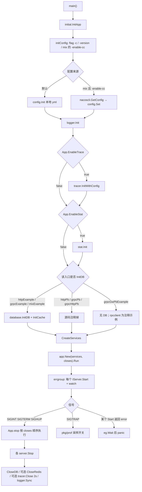
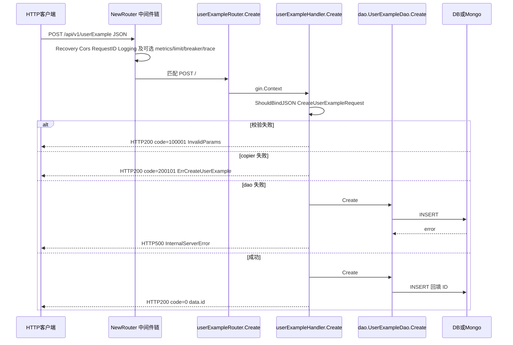

# 生成项目启动与 HTTP 请求链

> 状态：待复核生成稿
> 生成日期：2026-08-16
> 基准提交：`23807238c62e0f3b3e2d9a341bbef50547d3f5ec`
> 工作区：dirty
> 源码范围：`cmd/serverNameExample_*`、`internal/server/http*.go*`、`internal/routers/`、`internal/handler/`、`internal/types/`、`internal/ecode/*http*`、`pkg/app`、`pkg/httpsrv`、`pkg/gin` 在生成项目中的装配点
> 生成方式：源码、测试、配置与部署资产静态分析

## 目录

- [快速摘要](#快速摘要)
- [为什么这样设计（Why）](#为什么这样设计why)
- [它是什么（What）](#它是什么what)
- [代码如何实现（How）](#代码如何实现how)
  - [七种 main 入口与 server 组合](#七种-main-入口与-server-组合)
  - [启动与关闭](#启动与关闭)
  - [HTTP Server 与 TLS](#http-server-与-tls)
  - [路由装配与 pkg/gin](#路由装配与-pkggin)
  - [全部 HTTP API](#全部-http-api)
  - [Gin CRUD handler 全方法](#gin-crud-handler-全方法)
  - [Protobuf Logicer / service / 网关变体](#protobuf-logicer--service--网关变体)
  - [请求响应类型](#请求响应类型)
  - [HTTP 错误码](#http-错误码)
- [调用关系表](#调用关系表)
- [对应测试](#对应测试)
- [阅读源码建议顺序](#阅读源码建议顺序)
- [重新实现检查清单](#重新实现检查清单)

相关文档：[02-简单例子-全路径走读](02-简单例子-全路径走读.md)（生成链与 GetByID 成功路径）、[03-详细逐步说明-主链路拆解](03-详细逐步说明-主链路拆解.md)（主链失败与边界）、[10-gRPC服务网关与RPC客户端](10-gRPC服务网关与RPC客户端.md)（gRPC server / interceptor / rpcclient）、[11-数据层Model-DAO-Cache](11-数据层Model-DAO-Cache.md)（dao/cache 读写）、[12-pkg应用生命周期与Gin](12-pkg应用生命周期与Gin.md)（`pkg/app`、`pkg/httpsrv`、`pkg/gin` 源码）。

---

## 快速摘要

### 架构总览（模块与依赖）

本篇覆盖**被生成 HTTP 服务**在仓库模板里的全部运行入口，而不是 CLI 生成器。依赖方向固定：

```text
cmd/serverNameExample_*/main.go
  → initial.InitApp / CreateServices / Close
    → pkg/app.App.Run
      → internal/server.httpServer（实现 app.IServer）
        → pkg/httpsrv.Server.Run
        → internal/routers.NewRouter 或 NewRouter_pbExample
          → pkg/gin/{middleware,handlerfunc,prof,swagger,response}
          → internal/handler（Gin CRUD / Protobuf Logicer / 转调 gRPC service / RPC 网关）
            → internal/dao（细节见 11）
            → internal/types、internal/ecode
```

七个 `cmd/serverNameExample_*` 共享同一套 `main` 四步：`InitApp` → `CreateServices` → `Close` → `app.New(...).Run()`。差异只在 **CreateServices 组装了哪些 `app.IServer`**，以及 Init/Close 是否连库、是否注册中心。HTTP 运行时以 `httpExample` 与 `httpPbExample` 为主；gRPC 组合只交代职责并指向 [10](10-gRPC服务网关与RPC客户端.md)。

### 核心调用序列（逐步逻辑）

以 `sponge web http` 生成的 SQL/Gin 服务、一次 `POST /api/v1/userExample` 为例（生成过程见 [02](02-简单例子-全路径走读.md)）：

1. `cmd/serverNameExample_httpExample/main.go:main` 调用 `initial.InitApp`：读 `configs/serverNameExample.yml`，初始化 logger / 可选 tracer / 可选 stat / `database.InitDB` / `database.InitCache`。
2. `initial.CreateServices` 用 `cfg.HTTP.Port` 构造 `server.NewHTTPServer`，选项 `WithHTTPIsProd(cfg.App.Env=="prod")`、`WithHTTPTLS(cfg.HTTP.TLS)`。
3. `initial.Close` 收集 `IServer.Stop`、关库、可选 Redis、可选 tracer、`logger.Sync`。
4. `pkg/app.New(services, closes).Run` 用 errgroup 并发 `Start`，并监听 SIGINT/SIGTERM/SIGHUP/SIGTRAP。
5. `httpServer.Start`：若有 registry 则先 `Register`（5s），再 `httpsrv.Server.Run`。
6. `NewHTTPServer` 按 `App.Env` 设 Gin 模式，调用 `routers.NewRouter()`，把 `*gin.Engine` 交给 `http.Server.Handler`。
7. `NewRouter` 挂 Recovery/CORS/Timeout/RequestID/Logging 以及配置开关控制的 metrics/limit/breaker/trace/pprof，再 `registerRouters("/api/v1", apiV1RouterFns)`。
8. `userExample.go:init` 把 `userExampleRouter` 追加进 `apiV1RouterFns`；`POST /` 落到 `handler.userExampleHandler.Create`。
9. Create：`ShouldBindJSON` → `copier.Copy` 到 `model.UserExample` → `dao.Create` → `response.Success` 返回 `{id}`；失败走 `ecode.InvalidParams` / `ErrCreateUserExample` / `InternalServerError`。

Protobuf HTTP（`httpPbExample`）第 6 步换成 `NewHTTPServer_pbExample` → `NewRouter_pbExample`；业务路由由 `protoc-gen-go-gin` 生成的 `RegisterUserExampleRouter` 绑定到 `UserExampleLogicer`，而不是 `gin.Context` handler。

### 易错点与边界条件

- `response.Error` 始终 HTTP 200 + `body.code≠0`；`response.Output(c, ecode.InternalServerError.ToHTTPCode())` 才改 HTTP 状态码（500）。业务错误和系统错误不是同一套出口。
- `ecode.ErrDeleteByIDUserExample` 在默认 Gin handler 的 `DeleteByID` 中**从未使用**：DAO 失败直接 `InternalServerError`。扩展 API 的 `ErrDeleteByIDsUserExample` 等同理。
- Mongo `DeleteByID` 不校验 path id；SQL 用 `getUserExampleIDFromPath`，`id==0` 即 `InvalidParams`。Mongo Create 成功体里的 `id` 是 `primitive.ObjectID`，GetByID 才 `.Hex()` 成字符串。
- `ListByLastID`：SQL 在 `lastID==0` 时改成 `math.MaxInt32`（不是 `MaxUint64`）；Mongo 空字符串改成 `database.MaxObjectID`。
- `pkg/gin/validator.Init` **没有**被 `NewRouter` 调用。`binding` 标签走的是 Gin 内置 validator。
- `http.go.noregistry` 是 `sponge web http` / `web http-pb` 实际写出的 HTTP server；带 registry 的 `http.go` 给 mix / grpc-http / grpc-gw。生成时 `_pbExample` 后缀会被替换成空，`NewRouter_pbExample` 变成 `NewRouter`。
- 本篇未运行测试套件；测试结论来自阅读 `*_test.go`，不宣称测试通过。DAO/缓存细节见 [11](11-数据层Model-DAO-Cache.md)，`pkg/gin` 源码见 [12](12-pkg应用生命周期与Gin.md)。

---

## 为什么这样设计（Why）

Sponge 要让同一套业务（一张表或一份 proto）长出多种进程形态：纯 HTTP、纯 gRPC、双协议、HTTP 网关。如果每种形态各写一套启动代码，模板会爆炸。所以：

1. **main 只做四步编排**，把“有哪些 server”交给 `CreateServices`。`pkg/app` 只认识 `IServer{Start,Stop,String}`，不认识 Gin 或 gRPC。
2. **HTTP 传输与业务 handler 解耦**。SQL 风格用 `gin.Context` + `internal/types`；Protobuf 风格用生成的 `RegisterXxxRouter` + `XxxLogicer`。同一份 dao 可以被两种 handler 调用。
3. **文件后缀是生成器的开关**，不是运行时多态：`.tpl` 非标准主键，`.exp` 扩展 API，`.mgo` Mongo，`.noregistry` 去掉服务注册，`.service` 把 HTTP Logicer 转调本地 gRPC Server。运行期每个生成项目只保留被选中的那一份。
4. **中间件全部用配置字段开关**，避免用户改 `NewRouter` 才能打开 metrics/限流/熔断/trace。默认 CORS + RequestID + Logging 始终开，因为排障成本高于性能。

必须保持的行为契约：进程收到 SIGINT/SIGTERM 后按 Close 切片顺序释放；HTTP JSON 成功体为 `{code:0,msg:"ok",data:...}`；业务错误 HTTP 200。可以替换的实现：Gin 换成别的 HTTP 框架、registry 换成别的客户端、handler 不经过 copier 而手写字段。

---

## 它是什么（What）

仓库里的 `cmd/serverNameExample_*`、`internal/{server,routers,handler,types,ecode}` 是**带占位符的示例模板**。`sponge web http` 等命令把它们复制到输出目录，并把 `serverNameExample` / `userExample` 换成真实名字。本仓库直接 `go run` 这些 cmd 也能跑，因为占位符本身就是合法 Go 标识符。

| 模板目录 | 生成后角色 | HTTP 细节在本篇？ |
|---|---|---|
| `cmd/serverNameExample_httpExample` | `sponge web http`：SQL → Gin CRUD | 是，主路径 |
| `cmd/serverNameExample_httpPbExample` | `sponge web http-pb`：proto → Gin + Logicer | 是，Protobuf HTTP |
| `cmd/serverNameExample_grpcExample` | `sponge micro rpc`：SQL → gRPC | 只列 server 组合，细节 [10](10-gRPC服务网关与RPC客户端.md) |
| `cmd/serverNameExample_grpcPbExample` | `sponge micro rpc-pb` | 同上 |
| `cmd/serverNameExample_grpcHttpPbExample` | 同进程 HTTP+gRPC（proto） | HTTP 走 pb router；gRPC 见 10 |
| `cmd/serverNameExample_grpcGwPbExample` | HTTP 网关，后端是 gRPC 客户端 | HTTP 入口在此；RPC 连接见 10 |
| `cmd/serverNameExample_mixExample` | 带注册中心与配置中心的 HTTP+gRPC 示例 | HTTP 同 httpExample，另加 registry |

HTTP 请求进入后有四条业务实现族（生成时只留一条）：

| 族 | 代表文件 | 入参形态 | 谁实现业务 |
|---|---|---|---|
| A Gin CRUD | `internal/handler/userExample.go`（及 `.tpl` `.exp` `.mgo`） | `*gin.Context` | handler 调 dao |
| B Protobuf + DAO | `internal/handler/userExample_logic.go`（及 `.tpl` `.exp` `.mgo`） | proto Request | `UserExampleLogicer` 调 dao |
| C Protobuf + 本地 service | `internal/handler/userExample.go.service`（及 `.tpl` `.exp`） | proto Request | 原样转 `service.UserExampleServer` |
| D HTTP 网关 | `internal/routers/userExample_router.go` | proto Request | `service.NewUserExampleClient()` 出站 RPC |

---

## 代码如何实现（How）

### 七种 main 入口与 server 组合

七个 `main.go` 结构相同：

```text
initial.InitApp()
services := initial.CreateServices()
closes := initial.Close(services)
app.New(services, closes).Run()
```

`httpExample` 与 `mixExample` 的 `main` 额外带 swag 注释（`@title` `@host localhost:8080` `@securityDefinitions.apikey BearerAuth`），给 `make docs` 生成 `/swagger/index.html`。`httpPbExample` 不写这些注释，Swagger 改走 `pkg/gin/swagger.CustomRouter` + `docs.ApiDocs`。

| 入口 | CreateServices 实际 `append` 的 server | 注册中心 | InitDB | 关闭时关库 |
|---|---|---|---|---|
| `httpExample` | `server.NewHTTPServer` | 不传 `WithHTTPRegistry` | 是 | 是 |
| `httpPbExample` | `server.NewHTTPServer_pbExample` | 不传 | 源码中 `database.Init*` 被注释 | 关库被注释 |
| `grpcExample` | `server.NewGRPCServer`（registry 调用被注释） | 默认无 | 是 | 是 |
| `grpcPbExample` | `server.NewGRPCServer` | 默认无 | InitDB 注释 | 关库注释 |
| `grpcHttpPbExample` | `NewHTTPServer` **和** `NewGRPCServer` | 调用被注释，默认无 | InitDB 注释 | 关库注释 |
| `grpcGwPbExample` | `NewHTTPServer_pbExample` | 调用被注释 | 无 DB；`rpcclient.New*` 为注释示例 | 关 RPC 为注释示例 |
| `mixExample` | `NewHTTPServer` + `NewGRPCServer`，都带 `With*Registry` | `registerService` 按 `App.RegistryDiscoveryType` 选 consul/etcd/nacos；空字符串则返回 `nil,nil` | 是；另支持 `-enable-cc` 从 Nacos 拉配置 | 是 |

`httpExample`/`httpPbExample` 的 `CreateServices` 地址为 `":" + strconv.Itoa(cfg.HTTP.Port)`，默认配置 `http.port=8080`。gRPC 地址用 `cfg.Grpc.Port`，默认 8282。TLS 只传给 HTTP：`WithHTTPTLS(cfg.HTTP.TLS)`。`WithHTTPIsProd` 的布尔值是 `cfg.App.Env == "prod"`，为 true 时 `gin.SetMode(gin.ReleaseMode)`。

`mixExample/initial/initApp.go` 比其他入口多：

- flag `-enable-cc`：true 时读 `serverNameExample_cc.yml`，`config.NewCenter` → `nacoscli.GetConfig` → `conf.ParseConfigData` → `config.Set`；`App.Name==""` 则 panic。
- false 时与其他入口一样 `config.Init(本地 yml)`。
- flag `-version` 非空则覆盖 `config.Get().App.Version`。

`grpcExample`/`grpcPbExample`/`grpcHttpPbExample`/`grpcGwPbExample` 的 `createService.go` 里有一份被注释的 `registerService`，逻辑与 mixExample 生效版相同：`id = Name_scheme_host_port`，endpoint 为 `scheme://host:port`。gRPC 侧 `Start`/`interceptor`/`rpcclient` 不在本篇展开，见 [10](10-gRPC服务网关与RPC客户端.md)。

生成器文件选择（帮助理解“为什么仓库里同时有两份 http.go”）：

- `sponge web http`：`cmd/..._httpExample` + `internal/server/http.go.noregistry`（改名为 `http.go`）+ `handler/userExample.go`（或 `.tpl` / `.exp.tpl`）+ `routers.go` + `userExample.go`。
- `sponge web http-pb`：`cmd/..._httpPbExample` + 同样 noregistry HTTP + `routers_pbExample.go`；`_pbExample` 替换为空后 `NewRouter_pbExample` 改名为 `NewRouter`。handler 由随后 `make proto` 生成。
- `sponge micro grpc-http-pb`：`cmd/..._grpcHttpPbExample` + 带 registry 的 `http.go`（生成时删掉 `// delete the templates code` 里的 `NewHTTPServer_pbExample`）+ `routers_pbExample.go`。
- `sponge micro grpc-gw-pb`：`cmd/..._grpcGwPbExample` + 带 registry 的 `http.go` + `routers_pbExample.go`。

---

### 启动与关闭



`pkg/app.App.Run`（`pkg/app/app.go`）：

1. `errgroup.WithContext`；每个 server 一个 goroutine 打印 `String()` 再 `Start()`。
2. 另一个 goroutine `watch`：`signal.Notify(SIGINT, SIGTERM, SIGHUP, SIGTRAP)`。
3. `ctx.Done()`（任一 Start 失败）时调用 `stop()` 再返回 `ctx.Err()`；`eg.Wait` 非 nil 则 **panic**。
4. SIGTRAP 只切换 `pkg/prof.NewProfile().StartOrStop()`，不退出。
5. `stop` 按 `closes` 切片**顺序**调用；任一 Close 返回 error 则中止后续 Close。

`httpExample` 的 Close 顺序：每个 `s.Stop` → `database.CloseDB` → 若 `App.CacheType=="redis"` 则 `CloseRedis` → 若 `EnableTrace` 则 `tracer.Close(2s)` → `logger.Sync`。`httpServer.Stop`：若有 registry，2s 超时内 goroutine `Deregister` 并 `cancel`，主 goroutine `<-ctx.Done()` 后再 `httpsrv.Shutdown(3s)`。noregistry 变体没有 Register/Deregister 这两段。

配置加载失败是 **panic**（`init config error: ...`），不是返回 error。`logger.Init` 失败同样 panic。这与 CLI 工具 `cmd/sponge` 的“打印错误后 return”不同：生成项目把配置当成启动不变量。

---

### HTTP Server 与 TLS

`internal/server/http.go` 中 `httpServer` 实现 `app.IServer`。字段：`addr`、`*httpsrv.Server`、可选 `registry.Registry` + `*registry.ServiceInstance`。

`NewHTTPServer(addr, opts...)`：

1. `defaultHTTPOptions()`：`isProd=false`，registry 空。
2. `o.apply(opts...)`。
3. `isProd` → `gin.ReleaseMode` 否则 `DebugMode`。
4. `router := routers.NewRouter()`。
5. 标准库 `http.Server{Addr, Handler: router, IdleTimeout: 60s, MaxHeaderBytes: 1<<20}`；Read/WriteTimeout 在源码里注释掉。
6. `newServer(server, o.tls)` 按 `httpsrv.Mode(tls.EnableMode)` 分支。

`NewHTTPServer_pbExample` 与上面相同，只把第 4 步换成 `routers.NewRouter_pbExample()`。该函数包在 `// delete the templates code start/end` 里，生成 grpc-http-pb 时会被删掉；http-pb 用的是 noregistry 文件，本身没有这个函数，靠 `_pbExample` 字符串替换让 router 名字变成 `NewRouter`。

`newServer` 与 `cfg.HTTP.TLS.EnableMode`：

| EnableMode | `httpsrv` 构造 | Scheme |
|---|---|---|
| `self-signed` | `NewTLSSelfSignedConfig()` | https |
| `encrypt` | `NewTLSEAutoEncryptConfig(Domain, Email)`；重定向 80→443 的 option 在模板里注释 | https |
| `external` | `NewTLSExternalConfig(CertFile, KeyFile)` | https |
| 空 / 其他 | `httpsrv.New(server)` 无 TLSer | http |

`http.go.noregistry`：结构体没有 registry 字段；`Start` 直接 `server.Run`；`Stop` 只有 3s Shutdown；`http_option.go.noregistry` 没有 `WithHTTPRegistry`。`sponge web http` 通过 `getHTTPServiceFields` 把文件名改回 `http.go` / `http_option.go`。

`http_option.go`（带 registry 版）三个 option：`WithHTTPIsProd`、`WithHTTPRegistry`、`WithHTTPTLS`。mixExample 三个都传；httpExample 只传 prod 与 TLS。

`httpsrv.Server.Run`：无 TLSer 则 `ListenAndServe`，`http.ErrServerClosed` 不当错误；有 TLSer 则 `Validate` 后 `tlser.Run`。细节见 [12](12-pkg应用生命周期与Gin.md)。

`http_test.go`：`TestHTTPServer` 在 2s 超时里构造 `NewHTTPServer` / `NewHTTPServer_pbExample`（开 metrics/trace/pprof/limit/breaker）；`TestHTTPServerMock` 用假 `iRegistry` 跑 `Start`/`Stop`/`String`；`Test_newServer` 断言四种 TLS 的 `Scheme()`。注释写明 `need real database to test`——`NewRouter` 的 `init` 会 `NewUserExampleHandler()` → `database.GetDB()`，无库时构造可能 panic，测试靠 `SafeRunWithTimeout` 截断。

---

### 路由装配与 pkg/gin

本节省写 `pkg/gin` 源码（那是 [12](12-pkg应用生命周期与Gin.md) 的职责），只记录**本项目 `NewRouter` 真正调用了哪些函数、开关来自哪个配置字段**。

#### `routers.NewRouter`（SQL/Gin，`internal/routers/routers.go`）

引擎：`gin.New()`，不是 `gin.Default()`（避免默认 Logger 与自研 Logging 重复）。

| 顺序 | 调用 | 开关 / 参数 | 默认配置值（`configs/serverNameExample.yml`） |
|---|---|---|---|
| 1 | `gin.Recovery()` | 始终 | — |
| 2 | `middleware.Cors()` | 始终；默认允许 `*`、含 Authorization | — |
| 3 | `middleware.Timeout(time.Second * HTTP.Timeout)` | 仅当 `config.Get().HTTP.Timeout > 0` | `http.timeout: 0`（不装） |
| 4 | `middleware.RequestID()` | 始终；缺省生成 10 位随机，写入 `X-Request-Id` 与 gin Keys | — |
| 5 | `middleware.Logging(WithLog(logger.Get()), WithRequestIDFromContext(), WithIgnoreRoutes("/metrics"))` | 始终 | — |
| 6 | `metrics.Metrics(r, WithIgnoreStatusCodes(404))` | `App.EnableMetrics` | `true`；路径默认 `/metrics` |
| 7 | `middleware.RateLimit()` | `App.EnableLimit` | `false`；默认 window 10s、bucket 100、CPU 阈值 800 |
| 8 | `middleware.CircuitBreaker(WithValidCode(InternalServerError.Code(), ServiceUnavailable.Code()))` | `App.EnableCircuitBreaker` | `false`；另默认把 HTTP 500/503 算入熔断 |
| 9 | `middleware.Tracing(App.Name)` | `App.EnableTrace` | `false` |
| 10 | `prof.Register(r, prof.WithIOWaitTime())` | `App.EnableHTTPProfile` | `false`；前缀 `/debug/pprof`，并加 `/profile-io` |
| 11 | `GET /health` → `handlerfunc.CheckHealth` | 始终 | 返回 `{status:UP, hostname}` |
| 12 | `GET /ping` → `handlerfunc.Ping` | 始终 | `{}` |
| 13 | `GET /codes` → `handlerfunc.ListCodes` | 始终 | `errcode.ListHTTPErrCodes()` |
| 14 | `GET /config` → `errcode.ShowConfig(config.Show())`；`GET /swagger/*any` → gin-swagger | 仅当 `App.Env != "prod"` | 默认 `env: dev` |
| 15 | `registerRouters(r, "/api/v1", apiV1RouterFns)` | 始终 | 组上可再挂 `handlers...`，模板注释了 `middleware.Auth()` |

`registerRouters`：`r.Group(groupPath, handlers...)`，再对 `routerFns` 逐个调用。`apiV1RouterFns` 由各 `userExample.go` 的 `init()` `append`。JWT 在 `userExampleRouter` 里整组 `g.Use(middleware.Auth())` 被注释，默认**无鉴权**；Swagger 仍声明 BearerAuth。

未装配但存在于 `pkg/gin` 的包：`validator`（`Init` 全仓库无引用）、`proxy`、`staticfs`、`frontend`、`middleware/auth` 的 session 版、`middleware.Auth`。它们不是本模板运行时路径。`binding` 标签由 Gin 默认的 go-playground/validator 在 `ShouldBindJSON` 时执行。

`grpc-http-pb` 生成时会把 `prof.Register(...)` 替换成注释 `// implemented on port 8283`，因为 gRPC 侧另有 profile 端口 `grpc.httpPort`（默认 8283），避免两个 HTTP 栈抢 pprof。

#### `routers.NewRouter_pbExample`（`routers_pbExample.go`）

中间件 1–13 与 `NewRouter` 相同（RateLimit 注释里的默认 bucket/CPU 数字不同，但都未启用那些 option，运行默认值仍是 100/800）。差异：

- Swagger：`swagger.CustomRouter(r, "apis", docs.ApiDocs)`，URL 为 `/apis/swagger/index.html`，不是 `/swagger/index.html`。
- 没有 `registerRouters("/api/v1", ...)`。改为：`newMiddlewareConfig()` → 执行 `allMiddlewareFns`（可 `setGroupPath` / `setSinglePath`）→ 执行 `allRouteFns`，每个签名为 `(engine, groupMWs, singleMWs)`。
- `setGroupPath`：空路径直接 return；不以 `/` 开头则补上；同 path 多次调用会 **append** 中间件。
- `setSinglePath`：key 为 `strings.ToUpper(method) + "->" + singlePath`。
- `userExample_router.go` 的 `init` 同时往 `allMiddlewareFns` 和 `allRouteFns` 追加。`userExampleServiceRouter` 调用 `serverNameExampleV1.RegisterUserExampleRouter`，option：`WithUserExampleLogger(logger.Get())`、`WithUserExampleRPCResponse()`（`isFromRPC=true`，网关按 RPC status 映射 HTTP）、`WithUserExampleWrapCtx` 把 gin RequestID 放进 outgoing metadata、`WithUserExampleRPCStatusToHTTPCode` 参数为空（生成代码仍默认映射 InternalServerError 与 ServiceUnavailable）。

`RegisterUserExampleRouter`（`api/serverNameExample/v1/userExample_router.pb.go`，protoc-gen-go-gin 产物）：

- 为每个 RPC 注册 `engine.Handle(METHOD, PATH, withMiddleware(..., handler)...)`。
- `withMiddleware`：path 左前缀命中 `groupPathMiddlewares` 则挂上；再查 single key；最后才是业务 handler。
- 各 `*_0` handler：绑定失败 `iResponse.ParamError`；`wrapCtxFn` 非空则用它，否则 `middleware.WrapCtx`；调用 `iLogic.Xxx`；`errors.Is(err, errcode.SkipResponse)` 则不再写响应；否则 `iResponse.Error` 或 `Success`。

#### 业务路由文件变体

| 文件 | 注册方式 | 路由 |
|---|---|---|
| `userExample.go` | `init` → `apiV1RouterFns`；`group.Group("/userExample")` | 标准 5 个 CRUD |
| `userExample.go.tpl` | 同上，表名/主键占位符 `{{.TableNameCamelFCL}}`、`{{.ColumnNameCamelFCL}}` | 方法名变成 `DeleteBy{{.ColumnNameCamel}}` 等 |
| `userExample.go.exp` | 标准 5 个 **再加** 扩展 4 个 | 见 API 表 |
| `userExample.go.exp.tpl` | `.tpl` + 扩展；批量路径用 `{{.ColumnNamePluralCamelFCL}}` | 如 `/delete/ids` 变成 `/delete/{{.ColumnNamePluralCamelFCL}}` |
| `userExample_router.go` | `allRouteFns` + 生成的 `RegisterUserExampleRouter` | proto `google.api.http` 注解路径（示例与 Gin CRUD 相同） |

`userExample.go` 标准五条：

- `POST /` → Create
- `DELETE /:id` → DeleteByID
- `PUT /:id` → UpdateByID
- `GET /:id` → GetByID
- `POST /list` → List

扩展四条（`.exp`）：

- `POST /delete/ids` → DeleteByIDs
- `POST /condition` → GetByCondition
- `POST /list/ids` → ListByIDs
- `GET /list` → ListByLastID（注意与 `POST /list` 方法不同，Gin 允许共存）

---

### 全部 HTTP API

基础路径：组前缀 `/api/v1` + `/userExample`。Protobuf 生成路由写的是绝对路径 `/api/v1/userExample/...`，效果相同。

#### 系统探活（两种 NewRouter 都有）

| 方法 | 路径 | handler | 成功体 | 鉴权 |
|---|---|---|---|---|
| GET | `/health` | `handlerfunc.CheckHealth` | `{status,hostname}`，非 `{code,msg,data}` | 无 |
| GET | `/ping` | `handlerfunc.Ping` | `{}` | 无 |
| GET | `/codes` | `handlerfunc.ListCodes` | HTTP 错误码列表 | 无 |
| GET | `/config` | `errcode.ShowConfig` | 配置文本；仅非 prod | 无 |
| GET | `/swagger/*any` 或 `/apis/swagger/*any` | gin-swagger | Swagger UI | 无 |
| GET | `/metrics` | `metrics.Metrics` 注册 | Prometheus；仅 EnableMetrics | 无 |
| GET | `/debug/pprof/*` | `prof.Register` | 仅 EnableHTTPProfile | 无 |

#### 标准 CRUD（族 A 与 proto 示例）

| 方法 | 路径 | Gin handler | Protobuf Logicer | 绑定 | 成功 data |
|---|---|---|---|---|---|
| POST | `/api/v1/userExample` | `Create` | `Create` | JSON body `CreateUserExampleRequest` | `{id}` |
| DELETE | `/api/v1/userExample/:id` | `DeleteByID` | `DeleteByID` | path `id`（pb 另 ShouldBindQuery） | `{}` |
| PUT | `/api/v1/userExample/:id` | `UpdateByID` | `UpdateByID` | path `id` + JSON body | `{}` |
| GET | `/api/v1/userExample/:id` | `GetByID` | `GetByID` | path `id` | `{userExample: ObjDetail}` |
| POST | `/api/v1/userExample/list` | `List` | `List` | JSON `ListUserExamplesRequest` / proto Params | `{userExamples,total}` |

#### 扩展 API（`.exp` / `.exp.tpl` / logic `.exp` / `.mgo.exp`）

| 方法 | 路径 | handler | 绑定 | 成功 data |
|---|---|---|---|---|
| POST | `/api/v1/userExample/delete/ids` | `DeleteByIDs` | JSON `{ids:[]}` `binding:"min=1"` | `{}` |
| POST | `/api/v1/userExample/condition` | `GetByCondition` | JSON `Conditions` + `CheckValid` | `{userExample}` |
| POST | `/api/v1/userExample/list/ids` | `ListByIDs` | JSON `{ids:[]}` `min=1` | `{userExamples}`（按请求 id 顺序，缺的跳过） |
| GET | `/api/v1/userExample/list` | `ListByLastID` | query `lastID` `limit` `sort` | `{userExamples}` 无 total |

`.exp.tpl` 把 `ids` 换成主键复数占位符，方法名 `DeleteBy{{.ColumnNamePluralCamel}}` 等。

#### 统一 JSON 信封（业务 API）

`pkg/gin/response.Result`：`code int`、`msg string`、`data interface{}`。`data==nil` 时写成 `&struct{}{}`，JSON 为 `{}` 而不是 `null`。探活接口不走这套信封。

---

### Gin CRUD handler 全方法

族 A 接口 `UserExampleHandler` 定义在 `userExample.go`。实现体 `userExampleHandler{iDao dao.UserExampleDao}`。`NewUserExampleHandler()`：

- SQL：`dao.NewUserExampleDao(database.GetDB(), cache.NewUserExampleCache(database.GetCacheType()))`。
- Mongo（`.mgo`）：`database.GetDB().Collection(new(model.UserExample).TableName())` 代替 `GetDB()`。

`middleware.WrapCtx(c)` 把 RequestID 和 Header 打进 `context.Context` 再传 dao。dao 内部见 [11](11-数据层Model-DAO-Cache.md)。

下面每条都写绑定、校验、copier、dao、错误码、响应。变体差异跟在每条后面，不用“同上”代替未写的方法。

#### Create

- **绑定**：`form := &types.CreateUserExampleRequest{}`；`c.ShouldBindJSON(form)`。
- **校验**：Gin 按 `binding` 标签：`name min=2`、`email`、`password md5`、`phone e164`、`avatar min=5`、`age gt=0,lt=120`、`gender gte=0,lte=2`。失败：`logger.Warn` + `response.Error(c, ecode.InvalidParams)`（HTTP 200，`code=100001`）。
- **copier**：`copier.Copy(&model.UserExample{}, form)`。失败：`response.Error(c, ecode.ErrCreateUserExample)`（`HCode(1)+1=200101`；`.exp` 的 NO=78 则为 207801）。注释要求拷不了的字段手写补上。
- **dao**：`h.iDao.Create(ctx, userExample)`。GORM 会回填自增 ID。
- **错误**：DAO 失败 `logger.Error` + `response.Output(c, ecode.InternalServerError.ToHTTPCode())` → HTTP 500，body.code 仍是 100003。
- **成功**：`response.Success(c, gin.H{"id": userExample.ID})`，HTTP 200，`code=0`。
- **`.tpl`**：成功 key 为 `"{{.ColumnNameCamelFCL}}"`，值为 `{{.TableNameCamelFCL}}.{{.ColumnNameCamel}}`。
- **`.mgo`**：Create 成功仍 `gin.H{"id": userExample.ID}`，此时 ID 类型是 `primitive.ObjectID`，JSON 形态与 GetByID 返回的 hex 字符串不一致。

#### DeleteByID

- **绑定**：SQL：`getUserExampleIDFromPath` → `c.Param("id")` + `utils.StrToUint64E`。Mongo：`id := c.Param("id")`，无转换。
- **校验**：SQL：`err != nil || id==0` 则 abort，`response.Error(InvalidParams)`。Mongo：**不校验**空 id，直接调 dao。
- **copier**：无。
- **dao**：`DeleteByID(ctx, id)`。SQL 侧通常是软删（测试期望 `UPDATE`），见 11。
- **错误**：DAO 失败 → HTTP 500 `InternalServerError`。`ecode.ErrDeleteByIDUserExample`（200102）在此方法未引用。
- **成功**：`response.Success(c)`，data `{}`。
- **`.tpl`**：`get{{.TableNameCamel}}{{.ColumnNameCamel}}FromPath`；字符串主键只拒绝空串；非字符串用 `utils.StrTo{{.GoTypeFCU}}E`，失败或空串 abort。方法名 `DeleteBy{{.ColumnNameCamel}}`。

#### UpdateByID

- **绑定**：先取 path id（SQL abort / Mongo `database.ToObjectID`，`oid.IsZero()` 则 InvalidParams）；再 `ShouldBindJSON(&UpdateUserExampleByIDRequest{})`。Update 字段 `binding:""`（空规则，不强制）。`form.ID` 的 json tag 是 `binding:"-"`，不从 body 读。
- **校验**：JSON 失败 InvalidParams。SQL 随后 `form.ID = id`。Mongo 不写 form.ID，copier 之后 `userExample.ID = oid`。
- **copier**：`Copy(&model.UserExample{}, form)`。失败 `ErrUpdateByIDUserExample`（200103）。
- **dao**：`UpdateByID(ctx, userExample)`。
- **错误**：DAO 失败 HTTP 500。
- **成功**：`response.Success(c)`。
- **`.tpl`**：`form.{{.ColumnNameCamel}} = pathValue`；错误码 `ErrUpdateBy{{.ColumnNameCamel}}{{.TableNameCamel}}`。

#### GetByID

- **绑定/校验**：与 DeleteByID 相同（SQL 校验 id；Mongo 不校验）。
- **copier**：dao 返回后再 `Copy(&types.UserExampleObjDetail{}, model)`。失败 `ErrGetByIDUserExample`（200104）。Mongo 在 Copy 后执行 `data.ID = userExample.ID.Hex()`。
- **dao**：`GetByID(ctx, id)`。
- **错误**：`errors.Is(err, database.ErrRecordNotFound)` → `logger.Warn` + `response.Error(NotFound)`（HTTP 200，`code=100004`）。其他错误 HTTP 500。缓存占位符是否变成 `ErrRecordNotFound` 由 dao 决定，见 11 与 [03](03-详细逐步说明-主链路拆解.md)。
- **成功**：`response.Success(c, gin.H{"userExample": data})`。`.tpl` 的 key 为 `"{{.TableNameCamelFCL}}"`。

#### List

- **绑定**：`ShouldBindJSON(&types.ListUserExamplesRequest{})`，内嵌 `query.Params`（SQL）或 `pkg/mgo/query.Params`（Mongo types）。
- **校验**：仅 JSON 反序列化；`Params` 合法性在 dao `GetByColumns` 内检查。
- **copier**：列表用 `convertUserExamples`：逐条 `convertUserExample` → `Copy` 到 `ObjDetail`。Mongo convert 额外 `data.ID = Hex()`。任一条失败 `ErrListUserExample`（200105）。
- **dao**：`GetByColumns(ctx, &form.Params)` → `(records, total, err)`。
- **错误**：DAO 失败 HTTP 500（不把 “query params error:” 映射为 InvalidParams；这是族 B 才有的分支）。
- **成功**：`{userExamples: data, total: total}`。`.tpl` 的切片 key 为 `"{{.TableNamePluralCamelFCL}}"`。

#### DeleteByIDs（仅 `.exp` / `.mgo.exp` / `.exp.tpl`）

- **绑定**：`ShouldBindJSON(&DeleteUserExamplesByIDsRequest{IDs []uint64|[]string})`，`binding:"min=1"`。
- **校验**：空数组 InvalidParams。无 `CheckValid`。
- **copier**：无。
- **dao**：`DeleteByIDs(ctx, form.IDs)`。
- **错误**：HTTP 500。日志字符串误写为 `"GetByIDs error"`。`ErrDeleteByIDsUserExample` 未使用。
- **成功**：`response.Success(c)`。
- **`.exp.tpl`**：方法 `DeleteBy{{.ColumnNamePluralCamel}}`，路径 `/delete/{{.ColumnNamePluralCamelFCL}}`。

#### GetByCondition（扩展）

- **绑定**：`GetUserExampleByConditionRequest` 内嵌 `query.Conditions`。
- **校验**：JSON 失败 InvalidParams；再 `form.Conditions.CheckValid()`，失败同样 InvalidParams。
- **copier**：查到记录后 Copy 到 ObjDetail；失败复用 `ErrGetByIDUserExample`（不是 `ErrGetByConditionUserExample`）。Mongo 再 Hex ID。
- **dao**：`GetByCondition(ctx, &form.Conditions)`。
- **错误**：`ErrRecordNotFound` → NotFound；其他 HTTP 500。
- **成功**：`{userExample: data}`。

#### ListByIDs（扩展）

- **绑定**：`ListUserExamplesByIDsRequest{IDs}` `min=1`。
- **校验**：JSON。
- **copier**：`GetByIDs` 返回 `map[id]*model`；**按 form.IDs 顺序**遍历，命中才 `convertUserExample`。convert 失败 `ErrListUserExample`。map 中没有的 id 静默跳过，不报 NotFound。
- **dao**：`GetByIDs(ctx, form.IDs)`。
- **错误**：DAO 失败 HTTP 500。
- **成功**：`{userExamples: [...]}`，无 total。

#### ListByLastID（扩展）

- **绑定**：query，不是 JSON。SQL：`lastID=utils.StrToUint64`，`limit=utils.StrToInt`，`sort=c.Query("sort")`。Mongo：`lastID=c.Query("lastID")` 字符串。
- **校验/默认**：SQL `lastID==0` → `math.MaxInt32`；`limit==0` → 10。Mongo `lastID==""` → `database.MaxObjectID`；limit 同。
- **copier**：`convertUserExamples`。失败 `ErrListByLastIDUserExample`（200109）。这是扩展 API 里少数真正用到对应 ecode 的出口。
- **dao**：`GetByLastID(ctx, lastID, limit, sort)`。
- **错误**：DAO 失败 HTTP 500。
- **成功**：`{userExamples: data}`，无 total。

#### 路径解析与 convert 辅助函数

`getUserExampleIDFromPath`（SQL `.go` / `.exp`）：返回 `(idStr, id uint64, isAbort)`。`id==0` 视为非法。Create 不走它。

`convertUserExample` / `convertUserExamples`：List 与 ListByIDs / ListByLastID 共用。GetByID 在默认 `.go` 里**内联 Copy**，不调用 `convertUserExample`；`.mgo` GetByID 同样内联，但 convert 函数仍给 List 用。

---

### Protobuf Logicer / service / 网关变体

#### 族 B：`userExample_logic.go`（及 `.tpl` `.exp` `.mgo` `.mgo.exp` `.exp.tpl`）

实现 `serverNameExampleV1.UserExampleLogicer`。构造函数示例名 `NewUserExamplePbHandler`（`.tpl` 为 `New{{.TableNameCamel}}Handler`）。**不接收 `*gin.Context`**：绑定发生在 `userExample_router.pb.go` 的 `Create_0` 等。

公共步骤：

1. `req.Validate()`（protobuf validate）。失败 `return nil, ecode.InvalidParams.Err()`。注意是 `error` 返回值，由 generated router 的 `iResponse.Error` 写成 JSON，不是 `response.Error`。
2. 需要写库的方法：`copier.Copy` 到 `model.UserExample`。
3. dao 调用与族 A 同名。
4. 返回 proto Reply 或 `ecode.Xxx.Err()`。

各方法：

| 方法 | 绑定（在 pb router） | 校验 | copier | dao | 错误 | 成功 Reply |
|---|---|---|---|---|---|---|
| Create | `ShouldBindJSON` | `req.Validate` | req→model | `Create` | Validate→InvalidParams；Copy→`ErrCreateUserExample.Err()`；DAO→`InternalServerError.Err()` | `{Id: userExample.ID}`；Mongo 用 `ID.Hex()` |
| DeleteByID | `ShouldBindUri` + `ShouldBindQuery` | Validate | 无 | `DeleteByID(ctx, req.Id)` | Validate / DAO→500 | 空 Reply |
| UpdateByID | Uri + JSON | Validate | req→model，再 `model.ID=req.Id`；Mongo `ToObjectID(req.Id)` | `UpdateByID` | Copy→`ErrUpdateByIDUserExample.Err()`；DAO→500 | 空 Reply |
| GetByID | Uri + Query | Validate | `convertUserExamplePb` model→proto `UserExample` | `GetByID` | NotFound / 500 / convert→`ErrGetByIDUserExample.Err()` | `{UserExample: data}` |
| List | JSON | Validate；Copy Params 失败→`ErrListUserExample.Err()` | proto Params→`query.Params` | `GetByColumns` | 错误字符串含 `query params error:` → InvalidParams（族 A 没有这分支）；convert 单条失败 **continue 跳过**，不 fail 整次 | `{Total, UserExamples}` |

扩展（`userExample_logic.go.exp` / `.mgo.exp` / `.exp.tpl`）：

| 方法 | 额外逻辑 |
|---|---|
| DeleteByIDs | Validate 后 `DeleteByIDs(ctx, req.Ids)`；失败 500 |
| GetByCondition | 把 `req.Conditions.GetColumns()` 逐列 Copy 到 `query.Conditions`，再 `CheckValid`；NotFound / convert 用 `ErrGetByIDUserExample.Err()`；日志仍写 `"GetByID error"` |
| ListByIDs | `GetByIDs`；按 `req.Ids` 顺序组装；convert 失败返回 `InternalServerError.Err()`（族 A 用 `ErrListUserExample`） |
| ListByLastID | Validate 后 SQL：`req.LastID==0` → `MaxInt32`；Mongo：`LastID==""` → `MaxObjectID`。convert 失败 continue。日志误写 `"GetByColumns error"` |

Mongo convert：`value.Id = record.ID.Hex()`。`var _ time.Time` 是为了在字段生成后仍能通过编译的占位。

族 B **不**调用 `pkg/gin/response`；HTTP 形态由 `errcode.NewResponser(isFromRPC, ...)` 决定。`userExample_router.go` 传了 `WithUserExampleRPCResponse()`（网关）；本地 http-pb 在 `make proto` 生成的 router 文件里通常用 `WithUserExampleHTTPResponse()`（`isFromRPC=false`）。两种 Responser 的 JSON 差异见 [12](12-pkg应用生命周期与Gin.md) 的 `pkg/errcode/response.go`。

#### 族 C：`userExample.go.service`（及 `.tpl` `.exp` `.exp.tpl`）

`NewUserExampleHandler()` 返回 `UserExampleLogicer`，内部 `server: service.NewUserExampleServer()`。每个方法**零逻辑转发**：

- Create / DeleteByID / UpdateByID / GetByID / List：`return h.server.Xxx(ctx, req)`。
- `.exp` 再转发 DeleteByIDs、GetByCondition、ListByIDs、ListByLastID。
- `.tpl` 方法名随主键变化，转调 `h.server.DeleteBy{{.ColumnNameCamel}}` 等。

绑定、校验、copier、dao、错误码全部在 `internal/service`（gRPC 实现）里，本篇不展开，见 [10](10-gRPC服务网关与RPC客户端.md)。生成命令 `service-handler.go` 在 grpc+http 同进程时选用这组文件，避免 HTTP 与 gRPC 各写一份 dao 调用。

#### 族 D：网关 `userExample_router.go`

`iService := service.NewUserExampleClient()`（gRPC 客户端，不是 Server）。`wrapCtxFn` 把 `middleware.ContextRequestIDKey` 写入 outgoing metadata，Authorization 写入被注释。中间件函数 `userExampleMiddlewares` 里 `setGroupPath` / `setSinglePath` 的 Auth 全部注释。RPC 失败映射由 `WithUserExampleRPCResponse` + 默认 status 完成。`InitApp` 里 `rpcclient.NewServerNameExampleRPCConn()` 在模板中是注释，生成网关项目后需要取消注释，否则 Client 无连接。细节 [10](10-gRPC服务网关与RPC客户端.md)。



Protobuf 路径把上图 `H` 换成 `Create_0`（绑定）+ `userExamplePbHandler.Create`（Validate + dao）；网关路径把 `H` 换成 `UserExampleClient.Create` 出站 RPC。

---

### 请求响应类型

`internal/types/swagger_types.go`：给 swag 用的公共 `Result`、`Params`、`Column`、`Conditions`。注释写明仅文档，运行时 List 实际内嵌的是 `pkg/sgorm/query.Params` 或 `pkg/mgo/query.Params`。

`userExample_types.go`（SQL 标准）：

- `CreateUserExampleRequest`：见 Create 校验标签。
- `UpdateUserExampleByIDRequest`：`ID uint64` `binding:"-"` + 业务字段空 binding。
- `UserExampleObjDetail`：含 `Status` `LoginAt` `CreatedAt` `UpdatedAt`；Create 请求没有这些字段（由 DB 填）。**不含 Password**。
- `Create/Delete/Update/Get/List*Reply`：swag 用，运行时 handler 并不把它们当返回类型，而是 `response.Success` + `gin.H`。
- `ListUserExamplesRequest` 内嵌 `query.Params`。
- `ListUserExamplesReply.Data` 的 swag 结构**只有** `UserExamples`，没有 `total`，与运行时 `gin.H{"total": total}` 不一致（文档缺口）。

`.exp` 增加：`DeleteUserExamplesByIDsRequest/Reply`、`GetUserExampleByConditionRequest/Reply`、`ListUserExamplesByIDsRequest/Reply`。IDs 为 `[]uint64` `min=1`。

`.mgo`：`Update` 与 `ObjDetail` 的 ID 为 `string`；`List` 内嵌 `pkg/mgo/query.Params`。`CreateUserExampleReply.Data.ID` 仍声明 `uint64`，与 Mongo 运行时 ObjectID/hex 不一致。

`.mgo.exp`：IDs 为 `[]string`。

`.tpl` / `.exp.tpl`：Reply 类型名与 JSON key 用表名/主键占位符；Create Reply 的 id 字段类型为 `{{.GoType}}`。

`// todo generate the request and response struct to here` 与 `delete the templates code` 包围的 Create/Update/ObjDetail 会在生成时被 sql2code 字段片段替换；Reply 外壳保留。

---

### HTTP 错误码

`internal/ecode/systemCode_http.go` 把 `pkg/errcode` 系统码再导出一遍，handler 只 import `internal/ecode`。数值在 `pkg/errcode/http_system_code.go`（注释写 10000~20000，实际是六位数）：

| 符号 | code | 本模板谁用 |
|---|---|---|
| Success | 0 | `response.Success` |
| InvalidParams | 100001 | 绑定/Validate/CheckValid 失败 |
| Unauthorized | 100002 | 未在默认 handler 使用（JWT 注释掉） |
| InternalServerError | 100003 | DAO 失败；`ToHTTPCode()`→500 |
| NotFound | 100004 | GetByID / GetByCondition 记录不存在 |
| ServiceUnavailable | 100013 | 熔断 `WithValidCode` 之一 |
| SkipResponse | （特殊） | pb router 遇到则不再写 body |

`userExample_http.go`：`userExampleNO=1` → `HCode(1)=200100`。

| 符号 | code | 实际引用 |
|---|---|---|
| ErrCreateUserExample | 200101 | Create copier 失败 |
| ErrDeleteByIDUserExample | 200102 | **默认 DeleteByID 未用** |
| ErrUpdateByIDUserExample | 200103 | Update copier 失败 |
| ErrGetByIDUserExample | 200104 | GetByID / GetByCondition copier 失败 |
| ErrListUserExample | 200105 | List convert 失败；族 B List 的 Params copy 失败 |

`.exp`：`userExampleNO=78` → base `207800`，标准五个 +6~+9：

| 符号 | code | 实际引用 |
|---|---|---|
| ErrDeleteByIDsUserExample | 207806 | 未在 handler 使用 |
| ErrGetByConditionUserExample | 207807 | 未使用（走 ErrGetByID） |
| ErrListByIDsUserExample | 207808 | 未使用 |
| ErrListByLastIDUserExample | 207809 | ListByLastID convert 失败 |

`.tpl` 的 NO 仍为 1，符号名带主键。`.exp.tpl` NO=78。`HCode` 要求 `num∈[1,999]`，越界 panic，保证业务码落在 200100–299900。同一 NO 注册两次也会在 `NewError` 时 panic（全局唯一）。

RPC 错误码文件 `userExample_rpc.go*` / `systemCode_rpc.go` 不属于本篇 HTTP 链，见 10 与后续 ecode 专篇。

---

## 调用关系表

| 调用方文件与符号 | 关系 | 被调用方文件与符号 | 触发与输入 | 返回与后续处理 | 错误、状态与副作用 |
|---|---|---|---|---|---|
| `cmd/..._httpExample/main.go:main` | 调用 | `initial.InitApp` | 进程启动 | 配置/日志/可选 trace·stat/DB/缓存就绪 | 配置或 logger 失败 panic |
| `main` | 调用 | `initial.CreateServices` | Init 之后 | `[]app.IServer` 仅含 HTTP | 无 |
| `main` | 调用 | `initial.Close` | 传入 servers | `[]app.Close` | 关闭函数尚未执行 |
| `main` | 构造并调用 | `pkg/app.New` → `App.Run` | servers + closes | 阻塞至信号或 Start 失败 | Start 失败 → `eg.Wait` panic |
| `app.App.Run` | 调用 | `httpServer.Start` | errgroup goroutine | `httpsrv.Run` 阻塞监听 | registry.Register 失败则 Start 返回 error |
| `httpServer.Start` | 调用 | `registry.Registry.Register` | `iRegistry!=nil`，5s ctx | 继续 Run | 注册失败不监听 |
| `NewHTTPServer` | 调用 | `routers.NewRouter` | 构造时一次 | `*gin.Engine` 设为 Handler | handler `init` 可能在无 DB 时 panic |
| `NewHTTPServer_pbExample` | 调用 | `routers.NewRouter_pbExample` | 同上 | pb 引擎 | 同上 |
| `newServer` | 分派 | `httpsrv.New` / TLS 三种 Config | `TLS.EnableMode` | `*httpsrv.Server` | 非法 mode 当 HTTP |
| `NewRouter` | 调用 | `middleware.Cors/RequestID/Logging/...` | 见中间件表 | 注册到 engine | Timeout=0 不装 Timeout |
| `userExample.go:init` | 注册 | `apiV1RouterFns` | import 时 | `NewUserExampleHandler()` 立刻执行 | 依赖全局 DB |
| `userExampleHandler.Create` | 调用 | `copier.Copy`、`dao.Create`、`response.Success/Error/Output` | JSON body | 回填 ID 写入 data | 见 Create 节 |
| `userExampleHandler.GetByID` | 调用 | `dao.GetByID` | path id | Copy 到 ObjDetail | NotFound vs 500 |
| `userExampleHandler.List` | 调用 | `dao.GetByColumns`、`convertUserExamples` | Params | data+total | convert 失败 200105 |
| `NewRouter_pbExample` | 调用 | `allRouteFns` 中 `userExampleServiceRouter` | 启动 | `RegisterUserExampleRouter` | wrapCtx 注入 metadata |
| `userExampleRouter.Create_0` | 调用 | `UserExampleLogicer.Create` | 绑定后的 proto req | `iResponse.Success/Error` | SkipResponse 吞响应 |
| `userExamplePbHandler.Create` | 调用 | `req.Validate`、`copier.Copy`、`dao.Create` | proto req | proto Reply | 返回 `ecode.Xxx.Err()` |
| `userExampleHandler`（`.service`） | 委托 | `service.UserExampleServer.*` | 同 ctx/req | 原样返回 | 错误语义由 service 定义 |
| `userExampleServiceRouter` | 注入 | `service.NewUserExampleClient` | 网关启动 | Logicer=RPC Client | 无连接则运行期 RPC 失败 |
| `httpServer.Stop` | 调用 | `iRegistry.Deregister`、`httpsrv.Shutdown` | 关闭序列 | 3s 内停监听 | Deregister 在 2s ctx 内；error 忽略 |
| `App.stop` | 调用 | `Close` 切片 | 信号或 Start 失败 | 顺序执行 | 中途 error 中止后续 Close |
| `mixExample registerService` | 分派 | `consul/etcd/nacos.NewRegistry` | `App.RegistryDiscoveryType` | Registry+Instance | 未知类型返回 nil,nil，等于不注册 |
| `CreateServices`（HTTP） | 绑定配置 | `cfg.HTTP.Port` `cfg.HTTP.TLS` `cfg.App.Env` | 构造 option | 监听 `:Port` | Port 与 yml 不一致则连错端口 |

接口运行期实现：

- `app.IServer` → `*server.httpServer`（本篇）或 `*server.grpcServer`（10）。
- `handler.UserExampleHandler` → `*userExampleHandler`（族 A）。
- `serverNameExampleV1.UserExampleLogicer` → `*userExamplePbHandler`（族 B）或 `*userExampleHandler`（族 C，字段是 Server）或 gRPC Client（族 D）。
- `dao.UserExampleDao` → SQL 或 Mongo 实现，由 `NewUserExampleHandler` 注入的构造函数选择，见 11。
- `errcode.Responser` → `errcode.NewResponser(isFromRPC, ...)`，`isFromRPC` 来自 `WithUserExampleRPCResponse` / `HTTPResponse`。

---

## 对应测试

本次未执行测试。下列是测试代码声明的行为与缺口。

| 文件 | 覆盖 | 断言要点 | 缺口 |
|---|---|---|---|
| `internal/server/http_test.go` | `NewHTTPServer`、`NewHTTPServer_pbExample`、`Start/Stop/String`、`newServer` 四 TLS | 构造非 nil；Scheme 匹配；Mock registry | 不真正打业务 HTTP；依赖超时避免 GetDB panic |
| `internal/routers/routers_test.go` | `NewRouter` 开关组合；`userExampleRouter` + mock handler | engine 非 nil | mock 只实现标准 5 方法，无扩展 API；不发真实请求 |
| `internal/routers/routers_pbExample_test.go` | `NewRouter_pbExample`；`middlewareConfig` append；`userExampleServiceRouter` + `mockGw` | group/single 中间件数量 | mockGw 只 5 个 Logicer 方法，无扩展 RPC |
| `internal/handler/userExample_test.go` | 族 A 标准 5 方法 + `NewUserExampleHandler` | sqlmock INSERT/UPDATE/SELECT；`httpcli` 调本地测试服务器；零 id、错误 SQL | Create 第二段硬编码合法 binding 数据；`NewUserExampleHandler` 用 recover 吃 panic（无 DB） |
| `internal/handler/userExample_test.go.exp` | 标准 5 + DeleteByIDs / GetByCondition / ListByIDs / ListByLastID | 扩展路径挂到 `gotest.Handler` | 与 `.go` 同样依赖 sqlmock 列名简化（很多行只 mock `id` 列） |
| `internal/handler/userExample_logic_test.go` | 族 B 标准 5 + `NewUserExamplePbHandler` | 通过 gin+generated router 打 HTTP，再进 Logicer | 不测 `query params error:` 分支的 InvalidParams |
| `internal/handler/userExample_logic_test.go.exp` | 族 B 扩展方法 | 同结构 | Mongo 变体无对应 `*_test.go.mgo` |
| `pkg/app/app_test.go` | Run/stop/信号 | 见 12 | 不在 handler 层 |
| `pkg/gin/response/response_test.go` 等 | Success/Error/Output、中间件 | 见 12 | 生成项目不直接跑这些包测试来验收模板 |

`userExample_test.go` 的 Create：先用 copier 从 model 造请求（可能不满足 binding），再另造一份满足 md5/e164 的 body；第三次 Post 期望 error（sqlmock 未再 ExpectExec）。Delete/Update/Get 对 `id=0` 断言 `assert.NoError`（HTTP 调用成功，body.code 为 InvalidParams）。List 用 `Sort: "ignore count"` 跳过 count 查询。这些约定与实现一致，但测试不检查 body.code 数值是否等于 100001。

---

## 阅读源码建议顺序

1. [01](01-简单框架-系统骨架.md) → [02](02-简单例子-全路径走读.md) → [03](03-详细逐步说明-主链路拆解.md)，先有生成链与 GetByID 主路径。
2. `cmd/serverNameExample_httpExample/main.go` 与 `initial/{initApp,createService,close}.go`。
3. `internal/server/http.go` + `http_option.go`，对照 `.noregistry` 看 Register 差在哪。
4. `internal/routers/routers.go` 中间件与配置字段对照 `configs/serverNameExample.yml`。
5. `internal/routers/userExample.go` → `internal/handler/userExample.go` 五个方法，再读 `.exp` 四个扩展方法。
6. `internal/types/userExample_types.go` 与 `internal/ecode/userExample_http.go`，核对每条错误码是否真被引用。
7. `httpPbExample` 的 `CreateServices` → `http.go` 的 `NewHTTPServer_pbExample` → `routers_pbExample.go` → `userExample_router.go` → `userExample_router.pb.go` → `userExample_logic.go`。
8. `.mgo` / `.tpl` / `.service` 只看与默认文件的 diff：ID 类型、方法名、是否转调 service。
9. 其余六个 `cmd/serverNameExample_*` 的 `createService.go`，确认 server 组合后，gRPC 跳到 [10](10-gRPC服务网关与RPC客户端.md)，dao 跳到 [11](11-数据层Model-DAO-Cache.md)，中间件实现跳到 [12](12-pkg应用生命周期与Gin.md)。

---

## 重新实现检查清单

实现一份与模板等价的 HTTP 服务时，下列行为必须可验收；DAO/缓存正确性另按 11。

1. **进程**：`InitApp` → `CreateServices` → `Close` → `app.Run`；SIGINT 后按 Stop → CloseDB → 可选 Redis → 可选 tracer → logger.Sync 顺序退出。
2. **监听**：`HTTP.Port`；`App.Env==prod` 时 Gin ReleaseMode；`TLS.EnableMode` 四个分支的 Scheme 分别为 http/https/https/https。
3. **中间件开关**：`HTTP.Timeout>0`、`EnableMetrics`、`EnableLimit`、`EnableCircuitBreaker`、`EnableTrace`、`EnableHTTPProfile`、`Env!=prod` 与源码一致；CORS/RequestID/Logging/Recovery 无开关。
4. **标准五 API**：路径、动词、JSON 信封、`code=0` 成功；Create 返回主键；List 返回 total。
5. **校验**：Create binding 失败 `code=100001` 且 HTTP 200；SQL path `id=0` 同样 100001；DAO 失败 HTTP 500。
6. **GetByID**：不存在 `code=100004` HTTP 200；copier 失败 `200104` HTTP 200。
7. **若生成 extended-api**：四条扩展路径存在；ListByLastID 的零 lastID / 空 lastID 默认值；ListByIDs 保持请求顺序并跳过缺失 id。
8. **Mongo 变体**：Collection 构造；Get/List 的 ID hex；DeleteByID 不因非数字 id 在 handler 层拒绝（交给 dao）。
9. **Protobuf HTTP**：`RegisterXxxRouter` 绑定；Logicer 用 `Validate` 而非 gin binding；List 的 `query params error:` 变 InvalidParams；单条 convert 失败跳过。
10. **同进程双协议**：HTTP Logicer 只转调 `service.Server`，不复制 dao 代码。
11. **网关**：RequestID 进入 outgoing metadata；`isFromRPC=true`。
12. **错误码**：`HCode(n)+k` 全局唯一；系统码与业务码分段（1xxxxx vs 20xxxx）。
13. **测试替身**：至少用 sqlmock 或等价物覆盖 Create/Delete/Update/Get/List 成功、零 id、DAO 错误；扩展 API 有独立用例。

不必保持：swag 注释文案、日志字符串（含源码里误写的 `"GetByIDs error"`）、Reply 结构体是否被 handler 引用、JWT 默认关闭。
