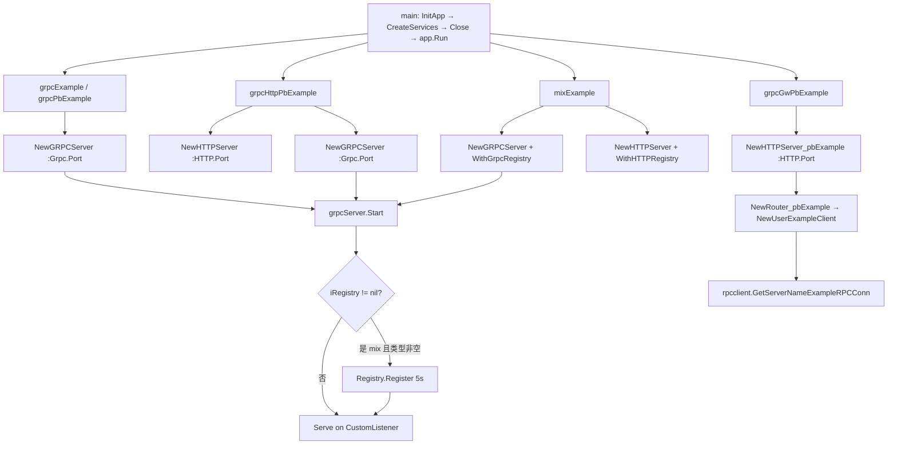
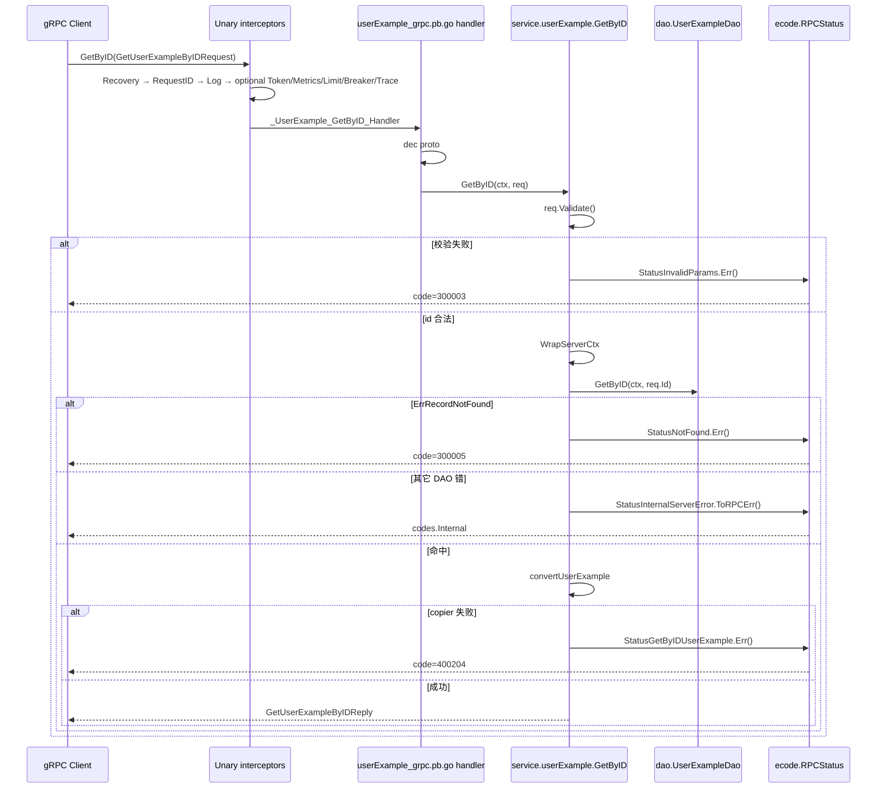

# gRPC 服务、网关与 RPC 客户端

> 状态：待复核生成稿
> 生成日期：2026-08-16
> 基准提交：`23807238c62e0f3b3e2d9a341bbef50547d3f5ec`
> 工作区：dirty
> 源码范围：`cmd/serverNameExample_grpcExample`、`cmd/serverNameExample_grpcPbExample`、`cmd/serverNameExample_grpcHttpPbExample`、`cmd/serverNameExample_grpcGwPbExample`、`cmd/serverNameExample_mixExample` 中与 gRPC 相关的 `main`/`initial`；`internal/server/grpc.go`、`grpc_option.go` 及测试；`internal/service/` 全部变体；`internal/rpcclient/`；`api/serverNameExample/v1/` proto 与生成桩的职责；生成项目对 `pkg/grpc` 的调用与配置绑定
> 生成方式：源码、测试、配置与部署资产静态分析

相关文档：[04-CLI入口命令树与生命周期](04-CLI入口命令树与生命周期.md)（`sponge micro` 命令入口）、[05-代码生成器与模板写入](05-代码生成器与模板写入.md)（`rpc` / `rpc-pb` / `grpc-http-pb` / `rpc-gw-pb` / `rpc-conn` 选哪些模板）、[09-生成项目启动与HTTP请求链](09-生成项目启动与HTTP请求链.md)（HTTP server、Gin handler、与本篇对照的错误出口）、[11-数据层Model-DAO-Cache](11-数据层Model-DAO-Cache.md)（dao/cache 读写细节）、[13-pkg-gRPC与服务注册发现](13-pkg-gRPC与服务注册发现.md)（`pkg/grpc`、`pkg/servicerd` 内部实现）。

## 目录

- [快速摘要](#快速摘要)
- [为什么这样设计（Why）](#为什么这样设计why)
- [它是什么（What）](#它是什么what)
- [代码如何实现（How）](#代码如何实现how)
  - [五种 cmd 入口与 gRPC 相关装配](#五种-cmd-入口与-grpc-相关装配)
  - [gRPC Server 生命周期](#grpc-server-生命周期)
  - [生成项目调用了哪些 pkg/grpc 函数](#生成项目调用了哪些-pkggrpc-函数)
  - [配置字段如何绑定](#配置字段如何绑定)
  - [服务注册、健康检查与拦截器链](#服务注册健康检查与拦截器链)
  - [Proto 与生成桩的职责](#proto-与生成桩的职责)
  - [全部 RPC 方法：校验、DAO、错误码、与 HTTP 差异](#全部-rpc-方法校验dao错误码与-http-差异)
  - [service 文件变体](#service-文件变体)
  - [网关、同进程 HTTP 转调与 RPC 客户端](#网关同进程-http-转调与-rpc-客户端)
- [调用关系表](#调用关系表)
- [对应测试](#对应测试)
- [阅读源码建议顺序](#阅读源码建议顺序)
- [重新实现检查清单](#重新实现检查清单)

---

## 快速摘要

### 架构总览（模块与依赖）

本篇覆盖**被生成 gRPC 服务、HTTP 网关和出站 RPC 客户端**在仓库模板里的全部运行入口。依赖方向固定：

```text
cmd/serverNameExample_{grpc,grpcPb,grpcHttpPb,grpcGw,mix}Example/main.go
  → initial.InitApp / CreateServices / Close
    → pkg/app.App.Run
      → internal/server.grpcServer（实现 app.IServer）     // 纯 gRPC / 双协议 / mix
        → grpc.NewServer + service.RegisterAllService
        → pkg/grpc/{interceptor,gtls,metrics}
      → internal/server.httpServer                         // grpcHttpPb / grpcGw / mix
        → routers.NewRouter_pbExample
          → service.NewUserExampleClient（网关）或 handler 转调本地 service（同进程）
            → internal/rpcclient → pkg/grpc/grpccli.NewClient
      → internal/service.userExample（实现 proto UserExampleServer）
        → dao / cache（细节见 11）
        → ecode.Status*（gRPC status）
```

`pkg/grpc` 的拦截器、TLS、metrics、客户端拨号实现归 [13](13-pkg-gRPC与服务注册发现.md)。本篇只写清生成项目**调用了哪些函数、配置字段如何绑上去**。HTTP 传输、Gin CRUD handler 归 [09](09-生成项目启动与HTTP请求链.md)；本篇每个 RPC 方法都对照 HTTP handler 的差异，但不重复抄写 Gin 绑定细节。

### 核心调用序列（逐步逻辑）

以 `sponge micro rpc` 生成的 SQL/gRPC 服务、一次 unary `GetByID` 为例（生成过程见 [05](05-代码生成器与模板写入.md)）：

1. `cmd/serverNameExample_grpcExample/main.go:main` 调用 `initial.InitApp`：读 `configs/serverNameExample.yml`，初始化 logger / 可选 tracer / 可选 stat / `database.InitDB` / `database.InitCache`。
2. `initial.CreateServices` 用 `cfg.Grpc.Port`（默认 8282）构造 `server.NewGRPCServer(":"+port)`。默认**不**传 `WithGrpcRegistry`（注册代码在源码里被注释）。
3. `NewGRPCServer`：`addHTTPRouter` 挂 `/codes`、`/config`；可选 pprof；`net.Listen("tcp", addr)`；`grpc.NewServer(setOptions()...)`；`service.RegisterAllService(s.server)`。
4. `RegisterAllService` 先 `healthPB.RegisterHealthServer(server, health.NewServer())`，再执行 `registerFns`。`userExample.go` 的 `init` 把 `RegisterUserExampleServer(server, NewUserExampleServer())` 追加进该切片。
5. `pkg/app.New(services, closes).Run` 并发 `Start`。`grpcServer.Start`：若有 registry 则 5s 内 `Register`；若 metrics 已开则 `metrics.Register`；因为 `addHTTPRouter` 总会创建 `mux`，**始终**在 `cfg.Grpc.HTTPPort`（默认 8283）再起一个 HTTP；最后 `metrics.NewCustomListener` 包一层 listener 后 `grpc.Server.Serve` 阻塞。
6. 客户端 unary 进入拦截器链：Recovery → RequestID → Log → 可选 Token/Metrics/Limit/Breaker/Trace。
7. 生成桩 `_UserExample_GetByID_Handler` 解码 `GetUserExampleByIDRequest`，调用 `userExample.GetByID`。
8. `req.Validate()`（protoc-gen-validate）；`interceptor.WrapServerCtx`；`dao.GetByID`；`convertUserExample`；返回 `GetUserExampleByIDReply`。失败分别走 `StatusInvalidParams.Err()` / `StatusNotFound.Err()` / `StatusInternalServerError.ToRPCErr()` / `StatusGetByIDUserExample.Err()`。

网关路径（`grpcGwPbExample`）第 2 步换成 `NewHTTPServer_pbExample`；路由 `init` 调用 `service.NewUserExampleClient()` → `rpcclient.GetServerNameExampleRPCConn()` 懒拨号 → 出站 `UserExampleClient.GetByID`。

### 易错点与边界条件

- `RPCStatus.Err()` 保留自定义数字码（系统级 30000x、业务级 400x0x）；`ToRPCErr()` 才映射成标准 gRPC `codes.Internal` / `InvalidArgument` 等。模板里 **DAO 失败用 `ToRPCErr()`，校验失败和业务失败用 `.Err()`**，客户端看到的 code 族不一样。
- YAML 注释写 token 默认 `appKey=123456`，`grpc.go` 硬编码的是 `defaultTokenAppID="grpc"`、`defaultTokenAppKey="mko09ijn"`。以源码为准。
- `addHTTPRouter` 总会 `s.mux = http.NewServeMux()`，因此辅助 HTTP（`/codes`、`/config`）在 8283 **总会启动**；注释里“仅 pprof 或 metrics 开启才起 HTTP”与实现不一致。
- 流式拦截器里 `StreamServerRequestID` 被注释掉；unary 有 RequestID，stream 没有。JWT 拦截器整段注释。
- `rpcclient` 调用 `grpccli.WithEnableCircuitBreaker()`，但 `pkg/grpc/grpccli` 里客户端熔断拦截器当前是注释状态，该选项对出站 unary **不生效**（实现细节见 13）。服务发现整段同样被注释，默认直连 `host:port`。
- `StatusDeleteByIDUserExample`（以及扩展 API 的 `StatusDeleteByIDsUserExample`、`StatusListByIDsUserExample`、`StatusListByLastIDUserExample`）已定义，**service 方法从未引用**；Delete 类 DAO 失败直接 `StatusInternalServerError.ToRPCErr()`。
- `ListByLastID` **不**调用 `WrapServerCtx`；日志用 `interceptor.CtxRequestIDField`（读 outgoing metadata），与其它方法的 `ServerCtxRequestIDField`（incoming）不一致。
- `grpcPbExample` / `grpcHttpPbExample` 的 `InitApp` 把 `database.InitDB` 注释掉；骨架可以起来，但若直接套用本仓库的 `userExample.go`（它在 `NewUserExampleServer` 里 `database.GetDB()`）会在注册时 panic。proto 骨架的业务实现要等 `make proto` 生成后再填。
- 本篇未运行测试套件；测试结论来自阅读 `*_test.go`，不宣称测试通过。`userExample_client_test.go` 在 `sponge micro rpc` 的 `selectFiles` 里被注释掉，默认不会拷进生成项目。

---

## 为什么这样设计（Why）

Sponge 要用同一份业务（一张表或一份 proto）长出纯 gRPC、同进程双协议、以及只做 HTTP 反向代理的网关。如果每种形态各写一套 server 与客户端，模板会爆炸。所以：

1. **main 仍然只做四步**（与 [09](09-生成项目启动与HTTP请求链.md) 相同）：`InitApp` → `CreateServices` → `Close` → `app.New(...).Run()`。差异只在 CreateServices 往 `[]app.IServer` 里塞了 gRPC、HTTP，还是两者都有。
2. **传输与业务解耦**。gRPC 传输由 `grpc.Server` + 生成桩 `UserExampleServer` 承担；业务在 `internal/service`。HTTP 网关实现同一个 `UserExampleLogicer` 接口，但内部是出站 `UserExampleClient`。同进程双协议则用 `handler/userExample.go.service` 把 HTTP Logicer **直接转调**本地 `UserExampleServer`，不走网络。
3. **拦截器全部用配置开关**，避免用户改 `grpc.go` 才能打开 metrics / 限流 / 熔断 / trace / token。Recovery、RequestID、Log 始终开，因为排障成本高于性能。
4. **错误码分两套出口**。自定义数字码（`Err()`）给网关/多语言客户端做业务判断；`ToRPCErr()` 给只认标准 gRPC codes 的中间件（熔断默认认 `codes.Internal`）。这是有意的，不是笔误。
5. **文件后缀是生成器开关**，不是运行时多态：`.tpl` 非标准主键、`.exp` 扩展 API、`.mgo` Mongo、`userExample_logic.go` 网关客户端。运行期每个生成项目只保留被选中的那一份。选文件的规则在 [05](05-代码生成器与模板写入.md)。

必须保持的行为契约：进程收到 SIGINT/SIGTERM 后按 Close 切片顺序 `GracefulStop` gRPC、再关辅助 HTTP；健康检查服务始终注册；校验失败返回 `StatusInvalidParams`；记录不存在返回 `StatusNotFound`。可以替换的实现：拦截器换成别的、registry 换成别的客户端、service 不经过 copier 而手写字段。

---

## 它是什么（What）

仓库里的 `cmd/serverNameExample_*`、`internal/{server,service,rpcclient,ecode}`、`api/serverNameExample/v1` 是**带占位符的示例模板**。`sponge micro rpc` 等命令把它们复制到输出目录，并把 `serverNameExample` / `userExample` 换成真实名字。本仓库直接 `go run` 这些 cmd 也能跑，因为占位符本身就是合法 Go 标识符。

| 模板目录 | CLI（见 04/05） | 本进程有哪些 server | 业务实现从哪来 |
|---|---|---|---|
| `cmd/serverNameExample_grpcExample` | `sponge micro rpc` | 仅 `NewGRPCServer` | SQL → 拷贝 `internal/service/userExample.go`（及 `.tpl`/`.exp`/`.mgo`） |
| `cmd/serverNameExample_grpcPbExample` | `sponge micro rpc-pb` | 仅 `NewGRPCServer` | proto → `make proto` 用 `protoc-gen-go-rpc-tmpl` 生成 service 骨架 |
| `cmd/serverNameExample_grpcHttpPbExample` | `sponge micro grpc-http-pb` | `NewHTTPServer` **和** `NewGRPCServer` | proto → rpc-tmpl + gin `plugin=mix`；HTTP 侧可用 `.service` 转调本地 gRPC service |
| `cmd/serverNameExample_grpcGwPbExample` | `sponge micro rpc-gw-pb` | 仅 `NewHTTPServer_pbExample`（**没有** gRPC listen） | proto → gin `plugin=service`；`userExample_logic.go` 出站 RPC |
| `cmd/serverNameExample_mixExample` | 仓库内带注册中心的双协议示例，不是单独一条 CLI | `NewHTTPServer` **和** `NewGRPCServer`，且 **真正调用** `registerService` | HTTP 同 httpExample；gRPC 同 grpcExample |

三种业务适配器（生成时只留一条）：

| 角色 | 代表文件 | 实现的接口 | 下游 |
|---|---|---|---|
| gRPC 服务端 | `internal/service/userExample.go`（及变体） | `v1.UserExampleServer` | dao |
| 网关客户端 | `internal/service/userExample_logic.go` | `v1.UserExampleLogicer` | `v1.UserExampleClient` → `rpcclient` |
| 同进程 HTTP 转调 | `internal/handler/userExample.go.service` | `v1.UserExampleLogicer` | 本地 `service.NewUserExampleServer()` |

`internal/server/grpc.go` **没有** `.noregistry` 变体（对比 HTTP 的 `http.go.noregistry`）。有无注册中心只取决于 CreateServices 是否传入 `WithGrpcRegistry`。

---

## 代码如何实现（How）

### 五种 cmd 入口与 gRPC 相关装配

五个 `main` 都是同一段四步，包路径不同：

```go
initial.InitApp()
services := initial.CreateServices()
closes := initial.Close(services)
app.New(services, closes).Run()
```

`mixExample` 的 `main` 多了 swag 注释（`@host localhost:8080`），与 gRPC 行为无关。

#### InitApp 差异

| 入口 | 读配置 | 连库 | gRPC 客户端 | 其它 |
|---|---|---|---|---|
| `grpcExample` | 本地 yml；`-c`、`-version` | **调用** `database.InitDB` + `InitCache` | 无 | logger / 可选 tracer、stat |
| `grpcPbExample` | 本地 yml；`-c`、`-version` | **整段注释** | 无 | logger / 可选 tracer、stat |
| `grpcHttpPbExample` | 本地 yml；`-c`、`-version` | **整段注释** | 无 | logger / 可选 tracer、stat |
| `grpcGwPbExample` | 本地 yml；`-c`、`-version` | 无 database import | `rpcclient.NewServerNameExampleRPCConn()` **是注释示例**；真正拨号在首次 `GetServerNameExampleRPCConn` | logger / 可选 tracer、stat |
| `mixExample` | 额外 `-enable-cc`：true 时读 `serverNameExample_cc.yml`，经 `nacoscli.GetConfig` + `conf.ParseConfigData` 再 `config.Set`；false 时本地 yml | **调用** InitDB + InitCache | 无 | logger / 可选 tracer、stat |

`initConfig` 失败一律 `panic`。`version != ""` 时覆盖 `config.Get().App.Version`。默认配置文件 `configs.Location("serverNameExample.yml")`。

#### CreateServices 差异

| 入口 | HTTP | gRPC | 注册中心 |
|---|---|---|---|
| `grpcExample` / `grpcPbExample` | 无 | `NewGRPCServer(":"+cfg.Grpc.Port)` | `registerService` **整函数注释**；`WithGrpcRegistry` 调用也注释 |
| `grpcHttpPbExample` | `NewHTTPServer(":"+cfg.HTTP.Port, WithHTTPIsProd(Env=="prod"), WithHTTPTLS(HTTP.TLS))` | `NewGRPCServer(":"+cfg.Grpc.Port)` | `registerService` 整函数注释；HTTP 的 `WithHTTPRegistry` 与 gRPC 的 `WithGrpcRegistry` 调用都注释 |
| `grpcGwPbExample` | `NewHTTPServer_pbExample(...)`（注意带 `_pbExample` 后缀） | **无** | HTTP registry 注释 |
| `mixExample` | `NewHTTPServer` + `WithHTTPRegistry(registerService("http", host, HTTP.Port))` | `NewGRPCServer` + `WithGrpcRegistry(registerService("grpc", host, Grpc.Port))` | **生效**。`id = Name_scheme_host_port`，endpoint `scheme://host:port`。`RegistryDiscoveryType` 为 `consul`/`etcd`/`nacos` 之一才构造 registry；空字符串则返回 `nil, nil`，后续 Start 跳过 Register |

被注释的 `registerService` 与 mixExample 生效版逻辑相同：`consul.NewRegistry(cfg.Consul.Addr, id, name, endpoints)` / `etcd.NewRegistry(cfg.Etcd.Addrs, ...)` / `nacos.NewRegistry(IPAddr, Port, NamespaceID, ...)`。构造失败 `panic`。细节见 13。

#### Close 差异

共同：先把每个 `IServer.Stop` 放进切片，可选 `tracer.Close`（2s），最后 `logger.Sync`。

| 入口 | 关库 | 关 Redis | 关 RPC 连接 |
|---|---|---|---|
| `grpcExample` / `mixExample` | `database.CloseDB` | `CacheType=="redis"` 时 `CloseRedis` | 无 |
| `grpcPbExample` / `grpcHttpPbExample` | 注释 | 注释 | 无 |
| `grpcGwPbExample` | 无 | 无 | `rpcclient.CloseServerNameExampleRPCConn()` **是注释示例** |

`grpcServer.Stop`：若有 registry，2s 内 goroutine `Deregister` 并 `cancel`，主 goroutine `<-ctx.Done()` 后 `GracefulStop`；再 3s `httpServer.Shutdown`。Deregister 错误被丢弃。



---

### gRPC Server 生命周期

`internal/server/grpc.go` 的 `grpcServer` 实现 `app.IServer`（`Start` / `Stop` / `String`）。

| 字段 | 谁赋值 | 职责 |
|---|---|---|
| `addr` | `NewGRPCServer` 参数 | `String()` 打印 |
| `listen` | `net.Listen("tcp", addr)`，失败 panic | 真正 accept |
| `server` | `grpc.NewServer(setOptions()...)` | 拦截器 + 业务服务 |
| `mux` / `httpServer` | `addHTTPRouter` 必建 mux；`Start` 里起 `http.Server`，`IdleTimeout=60s` | `/codes`、`/config`、可选 `/metrics`、pprof |
| `registerMetricsMuxAndMethodFunc` | unary 里若 `App.EnableMetrics` 则赋为 `registerMetricsMuxAndMethod` | `Start` 时 `metrics.Register(mux, grpcServer)` |
| `iRegistry` / `instance` | `WithGrpcRegistry` | Start Register / Stop Deregister |

`NewGRPCServer` 顺序：

1. `defaultGrpcOptions()`：registry 为 nil。
2. `o.apply(opts...)`。
3. `addHTTPRouter()`：`errcode.ListGRPCErrCodes` → `GET /codes`；`errcode.ShowConfig([]byte(config.Show()))` → `GET /config`。
4. `App.EnableHTTPProfile` 为 true 时 `prof.Register(mux, prof.WithIOWaitTime())`。
5. `net.Listen`。
6. `grpc.NewServer(setOptions()...)`。`setOptions`：先 `secureServerOption()`（非 nil 才 append），再 unary、再 stream。
7. `service.RegisterAllService(s.server)`。
8. 返回 `*grpcServer`（作为 `app.IServer`）。

`Start` 用 `metrics.NewCustomListener(s.listen, WithConnectionsLogger(logger.Get()), WithConnectionsGauge())` 包一层再 `Serve`。连接数指标的实现见 13。`Serve` 返回的 error 向上交给 `app.Run`。辅助 HTTP 的 `ListenAndServe` 在独立 goroutine，非 `ErrServerClosed` 则 **panic**（不会变成 Start 的返回值）。

`grpc_option.go` 只有一个选项：

```go
func WithGrpcRegistry(iRegistry registry.Registry, instance *registry.ServiceInstance) GrpcOption
```

没有 TLS/拦截器 option——那些全部读 `config.Get()`。

---

### 生成项目调用了哪些 pkg/grpc 函数

生成项目**不**调用 `pkg/grpc/server.Run`、`pkg/grpc/client.NewClient`（那是更底层的另一套封装，见 13）。模板绑定的是下面这张表。

#### 服务端（`internal/server/grpc.go`）

| 调用方 | 调用 | 配置/参数 | 作用（细节归 13） |
|---|---|---|---|
| `secureServerOption` | `gtls.GetServerTLSCredentials(CertFile, KeyFile)` | `Grpc.ServerSecure.Type=="one-way"` | 单向 TLS，`grpc.Creds` |
| `secureServerOption` | `gtls.GetServerTLSCredentialsByCA(CaFile, CertFile, KeyFile)` | `Type=="two-way"` | mTLS |
| `unaryServerOptions` | `interceptor.UnaryServerRecovery` | 始终 | panic → gRPC Internal |
| `unaryServerOptions` | `interceptor.UnaryServerRequestID` | 始终 | 无 request_id 则生成 10 位随机串写入 incoming metadata |
| `unaryServerOptions` | `interceptor.UnaryServerLog(logger.Get(), WithReplaceGRPCLogger())` | 始终 | 可换成 `UnaryServerSimpleLog`（注释提示） |
| `unaryServerOptions` | `interceptor.UnaryServerToken(checkToken)` | `Grpc.EnableToken` | 校验 metadata `app_id`/`app_key` |
| `unaryServerOptions` | `interceptor.UnaryServerMetrics` | `App.EnableMetrics` | Prometheus interceptor |
| `unaryServerOptions` | `interceptor.UnaryServerRateLimit()` | `App.EnableLimit` | 自适应限流；窗口/桶/CPU 阈值注释掉，用包默认 |
| `unaryServerOptions` | `interceptor.UnaryServerCircuitBreaker(WithValidCode(StatusInternalServerError.Code(), StatusServiceUnavailable.Code()))` | `App.EnableCircuitBreaker` | 额外把自定义码 300013/300014 算入熔断；默认已含 `codes.Internal`/`Unavailable` |
| `unaryServerOptions` | `interceptor.UnaryServerTracing` | `App.EnableTrace` | 见 13 |
| `streamServerOptions` | `StreamServerRecovery`、`StreamServerLog`、可选 Token/Metrics/RateLimit/CircuitBreaker/Tracing | 与 unary 对应开关 | **没有** Stream RequestID（源码注释掉） |
| `Start` | `metrics.NewCustomListener` + `WithConnectionsLogger` + `WithConnectionsGauge` | 始终 | 连接数 |
| `registerMetricsMuxAndMethod` | `metrics.Register(mux, server)` | EnableMetrics | `/metrics` + `InitializeMetrics` |
| JWT | `UnaryServerJwtAuth` / `StreamServerJwtAuth` | **整段注释** | 未启用 |

Token 闭包：`appID != "grpc" || appKey != "mko09ijn"` → `status.Errorf(codes.Unauthenticated, "app id or app key checksum failure")`。注释写应从 cache/db 取，模板未实现。

熔断注意：DAO 失败走 `ToRPCErr()` → `codes.Internal`（13），靠拦截器**默认**集合触发；`WithValidCode(300013)` 覆盖的是有人直接 `StatusInternalServerError.Err()`、未转标准码的路径。

#### 客户端（`internal/rpcclient/serverNameExample.go` 与 `service_test.go:getRPCClientConnForTest`）

| 调用方 | 调用 | 绑定字段 |
|---|---|---|
| `NewServerNameExampleRPCConn` | `grpccli.NewClient(endpoint, opts...)` | `endpoint = Host:Port`（发现未启用时） |
| 始终 | `grpccli.WithEnableRequestID()` | 无配置，硬开 |
| 始终 | `grpccli.WithEnableLog(logger.Get())` | 无配置，硬开。`grpccli` 内部 unary 实际再用一次 `logger.Get()`，见 13 |
| 始终 | `grpccli.WithSecure(Type, ServerName, CaFile, CertFile, KeyFile)` | `GrpcClient[i].ClientSecure` |
| 始终 | `grpccli.WithToken(Enable, AppID, AppKey)` | `GrpcClient[i].ClientToken`；Enable=false 时 grpccli 不挂 `interceptor.ClientTokenOption` |
| 可选 | `grpccli.WithEnableTrace()` | `App.EnableTrace` |
| 可选 | `grpccli.WithEnableCircuitBreaker()` | `App.EnableCircuitBreaker`；**grpccli 内对应拦截器当前注释，不生效** |
| 可选 | `grpccli.WithEnableMetrics()` | `App.EnableMetrics` |
| 可选 | `grpccli.WithTimeout(time.Second * Timeout)` | `GrpcClient[i].Timeout > 0`；这是 unary **请求**超时，不是 dial 超时 |
| 注释掉 | `discoverService` → `grpccli.WithDiscovery` + `WithEnableLoadBalance` | `GrpcClient[i].RegistryDiscoveryType` |

`grpccli.NewClient` 内部会再调 `gtls.GetClientTLSCredentials` / `GetClientTLSCredentialsByCA`、`interceptor.UnaryClientRecovery` 等，见 13。生成项目不直接 import 那些符号。

测试辅助 `getRPCClientConnForTest` **不**开 Trace/Metrics/CircuitBreaker；超时/TLS/Token/RequestID/Log 与生产客户端相同。匹配配置的优先级：调用方传入的 `config.GrpcClient` > yaml 里 `Name == App.Name` 的那一项 > 用 `App.Host` + `Grpc.Port` + `App.RegistryDiscoveryType` 拼默认。

压测：`userExample_client_test.go:Test_service_userExample_benchmark` 调 `pkg/grpc/benchmark.New(host, protoFile, method, message, dependentProtoFilePath, total).Run()`。这不是运行时路径。

---

### 配置字段如何绑定

来源：`configs/serverNameExample.yml` → `config.Init` → `internal/config.Config`。结构体字段在 `internal/config/serverNameExample.go`。

| YAML 路径 | Go 字段 | 谁读 | 默认（yml） | 行为 |
|---|---|---|---|---|
| `grpc.port` | `Grpc.Port` | CreateServices 拼 listen 地址；测试客户端回退 | 8282 | gRPC listen |
| `grpc.httpPort` | `Grpc.HTTPPort` | `Start` 辅助 HTTP | 8283 | `/codes` `/config` `/metrics` pprof |
| `grpc.enableToken` | `Grpc.EnableToken` | unary/stream Token 拦截器 | false | 与 yaml 注释中的 123456 **无关** |
| `grpc.serverSecure.type/caFile/certFile/keyFile` | `Grpc.ServerSecure` | `secureServerOption` | type="" | `""` insecure；`one-way` 只要 cert/key；`two-way` 三者都要。文件读失败 panic |
| `grpcClient[].name` | `GrpcClient.Name` | rpcclient 用 `strings.EqualFold` 匹配 `"serverNameExample"` | `serverNameExample` | 找不到则 panic，提示往 yaml 的 `grpcClient` 加项 |
| `grpcClient[].host/port` | Host/Port | 直连 endpoint | 127.0.0.1:8282 | |
| `grpcClient[].timeout` | Timeout 秒 | `WithTimeout` | 0 = 不设 unary 超时 | |
| `grpcClient[].registryDiscoveryType` | | 发现函数注释掉，**当前不读** | `""` | |
| `grpcClient[].clientSecure.*` | | `WithSecure` | type="" | |
| `grpcClient[].clientToken.*` | | `WithToken` | enable=false | |
| `app.enableMetrics` | | 服务端 Metrics 拦截器 + `metrics.Register`；客户端 `WithEnableMetrics` | true | |
| `app.enableHTTPProfile` | | `registerProfMux` | false | |
| `app.enableLimit` | | RateLimit 拦截器 | false | |
| `app.enableCircuitBreaker` | | 服务端 Breaker；客户端选项（当前 no-op） | false | |
| `app.enableTrace` | | Tracing 拦截器；客户端 `WithEnableTrace` | false | 为 true 时 InitApp 还要 `tracer.InitWithConfig` + Jaeger |
| `app.registryDiscoveryType` | | 仅 mixExample `registerService` switch；grpcExample 里该函数被注释 | `""` | |
| `app.env` | | 只影响同进程 HTTP 的 `WithHTTPIsProd`，**不**改变 gRPC | dev | |
| `http.port` / `http.tls` | | 仅 grpcHttp / grpcGw / mix 的 HTTP server | 8080 | 见 09 |

`app.cacheType`、数据库 DSN 影响 `NewUserExampleServer` 能否拿到 DB，不改变 gRPC 传输。

---

### 服务注册、健康检查与拦截器链

`internal/service/service.go`：

```go
var registerFns []func(server *grpc.Server)

func RegisterAllService(server *grpc.Server) {
    healthPB.RegisterHealthServer(server, health.NewServer())
    for _, fn := range registerFns {
        fn(server)
    }
}
```

每个业务文件的 `init` 往 `registerFns` 追加一次 `RegisterXxxServer`。`health.NewServer()` 默认全部服务 SERVING，模板没有调用 `SetServingStatus`。gRPC 健康检查协议路径是 `grpc.health.v1.Health/Check`，与 HTTP `/ping` 不是同一件事。

`userExample.go` 的注册：

```go
func init() {
    registerFns = append(registerFns, func(server *grpc.Server) {
        serverNameExampleV1.RegisterUserExampleServer(server, NewUserExampleServer())
    })
}
```

`NewUserExampleServer` **在注册时就** `database.GetDB()` + `cache.NewUserExampleCache(database.GetCacheType())`。这就是 grpcPb 骨架把 InitDB 注释掉之后不能直接用这份 userExample.go 的原因：`RegisterAllService` 发生在 `NewGRPCServer`，早于 Serve，DB 未初始化会 panic。



Unary 拦截器顺序（源码 append 顺序，先注册的先执行）：

1. Recovery  
2. RequestID  
3. Log  
4. Token（开关）  
5. Metrics（开关）  
6. RateLimit（开关）  
7. CircuitBreaker（开关）  
8. Tracing（开关）  

---

### Proto 与生成桩的职责

不要逐行抄 `*.pb.go`。契约如下。

`api/serverNameExample/v1/userExample.proto`（包 `api.serverNameExample.v1`，`go_package` 指向本模块）定义 service `userExample` 五个 unary RPC，并带 `google.api.http` 与 openapiv2，所以同一份 proto 既能生成 gRPC 也能生成 Gin 路由 / swagger：

| RPC | HTTP | 请求 | 关键 validate / tagger |
|---|---|---|---|
| `Create` | `POST /api/v1/userExample` body `*` | `CreateUserExampleRequest` | name min_len=2；email；password min_len=10；phone `^1[3456789]\d{9}$`；avatar uri；age 0–120；gender `defined_only` |
| `DeleteByID` | `DELETE /api/v1/userExample/{id}` | `DeleteUserExampleByIDRequest` | id `uint64.gte=1`，`uri:"id"` |
| `UpdateByID` | `PUT /api/v1/userExample/{id}` body `*` | `UpdateUserExampleByIDRequest` | 仅 id 有 gte=1；其余字段无 validate |
| `GetByID` | `GET /api/v1/userExample/{id}` | `GetUserExampleByIDRequest` | 同 Delete id |
| `List` | `POST /api/v1/userExample/list` body `*` | `ListUserExampleRequest` | `params` message.required |

`CreateUserExampleReply` 只有 `uint64 id`。Mongo 变体会把这里改成 string（生成器 `adjustmentOfIDType`，见 05/06），本仓库默认 proto 仍是 uint64。

扩展 API **不在**这份默认 proto 里。`.exp` service 引用的 `DeleteUserExampleByIDsRequest` 等类型，要靠生成器在 proto 锚点插入，或用户手写后再 `make proto`。

四个生成文件的分工：

| 文件 | 生成器 | 本项目依赖的符号 |
|---|---|---|
| `userExample.pb.go` | `protoc-gen-go` | message 结构体、`GenderType` 枚举、getter |
| `userExample.pb.validate.go` | `protoc-gen-validate` | 每个 Request 的 `Validate()` / `ValidateAll()`；`m==nil` 时 Validate 返回 nil |
| `userExample_grpc.pb.go` | `protoc-gen-go-grpc` | `UserExampleClient` / `UserExampleServer` / `UnimplementedUserExampleServer` / `RegisterUserExampleServer` / `UserExample_ServiceDesc`；FullMethod 如 `/api.serverNameExample.v1.userExample/GetByID` |
| `userExample_router.pb.go` | `protoc-gen-go-gin` | `UserExampleLogicer`（与 Server 同签名、无 mustEmbed）；`RegisterUserExampleRouter`；`WithUserExampleRPCResponse` 把 `isFromRPC=true` |

桩 handler 在有 interceptor 时构造 `grpc.UnaryServerInfo{FullMethod: ...}` 再调业务。`Unimplemented*` 返回 `codes.Unimplemented`。模板 struct 必须嵌入 `UnimplementedUserExampleServer`，编译期 `var _ UserExampleServer = (*userExample)(nil)` 卡住漏方法。

网关路由 `RegisterUserExampleRouter`：JSON/URI/Query 绑定失败走 `iResponse.ParamError`；业务 error 若是 `errcode.SkipResponse` 则不再写响应（`systemCode_rpc.go` 的 `StatusSkipResponse` 只给这种场景）；`WithUserExampleRPCResponse` 让 Responser 按 RPC status 映射 HTTP。`userExample_router.go` 还把 Gin RequestID 放进 outgoing metadata，并预留 Authorization 注释。

---

### 全部 RPC 方法：校验、DAO、错误码、与 HTTP 差异

共通前置（标准 5 个方法 + 扩展里除 `ListByLastID` 外）：

1. `req.Validate()` 失败 → `logger.Warn` + `return nil, ecode.StatusInvalidParams.Err()`（**不** `ToRPCErr`，客户端看到 300003）。
2. `ctx = interceptor.WrapServerCtx(ctx)`：把 incoming metadata 的 `request_id` 写入 `context.Value`，供 dao/logger 使用。
3. 成功返回对应 `*Reply`，error 为 nil。gRPC 成功没有 `{code:0}` 包一层。

系统级码在 `internal/ecode/systemCode_rpc.go`，是 `pkg/errcode.Status*` 的别名。业务码在 `userExample_rpc.go`：`RCode(2)+n` → 400200+n（Create=400201 … List=400205）。`.exp` 的 NO=37 → 403700+n。HTTP 对照码在 `userExample_http.go`：`HCode(1)+n` → 200101 起，见 09。

`Err()` vs `ToRPCErr()`（`pkg/errcode/rpc_error.go`，本篇只记生成项目怎么用）：

| 模板写法 | 实际 gRPC code | 典型场景 |
|---|---|---|
| `StatusInvalidParams.Err()` | 300003 | Validate 失败；List 的 `query params error:` |
| `StatusNotFound.Err()` | 300005 | `database.ErrRecordNotFound` |
| `StatusCreateUserExample.Err()` 等 | 400201 等 | copier 失败 |
| `StatusInternalServerError.ToRPCErr()` | `codes.Internal`（13），message 默认 `"Internal"` | DAO 失败 |
| `StatusInternalServerError.Err()` | 300013 | 模板**没用**这条；熔断 `WithValidCode` 却加了它 |

HTTP Gin CRUD（[09](09-生成项目启动与HTTP请求链.md) 族 A）对照原则：HTTP 业务错是 **HTTP 200 + body.code**；系统错才 HTTP 500。gRPC 没有 HTTP 状态码，网关用 `WithUserExampleRPCResponse` 再映射。

#### Create

| 步骤 | gRPC `userExample.go` | HTTP `handler/userExample.go`（09） |
|---|---|---|
| 校验 | `req.Validate()`：proto 规则（password **只** min_len=10，phone 中国大陆 11 位，age **含 0 和 120**，gender 枚举 defined_only） | `ShouldBindJSON` + binding：password **md5**，phone **e164**，age **gt=0,lt=120**（不含 0/120），avatar min=5 不是 uri |
| 转换 | `copier.Copy` 到 `model.UserExample` | `copier.Copy` 到 `model.UserExample`，源是 `types.CreateUserExampleRequest` |
| DAO | `iDao.Create(ctx, record)` | `iDao.Create(ctx, userExample)` |
| 成功 | `{Id: record.ID}`；Mongo `.mgo` 为 `record.ID.Hex()`（string） | `response.Success({id})`；Mongo 成功体是 ObjectID，GetByID 才 Hex |
| copier 失败 | `StatusCreateUserExample.Err()`（400201） | `response.Error(ErrCreateUserExample)`（200101，HTTP 200） |
| DAO 失败 | `StatusInternalServerError.ToRPCErr()` | `response.Output(InternalServerError.ToHTTPCode())` → HTTP 500 |

gRPC Create **没有** HTTP 那种“绑定失败仍 HTTP 200”的包络；Validate 失败直接 status error。网关路径上，Gin 先 `ShouldBindJSON`，失败是 `ParamError`，不一定再进 `Validate`。

#### DeleteByID

| 步骤 | gRPC | HTTP |
|---|---|---|
| 校验 | Validate：`id >= 1`。id=0 必失败 | SQL：`getUserExampleIDFromPath`，id==0 → InvalidParams；**Mongo HTTP 不校验空 id** |
| DAO | `DeleteByID(ctx, req.Id)` | `DeleteByID(ctx, id)`（id 来自 path） |
| 业务码 | `StatusDeleteByIDUserExample` **从未使用** | `ErrDeleteByIDUserExample` **从未使用** |
| DAO 失败 | `ToRPCErr()` Internal | HTTP 500 |
| 成功 | 空 `DeleteUserExampleByIDReply` | `response.Success` 空 data |

两边都是“删失败当系统错误”，没有 NotFound。记录不存在时 DAO 行为见 11。

#### UpdateByID

| 步骤 | gRPC | HTTP |
|---|---|---|
| 校验 | 仅 id gte=1；name/email 等**无** validate，允许部分更新 | path id + `ShouldBindJSON`；字段 `binding:""` |
| 转换 | copier 后 **强制** `record.ID = req.Id`（SQL）；Mongo `record.ID = database.ToObjectID(req.Id)` | SQL `form.ID = id` 再 copier；Mongo 不写 form.ID，copier 后赋 oid |
| copier 失败 | `StatusUpdateByIDUserExample.Err()` | `ErrUpdateByIDUserExample` HTTP 200 |
| DAO | `UpdateByID`；失败 `ToRPCErr()` | HTTP 500 |

#### GetByID

| 步骤 | gRPC | HTTP |
|---|---|---|
| 校验 | id gte=1 | path id；SQL abort 0；Mongo HTTP 仍走 ToObjectID，零值 InvalidParams |
| DAO | `GetByID` | `h.iDao.GetByID(ctx, id)` |
| 不存在 | `StatusNotFound.Err()`（300005，**不是** `codes.NotFound`） | `response.Error(NotFound)`（100004，HTTP 200） |
| 其它 DAO 错 | `ToRPCErr()` Internal | HTTP 500 |
| 转换 | `convertUserExample`：copier model→proto `UserExample`；Mongo 再 `value.Id = record.ID.Hex()` | copier 到 `types.UserExampleObjDetail` |
| 转换失败 | `StatusGetByIDUserExample.Err()`（400204） | `ErrGetByIDUserExample`（200104，HTTP 200） |
| 成功 | `{UserExample: data}` | `{userExample: data}` JSON 包络 |

网关把 300005 映射成哪一个 HTTP 状态，由 `errcode.NewResponser(isFromRPC=true)` 决定，见 13/09；不要假设等于 REST 404。

#### List

| 步骤 | gRPC | HTTP 族 A | HTTP Protobuf Logicer（09 族 B） |
|---|---|---|---|
| 校验 | `params` required；params 内部字段靠后续 DAO | JSON `types.Params` | `req.Validate()` |
| 转换 | copier `req.Params` → `query.Params`（SQL 用 `pkg/sgorm/query`；Mongo 用 `pkg/mgo/query`） | 直接用 types | 同 gRPC |
| copier 失败 | `StatusListUserExample.Err()` | 无这步 | `ErrListUserExample.Err()` |
| DAO | `GetByColumns` | `GetByColumns` | `GetByColumns` |
| `query params error:` | **Warn + `StatusInvalidParams.Err()`** | 族 A **没有**这分支，一律 500 | 有，InvalidParams |
| 其它 DAO 错 | `ToRPCErr()` | HTTP 500 | `InternalServerError.Err()`（族 B 用 `.Err()` 不是 ToRPCErr） |
| 单条 convert 失败 | **Warn + continue 跳过**，不失败整次 | 族 A List 失败处理见 09 | 同 gRPC，continue |
| 成功 | `{Total, UserExamples}` | `{total, userExamples}` | 同 gRPC message |

#### DeleteByIDs（仅 `.exp` / `.mgo.exp` / `.exp.tpl`）

- 校验：`req.Validate()`。
- DAO：`DeleteByIDs(ctx, req.Ids)`。日志字符串仍是 `"DeleteByID error"`（少一个 s）。
- 失败：`ToRPCErr()`。`StatusDeleteByIDsUserExample` / `.exp.tpl` 的 `StatusDeleteBy{ColumnNamePlural}{Table}` **未使用**。
- HTTP 扩展 API 同样不引用 `ErrDeleteByIDsUserExample`（09）。
- `.exp.tpl` 方法名是 `DeleteBy{{.ColumnNamePluralCamel}}`，参数 `req.Ids` 或 `req.{Column}s` 取决于是否标准主键。

#### GetByCondition（仅扩展变体）

- 校验：Validate；再把 `req.Conditions.GetColumns()` **逐列** copier 到 `query.Column`（错误丢弃 `_ = copier.Copy`），`conditions.CheckValid()` 失败 → `StatusInvalidParams.Err()`。
- DAO：`GetByCondition`。
- 不存在：`StatusNotFound.Err()`。
- 其它 DAO：`ToRPCErr()`。
- 转换失败：`StatusGetByConditionUserExample.Err()`（403707 当 NO=37）。
- HTTP 族 A 扩展：`CheckValid` 同样 InvalidParams；convert 失败用 `ErrGetByIDUserExample`（09 记录族 B 条件查询日志仍写 GetByID）。gRPC 日志是 `"GetByCondition error"`。

#### ListByIDs（仅扩展变体）

- DAO：`GetByIDs` 得 `map[id]*model`。
- **按 `req.Ids` 顺序**遍历，map 没有的 id **静默跳过**，不 NotFound。
- 单条 convert 失败：`ToRPCErr()` **整次失败**（与 List 的 continue 相反）。`StatusListByIDsUserExample` 未使用。
- HTTP 族 A：convert 失败用 `ErrListUserExample`（业务码），不是 500。
- `.exp.tpl` 方法名 `ListBy{{.ColumnNamePluralCamel}}`，dao 为 `GetBy{{.ColumnNamePluralCamel}}`。

#### ListByLastID（仅扩展变体）

| 变体 | lastID 空值 | 其它 |
|---|---|---|
| `.exp`（SQL uint） | `==0` → `math.MaxInt32`（**不是** MaxUint64） | `Limit==0` → 10 |
| `.mgo.exp` | `==""` → `database.MaxObjectID` | `Limit==0` → 10 |
| `.exp.tpl` 字符串主键 | `==""` → `"zzzzzzzzzzzzzzzzzzzzzzzzzzzzzzzzzzz"` | `Limit==0` → 10 |
| `.exp.tpl` 非字符串 | `==0` → `math.MaxInt32` | `Limit==0` → 10 |

- **不**调用 `WrapServerCtx`。
- Validate 失败日志用 `interceptor.CtxRequestIDField`（outgoing），DAO 失败日志同样。其它方法用 `ServerCtxRequestIDField`。
- DAO：`GetByLastID(ctx, lastID, int(limit), sort)`。
- 单条 convert 失败：continue。
- `StatusListByLastIDUserExample` 未使用；DAO 失败 `ToRPCErr()`。
- HTTP 对照见 09：SQL lastID==0 同样改成 MaxInt32。

`convertUserExample`（及 tpl 的 `convert{{Table}}`）：copier model → proto。Mongo 变体额外 `value.Id = record.ID.Hex()`。失败只返回 err，由调用方决定 Err() 还是 continue。

---

### service 文件变体

生成器一次只发出一份，文件名最终都叫 `userExample.go`。本仓库同时保留全部后缀供替换。

| 文件 | 何时选用（见 05 `rpc.go` / `service.go`） | 相对标准 `userExample.go` 的差异 |
|---|---|---|
| `userExample.go` | `micro rpc` 标准主键 SQL | 上文标准 5 方法；`database.GetDB()` |
| `userExample.go.tpl` | 非标准主键 / common style | 类型名 `{{.TableNameCamel}}`；方法 `DeleteBy{{.ColumnNameCamel}}`；Create 回写 `record.{{.ColumnNameCamel}}`；标准主键时 JSON 字段仍叫 `Id` |
| `userExample.go.exp` | `--extended-api` SQL 标准主键 | 标准 5 方法 + DeleteByIDs / GetByCondition / ListByIDs / ListByLastID |
| `userExample.go.exp.tpl` | extended + 非标准主键 | 扩展方法名随主键复数变化；ListByLast 空值分字符串/数值 |
| `userExample.go.mgo` | Mongo 非 extended | `pkg/mgo/query`；`GetDB().Collection(TableName())`；Create 回 `Hex()`；Update 用 `ToObjectID`；convert 写 Hex |
| `userExample.go.mgo.exp` | Mongo + extended | mgo 标准 5 方法 + 四条扩展；ListByLastID 空字符串 → `MaxObjectID` |
| `userExample_logic.go` | 网关 / `plugin=service` | **不**实现 Server，实现 Logicer；不碰 dao |
| `service.go` | 所有 gRPC 工程 | 只含 `registerFns` + 健康检查 |
| `userExample_client_test.go` 及 `.exp` `.mgo` `.mgo.exp` | 默认 **不**随 `micro rpc` 拷贝（selectFiles 注释掉） | 连真实端口跑方法/压测；`.exp` 多四条 case |

`userExample.go` 里的 `var _ time.Time` 是为了保留 `time` import，供生成器插入时间字段，运行期无作用。

`sponge micro service`（增量往已有工程加一张表）同样按上表选 `internal/service` + `userExample_rpc.go`，不拷 `grpc.go`。`sponge micro rpc-conn` 只拷 `internal/rpcclient/serverNameExample.go`，把 `serverNameExample` 换成 `--rpc-server-name`。

`grpc-pb` / `grpc-http-pb` 骨架 **只拷** `service.go` + `service_test.go`，不拷 `userExample.go`。业务方法来自 `make proto` 的 rpc-tmpl。`rpc-gw-pb` 骨架连 `internal/service` 都不拷，等 proto 插件生成 `panic("implement me")` 的客户端包装；本仓库的 `userExample_logic.go` 是可运行示例。

---

### 网关、同进程 HTTP 转调与 RPC 客户端

#### 网关（grpcGwPbExample）

进程内没有 `grpc.Server`。HTTP 进来后：

1. `NewHTTPServer_pbExample` → `routers.NewRouter_pbExample`（中间件见 09）。
2. `userExample_router.go` 的 `init` 把 `userExampleServiceRouter(..., service.NewUserExampleClient())` 推进 `allRouteFns`。
3. `NewUserExampleClient`：`NewUserExampleClient(rpcclient.GetServerNameExampleRPCConn())`。conn 为 nil 时 `sync.Once` 调 `NewServerNameExampleRPCConn`。因此 InitApp 里那行注释掉的 `NewServerNameExampleRPCConn` **不是**功能开关；路由注册时就会拨号，失败 panic。
4. Logicer 五个方法全部原样 `return c.userExampleCli.Xxx(ctx, req)`，注释 `// implement me` 表示可以在前后拼其它 RPC。
5. `RegisterUserExampleRouter` 使用 `WithUserExampleRPCResponse()`、`WithUserExampleWrapCtx`（RequestID → outgoing metadata）、`WithUserExampleRPCStatusToHTTPCode()` 参数为空（生成代码仍默认映射 InternalServerError 与 ServiceUnavailable）。

Close 里关闭 RPC 连接的示例是注释。进程退出主要靠 `http.Server.Shutdown`；未 Close 的 ClientConn 依赖进程退出回收。

#### 同进程转调（grpcHttpPbExample + `handler/userExample.go.service`）

`CreateServices` 同时 Start HTTP 与 gRPC。HTTP Logicer 不拨号：

```go
func NewUserExampleHandler() UserExampleLogicer {
    return &userExampleHandler{server: service.NewUserExampleServer()}
}
```

五个方法直接 `h.server.Create(ctx, req)`。此时 **同一进程里有两份** `userExample` 实例：一份给 `RegisterUserExampleServer`，一份给 HTTP handler。它们各自 `NewUserExampleDao`，共享的是 DB/cache 单例而不是 service 单例。gRPC 客户端打 8282 与 HTTP 打 8080 都进业务，但拦截器只包 gRPC 那一侧；HTTP 走 Gin 中间件（09）。

生成命令 `grpc-http-pb` 本身不拷 `.service`；`make proto` 的 mix 插件 + `sponge micro service-handler` 才会把 HTTP 接到本地 Server。见 05。

#### rpcclient 实现要点

`NewServerNameExampleRPCConn`：

1. 遍历 `cfg.GrpcClient`，`EqualFold(cli.Name, "serverNameExample")`。
2. 未匹配：panic，文案里单词是 `gprc`（源码拼写）。
3. 组装 option（见上表）。`isUseDiscover` 恒为 false，除非有人取消注释 `discoverService`。
4. `grpccli.NewClient` 失败 panic。
5. 结果写入包级 `serverNameExampleConn`。**没有加锁**（除 `Get` 的 Once）。重复调用 `New*` 会覆盖并泄漏旧连接。
6. 被注释的 `discoverService`：consul/etcd endpoint `discovery:///`+Name；nacos 为 `discovery:///`+Name+`.grpc`。nacos 与另外两个格式不同，取消注释时必须一起改服务端注册的 scheme。

`CloseServerNameExampleRPCConn`：conn==nil 返回 nil；否则 `conn.Close()`。

`GetServerNameExampleRPCConn`：nil 时 Once 里 New；Once 只执行一次，若第一次 panic，后续 Get 仍看到 nil（Once 不重试成功路径）。测试 `TestGetServerNameExampleRPCConn` 用 `defer recover()` 吃掉未 Init config 的 panic。

---

## 调用关系表

| 调用方文件与符号 | 关系 | 被调用方文件与符号 | 触发与输入 | 返回与后续处理 | 错误、状态与副作用 |
|---|---|---|---|---|---|
| `cmd/..._grpcExample/main.go:main` | 调用 | `initial.InitApp` | 进程启动 | 配置+logger+可选 DB | config/logger 失败 panic |
| `initial.CreateServices`（grpcExample） | 调用 | `server.NewGRPCServer` | `":"+Grpc.Port`，无 option | `[]app.IServer` 长度 1 | listen 失败 panic |
| `initial.CreateServices`（grpcHttpPbExample） | 调用 | `NewHTTPServer` + `NewGRPCServer` | HTTP 带 IsProd/TLS | 长度 2，app 并发 Start | HTTP 细节见 09 |
| `initial.CreateServices`（grpcGwPbExample） | 调用 | `NewHTTPServer_pbExample` | 仅 HTTP | 无 gRPC listen | 路由注册时拨号 |
| `mixExample registerService` | 调用 | `consul/etcd/nacos.NewRegistry` | `App.RegistryDiscoveryType` | `WithGrpcRegistry` | 类型空则 nil；构造失败 panic |
| `server.NewGRPCServer` | 调用 | `service.RegisterAllService` | `*grpc.Server` | 健康检查 + 全部 `registerFns` | userExample init 里 GetDB |
| `service.init`（userExample.go） | 注册 | `v1.RegisterUserExampleServer` | `NewUserExampleServer()` | 挂到 ServiceDesc | 嵌入 Unimplemented |
| `grpcServer.Start` | 调用 | `iRegistry.Register` | 5s ctx，`instance` | 然后 Serve | registry 错返回给 app |
| `grpcServer.Start` | 调用 | `metrics.NewCustomListener` + `server.Serve` | 原 listener | 阻塞 | Serve 错向上 |
| `grpcServer.Start` | 启动 | `http.Server.ListenAndServe` 于 `Grpc.HTTPPort` | mux 恒非 nil | 独立 goroutine | 非 Closed 则 panic |
| `grpcServer.unaryServerOptions` | 调用 | `pkg/grpc/interceptor.UnaryServer*` | 见配置开关表 | `grpc.ChainUnaryInterceptor` | Token 失败 Unauthenticated |
| `grpcServer.secureServerOption` | 调用 | `pkg/grpc/gtls.GetServerTLSCredentials*` | ServerSecure | `grpc.Creds` 或 nil | 读证书失败 panic |
| `userExample.GetByID` | 调用 | `req.Validate`（pb.validate.go） | proto 请求 | 失败 InvalidParams.Err | 无 DAO |
| `userExample.GetByID` | 调用 | `dao.UserExampleDao.GetByID` | Wrap 后的 ctx，id | convert 后 Reply | NotFound / ToRPCErr |
| `userExample.Create` | 调用 | `copier.Copy` + `dao.Create` | Validate 后 | `{Id}` | copier→400201；DAO→Internal |
| `userExample.List` | 调用 | `dao.GetByColumns` | `query.Params` | `{Total, UserExamples}` | 参数字符串→300003；单条 convert continue |
| `userExample.ListByIDs`（.exp） | 调用 | `dao.GetByIDs` | ids | 按请求顺序组装 | 缺 id 跳过；convert 失败整次 Internal |
| `userExample.ListByLastID`（.exp） | 调用 | `dao.GetByLastID` | 空 lastID 改写后 | 无 Total | 不 WrapServerCtx |
| `handler.userExampleHandler`（.service） | 转调 | `service.UserExampleServer.*` | 同进程 ctx/req | 原样返回 | 无网络；无 gRPC 拦截器 |
| `service.NewUserExampleClient` | 调用 | `v1.NewUserExampleClient` + `rpcclient.GetServerNameExampleRPCConn` | 网关路由 init | Logicer | 拨号失败 panic |
| `userExampleClient.GetByID` | 调用 | `UserExampleClient.GetByID` | 原样 req | 原样 Reply | 下游 status 原样上抛 |
| `rpcclient.NewServerNameExampleRPCConn` | 调用 | `grpccli.NewClient` | Host:Port + option | 包级 conn | 无匹配 name / dial 失败 panic |
| `rpcclient.GetServerNameExampleRPCConn` | Once | `NewServerNameExampleRPCConn` | conn==nil | 返回 conn | Once 失败后不再重试 |
| `userExample_router.Register...` | 调用 | `v1.RegisterUserExampleRouter` | Logicer + RPCResponse + WrapCtx | Gin Handle POST/GET/... | Bind 失败 ParamError |
| `errcode.RPCStatus.ToRPCErr` | 转换 | `status.New(codes.Internal, ...)` | 仅 InternalServerError / InvalidParams 等系统码有映射 | 标准 codes | 业务 400x0x 走 `status.Err()` 原码 |
| `grpcServer.Stop` | 调用 | `Deregister` + `GracefulStop` + `http.Shutdown` | 2s / 优雅停 / 3s | Close 切片下一项 | Deregister 错误丢弃 |

完整链（纯 gRPC GetByID）：

`main` → `CreateServices` → `NewGRPCServer` → `RegisterAllService` → `RegisterUserExampleServer` → `app.Run` → `Start`/`Serve` → unary 拦截器 → `_UserExample_GetByID_Handler` → `userExample.GetByID` → `Validate` → `WrapServerCtx` → `dao.GetByID` → `convertUserExample` → `GetUserExampleByIDReply`。

完整链（网关 GetByID）：

`main` → `NewHTTPServer_pbExample` → `NewRouter_pbExample` → `RegisterUserExampleRouter` → Gin GET → `wrapCtxFn` 写 metadata → `userExampleClient.GetByID` → `UserExampleClient.Invoke(/api.serverNameExample.v1.userExample/GetByID)` → 对端上一段链 → Responser 把 RPC error 写成 HTTP。

---

## 对应测试

本篇未执行测试。以下是静态对照。

| 测试文件 | 覆盖 | 替身 | 缺口 |
|---|---|---|---|
| `internal/server/grpc_test.go:TestGRPCServer` | 打开全部开关后 `NewGRPCServer` + `WithGrpcRegistry(nil, instance)` | yaml；2s `SafeRunWithTimeout` | 不 Serve、不断言拦截器顺序 |
| `TestGRPCServerMock` | 手工 `grpcServer` + mock `gRegistry`，`Start` 后 3s `server.Stop`，再 `s.Stop` | `gRegistry` Register/Deregister 返回 nil | `setOptions` 未走 TLS；辅助 HTTP 与 metrics mux 未断言 |
| `Test_grpcServer_setOptions` | Type `""` / `one-way` / `two-way` 的 `secureServerOption` | `pkg/grpc/gtls/certfile` 自带证书 | 坏路径依赖 recover；two-way 缺文件会 panic 被吞 |
| `internal/service/service_test.go:TestRegisterAllService` | `grpc.NewServer` + `RegisterAllService` | 无 DB | 2s 超时取消；不检查 Health 是否注册 |
| `getRPCClientConnForTest` | 测试拨号 | yaml | 发现代码注释，与 rpcclient 生产路径一致 |
| `userExample_test.go` | 标准 5 方法 + `convertUserExample` | `gotest.Service` + sqlmock + 内存 Redis | Create 第三下期望 error；id=0 期望 error（Validate）；List 用 `Sort: "ignore count"` 跳过 count。**不**断言 status code 数值 |
| `userExample_logic_test.go` | `NewUserExampleClient` 五方法 | 后台拨号 + recover | 传 `nil` req；只证明能调用，不断言业务 |
| `userExample_client_test.go` | 连真实服务的 Create/Update/Delete/Get/List；benchmark GetByID(10) List(1000) | 需要已启动的 gRPC | 失败只 `t.Log`，`wantErr` 形同虚设；默认不随工程生成 |
| `userExample_client_test.go.exp` | 标准五方法之外再测 DeleteByIDs / GetByCondition / ListByIDs / ListByLastID；benchmark 仍以 GetByID/List 为主 | 需要已启动的 gRPC | 失败只 `t.Log`；默认不随 `micro rpc` 拷贝 |
| `userExample_client_test.go.mgo` | 与标准 client 测试相同五方法，但 id 是 ObjectID 十六进制字符串（空字符串 `""` 作非法 id） | 需要已启动的 Mongo gRPC | 默认不拷贝；仓库没有对应的 `userExample_test.go.mgo` sqlmock 单测 |
| `userExample_client_test.go.mgo.exp` | mgo 五方法 + 四条扩展；`Ids`/`LastID` 为 string；benchmark 含 ListByLastID | 需要已启动的 Mongo gRPC | 默认不拷贝 |
| `rpcclient/serverNameExample_test.go` | 改 RegistryDiscoveryType 仍走直连；Name=unknown 期望 panic；Get 非 nil | 2s timeout | 发现未启用，consul/etcd/nacos 分支名不副实；`TestGet` 在无 config 时 recover |

`grpc_test.go` 把 `EnableToken=true` 但 Start 路径没有带 token 的客户端，只证明 server 能建。sqlmock 测试走的是 **gRPC 客户端打内存 Server**，因此会经过拦截器 + Validate，这与 HTTP handler 测试（gin 直调）不同：HTTP 测 id=0 时 `assert.NoError`（HTTP 调用成功、body.code 非 0），gRPC 测 id=0 是 `assert.Error`（status error）。

---

## 阅读源码建议顺序

1. `cmd/serverNameExample_grpcExample/main.go` 与 `initial/{initApp,createService,close}.go`，对照 grpcPb（DB 注释）、grpcHttpPb（双 server）、grpcGw（无 gRPC）、mix（真注册）。
2. `internal/server/grpc_option.go`（唯一 option）→ `grpc.go` 的 `NewGRPCServer` / `Start` / `Stop` / `setOptions`。
3. `internal/service/service.go` → `userExample.go` 的 `init` 与 `GetByID`。
4. `api/serverNameExample/v1/userExample.proto` → `_grpc.pb.go` 的 Client/Server 接口 → `pb.validate.go` 的 `Validate` 签名。
5. 对照 [09](09-生成项目启动与HTTP请求链.md) 的 Gin `GetByID`，看 `.Err()` / `ToRPCErr()` / HTTP 200 vs 500。
6. `userExample.go.exp` 四条扩展，再 `.mgo` / `.mgo.exp` / `.tpl` / `.exp.tpl`。
7. `userExample_logic.go` + `internal/routers/userExample_router.go` + `rpcclient/serverNameExample.go`。
8. `handler/userExample.go.service`（同进程转调）。
9. `internal/ecode/systemCode_rpc.go`、`userExample_rpc.go`、`.exp`。
10. 测试：`grpc_test.go` → `userExample_test.go` → `service_test.go` 拨号辅助 → rpcclient 测试。
11. 需要拦截器/TLS/发现内部算法时转到 [13](13-pkg-gRPC与服务注册发现.md)；需要 CLI 如何挑选这些文件时回 [05](05-代码生成器与模板写入.md)；dao 回 [11](11-数据层Model-DAO-Cache.md)。

---

## 重新实现检查清单

必须保持的行为契约：

- [ ] 五种入口都是 `InitApp → CreateServices → Close → app.Run`；纯 gRPC 只听 `Grpc.Port`；双协议再听 `HTTP.Port`；网关只听 HTTP。
- [ ] `NewGRPCServer` 在 Serve 前 `RegisterAllService`：先 Health，再业务 `init` 注册。
- [ ] unary 固定 Recovery → RequestID → Log，其余按 yaml 开关按源码顺序追加。
- [ ] Token 开关打开时校验 app_id/app_key；默认模板值是 `grpc` / `mko09ijn`。
- [ ] `ServerSecure.Type` 三态：空 / one-way / two-way；证书失败启动 panic。
- [ ] 辅助 HTTP 因 `addHTTPRouter` 总会建 mux，在 `Grpc.HTTPPort` 提供 `/codes`、`/config`。
- [ ] 每个 RPC：先 `Validate`，失败 `StatusInvalidParams.Err()`；DAO 系统失败 `StatusInternalServerError.ToRPCErr()`；Get 类不存在 `StatusNotFound.Err()`。
- [ ] Create/Update copier 失败用对应 `StatusXxx.Err()`；List 参数非法字符串映射 InvalidParams；List 单条 convert 跳过；ListByIDs 单条 convert 整次失败。
- [ ] Mongo Create/convert 对 ObjectID 做 Hex；Update 用 `ToObjectID`；ListByLastID 空值按变体改写。
- [ ] 网关 Logicer 原样转发出站 Client；RequestID 写入 outgoing metadata；`isFromRPC=true`。
- [ ] rpcclient 按 `grpcClient[].name` 匹配，默认直连 Host:Port；RequestID+Log 硬开。
- [ ] mixExample 才真正 `Register`；其它入口 registry 代码保持注释或等价于未注册。
- [ ] 关闭：gRPC `GracefulStop`，辅助 HTTP Shutdown，可选 Deregister。

可以替换的实现：拦截器库、copier、健康检查实现、直连改为服务发现（取消注释时同时改 nacos endpoint 格式）。

验收建议（静态即可，本篇未跑测试）：

1. 读 `CreateServices`：grpcExample 只有 gRPC；grpcHttp 两个 IServer；grpcGw 没有 `NewGRPCServer`。
2. 对 `GetByID` 画出 Validate → DAO → 四种 error 出口，并与 HTTP handler 对照。
3. 确认 `.exp` 四方法都写了，没有“同标准方法”。
4. 确认文档列出的 `pkg/grpc` 符号都能在 `grpc.go` / `rpcclient` 里搜到。
5. 生成器侧：`micro rpc` 的 `selectFiles` 含 `grpc.go`+`userExample.go`；`rpc-pb` 不含 userExample.go；`rpc-gw-pb` 不含 `grpc.go`。见 [05](05-代码生成器与模板写入.md)。
