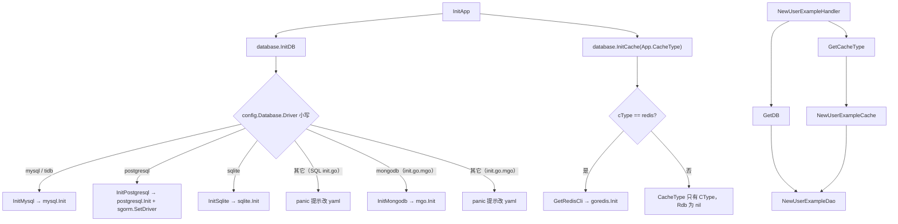
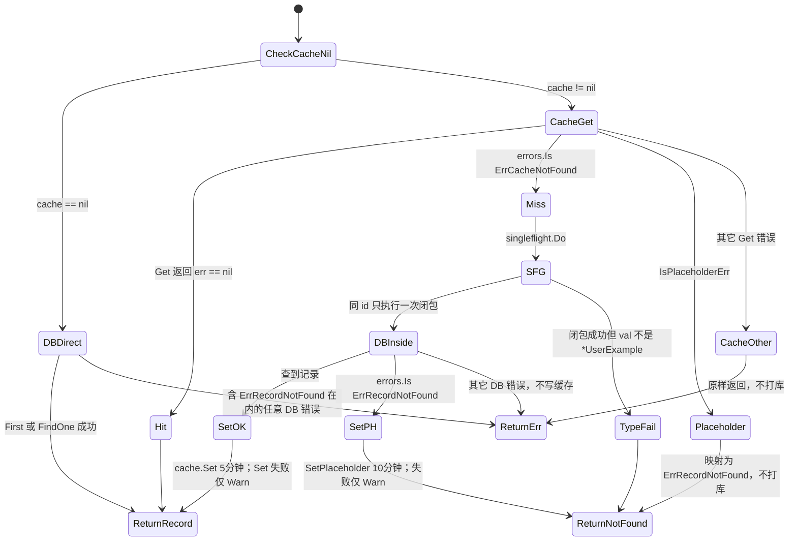

# 数据层 Model-DAO-Cache

> 状态：待复核生成稿
> 生成日期：2026-08-16
> 基准提交：`23807238c62e0f3b3e2d9a341bbef50547d3f5ec`
> 工作区：dirty
> 源码范围：`internal/model/`、`internal/dao/`、`internal/cache/`、`internal/database/`（含全部 `.mgo` / `.exp` / `.tpl` 变体与测试）；调用边界止于 `pkg/sgorm`、`pkg/mgo`、`pkg/cache`、`pkg/goredis` 的公开接口（实现细节见 [14](14-pkg数据库缓存与查询.md)）
> 生成方式：源码、测试、配置与部署资产静态分析

## 目录

- [快速摘要](#快速摘要)
- [为什么这样设计（Why）](#为什么这样设计why)
- [它是什么（What）](#它是什么what)
- [代码如何实现（How）](#代码如何实现how)
  - [生成期如何选出本篇文件](#生成期如何选出本篇文件)
  - [启动：InitDB 与 InitCache](#启动initdb-与-initcache)
  - [Model：sgorm.Model 嵌入与列名白名单](#modelsgormmodel-嵌入与列名白名单)
  - [database 包全文件](#database-包全文件)
  - [cache 包全文件](#cache-包全文件)
  - [DAO 构造、deleteCache 与 updateDataByID 标记区](#dao-构造deletecache-与-updatedatabyid-标记区)
  - [SQL DAO 每个方法](#sql-dao-每个方法)
  - [GetByID 缓存状态机（完整）](#getbyid-缓存状态机完整)
  - [Mongo DAO：`userExample.go.mgo`](#mongo-daouserexamplegomgo)
  - [SQL 扩展 API：`userExample.go.exp`](#sql-扩展-apiuserexamplegoexp)
  - [Mongo 扩展 API：`userExample.go.mgo.exp`](#mongo-扩展-apiuserexamplegomgoexp)
  - [通用主键模板：`userExample.go.tpl`](#通用主键模板userexamplegotpl)
  - [通用主键扩展：`userExample.go.exp.tpl`](#通用主键扩展userexamplegoexptpl)
  - [列名白名单防注入](#列名白名单防注入)
  - [与 pkg/sgorm、pkg/cache、pkg/mgo 的调用边界](#与-pkgsgormpkgcachepkgmgo-的调用边界)
- [调用关系表](#调用关系表)
- [对应测试](#对应测试)
- [阅读源码建议顺序](#阅读源码建议顺序)
- [重新实现检查清单](#重新实现检查清单)

相关文档：[03-详细逐步说明-主链路拆解.md](03-详细逐步说明-主链路拆解.md)（GetByID 在主链中的位置与失败出口）、[09-生成项目启动与HTTP请求链.md](09-生成项目启动与HTTP请求链.md)（`InitApp` / handler 如何注入 DAO）、[14-pkg数据库缓存与查询.md](14-pkg数据库缓存与查询.md)（`pkg/sgorm`、`pkg/mgo`、`pkg/cache`、`pkg/goredis` 内部实现）。

---

## 快速摘要

### 架构总览（模块与依赖）

本篇覆盖**生成项目运行时的数据层模板**，不是 CLI 生成器本身。依赖方向固定、禁止反向：

```text
handler / service（见 09 / 10）
  → dao.UserExampleDao
      → *gorm.DB 或 *mongo.Collection
      → cache.UserExampleCache（可为 nil）
          → pkg/cache.Cache（redis / memory）
  → model.UserExample（嵌入 sgorm.Model 或生成期改为 ObjectID）
database 包：InitDB / InitCache / GetDB / GetCacheType
  → pkg/sgorm/{mysql,postgresql,sqlite} 或 pkg/mgo
  → pkg/goredis
```

`userExample` 是占位符表，不是业务实体。同一套目录里并存多份**互不一起编译**的变体：SQL 默认、SQL 扩展（`.exp`）、通用主键（`.tpl`）、Mongo（`.mgo`）、Mongo 扩展（`.mgo.exp`）。生成器按 `--db-driver` 与 `--extended-api` 选出一份，把后缀改成 `.go` 再写入用户项目。

### 核心调用序列（逐步逻辑）

以 `sponge web http` 生成的 SQL/Gin 服务、一次 `GET /api/v1/userExample/{id}` 为锚点（handler 细节见 [09](09-生成项目启动与HTTP请求链.md)，主链失败出口见 [03](03-详细逐步说明-主链路拆解.md)）：

1. `initial.InitApp` 调 `database.InitDB`（按 `config.Database.Driver` 选 mysql/tidb/postgresql/sqlite）和 `database.InitCache(cfg.App.CacheType)`。
2. `handler.NewUserExampleHandler` 调 `dao.NewUserExampleDao(database.GetDB(), cache.NewUserExampleCache(database.GetCacheType()))`。
3. `GetByID`：`cache==nil` 则 `db.Where("id = ?", id).First`；否则先 `cache.Get`。
4. `cache.Get` 命中则直接返回；`ErrCacheNotFound` 则 `singleflight.Do` 后回源；占位符错误映射为 `database.ErrRecordNotFound`；其它缓存错误**不回源**。
5. 回源 `First` 成功则 `cache.Set`（5 分钟）；`ErrRecordNotFound` 则 `SetPlaceholder`（`pkg/cache` 默认 10 分钟）再返回 not found。
6. handler 用 `errors.Is(err, database.ErrRecordNotFound)` 区分 404 与 500。

写路径：`Create` 只插库、不碰缓存；`UpdateByID` / `DeleteByID` 在库操作之后 `deleteCache`（错误被 `_ =` 丢掉）。Mongo `Create` 额外在插入后删缓存，用于清掉可能存在的占位符。

### 易错点与边界条件

- `NewUserExampleCache` 对未知 `CType`（含空字符串）返回 **nil**，DAO 因此不建 `singleflight`。`NewCacheNameExampleCache` 对未知类型 **panic**。两种构造器契约不同。
- 缓存其它错误（Redis 宕机）**不会回源**，handler 会变成 HTTP 500。这是明确行为。
- `Set` / `SetPlaceholder` / `deleteCache` 失败只打 `logger.Warn` 或被忽略，不改变 DAO 返回值。
- `updateDataByID` 按零值跳过字段：空字符串、`Age/Gender/LoginAt <= 0` 不会写入。示例模板**没有** `Status` 更新分支；生成时 sql2code 会替换标记区。
- `GetByColumns` 把 `model.UserExampleColumnNames` 交给 `ConvertToGormConditions` / `ConvertToMongoFilter` 防列名注入；**`Sort` 不走白名单**，会进入 `ORDER BY` / Mongo `sort`。
- SQL `Create` **不**删缓存：若先前对同一 id 写过占位符，占位符 TTL 内 GetByID 仍当 not found。Mongo `Create` 会 `deleteCache`。
- Mongo DAO **没有** `CreateByTx` / `DeleteByTx` / `UpdateByTx`。非法 ObjectID 在进缓存之前就被当成 `ErrRecordNotFound`。
- `DeleteByID(0)` 的 DAO 实现**不校验** id；测试里 `assert.Error` 来自 sqlmock 未匹配，不是代码主动拒绝。
- 本篇未运行测试套件；测试结论来自阅读 `*_test.go`，不宣称测试通过。

---

## 为什么这样设计（Why）

生成项目要同时服务三类使用者：只想 CRUD 的业务开发、需要批量/游标查询的进阶 API、以及把主键从 `uint64` 换成字符串或其它整型的表。如果把这些分叉写进运行时 `if`，模板会膨胀且 Mongo 与 GORM 无法共享同一套类型。Sponge 的选择是：

1. **按文件变体分叉，不按运行时开关。** `.mgo` / `.exp` / `.tpl` 是生成期素材，落盘后只剩一份 `.go`。运行时看不到后缀。
2. **DAO 接口 + 可选缓存。** `cache==nil` 时所有读路径直打库，写路径 `deleteCache` 变成空操作。这样 `app.cacheType=""` 不必生成另一套 DAO。
3. **Cache-Aside + 占位符 + singleflight。** 击穿用 `singleflight` 合并同 id 回源；穿透用 `"*"` 占位符；缓存故障选择失败而不是打爆数据库。
4. **部分更新靠零值跳过，而不是 PATCH 语义协议。** 生成器只知道列类型，不知道“空字符串是否表示清除”。用 `!= ""` / `> 0` 是可生成的最小约定。
5. **自定义查询必须过列名白名单。** `Columns[].Name` 会拼进 SQL/`bson` 键；白名单是本仓库能在 DAO 层做的最后一道闸。`Sort` 未闸，是现有实现缺口，不是未文档化的特性。

事务方法存在是因为业务层偶尔要在同一 `*gorm.DB` 事务里组合多表；默认 HTTP handler **并不调用**它们（见 [09](09-生成项目启动与HTTP请求链.md)）。

---

## 它是什么（What）

### 四包职责

| 包 | 职责 | 运行时对象 |
|---|---|---|
| `internal/model` | 表结构体、`TableName()`、列名白名单 | `UserExample`、`UserExampleColumnNames` |
| `internal/dao` | 持久化接口与实现、缓存编排、事务方法 | `UserExampleDao` / `userExampleDao` |
| `internal/cache` | 按 id（或通用 key）读写缓存、占位符 | `UserExampleCache`、`CacheNameExampleCache` |
| `internal/database` | 连接初始化、进程级单例、哨兵错误别名 | `*sgorm.DB` 或 `*mgo.Database`、`*CacheType`、`*goredis.Client` |

### 本仓库文件清单（全部变体）

**model**

| 文件 | 角色 |
|---|---|
| `internal/model/doc.go` | 包注释：数据模型 |
| `internal/model/userExample.go` | SQL 示例：嵌入 `sgorm.Model`，含白名单 |

没有 `userExample.go.mgo`。Mongo 项目的 model 仍从这个文件生成：sql2code 替换 `// todo generate model code to here` 与 `delete the templates code` 之间的结构体（ID 改为 `primitive.ObjectID`，bson tag 改写）。生成后的 Mongo model 与本仓库这份 SQL 示例**不能混编**。

**dao**

| 文件 | 选出条件（生成器） | 落盘名 |
|---|---|---|
| `internal/dao/doc.go` | 始终（包注释） | 同名 |
| `internal/dao/userExample.go` | SQL、非扩展、主键是常见的 `id uint64` | `userExample.go` |
| `internal/dao/userExample.go.exp` | SQL、`--extended-api`、常见主键 | `userExample.go` |
| `internal/dao/userExample.go.tpl` | SQL、非扩展、`crudInfo.CheckCommonType()` 为真（主键类型/列名需模板替换） | `userExample.go` |
| `internal/dao/userExample.go.exp.tpl` | SQL、扩展 + 通用主键 | `userExample.go` |
| `internal/dao/userExample.go.mgo` | Mongo、非扩展 | `userExample.go` |
| `internal/dao/userExample.go.mgo.exp` | Mongo、扩展 | `userExample.go` |
| `internal/dao/userExample_test.go` | 对应默认 SQL DAO | `userExample_test.go` |
| `internal/dao/userExample_test.go.exp` | 对应 SQL 扩展 DAO | `userExample_test.go` |

Mongo 变体没有配套 `*_test.go.mgo`。`.tpl` 也没有单独测试文件：测试仍按 `uint64` id 写在 `userExample_test.go`。

**cache**

| 文件 | 选出条件 | 落盘名 |
|---|---|---|
| `internal/cache/doc.go` | 包注释 | 同名 |
| `internal/cache/userExample.go` | SQL 常见主键 | `userExample.go` |
| `internal/cache/userExample.go.tpl` | 通用主键 | `userExample.go` |
| `internal/cache/userExample.go.mgo` | Mongo（id 为 `string` / ObjectID hex） | `userExample.go` |
| `internal/cache/userExample_test.go` | 对应 SQL cache | 同名 |
| `internal/cache/cacheNameExample.go` | `sponge cache` 命令的独立 KV 模板，不绑表 | 替换 `cacheNameExample` 后写出 |
| `internal/cache/cacheNameExample_test.go` | 对应 KV 模板 | 同名 |

没有 `userExample.go.exp` 的 cache：扩展 API 复用同一份 cache，只是 DAO 多调了 `MultiGet` / `MultiSet`。

**database**

| 文件 | 选出条件（`SetSelectFiles`） | 落盘名 |
|---|---|---|
| `internal/database/init.go` | mysql / tidb / postgresql / sqlite | `init.go` |
| `internal/database/init.go.mgo` | mongodb | `init.go`（字段 `Old: init.go.mgo`） |
| `internal/database/mysql.go` | mysql / tidb | 同名 |
| `internal/database/postgresql.go` | postgresql | 同名 |
| `internal/database/sqlite.go` | sqlite | 同名 |
| `internal/database/mongodb.go.mgo` | mongodb | `mongodb.go` |
| `internal/database/redis.go` | **所有驱动都带** | 同名 |
| `internal/database/init_test.go` | 仓库内测试，生成项目不一定带走 | 同名 |

生成完整 HTTP 服务时，`getInitDBCode` 还会把 `init.go` 里 `// todo generate initialisation database code here` 到 `delete the templates code end` 的 switch **收成单驱动**（只保留 mysql 或 postgresql 或 sqlite 一支）。本仓库这份 `init.go` 是多驱动示例，给本仓库自己跑 `httpExample` 用。

### 接口一览（运行期会动态选哪份实现）

| 接口 | 唯一实现 | 选择依据 |
|---|---|---|
| `dao.UserExampleDao` | `*userExampleDao` | 生成期文件变体决定方法集与字段类型；运行期只有这一份 |
| `cache.UserExampleCache` | `*userExampleCache` 或 **nil** | `CacheType.CType`：`redis` / `memory` 返回实现，其它返回 nil |
| `cache.CacheNameExampleCache` | `*cacheNameExampleCache` | `redis` / `memory`；其它 **panic** |

`NewUserExampleDao`：`xCache==nil` 时结构体只有 `db`/`collection`，`sfg` 为 nil。`xCache!=nil` 时才 `new(singleflight.Group)`。

---

## 代码如何实现（How）

### 生成期如何选出本篇文件

选择发生在 `cmd/sponge/commands/generate`（详见 [05](05-代码生成器与模板写入.md)），本篇只记录与数据层相关的结果。

`SetSelectFiles(dbDriver, selectFiles)`：

- `mysql` / `tidb` → `init.go` + `redis.go` + `mysql.go`
- `postgresql` → `init.go` + `redis.go` + `postgresql.go`
- `sqlite` → `init.go` + `redis.go` + `sqlite.go`
- `mongodb` → `init.go.mgo` + `redis.go` + `mongodb.go.mgo`

DAO/cache 选择（`generate/dao.go`、`generate/http.go` 等同构）：

1. 默认 `selectFiles` 指向 `userExample.go` + 测试。
2. `crudInfo.CheckCommonType()` 为真时改成 `.tpl`（扩展则 `.exp.tpl`），并用 `crudInfo` 替换 `{{.TableNameCamel}}`、`{{.ColumnName}}`、`{{.GoType}}` 等。
3. Mongo 用 `replaceFiles` 覆盖为 `.mgo`（扩展则 dao 用 `.mgo.exp`，cache 仍用 `.mgo`）。
4. SQL 扩展且非 common type：dao 换成 `.exp` + `_test.go.exp`。
5. 替换字段把 `.mgo` / `.exp` / `.tpl` 后缀改成空；`pkg/replacer` 还会 `TrimSuffix(.tpl)`。

标记区：`// todo generate the update fields code to here` 与 `// delete the templates code start/end` 之间的 if 块，生成时被 `codes[CodeTypeDAO]`（sql2code 的 `updateFieldTmpl`）替换。未生成时仓库里看到的是 `userExample` 示例字段。

### 启动：InitDB 与 InitCache

HTTP 示例入口 `cmd/serverNameExample_httpExample/initial/initApp.go:InitApp`（完整启动链见 [09](09-生成项目启动与HTTP请求链.md)）：

1. 读配置。
2. `database.InitDB()`。
3. `database.InitCache(cfg.App.CacheType)`；`CacheType` 非空才打日志。

关闭：`initial/close.go` 始终 `database.CloseDB()`；仅当 `App.CacheType=="redis"` 才 `CloseRedis()`。`memory` 缓存没有 Close。

`GetDB` / `GetCacheType` / `GetRedisCli` 都是 `sync.Once` 懒初始化。handler 的 `init` 若在 `InitApp` 之前触发 `GetDB()`，会自己再 `InitDB()` 一次（`gdb==nil` 时）。正常 `main` 顺序是先 `InitApp` 再 `NewRouter`，第二次是 no-op。



### Model：sgorm.Model 嵌入与列名白名单

`internal/model/doc.go` 只有一句包说明。

`internal/model/userExample.go`：

- 文件头 `// todo generate model code to here`，主体夹在 `delete the templates code start/end` 里。
- `UserExample` 嵌入 `sgorm.Model`，tag 为 `` `gorm:"embedded"` ``。嵌入字段来自 `pkg/sgorm.Model`（细节见 [14](14-pkg数据库缓存与查询.md)）：
  - `ID uint64`：`column:id;AUTO_INCREMENT;primary_key`
  - `CreatedAt` / `UpdatedAt`：`time.Time`
  - `DeletedAt gorm.DeletedAt`：`column:deleted_at;index`，json 为 `"-"`，因此 JSON 响应默认不含软删时间
- 业务列：`Name/Password/Email/Phone/Avatar string`，`Age/Gender/Status int`，`LoginAt int64`。全部 `NOT NULL`。`Gender` 注释 1 男 2 女；`Status` 1 未激活 / 2 已激活 / 3 封禁。
- `TableName()` 固定返回 `"user_example"`。生成时表名会被替换。
- `UserExampleColumnNames`：`id/created_at/updated_at/deleted_at` 加上全部业务列。注释写明用途是自定义查询白名单、防 SQL 注入。

`pkg/sgorm.Model2` 是蛇形 json tag 的孪生类型。sql2code 在 `jsonNamedType==0` 时把嵌入换成 `sgorm.Model2`。本仓库示例用的是 `Model`（驼峰 json：`createdAt`）。

Mongo 生成时（`parser.getModelStructCode`）：`isEmbed` 仍会尝试嵌入 `sgorm.Model`，这是 SQL 路径。Mongo 常用非 embed：ID 改成 `primitive.ObjectID`，并把 `bson:"id"` 改成 `bson:"_id"`。Mongo DAO 按 `record.ID.IsZero()` / `record.ID.Hex()` 编译，要求生成后的 model 带 ObjectID。`pkg/mgo.Model` 提供了 Mongo 嵌入模板（`bson:",inline"`），但 **sql2code 当前不会自动嵌入 `mgo.Model`**——这是生成器行为，细节归 [06](06-SQL到代码片段引擎.md) / [14](14-pkg数据库缓存与查询.md)。本仓库 `internal/model` 没有 Mongo 变体文件。

### database 包全文件

#### `init.go`（SQL 多驱动示例）

包级：

- `gdb *sgorm.DB`（`sgorm.DB` 即 `gorm.DB` 别名）
- `gdbOnce sync.Once`
- `ErrRecordNotFound = sgorm.ErrRecordNotFound`（即 `gorm.ErrRecordNotFound`）

`InitDB`：读 `config.Get().Database.Driver`，小写后：

| driver | 调用 |
|---|---|
| `mysql`、`tidb` | `InitMysql()` |
| `postgresql` | `InitPostgresql()` |
| `sqlite` | `InitSqlite()` |
| 其它 | `panic`，文案指向 yaml 的 database 段 |

`GetDB`：`gdb==nil` 时 `Once.Do(InitDB)`，然后返回 `gdb`。`InitDB` 本身不用 Once：`InitApp` 直接调 `InitDB` 赋值；之后 `GetDB` 看到非 nil 就不再进 Once。

`CloseDB`：`sgorm.CloseDB(gdb)`。`gdb` 为异常空壳时，测试用 `&sgorm.DB{}` 覆盖并断言不报错（`TestCloseDB` 还 `recover`）。

生成单驱动项目时，switch 被替换成只含一支的代码（`modelInitDBFileMysqlCode` 等），`tidb` 仍走 `InitMysql`。

#### `init.go.mgo`（Mongo 初始化）

与 SQL 版结构平行，但类型全换：

- `mdb *mgo.Database`（`mongo.Database` 别名）
- `mdbOnce sync.Once`
- **不**定义 `ErrRecordNotFound`（改在 `mongodb.go.mgo`）

`InitDB`：仅当 driver 为 `mgo.DBDriverName`（`"mongodb"`）时 `mdb = InitMongodb()`，否则同样 panic。

`GetDB() *mgo.Database`：懒初始化。handler `.mgo` 接着 `.Collection(new(model.UserExample).TableName())`。

`CloseDB`：`mgo.Close(mdb)` → `db.Client().Disconnect`。

SQL 的 `init.go` 与 `init.go.mgo` **不能同时编译**（同名 `InitDB`/`GetDB`）。生成时只留一份叫 `init.go`。

#### `mysql.go`

`InitMysql() *sgorm.DB`：

1. 读 `config.Get().Database.Mysql`。
2. 选项：`WithMaxIdleConns`、`WithMaxOpenConns`、`WithConnMaxLifetime`（配置单位是**分钟**，代码乘 `time.Minute`）。
3. `EnableLog` 为真才追加 `WithLogging(logger.Get())` 和 `WithLogRequestIDKey("request_id")`。
4. `App.EnableTrace` 为真才 `WithEnableTrace()`。
5. 主从 `WithRWSeparation(SlavesDsn, MastersDsn...)` **整段注释掉**，默认不启用。
6. `WithGormPlugin` 示例同样注释。
7. DSN：`utils.AdaptiveMysqlDsn(mysqlCfg.Dsn)` 后 `mysql.Init(dsn, opts...)`。失败 **panic** `"init mysql error: " + err`。

不调用 `sgorm.SetDriver`。`pkg/sgorm.Bool` 因此按默认 MySQL 的 bit 语义编码（见 [14](14-pkg数据库缓存与查询.md)）。

#### `postgresql.go`

`InitPostgresql() *sgorm.DB`：

1. 读 `config.Get().Database.Postgresql`。
2. 选项：`postgresql.WithMaxIdleConns`、`WithMaxOpenConns`、`WithConnMaxLifetime`（配置单位分钟，乘 `time.Minute`）。
3. `EnableLog` 为真才追加 `WithLogging(logger.Get())`、`WithLogRequestIDKey("request_id")`。
4. `App.EnableTrace` 为真才 `WithEnableTrace()`。
5. 有 `WithGormPlugin` 注释，无主从 `WithRWSeparation` 注释块。
6. DSN：`utils.AdaptivePostgresqlDsn(postgresqlCfg.Dsn)` 后 `postgresql.Init(dsn, opts...)`。失败 **panic** `"init postgresql error: " + err`。
7. **成功后** `sgorm.SetDriver("postgresql")`，让 `sgorm.Bool` 按 postgres boolean 写回（mysql/sqlite 都不调 SetDriver）。

#### `sqlite.go`

`InitSqlite() *sgorm.DB`：

1. 读 `config.Get().Database.Sqlite`。字段是 `DBFile`，不是 DSN。
2. 选项：`sqlite.WithMaxIdleConns`、`WithMaxOpenConns`、`WithConnMaxLifetime`（分钟 × `time.Minute`）。
3. `EnableLog` 为真才 `WithLogging` + `WithLogRequestIDKey("request_id")`。
4. `App.EnableTrace` 为真才 `WithEnableTrace()`。
5. 有 `WithGormPlugin` 注释。无主从。
6. 路径：`utils.AdaptiveSqlite(sqliteCfg.DBFile)` 后 `sqlite.Init(dbFile, opts...)`。失败 **panic** `"init sqlite error: " + err`。
7. 不调用 `sgorm.SetDriver`。

yaml 示例 `dbFile: "test/sql/sqlite/sponge.db"`。注释要求 Windows 路径分隔符用 `\\`。

#### `mongodb.go.mgo`

- 常量 `MaxObjectID = "fffffffffffffffffffffffe"`（handler ListByLastID 在空 lastID 时使用，见 [09](09-生成项目启动与HTTP请求链.md)）
- `ErrRecordNotFound = mgo.ErrNoDocuments`（即 `mongo.ErrNoDocuments`）
- `InitMongodb()`：`utils.AdaptiveMongodbDsn` → `mgo.Init(dsn)`，失败 panic `"mgo.Init error: "`。`mgo.Init` 会 Ping，DSN 里必须有库名。
- `ToObjectID(id string) primitive.ObjectID`：`ObjectIDFromHex` 失败则 `logger.Warnf` 并返回**零值 ObjectID**（不返回 error）。调用方必须用 `oid.IsZero()` 判断。

#### `redis.go`（所有驱动共享）

哨兵：`ErrCacheNotFound = goredis.ErrRedisNotFound`（即 `redis.Nil`）。**与** `ErrRecordNotFound` **不是同一个值**。GetByID 状态机靠这两个哨兵分叉。

`CacheType`：

```text
CType string           // "memory" | "redis" | 其它（含空）
Rdb   *goredis.Client  // 仅 CType=redis 时由 InitCache 赋 GetRedisCli()
```

`InitCache(cType string)`：总是新建 `CacheType{CType: cType}`；仅 `cType=="redis"`（**大小写敏感，此处未 ToLower**）才填 `Rdb`。对比：`NewUserExampleCache` 会对 `CType` 做 `strings.ToLower`。若配置写成 `Redis`，`InitCache` 不连 Redis，但 cache 构造器按 `"redis"` 走 `NewRedisCache` 且 `Rdb==nil`——行为取决于 `pkg/cache` 对 nil client 的反应（见 [14](14-pkg数据库缓存与查询.md)）。yaml 约定是小写 `"redis"` / `"memory"` / `""`。

`GetCacheType`：nil 时 `Once.Do(InitCache(config.Get().App.CacheType))`。

`InitRedis`：读 `config.Get().Redis`，选项 Dial/Read/Write timeout（秒）；`EnableTrace` 时 `goredis.WithTracing(tracer.GetProvider())`；`goredis.Init(redisCfg.Dsn, opts...)` 失败 panic。

`GetRedisCli`：懒 `InitRedis`。`CloseRedis`：`goredis.Close(redisCli)`。

`memory` 缓存不经过本文件的 Redis 客户端；`InitCache("memory")` 只设置 `CType`。

#### 配置绑定（`configs/serverNameExample.yml`）

与本篇相关的字段：

| 配置 | 代码消费点 |
|---|---|
| `app.cacheType` | `InitCache`、`GetCacheType`、`close.go` 是否关 Redis |
| `app.enableTrace` | mysql/postgresql/sqlite 的 `WithEnableTrace`；Redis 的 `WithTracing` |
| `database.driver` | `InitDB` switch |
| `database.mysql.*` | `InitMysql` |
| `database.postgresql.*` | `InitPostgresql` |
| `database.sqlite.*` | `InitSqlite` |
| `database.mongodb.dsn` | `InitMongodb` |
| `redis.dsn` 与三个 timeout | `InitRedis` |

DSN 在文档中脱敏；真实 yaml 含内网地址，不是密钥文件，但复制时不要把密码写进其它文档。

### cache 包全文件

三份 `UserExample` cache 共享同一套方法名，差异在 **id 类型与 key 拼接**。KV 模板 `cacheNameExample` 是另一条产品线。

#### 公共契约：`New*` 按 redis / memory / nil

三份 `UserExample` 构造器各自把 `CType` `ToLower` 后 switch，不是共用一个函数：

| 文件 | `redis` | `memory` | default |
|---|---|---|---|
| `userExample.go` | `NewRedisCache(Rdb, "", JSON, func() *model.UserExample)`，id 后续按 uint64 | `NewMemoryCache` 同样 factory | **`return nil`** |
| `userExample.go.mgo` | 同样 `NewRedisCache`，factory 仍是 `*model.UserExample`（生成后 ID 为 ObjectID） | 同样 memory | **`return nil`** |
| `userExample.go.tpl` | 同样 `NewRedisCache`，factory `*model.{{.TableNameCamel}}` | 同样 memory | **`return nil`** |

`cachePrefix` 在三份里都是 `""`。业务前缀由 `Get*CacheKey` 自己拼。`TestNewUserExampleCache` 只覆盖 SQL 那份：空 CType → Nil；memory/redis（无 Rdb）→ NotNil。

#### `internal/cache/userExample.go`（SQL，`uint64` id）

常量：`userExampleCachePrefixKey = "userExample:"`（必须冒号结尾）、`UserExampleExpireTime = 5 * time.Minute`。

接口：`Set/Get/MultiGet/MultiSet/Del/SetPlaceholder/IsPlaceholderErr`。

| 方法 | 输入 | 行为 | 错误 |
|---|---|---|---|
| `GetUserExampleCacheKey` | `id uint64` | `"userExample:" + utils.Uint64ToStr(id)` | 无 |
| `Set` | id、`*UserExample`、duration | `data==nil \|\| id==0` 时 **直接 nil，不写**；否则 `pkg/cache.Set` | 底层错误原样返回 |
| `Get` | id | `Get` 到 `**UserExample`（`var data *model.UserExample` 再 `&data`） | miss → `ErrCacheNotFound`（`redis.Nil`）；占位符 → `cache.ErrPlaceholder`；其它底层错误 |
| `MultiSet` | `[]*UserExample`、duration | 按 `v.ID` 组 map 后 `cache.MultiSet`；空切片仍调用底层 | 底层错误 |
| `MultiGet` | `[]uint64` | 先把 id 转 key，`MultiGet` 填 `map[string]*UserExample`，再按原始 id 抽到 `map[uint64]*UserExample`；缺失的 id **不出现在 map 里** | 底层错误（memory 实现会吞单 key 错误，见边界） |
| `Del` | id | `cache.Del(ctx, key)` | 底层错误；`id==0` 的 key 为 `"userExample:0"`，`pkg/cache.BuildCacheKey` 在 key 非空时允许 |
| `SetPlaceholder` | id | `cache.SetCacheWithNotFound`：值 `"*"`，TTL `DefaultNotFoundExpireTime`（10 分钟） | 底层错误 |
| `IsPlaceholderErr` | err | `errors.Is(err, cache.ErrPlaceholder)` | 布尔 |

`Set` 对 `id==0` 静默成功，避免把零 id 写入缓存。`Get(0)` 仍会查 `"userExample:0"`，测试 `Test_userExampleCache_Get` 对零 key 断言 error（空 key 经 `BuildCacheKey` 失败，或 miss）。

#### `internal/cache/userExample.go.mgo`（id 为 `string`）

与 SQL 版逐方法对照，**不是**复制粘贴同一文件：

| 点 | SQL `userExample.go` | Mongo `userExample.go.mgo` |
|---|---|---|
| 接口 id | `uint64` | `string` |
| 导入 | 含 `pkg/utils` | **不含** `utils` |
| cache key | 前缀 + `Uint64ToStr(id)` | 前缀 + id 原样拼接 |
| `Set` 拒绝条件 | `data==nil \|\| id==0` | `data==nil \|\| id==""` |
| `MultiSet` 的 key | `v.ID`（uint64） | `v.ID.Hex()`（要求 model.ID 为 ObjectID） |
| `MultiGet` 返回 map 键 | `uint64` | `string` |
| 构造器 redis/memory/nil | 相同 | 相同 |
| 过期常量名与 5 分钟 | 相同 | 相同 |
| 占位符 API | 相同 | 相同 |

Mongo DAO 的 `GetByID` 传入的是 hex 字符串，必须与 `MultiSet` 用的 `Hex()` 一致，否则批量回填的 key 对不上。

#### `internal/cache/userExample.go.tpl`（通用主键）

Go 模板占位：`{{.TableNameCamel}}`、`{{.TableNameCamelFCL}}`、`{{.ColumnNameCamel}}`、`{{.GoType}}`、`{{.IsStringType}}` 等。生成后方法名仍是 `Set/Get/...`，但参数类型是表主键类型。

与 SQL 默认版的**逐条差异**：

| 点 | `userExample.go` | `userExample.go.tpl` |
|---|---|---|
| 类型名 | `UserExampleCache` / `userExampleCache` | `{{.TableNameCamel}}Cache` / `{{.TableNameCamelFCL}}Cache` |
| 前缀常量 | `userExampleCachePrefixKey` | `{{.TableNameCamelFCL}}CachePrefixKey`，值为 `"{{.TableNameCamelFCL}}:"` |
| key 拼接 | 总是 `Uint64ToStr` | 字符串主键：直接拼接；非字符串：`utils.{{.GoTypeFCU}}ToStr`（如 `Uint64ToStr`、`IntToStr`） |
| `Set` 拒绝 | `data==nil \|\| id==0` | **只判断 `data==nil`**，不判断主键零值。数值 0 或空字符串仍会尝试写入 |
| `MultiGet` 键类型 | `uint64` | `{{.GoType}}` |
| redis/memory/nil | 相同 | 相同 |

没有 `.tpl` 的 cache 测试文件。行为验收仍靠 `userExample_test.go` 的 uint64 路径，或生成后再测。

#### `internal/cache/cacheNameExample.go`（独立 KV 模板）

给 `sponge cache` 用，不绑定 `model.UserExample`。

- 文件顶部 `delete the templates code` 里：`keyTypeExample = string`、`valueTypeExample = string`。生成时改成用户的 key/value 类型。
- 前缀 `prefixKeyExample:`，过期 `CacheNameExampleExpireTime = 5 * time.Minute`。
- 接口只有 `Set/Get/Del`，**没有** Multi*、占位符、`IsPlaceholderErr`。
- `newObject` 返回 `""`（空字符串），不是结构体指针。
- `getCacheKey`：`fmt.Sprintf("%s%v", prefix, key)`。
- `Set` 把 `value` 的**指针**交给 `cache.Set`。
- `NewCacheNameExampleCache`：redis/memory 与上面相同；**default 分支 `panic(fmt.Sprintf("unsupported cache type='%s'", cacheType.CType))`**。空字符串会 panic。`TestNewCacheNameExampleCache` 对空类型 `recover`。

这是与 `UserExampleCache` 最关键的契约差：表缓存允许“无缓存”，KV 模板不允许静默降级。

#### `pkg/cache` 调用边界（本篇只写怎么用）

DAO/cache 依赖的哨兵与 TTL（实现见 [14](14-pkg数据库缓存与查询.md)）：

| 符号 | 值/行为 | 谁消费 |
|---|---|---|
| `cache.CacheNotFound` / `goredis.ErrRedisNotFound` / `database.ErrCacheNotFound` | `redis.Nil` | DAO：miss → 回源 |
| `cache.ErrPlaceholder` | `"cache: placeholder"` | `IsPlaceholderErr` → 当 not found |
| `NotFoundPlaceholder` | `"*"` | `SetCacheWithNotFound` 写入的值 |
| `DefaultNotFoundExpireTime` | 10 分钟 | 占位符 TTL；DAO 注释写“默认 10 分钟”，代码不传 duration |
| `UserExampleExpireTime` | 5 分钟 | 命中回源后 `Set` 的 duration |

`memory` 的 `Get` 把 miss 转成同一个 `CacheNotFound`（redis.Nil），所以 DAO 不必区分后端。`memory.MultiGet` 对单 key 错误 `continue`，占位符 key 不会进入结果 map，DAO 的 `GetByIDs` 必须再对 miss id 调一次 `Get` 才能识别占位符。

### DAO 构造、deleteCache 与 updateDataByID 标记区

#### 默认 SQL：`internal/dao/userExample.go`

编译期断言：`var _ UserExampleDao = (*userExampleDao)(nil)`。

接口方法：`Create`、`DeleteByID`、`UpdateByID`、`GetByID`、`GetByColumns`、`CreateByTx`、`DeleteByTx`、`UpdateByTx`。

结构体字段：`db *gorm.DB`、`cache cache.UserExampleCache`、`sfg *singleflight.Group`。

`NewUserExampleDao(db, xCache)`：

- `xCache==nil` → `&userExampleDao{db: db}`，cache 与 sfg 都是零值。
- 否则三者都赋值，`sfg = new(singleflight.Group)`。

`deleteCache(ctx, id)`：`d.cache!=nil` 才 `d.cache.Del`；否则 nil。调用方一律 `_ = d.deleteCache(...)`。

`updateDataByID(ctx, db, table)` 被 `UpdateByID` 与 `UpdateByTx` 共用，第二个参数可以是普通 DB 或事务 `tx`。

1. `table.ID < 1` → `errors.New("id cannot be 0")`。**此时尚未写库**。`UpdateByID` 仍会接着 `deleteCache(table.ID)`（id 为 0）。
2. `update := map[string]interface{}{}`。
3. 标记区（示例，生成时被 sql2code 替换）只在非零时塞字段：

| 字段 | 条件 | 写入列 |
|---|---|---|
| Name | `!= ""` | `name` |
| Password | `!= ""` | `password` |
| Email | `!= ""` | `email` |
| Phone | `!= ""` | `phone` |
| Avatar | `!= ""` | `avatar` |
| Age | `> 0` | `age` |
| Gender | `> 0` | `gender` |
| LoginAt | `> 0` | `login_at` |

**没有 `Status`。** 示例 DAO 无法更新 `status` 列。生成真实表时，`updateFieldTmpl` 对每个非忽略列生成 `if table.X{{.ConditionZero}}`；`int` 一般是 `> 0`，仍然不能把值改回 0。

4. `db.WithContext(ctx).Model(table).Updates(update)`。空 map 时 GORM 仍可能只刷新 `updated_at`（取决于版本与钩子，细节见 [14](14-pkg数据库缓存与查询.md)）。`Model(table)` 用主键定位行。

sql2code 忽略 `id/created_at/updated_at/deleted_at`，不会把它们放进 update map。

### SQL DAO 每个方法

下列为 `internal/dao/userExample.go`。缓存副作用列“无”表示该方法不读不写 cache（`cache==nil` 时所有写方法的 `deleteCache` 也是空操作）。

#### `Create`

| 项 | 内容 |
|---|---|
| 输入 | `ctx`，`table *model.UserExample`（ID 通常为 0，由 AUTO_INCREMENT 回写） |
| SQL | `db.WithContext(ctx).Create(table)` → `INSERT INTO user_example ...`；GORM 把新 id 写回 `table.ID` |
| 缓存 | **无**。不 Set，不 Del。若该 id 上已有占位符，TTL 内 GetByID 仍 not found |
| 错误 | 底层驱动/约束错误原样返回。不包装 |

handler 成功响应使用回写后的 `userExample.ID`（见 [09](09-生成项目启动与HTTP请求链.md)）。

#### `DeleteByID`

| 项 | 内容 |
|---|---|
| 输入 | `ctx`，`id uint64`。**不校验 0** |
| SQL | `Where("id = ?", id).Delete(&model.UserExample{})`。因嵌入 `DeletedAt`，GORM 发 **UPDATE 设置 deleted_at**，不是物理 DELETE。测试期望 SQL 为 `"UPDATE .*"` |
| 缓存 | DB **成功后** `deleteCache(id)`；失败不删缓存 |
| 错误 | DB 错误原样返回。id=0 仍执行 `WHERE id=0` 的软删；sqlmock 不匹配时测试看到 error |

软删后 GetByID 的 `First` 默认排除已删行 → `ErrRecordNotFound` → 若有缓存会走占位符路径（旧缓存已删）。

#### `UpdateByID`

| 项 | 内容 |
|---|---|
| 输入 | `ctx`，`table *model.UserExample`（必须带 ID） |
| SQL | 见 `updateDataByID`：部分字段 `Updates` |
| 缓存 | **无论 DB 成败**都 `deleteCache(table.ID)`（在 `updateDataByID` 返回之后） |
| 错误 | id&lt;1 的 `"id cannot be 0"`；否则 GORM 错误 |

先删缓存再返回错误，意味着更新失败也会让下次 GetByID 回源。这是可接受的保守失效。

#### `GetByID`

见下一节完整状态机。无缓存时：`Where("id = ?", id).First(record)`，返回 `(record, err)`；找不到是 `gorm.ErrRecordNotFound`，与 `database.ErrRecordNotFound` 可 `errors.Is`。

#### `GetByColumns`

| 项 | 内容 |
|---|---|
| 输入 | `ctx`，`params *query.Params`（`Page/Limit/Sort/Columns`） |
| SQL | 1. `params.ConvertToGormConditions(query.WithWhitelistNames(model.UserExampleColumnNames))` 得到 `queryStr, args`。2. 若 `params.Sort != "ignore count"`：`Model.Where.Count(&total)`；`total==0` 则返回 `(nil, 0, nil)`，不再 Find。3. `ConvertToPage()` 得 order/limit/offset，再 `Order.Limit.Offset.Where.Find` |
| 缓存 | 无 |
| 错误 | 白名单/表达式失败：`errors.New("query params error: " + err.Error())`。Count 或 Find 的 DB 错误原样返回 |

`"ignore count"` 是测试钩子（也是跳过 COUNT 的隐式协议）：跳过 Count 后 `total` 保持 0，但 Find 仍执行。`ConvertToPage` 里 `getSort` 会去掉空格，把 `"ignore count"` 当成 `"ignorecount"`，从而落到默认 `"id DESC"`。

`Columns` 为空：`ConvertToGormConditions` 返回空条件，查询全表再分页。`Limit` 非法时 `NewPage` 钳到 `[1, 1000]`（`pkg/sgorm/query` 默认 max 1000）。

**`Sort` 不经白名单**，直接进 `ORDER BY`。恶意 `sort` 可注入。`Columns[].Name` 不在白名单则失败。这是“防注入”的实际范围。

默认这份 **不**在 Sort 为空时填 `"-id"`。空 Sort → `getSort` → `"id DESC"`。

#### `CreateByTx`

| 项 | 内容 |
|---|---|
| 输入 | `ctx`，`tx *gorm.DB`（调用方已 `Begin`），`table` |
| SQL | `tx.WithContext(ctx).Create(table)`，与 `Create` 相同但用传入的会话 |
| 缓存 | 无 |
| 错误 | 同 Create。返回 `(table.ID, err)`，即使失败也可能返回 0 |

**谁调用：** 默认 handler/service **不调用**。只出现在 DAO 测试、assistant 合并保留名单。调用方负责 `Commit`/`Rollback`。DAO 不检查 `tx==nil`。

测试里把 `d.DB` 当 tx 传入；sqlmock 仍 ExpectBegin/Exec/Commit，因为 gotest 的 DB 会话行为如此。

#### `DeleteByTx`

| 项 | 内容 |
|---|---|
| 输入 | `ctx`，`tx`，`id` |
| SQL | `tx.Where("id = ?", id).Delete(&model.UserExample{})`，与 `DeleteByID` 相同的软删，会话换成 tx |
| 缓存 | DB 成功后 `deleteCache`。事务尚未 Commit 就删缓存：若随后 Rollback，缓存已空，下次读会回源，属于保守失效 |
| 错误 | 同 DeleteByID |

#### `UpdateByTx`

| 项 | 内容 |
|---|---|
| 输入 | `ctx`，`tx`，`table` |
| SQL | `updateDataByID(ctx, tx, table)` |
| 缓存 | 无论成败 `deleteCache(table.ID)`（与 `UpdateByID` 相同，发生在事务提交前） |
| 错误 | 同 UpdateByID |

### GetByID 缓存状态机（完整）

文件：`internal/dao/userExample.go` 的 `GetByID`。Mongo / `.tpl` 在分叉点单独标注，不把状态机画成“其余相同”。



逐步条件（必须按这个顺序理解，代码是线性 if，不是独立并行分支）：

1. **`d.cache == nil`**  
   - SQL：`First`。  
   - Mongo：先 `ToObjectID`；零 OID 直接 `ErrRecordNotFound`（不查库）。否则 `FindOne(ExcludeDeleted).Decode`。  
   - 返回 `(record, err)`。找不到不写占位符。

2. **`cache.Get` 成功（`err==nil`）**  
   返回缓存对象。不校验对象是否过期（TTL 由 Redis/Ristretto 执行）。

3. **`errors.Is(err, database.ErrCacheNotFound)`**（miss）  
   进入 `sfg.Do`。  
   - SQL 默认：key = `utils.Uint64ToStr(id)`。  
   - Mongo：key = id 字符串。  
   - `.tpl` 字符串主键：key = 主键本身；非字符串：`utils.{{.GoTypeFCU}}ToStr`。  
   `singleflight` 的第三个返回值（是否共享）被 `_` 丢掉。  
   闭包内：  
   a. 再查库（SQL `First` / Mongo `FindOne` + `ExcludeDeleted`）。  
   b. `ErrRecordNotFound`：`SetPlaceholder`；失败 `logger.Warn("cache.SetPlaceholder error", ...)`；闭包返回 `(nil, ErrRecordNotFound)`。  
   c. 其它 DB 错误：闭包返回 `(nil, err)`，不写缓存。  
   d. 成功：`Set(ctx, id, table, UserExampleExpireTime)`；失败 Warn；返回 `(table, nil)`。  
   闭包之后：`err!=nil` 则 `return nil, err`（包含 not found）。  
   `val.(*model.UserExample)` 失败（含闭包返回 nil 但 err 被丢掉的异常路径）：`return nil, ErrRecordNotFound`。类型断言失败被当成 not found，**会误导** handler 走 404 而不是 500。

4. **`d.cache.IsPlaceholderErr(err)`**  
   不打库，`return nil, ErrRecordNotFound`。占位符在 TTL 内一直挡穿透。

5. **其余 cache 错误**（网络、序列化、权限）  
   `return nil, err`，**不回源**。handler 非 not found 分支 → HTTP 500。推断：避免 Redis 故障时打爆 MySQL/Mongo。代价是缓存层故障时读接口整体失败。

Mongo 在步骤 1–5 之前还有 **OID 校验**：非法 hex 或全零 hex → 直接 not found，**不读缓存**。因此非法 id 不会留下占位符；合法但不存在的 hex 才会占位。

并发：同 id 在 miss 路径上合并为一次 DB。不同 id 并行。`cache==nil` 时没有 sfg，高并发直打库。

### Mongo DAO：`userExample.go.mgo`

与 SQL 默认版对照——每个方法都写出差异，禁止用“其余一样”代替。

**接口：** `Create/DeleteByID/UpdateByID/GetByID/GetByColumns`。id 类型全部是 `string`。**没有**三个 `*ByTx` 方法。没有 `*gorm.DB`。

**结构体：** `collection *mongo.Collection`，cache 与 sfg 同 SQL 版语义。

**构造器：** `NewUserExampleDao(collection, xCache)`，nil cache 时不加 sfg。

**`deleteCache`：** 参数是 `string` id。

#### `Create`（Mongo）

| 项 | 内容 |
|---|---|
| 输入 | `record *model.UserExample` |
| Mongo | `ID.IsZero()` 则 `primitive.NewObjectID()`；`CreatedAt/UpdatedAt` 设为 `time.Now()` 指针；`InsertOne(ctx, record)` |
| 缓存 | **插入之后无论成败** `_ = deleteCache(ctx, record.ID.Hex())`。用于清掉客户端指定 id 时可能存在的占位符。新随机 ObjectID 几乎不可能先被 Get 过 |
| 错误 | `InsertOne` 错误原样返回。不把 `InsertedID` 再写回（ID 已在插入前生成） |

不调用 `pkg/mgo.Model.SetModelValue`（该函数对 ID 的 `IsZero` 判断是反的，细节归 [14](14-pkg数据库缓存与查询.md)）。本 DAO 自己处理 ID 与时间戳。

#### `DeleteByID`（Mongo）

| 项 | 内容 |
|---|---|
| 输入 | hex 字符串。不校验空/非法（非法会变成零 OID 去匹配，通常 0 条） |
| Mongo | `filter := {"_id": ToObjectID(id)}`；`UpdateOne(ctx, mgo.ExcludeDeleted(filter), mgo.EmbedDeletedAt(bson.M{}))`。软删：给未删文档设 `deleted_at`。`ExcludeDeleted` 要求 `deleted_at` 字段不存在。0 条匹配时 driver 仍返回 nil error |
| 缓存 | 成功后 `deleteCache(id)`（用原始字符串，不是 Hex） |
| 错误 | `UpdateOne` 错误。不把 `MatchedCount==0` 转成 `ErrRecordNotFound` |

#### `UpdateByID` / `updateDataByID`（Mongo）

| 项 | 内容 |
|---|---|
| 输入 | record，ID 必须非 Zero |
| 校验 | `table.ID.IsZero()` → `"id is empty or invalid"`（不是 SQL 的 `"id cannot be 0"`） |
| 标记区 | 与 SQL 示例**同一组字段与零值条件**（Name/Password/.../LoginAt，无 Status），但写入 `bson.M` 而不是 `map[string]interface{}` |
| Mongo | `filter := {"_id": table.ID}`（已是 ObjectID，不再 FromHex）；`UpdateOne(ExcludeDeleted(filter), EmbedUpdatedAt(update))`。`EmbedUpdatedAt` 把字段包进 `$set` 并加 `updated_at` |
| 缓存 | 无论成败 `deleteCache(record.ID.Hex())` |
| 错误 | 校验错误或 `UpdateOne` 错误。0 条匹配不当 not found |

#### `GetByID`（Mongo）

见状态机。额外前置：`ToObjectID` + `IsZero` → not found。无缓存时 `FindOne(ExcludeDeleted).Decode`。miss 时 sfg key 用原始 id 字符串。库错误 `mongo.ErrNoDocuments` 即 `database.ErrRecordNotFound`。

#### `GetByColumns`（Mongo）

| 项 | 内容 |
|---|---|
| 转换 | `params.ConvertToMongoFilter(WithWhitelistNames(UserExampleColumnNames))`，失败同样包装 `"query params error: "` |
| 软删 | `filter = mgo.ExcludeDeleted(filter)` |
| 日志 | **`logger.Info("query filter", logger.Any("filter", filter))`**。SQL 版不打这条。生产会把查询条件打进 info 日志 |
| Count | **总是** `CountDocuments`，没有 `"ignore count"` 跳过。`total==0` 返回空 |
| Find | `ConvertToPage()` 得到 `bson.D` sort、limit、skip；`Find` + `cursor.All` |
| 缓存 | 无 |

Mongo `NewPage`：空 sort → `{_id: -1}`；`id` 会改写成 `_id`。limit&lt;1 默认为 10（SQL 侧非法 limit 提到 max 1000）。max 同样 1000。

白名单字段名按 **model 里的 ColName**。示例 SQL model 是 `"id"` 不是 `"_id"`。`pkg/mgo/query` 在 convert 阶段才把 `id` 改成 `_id`，`checkName` 发生在 convert **之前**，因此白名单需要有 `"id"` 才能查 id。生成 Mongo model 时 sql2code 可能额外 append `"_id"`（`getTableColumnsCode` 对 ID 字段改 ColName 再 append，存在重复条目的生成器行为，见 [06](06-SQL到代码片段引擎.md)）。

### SQL 扩展 API：`userExample.go.exp`

接口 = 默认五个 CRUD + 三个 Tx + 四个扩展方法：`DeleteByIDs`、`GetByCondition`、`GetByIDs`、`GetByLastID`。构造器、`deleteCache`、`updateDataByID` 标记区（八个非零 if、无 Status）与默认 SQL 文件写在同一份 `.exp` 源码里，下面按方法给出本文件自己的输入 / SQL / 缓存 / 错误。

#### `Create`（`.exp`）

| 项 | 内容 |
|---|---|
| 输入 | `ctx`，`table *model.UserExample` |
| SQL | `db.WithContext(ctx).Create(table)`，INSERT，GORM 回写 `table.ID` |
| 缓存 | 无 Set、无 Del |
| 错误 | 驱动/约束错误原样返回 |

#### `DeleteByID`（`.exp`）

| 项 | 内容 |
|---|---|
| 输入 | `ctx`，`id uint64`，不校验 0 |
| SQL | `Where("id = ?", id).Delete(&model.UserExample{})`，软删 UPDATE `deleted_at` |
| 缓存 | DB 成功后 `deleteCache(id)` |
| 错误 | DB 错误原样返回 |

#### `UpdateByID`（`.exp`）

| 项 | 内容 |
|---|---|
| 输入 | `ctx`，`table`（含 ID） |
| SQL | `updateDataByID`：`ID < 1` 拒绝；非零字段 `Updates` |
| 缓存 | 无论成败 `deleteCache(table.ID)` |
| 错误 | `"id cannot be 0"` 或 GORM 错误 |

#### `GetByID`（`.exp`）

五步都写在 `.exp` 这份源码里，不是引用默认文件：

1. `cache==nil`：`Where("id = ?", id).First`，返回 `(record, err)`。  
2. `cache.Get` 成功：直接返回。  
3. `ErrCacheNotFound`：`sfg.Do(utils.Uint64ToStr(id), ...)` 内 `First`；not found → `SetPlaceholder`（失败 Warn）→ `ErrRecordNotFound`；成功 → `Set` 5 分钟（失败 Warn）；其它 DB 错误不写缓存。类型断言失败 → `ErrRecordNotFound`。  
4. `IsPlaceholderErr` → `ErrRecordNotFound`，不打库。  
5. 其它 cache 错误原样返回，不回源。

#### `GetByColumns`（`.exp`）

| 项 | 内容 |
|---|---|
| 输入 | `*query.Params` |
| SQL | `ConvertToGormConditions(WithWhitelistNames(UserExampleColumnNames))`；`Sort != "ignore count"` 时 Count，`total==0` 提前返回；再 `ConvertToPage` + Find |
| 缓存 | 无 |
| 错误 | `"query params error: "` + convert 错；Count/Find 的 DB 错。空 Sort 不在本方法内改写，`getSort("")` → `"id DESC"` |

#### `CreateByTx`（`.exp`）

| 项 | 内容 |
|---|---|
| 输入 | `ctx`，`tx *gorm.DB`，`table` |
| SQL | `tx.WithContext(ctx).Create(table)` |
| 缓存 | 无 |
| 错误 | 返回 `(table.ID, err)` |

#### `DeleteByTx`（`.exp`，与默认 SQL 实现不同）

默认 SQL 文件用 `tx.Delete(&model.UserExample{})`。`.exp` 不用 `Delete()`：

```text
update := map[string]interface{}{"deleted_at": time.Now()}
tx.Model(&model.UserExample{}).Where("id = ?", id).Updates(update)
```

| 项 | 内容 |
|---|---|
| 输入 | `ctx`，`tx`，`id` |
| SQL | 显式 `Updates(deleted_at)`。GORM 对含 `DeletedAt` 的 Model 仍带软删 scope，不会更新已删行 |
| 缓存 | DB 成功后 `deleteCache(id)`。发生在 Commit 之前 |
| 错误 | Updates 错误。本文件为此多导入 `"time"` |

测试 SQL 期望仍是 `"UPDATE .*"`。

#### `UpdateByTx`（`.exp`）

| 项 | 内容 |
|---|---|
| 输入 | `ctx`，`tx`，`table` |
| SQL | `updateDataByID(ctx, tx, table)` |
| 缓存 | 无论成败 `deleteCache(table.ID)` |
| 错误 | 同本文件 `UpdateByID` |

#### `DeleteByIDs`（`.exp` 新增）

| 项 | 内容 |
|---|---|
| 输入 | `ids []uint64`。不校验空切片或 0 |
| SQL | `Where("id IN (?)", ids).Delete(&model.UserExample{})` 软删 |
| 缓存 | DB 成功后 **for 每个 id** `deleteCache`。部分 id 不存在仍 nil error，缓存也会被删（Del 不存在的 key 通常成功） |
| 错误 | DB 错误。空 IN 列表的驱动行为未在 DAO 层特判 |

测试 `Test_userExampleDao_DeleteByIDs` 实际先调的是 `DeleteByID`（单条），再用 `DeleteByIDs([]uint64{0})` 期望 error（sqlmock 未匹配）。测试名与主体不完全对应。

#### `GetByCondition`（新增）

| 项 | 内容 |
|---|---|
| 输入 | `*query.Conditions`（只有 Columns，不分页） |
| SQL | `c.ConvertToGorm(WithWhitelistNames(...))` → `Where.First`。错误不包装 `"query params error"` 前缀，**原样返回** convert 错误 |
| 缓存 | 无 |
| 错误 | 白名单失败；`First` 的 not found / DB 错误 |

与 `GetByColumns` 的差别：单条、无 Count、convert 错误不包装、不用 `Params.Sort`。

#### `GetByIDs`（新增，带缓存回填）

无缓存：`Where("id IN (?)", ids).Find`，组装 `map[uint64]*UserExample`。找不到的 id 不在 map 中，**不返回 error**。

有缓存：

1. `cache.MultiGet(ctx, ids)`，失败则整个方法失败（不回源）。
2. 收集 map 中缺失的 `missedIDs`。
3. 对每个 missed id 再 `cache.Get`：若 `IsPlaceholderErr` 则跳过（确认穿透占位，不打库）；否则列入 `realMissedIDs`。注意：这里把 **miss（ErrCacheNotFound）和真实数据以外的错误** 都推进 realMissed；占位符才 skip。`Get` 的非占位符错误被丢掉，只看 `IsPlaceholderErr`。
4. `realMissedIDs` 非空则 `Where IN Find`。失败返回 err。
5. 查到的记录写入 `itemMap`，`cache.MultiSet(..., UserExampleExpireTime)`；MultiSet 失败只 Warn。
6. 若 `len(records)==len(realMissedIDs)` 提前返回（全部 miss 都在库里）。
7. 对库里没有的 realMissed id：`SetPlaceholder`，失败 Warn。
8. 返回 `itemMap`（仍可能缺占位符那些 id）。**不返回 not found 错误。**

测试 `GetByIDs([]uint64{111})` 在有缓存时会因 mock 期望不匹配而 `assert.Error`。

#### `GetByLastID`（新增）

| 项 | 内容 |
|---|---|
| 输入 | `lastID uint64`，`limit int`，`sort string` |
| SQL | `query.NewPage(0, limit, sort)` → `Order(page.Sort()).Limit(page.Limit()).Where("id < ?", lastID).Find`。**没有 Offset**（游标页）。空 sort → `id DESC` |
| 缓存 | 无 |
| 错误 | Find 错误。非法 sort 列名会导致 SQL 错误（测试 `"unknown-column"`） |

handler 在 SQL 路径把 `lastID==0` 改成 `math.MaxInt32`（见 [09](09-生成项目启动与HTTP请求链.md)），否则 `id < 0` 没有无符号意义。DAO 自身不改 0。

### Mongo 扩展 API：`userExample.go.mgo.exp`

接口 = Mongo 五个方法 + `DeleteByIDs`、`GetByCondition`、`GetByIDs`、`GetByLastID`。**没有** `CreateByTx` / `DeleteByTx` / `UpdateByTx`。id 全部是 `string`。构造器用 `*mongo.Collection`。

下面五个基础方法写的是 `.mgo.exp` 这份源码自己的行为。

#### `Create`（`.mgo.exp`）

| 项 | 内容 |
|---|---|
| 输入 | `record *model.UserExample` |
| Mongo | `ID.IsZero()` 则 `NewObjectID()`；写入 `CreatedAt/UpdatedAt` 指针；`InsertOne` |
| 缓存 | 插入后无论成败 `deleteCache(record.ID.Hex())` |
| 错误 | `InsertOne` 原样返回 |

#### `DeleteByID`（`.mgo.exp`）

| 项 | 内容 |
|---|---|
| 输入 | hex 字符串，不校验空/非法 |
| Mongo | `UpdateOne(ExcludeDeleted({"_id": ToObjectID(id)}), EmbedDeletedAt({}))`。0 条匹配仍 nil error |
| 缓存 | 成功后 `deleteCache(id)`（原始字符串） |
| 错误 | `UpdateOne` 错误 |

#### `UpdateByID`（`.mgo.exp`）

| 项 | 内容 |
|---|---|
| 输入 | record |
| Mongo | `ID.IsZero()` → `"id is empty or invalid"`；标记区八字段写入 `bson.M`；`UpdateOne(ExcludeDeleted({"_id": table.ID}), EmbedUpdatedAt(update))` |
| 缓存 | 无论成败 `deleteCache(record.ID.Hex())` |
| 错误 | 校验错误或 `UpdateOne` 错误。0 条匹配不当 not found |

#### `GetByID`（`.mgo.exp`）

1. `ToObjectID(id)` 后 `IsZero()` → 立刻 `ErrRecordNotFound`（不读缓存、不打库）。  
2. `cache==nil`：`FindOne(ExcludeDeleted).Decode`。  
3. `cache.Get` 成功：返回。  
4. `ErrCacheNotFound`：`sfg.Do(id, ...)` 内 `FindOne`；`ErrNoDocuments` → `SetPlaceholder`（失败 Warn）→ `ErrRecordNotFound`；成功 → `Set` 5 分钟（失败 Warn）；其它错误不写缓存。类型断言失败 → `ErrRecordNotFound`。  
5. `IsPlaceholderErr` → `ErrRecordNotFound`。  
6. 其它 cache 错误不回源。

#### `GetByColumns`（`.mgo.exp`）

| 项 | 内容 |
|---|---|
| 输入 | `*mgo/query.Params` |
| Mongo | `ConvertToMongoFilter(白名单)` 失败则 `"query params error: "`；`ExcludeDeleted`；**`logger.Info` 打印 filter**；**总是** `CountDocuments`（无 ignore count）；`total==0` 返回空；`ConvertToPage` 后 `Find` + `cursor.All` |
| 缓存 | 无 |
| 错误 | convert / Count / Find / All |

#### `DeleteByIDs`（`.mgo.exp` 新增）

| 项 | 内容 |
|---|---|
| 输入 | `[]string` hex |
| Mongo | `oids := mgo.ConvertToObjectIDs(ids)`（非法 hex **静默跳过**，不进切片）；`UpdateMany(ExcludeDeleted({"_id": {"$in": oids}}), EmbedDeletedAt({}))` |
| 缓存 | 成功后对**原始 ids 切片每一个字符串** `deleteCache`，包括转换失败的非法 id |
| 错误 | `UpdateMany` 错误。空 oids 时驱动行为未特判 |

`ConvertToObjectIDs` 丢弃非法 id 的行为在 [14](14-pkg数据库缓存与查询.md)。结果是：非法 id 不删库但会 Del 缓存。

#### `GetByCondition`（Mongo 扩展）

| 项 | 内容 |
|---|---|
| 转换 | `c.ConvertToMongo(WithWhitelistNames(...))`，错误原样返回 |
| 软删 | `ExcludeDeleted` |
| 日志 | 与 GetByColumns 一样 `logger.Info("query filter", ...)` |
| Mongo | `FindOne(filter).Decode`。这里的 filter 已 ExcludeDeleted |
| 缓存 | 无 |
| 错误 | convert / `ErrNoDocuments` / Decode |

#### `GetByIDs`（`.mgo.exp` 新增）

| 项 | 内容 |
|---|---|
| 输入 | `ids []string`（hex） |
| 返回 | `map[string]*model.UserExample`，键为 `record.ID.Hex()`。缺 id 不报 `ErrRecordNotFound` |

无缓存：`oids := mgo.ConvertToObjectIDs(ids)`（非法 hex 丢弃）；`Find(ExcludeDeleted({"_id": {"$in": oids}}))` + `cursor.All`；按 Hex 装 map。非法 id 不会出现在 map 里。

有缓存：

1. `cache.MultiGet(ctx, ids)`，失败则整批返回该错误，不打 Mongo。  
2. 收集 `itemMap` 里没有的 `missedIDs`（含非法 hex，因为 MultiGet 用原始字符串当 key）。  
3. 对每个 missed id 调 `cache.Get`：`IsPlaceholderErr` 则跳过；否则列入 `realMissedIDs`（含 miss 与其它 Get 错误，其它错误被丢掉）。  
4. `ConvertToObjectIDs(realMissedIDs)` + `Find(ExcludeDeleted $in)`。Find/All 失败则返回 err。  
5. 命中写入 `itemMap`，`cache.MultiSet(records, UserExampleExpireTime)`；失败 Warn。cache 侧 MultiSet 用 `v.ID.Hex()` 做 key。  
6. `len(records)==len(realMissedIDs)` 则提前返回。  
7. 库中没有的 realMissed id：`SetPlaceholder`，失败 Warn。  
8. 返回 `itemMap`。

非法 hex：无缓存路径被 Convert 丢掉；有缓存路径会查 `"userExample:" + 非法字符串`。

#### `GetByLastID`（Mongo 扩展）

| 项 | 内容 |
|---|---|
| 分页对象 | `query.NewPage(0, limit, sort)`（**mgo/query**，不是 sgorm/query） |
| Find | `ExcludeDeleted({"_id": {"$lt": ToObjectID(lastID)}})`，limit/skip/sort 来自 page |
| 空 lastID | `ToObjectID("")` 失败 → 零 OID；`$lt` 零 OID 通常空结果。handler 把空字符串改成 `database.MaxObjectID` |
| 缓存 | 无 |

skip 在 last-id 游标场景通常为 0（page 固定 0）。limit 钳制规则走 Mongo `NewPage`。

没有 `userExample_test.go.mgo`：Mongo 扩展方法在本仓库**无单元测试文件**。

### 通用主键模板：`userExample.go.tpl`

目标：主键列名不一定叫 `id`，类型不一定是 `uint64`。生成器用 `crudInfo` 填 `{{.TableNameCamel}}`、`{{.ColumnName}}`、`{{.GoType}}`、`{{.IsStringType}}`。接口名 `{{.TableNameCamel}}Dao`，缓存类型 `cache.{{.TableNameCamel}}Cache`。没有配套 `_test.go`。

#### `Create`（`.tpl`）

| 项 | 内容 |
|---|---|
| 输入 | `table *model.{{.TableNameCamel}}` |
| SQL | `db.WithContext(ctx).Create(table)`，主键回写 `table.{{.ColumnNameCamel}}` |
| 缓存 | 无 |
| 错误 | 驱动错误原样返回 |

#### `DeleteBy{{.ColumnNameCamel}}`（`.tpl`）

| 项 | 内容 |
|---|---|
| 输入 | `{{.ColumnNameCamelFCL}} {{.GoType}}`，无零值校验 |
| SQL | `Where("{{.ColumnName}} = ?", pk).Delete(&model.{{.TableNameCamel}}{})` 软删 |
| 缓存 | DB 成功后 `deleteCache(pk)` |
| 错误 | DB 错误 |

#### `UpdateBy{{.ColumnNameCamel}}`（`.tpl`）

| 项 | 内容 |
|---|---|
| 输入 | `table` |
| SQL | 字符串主键：`== ""` → `"cannot be empty"`。数值主键：`< 1` → `"cannot be 0"`。标记区是 Name/Password/Email/Phone/Avatar/Age/Gender/LoginAt 八个 if（无 Status），生成时被 sql2code 替换。然后 `Model(table).Updates(update)` |
| 缓存 | 无论成败 `deleteCache(table.{{.ColumnNameCamel}})` |
| 错误 | 校验错误或 GORM 错误 |

#### `GetBy{{.ColumnNameCamel}}`（`.tpl`）

1. `cache==nil`：`Where("{{.ColumnName}} = ?", pk).First`。  
2. `cache.Get` 成功：返回。  
3. `ErrCacheNotFound`：`sfg.Do(key, ...)`。**key**：字符串主键用主键本身；否则 `utils.{{.GoTypeFCU}}ToStr(pk)`。闭包内 `First`；not found → `SetPlaceholder`（失败 Warn）；成功 → `Set(..., {{.TableNameCamel}}ExpireTime)`（失败 Warn）；其它 DB 错误不写缓存。类型断言失败 → `ErrRecordNotFound`。  
4. `IsPlaceholderErr` → `ErrRecordNotFound`。  
5. 其它 cache 错误不回源。

不能把 key 写死成 `Uint64ToStr` 或 WHERE 写死成 `id`。

#### `GetByColumns`（`.tpl`）

| 项 | 内容 |
|---|---|
| 输入 | `*query.Params` |
| SQL | **先** `if params.Sort == "" { params.Sort = "-{{.ColumnName}}" }`，再 `ConvertToGormConditions(白名单)`；`Sort != "ignore count"` 时 Count；再 Find |
| 缓存 | 无 |
| 错误 | `"query params error: "` 或 DB 错误 |

空 Sort 被改成降序主键，避免 `getSort("")` 硬编码 `"id DESC"`。若传入 `"ignore count"`，不走进空 Sort 分支，Count 跳过，`getSort("ignorecount")` 仍变成 `"id DESC"`——非 `id` 主键时 ORDER BY 列可能错。这是 `.tpl` + ignore-count 的边角。

#### `CreateByTx`（`.tpl`）

| 项 | 内容 |
|---|---|
| 输入 | `tx`，`table` |
| SQL | `tx.Create(table)` |
| 缓存 | 无 |
| 错误 | `(table.{{.ColumnNameCamel}}, err)` |

#### `DeleteByTx`（`.tpl`）

| 项 | 内容 |
|---|---|
| 输入 | `tx`，主键值 |
| SQL | `tx.Where("{{.ColumnName}} = ?", pk).Delete(...)`（GORM 软删，不是显式 Updates） |
| 缓存 | 成功后 `deleteCache(pk)` |
| 错误 | Delete 错误 |

#### `UpdateByTx`（`.tpl`）

| 项 | 内容 |
|---|---|
| 输入 | `tx`，`table` |
| SQL | `updateDataBy{{.ColumnNameCamel}}(ctx, tx, table)` |
| 缓存 | 无论成败 Del |
| 错误 | 校验或 GORM |

### 通用主键扩展：`userExample.go.exp.tpl`

接口 = `.tpl` 方法集 + `DeleteBy{{.ColumnNamePluralCamel}}`、`GetByCondition`、`GetBy{{.ColumnNamePluralCamel}}`、`GetByLast{{.ColumnNameCamel}}`。本文件的 `DeleteByTx` 改成显式 `Updates(deleted_at)`。无独立测试文件。

#### `Create`（`.exp.tpl`）

| 项 | 内容 |
|---|---|
| 输入 | `table *model.{{.TableNameCamel}}` |
| SQL | `db.Create(table)`，回写主键 |
| 缓存 | 无 |
| 错误 | 驱动错误 |

#### `DeleteBy{{.ColumnNameCamel}}`（`.exp.tpl`）

| 项 | 内容 |
|---|---|
| 输入 | 主键值，无零值校验 |
| SQL | `Where("{{.ColumnName}} = ?", pk).Delete(...)` 软删 |
| 缓存 | 成功后 `deleteCache(pk)` |
| 错误 | DB 错误 |

#### `UpdateBy{{.ColumnNameCamel}}`（`.exp.tpl`）

| 项 | 内容 |
|---|---|
| 输入 | `table` |
| SQL | 字符串空 / 数值 `< 1` 校验；标记区八字段；`Updates` |
| 缓存 | 无论成败 Del |
| 错误 | 校验或 GORM |

#### `GetBy{{.ColumnNameCamel}}`（`.exp.tpl`）

1. `cache==nil`：`Where("{{.ColumnName}} = ?").First`。  
2. 命中返回。  
3. miss：`sfg.Do`（字符串 key=主键，数值 key=`utils.{{.GoTypeFCU}}ToStr`）后 First；not found 写占位符；成功 Set 5 分钟。  
4. 占位符 → `ErrRecordNotFound`。  
5. 其它 cache 错误不回源。

#### `GetByColumns`（`.exp.tpl`）

| 项 | 内容 |
|---|---|
| 输入 | `*query.Params` |
| SQL | 空 Sort 先设 `"-{{.ColumnName}}"`；白名单 convert；非 `"ignore count"` 则 Count；Find |
| 缓存 | 无 |
| 错误 | `"query params error: "` 或 DB 错误 |

#### `DeleteBy{{.ColumnNamePluralCamel}}`（`.exp.tpl` 新增）

| 项 | 内容 |
|---|---|
| 输入 | `[]{{.GoType}}` |
| SQL | `Where("{{.ColumnName}} IN (?)", ids).Delete(...)` 软删 |
| 缓存 | 成功后逐个 `deleteCache` |
| 错误 | DB 错误。空切片未特判 |

#### `GetByCondition`（`.exp.tpl` 新增）

| 项 | 内容 |
|---|---|
| 输入 | `*query.Conditions` |
| SQL | `ConvertToGorm(白名单)`，错误不加 `"query params error"` 前缀；`Where.First` |
| 缓存 | 无 |
| 错误 | convert / not found / DB |

#### `GetBy{{.ColumnNamePluralCamel}}`（`.exp.tpl` 新增）

无缓存：`Where("{{.ColumnName}} IN (?)", ids).Find`，`map[{{.GoType}}]*model.{{.TableNameCamel}}`，键 `record.{{.ColumnNameCamel}}`。缺 id 不报错。

有缓存：

1. `cache.MultiGet(ctx, ids)`，失败整批失败。  
2. 收集缺失主键。  
3. 对缺失项 `cache.Get`：占位符跳过，否则进 realMissed。  
4. `Where IN` 查库，失败返回 err。  
5. 命中写入 map，`MultiSet(..., {{.TableNameCamel}}ExpireTime)`，失败 Warn。  
6. 条数对齐则提前返回。  
7. 库中没有的主键 `SetPlaceholder`，失败 Warn。  
8. 返回 map，不返回 not found。

#### `GetByLast{{.ColumnNameCamel}}`（`.exp.tpl` 新增）

| 项 | 内容 |
|---|---|
| 输入 | `lastPK {{.GoType}}`，`limit`，`sort` |
| SQL | **若 `sort==""` 先设 `"-{{.ColumnName}}"`**，再 `query.NewPage(0, limit, sort)`；`Order.Limit.Where("{{.ColumnName}} < ?", lastPK).Find`。无 Offset |
| 缓存 | 无 |
| 错误 | Find 错误 |

`.exp` 的 `GetByLastID` 不在方法内改空 sort（依赖 `NewPage` 默认 `id DESC`）。`.exp.tpl` 必须改，否则非 `id` 主键会 ORDER BY 错列。

#### `CreateByTx`（`.exp.tpl`）

| 项 | 内容 |
|---|---|
| 输入 | `tx`，`table` |
| SQL | `tx.Create(table)` |
| 缓存 | 无 |
| 错误 | `(table.{{.ColumnNameCamel}}, err)` |

#### `DeleteByTx`（`.exp.tpl`）

| 项 | 内容 |
|---|---|
| 输入 | `tx`，主键值 |
| SQL | `Updates({"deleted_at": time.Now()})` + `Where("{{.ColumnName}} = ?", pk)`，不用 GORM `Delete()` |
| 缓存 | 成功后 `deleteCache` |
| 错误 | Updates 错误 |

#### `UpdateByTx`（`.exp.tpl`）

| 项 | 内容 |
|---|---|
| 输入 | `tx`，`table` |
| SQL | `updateDataBy{{.ColumnNameCamel}}(ctx, tx, table)` |
| 缓存 | 无论成败 Del |
| 错误 | 校验或 GORM |

### 列名白名单防注入

**闸在哪一层：** DAO 调用 `ConvertToGormConditions` / `ConvertToGorm` / `ConvertToMongoFilter` / `ConvertToMongo` 时传入 `query.WithWhitelistNames(model.UserExampleColumnNames)`。白名单 map 来自 model，由 sql2code `tableColumnsTmpl` 生成。

**拦什么：** `Columns[].Name` 空或不在 map 中 → `field name '%s' is not allowed`。这防止把 `name=1; DROP TABLE` 这类**列名**拼进 SQL。值走 `?` 占位或 bson 值，不走字符串拼接（`like`/`in` 的值处理在 pkg 内，见 [14](14-pkg数据库缓存与查询.md)）。

**不拦什么：**

- `Params.Sort` / `GetByLastID` 的 `sort`：进入 `ORDER BY` 或 Mongo `sort` 键。测试用 `"unknown-column"` 证明非法排序会变成 DB 错误而不是 DAO 白名单错误。
- 主键路径 `Where("id = ?", id)` 的列名是代码常量，不是用户输入。
- Mongo `logger.Info` 打印整个 filter，不是注入问题，是数据泄露风险。

**谁必须保持同步：** 表加列时，生成器应同时更新结构体字段、白名单、`updateDataByID` 标记区。手工加字段但忘了白名单，List 自定义条件会 400/query params error。忘了标记区，Update 静默不更新该列。

**SQL `.tpl` 与默认：** 都传 `model.{{Table}}ColumnNames`。Mongo 两份也传同一白名单变量。

**空 Columns：** 允许，等于无 WHERE。白名单只在有 Columns 时逐个检查。

### 与 pkg/sgorm、pkg/cache、pkg/mgo 的调用边界

本仓库 `internal/*` **只调用**下列公开能力；内部驱动、连接池、Ristretto 参数、GORM logger 实现放到 [14](14-pkg数据库缓存与查询.md)。

| internal 调用方 | 调用 | pkg 符号 | 本层依赖的契约 |
|---|---|---|---|
| `model.UserExample` | 嵌入 | `sgorm.Model` | 提供 ID/时间/软删；json `DeletedAt` 为 `-` |
| `database.init.go` | 别名 | `sgorm.DB`、`sgorm.ErrRecordNotFound`、`DBDriver*` | GetDB 返回类型；not found 哨兵 |
| `database.mysql.go` | 初始化 | `mysql.Init` + Option | 失败返回 error，本层转 panic |
| `database.postgresql.go` | 初始化 + 驱动名 | `postgresql.Init`、`sgorm.SetDriver` | Bool 类型写回语义 |
| `database.sqlite.go` | 初始化 | `sqlite.Init` | 文件路径而非 DSN |
| `database.init.go` | 关闭 | `sgorm.CloseDB` | |
| `dao` SQL | CRUD | `*gorm.DB` 的 `Create/Delete/Updates/First/Find/Count` | 软删、主键回写 |
| `dao` SQL | 条件 | `sgorm/query.Params.ConvertToGormConditions`、`ConvertToPage`、`Conditions.ConvertToGorm`、`NewPage` | 白名单 option；ignorecount 默认序 |
| `database.init.go.mgo` | 初始化/关闭 | `mgo.Init`、`mgo.Close`、`mgo.DBDriverName` | DSN 含库名；Ping 失败即 error |
| `database.mongodb.go.mgo` | 哨兵 | `mgo.ErrNoDocuments` | 与 GORM not found 不同值，handler 都用 `database.ErrRecordNotFound` 别名 |
| `dao` Mongo | 软删/时间 | `mgo.ExcludeDeleted`、`EmbedDeletedAt`、`EmbedUpdatedAt`、`ConvertToObjectIDs` | `deleted_at` 不存在才算未删 |
| `dao` Mongo | 条件 | `mgo/query.Params.ConvertToMongoFilter`、`ConvertToPage`、`Conditions.ConvertToMongo` | 白名单；`id`→`_id` 在 convert 阶段 |
| `database.redis.go` | 客户端 | `goredis.Init/Close`、`ErrRedisNotFound` | miss 哨兵与 cache miss 对齐 |
| `cache.userExample*` | 后端 | `cache.NewRedisCache`、`NewMemoryCache`、接口 `Set/Get/Multi*/Del/SetCacheWithNotFound` | miss=Nil；占位符=ErrPlaceholder；JSON 编码 |
| `cache` | 编码 | `encoding.JSONEncoding` | 与 newObject 工厂配合 |
| `dao` | 击穿 | `singleflight.Group.Do` | 同 key 共享一次回源 |
| `dao` | 日志 | `pkg/logger.Warn/Info` | Set/占位符失败；Mongo 打 filter |
| `database.*` | DSN | `utils.Adaptive*Dsn` / `AdaptiveSqlite` | 补协议前缀等，实现见其它 pkg 文档 |

禁止在本层复制 `pkg/cache` 的 Redis 命令或 `pkg/sgorm` 的 gorm 配置默认值；那些默认值变更只应改 [14](14-pkg数据库缓存与查询.md)。

---

## 调用关系表

| 调用方文件与符号 | 关系 | 被调用方文件与符号 | 触发与输入 | 返回与后续处理 | 错误、状态与副作用 |
|---|---|---|---|---|---|
| `initial/initApp.go:InitApp` | 调用 | `database.InitDB` | 进程启动 | 设置进程级 `gdb`/`mdb` | 未知 driver 或连库失败 **panic** |
| `initial/initApp.go:InitApp` | 调用 | `database.InitCache` | `cfg.App.CacheType` | 设置 `cacheType`；redis 时顺带 `GetRedisCli` | Redis 失败 panic |
| `initial/close.go:Close` | 调用 | `database.CloseDB` | 进程退出 | 关连接 | 返回 error 给 app 关闭链 |
| `initial/close.go:Close` | 条件调用 | `database.CloseRedis` | 仅 `CacheType=="redis"` | 关 Redis | memory/空 不调用 |
| `handler.NewUserExampleHandler` | 调用 | `database.GetDB` | 构造 handler（SQL） | `*gorm.DB` | nil 时懒 InitDB |
| `handler.NewUserExampleHandler`（`.mgo`） | 调用 | `GetDB().Collection(TableName())` | 构造 handler | `*mongo.Collection` | 集合名=表名 `user_example` |
| `handler.NewUserExampleHandler` | 调用 | `cache.NewUserExampleCache(GetCacheType())` | 构造 | 实现或 nil | 空 CType → nil → DAO 无缓存 |
| `handler.NewUserExampleHandler` | 调用 | `dao.NewUserExampleDao` | db+cache | `UserExampleDao` | cache 非 nil 才建 sfg |
| `handler.GetByID` | 调用 | `dao.GetByID` | path id | `*UserExample` | not found → 404；其它 → 500（见 [09](09-生成项目启动与HTTP请求链.md)） |
| `handler.Create` | 调用 | `dao.Create` | copier 后的 model | ID 回写后响应 | 错误 → 500 |
| `handler.UpdateByID` / `DeleteByID` | 调用 | `dao.UpdateByID` / `DeleteByID` | id + body | 成功空 body | 错误 → 500；Update 的 id=0 在 DAO 返回 `"id cannot be 0"` |
| `handler.List` | 调用 | `dao.GetByColumns` | `query.Params` | list+total | 白名单失败进 handler 错误分支 |
| `dao.GetByID` | 调用 | `cache.Get` | id | 对象或哨兵 | miss 回源；占位符当 not found；其它不回源 |
| `dao.GetByID` | 调用 | `sfg.Do` + `db.First` / `collection.FindOne` | 同 id 字符串 key | 记录 | not found 写占位符；成功 Set 5 分钟 |
| `dao.GetByID` | 调用 | `cache.Set` / `SetPlaceholder` | 记录或 id | 忽略失败 | 仅 Warn |
| `dao.UpdateByID` / `DeleteByID` / Tx 写 | 调用 | `deleteCache` → `cache.Del` | id | 忽略失败 | Update 在 DB 失败后仍 Del |
| `dao.Create`（SQL） | 调用 | `db.Create` | model | 回写 ID | 无缓存副作用 |
| `dao.Create`（Mongo） | 调用 | `InsertOne` + `deleteCache` | 预生成 ObjectID | Hex 删缓存 | 插入失败也 Del |
| `dao.GetByColumns` | 调用 | `ConvertToGormConditions` / `ConvertToMongoFilter` | Columns + 白名单 | SQL 条件或 bson | 非法列名 error |
| `dao.GetByColumns` | 调用 | `Count` + `Find` 或 `CountDocuments` + `Find` | 条件 | records, total | Mongo 额外 Info 日志 |
| `dao.updateDataByID` | 调用 | `Updates` / `UpdateOne(EmbedUpdatedAt)` | 非零字段 map | 行更新 | 空字段跳过；示例无 Status |
| `service.NewUserExample`（gRPC 模板） | 调用 | 同一套 `NewUserExampleDao(GetDB(), NewUserExampleCache)` | 见 [10](10-gRPC服务网关与RPC客户端.md) | 同 SQL 注入 | 与 handler 重复构造，不是单例 DAO |
| `NewCacheNameExampleCache` | 调用 | `NewRedisCache` / `NewMemoryCache` | CType | KV cache | 未知类型 panic |
| `GetByIDs`（`.exp` / `.mgo.exp` / `.exp.tpl`） | 调用 | `MultiGet` → 条件 `Get` → `Find IN` → `MultiSet` / `SetPlaceholder` | id 切片 | `map[id]*Model` | MultiGet 失败整批失败；缺行不报 not found |

静态引用：`var _ UserExampleDao = (*userExampleDao)(nil)` 保证变体文件实现了自己声明的接口。运行期没有注册表，生成哪份就编译哪份。

---

## 对应测试

本次未执行测试。下表对照**测试代码写了什么**，并标出与实现的冲突或缺口。

| 测试文件与用例 | 覆盖的实现 | 替身 | 断言 | 缺口 / 冲突 |
|---|---|---|---|---|
| `dao/userExample_test.go:newUserExampleDao` | 构造：redis 型 cache + sqlmock DB | `pkg/gotest.Dao` + miniredis 风格 Redis | 后续用例共用 | 不覆盖 `xCache==nil`、不覆盖 memory |
| `Test_userExampleDao_Create` | SQL Create | sqlmock INSERT | 无 error | 不断言 ID 回写；不测缓存未写 |
| `Test_userExampleDao_DeleteByID` | 软删 UPDATE + deleteCache | sqlmock UPDATE | 成功；id=0 `assert.Error` | 实现不拒绝 0，error 来自 mock 不匹配 |
| `Test_userExampleDao_UpdateByID` | Updates；零 ID；带业务字段再 Update | sqlmock | 成功；零 ID error；第二次 Update error（无新 Expect） | 不断言 Status 未进入 SQL |
| `Test_userExampleDao_GetByID` | 有缓存时的查询 | sqlmock SELECT | id=1 成功；id=2/4 error | 未单测占位符、sfg、cache 其它错误不回源 |
| `Test_userExampleDao_GetByColumns` | ignore count；带 Columns；空 dao | sqlmock | ignore count 成功；带条件 error；空 Columns 打日志 | 不测白名单拒绝非法列名的精确字符串；不测 Sort 注入 |
| `Test_userExampleDao_CreateByTx/DeleteByTx/UpdateByTx` | 三个 Tx | sqlmock | 无 error | 不测 Rollback 后缓存已删；CreateByTx 不测缓存 |
| `dao/userExample_test.go.exp` 上列同名用例 | 扩展 DAO 的基础方法 | 同 | 同 | GetByID 注释写成 notfound，仍靠 mock 不匹配 |
| `Test_userExampleDao_DeleteByIDs`（.exp） | 名义批量删 | sqlmock | 先 DeleteByID 成功；`DeleteByIDs{0}` error | **用例主体调的是 DeleteByID** |
| `Test_userExampleDao_GetByCondition` | ConvertToGorm + First | sqlmock | id=1 成功；id=2 error | |
| `Test_userExampleDao_GetByIDs` | 批量 + 缓存 | sqlmock | `{1}` 成功；`{111}` error | 不覆盖占位符 skip 与 MultiSet |
| `Test_userExampleDao_GetByLastID` | `id < lastID` | sqlmock | lastID=0,limit=10 成功；非法 sort error | 不测 handler 的 MaxInt32 改写 |
| `cache/userExample_test.go` Set/Get/Multi/Del/Placeholder/`New*` | SQL cache | gotest.Cache | 含 nil Set 不报错；零 Get 报错；空 CType nil；memory/redis 非 nil | redis 分支无真实 Rdb；不测 Mongo string id；不测 `.tpl` 零值仍 Set |
| `Test_userExampleCache_SetCacheWithNotFound` | SetPlaceholder + IsPlaceholderErr | | `IsPlaceholderErr(err)` 在 Set **成功**（err=nil）上调用，日志为 false | 没有“先占位再 Get 得到 ErrPlaceholder”的断言 |
| `cache/cacheNameExample_test.go` | KV Set/Get/Del；New memory；空类型 panic recover | gotest.Cache | | 不测 redis 成功路径以外的 Multi（接口也没有） |
| `database/init_test.go:TestGetDB` | 读 yaml，EnableTrace+Mysql log，Close 后再 GetDB | 2s 超时 | db 非 nil | 依赖本机/配置可达的 MySQL，失败被超时切开 |
| `TestInitMysqlError/PostgresqlError/SqliteError` | 改坏 DSN 或默认 sqlite | 超时 | 断言 gdb 非 nil | 函数名写 Error，实现是 panic 或连上；靠超时/panic 恢复，**不是**稳定的错误断言 |
| `TestInitRedis` / `TestGetCacheType` | InitRedis、memory、yaml、redis | recover | cli 非 nil；cacheType 非 nil | 连不上 Redis 时 ignore；`GetCacheType` 在 cacheType=nil 时可能因配置再连 Redis |
| `TestCloseDB` | `CloseDB` 对空壳 `*sgorm.DB` | recover | NoError | |
| handler/service 测试 | 注入同一套 NewDao/NewCache | sqlmock | 见 [09](09-生成项目启动与HTTP请求链.md) | 不替代 DAO 状态机测试 |

**无测试文件：** 全部 `.mgo` / `.mgo.exp` DAO、`.tpl` / `.exp.tpl` DAO、`.mgo` cache、Mongo `InitMongodb`/`ToObjectID`、`GetByID` 的占位符命中与“缓存错误不回源”。

**实现与测试冲突（应在重实现时显式选择）：**

1. `DeleteByID(0)`：测试期望 error，实现不校验。  
2. `Test_userExampleCache_SetCacheWithNotFound` 并不验证占位符读路径。  
3. `DeleteByIDs` 测试没真正走批量 SQL。

---

## 阅读源码建议顺序

1. 读 [03](03-详细逐步说明-主链路拆解.md) 跳 16–18，建立 GetByID 在 HTTP 链中的位置。  
2. 读 [09](09-生成项目启动与HTTP请求链.md) 的 `InitApp` / `NewUserExampleHandler`，确认 db 与 cache 从哪里注入。  
3. `internal/model/userExample.go`：嵌入字段与白名单。对照 `pkg/sgorm.Model` 字段名。  
4. `internal/database/init.go` + `mysql.go` + `redis.go`：进程单例与两个哨兵错误。  
5. `internal/cache/userExample.go`：key、Set 零值、占位符。  
6. `internal/dao/userExample.go`：用纸画出 GetByID 五步，再对照 `updateDataByID` 标记区。  
7. 打开 `.mgo` DAO/cache：只看类型、软删、Create 删缓存、OID 前置校验。  
8. 打开 `.exp` 与 `.mgo.exp`：只看新增四个方法；核对 `.exp` 的 `DeleteByTx` 与默认版不同。  
9. 打开 `.tpl` 与 `.exp.tpl`：核对方法改名、空 Sort 默认值、字符串主键校验、sfg key。  
10. `cacheNameExample.go`：确认 panic 与无占位符。  
11. 最后读 [14](14-pkg数据库缓存与查询.md)，再下钻 `pkg/cache.SetCacheWithNotFound` 与 query 白名单实现。

---

## 重新实现检查清单

- [ ] Model 嵌入 ID/时间/软删；`TableName()` 稳定；`ColumnNames` 含嵌入列与业务列。  
- [ ] `InitDB` 按 driver 只初始化一种后端；未知 driver panic；`GetDB` 懒加载安全。  
- [ ] Mongo 与 SQL 的 `GetDB` 返回类型不同，handler 注入方式不同（`*gorm.DB` vs `Collection`）。  
- [ ] `ErrRecordNotFound` 与 `ErrCacheNotFound` 是两个哨兵；handler 只把前者当 404。  
- [ ] `NewUserExampleCache`：redis/memory 出实现，其它 **nil**；`NewCacheNameExampleCache` 其它 **panic**。  
- [ ] `NewUserExampleDao`：nil cache 不分配 singleflight。  
- [ ] GetByID 五步齐全：直查 / 命中 / miss+sfg / 占位符 / 缓存错误不回源。Set 与占位符失败只打日志。  
- [ ] 命中回源 TTL 5 分钟；占位符 TTL 走 pkg 默认 10 分钟。  
- [ ] SQL Create 不碰缓存；Mongo Create 插入后 Del。  
- [ ] Update/Delete（及 Tx 写）Del 缓存；Update 在失败后仍 Del。  
- [ ] `updateDataByID`：主键校验；零值跳过；标记区可被生成器替换；示例含八字段、不含 Status。  
- [ ] SQL 三个 Tx 方法存在且用调用方 `tx`；Mongo **没有** Tx。  
- [ ] `.exp` 的 `DeleteByTx` 用 `Updates(deleted_at)`，默认版用 GORM `Delete`。  
- [ ] `GetByColumns` 列名白名单；SQL 支持 `"ignore count"`；Mongo 总是 Count 且 Info 打 filter。  
- [ ] `Sort` 未白名单——重实现若要收紧，属于有意变更，需同步测试。  
- [ ] `.exp`/` .mgo.exp`/` .exp.tpl` 的 GetByIDs：MultiGet → 占位符探测 → IN 查询 → MultiSet → 缺行占位符；缺行不返回 not found。  
- [ ] Mongo GetByID：非法/零 OID 在缓存前当 not found。  
- [ ] `.tpl`：方法名随主键列变化；空 Sort 默认 `-{column}`；字符串主键空校验。  
- [ ] 生成器按 driver/extended-api/common-type 只落盘一份 DAO/cache/database 组合，后缀改成 `.go`。  
- [ ] 关闭链：总是 CloseDB；仅 redis 关 Redis。  
- [ ] 用测试或手工清单覆盖：占位符命中不再打库、缓存错误不回源、白名单拒绝、id=0 Update 失败。现有单测**不足以**证明状态机。
