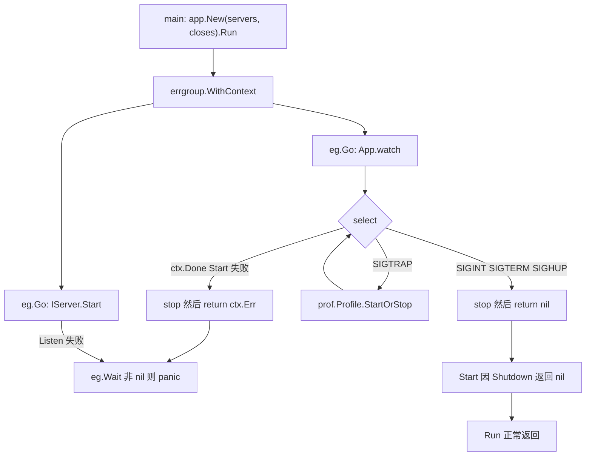
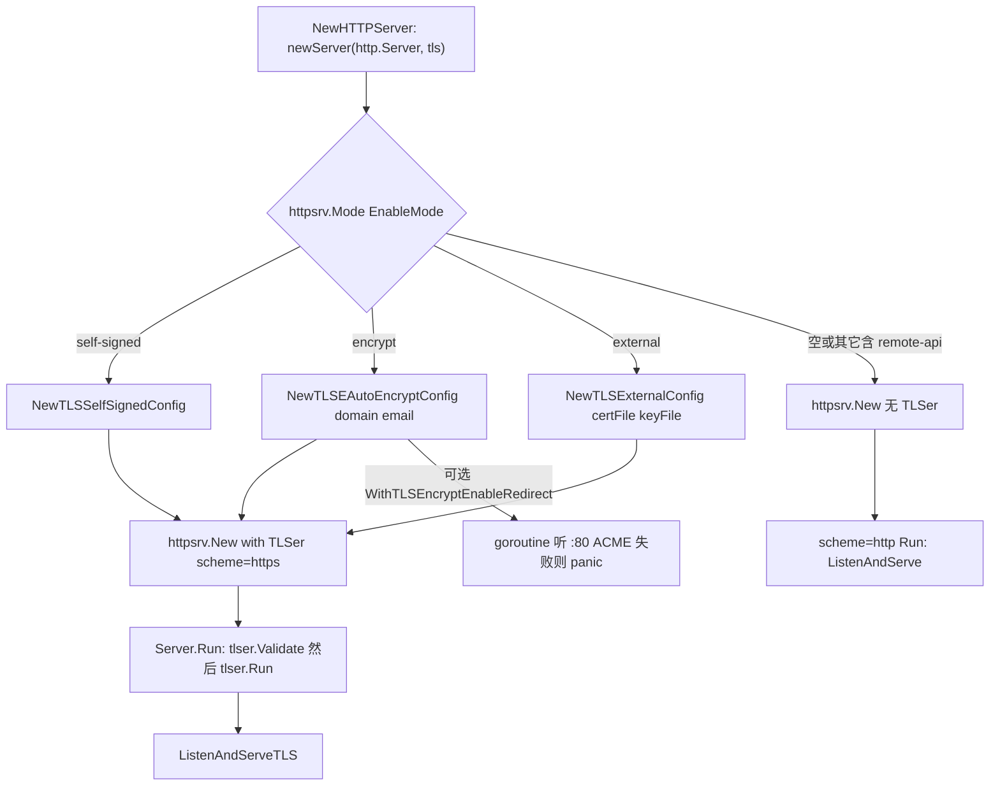
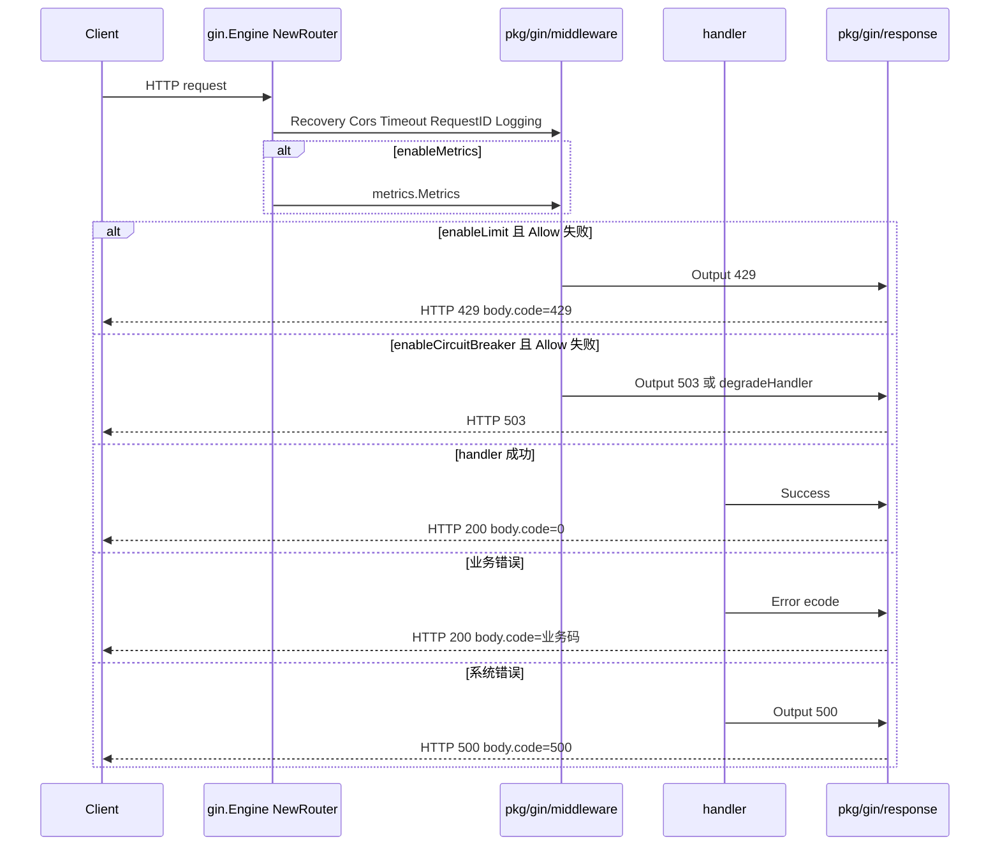

# pkg 应用生命周期与 Gin

> 状态：待复核生成稿
> 生成日期：2026-08-16
> 基准提交：`23807238c62e0f3b3e2d9a341bbef50547d3f5ec`
> 工作区：dirty
> 源码范围：`pkg/app/`、`pkg/httpsrv/`、`pkg/gin/`（含 `middleware`、`middleware/auth`、`middleware/metrics`、`response`、`handlerfunc`、`swagger`、`prof`、`validator`、`frontend`、`staticfs`、`proxy`）
> 生成方式：源码、测试、配置与部署资产静态分析

装配点与一次 `GetByID` 如何落到 handler，见 [09-生成项目启动与HTTP请求链.md](09-生成项目启动与HTTP请求链.md)。主链每跳的失败与边界见 [03-详细逐步说明-主链路拆解.md](03-详细逐步说明-主链路拆解.md)。本篇只把这三个包写到可重实现深度。

## 目录

- [快速摘要](#快速摘要)
- [为什么这样设计（Why）](#为什么这样设计why)
- [它是什么（What）](#它是什么what)
- [代码如何实现（How）](#代码如何实现how)
  - [pkg/app：进程生命周期](#pkgapp进程生命周期)
  - [pkg/httpsrv：HTTP 传输与全部 TLS 模式](#pkghttpsrvhttp-传输与全部-tls-模式)
  - [生成项目如何打开 Gin 中间件](#生成项目如何打开-gin-中间件)
  - [pkg/gin/middleware：CORS / RequestID / Logging / Timeout](#pkgginmiddlewarecors--requestid--logging--timeout)
  - [pkg/gin/middleware：限流与熔断](#pkgginmiddleware限流与熔断)
  - [pkg/gin/middleware：Tracing](#pkgginmiddlewaretracing)
  - [pkg/gin/middleware：JWT Auth](#pkgginmiddlewarejwt-auth)
  - [pkg/gin/middleware/auth：InitAuth 版 JWT 与 Rails Cookie](#pkgginmiddlewareauthinitauth-版-jwt-与-rails-cookie)
  - [pkg/gin/middleware/metrics](#pkgginmiddlewaremetrics)
  - [pkg/gin/response：Success / Error / Output / Out](#pkgginresponsesuccess--error--output--out)
  - [pkg/gin/handlerfunc](#pkgginhandlerfunc)
  - [pkg/gin/swagger](#pkgginswagger)
  - [pkg/gin/prof](#pkgginprof)
  - [pkg/gin/validator：是否被生成项目接线](#pkgginvalidator是否被生成项目接线)
  - [pkg/gin/frontend](#pkgginfrontend)
  - [pkg/gin/staticfs](#pkgginstaticfs)
  - [pkg/gin/proxy](#pkgginproxy)
- [调用关系表](#调用关系表)
- [对应测试](#对应测试)
- [阅读源码建议顺序](#阅读源码建议顺序)
- [重新实现检查清单](#重新实现检查清单)

---

## 快速摘要

### 架构总览（模块与依赖）

这三个包是生成 HTTP 服务的运行时底座，不认识业务表或 proto。依赖方向固定：

```text
cmd/*/main.go
  → pkg/app.App.Run
      → app.IServer.Start / Stop（模板实现是 internal/server.httpServer）
          → pkg/httpsrv.Server.Run / Shutdown
              → TLSer（四种 TLS + 明文 HTTP）
          → gin.Engine（internal/routers.NewRouter）
              → pkg/gin/middleware*、handlerfunc、swagger、prof、response
```

`pkg/app` 只认识 `IServer{Start,Stop,String}` 和 `Close func() error`，用 `errgroup` 并发启动、用 OS 信号关闭。`pkg/httpsrv` 只认识 `*http.Server` 和 `TLSer`。`pkg/gin` 全部子包都是 Gin 插件：中间件、统一 JSON、健康检查、Swagger、pprof、可选静态站与反向代理。`pkg/gin/validator` 实现了 Gin 的 `binding.StructValidator`，但生成项目的 `NewRouter` **没有**调用 `Init()`，也没有赋值 `binding.Validator`。

### 核心调用序列（逐步逻辑）

以 `sponge web http` 生成服务、进程从启动到 SIGTERM 退出为例（生成链见 [03](03-详细逐步说明-主链路拆解.md) 跳 1–10，装配见 [09](09-生成项目启动与HTTP请求链.md)）：

1. `cmd/serverNameExample_httpExample/main.go:main` 调用 `initial.InitApp` → `CreateServices` → `Close(services)` → `app.New(services, closes).Run()`。
2. `App.Run` 用 `errgroup.WithContext` 为每个 `IServer` 起 goroutine：打印 `String()`，再 `Start()`；另起 `watch`。
3. `httpServer.Start`（`internal/server/http.go`）：可选 Registry 5s `Register`，再 `httpsrv.Server.Run`。
4. `httpsrv.New` 若未注入 `TLSer` 则 `scheme=http`，`Run` 走 `ListenAndServe`；否则 `scheme=https`，按 `tls.EnableMode` 分发到自签 / Let's Encrypt / 外部证书。`ModeRemoteAPI` 在 `pkg/httpsrv` 存在，生成项目的 `newServer` **未接线**。
5. `watch` 监听 `SIGINT/SIGTERM/SIGHUP/SIGTRAP` 以及 errgroup 的 `ctx.Done()`。前三个信号调用 `stop()`（按 `closes` 顺序释放）后 `return nil`；`SIGTRAP` 调用 `pkg/prof.Profile.StartOrStop()`，**不退出**。
6. `initial.Close` 把 `s.Stop`（即 `httpsrv.Shutdown` 3s）放进 `closes` 的第一项。`app.stop` **不会**自己调 `IServer.Stop`。
7. 请求进入 `NewRouter`：`Recovery → Cors → 可选 Timeout → RequestID → Logging → 可选 metrics/limit/breaker/trace/pprof`，再落到 handler；成功走 `response.Success`（HTTP 200 + `body.code=0`），业务错误走 `response.Error`（仍 HTTP 200）。

### 易错点与边界条件

- `App.Run` 在 `eg.Wait()` 非 nil 时 **`panic`**。某个 `Start` 失败（端口占用、TLS 校验失败）会打爆进程，而不是记日志后继续。
- `app.stop` 遇到第一个 `Close` 错误立即返回，后续 close（关库、`logger.Sync`）不再执行。
- `response.Success` 与 `response.Error` 的 HTTP 状态永远是 200；改 HTTP 状态码的是 `Output` / `Out`。`Output(200)` 的 `body.code` 是 **200 不是 0**。
- 熔断看的是 `c.Writer.Status()`（HTTP 状态）。模板 `WithValidCode(errcode.InternalServerError.Code(), ServiceUnavailable.Code())` 传入的是业务码 `100003` / `100013`，**对 HTTP 状态比较无效**。默认已把 500/503 算失败；`response.Error` 的 HTTP 200 **不会**触发熔断。
- `pkg/gin/validator.Init` 全仓库除 `validator_test.go` 外无引用。与 [09](09-生成项目启动与HTTP请求链.md) 结论一致：生成项目 `binding` 标签走 Gin 内置 validator。
- `frontend.New` **没有**把 `With404ToHome` 写进 `FrontEnd.is404ToHome`，该 Option 当前是空操作。
- `httpsrv.ModeRemoteAPI` 与 YAML 注释中的三种 TLS 模式不对齐；空 `enableMode` 走明文 HTTP。
- 本篇未运行测试套件；测试结论来自阅读 `*_test.go`，不宣称测试通过。

---

## 为什么这样设计（Why）

Sponge 要让同一套业务长出纯 HTTP、纯 gRPC、双协议、HTTP 网关等多种进程。如果生命周期、TLS、Gin 中间件和 JSON 信封都写进每个 `cmd/`，模板会爆炸。

必须保持的行为契约：

1. **进程编排与传输解耦**。`pkg/app` 不知道 Gin 或 gRPC；只要实现 `IServer`，就能被同一套信号与 errgroup 托管。HTTP 与 gRPC 可以在同一个 `App` 里并行 `Start`。
2. **TLS 是注入而不是 if-else 散落**。`httpsrv.TLSer` 把自签、ACME、外部文件、远程 API 收成同一对 `Validate` + `Run`。明文 HTTP 就是 `tlser == nil`。
3. **JSON 信封统一**。业务 handler 只调 `response.Success` / `Error`；限流、熔断、JWT 失败才用 `Output` / `Out` 改 HTTP 状态。客户端可以始终先读 `body.code`。
4. **中间件用配置开关**。默认只开 Recovery、CORS、RequestID、Logging；metrics / 限流 / 熔断 / trace / pprof 由 `configs/*.yml` 的 `app.enable*` 打开，避免用户改 `NewRouter`。

可以替换的实现：Gin 换成别的 HTTP 框架（只要仍实现 `http.Handler`）；`TLSer` 换成自己的证书来源；限流算法换成固定 QPS；JWT 换成 Session。不能替换的是：`IServer` 三方法、`Close` 顺序语义、`{code,msg,data}` 信封、SIGINT 后必须把 `IServer.Stop` 放进 `closes`。

---

## 它是什么（What）

| 包 | 公开身份 | 生成项目是否默认接线 |
|---|---|---|
| `pkg/app` | 多服务启停与信号处理 | 是，每个 `cmd/*/main.go` |
| `pkg/httpsrv` | `http.Server` + TLS 策略 | 是，`internal/server/http.go` 的 `newServer` |
| `pkg/gin/middleware` | CORS、日志、RequestID、超时、限流、熔断、Trace、JWT | 是（JWT 在路由模板里被注释，默认关） |
| `pkg/gin/middleware/metrics` | Prometheus 五指标 + `/metrics` | 是，`app.enableMetrics` 默认 true |
| `pkg/gin/middleware/auth` | 需 `InitAuth` 的 JWT，以及 Rails Cookie 解密 | 否；性能测试/跨语言对接才用 |
| `pkg/gin/response` | 统一 JSON | 是，全部 Gin handler |
| `pkg/gin/handlerfunc` | `/health` `/ping` `/codes`、SPA history 回退 | 是（前三个）；SPA 回退给 sponge UI 用 |
| `pkg/gin/swagger` | 注册 swag Spec 并挂 gin-swagger | Protobuf HTTP 用 `CustomRouter`；SQL/Gin 模板直接用 `ginSwagger` |
| `pkg/gin/prof` | 把 `net/http/pprof` 挂到 Gin | 是，`app.enableHTTPProfile` 默认 false |
| `pkg/gin/validator` | 可替换 Gin `binding.Validator` | **否**，仅测试接线 |
| `pkg/gin/frontend` | 本地目录或 `embed.FS` 静态站 | 否；`cmd/sponge` 的 perftest UI 用 |
| `pkg/gin/staticfs` | 带存在性缓存的磁盘静态文件与目录浏览 | 否 |
| `pkg/gin/proxy` | 基于 `pkg/proxykit` 的 Gin 反向代理 | 否 |

`pkg/app` 还依赖 `pkg/prof`（不是 `pkg/gin/prof`）：`SIGTRAP` 在进程内开关 CPU/heap 等采样文件。HTTP 路由上的 pprof 是另一套，由 `app.enableHTTPProfile` 控制。

---

## 代码如何实现（How）

### pkg/app：进程生命周期

文件：`pkg/app/app.go`。测试：`pkg/app/app_test.go`。

#### 公开类型

```go
type IServer interface {
    Start() error
    Stop() error
    String() string
}

type Close func() error

type App struct {
    servers []IServer
    closes  []Close
}

func New(servers []IServer, closes []Close) *App
func (a *App) Run()
```

`watch` 与 `stop` 未导出，只被 `Run` 使用。测试通过同一包内直接调 `a.watch` / `a.stop`。



#### `Run`

1. `eg, ctx := errgroup.WithContext(context.Background())`。任一 goroutine 返回非 nil，`ctx` 被取消。
2. 对每个 `IServer`：`s := server` 捕获循环变量，`eg.Go` 里 `fmt.Println(s.String())` 然后 `return s.Start()`。`Start` 应阻塞到服务结束。
3. 再 `eg.Go(a.watch)`。
4. `eg.Wait()` 非 nil → `panic(err)`。成功（watch 收到退出信号并 `return nil`，各 `Start` 因 Shutdown 返回 nil）则 `Run` 正常返回。

模板 `httpServer.Start` 在 `ListenAndServe` 返回非 `http.ErrServerClosed` 时把错误包装后返回，因此端口占用会 panic 整个进程。这与 [03](03-详细逐步说明-主链路拆解.md) 跳 13 一致。

#### `watch`

```text
signal.Notify(sig, SIGINT, SIGTERM, SIGHUP, SIGTRAP)
profile := prof.NewProfile()
loop:
  ctx.Done()     → stop(); return ctx.Err()
  SIGTRAP        → profile.StartOrStop(); 继续循环
  SIGINT/TERM/HUP → stop(); 打印 "stop app successfully"; return nil
```

`pkg/prof.Profile.StartOrStop` 用进程级 `atomic` 状态在「开始采样 / 停止采样」之间切换。第一次 SIGTRAP：在 `$TMPDIR/<进程名>_profile/` 写下 cpu/mem/goroutine/block/mutex/threadcreate（可选 trace）文件，默认最多采 60 秒（`SetDurationSecond` 可改）；第二次 SIGTRAP 或超时后停止。失败只 `fmt.Println`，不返回给 `watch`。`EnableTrace()` 才会采 execution trace。本篇不展开 `pkg/prof` 每个 Lookup 名，契约是：**SIGTRAP 不退出进程**。

#### `stop`

按切片顺序调用每个 `Close`。任一非 nil 立即返回，**剩余 Close 被跳过**。`App` 不遍历 `servers` 调 `Stop`。因此模板必须：

```go
// cmd/serverNameExample_httpExample/initial/close.go
for _, s := range servers {
    closes = append(closes, s.Stop)
}
```

HTTP 模板关闭顺序：`httpServer.Stop`（3s `Shutdown`；带 registry 时先 2s Deregister）→ `database.CloseDB` → 可选 Redis → 可选 `tracer.Close`（2s）→ `logger.Sync`。详见 [09](09-生成项目启动与HTTP请求链.md)「启动与关闭」。

#### 测试覆盖

| 用例 | 行为 |
|---|---|
| `TestApp` | 两个 mock server，`Start` 成功；后台 `Run`；`watch` 用已超时 ctx，断言返回 error（走 `ctx.Done` → `stop`）；再手动 `stop`。第一个 mock 的 `Stop` 返回错误，所以 `stop` 会打印该错误。 |
| `TestAppError` | `Start` 返回 error；`Run` 在 goroutine 里 recover panic；再 `stop`。 |

未覆盖：真实 OS 信号、`SIGTRAP`、`closes` 中途失败导致后续跳过、空 `servers`。

---

### pkg/httpsrv：HTTP 传输与全部 TLS 模式

#### `TLSer` 与 `Server`

文件：`pkg/httpsrv/http.go`。

```go
type TLSer interface {
    Validate() error
    Run(server *http.Server) error
}

func New(server *http.Server, tlser ...TLSer) *Server
func (s *Server) Run() error
func (s *Server) Shutdown(ctx context.Context) error
func (s *Server) Scheme() string // "http" 或 "https"
```

`New` 只取 `tlser[0]`。`tlser` 为空或元素为 nil → `scheme="http"`。否则 `scheme="https"`。`validate`：`server==nil` 返回 `"server must be specified"`；有 `tlser` 则调 `Validate()`。



`Run`：先 `validate`；无 TLS 走 `runHTTP`（`ListenAndServe`，忽略 `http.ErrServerClosed`）；有 TLS 走 `tlser.Run(s.server)`。`Shutdown`：`server==nil` 返回 nil，否则 `http.Server.Shutdown`。

#### `Mode` 常量

文件：`pkg/httpsrv/mode.go`。

| 常量 | 字面量 | 实现类型 | 生成项目 `newServer` |
|---|---|---|---|
| `ModeTLSSelfSigned` | `"self-signed"` | `TLSSelfSignedConfig` | 接线 |
| `ModeTLSEncrypt` | `"encrypt"` | `TLSAutoEncryptConfig` | 接线 |
| `ModeTLSExternal` | `"external"` | `TLSExternalConfig` | 接线 |
| `ModeRemoteAPI` | `"remote-api"` | `TLSRemoteAPIConfig` | **未接线**，落入 default 明文 HTTP |

配置字段：`internal/config.TLS`（`configs/serverNameExample.yml` 的 `http.tls`）：

| YAML | Go | 用途 |
|---|---|---|
| `enableMode` | `EnableMode` | 与上表字面量比较 |
| `domain` | `Domain` | encrypt 必填 |
| `email` | `Email` | encrypt 必填 |
| `certFile` | `CertFile` | external 必填 |
| `keyFile` | `KeyFile` | external 必填 |

YAML 注释只列三种模式，没有 `remote-api`。空字符串走 default HTTP。

模板调用：`server.WithHTTPTLS(cfg.HTTP.TLS)` → `newServer` 的 `switch httpsrv.Mode(tls.EnableMode)`。`http.go` 与 `http.go.noregistry` 的 TLS 分支相同。

#### 模式 1：自签 `TLSSelfSignedConfig`

构造：`NewTLSSelfSignedConfig(opts ...TLSSelfSignedOption)`。

| Option | 默认 | 作用 |
|---|---|---|
| `WithTLSSelfSignedCacheDir` | `"configs/self_signed_certs"` | 证书目录 |
| `WithTLSSelfSignedExpirationDays` | `3650`（10 年） | 证书有效期 |
| `WithTLSSelfSignedWanIPs` | 空 | 额外写入 SAN 的 IP |

`Validate` 永不失败：空目录/过期天数/文件名会补默认。`cert.pem` / `key.pem` 拼在 `cacheDir` 下。

`Run` → `generateCert` → `ListenAndServeTLS(certFile, keyFile)`。

`generateCert`：文件不存在、PEM 解不出、Parse 失败、或剩余有效期 **小于 30 天** → `createCert`。否则复用。

`createCert`：删旧文件；ECDSA P-256；SAN 固定 `127.0.0.1` + `DNS:localhost`；`getLANIP` 用 UDP dial `8.8.8.8:80` 取本机出口 IPv4（失败则省略；loopback / 非 IPv4 丢弃）；再追加 `wanIPs`。`MkdirAll(cacheDir, 0760)`。Organization `"Dev Org"`，Serial=1。

生成项目调用 `NewTLSSelfSignedConfig()` **不传 Option**，证书落到进程 cwd 下的 `configs/self_signed_certs/`。

失败：密钥生成/写盘失败向上返回；`ListenAndServeTLS` 非 `ErrServerClosed` 包装为 `"[https server] listen and serve TLS error"`。

#### 模式 2：Let's Encrypt `TLSAutoEncryptConfig`

构造函数名是 **`NewTLSEAutoEncryptConfig`**（多一个 `E`）。参数：`domain, email string, opts ...TLSEncryptOption`。

| Option | 默认 | 作用 |
|---|---|---|
| `WithTLSEncryptCacheDir` | `"configs/encrypt_certs"` | ACME 缓存 |
| `WithTLSEncryptEnableRedirect(httpAddr...)` | `enableRedirect=false`，`httpAddr=":80"` | 另起 HTTP 处理 ACME challenge 并重定向 |

`Validate`：`domain==""` → `"domain must be specified in encrypt mode"`；`email==""` 同理。空 cacheDir/httpAddr 补默认。

`Run`：`autocert.Manager{DirCache, AcceptTOS, HostWhitelist(domain), Email}`，把 `m.TLSConfig()` 赋给 `server.TLSConfig`，然后 `ListenAndServeTLS("", "")`（证书由 Manager 提供）。若 `enableRedirect`：goroutine 里 `redirectHTTP`（`m.HTTPHandler(nil)` 听 `httpAddr`）；该 goroutine 失败会 **`panic`**。HTTPS `Run` 返回后 3s 内 `Shutdown` 重定向服务器。

模板注释掉了 `WithTLSEncryptEnableRedirect()`，默认不听 80。生产若没有外置反向代理处理 HTTP-01，ACME 会失败。

#### 模式 3：外部证书 `TLSExternalConfig`

`NewTLSExternalConfig(certFile, keyFile)`。无 Option。`Validate`：任一路径空则报错。`Run`：`ListenAndServeTLS(certFile, keyFile)`，不检查文件是否存在（失败要等 Listen）。

#### 模式 4：远程 API `TLSRemoteAPIConfig`（库有，模板无）

`NewTLSRemoteAPIConfig(url string, opts ...TLSRemoteAPIOption)`。

| Option | 默认 | 作用 |
|---|---|---|
| `WithTLSRemoteAPIHeaders` | nil | 下载请求头 |
| `WithTLSRemoteAPITimeout` | 5s；`Validate` 时若 `<=100ms` 重置为 5s | HTTP 客户端超时 |
| `WithTLSRemoteAPICacheDir` | `"configs/remote_api_certs"` | 落盘目录 |

`Validate`：`url==""` 报 `"certURL and keyURL must be specified for remote API mode"`（文案残留双 URL，实际只有一个 URL）。补 cacheDir、timeout、`cert.pem`/`key.pem`、创建 `http.Client`。

`downloadFile`：GET `url`，状态码非 2xx 失败；body JSON：

```json
{"cert_file": "<bytes>", "key_file": "<bytes>"}
```

对应 `TLSRemoteAPIResponse` 的 `[]byte` 字段（JSON 里通常是 base64）。

`Run`：最多 **3 次**下载，失败间隔 3s。成功则 `MkdirAll 0760`，`cert.pem` 权限 0640。**三次都失败仍继续 `ListenAndServeTLS`**，指望缓存文件还在。这是降级：用旧证书启动；若文件也不存在，Listen 失败。

#### `http.Server` 模板参数

`NewHTTPServer` 固定：`IdleTimeout=60s`，`MaxHeaderBytes=1<<20`，Read/WriteTimeout 注释未开。`isProd`（`App.Env=="prod"`）→ `gin.ReleaseMode`，否则 `DebugMode`。

---

### 生成项目如何打开 Gin 中间件

装配文件：`internal/routers/routers.go`（SQL/Gin）与 `internal/routers/routers_pbExample.go`（Protobuf HTTP）。中间件顺序与默认 YAML 值见 [09](09-生成项目启动与HTTP请求链.md)「路由装配与 pkg/gin」。这里只补 **Option 默认值、失败语义、以及 09 未展开的子包**。

配置开关（`configs/serverNameExample.yml` → `internal/config.App` / `HTTP`）：

| 配置 | 默认 | 打开的中间件或路由 |
|---|---|---|
| 无（始终） | — | `gin.Recovery`、`Cors()`、`RequestID()`、`Logging(...)`、`/health` `/ping` `/codes` |
| `http.timeout` | `0` | `>0` 才 `Timeout(time.Second * Timeout)` |
| `app.enableMetrics` | `true` | `metrics.Metrics`，忽略 HTTP 404 |
| `app.enableLimit` | `false` | `RateLimit()` 无自定义 Option |
| `app.enableCircuitBreaker` | `false` | `CircuitBreaker(WithValidCode(100003, 100013))` |
| `app.enableTrace` | `false` | `Tracing(App.Name)` |
| `app.enableHTTPProfile` | `false` | `prof.Register(r, WithIOWaitTime())` |
| `app.env` | `"dev"` | `!= "prod"` 才挂 `/config` 与 Swagger |
| 路由模板注释 | — | `middleware.Auth()` 默认不开 |

YAML 注明：若打开 HTTP pprof，`http.timeout` 必须为 0 或大于 60s，否则 `/debug/pprof/profile` 会被超时中间件杀掉。

Protobuf 路由的 Swagger 走 `swagger.CustomRouter(r, "apis", docs.ApiDocs)`，URL 为 `/apis/swagger/index.html`。SQL/Gin 模板直接 `ginSwagger.WrapHandler`，URL `/swagger/index.html`。



---

### pkg/gin/middleware：CORS / RequestID / Logging / Timeout

#### `Cors`

文件：`pkg/gin/middleware/cors.go`。类型别名 `CoresConfig = cors.Config`（拼写是 Cores 不是 Cors）。

| Option | 默认 |
|---|---|
| `WithNewConfig(*CoresConfig)` | nil，用下面字段拼 `cors.Config` |
| `WithAllowOrigins` | `["*"]` |
| `WithAllowMethods` | GET POST PUT DELETE PATCH OPTIONS |
| `WithAllowHeaders` | Origin, Authorization, Content-Type, Accept, X-Requested-With, X-CSRF-Token |
| `WithExposeHeaders` | Content-Length, text/plain, Authorization, Content-Type |
| `WithMaxAge` | 12h |
| `WithAllowCredentials` | **true** |
| `WithAllowWildcard` | true |

`WithNewConfig` 非 nil 时完全替换，忽略其余 Option。生成项目 `Cors()` 无参。浏览器规范禁止 `Allow-Origin: *` 且 `Allow-Credentials: true`；`TestCorsWithDefaultOptions` 不带 `Origin` 头，未触发该组合。失败：预检由 `gin-contrib/cors` 处理，本包不 Abort。

#### `RequestID`

文件：`pkg/gin/middleware/requstid.go`（文件名少一个 e）。

包级变量（Option 会改它们，**进程内全局**）：

| 变量 | 默认 |
|---|---|
| `ContextRequestIDKey` | `"request_id"` |
| `HeaderXRequestIDKey` | `"X-Request-Id"` |
| `RequestHeaderKey` | `"request_header_key"` |
| `RequestIDKey` | `CtxKeyString("request_id")` |

| Option | 约束 | 默认 |
|---|---|---|
| `WithContextRequestIDKey` | 长度 `<4` 忽略 | `request_id` |
| `WithHeaderRequestIDKey` | 长度 `<4` 忽略 | `X-Request-Id` |

中间件：读请求头；空则 `krand.String(krand.R_All, 10)` 并写回请求头；`c.Set`；写响应头；`c.Next()`。不失败、不 Abort。

辅助函数（handler / dao 用，见 [03](03-详细逐步说明-主链路拆解.md) 跳 15）：

| 函数 | 行为 |
|---|---|
| `GCtxRequestID` / `GCtxRequestIDField` | 从 gin Keys 取，zap 字段名是 `ContextRequestIDKey` |
| `HeaderRequestID` / `HeaderRequestIDField` | 从请求头取，zap 字段名是头名 |
| `WrapCtx` | `context.WithValue` 写入 request_id 与整个 `http.Header`（key 为 string，非 `CtxKeyString`） |
| `AdaptCtx` | 若 `ctx` 实际是 `*gin.Context`，转 `WrapCtx` |
| `CtxRequestID` / `CtxRequestIDField` | 从 `context.Context` 取 |
| `GetFromCtx` / `GetFromHeader` / `GetFromHeaders` | 泛型取值；header 类型断言失败返回 `""` / 空切片 |

#### `Logging` / `SimpleLog`

共用 `Option`（注意与 metrics/prof 的 `Option` 不同包）。

| Option | 默认 | 失败/边界 |
|---|---|---|
| `WithMaxLen` | 300 | `<8`（`len(" ...... ")`）**panic** |
| `WithLog` | `zap.NewProduction()` | nil 被忽略 |
| `WithIgnoreRoutes` | `/ping` `/pong` `/health` | **追加**到默认 map，不是替换。精确匹配 `URL.Path` |
| `WithPrintErrorByCodes` | HTTP 500/502/503 | 写入**包级** `printErrorBySpecifiedCodes`，不是 options 实例 |
| `WithRequestIDFromContext` | 关（0） | 从 gin Keys 取 |
| `WithRequestIDFromHeader` | 关 | 从请求头取 |

生成项目：`WithLog(logger.Get())`、`WithRequestIDFromContext()`、`WithIgnoreRoutes("/metrics")`。忽略列表因此是 ping/pong/health **加上** `/metrics`。

`Logging`：忽略路径直接 `Next`。否则读完整 Body 到 buffer（POST/PUT/PATCH/DELETE 才打 size/body），打印 `<<<<`，把 Body 塞回 `NopCloser`，用 `bodyLogWriter` 复制响应，`Next` 后打印 `>>>>`。HTTP 码在 `printErrorBySpecifiedCodes` 中则 `Error` 且关掉 stacktrace（`AddStacktrace(PanicLevel)`），否则 `Info`。耗时单位微秒 `time_us`。

`getResponseBody` 在 `n < maxLen` 时返回 `body[:n-1]`，会丢掉响应最后一个字节。`getRequestBody` 无此裁切。

`SimpleLog` 不读 Body、不包 Writer，只打响应码/URL/耗时/size。模板注释写可用它替换 `Logging`。

敏感信息：用 `WithIgnoreRoutes` 排除，没有脱敏钩子。

#### `Timeout`

与限流写在同一文件 `ratelimit.go`。`Timeout(d)`：`d < 1ms` 返回空中间件（什么都不做）。否则 `WithTimeout` 后 `Next`；若 `ctx.Err()==DeadlineExceeded`：若 Writer 仍是 200 则 `AbortWithStatus(504)`，否则只 `Abort`。`cancel` 被丢弃（`//nolint`），依赖请求结束 GC。不写 JSON 信封。

---

### pkg/gin/middleware：限流与熔断

#### `RateLimit`

依赖 `pkg/shield/ratelimit` 的自适应 BBR。`ErrLimitExceed` 是对该包错误的别名。

| Option | 默认 |
|---|---|
| `WithWindow` | 10s |
| `WithBucket` | 100 |
| `WithCPUThreshold` | 800（千分比，约 80% CPU） |
| `WithCPUQuota` | 0（让 limiter 自己采进程 CPU） |

`Allow()` 失败：`response.Output(c, 429, err.Error())` 然后 `Abort`。成功：`Next` 后 `done(DoneInfo{Err: c.Request.Context().Err()})`，用于更新 in-flight / RT 统计。模板默认关；打开时不传 Option。

HTTP 429 信封见下文 `Output`：`code=429`，`msg` 为 `errcode.LimitExceed.Msg()`（`"Limit Exceed"`），`data` 为错误字符串。

#### `CircuitBreaker`

按 `c.FullPath()` 从 `pkg/container/group.Group` 懒创建 `circuitbreaker.CircuitBreaker`。未匹配路由的 `FullPath()` 为空，所有 404 共用一个 breaker。

| Option | 默认 |
|---|---|
| `WithGroup` | 已 Deprecated；默认 `group.NewGroup(circuitbreaker.NewBreaker)` |
| `WithBreakerOption` | 把 `circuitbreaker.Option` 包进新 Group（空切片不替换） |
| `WithValidCode` | **追加**到 map；默认已有 HTTP **500 和 503** |
| `WithDegradeHandler` | nil |

`Allow` 失败：`MarkFailed()`（让丢弃比升高），若有 degradeHandler 则调用，否则 `Output(c, 503, err.Error())`，然后 `Abort`。`Next` 之后看 `Writer.Status()` 是否在 `validCodes`：命中 `MarkFailed`，否则 `MarkSuccess`。

模板传入 `WithValidCode(100003, 100013)`。熔断比较的是 HTTP 状态，这两个业务码**永远不会等于** `Writer.Status()`。真正生效的仍是默认 500/503。`response.Error` 写 HTTP 200，**不会**记失败。系统错误若走 `response.Output(c, ecode.InternalServerError.ToHTTPCode())`（HTTP 500）才会熔断。`ErrNotAllowed` 是 `circuitbreaker.ErrNotAllowed` 的别名。

---

### pkg/gin/middleware：Tracing

`Tracing(serviceName string, opts ...TraceOption)`。

| Option | 默认 |
|---|---|
| `WithTracerProvider` | `otel.GetTracerProvider()` |
| `WithPropagators` | `otel.GetTextMapPropagator()` |

从请求头 Extract，span 名是 `FullPath()`，空则 `"HTTP <method> route not found"`。属性用 otel semconv v1.12。`Next` 后按 HTTP 状态设 span status；`c.Errors` 非空则写入 `gin.errors`。defer 把 `Request.Context` 恢复成进入前的值。模板在 `enableTrace` 时传入 `config.Get().App.Name`。Tracer 初始化（Jaeger exporter）在 `InitApp`，不在本包。

---

### pkg/gin/middleware：JWT Auth

文件：`pkg/gin/middleware/jwtAuth.go`。这是生成项目注释里写的那一个，**不需要** `InitAuth`。

`const HeaderAuthorizationKey = "Authorization"`。

| Option | 默认 |
|---|---|
| `WithSignKey([]byte)` | nil → `pkg/jwt` 包内默认 HMAC key |
| `WithReturnErrReason()` | false：响应 msg 只有 `"Unauthorized"` |
| `WithExtraVerify(fn)` | nil。`WithVerify` 是它的别名 |

校验顺序：

1. `len(authorization) < 100` → 非法。`"Bearer "` 占 7 字节，意味着 token 至少约 93 字节。短 JWT 会被直接拒绝。
2. `tokenString := authorization[7:]`，**不检查**是否真是 `Bearer ` 前缀。
3. `jwt.ValidateToken(tokenString, WithValidateTokenSignKey(signKey))`。
4. 可选 `extraVerifyFn(claims, c)`。
5. 成功 `c.Set("claims", claims)`。

失败一律 `response.Out(c, Unauthorized)` 后 `Abort`。`Out` 把 `errcode.Unauthorized`(100002) 转成 **HTTP 401**，`body.code` 也是 401（不是 100002）。`GetClaims(c) (*jwt.Claims, bool)` 从 Keys 取。

模板 `userExampleRouter` 里 `g.Use(middleware.Auth())` 被注释，默认匿名。Protobuf 侧 `setGroupPath` / `setSinglePath` 同样注释。测试 `jwtAuth_test.go:TestAuth` 覆盖缺 token、错误 token、extraVerify、取 claims。

---

### pkg/gin/middleware/auth：InitAuth 版 JWT 与 Rails Cookie

#### JWT（需先 `InitAuth`）

文件：`pkg/gin/middleware/auth/jwt.go`。类型 `SigningMethodHMAC`、`Claims`、`HS256/384/512` 是 `pkg/jwt` 的别名。

`InitAuth(signingKey []byte, expire time.Duration, opts ...InitAuthOption)` 写入包级变量。

| InitAuthOption | 默认 |
|---|---|
| `WithInitAuthSigningMethod` | HS256 |
| `WithInitAuthIssuer` | `""`（不写 iss） |

| 函数 | 未 Init 时 |
|---|---|
| `GenerateToken(uid, WithGenerateTokenFields(map))` | **panic** `"jwt option is nil, please initialize first, call middleware.InitAuth()"`（文案包名仍写 middleware） |
| `ParseToken` | 同样 panic（只查 `customSigningMethod==nil`） |
| `RefreshToken(claims)` | 直接用包级 key，不检查 Init |

`Auth` 与 `middleware.Auth` 流程相同（`<100` 字节拒绝、切 `[7:]`、`Out`+Abort），但验签走 `ParseToken`（包级 key），**没有** `WithSignKey`。Option 只有 `WithReturnErrReason`、`WithExtraVerify`。`GetClaims` 同名同行为。

生成项目不调用 `InitAuth`，也不挂这个 `auth.Auth`。

#### Rails Cookie

`DecodeSignedCookie(secretKeyBase, cookie, cookieName)`：Rails 7.1+ encrypted cookie。格式 `base64(data)--base64(iv)--base64(authTag)`；PBKDF2-HMAC-SHA256(secret, `"authenticated encrypted cookie"`, 1000, 32)；AES-256-GCM，AAD 空。明文 JSON 信封 `_rails.pur` 必须等于 `"cookie.<cookieName>"`，`_rails.message` 再 base64+JSON 成 `map[string]any`。

`UserIDFromSession`：读 `warden.user.user.key`，期望 `[[id], ...]`，返回 `inner[0]`。

`middleware.RailsCookieAuthMiddleware(secretKeyBase, cookieName)`：读 Cookie，失败 JSON 401 `{"error":"Missing cookie"}` / `"Invalid cookie"`（**不是** `response` 信封）；成功 `c.Set("rails_session", session)`。

`session.go` 其余内容是指向 `gin-contrib/sessions` 的注释，本仓库不封装 Redis/cookie store。

---

### pkg/gin/middleware/metrics

`Metrics(r *gin.Engine, opts ...Option) gin.HandlerFunc` 有副作用：`initPrometheus()`（`MustRegister` 五个 collector，并 `time.Tick(1 minute)` 给 `gin_uptime` +1），以及 `r.GET(metricsPath, promhttp.Handler)`。

| Option | 默认 |
|---|---|
| `WithMetricsPath` | `"/metrics"` |
| `WithIgnoreStatusCodes` | nil（不忽略） |
| `WithIgnoreRequestPaths` | nil |
| `WithIgnoreRequestMethods` | nil，比较时 `ToUpper` |

忽略判定是 **或**：状态码 / 路径 / 方法任一命中则不记数。模板忽略 404。标签是 `status, path, method`，path 用 `URL.Path` 不是 `FullPath()`，带 path 参数的接口会造成高基数。`Writer.Size()<0` 记 0。`calcRequestSize` 累加 URL/Method/Proto/Header/Host/ContentLength。

约束：`MustRegister` 使 **进程内第二次 `Metrics()` 会 panic**。`uptime` 的 ticker 永不停止。

指标名：`gin_uptime`、`gin_http_request_count_total`、`gin_http_request_duration_seconds`、`gin_http_request_size_bytes`、`gin_http_response_size_bytes`。

---

### pkg/gin/response：Success / Error / Output / Out

文件：`pkg/gin/response/response.go`。这是 HTTP JSON 的唯一信封。

```go
type Result struct {
    Code int         `json:"code"`
    Msg  string      `json:"msg"`
    Data interface{} `json:"data"`
}
```

`data==nil` 时写成 `&struct{}{}`，JSON 为 `{}`，避免 `data: null`。注释标明：`[]interface{}` 仍可能序列化成 `null`。

| 函数 | HTTP 状态 | `body.code` | `body.msg` | 典型调用方 |
|---|---|---|---|---|
| `Success(c, data...)` | 200 | **0** | `"ok"` | CRUD 成功 |
| `Error(c, *errcode.Error, data...)` | **200** | `err.Code()`（如 100001） | `err.Msg()` | 业务错误 |
| `Output(c, httpStatus, data...)` | 等于参数 | **等于 HTTP 状态** | 见下表 | 限流 429、熔断 503、handler 里系统 500 |
| `Out(c, *errcode.Error, data...)` | `err.ToHTTPCode()` | **等于 HTTP 状态** | `err.Msg()` | JWT `Auth` 失败 |

`Output` 的 msg 映射：

| HTTP 码 | msg 来源 |
|---|---|
| 200 | `"ok"` |
| 400 | `InvalidParams` `"Invalid Parameter"` |
| 401 | `Unauthorized` |
| 403 | `Forbidden` |
| 404 | `NotFound` |
| 408 | `Timeout` |
| 409 | `Conflict` |
| 429 | `LimitExceed` `"Limit Exceed"` |
| 500 | `InternalServerError` |
| 503 | `ServiceUnavailable` |
| 其它 | `http.StatusText(code)` |

`Out` 用 `ToHTTPCode()`（`pkg/errcode/http_error.go`）：100003→500，100002→401，100013→503，未知业务码→500。`default` 分支 HTTP 码是 **510** `StatusNotExtended`。`Success` 的 code 0 对应 `errcode.Success`。

`data` 只取第一个变参。这与 [09](09-生成项目启动与HTTP请求链.md) / [03](03-详细逐步说明-主链路拆解.md) 的「业务错误 HTTP 200、系统错误才改状态码」一致。

示例：

```json
{"code":0,"msg":"ok","data":{"id":1}}
{"code":100001,"msg":"Invalid Parameter","data":{}}
{"code":500,"msg":"Internal Server Error","data":{}}
```

第一条 `Success`；第二条 `Error(InvalidParams)`，HTTP 仍 200；第三条 `Output(500)`，HTTP 500。

---

### pkg/gin/handlerfunc

| 符号 | 路由（模板） | 响应 |
|---|---|---|
| `CheckHealth` | `GET /health` | `{status:"UP", hostname}`，hostname 来自 `pkg/utils.GetHostname` |
| `Ping` | `GET /ping` | `{}` |
| `ListCodes` | `GET /codes` | `errcode.ListHTTPErrCodes()` |
| `BrowserRefresh(path)` | 通常 `NoRoute` | `Accept` 含 `text/html` 则读本地文件；失败 404 `"Not Found"` |
| `BrowserRefreshFS(fs, path)` | 同上，`embed.FS` | 同逻辑 |

`BrowserRefresh*` 写完 body 后 `Header().Add("Accept", "text/html")`（应是 Content-Type；写在 `WriteHeader` 之后，对已发出的头无效）。非 HTML Accept 则什么都不写，Gin 会落到 404。

sponge UI（`cmd/sponge/server/http.go`）用 `BrowserRefreshFS(staticFS, "static/index.html")` 解决 Vue history。生成业务项目不用这两个函数。

---

### pkg/gin/swagger

| 函数 | 读入 | 注册名 | URL |
|---|---|---|---|
| `DefaultRouter(r, jsonContent)` | 内存字节 | `"swagger"` | `/swagger/*any` |
| `DefaultRouterByFile(r, jsonFile)` | 文件；读失败 **只 printf，不 return error** | `"swagger"` | 同上 |
| `CustomRouter(r, name, jsonContent)` | 内存 | `name` | `/{name}/swagger/*any`，`InstanceName(name)` |
| `CustomRouterByFile(r, jsonFile)` | 文件；失败同样只打印 | 文件名去掉扩展名 | `/{prefix}/swagger/*any` |

`registerSwagger`：`swag.Spec{Schemes: http/https, SwaggerTemplate: string(json)}` 后 `swag.Register`。重复 Register 可能 panic，测试里 `defer recover()`。

SQL/Gin 模板不用这个包，直接 `docs.SwaggerInfo` + `ginSwagger`。Protobuf HTTP 用 `CustomRouter(r, "apis", docs.ApiDocs)`。

---

### pkg/gin/prof

与 `pkg/prof`（SIGTRAP 写文件）不是同一个包。

`Register(r *gin.Engine, opts ...Option)`。默认前缀 `/debug/pprof`。`WithPrefix("")` 被忽略。`WithIOWaitTime()` 额外挂 `/profile-io`（`felixge/fgprof`）。

路由：`/` cmdline profile symbol(GET+POST) trace allocs block goroutine heap mutex threadcreate。全部 `gin.WrapF/WrapH` 转标准库 pprof。

模板：`enableHTTPProfile` 时 `Register(r, WithIOWaitTime())`。`grpc-http-pb` 生成器会注释掉这段，改用 gRPC 侧 `grpc.httpPort`（默认 8283），见 [09](09-生成项目启动与HTTP请求链.md)。

---

### pkg/gin/validator：是否被生成项目接线

文件：`pkg/gin/validator/validator.go`。

```go
func Init() *CustomValidator
func NewCustomValidator() *CustomValidator
func (v *CustomValidator) ValidateStruct(obj interface{}) error
func (v *CustomValidator) Engine() interface{}
```

`Init` = `New` + `Engine()`。`Engine` 用 `sync.Once` 创建 `go-playground/validator/v10`，`SetTagName("binding")`，满足 Gin `binding.StructValidator`。

`ValidateStruct`：nil 跳过；指针先 Elem；struct 调 `Validate.Struct`；再遇到指针则递归；slice/array 逐元素递归；其它 kind 视为通过。若未 `Engine()` 就调用，`v.Validate` 为 nil 会 panic。

**接线核实（与 [09](09-生成项目启动与HTTP请求链.md) 交叉验证）：**

- 全仓库 `validator.Init` / `binding.Validator`：仅 `pkg/gin/validator/validator_test.go` 的 `runValidatorHTTPServer` 执行 `binding.Validator = Init()`。
- `internal/routers/routers.go`、`routers_pbExample.go`、`cmd/sponge/server/http.go` 均无引用。
- 生成 handler 的 `ShouldBindJSON` 使用 **Gin 默认** validator，同样认 `binding` 标签。本包多出来的能力（显式递归 slice、可单独 `ValidateStruct`）在生成项目中未使用。

`internal/types` 注释建议填写 binding 规则，那是给默认 validator 看的，不是给本包。

---

### pkg/gin/frontend

面向把 Vue/静态站嵌进 Gin。`New(sourceDir, opts...)`：空 `sourceDir` 变成 `"dist"`，并去掉首尾 `/`。

| Option | 意图 | 实际 |
|---|---|---|
| `WithEmbedFS(embed.FS)` | 用嵌入 FS | 写入 `isUseEmbedFS` |
| `WithHandleContent(fn, files...)` | 写出前改指定文件（如把 API 地址写入 `config.js`） | 有 files 则只改后缀匹配的；无 files 则改**所有**文件 |
| `With404ToHome()` | `NoRoute` 回 `index.html` | **`New` 未拷贝 `o.is404ToHome`，该 Option 无效** |

`SetRouter`：

- 本地文件：`GET /{sourceDir}/*filepath` → `c.File(sourceDir + filepath)`。
- embed 且无 `handleContentFn`：`http.FileServer(http.FS(embedFS))`。
- embed 且有 `handleContentFn`：`os.RemoveAll(sourceDir)`，把 FS walk 到本地（改内容），再走本地路由。并发调用会互删目录。

真实调用方：`cmd/sponge/commands/perftest/http/collector.go` 用 `frontend.New("perftest", WithEmbedFS, WithHandleContent(..., "appConfig.js"))`，再把 `/` 重定向到 `/perftest/index.html`。业务生成项目不用。

`is404ToHome` 分支里的 `browserRefresh` / `browserRefreshFS` 与 `handlerfunc` 同逻辑。因 Option 未接线，生成代码路径到不了。

---

### pkg/gin/staticfs

#### `StaticFS`

`StaticFS(r, urlPrefix, diskRoot, opts...)`。前缀自动补成 `/.../`。`diskRoot` 转绝对路径，失败则用原值。

| Option | 默认 |
|---|---|
| `WithIndexFile` | `"index.html"` |
| `WithCacheExpiration` | 5 分钟（存在性缓存 TTL） |
| `WithCacheSize` | 1000 条；达到后 **整个 `sync.Map` 丢掉**（含刚写入的那条，测试已断言） |
| `WithCacheMaxAge` | 0（不写 Cache-Control） |
| `WithMiddlewares` | 挂在 `GET prefix*path` 上，handler 在最后 |

非 `/` 前缀时，`GET` 去尾斜杠的路径 301 到带斜杠。handler：拼 `diskRoot+relPath`；不存在 JSON `{code:404,msg:"not found",data:filePath}`（不是 `response.Result` 的 HTTP 200）。目录则尝试 index；文件 `c.File`。

实现问题：目录无 index 时先 `JSON 404` **没有 return**，接着 `c.File(目录路径)`。`!exists` 已提前 return，后面「缺 index.html 的隐式目录」分支不可达。测试覆盖了有 index 的目录、无 index 的 empty-dir（最终仍 404，因为 `c.File` 目录也会失败）。

#### `ListDir`

独立的目录浏览器，**不是** `StaticFS` 的 listing 模式。

| Option | 默认 |
|---|---|
| `WithListDirPrefixPath` | `""` → 路由 `/dir/list` |
| `WithListDirDownload` | false；打开才有 `/dir/file/download` |
| `WithListDirFilter` | **true** |
| `WithListDirFilesFilter` / `WithListDirDirsFilter` | **追加**到包级切片 `sensitiveFiles` / `sensitiveDirs`（进程全局） |
| `WithListDirMiddlewares` | 套在 Group 上 |

默认敏感目录：`/proc /sys /dev /run /boot /root /etc`。敏感文件子串：`.git` `.env` `.DS_Store`。`enableFilter=false` 则全部放行。

路由：

| 方法 | 路径 | 行为 |
|---|---|---|
| GET | `{prefix}/dir/list` | HTML 列表。Query：`dir` 必填，`root` 默认=dir，`sort` 默认 **size**，`order` 默认 desc，`page` 默认 1，每页 20 |
| GET | `{prefix}/dir/file/download` | `path` query；过滤失败 400；`FileAttachment` |
| GET | `{prefix}/dir/list/api` | JSON `{dir,sort,order,files}`；`sort` 默认 **name**（与 HTML 默认 size 不一致） |

`FileInfo`：`name/path/is_dir/size/mod_time`。下载与 HTML 均暴露本机绝对路径。这是运维/调试工具，不是生成 API 的一部分。

---

### pkg/gin/proxy

薄封装 `pkg/proxykit`。`New(r, opts...)` 立刻在 Gin 上挂管理 API。

| New 的 Option | 默认 |
|---|---|
| `WithManagerEndpoints(prefix, middlewares...)` | prefix `"/endpoints"`，去尾 `/`、补头 `/` |
| `WithLogger(*zap.Logger)` | 非 nil 则 `proxykit.SetLogger`（全局） |

管理路由（均 `gin.WrapF`）：

| 方法 | 路径 | 后端 |
|---|---|---|
| POST | `{prefix}/add` | `HandleAddBackends` |
| POST | `{prefix}/remove` | `HandleRemoveBackends` |
| GET | `{prefix}/list` | `HandleListBackends` |
| GET | `{prefix}` | `HandleGetBackend` |

`Pass(prefixPath, endpoints, opts...)`：

| PassOption | 默认 | 约束 |
|---|---|---|
| `WithPassBalancer` | `"round_robin"` | 还支持 `"least_conn"`、`"ip_hash"`；其它返回 error |
| `WithPassHealthCheck(interval, timeout)` | 5s / 3s | interval `<1s` 忽略；timeout `<100ms` 忽略 |
| `WithPassMiddlewares` | nil | 插在 `WrapH(apiRoute.Proxy)` 前 |

`ParseBackends` 失败、未知 balancer、`AddRoute` 失败都返回 error，不注册 `Any` 路由。成功后 `StartHealthChecks`，`r.Any(prefix/*path, ...)`。常量：`BalancerRoundRobin` / `BalancerLeastConn` / `BalancerIPHash`。

生成项目不接线。测试 `proxy_test.go` 覆盖三种 balancer、自定义管理前缀、非法 URL、未知 balancer。

---

## 调用关系表

### 启动与关闭

| 调用方文件与符号 | 关系 | 被调用方文件与符号 | 触发与输入 | 返回与后续处理 | 错误、状态与副作用 |
|---|---|---|---|---|---|
| `cmd/serverNameExample_httpExample/main.go:main` | 调用 | `app.New` / `App.Run` | `CreateServices` 的 `[]IServer`，`Close` 的 `[]Close` | `Run` 阻塞到退出 | `Wait` 非 nil 则 panic |
| `pkg/app/app.go:Run` | 并发调用 | `IServer.Start` | 每个 server 一个 errgroup goroutine | `Start` 应阻塞 | 首个非 nil 取消 ctx |
| `pkg/app/app.go:Run` | 并发调用 | `App.watch` | 同一 ctx | 信号或 ctx 结束 | 见下行 |
| `pkg/app/app.go:watch` | 调用 | `App.stop` | SIGINT/TERM/HUP 或 `ctx.Done` | 返回 nil 或 `ctx.Err()` | `stop` 中途失败则该错误冒泡，Run panic |
| `pkg/app/app.go:watch` | 调用 | `pkg/prof.Profile.StartOrStop` | SIGTRAP | 无返回给 watch | 写 `$TMPDIR` 采样文件；不退出 |
| `pkg/app/app.go:stop` | 顺序调用 | `Close` 切片 | 模板把 `httpServer.Stop` 放第一项 | 首个 error 即返回 | 后续 Close 跳过 |
| `internal/server/http.go:Start` | 可选调用 | `registry.Registry.Register` | 5s ctx，`WithHTTPRegistry` 才非 nil | 失败则 Start 失败 | HTTP 模板 `.noregistry` 无此步 |
| `internal/server/http.go:Start` | 调用 | `httpsrv.Server.Run` | 已构造的 `*http.Server` | nil 表示优雅退出 | 包装 `run %s service error` |
| `internal/server/http.go:newServer` | 选择实现 | `TLSer` 四种 / nil | `tls.EnableMode` | `httpsrv.New` | `remote-api` 未 case，当 HTTP |
| `internal/server/http.go:Stop` | 调用 | `httpsrv.Server.Shutdown` | 3s ctx | 返回 Shutdown error | 先可选 2s Deregister |

### 请求链与中间件

| 调用方文件与符号 | 关系 | 被调用方文件与符号 | 触发与输入 | 返回与后续处理 | 错误、状态与副作用 |
|---|---|---|---|---|---|
| `internal/server/http.go:NewHTTPServer` | 调用 | `routers.NewRouter` | `gin.SetMode` 已按 env 设置 | `*gin.Engine` 作为 `Handler` | 无 |
| `internal/routers/routers.go:NewRouter` | 调用 | `middleware.Cors` 等 | 见配置开关表 | `r.Use` | JWT 未挂 |
| `internal/handler/userExample.go:GetByID` | 调用 | `response.Success` / `Error` / `Output` | dao 结果或 ecode | JSON 信封 | 业务错误 HTTP 200 |
| `middleware.RateLimit` | 调用 | `shield/ratelimit.BBR.Allow` | 无请求维度 key，全局限流 | 失败 `Output(429)` | `Abort` |
| `middleware.CircuitBreaker` | 调用 | `group.Group.Get(FullPath)` | 懒创建 breaker | `Allow` 失败 503 或 degrade | HTTP 200 的 Error **不算失败** |
| `middleware.Auth` | 调用 | `jwt.ValidateToken` | Header Authorization | 失败 `response.Out` HTTP 401 | `c.Set("claims")` |
| `middleware.Tracing` | 调用 | otel `Tracer.Start` | Extract 自请求头 | span 在 Next 后 End | 不 Abort |
| `metrics.Metrics` | 注册路由 | `promhttp.Handler` | 默认 `/metrics` | scrape | `MustRegister` 不可重复 |
| `handlerfunc.ListCodes` | 调用 | `errcode.ListHTTPErrCodes` | 无 | JSON 数组 | 无信封 |
| `swagger.CustomRouter` | 调用 | `swag.Register` + gin-swagger | Protobuf 的 `docs.ApiDocs` | `/apis/swagger/*` | 重复注册可能 panic |
| `frontend.SetRouter` | 调用方 | perftest `collector.go` | embed FS + 改 `appConfig.js` | 静态路由 | 业务模板不调用 |
| `proxy.New` / `Pass` | 调用 | `proxykit.RouteManager` | endpoints 列表 | `Any` 反代 | 生成项目不调用 |

### 接口与实现

| 接口 | 运行期实现 | 选择依据 |
|---|---|---|
| `app.IServer` | `internal/server.httpServer`（及 gRPC `grpcServer`，见后续文档） | `CreateServices` 组装的切片 |
| `httpsrv.TLSer` | SelfSigned / AutoEncrypt / External / RemoteAPI | `http.tls.enableMode`；模板无 RemoteAPI |
| Gin `binding.StructValidator` | **Gin 内置**，不是 `pkg/gin/validator.CustomValidator` | 生成项目未赋值 `binding.Validator` |

---

## 对应测试

本篇未执行这些测试；下表是阅读 `*_test.go` 得到的覆盖与缺口。

| 测试文件 | 覆盖的公开 API / 分支 | 缺口或注意 |
|---|---|---|
| `pkg/app/app_test.go` | `New`、`Run`、`watch(ctx)` 超时、`stop`、Start 失败 panic | 无真实信号、无 SIGTRAP、无 closes 部分失败 |
| `pkg/httpsrv/http_test.go` | `New` 有/无 TLSer、nil server、`Run` HTTP、`Shutdown` | 不测真实 Listen 错误 |
| `pkg/httpsrv/tls_self_signed_test.go` | Option 默认值、`generateCert`、`Run`、`getLANIP`、`isValidIP` | 不测 30 天续期边界的时钟 |
| `pkg/httpsrv/tls_auto_encrypt_test.go` | Validate 缺 domain/email、redirect Option、测试环境 Run | 不连 Let's Encrypt |
| `pkg/httpsrv/tls_external_test.go` | Validate 缺文件、接口断言、Run 缺文件报错 | 无合法证书的成功 Listen |
| `pkg/httpsrv/tls_remote_api_test.go` | Validate、下载成功/5xx/坏 JSON、Run 写缓存 | 不测三次重试耗时；不测下载失败仍 Listen |
| `pkg/gin/middleware/cors_test.go` | 全部 Option、预检 204、默认无 Origin | 不测 `*`+credentials 浏览器语义 |
| `pkg/gin/middleware/requstid_test.go` | 生成 ID、从 context/header 取、Option 改 key | 不测 key 长度 `<4` 被忽略 |
| `pkg/gin/middleware/logging_test.go` | `Logging`/`SimpleLog` 打请求 | 不断言 `getResponseBody` 丢末字节 |
| `pkg/gin/middleware/ratelimit_test.go` | 自定义 window/bucket/CPU、`Timeout(5s)` 压测 | 不单独断言 429 信封 |
| `pkg/gin/middleware/breaker_test.go` | `WithBreakerOption`、`WithValidCode(403)`、degradeHandler | 不测模板传入的 100003 |
| `pkg/gin/middleware/tracing_test.go` | `Tracing`、两个 Option | 依赖全局 TracerProvider |
| `pkg/gin/middleware/jwtAuth_test.go` | `Auth`/`GetClaims`/`WithExtraVerify` | 覆盖短 token 与错误 token |
| `pkg/gin/middleware/auth/jwt_test.go` | `InitAuth`、`GenerateToken`、`Auth` | `TestError` 覆盖未 Init panic |
| `pkg/gin/middleware/auth/session_test.go` | 缺 secret、坏格式、合法信封、`UserIDFromSession` | 无真实 Rails 集成 |
| `pkg/gin/middleware/session_test.go` | Rails 中间件缺 cookie / 坏 cookie → 401 | 无合法 cookie 成功路径 |
| `pkg/gin/middleware/metrics/metrics_test.go` | 注册 `/metrics`、忽略码/路径/方法 | 同进程再调 `Metrics` 会 panic，测试只调一次 |
| `pkg/gin/response/response_test.go` | `Success`/`Error`/`Output`/`Out` 经真实 HTTP | `Output(200)` 的 `body.code==200` 有断言 |
| `pkg/gin/handlerfunc/common_test.go` | health/ping/codes、两种 BrowserRefresh 成败 | 不检查错误的 Accept 头 |
| `pkg/gin/swagger/swagger_test.go` | 四个 Router；缺文件只打印 | Default 用 recover 防重复注册 |
| `pkg/gin/prof/prof_test.go` | `Register` 含空 prefix 与自定义 prefix、IO wait | 不拉 `/profile` 30s |
| `pkg/gin/validator/validator_test.go` | **唯一** `binding.Validator = Init()`；CRUD binding 与 `ValidateStruct` | 证明本包能工作，不证明模板接了线 |
| `pkg/gin/frontend/frontend_test.go` | 本地与 embed、`With404ToHome` | 不断言 NoRoute，掩盖 Option 无效 |
| `pkg/gin/staticfs/staticfs_test.go` | 文件/index/404/缓存重置/Cache-Control | 目录无 index 的双写未直接断言 |
| `pkg/gin/staticfs/listdir_test.go` | 过滤、排序、分页 HTML、download、API、路由注册 | 包级 sensitive 切片会被 Option 污染后续测试 |
| `pkg/gin/proxy/proxy_test.go`、`proxy_option_test.go` | 三种 balancer、管理前缀、非法后端 | 不测真实代理转发 body |

`internal/server/http_test.go` 覆盖 `newServer` 三种 TLS mode 与 default HTTP，**没有** `remote-api`。`internal/routers` 测试覆盖中间件装配，不覆盖 `validator.Init`。

---

## 阅读源码建议顺序

1. `pkg/app/app.go` + `cmd/serverNameExample_httpExample/main.go` + `initial/close.go`：先建立「Start 阻塞、Stop 必须进 closes、SIGTRAP 不停机」。对照 [03](03-详细逐步说明-主链路拆解.md) 跳 13。
2. `internal/server/http.go` 的 `newServer` + `pkg/httpsrv/http.go` + `mode.go`：看明文如何变成 `tlser==nil`。
3. 四个 `tls_*.go`：自签 → external → encrypt → remote-api（最后这个只有库测试）。
4. `internal/routers/routers.go` 从上到下对照 `configs/serverNameExample.yml` 的 `enable*`。细节表在 [09](09-生成项目启动与HTTP请求链.md)。
5. `pkg/gin/response/response.go`：把 Success/Error/Output/Out 四条信封背下来，再读 handler。
6. 中间件按请求路径：`cors.go` → `requstid.go` → `logging.go` → `ratelimit.go`（含 Timeout）→ `breaker.go` → `tracing.go` → `metrics/` → `jwtAuth.go`。
7. `middleware/auth/`：只有需要 `InitAuth` 或 Rails 时才读。
8. `handlerfunc`、`swagger`、`prof`：系统路由。
9. `validator.go` 对照 `validator_test.go` 与 `NewRouter`，确认未接线。
10. `frontend.go`、`staticfs/`、`proxy/`：生成业务服务用不到；perftest / 运维工具才需要。

---

## 重新实现检查清单

完成等价实现后，应能逐条打勾：

1. **App**：`New(servers, closes).Run()` 并发 `Start`；`SIGINT/SIGTERM/SIGHUP` 按 closes 顺序释放；`SIGTRAP` 切换 profile 且进程继续；任一 `Start` 错误 panic；`stop` 不直接调 `IServer.Stop`。
2. **Close 接线**：HTTP 的 `Stop` 必须是 closes 第一项，内部 3s `Shutdown`；`http.ErrServerClosed` 不当错。
3. **HTTPS 分发**：`enableMode` 空 → HTTP；`self-signed` / `encrypt` / `external` 与现默认值一致（自签目录 `configs/self_signed_certs`、3650 天、30 天续期；encrypt 必须 domain+email；external 必须双路径）。
4. **Remote API**：三次下载、失败仍 Listen 缓存文件；JSON `cert_file`/`key_file`；即使模板未接线，库行为要在。
5. **中间件顺序与开关**：与 `NewRouter` 及 YAML 默认值一致；timeout=0 不装 Timeout；metrics 默认开；limit/breaker/trace/pprof 默认关。
6. **CORS 默认值**：`*`、credentials true、maxAge 12h；可用 `WithNewConfig` 整表替换。
7. **RequestID**：缺省 10 位随机，头 `X-Request-Id`，Keys `request_id`；`WrapCtx` 把 ID 和 Header 放进 context。
8. **Logging**：忽略 ping/pong/health；模板再忽略 `/metrics`；`WithMaxLen<8` panic。
9. **限流**：默认 10s/100/CPU800；拒绝 HTTP 429 + `Output` 信封。
10. **熔断**：按 `FullPath` 分桶；默认 HTTP 500/503 记失败；`Allow` 拒绝时 503 或自定义 degrade；业务 `Error`（HTTP 200）不记失败。
11. **JWT**：`Authorization` 长度 `<100` 直接 401；`Out` 不是 `Error`。生成模板默认不挂 Auth。
12. **response**：`Success` → HTTP 200 `code=0`；`Error` → HTTP 200 `code=业务码`；`Output/Out` → HTTP 状态等于 `body.code`；nil data 序列化为 `{}`。
13. **validator**：提供 `Init` 可赋给 `binding.Validator`；但默认生成项目**不赋值**，`ShouldBindJSON` 仍走 Gin 内置。
14. **pprof**：HTTP 路由 `/debug/pprof` 与 SIGTRAP 文件采样是两套；打开 HTTP profile 时 timeout 必须为 0 或 >60s。
15. **frontend.With404ToHome**：若要兼容当前仓库，实现也可以先不生效；若要修复，必须在 `New` 里拷贝 `is404ToHome`。
16. **测试**：至少覆盖 `app` 的 Start 失败 panic、四种 TLS 的 Validate、`response` 四种出口、`validator` 的 `binding.Validator` 赋值、熔断 degrade、JWT 短 token。

验收输入输出（脱敏）：

```text
GET /api/v1/userExample/1  成功
HTTP 200
{"code":0,"msg":"ok","data":{"id":1,...}}

GET /api/v1/userExample/0  参数错误（SQL 模板）
HTTP 200
{"code":100001,"msg":"Invalid Parameter","data":{}}

限流触发
HTTP 429
{"code":429,"msg":"Limit Exceed","data":"rate limit exceeded"}
```
