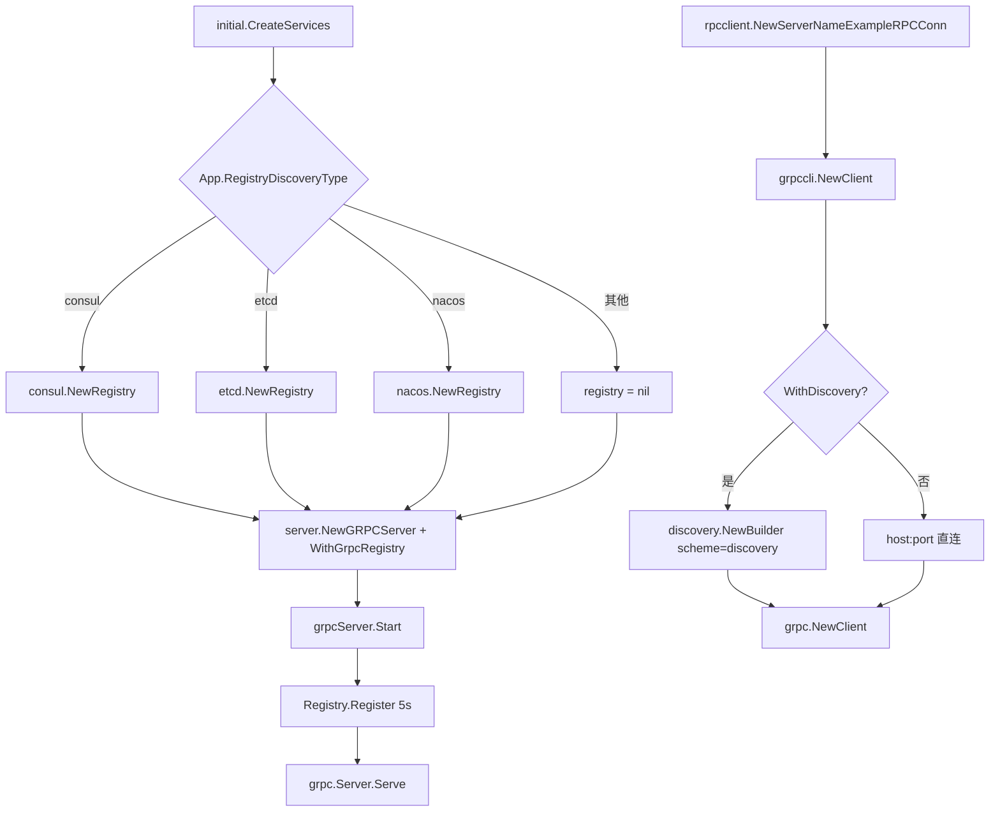
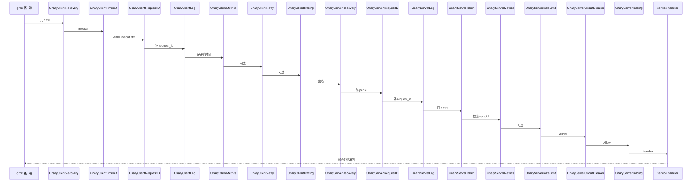
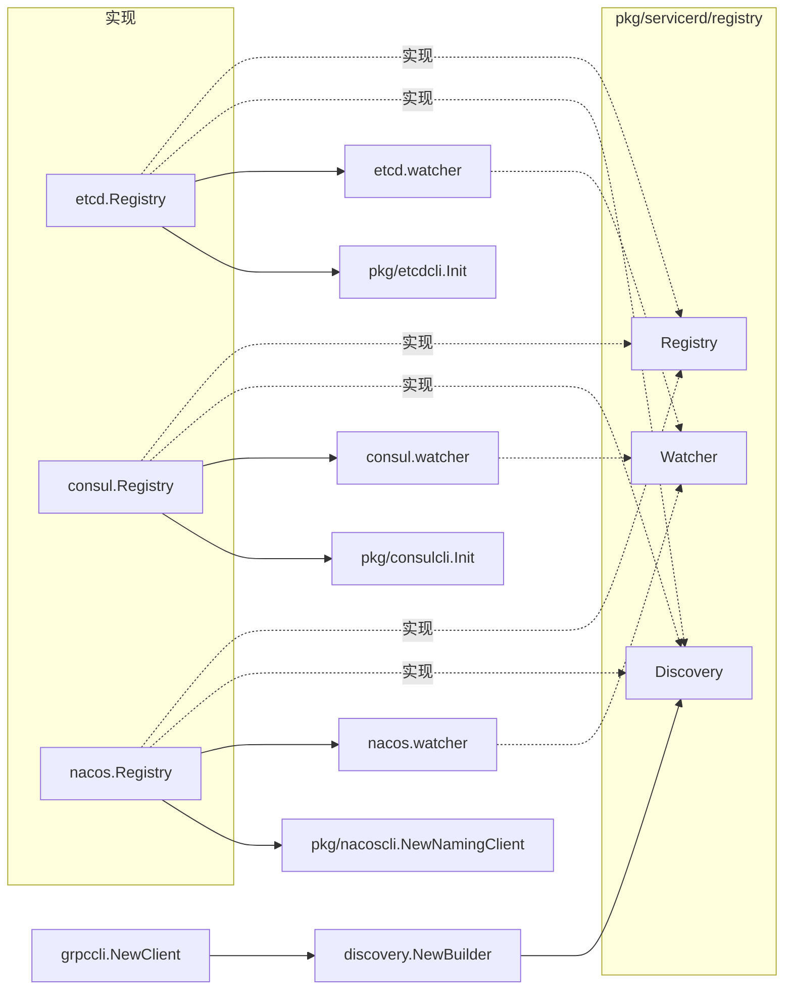

# pkg gRPC 与服务注册发现

> 状态：待复核生成稿
> 生成日期：2026-08-16
> 基准提交：`23807238c62e0f3b3e2d9a341bbef50547d3f5ec`
> 工作区：dirty
> 源码范围：`pkg/grpc/`（client、server、grpccli、interceptor、gtls、keepalive、metrics、resolve、benchmark）、`pkg/servicerd/`（registry 与 discovery，含 etcd/consul/nacos）、`pkg/etcdcli`、`pkg/consulcli`、`pkg/nacoscli`；生成项目装配点 `internal/server/grpc.go`、`internal/rpcclient/`、`cmd/serverNameExample_*/initial/createService.go`
> 生成方式：源码、测试、配置与部署资产静态分析

## 目录

- [快速摘要](#快速摘要)
- [为什么这样设计（Why）](#为什么这样设计why)
- [它是什么（What）](#它是什么what)
- [代码如何实现（How）](#代码如何实现how)
  - [生成项目如何选用这些包](#生成项目如何选用这些包)
  - [拦截器链顺序](#拦截器链顺序)
  - [pkg/grpc/server 与 pkg/grpc/client](#pkggrpcserver-与-pkggrpcclient)
  - [pkg/grpc/grpccli](#pkggrpcgrpccli)
  - [拦截器逐个拆解](#拦截器逐个拆解)
  - [gtls：单向与双向 TLS](#gtls单向与双向-tls)
  - [keepalive](#keepalive)
  - [metrics 与连接计数](#metrics-与连接计数)
  - [两种 resolver builder](#两种-resolver-builder)
  - [benchmark](#benchmark)
  - [servicerd 接口与三种实现](#servicerd-接口与三种实现)
  - [etcdcli / consulcli / nacoscli](#etcdcli--consulcli--nacoscli)
- [调用关系表](#调用关系表)
- [对应测试](#对应测试)
- [阅读源码建议顺序](#阅读源码建议顺序)
- [重新实现检查清单](#重新实现检查清单)

相关文档：[README.md](README.md)、[01-简单框架-系统骨架](01-简单框架-系统骨架.md)、[02-简单例子-全路径走读](02-简单例子-全路径走读.md)、[03-详细逐步说明-主链路拆解](03-详细逐步说明-主链路拆解.md)、[08-UI-Assistant-Patch与性能测试](08-UI-Assistant-Patch与性能测试.md)、[09-生成项目启动与HTTP请求链](09-生成项目启动与HTTP请求链.md)、[10-gRPC服务网关与RPC客户端](10-gRPC服务网关与RPC客户端.md)、[12-pkg应用生命周期与Gin](12-pkg应用生命周期与Gin.md)、[15-pkg可观测性限流熔断与其余包](15-pkg可观测性限流熔断与其余包.md)、[16-配置错误码测试构建与部署](16-配置错误码测试构建与部署.md)。

---

## 快速摘要

### 架构总览（模块与依赖）

本篇覆盖两层代码，职责不能混：

1. **公共库**（本篇主体）：`pkg/grpc/*` 提供通用 Server/Client 构造、拦截器、TLS、keepalive、Prometheus、静态 resolver、ghz 压测；`pkg/servicerd` 定义 `Registry` / `Discovery` / `Watcher`，etcd、consul、nacos 三个实现；`pkg/etcdcli`、`pkg/consulcli`、`pkg/nacoscli` 只负责连注册中心，不负责实例生命周期。
2. **生成项目装配**（本篇必须写清的调用方）：`internal/server/grpc.go` **并不**调用 `pkg/grpc/server.Run`，而是自己 `net.Listen` + `grpc.NewServer`，再按配置把 `pkg/grpc/interceptor`、`pkg/grpc/gtls`、`pkg/grpc/metrics`、`pkg/servicerd/registry` 拼进去。出站 RPC 走 `internal/rpcclient` → `pkg/grpc/grpccli.NewClient`，而不是更薄的 `pkg/grpc/client`。

依赖方向固定：

```text
cmd/serverNameExample_*/initial.CreateServices
  → internal/server.NewGRPCServer / rpcclient.NewServerNameExampleRPCConn
    → pkg/grpc/{interceptor,gtls,metrics,grpccli}
    → pkg/servicerd/{registry,discovery}
      → pkg/{etcdcli,consulcli,nacoscli}
        → etcd / consul / nacos
```

`pkg/grpc/client` 与 `pkg/grpc/server` 是可独立使用的薄封装，仓库模板默认不用它们拼生产进程。`pkg/grpc/resolve` 是静态地址列表 resolver；带注册中心的动态发现走 `pkg/servicerd/discovery`，scheme 固定为 `discovery`。

### 核心调用序列（逐步逻辑）

以 mix 模板（`cmd/serverNameExample_mixExample`）启动 gRPC、再被 `rpcclient` 拨号为例：

1. `CreateServices` 调 `registerService("grpc", host, port)`：按 `cfg.App.RegistryDiscoveryType` 选择 `consul.NewRegistry` / `etcd.NewRegistry` / `nacos.NewRegistry`，实例 endpoint 为 `grpc://{host}:{port}`。
2. `server.NewGRPCServer(addr, WithGrpcRegistry(...))` 监听 TCP，组装 TLS 与一元/流拦截器链，`service.RegisterAllService` 挂业务。
3. `pkg/app.App.Run` 调 `grpcServer.Start`：先 `Registry.Register`（5s 超时），再可选启动 `Grpc.HTTPPort` 上的 `/metrics` `/codes` `/config` / pprof，最后 `server.Serve`（阻塞）。
4. 客户端 `rpcclient.NewServerNameExampleRPCConn` 从 `cfg.GrpcClient` 按名字匹配，拼 `grpccli.Option`（RequestID、Log、Secure、Token、Trace/Breaker/Metrics 开关、Timeout）。
5. 发现未打开时 endpoint 是 `{host}:{port}`；打开时（模板里注释掉的 `discoverService`）变成 `discovery:///{name}`（nacos 为 `discovery:///{name}.grpc`），并 `grpccli.WithDiscovery` + round-robin。
6. `grpccli.NewClient`：`discovery.NewBuilder` → TLS → PerRPC Token → 一元/流拦截器链 → `grpc.NewClient`。
7. 进程退出：`grpcServer.Stop` 先 `Deregister`（2s），再 `GracefulStop`，再关 sidecar HTTP。

### 易错点与边界条件

- **生成项目服务端拦截器顺序**是 Recovery → RequestID → Log → Token → Metrics → RateLimit → CircuitBreaker → Tracing；客户端 `grpccli` 是 Recovery → Timeout → RequestID → Log → Metrics → Retry → Tracing。`WithEnableCircuitBreaker` 只置位，**拦截器本体被注释掉**，客户端熔断实际不生效。
- **JWT 拦截器在模板里是注释状态**；真正 API 是 `WithSignKey` / `WithExtraVerify`，模板注释仍写已不存在的 `WithStandardVerify` / `WithCustomVerify`。
- **Token 长度 ≤100 被 jwtVerify 直接判非法**；`StreamServerRequestID` 是空实现（`// todo`）。
- **熔断成功路径不打点**：invoker/handler 返回 `err==nil` 时不调用 `MarkSuccess`。
- **TLS + 服务发现**：默认 `discoveryInsecure=true`，`parseEndpoint` 只收 `grpc` scheme 且 `isSecure` 与 insecure 标志匹配。模板注册的 endpoint **没有** `?isSecure=true`，打开 TLS 后若不改 `WithDiscoveryInsecure(false)` 并改 endpoint，resolver 会得到空地址且拒绝 `UpdateState`。
- **nacos 注册名带 scheme 后缀**（`{name}.grpc`），etcd/consul 不带。客户端 discovery URL 必须跟着变。
- `consulcli.WithToken` 写入 `options.token`，但 `Init` 组装 `api.Config` 时**未读取**；`gtls.GetClientTLSCredentialsByCA` 在 PEM 追加失败时可能返回 `nil, nil`。
- 本篇未运行测试套件；结论来自静态阅读 `*_test.go`，不宣称测试通过。限流/熔断内部算法见 [15](15-pkg可观测性限流熔断与其余包.md)，生成项目 service/网关见 [10](10-gRPC服务网关与RPC客户端.md)。

---

## 为什么这样设计（Why）

Sponge 要让同一份业务 protobuf 长出纯 gRPC、HTTP+gRPC、HTTP 网关等多种进程，同时让用户用 YAML 开关打开日志、指标、限流、熔断、Trace、TLS、Token，而不是改拦截器代码。所以公共库把「可插拔能力」做成独立拦截器/Option，生成项目只负责按配置拼链。

必须保持的行为契约：

- 服务端拦截器链最外层必须是 Recovery，把 panic 转成 `codes.Internal`，避免进程退出。
- 注册中心可替换：etcd / consul / nacos 都实现同一套 `Registry` + `Discovery` + `Watcher`。gRPC 客户端只认识 `discovery` scheme 的 `resolver.Builder`。
- 实例 endpoint 用 URL：`{scheme}://{host}:{port}`，可选 `?isSecure=true`。resolver 按 scheme=`grpc` 和 isSecure 过滤。
- 单向 TLS 只校验证书；双向 TLS 服务端 `RequireAndVerifyClientCert`。

可以替换的实现：换注册中心客户端、换 Prometheus 库、把 `grpccli` 换成手写 `grpc.NewClient`、不用 round-robin。

---

## 它是什么（What）

| 包 | 角色 | 生成项目是否默认使用 |
|---|---|---|
| `pkg/grpc/server` | 薄 Server：Listen、注入拦截器、可选注册回调、goroutine Serve | 否，模板自写 `internal/server/grpc.go` |
| `pkg/grpc/client` | 薄 Client：resolver / 负载均衡 / TLS / 拦截器 | 否 |
| `pkg/grpc/grpccli` | 电池齐全 Client：发现、TLS 单向/双向、Token、拦截器链 | 是，`rpcclient` |
| `pkg/grpc/interceptor` | 一元+流拦截器全集 | 是 |
| `pkg/grpc/gtls` | 单向/双向 TransportCredentials | 是 |
| `pkg/grpc/keepalive` | 客户端/服务端 keepalive 参数 | 模板未接；库可单独用 |
| `pkg/grpc/metrics` | Prometheus 拦截器、HTTP `/metrics`、连接数 Gauge | 是 |
| `pkg/grpc/resolve` | 静态多地址 `resolver.Builder` | 否（手工多地址时可用） |
| `pkg/grpc/benchmark` | 读 proto + ghz 压测 + HTML 报告 | 是，`*_client_test.go` |
| `pkg/servicerd/registry` | `Registry`/`Discovery`/`Watcher`/`ServiceInstance` | 接口被 mix 使用 |
| `pkg/servicerd/registry/{etcd,consul,nacos}` | 三种实现 | `RegistryDiscoveryType` 三选一 |
| `pkg/servicerd/discovery` | scheme=`discovery` 的 gRPC resolver | `grpccli.WithDiscovery` |
| `pkg/etcdcli` / `pkg/consulcli` / `pkg/nacoscli` | 连接注册中心 | registry 构造时调用 |

公开类型与函数按子包列在 How 各节，不在此处重复。

---

## 代码如何实现（How）

### 生成项目如何选用这些包

#### 服务端：`internal/server/grpc.go`

`grpcServer` 实现 `app.IServer`（见 [12](12-pkg应用生命周期与Gin.md)）。字段：`*grpc.Server`、`net.Listener`、sidecar `http.Server`、`registry.Registry` + `*ServiceInstance`。

`NewGRPCServer(addr, opts...)`：

1. `WithGrpcRegistry` 注入注册对象（可空）。
2. `addHTTPRouter` 挂 `/codes`（`errcode.ListGRPCErrCodes`）和 `/config`。
3. `App.EnableHTTPProfile` 时 `prof.Register`。
4. `net.Listen("tcp", addr)`，失败 `panic`。
5. `grpc.NewServer(s.setOptions()...)`，`service.RegisterAllService`。

`setOptions`：先 `secureServerOption`（见 TLS 节），再一元链、流链。

`Start`：

1. 若有 registry：`Register(ctx, instance)`，超时 5s；失败直接返回，不 Serve。
2. 若开了 metrics：`metrics.Register(mux, server)`（路径默认 `/metrics`）。
3. 若 mux 非空：在 `cfg.Grpc.HTTPPort` 起 sidecar HTTP（IdleTimeout 60s）；Listen 失败且非 `ErrServerClosed` 则 `panic`。
4. **无论是否开 metrics**，都用 `metrics.NewCustomListener(listen, WithConnectionsLogger, WithConnectionsGauge)` 包一层，再阻塞 `Serve`。

`Stop`：goroutine 里 `Deregister`（2s 超时）→ `GracefulStop` → sidecar `Shutdown`（3s）。`Deregister` 的 `cancel` 在 goroutine 内、调用返回之后才执行，因此最多等满 2s。

纯 gRPC 模板（`grpcExample` / `grpcPbExample` / `grpcHttpPbExample`）默认 `NewGRPCServer(addr)`，**不**传 registry；同文件里整段 `registerService` 被注释，内容与 mix 活代码相同。mix 才真正按配置注册。

#### mix 如何选 etcd / consul / nacos

`cmd/serverNameExample_mixExample/initial/createService.go:registerService`：

- 实例 ID：`{App.Name}_{scheme}_{host}_{port}`，例如 `serverNameExample_grpc_127.0.0.1_8282`。
- endpoint：`{scheme}://{host}:{port}`，**无** `isSecure` 查询串。
- `cfg.App.RegistryDiscoveryType`：
  - `"consul"` → `consul.NewRegistry(cfg.Consul.Addr, id, name, endpoints)`
  - `"etcd"` → `etcd.NewRegistry(cfg.Etcd.Addrs, id, name, endpoints)`
  - `"nacos"` → `nacos.NewRegistry(cfg.NacosRd.IPAddr, Port, NamespaceID, id, name, endpoints)`
- 其他值：返回 `nil, nil`，服务照常启动但不注册。
- 构造失败 `panic`。

HTTP 与 gRPC 会各注册一次（scheme 分别为 `http` / `grpc`），ID 不同，Name 相同。

#### 客户端：`internal/rpcclient/serverNameExample.go`

`NewServerNameExampleRPCConn`：

1. 在 `cfg.GrpcClient` 里按名字（模板为 `serverNameExample`，大小写不敏感）找一项；找不到 `panic`。
2. 固定加上 `WithEnableRequestID`、`WithEnableLog(logger.Get())`。
3. 默认 endpoint：`{Host}:{Port}`。`discoverService` 整段注释：consul/etcd 用 `discovery:///{Name}`，nacos 用 `discovery:///{Name}.grpc`，并 `WithDiscovery` + `WithEnableLoadBalance`。
4. `WithSecure(Type, ServerName, CaFile, CertFile, KeyFile)`：Type 为 `one-way` / `two-way` / 其他（明文）。
5. `WithToken(Enable, AppID, AppKey)`。
6. `App.EnableTrace` → `WithEnableTrace`；`EnableCircuitBreaker` → `WithEnableCircuitBreaker`（见下，客户端不生效）；`EnableMetrics` → `WithEnableMetrics`。
7. `Timeout>0` → `WithTimeout(Timeout * time.Second)`。
8. `grpccli.NewClient` 失败 `panic`。

`GetServerNameExampleRPCConn` 用 `sync.Once` 懒拨号。`CloseServerNameExampleRPCConn` 在 conn 为 nil 时返回 nil。

`internal/service/service_test.go:getRPCClientConnForTest` 走同一套 grpccli 选项，发现代码同样注释掉。



---

### 拦截器链顺序

gRPC `ChainUnaryInterceptor(a, b, c)` 的语义是 **a 最外层**：请求先入 a 再入 b 再入 c 再到 handler；响应相反。流拦截器同理。

#### 生成项目服务端（`grpcServer.unaryServerOptions`）

| 顺序（外→内） | 符号 | 开关 |
|---|---|---|
| 1 | `interceptor.UnaryServerRecovery` | 始终 |
| 2 | `interceptor.UnaryServerRequestID` | 始终 |
| 3 | `interceptor.UnaryServerLog(logger.Get(), WithReplaceGRPCLogger())` | 始终；注释说可换成 `UnaryServerSimpleLog` |
| 4 | `interceptor.UnaryServerToken(checkToken)` | `Grpc.EnableToken` |
| 5 | `interceptor.UnaryServerJwtAuth(...)` | 模板注释，默认不开 |
| 6 | `interceptor.UnaryServerMetrics()` | `App.EnableMetrics` |
| 7 | `interceptor.UnaryServerRateLimit()` | `App.EnableLimit` |
| 8 | `interceptor.UnaryServerCircuitBreaker(WithValidCode(StatusInternalServerError, StatusServiceUnavailable))` | `App.EnableCircuitBreaker` |
| 9 | `interceptor.UnaryServerTracing` | `App.EnableTrace` |

Token 校验函数比较 metadata 的 `app_id`/`app_key` 与包级默认值 `defaultTokenAppID="grpc"`、`defaultTokenAppKey="mko09ijn"`（注释写应从缓存或库读取）。不匹配返回 `codes.Unauthenticated`。

流链（`streamServerOptions`）同样 Recovery → Log → Token/Metrics/Limit/Breaker/Tracing，但 **RequestID 被注释**，且熔断 `WithValidCode` 分两次传入（效果等价追加）。JWT 同样注释。

#### grpccli 客户端（`unaryClientOptions` / `streamClientOptions`）

| 顺序（外→内） | 一元 | 流 | 开关 |
|---|---|---|---|
| 1 | `UnaryClientRecovery` | `StreamClientRecovery` | 始终 |
| 2 | `UnaryClientTimeout` | （无 Timeout） | `requestTimeout > 0` |
| 3 | `UnaryClientRequestID` | `StreamClientRequestID` | `enableRequestID` |
| 4 | `UnaryClientLog(logger.Get())` | `StreamClientLog(logger.Get())` | `enableLog` |
| 5 | `UnaryClientMetrics` | `StreamClientMetrics` | `enableMetrics` |
| 6 | `UnaryClientRetry` | `StreamClientRetry` | `enableRetry` |
| 7 | `UnaryClientTracing` | `StreamClientTracing` | `enableTrace` |
| 8 | 自定义 `o.unaryInterceptors` | 自定义 `o.streamInterceptors` | Option |

注意三点：

1. Token **不是**拦截器，而是 `grpc.WithPerRPCCredentials`（`ClientTokenOption`），在拦截器之前加入 DialOption。
2. 熔断两段代码被注释，`enableCircuitBreaker` 无运行效果。
3. `WithEnableLog` 把 logger 存进 `o.log`，组装时却调用 `logger.Get()`，传入的 zap logger 被忽略。



---

### pkg/grpc/server 与 pkg/grpc/client

#### `pkg/grpc/server`

公开类型：`RegisterFn func(*grpc.Server)`、`ServiceRegisterFn func() error`、`Option`。

| 函数 | 行为 |
|---|---|
| `WithSecure(credentials.TransportCredentials)` | 写入 `grpc.Creds` |
| `WithUnaryInterceptor(...)` | `grpc.ChainUnaryInterceptor` |
| `WithStreamInterceptor(...)` | `grpc.ChainStreamInterceptor` |
| `WithServiceRegister(fn)` | Serve 前调用；失败则 `Run` 返回 err，不 Serve |
| `WithStatConnections(metrics.ConnectionOption...)` | Listen 后包 `metrics.NewCustomListener` |

`Run(port, registerFn, options...) (*grpc.Server, error)`：

1. `net.Listen("tcp", :port)`，失败返回。
2. 可选 CustomListener。
3. `grpc.NewServer(customInterceptorOptions...)` → `registerFn(srv)`。
4. 若有 `serviceRegisterFn`，先注册再 Serve；失败返回且已创建的 Server 被丢弃（调用方拿不到 Stop）。
5. **goroutine** 里 `srv.Serve`；Serve 返回非 nil 则 **`panic`**。
6. 立即返回 `*grpc.Server`（非阻塞）。

与生成项目差异：生成项目阻塞 Serve、注册发生在 `Start` 而不是 `Run` 内部、sidecar HTTP 与 prof 是模板自己的。

错误语义：Listen 失败返回 `net` 错误；注册失败原样返回；Serve 失败 panic，进程退出。

#### `pkg/grpc/client`

公开 `Option` 与：

| 函数 | 行为 |
|---|---|
| `WithServiceDiscover(d registry.Discovery, isInsecure bool)` | 无自定义 builder 时 `discovery.NewBuilder(d, WithInsecure(isInsecure))` |
| `WithServiceDiscoverBuilder(...resolver.Builder)` | **优先于** Discovery，走 `grpc.WithResolvers` |
| `WithLoadBalance()` | `loadBalancingConfig: round_robin` |
| `WithSecure(credentials.TransportCredentials)` | 非 nil 用该凭证；nil 则 `insecure` |
| `WithUnaryInterceptor` / `WithStreamInterceptor` | Chain |
| `WithDialOption` | 追加原始 DialOption |
| `NewClient(endpoint, opts...)` | `grpc.NewClient` |
| `Dial(ctx, endpoint, opts...)` | 忽略 ctx，转 `NewClient` |

错误语义：本包不包装错误，直接返回 `grpc.NewClient` 的 error。无发现、无 TLS 时明文拨号。

---

### pkg/grpc/grpccli

这是生成项目真正使用的客户端。`NewClient` 组装顺序：Resolvers（若 `o.discovery != nil`）→ round-robin（若开）→ `secureOption` → Token PerRPCCredentials（若开）→ 一元链 → 流链 → 自定义 `dialOptions`。

`Dial` 标注 **Deprecated**，忽略 context，转 `NewClient`。

#### Option 与默认值

`defaultOptions`：`secureType=""`、`serverName="localhost"`、证书空、`enableLog=false`、`discoveryInsecure=true`、discovery=nil。

| Option | 写入字段 | 运行效果 |
|---|---|---|
| `WithTimeout(d)` | `requestTimeout` | 仅一元 Timeout 拦截器；`d < 1ms` 时拦截器内部改 10s |
| `WithEnableRequestID` | bool | 一元+流 RequestID |
| `WithEnableLog(log)` | `enableLog` + `o.log` | 开日志；`log==nil` 时 `zap.NewProduction()` 写入 `o.log`，但组装仍用 `logger.Get()` |
| `WithEnableTrace` | bool | otel 一元+流 |
| `WithEnableMetrics` | bool | Prometheus 一元+流 |
| `WithEnableLoadBalance` | bool | round-robin service config |
| `WithEnableRetry` | bool | 默认最多 2 次、100ms、仅 `codes.Internal` |
| `WithEnableCircuitBreaker` | bool | **无拦截器** |
| `WithDiscoveryInsecure(b)` | bool | 传给 `discovery.WithInsecure`；默认 true |
| `WithDiscovery(d)` | `registry.Discovery` | `discovery.NewBuilder`，scheme `discovery` |
| `WithSecure(t, serverName, ca, cert, key)` | 见下 | `one-way`/`two-way` 分派；其他值原样写入 `secureType`（走明文） |
| `WithOneWaySecure(serverName, certFile)` | type=`one-way` | serverName 空则 `localhost` |
| `WithTwoWaySecure(serverName, ca, cert, key)` | type=`two-way` | serverName 空则 `localhost` |
| `WithToken(enable, appID, appKey)` | 三字段 | `isSecure()` 为 true 时 Token 要求 TLS |
| `WithDialOptions` / `WithUnaryInterceptors` / `WithStreamInterceptors` | append | 自定义 |

`isSecure()`：`secureType` 为 `one-way` 或 `two-way` 才为 true。Token 的 `RequireTransportSecurity` 依赖它：明文连接上若 `enableToken` 且 type 为空，凭证仍会发出 `app_id`/`app_key`（不要求 TLS）。

#### `secureOption` 错误语义

| `secureType` | 校验 | 调用 | 失败 |
|---|---|---|---|
| `one-way` | `certFile` 空 → `errors.New("cert file is empty")` | `gtls.GetClientTLSCredentials(serverName, certFile)` | 原样返回 |
| `two-way` | ca/cert/key 任一空，分别 `"ca/cert/key file is empty"` | `gtls.GetClientTLSCredentialsByCA` | 原样返回 |
| 其他（含 `""`） | 无 | `insecure.NewCredentials()` | 无 error |

测试 `Test_secureOption` 覆盖空 cert、文件不存在、two-way 缺字段、空 type。

---

### 拦截器逐个拆解

包路径 `pkg/grpc/interceptor`。每个拦截器都有一元/流成对实现（JWT/Token/限流仅服务端有服务端实现；Timeout/Retry 仅客户端）。

#### logging

公开：`UnaryClientLog`、`StreamClientLog`、`UnaryServerLog`、`UnaryServerSimpleLog`、`StreamServerLog`、`StreamServerSimpleLog`；`LogOption`：`WithMaxLen`、`WithReplaceGRPCLogger`、`WithPrintErrorByCodes`、`WithMarshalFn`、`WithLogIgnoreMethods`。

行为：

- `logger==nil` 时 `zap.NewProduction()`。`WithReplaceGRPCLogger` 调 `pkg/logger.ReplaceGRPCLoggerV2`。
- 忽略方法表默认含 `/grpc.health.v1.Health/Check`。`WithLogIgnoreMethods` 写入**包级** `ignoreLogMethods`，进程内共享。
- 客户端：调用前后记 `code`、`err`、`type`、`method`、`time_us`、可选 `request_id`。命中 `printErrorBySpecifiedCodes` 打 Error（栈阈值提到 Panic 以免多余栈），否则 Info。
- 服务端完整日志：先 Info `<<<<`（含 request any），handler 后再 `>>>>`。响应用 `marshalFn`（默认 `json.Marshal`，忽略 marshal 错误），超过 `maxLength`（默认 300）截断并追加 ` ...... `。
- SimpleLog 只打响应侧，不打请求体。
- 默认 Error 码：`codes.Internal`、`Unavailable`，以及 `errcode.StatusInternalServerError` / `StatusServiceUnavailable` 的自定义码。`WithPrintErrorByCodes` 写入**包级** map。

错误：拦截器不改变 err，只记录后原样返回。

#### recovery

- 客户端：`defer recover`，panic 变成 `status.Errorf(codes.Internal, "triggered panic: %v", r)`。只包住 `invoker`/`streamer` 调用本身，流建立后的 Recv/Send panic 不在此拦截。
- 服务端：`go-grpc-middleware/v2` 的 recovery，handler 相同，把 panic 转 `codes.Internal`。

#### timeout

仅客户端。`d < time.Millisecond` 时改用包级 `timeoutVal=10s`。`context.WithTimeout` 的 cancel **被丢弃**（`//nolint`），超时 ctx 依赖父 ctx 结束才能释放。grpccli **只给一元**加 Timeout，流不加。

错误：超时后 invoker 返回 `codes.DeadlineExceeded`（由 gRPC 运行时产生）。

#### retry

仅客户端。默认 `times=2`、`interval=100ms`、`errCodes=[Internal]`。底层 `grpc-ecosystem` retry 拦截器。

| Option | 约束 |
|---|---|
| `WithRetryTimes(n)` | `n>10` 截成 10 |
| `WithRetryInterval(t)` | `<1ms` 升为 1ms；`>10s` 降为 10s |
| `WithRetryErrCodes` | 对 `Internal`/`DeadlineExceeded`/`Unavailable` **空操作**；其他码 **追加到包级 `defaultErrCodes`**，再赋给本次 options。之后新建的 Retry 也会带上这些码 |

grpccli 的 `WithEnableRetry` 不传 Option，因此默认只对 Internal 重试 2 次。

#### token

客户端 `authToken` 实现 `credentials.PerRPCCredentials`：`GetRequestMetadata` 返回 `app_id`、`app_key`；`RequireTransportSecurity` 返回构造时的 `isSecure`。`ClientTokenOption` → `grpc.WithPerRPCCredentials`。

服务端 `CheckToken func(appID, appKey string) error`。`UnaryServerToken` / `StreamServerToken` 从 incoming metadata 取键 `app_id`/`app_key`，`f` 返回非 nil 则不调 handler，**原样返回该 error**（模板用 `codes.Unauthenticated`）。缺 metadata 时 Get 得到空串，仍交给 `f`。

#### jwtAuth

客户端：`SetJwtTokenToCtx(ctx, token)` 写 outgoing `authorization: Bearer {token}`（token 不含前缀）；`SetAuthToCtx` 写完整 authorization 串；`GetAuthorization` 拼接 `Bearer ` + token。

服务端选项：`WithAuthScheme`（默认 `Bearer`）、`WithAuthClaimsName`（默认 `tokenInfo`）、`WithAuthIgnoreMethods`、`WithSignKey`、`WithExtraVerify`。

`UnaryServerJwtAuth` / `StreamServerJwtAuth` 会把 scheme、claims 键名、忽略方法表写进 **包级变量**，多实例会互相覆盖。忽略方法直接跳过校验。流侧用 `WrapServerStream` 换 ctx。

`jwtVerify`：

1. `AuthFromMD(ctx, authScheme)` 失败 → `codes.Unauthenticated` `"AuthFromMD error: ..."`。
2. token 长度 ≤100 → `codes.Unauthenticated` `"token is illegal"`。
3. `jwt.ValidateToken(..., WithValidateTokenSignKey(opt.signKey))` 失败 → Unauthenticated。
4. `extraVerifyFn` 失败 → `"extra verification fails: ..."`。
5. 成功：`context.WithValue(ctx, authCtxClaimsName, claims)`。`GetJwtClaims` 按该键取出 `*jwt.Claims`。

注意：`AuthFromMD` 用的是包级 `authScheme`，不是 `opt.authScheme` 局部副本（构造时已写回包级）。

#### metrics（interceptor 薄封装）

`Unary/Stream Client/Server Metrics` 直接转调 `pkg/grpc/metrics` 同名函数。服务端可传 `metrics.Option` 注册自定义 Counter/Summary/Gauge/Histogram。

#### tracing

一元/流客户端与服务端调用已弃用的 `otelgrpc.Unary/Stream*Interceptor()`（源码 `//nolint`）。另提供 `ClientOptionTracing` = `grpc.WithStatsHandler(otelgrpc.NewClientHandler())`、`ServerOptionTracing` = `grpc.StatsHandler(NewServerHandler())`，生成项目 **未使用** StatsHandler 版本，仍用旧拦截器 API。

错误：拦截器不改写业务 err。

#### ratelimit

仅服务端。默认 window=10s、bucket=100、cpuThreshold=800、cpuQuota=0。`rl.NewLimiter` 来自 `pkg/shield/ratelimit`（算法见 [15](15-pkg可观测性限流熔断与其余包.md)）。

`Allow` 失败：返回 `errcode.StatusLimitExceed.ToRPCErr(err.Error())`（RPC 业务码 300020），不是 gRPC `ResourceExhausted`。成功则 `handler` 后 `done(DoneInfo{Err})`。`ErrLimitExceed` 是 `rl.ErrLimitExceed` 的别名。每个拦截器工厂调用创建 **自己的** limiter，一元和流各一份。

#### breaker

`group.Group` 按 method / FullMethod 懒创建 `circuitbreaker.CircuitBreaker`。默认 validCodes：`Internal`、`Unavailable`。

| Option | 作用 |
|---|---|
| `WithGroup` | Deprecated，直接换 Group |
| `WithBreakerOption(circuitbreaker.Option...)` | 用新 Group 工厂 `NewBreaker(opts...)` |
| `WithValidCode` | 追加「算失败」的 gRPC code |
| `WithUnaryServerDegradeHandler` | 仅一元服务端：熔断拒绝时走降级，不再返回 300014 |

拒绝时：`MarkFailed()`（提高后续拒绝比）+ `errcode.StatusServiceUnavailable.ToRPCErr(err.Error())`（码 300014），除非降级 handler。

调用返回后：仅当 `err != nil` 才 FromError；命中 validCodes 则 `MarkFailed`，否则 `MarkSuccess`。**`err==nil` 不 MarkSuccess**。生成项目还把 `ecode.StatusInternalServerError` / `StatusServiceUnavailable` 的自定义码加入 validCodes。

`ErrNotAllowed` 是 `circuitbreaker.ErrNotAllowed` 别名。

#### requestid

| 符号 | 行为 |
|---|---|
| `ContextRequestIDKey` | 默认 `"request_id"`；`SetContextRequestIDKey` 要求长度≥4，且 `sync.Once` 只能设一次 |
| `RequestIDKey` | `CtxKeyString` 包装，给 `context.WithValue` 用 |
| `Unary/Stream ClientRequestID` | outgoing 无 id 则 `krand.String(R_All, 10)` 写入 metadata |
| `UnaryServerRequestID` | incoming 无 id 则生成并 `Add` 进 incoming metadata |
| `StreamServerRequestID` | **空操作**，直接 `handler(srv, stream)` |
| `WrapServerCtx` | 把 incoming request_id 放进 `context.Value`，并可附加 `KV` |
| `Client/ServerCtxRequestID` 与 `*Field` | 从 outgoing/incoming metadata 取 id，供 zap 字段使用 |

业务 service 模板普遍 `ctx = interceptor.WrapServerCtx(ctx)`，再 `interceptor.ServerCtxRequestIDField(ctx)` 打日志。后者仍读 metadata，不读 `context.Value`；Value 给业务自己取。

---

### gtls：单向与双向 TLS

证书样例在 `pkg/grpc/gtls/certfile/`（`one-way/server.crt|key`，`two-way/ca.pem` + client/server pem/key）。`certfile.Path(rel)`：绝对路径原样返回，相对路径拼到本文件目录（`runtime.Caller(0)`）。

| 函数 | 模式 | 实现 | 错误 |
|---|---|---|---|
| `GetServerTLSCredentials(cert, key)` | 单向（只认证服务端） | `credentials.NewServerTLSFromFile` | 文件/解析失败 |
| `GetServerTLSCredentialsByCA(ca, cert, key)` | 双向 | `tls.Config{ClientAuth: RequireAndVerifyClientCert, ClientCAs}` | LoadX509 失败；读 CA 失败；`AppendCertsFromPEM` 失败返回 **`errors.New("certPool.AppendCertsFromPEM err")`** |
| `GetClientTLSCredentials(serverName, cert)` | 单向 | `NewClientTLSFromFile(cert, serverName)` | 文件失败 |
| `GetClientTLSCredentialsByCA(serverName, ca, cert, key)` | 双向 | 客户端证书 + `RootCAs` + `ServerName` | Load/读文件失败；**`AppendCertsFromPEM` 失败时 `err` 仍是 ReadFile 的 nil，函数返回 `nil, nil`** |

生成项目服务端 `secureServerOption`：

- `Grpc.ServerSecure.Type=="one-way"` → 服务端单向；失败 **panic**。
- `"two-way"` → 双向；失败 panic。
- 其他 → 返回 nil（明文），打日志 `insecure`。

客户端见 `grpccli.secureOption`。两端 Type 必须对齐：服务端 two-way 时客户端必须 two-way 并提供 CA+client 证书。

---

### keepalive

`ClientKeepAlive()` → `grpc.WithKeepaliveParams`：Time=20s、Timeout=1s、`PermitWithoutStream=true`。

`ServerKeepAlive()` 返回两段 ServerOption：EnforcementPolicy（MinTime=5s，允许无流 ping）+ ServerParameters（MaxConnectionIdle/Age/AgeGrace 均为 `math.MaxInt64` 即不主动踢，Time=20s，Timeout=1s）。

生成项目 **未**把这两项加入 `setOptions`。注释与数值不一致（注释写 10s/15s/30s，代码是 20s/infinity）。

---

### metrics 与连接计数

#### 服务端 `pkg/grpc/metrics/serverMetrics.go`

包级独立 `prometheus.Registry`（`srvReg`），`grpc_prometheus.NewServerMetrics()`，另注册 Go collector 与 `grpc_server_active_connections` Gauge。`srvOnce` 保证 `EnableHandlingTimeHistogram` + MustRegister 只做一次。

| 函数 | 行为 |
|---|---|
| `WithCounter/Summary/Gauge/HistogramMetrics` | 追加到包级切片，须在首次 `Unary/StreamServerMetrics` 之前调用才注册得上 |
| `SetServerPattern` | 默认 `/metrics` |
| `Register(mux, grpcServer)` | mux 挂 HandlerFor(srvReg)；`InitializeMetrics(grpcServer)` |
| `ServerHTTPService(addr, grpcServer)` | 单独起 HTTP，失败 panic；返回 `*http.Server` |
| `Unary/StreamServerMetrics` | `srvRegisterMetrics` + grpc-prometheus 拦截器 |

生成项目用 `Register(mux, server)`，与 pprof/codes 共用 `Grpc.HTTPPort`，不用 `ServerHTTPService`。

#### 客户端 `clientMetrics.go`

另一套 Registry。依赖 `go-grpc-middleware/providers/prometheus` 的 `NewClientMetrics`（与服务端 `go-grpc-prometheus` 不是同一库）。默认 path `/rpc_client/metrics`。`ClientHTTPService` 独立端口；生成 rpcclient **未**调用它，只挂拦截器，抓取需自行 `ClientRegister`。

#### 连接计数 `connection.go`

`CustomListener.Accept`：成功则 `activeConnections++`，可选 zap Info、Gauge.Set。`CustomConn.Close` 成功才 `--`；Close 里 `defer recover` 防止二次 Close panic。`GetActiveConnections` 加锁读。`WithConnectionsGauge` 把 Gauge 指到包级 `grpcConnectionGauge`。

生成项目 Start **总是**包这层 listener，因此连接日志与 Gauge 始终更新；但 Gauge 只有 metrics 拦截器触发 `srvRegisterMetrics` 后才出现在 `/metrics` 里。

---

### 两种 resolver builder

#### 动态发现：`pkg/servicerd/discovery`

`NewBuilder(d registry.Discovery, opts...)` 返回 `resolver.Builder`，`Scheme()` 恒为 `"discovery"`。

Option：`WithTimeout`（默认 10s，仅限制 **Watch 创建**）、`WithInsecure`（默认 false；grpccli 传入的默认是 true）、`DisableDebugLog`。

`Build(target, cc, _)`：

1. 后台 `discoverer.Watch(ctx, strings.TrimPrefix(target.URL.Path, "/"))`，即 `discovery:///foo` → 服务名 `foo`。
2. 超过 timeout → `errors.New("discovery create watcher overtime")`，cancel 并返回。
3. 构造 `discoveryResolver`，`go r.watch()`。

`watch`：循环 `w.Next()`；`context.Canceled` 退出；其他错误打印并 sleep 1s。`update`：

- `parseEndpoint(endpoints, "grpc", !insecure)`：解析 URL，scheme 必须是 `grpc`，`IsSecure(u)` 必须等于 `isSecure`。`IsSecure` 读 query `isSecure`，解析失败当 false。
- 空 host 或重复 endpoint 跳过。metadata 转 `attributes`，并挂 `rawServiceInstance`。
- **零地址则 return，不 UpdateState**（保留上一轮）。
- `cc.UpdateState` 失败打印。未 DisableDebugLog 时把实例 JSON 打到 stdout。

`Close`：cancel + `w.Stop()`。`ResolveNow` 空操作。

与 `grpccli`：`grpc.WithResolvers(builder)` 只对本次 Dial 有效，不 `resolver.Register` 全局。endpoint 必须是 `discovery:///...`，否则 gRPC 不会调这个 builder。

#### 静态多地址：`pkg/grpc/resolve`

`Register(scheme, serviceName, address []string) string`：全局 `resolver.Register`，返回 `{scheme}:///{serviceName}`。`Build` 把 `addrs` 一次 `UpdateState`。`ResolveNow`/`Close` 空。无健康检查、无发现。用于手工指定多 IP 再配 round-robin。生成项目未调用。

---

### benchmark

`benchmark.New(host, protoFile, methodName, req proto.Message, dependentProtoFilePath, total, options...) (Runner, error)`：

1. 读 proto 文件失败原样返回。
2. 正则 `\npackage (.*);`、`\nservice (\w+)`、`rpc (\w+)` 抽名字；缺 package/service 或方法名大小写不匹配（`EqualFold`）则 fmt.Errorf。
3. `Run`：`proto.Marshal(req)` → ghz `runner.Run("{pkg}.{svc}/{method}", host, WithTotalRequests, WithProtoFile, WithBinaryData, WithInsecure(true), 用户 options...)`。`WithRunDuration` 会使 total 失效（注释说明）。
4. 报告写到 `{TempDir}/sponge_grpc_benchmark/report_{method}.html`，目录 0777。打印文件路径。

生成项目 `internal/service/userExample_client_test.go` 对 GetByID/List 调 `benchmark.New`；protoc-gen-go-rpc-tmpl 的测试模板同样引用。CLI 压测入口见 [08](08-UI-Assistant-Patch与性能测试.md)。

---

### servicerd 接口与三种实现

#### 接口 `pkg/servicerd/registry`

```text
Registry   Register(ctx, *ServiceInstance) error
           Deregister(ctx, *ServiceInstance) error
Discovery  GetService(ctx, name) ([]*ServiceInstance, error)
           Watch(ctx, name) (Watcher, error)
Watcher    Next() ([]*ServiceInstance, error)  // 首次非空或变更时返回；否则阻塞到 ctx 结束
           Stop() error
```

`ServiceInstance`：`ID`、`Name`、`Version`、`Metadata`、`Endpoints`。`NewServiceInstance(id, name, endpoints, WithVersion, WithMetadata)`。三种 `NewRegistry` 都用无 Version/Metadata 的实例；业务若要 version 需 `New` + 自己填，或改模板。

三个 `*Registry` 都通过 `var _ Registry = &Registry{}` / `_ Discovery = &Registry{}` 同时实现注册与发现。

#### etcd（`pkg/servicerd/registry/etcd`）

依赖 `etcdcli.Init`。默认 namespace=`/microservices`、ttl=15s、maxRetry=5、ctx=`Background`。

键：`{namespace}/{Name}/{ID}`，值为 JSON。

| 方法 | 行为 | 错误 |
|---|---|---|
| `NewRegistry(endpoints, id, name, instanceEndpoints, etcdcli.Option...)` | Init + `New(cli)` + 新 Instance | Init 失败 |
| `NewRegistryWithOptions(..., opts ...interface{})` | 类型分拣 `etcdcli.Option` 与 `etcd.Option`；未知类型 `fmt.Errorf("unknown option type: %T")` | Init 失败原样返回 |
| `New(client, Option...)` | 不 Grant，Register 时才 NewLease | — |
| `Register` | marshal → 关旧 lease → Grant(ttl秒) → Put WithLease → `go heartBeat` | marshal/Grant/Put |
| `Deregister` | `Delete(key)`，defer `lease.Close()`，**无 Revoke** | Delete 错误 |
| `GetService` | prefix Get `{ns}/{name}`，unmarshal，过滤 `si.Name==name` | Get/unmarshal |
| `Watch` | `newWatcher`：prefix Watch Rev=0 + `RequestProgress` | RequestProgress 失败 |

`heartBeat`：KeepAlive 失败则 `curLeaseID=0`，最多 `maxRetry` 次重新 `registerWithKV`（单次 3s 超时），退避 `1<<retryCnt` 秒随机。KeepAlive channel 关闭且 ctx 未取消则再注册；ctx Done 退出。`rand.Seed` 每次心跳启动调用一次。

`watcher.Next`：第一次立刻 `getInstance`；之后等 watchChan 或 ctx.Done（返回 `ctx.Err()`）。`Stop`：cancel + `watcher.Close`。

#### consul（`pkg/servicerd/registry/consul`）

依赖 `consulcli.Init`。`NewRegistry` 固定 `WithHealthCheck(true)`。`NewRegistryWithOptions` 同样类型分拣。

`Client.Register`：每个 endpoint `url.Parse`，取 Hostname/Port；非法 port 返回 `invalid port in endpoint`。`TaggedAddresses` 以 URL scheme 为键（`grpc`/`http`）。Tags 含 `version={Version}`。健康检查：TCP `{addr}:{port}`，Interval 20s，Timeout 5s，Status passing，`DeregisterCriticalServiceAfter` 60s。然后 goroutine 每 20s `UpdateTTL("service:"+ID, "pass", "pass")`——注册的是 **TCP check 不是 TTL check**，UpdateTTL 错误被丢弃。

`Client.Service`：blocking query WaitIndex + WaitTime 55s，`Health().Service(..., passingOnly)`。跳过 lan/wan ipv4/ipv6 tagged 地址，其余 TaggedAddresses 的 Address 作为 Endpoints。version 从 `version=` tag 解析。

`Registry.GetService`：**只读内存** `r.registry[name]`，未 Watch 过则 `service %s not resolved in registry`。与 etcd/nacos 的远程 Get 不同。

`Watch`：为 name 建 `serviceSet`；若已有快照则往 watcher.event 塞一个信号（避免永久阻塞）；首次 Watch 某 name 时 `go resolve`：先 10s 拉一次，再每 1s ticker、120s 超时做 blocking query；index 变化且列表非空才 `broadcast`。`broadcast` 非阻塞发送（满则丢）。`Next` 等 event 或 ctx.Done。`Stop` 从 set 删除自己。

`Deregister`：`Client.cancel()`（**取消该 Client 上所有 TTL goroutine**）+ `ServiceDeregister(ID)`。注释写 err 非 nil 时可能阻塞（来自 consul API）。`ListServices` 导出内存全表。

#### nacos（`pkg/servicerd/registry/nacos`）

依赖 `nacoscli.NewNamingClient`。默认 prefix=`/microservices`（Register 未使用该 prefix）、cluster=`DEFAULT`、group=`DEFAULT_GROUP`、weight=100、kind=`grpc`。

`Register`：`Name` 空 → `nacos: serviceInstance.name can not be empty`。每个 endpoint 解析 host/port；metadata 补 `id`/`kind`/`version`。`RegisterInstance` 的 **ServiceName = Name + "." + URL.Scheme**（gRPC 即 `{app}.grpc`），Ephemeral=true。失败 `RegisterInstance err %v, id = %s`。

`Deregister` 按同样 ServiceName 调 `DeregisterInstance`。

`GetService`：`SelectInstances(HealthyOnly=true)`，kind/id 从 metadata 回填，Endpoint 拼 `{kind}://{ip}:{port}`（**无 isSecure**）。

`Watch` → `newWatcher`：`Subscribe` **不传 Clusters**（注释：传了收不到消息）。回调往 buffer=1 的 `watchChan` **阻塞发送**（与 consul 的 default 丢弃不同，可能堵住 SDK 回调）。`Next` 先等信号再 `GetService`。`Stop` 的 Unsubscribe **传入 Clusters**，与 Subscribe 不对称。

发现 URL：etcd/consul 用 `discovery:///{App.Name}`；nacos 必须 `discovery:///{App.Name}.grpc`，否则 Watch 的服务名对不上注册名。



---

### etcdcli / consulcli / nacoscli

#### `pkg/etcdcli`

`Init(endpoints []string, opts...) (*clientv3.Client, error)`。

- `WithConfig(*clientv3.Config)` 非空则 **忽略 endpoints 与其余 Option**，直接 `clientv3.New(*config)`。
- endpoints 空 → `"etcd endpoints cannot be empty"`。
- 默认 DialTimeout=5s、KeepAlive 20s/10s。`WithAuth`、`WithLog`、`WithAutoSyncInterval`。
- `WithSecure(serverNameOverride, certFile)`：`NewClientTLSFromFile`，失败 `"NewClientTLSFromFile error"`；否则 insecure。
- 连接失败 `"connecting to the etcd service error: ..."`。

#### `pkg/consulcli`

`Init(addr string, opts...) (*api.Client, error)`。

- `WithConfig` 非空则忽略 addr。
- addr 空 → `"consul address cannot be empty"`。
- 默认 scheme=`http`、WaitTime=5s。组装 Config 只用 Address/Scheme/WaitTime/Datacenter。
- `WithToken` 写入 `options.token` 但 **Init 未拷贝到 api.Config.Token**；要带 ACL Token 必须 `WithConfig`。

#### `pkg/nacoscli`

既给配置中心也给命名客户端。

`Params`：IPAddr/Port/Scheme/ContextPath、NamespaceID、Group/DataID/Format；可被 `WithClientConfig` / `WithServerConfigs` 整段替换。

`Params.valid`：Group/DataID/Format 空则 error（Format 空时文案误写 `'DataID' cannot be empty`）；Format 仅 json/yaml/toml，`yml` 归一成 `yaml`。

`GetConfig`：valid → `setParams`（默认 TimeoutMs=5000、NotLoadCacheAtStart、日志/缓存在 `os.TempDir()/nacos/...`、可选用户名密码）→ `NewConfigClient` → `GetConfig`。返回 `(format, []byte(data), err)`。

`Init(struct, params, opts)` **Deprecated**，恒返回 `"not implemented, use GetConfig instead"`。

`NewNamingClient(ip, port, namespaceID, opts...)`：不走 valid（无需 DataID），同一套 setParams，然后 `clients.NewNamingClient`。registry 只用这个，不用 GetConfig。

---

## 调用关系表

| 调用方文件与符号 | 关系 | 被调用方文件与符号 | 触发与输入 | 返回与后续处理 | 错误、状态与副作用 |
|---|---|---|---|---|---|
| `cmd/serverNameExample_mixExample/initial/createService.go:registerService` | 按配置分派 | `consul.NewRegistry` / `etcd.NewRegistry` / `nacos.NewRegistry` | `RegistryDiscoveryType` + Consul.Addr / Etcd.Addrs / NacosRd | `(Registry, *ServiceInstance)` 交给 HTTP/gRPC Server | 失败 panic；未知类型不注册 |
| `internal/server/grpc.go:NewGRPCServer` | 构造 | `grpc.NewServer` + `service.RegisterAllService` | addr、TLS、拦截器链 | 实现 `app.IServer` | Listen 失败 panic |
| `internal/server/grpc.go:grpcServer.Start` | 调用 | `registry.Registry.Register` | 5s ctx、`s.instance` | 成功才 Serve | 注册失败不启动；Serve 失败返回 |
| `internal/server/grpc.go:grpcServer.Start` | 包装 | `metrics.NewCustomListener` | 原 listener + logger + Gauge | Accept 计数 | 连接增减打日志、更新 Gauge |
| `internal/server/grpc.go:secureServerOption` | 调用 | `gtls.GetServerTLSCredentials` / `GetServerTLSCredentialsByCA` | `ServerSecure.Type/Cert/Key/Ca` | `grpc.Creds` 或 nil | 证书错误 panic |
| `internal/server/grpc.go:unaryServerOptions` | 组装链 | `interceptor.UnaryServer*` | YAML 开关 | `grpc.ChainUnaryInterceptor` | Token 失败 Unauthenticated；限流 300020；熔断 300014 |
| `internal/rpcclient/serverNameExample.go:NewServerNameExampleRPCConn` | 调用 | `grpccli.NewClient` | host:port 或 discovery URL、一串 Option | 包级 `*grpc.ClientConn` | 失败 panic |
| `pkg/grpc/grpccli/client_conn.go:NewClient` | 调用 | `discovery.NewBuilder` | `o.discovery`、`discoveryInsecure` | `grpc.WithResolvers` | builder 在首次 RPC 时 Build |
| `pkg/grpc/grpccli/client_conn.go:secureOption` | 调用 | `gtls.GetClientTLSCredentials*` | one-way/two-way 文件 | `TransportCredentials` | 缺文件返回明确 error |
| `pkg/grpc/grpccli/client_conn.go:NewClient` | 调用 | `interceptor.ClientTokenOption` | appID/appKey/`isSecure()` | PerRPCCredentials | 明文也可带 token |
| `pkg/grpc/client/client.go:NewClient` | 优先 | `WithServiceDiscoverBuilder` 否则 `discovery.NewBuilder` | builders 非空则不用 Discovery | DialOption | 无包装错误 |
| `pkg/grpc/server/server.go:Run` | 调用 | `registerFn`、`serviceRegisterFn`、`srv.Serve` | port、拦截器 | goroutine Serve，返回 `*grpc.Server` | 注册失败不 Serve；Serve 失败 panic |
| `pkg/servicerd/discovery/builder.go:Build` | 调用 | `registry.Discovery.Watch` | path 去 `/` 当服务名 | `discoveryResolver` + `go watch` | 超时 `"discovery create watcher overtime"` |
| `pkg/servicerd/discovery/resolver.go:update` | 过滤 | `parseEndpoint(..., "grpc", !insecure)` | 实例 Endpoints | `cc.UpdateState` | 零地址不更新；错误打印 stdout |
| `pkg/servicerd/registry/etcd/registry.go:NewRegistry` | 调用 | `etcdcli.Init` | endpoints + Option | `New(cli)` | Init 错误上抛 |
| `pkg/servicerd/registry/etcd/registry.go:Register` | 副作用 | etcd Grant/Put + `heartBeat` | key=`ns/name/id` JSON | lease keepalive | Grant/Put 失败；心跳后台重试 |
| `pkg/servicerd/registry/consul/registry.go:NewRegistry` | 调用 | `consulcli.Init` | addr | `New(cli, WithHealthCheck(true))` | Init 错误 |
| `pkg/servicerd/registry/consul/client.go:Register` | 副作用 | Consul `Agent.ServiceRegister` + TCP check | TaggedAddresses | 后台 UpdateTTL | URL/port 非法返回 |
| `pkg/servicerd/registry/consul/registry.go:GetService` | 读内存 | `serviceSet.services` | 须先 Watch | 副本切片 | 未 watch：`not resolved` |
| `pkg/servicerd/registry/nacos/registry.go:NewRegistry` | 调用 | `nacoscli.NewNamingClient` | ip/port/namespace | `New(cli)` | 客户端创建失败 |
| `pkg/servicerd/registry/nacos/registry.go:Register` | 副作用 | `RegisterInstance` | ServiceName=`name.scheme` | 多 endpoint 多次注册 | name 空或 SDK 错误 |
| `pkg/grpc/interceptor/breaker.go:UnaryServerCircuitBreaker` | 调用 | `circuitbreaker.Allow/MarkFailed/MarkSuccess` | 按 FullMethod 分组 | 拒绝时 300014 或降级 | `err==nil` 不 MarkSuccess |
| `pkg/grpc/interceptor/ratelimit.go:UnaryServerRateLimit` | 调用 | `shield/ratelimit.Limiter.Allow` | 默认 10s/100/CPU800 | 超限 `StatusLimitExceed.ToRPCErr` | done 回写结果 |
| `pkg/grpc/interceptor/jwtAuth.go:jwtVerify` | 调用 | `pkg/jwt.ValidateToken` | Bearer token，长度>100 | claims 放入 ctx | Unauthenticated |
| `internal/service/userExample_client_test.go` | 调用 | `benchmark.New` / `Runner.Run` | proto + 请求消息 + total | TempDir HTML | proto 缺 package/方法则 error |

---

## 对应测试

本篇未执行 `go test`。下列为静态对照：测试替身、断言与缺口。

| 测试文件 | 覆盖的符号 | 断言要点 | 缺口 |
|---|---|---|---|
| `pkg/grpc/server/server_test.go:TestRun` | `Run` 全 Option | 能 Listen+拨号；注册 fn 返回 nil | Serve panic、注册失败、端口占用未测 |
| `pkg/grpc/client/client_test.go:TestNewClient` | 全部 Option | Discovery 替身 nil、自定义 builder | 不断言 err==nil；无真实发现 |
| `pkg/grpc/grpccli/client_conn_test.go` | `NewClient`/`Dial`/`secureOption`/一元流 options | 明文成功；one-way/two-way 正反；缺文件 error | 不连真实 server；熔断未开的事实无断言 |
| `pkg/grpc/grpccli/option_test.go` | 各 With* | 字段写入 | `WithDiscovery` 测的是解引用后的接口值，不测真实 Discovery |
| `pkg/grpc/interceptor/logging_test.go` | 六种 Log + ignore + nil logger | 能跑通 | 截断 300、Error 码分支弱 |
| `pkg/grpc/interceptor/recovery_test.go` | 四类 Recovery | 非 panic 路径 | **不测 panic→Internal** |
| `pkg/grpc/interceptor/timeout_test.go` | 一元/流 Timeout | 构造非 nil | 不测 `<1ms` 回落 10s、不测真正超时 |
| `pkg/grpc/interceptor/retry_test.go` | times/interval/errCodes | 上限 10、interval 夹紧、Canceled 可加入 | 不测真实重试次数；全局 `defaultErrCodes` 污染 |
| `pkg/grpc/interceptor/token_test.go` | ClientToken + Server Token | 元数据往返 | 无 TLS RequireTransportSecurity 集成 |
| `pkg/grpc/interceptor/jwtAuth_test.go` | Unary/Stream 成功、非法 token、Option | 真实起 server；短 token error | 无过期 token、无并发改包级变量 |
| `pkg/grpc/interceptor/metrics_test.go` / `pkg/grpc/metrics/*_test.go` | 拦截器与 HTTP | 非 nil；自定义指标 Option | 不抓 Prometheus 样本值 |
| `pkg/grpc/interceptor/tracing_test.go` | 六函数 | 非 nil | 无 span 导出断言 |
| `pkg/grpc/interceptor/ratelimit_test.go` | 一元/流 | 能调用 handler | 不测 CPU 超限 300020 |
| `pkg/grpc/interceptor/breaker_test.go` | 客户端/服务端 110 次 Internal | 最终仍 error；降级 handler | 不断言 `err==nil` 漏 MarkSuccess |
| `pkg/grpc/interceptor/requstid_test.go` | 起真实 RPC server | 一元/流客户端与一元服务端补 id；流服务端空实现仍能通 | 不断言流服务端会生成 id（实现就是不生成） |
| `pkg/grpc/gtls/*_test.go` / `certfile/location_test.go` | 四类 TLS + Path | 样例证书成功；缺文件失败 | 未测 client ByCA 的 PEM 失败返回 nil,nil |
| `pkg/grpc/keepalive/keepalive_test.go` | Client/ServerKeepAlive | 非 nil | 无 ping 行为 |
| `pkg/grpc/resolve/resolve_test.go` | Register/Build/start | UpdateState 被调用 | 无 round-robin 集成 |
| `pkg/grpc/benchmark/*_test.go` | New/Run/正则 | 缺 package/service/method 失败；saveReport 写文件 | Run 依赖网络，只打日志 |
| `pkg/servicerd/registry/registry_test.go` | `NewServiceInstance` | 非 nil | 无 JSON 契约 |
| `pkg/servicerd/discovery/*_test.go` | Builder/update/IsSecure | insecure 匹配 `grpc://`；`?isSecure=true` | 不测超时；零地址拒绝更新未断言 |
| `pkg/servicerd/registry/etcd/*_test.go` | NewRegistry + 假 Lease/KV | 本地 etcd 可能连不上只打日志；假客户端覆盖 Register/心跳 | 无真实 keepalive 失败重试 |
| `pkg/servicerd/registry/consul/*_test.go` | NewRegistry/Register/broadcast | 多连不上真实 consul | GetService 未 watch 错误依赖手工 |
| `pkg/servicerd/registry/nacos/*_test.go` | NewRegistry/RegisterError | name 空错误 | Subscribe 阻塞发送未测 |
| `pkg/etcdcli/etcdcli_test.go` | Init 全 Option | 空 endpoints error；坏证书 error；真实地址只打日志 | 不要求连上 192.168.3.37 |
| `pkg/consulcli/consulcli_test.go` | Init + WithToken | 只打日志 | **不暴露 Token 被丢弃** |
| `pkg/nacoscli/nacos_test.go` | valid / GetConfig / NewNamingClient | 空字段、yml→yaml、未知 format；网络 2s 超时 | Init deprecated 未测 |
| `internal/server/grpc_test.go`、`internal/rpcclient/*_test.go`、`internal/service/service_test.go` | 模板装配 | 拨号走 grpccli | 发现代码仍注释 |

etcd/consul/nacos 的 `*_test.go` 大量依赖开发机 `192.168.3.37` / `127.0.0.1:2379`，失败不 `t.Fatal`，只 `t.Log`，不能当作 CI 契约。

---

## 阅读源码建议顺序

1. `internal/server/grpc.go` 的 `NewGRPCServer` / `unaryServerOptions` / `secureServerOption` / `Start`，建立「模板如何拼库」。
2. `internal/rpcclient/serverNameExample.go` 与 `pkg/grpc/grpccli/client_conn.go`，对照客户端链与 TLS。
3. `pkg/grpc/interceptor` 按链顺序：recovery → requstid → logging → token → jwtAuth → metrics → ratelimit → breaker → tracing → timeout → retry。
4. `pkg/grpc/gtls` + `certfile/` 样例，分清单向/双向文件组合。
5. `pkg/servicerd/registry/registry.go` 接口 → mix 的 `registerService` → etcd/consul/nacos 各 `Register`/`Watch`。
6. `pkg/servicerd/discovery/builder.go` + `resolver.go` 的 `parseEndpoint`/`IsSecure`。
7. `pkg/etcdcli`、`pkg/consulcli`、`pkg/nacoscli` 的 Init/Option，对照 `WithConfig` 覆盖规则。
8. 最后看薄封装 `pkg/grpc/server`、`pkg/grpc/client`、`pkg/grpc/resolve`、`pkg/grpc/keepalive`、`pkg/grpc/benchmark`，避免一开始当成生成项目主路径。

---

## 重新实现检查清单

- [ ] 服务端一元链固定为 Recovery → RequestID → Log，其后按开关接 Token、Metrics、RateLimit、CircuitBreaker、Tracing；流链默认无 RequestID。
- [ ] Recovery 将 panic 转为 `codes.Internal` `"triggered panic: %v"`，进程不退出。
- [ ] Token 从 metadata `app_id`/`app_key` 校验；失败 `Unauthenticated`。JWT 要求 Bearer、token 长度>100、可选 ExtraVerify；忽略方法表按 FullMethod。
- [ ] 限流失败使用 `StatusLimitExceed`（300020）RPC err；熔断拒绝使用 `StatusServiceUnavailable`（300014）；validCodes 默认 Internal+Unavailable。
- [ ] 熔断按方法名分组；拒绝时 MarkFailed；**若保持与现实现一致**，成功调用（err==nil）不 MarkSuccess。
- [ ] 客户端 grpccli 链为 Recovery → Timeout(仅一元) → RequestID → Log → Metrics → Retry → Tracing；Token 用 PerRPCCredentials；`WithEnableCircuitBreaker` 可选择「同样不生效」或补上拦截器（行为分叉需文档化）。
- [ ] Retry 默认 2 次 / 100ms / 仅 Internal；times 上限 10；interval 夹在 1ms–10s。
- [ ] RequestID 键默认 `request_id`，10 位 `krand.R_All`；流服务端不补 id。
- [ ] 单向 TLS：服务端 cert+key，客户端 serverName+server cert。双向：双方 CA+各自 cert/key，服务端 `RequireAndVerifyClientCert`。缺文件错误信息与 grpccli 字符串保持一致。
- [ ] 注册实例 endpoint 形如 `grpc://host:port`；发现 URL `discovery:///name`（nacos 为 `name.grpc`）；builder scheme 必须是 `discovery`。
- [ ] `parseEndpoint` 只接受 scheme=`grpc` 且 isSecure 匹配；零地址不覆盖旧 State。Watch 创建超时默认 10s。
- [ ] etcd 键 `/microservices/{name}/{id}`，lease TTL 15s，心跳失败最多 5 次重注册。consul 默认 TCP 健康检查 20s。nacos 注册名带 `.scheme`，Subscribe 不传 cluster。
- [ ] etcdcli/consulcli：`WithConfig` 覆盖一切；etcd 空 endpoints、consul 空 addr 有明确 error。consul Token 若要生效必须走 `WithConfig`（与现实现一致）或修复 Init。
- [ ] 生成项目 Start：先 Register(5s) 再 Serve；Stop：Deregister(2s) → GracefulStop → sidecar Shutdown。无 registry 时跳过注册。
- [ ] metrics 服务端独立 Registry + handling time histogram；连接数 Gauge 名 `grpc_server_active_connections`。
- [ ] benchmark 用正则从 proto 取 package/service/rpc，报告写在 TempDir 下 `sponge_grpc_benchmark`。
- [ ] 用拦截器单测（含真实 Listen 的 jwt/requestid）和 discovery 的 `IsSecure`/`parseEndpoint` 做验收；注册中心实现需本地 etcd/consul/nacos 才能做集成，单测替身不能代替心跳与 blocking query。
