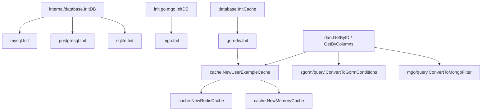
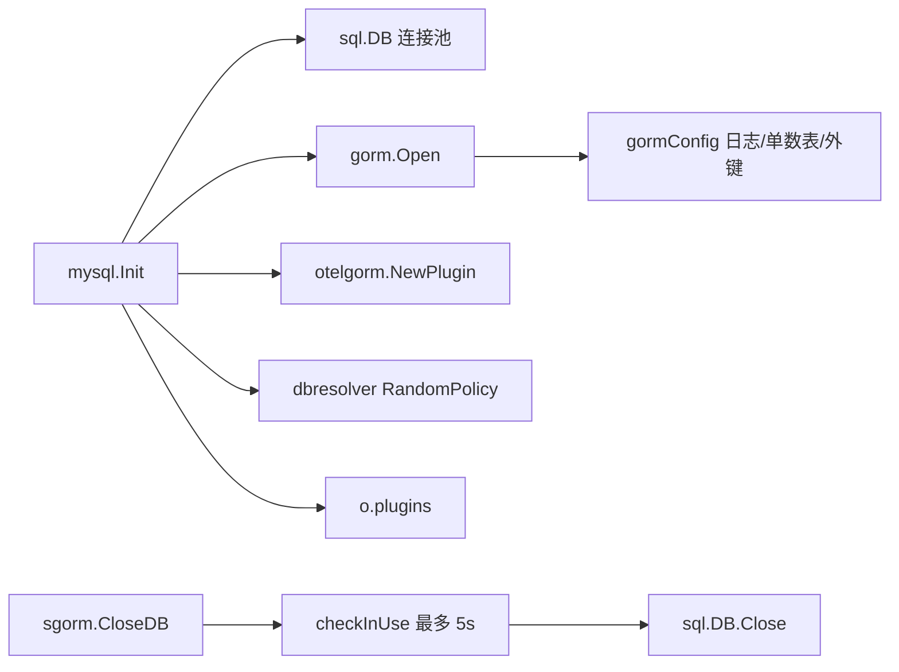
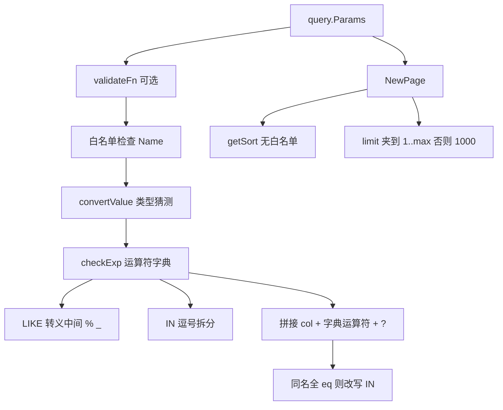
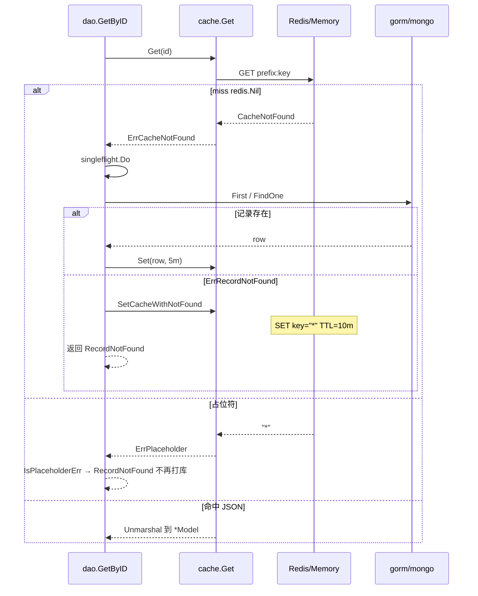

# pkg 数据库、缓存与查询

> 状态：待复核生成稿
> 生成日期：2026-08-16
> 基准提交：`23807238c62e0f3b3e2d9a341bbef50547d3f5ec`
> 工作区：dirty
> 源码范围：`pkg/sgorm/`（含 `mysql`/`postgresql`/`sqlite`/`query`/`glog`/`dbclose`）、`pkg/mgo/`（含 `query`）、`pkg/goredis/`、`pkg/cache/`、`pkg/encoding/`（cache 实际用到的 `Encoding` 与 JSON 实现）；交叉引用生成项目 `internal/database`、`internal/dao`、`internal/cache`、`internal/model`，以及生成期 `pkg/sql2code/parser`、`cmd/sponge/server/handler.go`
> 生成方式：源码、测试、配置与部署资产静态分析

本篇是第四层文档，补齐运行时数据面四个包的全部公开 API 与关键实现。生成期如何从数据库抽出 DDL 见 [06-SQL到代码片段引擎.md](06-SQL到代码片段引擎.md)；生成项目里 model / dao / cache 如何组装这些包见 [11-数据层Model-DAO-Cache.md](11-数据层Model-DAO-Cache.md)。HTTP 入口如何把请求交到 dao 见 [09-生成项目启动与HTTP请求链.md](09-生成项目启动与HTTP请求链.md)。

## 目录

- [快速摘要](#快速摘要)
- [为什么这样设计（Why）](#为什么这样设计why)
- [它是什么（What）](#它是什么what)
- [代码如何实现（How）](#代码如何实现how)
  - [运行期装配入口](#运行期装配入口)
  - [sgorm 基座与自定义类型](#sgorm-基座与自定义类型)
  - [MySQL / TiDB 驱动与 option](#mysql--tidb-驱动与-option)
  - [PostgreSQL 与 SQLite 驱动](#postgresql-与-sqlite-驱动)
  - [GORM 日志、关闭与插件链](#gorm-日志关闭与插件链)
  - [query.Params：防注入、条件与分页](#queryparams防注入条件与分页)
  - [mgo 连接、软删除与 Mongo 条件](#mgo-连接软删除与-mongo-条件)
  - [goredis 四种拓扑](#goredis-四种拓扑)
  - [cache 接口、NotFound 哨兵与 TTL](#cache-接口notfound-哨兵与-ttl)
  - [encoding：cache 真正用到的契约](#encodingcache-真正用到的契约)
- [调用关系表](#调用关系表)
- [对应测试](#对应测试)
- [阅读源码建议顺序](#阅读源码建议顺序)
- [重新实现检查清单](#重新实现检查清单)

---

## 快速摘要

### 架构总览（模块与依赖）

这四个包是生成项目运行时的数据面，不是 CLI 生成器。依赖方向固定：

```text
internal/database（生成项目装配）
  → pkg/sgorm/{mysql,postgresql,sqlite}  或  pkg/mgo
  → pkg/goredis
  → pkg/cache  → pkg/encoding.Encoding
internal/dao
  → pkg/sgorm/query  或  pkg/mgo/query
  → internal/cache → pkg/cache
```

| 包 | 职责边界 | 不负责 |
|---|---|---|
| `pkg/sgorm` | GORM 别名、嵌入 Model、Bool/TinyBool、关库 | 业务 CRUD、事务编排 |
| `pkg/sgorm/{mysql,postgresql,sqlite}` | 打开连接、日志、trace、插件、读写分离（仅 MySQL） | DSN 适配（在 `pkg/utils`） |
| `pkg/sgorm/query` | JSON 条件 → GORM `Where` 字符串 + `?` 参数；分页 ORDER/LIMIT/OFFSET | 执行查询 |
| `pkg/mgo` | Mongo 连接、软删除辅助、嵌入 Model | 业务 collection 选择 |
| `pkg/mgo/query` | JSON 条件 → `bson.M`；分页 sort/limit/skip | 执行 Find |
| `pkg/goredis` | 单机 / Sentinel / Cluster 客户端与 Ping | 业务 key 设计 |
| `pkg/cache` | `Cache` 接口：Redis / Cluster / 内存；NotFound 占位符 | 缓存击穿的 singleflight（在 dao） |
| `pkg/encoding` | cache 用 `Encoding` + `JSONEncoding`；`Codec` 给 gRPC 用 | 不参与 SQL |

生成期也会直接调用这些 Init：`pkg/sql2code/parser/sqlite.go:GetSqliteTableInfo` 调 `sqlite.Init`；`parser/mongodb.go:GetMongodbTableInfo` 调 `mgo.Init`；UI `cmd/sponge/server/handler.go` 的 `getMysqlTables` / `getPostgresqlTables` / `getSqliteTables` / `getMongodbTables` 用同一套 Init 列库表。那是生成器进程，不是生成项目运行时。

### 核心调用序列（逐步逻辑）

以生成项目 `GET /api/v1/userExample/{id}` 且 `App.CacheType=redis` 为例（HTTP 装配见 [09](09-生成项目启动与HTTP请求链.md)，dao 编排见 [11](11-数据层Model-DAO-Cache.md)）：

1. `internal/database.InitDB` 按 `config.Database.Driver` 分发到 `InitMysql` / `InitPostgresql` / `InitSqlite`；Mongo 模板换成 `init.go.mgo` → `InitMongodb`。
2. `InitMysql` 组装 `mysql.Option`（连接池、日志、可选 `WithEnableTrace`），`utils.AdaptiveMysqlDsn` 后调用 `mysql.Init`。
3. `InitCache("redis")` → `goredis.Init(redisCfg.Dsn, ...)`；`internal/cache.NewUserExampleCache` 用空前缀 + `encoding.JSONEncoding{}` 构造 `cache.NewRedisCache`。
4. dao `GetByID`：`cache.Get` → miss 时 `redis.Nil`（别名 `database.ErrCacheNotFound`）→ `singleflight.Do` 查库。
5. 库命中：`cache.Set(..., UserExampleExpireTime=5m)`。库 `ErrRecordNotFound`：`cache.SetCacheWithNotFound` 写入 `"*"`，TTL=`DefaultNotFoundExpireTime=10m`。
6. 再次 Get 读到 `"*"`：`cache.Get` 返回 `ErrPlaceholder`，dao `IsPlaceholderErr` 转成 `ErrRecordNotFound`，不再打库。
7. 列表 `GetByColumns`：`params.ConvertToGormConditions(query.WithWhitelistNames(model.UserExampleColumnNames))` 得到 `queryStr, args`，再 `ConvertToPage` 得到 `order, limit, offset`，GORM `Where(queryStr, args...).Order().Limit().Offset()`。

Mongo 路径把第 2 步换成 `mgo.Init`，第 7 步换成 `ConvertToMongoFilter` + `mgo.ExcludeDeleted`。

### 易错点与边界条件

- **条件防注入只白名单列名，不白名单 Sort。** `Column.Name` 拼进 SQL/bson 前必须过 `WithWhitelistNames`；`Sort` 经 `getSort` 直接拼进 `ORDER BY` / `bson.D`，没有白名单。生成 dao 只给 Columns 传了 `UserExampleColumnNames`。
- **值走占位符，运算符走字典。** 未知 `exp`/`logic` 直接报错；`Value` 进 `?` 或 bson 值，不拼接进 SQL 字符串。LIKE 中间的 `%`/`_` 会转义，但首尾已带 `%`/`_` 时不再包一层。
- **NotFound 哨兵是字面量 `*`，TTL 固定 10 分钟。** `Set` 的 `expiration==0` **不会**回退到 `DefaultExpireTime`（那段代码被注释掉），Redis 会写成永不过期。
- **PostgreSQL / SQLite 的连接池 Option 是死字段。** `WithMaxIdleConns` 等会写入 `options`，但 `Init` 从不对 `sql.DB` 调用 `SetMaxIdleConns`。只有 MySQL 真正生效。
- **PostgreSQL / SQLite 的 `WithLogging(l, level)` 会把 `logLevel` 强制改回 `Info`。** MySQL 版本才尊重传入的 level。
- **`glog.Error` 实际打 Warn。** `gormLogger.Error` 调用的是 `zap.Warn`。
- **Mongo `isnull`/`isnotnull` 写成 `$exist`，官方算子是 `$exists`。** 这条条件在真实 Mongo 上不会按预期工作。
- **`mgo.Model.SetModelValue` 的 ID 条件写反：** `if !p.ID.IsZero()` 才 `NewObjectID()`，零值 ID 不会被填充。生成 dao 的 `Create` 自己判断 `IsZero()`，不走这个方法。
- **内存 cache 的 `Del` 只删 `keys[0]`。** Redis 实现会删全部。`memory.MultiGet` 的 map 键是调用方原始 key；Redis `MultiGet` 的 map 键是带前缀的 `cacheKey`。生成代码 `cachePrefix=""`，两条路径碰巧一致。
- **本篇未运行测试套件。** 测试结论来自阅读 `*_test.go`；MySQL/PostgreSQL/Mongo 的 `Init` 测试在连不上真实库时 `t.Log` 后 return，CI 不保证连通。

---

## 为什么这样设计（Why）

Sponge 要让同一套 handler/dao 模板同时服务 MySQL、TiDB、PostgreSQL、SQLite、Mongo，并且缓存可在 Redis 与进程内存之间切换。如果每种存储都把连接、分页、防注入写进业务 dao，模板会按驱动爆炸。所以：

1. **连接与方言下沉到 `pkg/sgorm/*` 和 `pkg/mgo`。** dao 只拿 `*gorm.DB` 或 `*mongo.Collection`。TiDB 故意走 `mysql.InitTidb` → `mysql.Init`，因为协议兼容。
2. **前端 JSON 条件不能直接拼 SQL。** `query.Params` 把运算符限制在字典里，值走 `?`，列名必须白名单。这是给 `POST .../list` 这种“前端传 columns”的 API 用的，不是给内部手写 Where 用的。
3. **缓存穿透用短 TTL 占位符，击穿用 dao 层 singleflight。** `pkg/cache` 只负责把 miss 和“确定不存在”区分开（`redis.Nil` vs `ErrPlaceholder`）。并发合并查询故意留在 dao，因为只有 dao 知道主键和回源函数。
4. **编码可插拔。** cache 存的是 `[]byte`，通过 `encoding.Encoding` 编解码。生成代码固定 `JSONEncoding`，测试和自定义缓存可以换成 Gob / MsgPack / Gzip / Snappy。

必须保持的行为契约：List 条件的列名白名单；NotFound 占位符为 `"*"` 且 Get 返回 `ErrPlaceholder`；GORM 单数表名；软删除字段 `deleted_at`。可以替换的实现：换 GORM 以外的 ORM、换 ristretto、换 JSON 以外的 Encoding、读写分离策略从 `RandomPolicy` 换成别的 `dbresolver.Policy`。

---

## 它是什么（What）

### 模块与文件

| 路径 | 导出什么 |
|---|---|
| `pkg/sgorm/base_model.go` | `DB`、`ErrRecordNotFound`、驱动常量、`Model`/`Model2`、`GetTableName`、`CloseDB` |
| `pkg/sgorm/user_defined.go` | `Bool`/`BitBool`/`TinyBool`、`SetDriver` |
| `pkg/sgorm/mysql/` | `Init`/`InitTidb`/`Close` 与全部 MySQL Option，含读写分离 |
| `pkg/sgorm/postgresql/` | `Init`/`Close` 与 Option（无读写分离） |
| `pkg/sgorm/sqlite/` | `Init(dbFile)`/`Close` 与 Option |
| `pkg/sgorm/glog/glog.go` | `NewCustomGormLogger` |
| `pkg/sgorm/dbclose/close.go` | `Close(*gorm.DB)` |
| `pkg/sgorm/query/` | `Params`/`Column`/`Conditions`/`Page`、`ConvertToGormConditions` |
| `pkg/mgo/mongo.go` | `Init`/`Init2`/`Close`/`WithOption`/`NewCustomLogger` |
| `pkg/mgo/model.go` | Mongo `Model` 与软删除辅助 |
| `pkg/mgo/query/` | Mongo 版 `Params`、`ConvertToMongoFilter` |
| `pkg/goredis/` | `Init`/`InitSingle`/`InitSentinel`/`InitCluster`/`Close` |
| `pkg/cache/cache.go` | `Cache` 接口、包级函数、占位符常量 |
| `pkg/cache/redis.go` | `NewRedisCache`/`NewRedisClusterCache`/`BuildCacheKey` |
| `pkg/cache/memory.go` | ristretto 全局单例与 `NewMemoryCache` |
| `pkg/encoding/encoding.go` | `Encoding`、`Marshal`/`Unmarshal`、`Codec` 注册表 |
| `pkg/encoding/json_encoding.go` 等 | `JSONEncoding`/`JSONGzipEncoding`/`JSONSnappyEncoding`/`GobEncoding`/`MsgPackEncoding` |

`pkg/encoding/json` 与 `pkg/encoding/proto` 是 gRPC `Codec`（`init` 里 `RegisterCodec`），**生成 cache 不用它们**。cache 用的是值类型 `encoding.JSONEncoding{}`。

### 公开 API 清单（必须对齐的符号）

**`pkg/sgorm`**

- 类型别名：`DB = gorm.DB`，`KV = map[string]interface{}`，`ErrRecordNotFound = gorm.ErrRecordNotFound`。
- 常量：`DBDriverMysql`/`DBDriverPostgresql`/`DBDriverTidb`/`DBDriverSqlite`。
- `Model`：`ID uint64`、`CreatedAt`、`UpdatedAt`、`DeletedAt gorm.DeletedAt`；json 为 camelCase，`DeletedAt` 的 json 为 `"-"`。
- `Model2`：字段相同，json 为 snake_case。
- `GetTableName(object)`：指针或结构体 → `xstrings.ToSnakeCase(类型名)`；其它 kind 返回 `""`。
- `CloseDB` → `dbclose.Close`。
- `Bool`（别名 `BitBool`）：`Scan`/`Value`；`TinyBool`：`Scan`/`Value`；`SetDriver(driverName)` 写包级 `currentDriver`。

**`pkg/sgorm/mysql`**：`Init(dsn, opts...)`、`InitTidb`（直接调 `Init`）、`Close`；Option：`WithLogging`、`WithSlowThreshold`、`WithMaxIdleConns`、`WithMaxOpenConns`、`WithConnMaxLifetime`、`WithEnableForeignKey`、`WithEnableTrace`、`WithLogRequestIDKey`、`WithRWSeparation`、`WithGormPlugin`。

**`pkg/sgorm/postgresql` / `sqlite`**：`Init`、`Close`；Option 为 `WithLogging`、`WithSlowThreshold`、`WithMaxIdleConns`、`WithMaxOpenConns`、`WithConnMaxLifetime`、`WithEnableForeignKey`、`WithEnableTrace`、`WithLogRequestIDKey`、`WithGormPlugin`，**没有** `WithRWSeparation`。sqlite 的 `Init` 第一个参数是文件路径不是 DSN。

**`pkg/sgorm/query`**

- 运算符常量：`Eq`/`Neq`/`Gt`/`Gte`/`Lt`/`Lte`/`Like`/`In`/`NotIN`/`IsNull`/`IsNotNull`、`AND`/`OR`。
- `RulerOption`：`WithWhitelistNames`、`WithValidateFn`。
- `Params{Page, Limit, Sort, Columns, Size}`，`Size` 已 Deprecated，转换分页时**不读 Size**。
- `Column{Name, Exp, Value, Logic}`。
- `Params.ConvertToPage() (order, limit, offset)`、`ConvertToGormConditions(opts...) (string, []interface{}, error)`。
- `Conditions.ConvertToGorm`、`CheckValid`（只检查 `len(Columns)!=0`）。
- `SetMaxSize`、`Page` 及其 getter、`DefaultPage`、`NewPage`。

**`pkg/mgo`**：`Database = mongo.Database`、`ErrNoDocuments`、`DBDriverName="mongodb"`；`Init`/`Init2`/`Close`/`WithOption`/`NewCustomLogger`；`Model`、`SetModelValue`、`ExcludeDeleted`、`EmbedUpdatedAt`、`EmbedDeletedAt`、`ConvertToObjectIDs`。

**`pkg/mgo/query`**：与 GORM 版同名的 `Params`/`Column`/`Conditions`/`Page`/`RulerOption`；`ConvertToMongoFilter`、`ConvertToMongo`、`ConvertToPage() (bson.D, limit, skip)`。NotIn 常量是 `"nin"`，另接受 `"notin"`/`"not in"`。

**`pkg/goredis`**：`Client = redis.Client`、`ErrRedisNotFound = redis.Nil`、`DefaultRedisName="default"`；`Init`/`InitSingle`/`InitSentinel`/`InitCluster`/`Close`/`CloseCluster`；Option：`WithEnableTrace`（Deprecated，**Init 不读取 `enableTrace`**）、`WithTracing`、`WithDialTimeout`/`WithReadTimeout`/`WithWriteTimeout`、`WithTLSConfig`、`WithSingleOptions`/`WithSentinelOptions`/`WithClusterOptions`。

**`pkg/cache`**

- 变量：`DefaultExpireTime=24h`、`DefaultNotFoundExpireTime=10m`、`NotFoundPlaceholder="*"`、`NotFoundPlaceholderBytes`、`ErrPlaceholder`、`DefaultClient`、`CacheNotFound=redis.Nil`。
- 接口 `Cache`：`Set`/`Get`/`MultiSet`/`MultiGet`/`Del`/`SetCacheWithNotFound`。
- 包级函数把调用转到 `DefaultClient`。
- `NewRedisCache`、`NewRedisClusterCache`、`BuildCacheKey`、`InitMemory`/`InitGlobalMemory`/`GetGlobalMemoryCli`/`CloseGlobalMemory`、`NewMemoryCache`。
- 内存 Option：`WithNumCounters`/`WithMaxCost`/`WithBufferItems`。

**`pkg/encoding`（cache 路径）**：`Encoding`、`Marshal`/`Unmarshal`、`ErrNotAPointer`；`JSONEncoding`、`JSONGzipEncoding`、`JSONSnappyEncoding`、`GobEncoding`、`MsgPackEncoding`；`GzipEncode`/`GzipDecode`。同包的 `Codec`/`RegisterCodec`/`GetCodec` 给 gRPC，cache 不调用。

---

## 代码如何实现（How）

### 运行期装配入口

生成项目启动时，`initial.InitApp` 调 `database.InitDB` 与可选 `InitCache`。SQL 模板：

```23:37:internal/database/init.go
func InitDB() {
	dbDriver := config.Get().Database.Driver
	switch strings.ToLower(dbDriver) {
	case sgorm.DBDriverMysql, sgorm.DBDriverTidb:
		gdb = InitMysql()
	case sgorm.DBDriverPostgresql:
		gdb = InitPostgresql()
	case sgorm.DBDriverSqlite:
		gdb = InitSqlite()
	default:
		panic("InitDB error, ...")
	}
}
```

`GetDB` 用 `sync.Once` 懒初始化；`CloseDB` → `sgorm.CloseDB(gdb)`。Mongo 变体 `internal/database/init.go.mgo` 只接受 `mgo.DBDriverName`，`GetDB` 返回 `*mgo.Database`。

`InitMysql` 把 yaml 里的 `MaxIdleConns`/`MaxOpenConns`/`ConnMaxLifetime`（分钟）编成 Option；`EnableLog` 时追加 `WithLogging(logger.Get())` + `WithLogRequestIDKey("request_id")`；`App.EnableTrace` 时追加 `WithEnableTrace`。读写分离和自定义 Plugin 在模板里是注释掉的示例。DSN 先经 `utils.AdaptiveMysqlDsn`。PostgreSQL 在 `Init` 成功后额外 `sgorm.SetDriver("postgresql")`，否则 `Bool.Value` 会按 MySQL 写出 `[]byte{0/1}`。

缓存装配：`InitCache(cType)` 填 `CacheType{CType, Rdb}`；仅 `cType=="redis"` 时 `Rdb=GetRedisCli()`。`NewUserExampleCache` 按 `CType` 选 `NewRedisCache` 或 `NewMemoryCache`，前缀空字符串，`newObject` 返回 `*model.UserExample`。未知类型返回 `nil`，dao 把 `xCache==nil` 当成“不用缓存”。



### sgorm 基座与自定义类型

`Model` 给生成 model 嵌入：`UserExample` 写 `sgorm.Model \`gorm:"embedded"\``。`DeletedAt` 带 index，GORM 默认软删除。`GetTableName` 只看 Go 类型名，不读 `TableName()` 方法；生成的 `UserExample.TableName` 直接返回 `"user_example"`，不调用 `GetTableName`。

`Bool` 解决 MySQL `bit(1)` 与 PostgreSQL `boolean` 的读写差：

- `Scan`：`nil` → false；`[]byte` 仅当 `len==1 && v[0]==1` 为 true；`bool` 原样；其它类型报 `unsupported type`。
- `Value`：`currentDriver` 为 `"postgresql"` 或 `"postgres"` 时返回 Go `bool`；默认返回 `[]byte{1}` 或 `{0}`。
- `SetDriver` 写包级变量，**不是** per-connection 状态。多驱动同进程会互相覆盖。

`TinyBool` 走 `sql.NullBool.Scan`，写出 `int64(0/1)`，对应 MySQL `tinyint(1)`。`Scan(nil)` 时 `NullBool` 为 false，不报错。

### MySQL / TiDB 驱动与 option

`mysql.Init` 的真实步骤：

1. `defaultOptions()`：`isLog=false`，`slowThreshold=0`，`maxIdleConns=3`，`maxOpenConns=50`，`connMaxLifetime=30m`，`disableForeignKey=true`，`enableTrace=false`，`logLevel=Info`，`requestIDKey=""`。
2. `sql.Open("mysql", dsn)`，立刻 `SetMaxIdleConns` / `SetMaxOpenConns` / `SetConnMaxLifetime`。这是三个驱动里**唯一**真正设置连接池的路径。
3. `gorm.Open(mysqlDriver.New(Config{Conn: sqlDB}), gormConfig(o))`。
4. `db.Set("gorm:table_options", "CHARSET=utf8mb4 COLLATE=utf8mb4_general_ci")`，影响 AutoMigrate 建表。
5. `o.enableTrace` → `db.Use(otelgorm.NewPlugin())`，失败包装为 `using gorm opentelemetry, err: ...`。
6. `len(o.slavesDsn)>0` → `db.Use(rwSeparationPlugin(o))`。
7. 按顺序 `db.Use` 每一个 `o.plugins`。

`gormConfig`：

- `DisableForeignKeyConstraintWhenMigrating: o.disableForeignKey`（默认 true）。`WithEnableForeignKey` 把它设为 false。
- `NamingStrategy{SingularTable: true}`，表名不加复数。
- 日志优先级：**`slowThreshold > 0` 覆盖 `isLog`**。慢查询用标准库 `log` 打到 stdout，`LogLevel=Warn`，`Colorful=true`。`isLog==true` 且 `gLog!=nil` 时用 `glog.NewCustomGormLogger`；`gLog==nil` 时用 `logger.Default.LogMode(o.logLevel)`。`isLog==false` 且没有慢查询阈值时 `Silent`。

`WithLogging(l, level...)`：`isLog=true`，`gLog=l`；`len(level)>0` 用 `level[0]`，否则 `Info`。MySQL 这份实现**不会**在设置完后再覆盖 level。

读写分离 `rwSeparationPlugin`：

- 每个 slave/master DSN 再跑一遍 `utils.AdaptiveMysqlDsn`（主连接的 dsn 在 `Init` 里不再适配，由调用方适配）。
- `dbresolver.Register(Config{Sources: masters, Replicas: slaves, Policy: RandomPolicy{}})`。
- `mastersDsn` 是 variadic，可空。空 Sources 时 dbresolver 用打开库时的连接当 source。GORM 默认：写走 Sources，读走 Replicas。

`WithGormPlugin` 只是把 `[]gorm.Plugin` 存起来，Init 末尾 `Use`。`WithGormPlugin(nil)` 会让 `db.Use(nil)` 失败；测试 `Test_gormConfig` 调的是 `rwSeparationPlugin` 的返回值断言 `NotNil`，不是 `db.Use`。

`InitTidb` 零逻辑，等于 `Init`。

### PostgreSQL 与 SQLite 驱动

两者的 `Init` 结构相同：`gorm.Open(方言, gormConfig)` → 可选 otelgorm → 自定义 plugins。差异：

| 点 | PostgreSQL | SQLite |
|---|---|---|
| 打开方式 | `postgres.Open(dsn)` | `sqlite.Open(fmt.Sprintf("%s?_journal=WAL&_vacuum=incremental", dbFile))` |
| 额外 `db.Set` | 无 | `"gorm:auto_increment", true` |
| 默认 `requestIDKey` | `"request_id"` | `""`（空；glog 里空会再默认成 `"request_id"`） |
| 连接池 Option | 写入 struct，**从不应用到 `sql.DB`** | 同左 |
| `WithRWSeparation` | 无 | 无 |

SQLite WAL + incremental vacuum 写死在 DSN 后缀，调用方不能关。

`WithLogging` 在 PostgreSQL 与 SQLite 里是：

```go
if len(level) > 0 {
    o.logLevel = level[0]
}
o.logLevel = logger.Info  // 总是覆盖
```

因此 `WithLogging(l, logger.Warn)` 实际仍是 Info。MySQL 没有最后这一行。

`gormConfig` 与 MySQL 同构（含 slowThreshold 覆盖 isLog）。`Close` 三者都转 `dbclose.Close`。

### GORM 日志、关闭与插件链

`glog.NewCustomGormLogger(l, requestIDKey, logLevel)`：`l==nil` 时 `zap.NewProduction()`；`requestIDKey==""` 时 `"request_id"`；`logLevel==0` 时 `Info`。实现 `logger.Interface`：

- `LogMode` 改接收者字段并返回自身（不是拷贝）。
- `Info`/`Warn`/`Error`：先 `strings.ReplaceAll(msg, "%v", "")`，再把 `data` 打进 `zap.Any("data", data)`。`Error` **走 `gLog.Warn`**。
- `Trace`：`Silent` 直接 return。`err!=nil` 打 Warn（含 SQL、rows、ms、file_line）。无错且 level≥Info 打 Info；level≥Warn 打 Warn。`rows==-1` 时 rows 字段为字符串 `"-"`。`file_line` 若路径含 `/internal/`，只保留后半段。
- `requestIDField`：从 `ctx.Value(requestIDKey).(string)` 取；类型不是 string 则 Skip。

`dbclose.Close`：`db==nil` 返回 nil；`db.DB()` 失败则返回该错误；否则 `checkInUse(sqlDB, 5s)` 每 250ms 看 `Stats().InUse==0`，超时也继续 `sqlDB.Close()`。`context.WithTimeout` 的 cancel 被故意忽略（`nolint`），5 秒后 ctx 泄漏到 Close 返回为止。



### query.Params：防注入、条件与分页

这是本包最容易用错、也最必须重实现正确的部分。

#### 输入形态

前端 / handler 绑定：

```json
{
  "page": 0,
  "limit": 10,
  "sort": "-id,name",
  "columns": [
    {"name": "age", "exp": ">=", "value": 18, "logic": "and"},
    {"name": "name", "exp": "like", "value": "Li"}
  ]
}
```

`Page` 从 0 起。`binding:"gte=0"` / `"gte=1"` 只在 Gin 绑定生效；dao 直接构造 `Params` 时没有这层校验。

#### 防注入契约（必须同时成立）

1. **列名白名单。** `ConvertToGormConditions` 对每个 `column.Name`：空，或 `whitelistNames != nil && !whitelistNames[Name]`，返回 `field name '%s' is not allowed`。生成 dao 传入 `model.UserExampleColumnNames`（含 `id`/`created_at`/`updated_at`/`deleted_at` 与业务列）。**不传 option 时白名单为 nil，任何非空列名都放行**——这是 SQL 注入口，因为 `Name` 是直接拼进字符串的。
2. **运算符白名单。** `expMap` 只认 `eq/neq/gt/gte/lt/lte/like/in/notin/isnull/isnotnull` 以及符号 `=` `!=` `>` `>=` `<` `<=`、`"not in"`、`"is null"`、`"is not null"`。未知 exp → `unsupported exp type`。最终拼进去的是字典里的 ` = ` / ` LIKE ` 等，不是用户原始字符串。
3. **逻辑白名单。** `logicMap` 认 `and/or`、`&/&&/|/||`、`AND/OR`、`and:(`/`and:)`/`or:(`/`or:)`。未知 → `unsupported logic type`。
4. **值参数化。** 条件字符串里只有 `?` 或 `IN` 的 `(?)` 或 IS NULL 的空 symbol；值放进 `[]interface{}` 交给 GORM。用户无法把 `value` 拼进 SQL 文本。
5. **额外校验函数。** `WithValidateFn` 在循环列之前对整份 `[]Column` 执行，失败立刻返回。用于禁止某些值，不是替代白名单。
6. **Sort 没有白名单。** `getSort` 按逗号拆字段，前缀 `-` 变 `DESC`，否则 `ASC`，拼成 `name ASC, age DESC`。恶意 `sort=id;drop table` 会进入 `Order()`。重实现若要与生成 dao 同级安全，必须给 Sort 也加白名单（当前源码没有）。

#### `ConvertToGormConditions` 逐步逻辑

1. `len(Columns)==0` → `("", nil, nil)`，不是错误。dao 会 `Where("", nil)`，即无额外条件。
2. 跑 `validateFn`。
3. 预置 `isUseIN=true`（仅 1 列时强制 false）。`field` 记第一列名。
4. 每列：白名单 → `Value==nil` 时仅允许 IS NULL / IS NOT NULL（用**转换前**的 `column.Exp` 去查 `expMap`）→ `convertValue` → `checkExp`。
5. 拼接：最后一列忽略 logic，除非 logic 是 `or:)` / `and:)` 要补 ` ) `。中间列：`or:(`/`and:(` 前加 ` ( `；`or:)`/`and:)` 后加 ` ) ` 再加 AND/OR；默认 `col + exp + ? + AND/OR`。
6. 若全程列名相同且全部是 ` = `，收成 `field IN (?)`，`args` 变成单元素切片，元素是原来的 args 切片。这是“多列同名等值”的优化，与单列 `exp=in` 不同。

`checkExp` 细节：

- 空 Exp 当 `eq`。
- **LIKE**：Value 必须是 `string`，否则 `invalid value type`。用 rune 切片：长度 > 2 时，去掉首尾后把中间的 `%`、`_` 换成 `\%`、`\_`，再拼回首尾。若结果首尾已是 `%` 或 `_`，保持用户写法（前缀/后缀匹配）；否则包成 `%val%`。测试：`"f%o_o"` → `"%f\%o\_o%"`；`"%foo"` 保持 `"%foo"`。
- **IN / NOT IN**：若 Value 是 string，按逗号拆；`"..."` 或 `'...'` 去引号当字符串；否则 `strconv.Atoi` 成功当 int，失败当字符串。`symbol="(?)"`。若 Value 已是 `[]interface{}` 则原样使用。
- **IS NULL / IS NOT NULL**：`Value=nil`，`symbol=""`，不往 args 里塞值。
- Logic 空则 `and`；否则 `ToLower` 后必须在 `logicMap`。注意拼 SQL 时用的是 `logicMap[column.Logic]`，而 `or:(` 等 key 是小写，`checkExp` 把 `c.Logic` 改成小写 key，因此 `OR: (` 这种带空格的会失败。

`convertValue`：非 string 原样返回。string 先 TrimSpace；若以 `"` 开头，去掉引号后若是纯数字则返回**字符串数字**（测试 `"\"20\""` → `"20"`，避免变成 int）。否则依次 `Atoi`、`ParseBool`、`ParseFloat`、RFC3339、一组本地日期 layout。解析成功就换成对应类型。这就是 `"20"` 变成 int `20`、`"true"` 变成 bool、`"2021-01-01"` 变成 `time.Time` 的原因。

分组括号**不做栈匹配计数**。左右括号数量不平衡时仍可能产出残缺 SQL。Mongo 版会检查括号数量。

#### 分页

`ConvertToPage` → `NewPage(p.Page, p.Limit, p.Sort)`，返回 `page.sort`、`page.limit`、`page.page * page.limit`。

`NewPage`：

- `page<0` → 0。
- `limit > defaultMaxSize || limit < 1` → `limit = defaultMaxSize`（默认 1000，可用 `SetMaxSize` 改；传入 <10 会被抬到 10）。
- 因此 **Limit=0 会变成 1000，不是 20**。`DefaultPage` 才是每页 20、`id DESC`。
- `getSort`：去空格；空或 `"ignorecount"` → `"id DESC"`。dao 跳过 COUNT 用的是 `params.Sort != "ignore count"`（带空格）。去空格后 `"ignore count"` 变成 `"ignorecount"`，排序仍是 `id DESC`，两边对得上。

`Page.Offset()` 与 `ConvertToPage` 的 offset 同公式。Deprecated 的 `Size()` 返回 `limit`。

生成 dao 的 COUNT 与 Find：

```go
queryStr, args, err := params.ConvertToGormConditions(query.WithWhitelistNames(model.UserExampleColumnNames))
// Sort != "ignore count" 时 Count；total==0 直接返回
order, limit, offset := params.ConvertToPage()
db.Order(order).Limit(limit).Offset(offset).Where(queryStr, args...).Find(&records)
```



### mgo 连接、软删除与 Mongo 条件

#### 连接

`Init(dsn)`：`url.Parse`；`dbName = TrimLeft(Path, "/")`，空则 `database name is empty`。无 query 时 URI 为去掉 Path 的 dsn；有 query 时先 TrimRight RawQuery，再 TrimRight `dbName+"?"`，再拼回 `?+RawQuery`。然后 `Init2(uri, dbName)`。

`Init2`：`mongo.Connect(ctx, Client().ApplyURI(uri) + opts...)`，`Ping`，`client.Database(dbName)`。失败不 Disconnect 已创建的 client（泄漏，调用方拿不到 db 也无法 Close）。

`Close`：`db.Client().Disconnect(Background)`。测试里对空 `*mongo.Database` 会 panic，用 `recover` 兜住。

`WithOption()` 只是 `options.Client()`，链式 `SetMaxPoolSize` 等由调用方完成。`NewCustomLogger(l, isDebugLevel)` 实现 driver 的 `LogSink`：`Info`/`Error`（Error 打 zap Warn）；`SetMaxDocumentLength(300)`；只把 `LogComponentCommand` 设为 Info 或 Debug。

生成期 `GetMongodbTableInfo` 传 `&ClientOptions{Timeout: 5s}`。运行期 `InitMongodb` 只用适配后的 DSN，不加超时 Option。

#### Model 与软删除

`mgo.Model`：`ID primitive.ObjectID` bson `_id`；时间字段是 `*time.Time`；`DeletedAt` `omitempty`。

`SetModelValue`：**ID 非零才 `NewObjectID()`**（与常见“零值才生成”相反）；`CreatedAt`/`UpdatedAt` 设为 `now`。生成 dao `Create` 不调用它，而是：

```go
if record.ID.IsZero() { record.ID = primitive.NewObjectID() }
now := time.Now(); record.CreatedAt = &now; record.UpdatedAt = &now
```

`ExcludeDeleted(filter)`：nil 则 `{}`，然后 `filter["deleted_at"] = bson.M{"$exists": false}`。软删记录带 `deleted_at` 字段即被排除。

`EmbedUpdatedAt` / `EmbedDeletedAt`：若已有 `$set` 且类型是 `bson.M`，往里加时间；否则包一层 `$set`。`EmbedDeletedAt` 在没有 `$set` 时**丢弃**原 update 里的其它字段，只写 `deleted_at`。生成 `DeleteByID` 传的是 `EmbedDeletedAt(bson.M{})`，所以没问题。

`ConvertToObjectIDs`：非法 hex **静默跳过**，不报错。

#### `ConvertToMongoFilter`

白名单、`validateFn` 与 GORM 版同构。`checkName` 失败文案相同。

值处理：`isObjectID` 若 string 长度恰好 24 且 hex 合法，则变成 `ObjectID`；若 `Name=="id"` 强制改 `"_id"`；若后缀 `:oid` 则去掉后缀（用于非 `_id` 的 ObjectID 字段）。否则走与 GORM 相同的 `convertValue`。

运算符映射到 bson：`=` 保持原值；`!=` → `$ne`；比较 → `$gt/$gte/$lt/$lte`；`like` → `$regex`（`regexp.QuoteMeta`）+ `$options:"i"`；`in`/`nin` → `$in`/`$nin`（string 同样逗号拆分）；`isnull` → `{"$exist": false}`，`isnotnull` → `{"$exist": true}`。**MongoDB 算子是 `$exists`，这里少了 s，条件无效。**

列数分支：

- 0：`bson.M{}`。
- 1：`{name: value}`。
- 2：看**第一列**的 Logic 是否 AND，决定 `$and` 或 `$or` 包两列。第二列 Logic 忽略。
- ≥3：若任一 Logic 含 `(`/`)`，走栈 `buildFilterWithStack`；左右括号计数不等则 `mismatched parentheses`。否则 `buildFilterWithPrecedence`：AND 优先于 OR，按列上的 logic 把 AND 段切开，再 `$or` 包起来。

栈实现：`and:(`/`or:(` 压新 group；`:)` 弹出并合并。AND group 会把多个 `bson.M` **按 key 合并成一张 map**（同 key 后者覆盖），OR group 保留数组。根上只剩一个 AND filter 时不再包 `$and`。

`Conditions.CheckValid` 比 GORM 严：每列 `name`/`value` 非空，且 `Exp`/`Logic` 若非空必须在 map 里（**大小写敏感**，`"EQ"` 会失败；Convert 路径用 `ToLower`）。`ConvertToMongo` 转成 `Params` 再 `ConvertToMongoFilter`。

#### Mongo 分页

`DefaultPage`：每页 **10**（GORM 是 20），`sort: {_id: -1}`。`NewPage`：`limit>max` 夹到 max；`limit<1` 变成 **10**（GORM 是变成 max=1000）。`getSort`：空 → `_id:-1`；字段名 `id` 改 `_id`；`-name` → -1。**没有** `"ignorecount"` 特殊值。生成 Mongo dao **总是 CountDocuments**，没有 skip count 分支。

生成 `GetByColumns`：`ConvertToMongoFilter(白名单)` → `mgo.ExcludeDeleted` → Count → `ConvertToPage` → `FindOptions{Limit, Skip, Sort}`。

### goredis 四种拓扑

DSN（`Init`）：去空格；若末尾 3 字符不含 `/` 则补 `/0`；若不以 `redis://` 或 `rediss://` 开头则加 `redis://`。然后 `redis.ParseURL`。`WithDialTimeout` 等 >0 才覆盖 ParseURL 结果；`tlsConfig != nil` 才设。`WithSingleOptions` **整份替换** `*redis.Options`，DSN 解析结果丢弃。

`InitSingle(addr, password, db)` 自己拼 `redis.Options`，同样可被 `WithSingleOptions` 替换。

`InitSentinel` / `InitCluster` 用 `FailoverOptions` / `ClusterOptions`，可被对应 With 整份替换。Cluster 的健康检查是 `ForEachMaster` 上 Ping，不是只 Ping 一个入口。

四种 Init 在 Ping 前：若 `tracerProvider != nil`，`redisotel.InstrumentTracing(..., WithTracerProvider)`。`WithEnableTrace()` 只置 `enableTrace=true`，**没有任何 Init 读取该字段**，对 Redis v9 是空操作。`WithTracing(nil)` 不会开启（测试特意传 nil）。

Ping 用 15s timeout 的 Background ctx，cancel 同样被忽略。

`Close` / `CloseCluster`：nil 返回 nil。`Close()` 后：`err != nil && errors.Is(err, redis.ErrClosed)` 才把错误返回，**其它错误被吞掉返回 nil**。已关闭的客户端反而会把 `ErrClosed` 传给调用方。语义与函数名相反，重实现不要照抄。

生成项目只走 `goredis.Init(redisCfg.Dsn)` + 超时 Option + 可选 `WithTracing(tracer.GetProvider())`。Sentinel/Cluster 要业务自己调。

### cache 接口、NotFound 哨兵与 TTL

#### 接口与包级入口

`Cache` 六个方法。包级 `Set`/`Get`/… 要求先把 `DefaultClient` 赋好（测试里 `DefaultClient = NewRedisCache(...)`）。生成业务 cache **不使用**包级函数，而是持有自己的 `cache.Cache`。

常量：

| 符号 | 值 | 谁用 |
|---|---|---|
| `DefaultExpireTime` | 24h | **当前 Set 不用**（应用层 `UserExampleExpireTime=5m`） |
| `DefaultNotFoundExpireTime` | 10m | 仅 `SetCacheWithNotFound` |
| `NotFoundPlaceholder` | `"*"` | Redis SET 的字符串；内存是 `[]byte("*")` |
| `ErrPlaceholder` | `"cache: placeholder"` | Get 读到 `*` 或空 bytes |
| `CacheNotFound` | `redis.Nil` | 内存 miss 转成这个，好让 dao 用同一 `errors.Is` |

#### Redis / Cluster 实现

`NewRedisCache(client, keyPrefix, encode, newObject)`。`newObject` 仅 `MultiGet` 用来 `Unmarshal` 到新实例。

`BuildCacheKey`：`key==""` 报 `[cache] key should not be empty`；`keyPrefix!=""` 则 `prefix:key`。

`Set`：`encoding.Marshal`（必须指针）→ 空 buf 改成 `NotFoundPlaceholderBytes` → `client.Set(ctx, cacheKey, buf, expiration)`。**expiration=0 表示 Redis 永不过期**，不会改成 24h。

`Get`：`Get.Bytes()` 的错误原样返回（含 `redis.Nil`）。命中后若 `len==0` 或等于 `*`，返回 `ErrPlaceholder`，**不 Unmarshal**。否则 `encoding.Unmarshal` 到调用方的 `val`。

`SetCacheWithNotFound`：`SET cacheKey "*" EX 10m`。这是防穿透的唯一写入点。

`MultiSet`：Marshal/BuildKey 失败 `fmt.Printf` 后 **continue**（不返回错误）。`Pipeline.MSet` 再对每个 key `Expire`。空 map 直接 nil。

`MultiGet`：`MGet` 后反射写入 `value`（必须是可 SetMapIndex 的 map）。nil 或占位符 **skip**，不报 `ErrPlaceholder`。map 的键是 **cacheKey（带前缀）**，不是入参 key。Unmarshal 失败只 Printf。

`Del`：某个 key 的 BuildCacheKey 失败则 `continue`，该槽位仍是零值 `""`，随后 `Del` 可能带上空字符串。空 `keys` 直接 nil。

`redisClusterCache` 方法与单机一一对应，只是 `*redis.ClusterClient`。

#### 内存实现

底层 `dgraph-io/ristretto`。`InitMemory` 默认 `NumCounters=1e7`、`MaxCost=1<<30`、`BufferItems=64`；失败 **panic**。`NewMemoryCache` 总是 `GetGlobalMemoryCli()`：nil 时 `once.Do(InitMemory)`。所有 memory cache 实例共享一个进程级 LRU。`CloseGlobalMemory` 关这个单例。

`Set`：`SetWithTTL(cacheKey, buf, cost=0, expiration)`，失败返回 `SetWithTTL failed`，成功 `Wait()` 刷缓冲。`Get` miss → `CacheNotFound`。`SetCacheWithNotFound` 同样 `SetWithTTL(..., 10m)`，**不 Wait**，测试里紧接着 Get 可能偶发 miss。

`Del(keys...)`：**只处理 `keys[0]`**。`MultiSet`/`MultiGet` 循环调单键 Set/Get；`MultiGet` 的 map 键是**原始 key**。Get 失败 `continue`。

#### 与 dao 的约定（哨兵状态机）



写路径：`Create`（SQL）不删缓存；Mongo `Create` 会 `deleteCache`。`Update`/`Delete` 在 DB 成功后 `_ = deleteCache`，忽略删除错误。占位符会在 10 分钟后过期，然后再次允许回源。

### encoding：cache 真正用到的契约

cache 只依赖：

```go
type Encoding interface {
    Marshal(v interface{}) ([]byte, error)
    Unmarshal(data []byte, v interface{}) error
}
```

`encoding.Marshal`/`Unmarshal` 包装：`v` 必须是 pointer 或 interface，否则 `ErrNotAPointer`。若 `v` 实现 `encoding.BinaryMarshaler`/`Unmarshaler`：`e==nil` 时直接走 Binary；`e.Marshal` 失败再 fallback Binary。生成 cache 传入 `JSONEncoding{}`（非 nil），业务 model 也不实现 BinaryMarshaler，因此就是 `json.Marshal`/`Unmarshal`。

| 实现 | Marshal | 生成 cache 是否使用 |
|---|---|---|
| `JSONEncoding` | `encoding/json` | 是，`internal/cache/userExample.go` |
| `JSONGzipEncoding` | JSON + `gzip.BestCompression` | 否，可替换 |
| `JSONSnappyEncoding` | JSON + snappy | 否 |
| `GobEncoding` | `encoding/gob` | 否 |
| `MsgPackEncoding` | `vmihailenco/msgpack` | 否 |

`GzipEncode` 在 `Write` 失败时先 `Close` 再返回，可能丢掉 Close 错误。`JSONGzipEncoding.Unmarshal` 先 `GzipDecode` 再 `json.Unmarshal`。

同包 `Codec`（`pkg/encoding/json` 的 protojson、`pkg/encoding/proto`）由 `init` 注册进 `registeredCodecs`，给 gRPC content-subtype 用。`RegisterCodec(nil)` 或 `Name()==""` 会 panic。cache 的 `encoding.Encoding` 与 `Codec` **不是同一个接口**（Codec 多一个 `Name()`）。

---

## 调用关系表

| 调用方文件与符号 | 关系 | 被调用方文件与符号 | 触发与输入 | 返回与后续处理 | 错误、状态与副作用 |
|---|---|---|---|---|---|
| `internal/database/mysql.go:InitMysql` | 调用 | `pkg/sgorm/mysql.Init` | yaml 连接池/日志/trace；已适配 DSN | `*gorm.DB` 赋给包级 `gdb` | 失败 `panic` |
| `internal/database/postgresql.go:InitPostgresql` | 调用 | `postgresql.Init` 然后 `sgorm.SetDriver("postgresql")` | yaml 连接池/日志/trace；`AdaptivePostgresqlDsn` | 驱动名影响后续 `Bool.Value` | `SetDriver` 是进程全局状态；连接池 Option 未应用到 `sql.DB` |
| `internal/database/sqlite.go:InitSqlite` | 调用 | `sqlite.Init` | `AdaptiveSqlite(DBFile)` | WAL 文件副作用 | 连接池 Option 被忽略 |
| `internal/database/init.go:CloseDB` | 调用 | `sgorm.CloseDB` → `dbclose.Close` | 进程退出 Close 切片 | 最多等 5s InUse | `db.DB()` 失败向上返回 |
| `internal/database/redis.go:InitRedis` | 调用 | `goredis.Init` | DSN + 超时；可选 `WithTracing` | 包级 `redisCli` | Ping 失败 panic |
| `internal/cache/userExample.go:NewUserExampleCache` | 构造 | `cache.NewRedisCache` 或 `NewMemoryCache` | `JSONEncoding{}`，`cachePrefix=""`，`newObject` | 实现 `UserExampleCache` | 未知 CType 返回 nil |
| `internal/dao/userExample.go:GetByID` | 调用 | `UserExampleCache.Get` → `redisCache.Get` | 业务 key `userExample:{id}` | 命中返回 model | `redis.Nil` 回源；`ErrPlaceholder` 当不存在 |
| `dao.GetByID` singleflight 回源 | 调用 | `Set` / `SetPlaceholder` | 5m JSON 或 10m `"*"` | 缓存错误只 `logger.Warn` | 穿透保护；击穿靠 singleflight |
| `dao.GetByColumns` | 调用 | `query.Params.ConvertToGormConditions` | `WithWhitelistNames(UserExampleColumnNames)` | `Where(queryStr, args...)` | 白名单失败变成 `query params error` |
| `dao.GetByColumns` | 调用 | `Params.ConvertToPage` | Page/Limit/Sort | `Order/Limit/Offset` | Sort 无白名单 |
| `internal/dao/userExample.go.mgo:GetByColumns` | 调用 | `mgo/query.ConvertToMongoFilter` + `mgo.ExcludeDeleted` | `WithWhitelistNames(UserExampleColumnNames)` | `Find` + CountDocuments | 总是 count；`$exist` 拼写错误 |
| `dao.mgo DeleteByID` | 调用 | `mgo.EmbedDeletedAt` + `ExcludeDeleted` | 空 bson.M | `UpdateOne` 软删 | 再 `deleteCache` |
| `pkg/sql2code/parser/sqlite.go:GetSqliteTableInfo` | 调用 | `sqlite.Init` | 生成期读表结构 | `PRAGMA table_info` | 见 [06](06-SQL到代码片段引擎.md) |
| `pkg/sql2code/parser/mongodb.go:GetMongodbTableInfo` | 调用 | `mgo.Init` | 5s Timeout Option | 抽样最新文档 | 见 [06](06-SQL到代码片段引擎.md) |
| `cmd/sponge/server/handler.go:getMysqlTables` 等 | 调用 | `mysql.Init`/`postgresql.Init`/`sqlite.Init`/`mgo.Init` | UI 列库表 | `show tables` / information_schema / sqlite_master / ListCollectionNames | PostgreSQL 的 defer 误写成 `mysql.Close`，因两者都转 `dbclose.Close`，运行仍正确 |
| `mysql.Init` | 调用 | `glog.NewCustomGormLogger` | `WithLogging(zapLogger)` | 赋给 `gorm.Config.Logger` | request_id 从 ctx 取 |
| `mysql.Init` | 调用 | `otelgorm.NewPlugin` | `WithEnableTrace` | `db.Use` | 失败则 Init 失败 |
| `mysql.Init` | 调用 | `dbresolver.Register` | `WithRWSeparation` | 读 replica 写 source，随机策略 | slave DSN 再适配一次 |
| `cache.redisCache.Set/Get` | 调用 | `encoding.Marshal/Unmarshal` | 必须指针；默认 JSON | `[]byte` 进出 Redis | 空字节当占位符 |
| `cache.memoryCache.*` | 调用 | 全局 `*ristretto.Cache` | `GetGlobalMemoryCli` | cost=0 的 TTL 条目 | Del 只删第一个 key |

谁创建对象：`*gorm.DB` / `*mongo.Database` / `*redis.Client` 由 `internal/database` 单例创建；`Cache` 由 `NewUserExampleCache` 创建并注入 dao。谁调用谁：handler → dao → query 转换 + cache/db。参数在 query 层完成运算符规范化、值类型猜测、分页夹逼。返回值在 dao 消费；cache 写失败不阻断 GetByID 成功路径。接口 `cache.Cache` 运行期实现由 `CacheType.CType` 选择 `redisCache` 或 `memoryCache`。

---

## 对应测试

本任务未执行 `go test`。下列是测试代码体现的契约与缺口。

| 文件 | 覆盖 | 缺口 / 注意 |
|---|---|---|
| `pkg/sgorm/query/query_condition_test.go` | 单列全运算符、LIKE 转义、IN 拆分、同名折叠 IN、括号分组、白名单与 validateFn、`convertValue` 日期 | 无真实 GORM 执行；不测 Sort 注入；不测不平衡括号 |
| `pkg/mgo/query/query_condition_test.go` | 对等的 bson 期望、白名单错误 | 不测 `$exist` 在真实 Mongo 是否生效 |
| `pkg/sgorm/base_model_test.go` | `GetTableName` 指针/结构体/非结构体 | 不测 CloseDB |
| `pkg/sgorm/user_defined_test.go` | Bool/TinyBool Scan/Value，含 `SetDriver("postgres")` | 不测未知 Scan 类型错误路径的文案以外行为 |
| `pkg/sgorm/mysql/mysql_test.go` | 真实 DSN 连不上则 skip；`gormConfig`+全部 Option | `rwSeparationPlugin` 只断言返回非 nil，不 `db.Use` |
| `postgresql_test.go` / `sqlite_test.go` | 同构；sqlite 用本地 `test_sqlite.db` | 不断言连接池 Option 是否生效（也无法生效） |
| `glog/glog_test.go` | Info/Warn/Error/Trace/Silent、request_id | 不断言 Error 实际是 Warn 级别 |
| `dbclose/close_test.go` | `checkInUse` 与空 `gorm.DB` Close（recover） | 不测真实连接排空 |
| `pkg/mgo/mongo_test.go` | 多种 DSN、Init2+Logger、Model 辅助函数 | `SetModelValue` 用 `assert.NotNil(m.ID)`，零值 ObjectID 仍非 nil，**测不出 ID 条件写反** |
| `pkg/goredis/goredis_test.go` | miniredis：Init DSN 变体、InitSingle/Sentinel/Cluster | Sentinel 不 `assert.Nil(err)`；`WithEnableTrace` 无行为断言 |
| `pkg/cache/cache_test.go` | 包级函数经 `DefaultClient` | 依赖 `pkg/gotest` 的 miniredis |
| `pkg/cache/redis_test.go` | 单机+Cluster 的 CRUD、占位符、空 key | `Del("")` 期望 NoError；不测 prefix 与 MultiGet 键不一致 |
| `pkg/cache/memory_test.go` | 同接口 + `InitMemory` Option；空 key 错误 | `Get` 未 Set 时 `assert.NoError`——依赖 ristretto 对缺失键的表现，与 Redis 测试（期望 Error）不一致 |
| `pkg/encoding/encoding_test.go` | 五种 Encoding 往返、Marshal 指针、Codec panic | 不测 cache 空 buf→`*` 这条路径 |

生成项目侧 `internal/dao/userExample_test.go`、`internal/cache/userExample_test.go` 用 memory cache 测 dao 的 placeholder 分支，细节见 [11](11-数据层Model-DAO-Cache.md)。

---

## 阅读源码建议顺序

1. `internal/database/mysql.go` + `pkg/sgorm/mysql/{option.go,mysql.go}`：看 Option 如何变成 `gorm.Config` 和 Plugin。对比 `postgresql.go`/`sqlite.go`，标出连接池与 `WithLogging` 的差异。
2. `pkg/sgorm/base_model.go`、`user_defined.go`：嵌入 Model 与 `SetDriver`。
3. `pkg/sgorm/query/query_condition.go` 从头读到 `ConvertToGormConditions`，对照 `query_condition_test.go` 的 LIKE/IN/分组用例；再读 `page.go`。
4. `internal/dao/userExample.go:GetByColumns` 与 `GetByID`：白名单和缓存状态机的唯一生产调用点。
5. `pkg/cache/{cache.go,redis.go}`：占位符与 TTL；再读 `memory.go` 的 Del/MultiGet 差异。
6. `internal/cache/userExample.go`：前缀、JSONEncoding、`IsPlaceholderErr`。
7. `pkg/goredis/{goredis.go,option.go}`：DSN 规范化与四种拓扑。
8. `pkg/mgo/{mongo.go,model.go}` + `pkg/mgo/query/query_condition.go`：对照 GORM query 的同与不同（括号栈、`$exist`、分页默认 10）。
9. `pkg/encoding/{encoding.go,json_encoding.go}`：只跟 cache 有关的 `Encoding`；`json/` 与 `proto/` 留给 gRPC 文档。
10. `pkg/sgorm/glog/glog.go`、`dbclose/close.go`：日志字段与关闭等待。

---

## 重新实现检查清单

- [ ] GORM 打开后 `SingularTable=true`；默认关闭迁移外键；MySQL AutoMigrate 带 `utf8mb4_general_ci`。
- [ ] 仅 MySQL 把 MaxIdle/MaxOpen/ConnMaxLifetime 应用到 `sql.DB`；若实现 PostgreSQL/SQLite 池参数，不要假装 Option 已生效。
- [ ] `WithEnableTrace` → `otelgorm`；`WithGormPlugin` 在 trace/读写分离之后 `Use`。
- [ ] MySQL 读写分离：Replicas=slaves，Sources=masters，`RandomPolicy`；slave DSN 做与主库相同的适配。
- [ ] 慢查询阈值 >0 时覆盖普通 SQL 日志。
- [ ] 关库先等 InUse 或 5s，再 `sql.DB.Close`。
- [ ] `query.Params`：列名白名单 + 运算符字典 + `?` 参数；LIKE 中间转义；同名全 eq 折叠 IN；最后一列忽略 logic（除闭合括号）。
- [ ] 分页 page 从 0；limit 越界变 max（GORM 默认 1000，Mongo 非法 limit 变 10）；空 sort 为 id/`_id` DESC；`ignore count` 跳过 COUNT。
- [ ] Mongo：DSN Path 为库名；软删 `$exists: false`；更新包 `$set`+`updated_at`；删除只写 `deleted_at`。若兼容当前源码，`isnull` 用 `$exist`；若做正确实现，用 `$exists` 并视为对源码的修复。
- [ ] Redis `Init` 补 `redis://` 与默认 `/0`，Ping 超时 15s；Cluster 对每个 master Ping。
- [ ] `Cache.Get`：miss → `redis.Nil`；值为 `*` 或空 → `ErrPlaceholder`；`SetCacheWithNotFound` TTL=10m。
- [ ] `Set` 的 expiration=0 保持 Redis 无过期，除非显式改变契约。
- [ ] Encoding 必须指针；生成路径用 JSON；`newObject` 供 MultiGet 反射填 map。
- [ ] 内存实现若宣称兼容接口，`Del` 应删全部 key；`MultiGet` 的 map 键应与 Redis 一致（当前源码在非空 KeyPrefix 下并不一致）。
- [ ] PostgreSQL 使用 `Bool` 前调用 `SetDriver("postgresql")`。
- [ ] 验收：`ConvertToGormConditions` 单测与 `query_condition_test.go` 期望字符串一致；cache 对 `"*"` 返回 `errors.Is(..., ErrPlaceholder)`；无白名单时恶意 `Name` 能拼进 SQL——生产路径必须传白名单。
