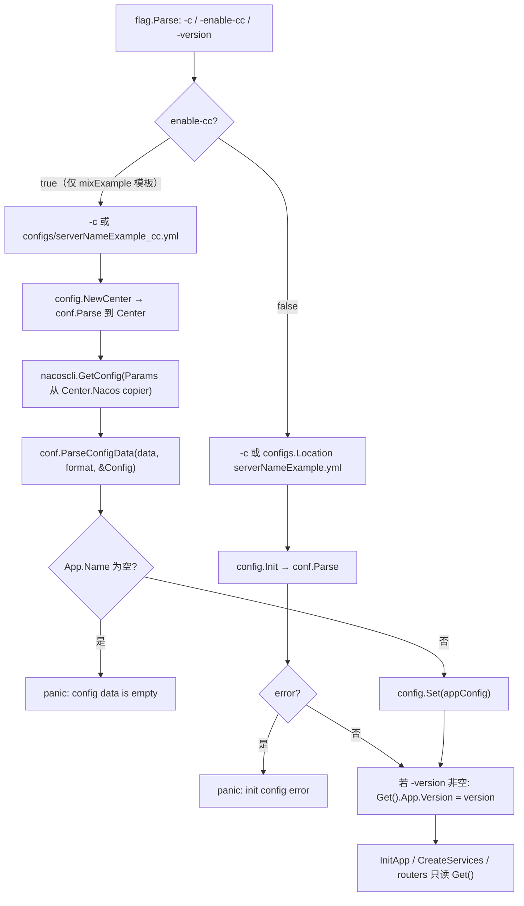
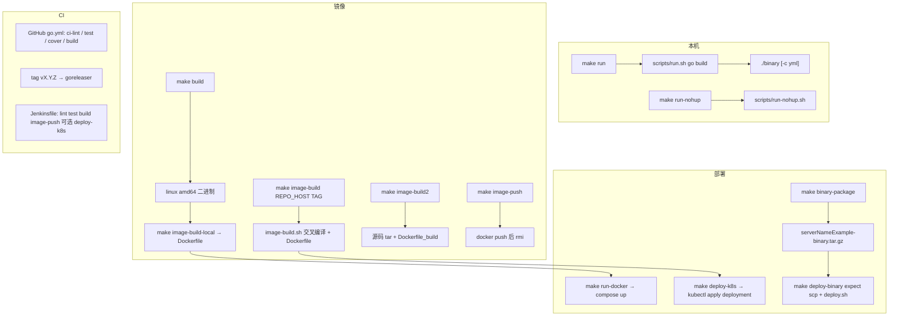

# 配置、错误码、测试、构建与部署

> 状态：待复核生成稿
> 生成日期：2026-08-16
> 基准提交：`23807238c62e0f3b3e2d9a341bbef50547d3f5ec`
> 工作区：dirty（存在与本任务无关的本地改动：`go.mod` / `go.sum` / sqlite 测试库等；本文件为新增文档）
> 源码范围：`pkg/conf/`、`internal/config/`、`configs/`、`internal/ecode/`、`pkg/errcode/`、`Makefile`、`Makefile-for-http`、`scripts/`、`deployments/`、`.github/workflows/`、`test/auto-test/`、`test/server/`、`codecov.yml`、`.golangci.yml`、`Jenkinsfile`
> 生成方式：源码、测试、配置与部署资产静态分析

相关文档：[04-CLI入口命令树与生命周期](04-CLI入口命令树与生命周期.md)（`sponge config`、`make update-config`、模板目录生命周期）、[09-生成项目启动与HTTP请求链](09-生成项目启动与HTTP请求链.md)（`InitApp` 读配置、handler 出口错误码、`/config` `/codes`）、[15-pkg可观测性限流熔断与其余包](15-pkg可观测性限流熔断与其余包.md)（`pkg/conf` / `pkg/errcode` 短索引，本篇展开绑定、分配规则与运维资产）。

## 目录

- [快速摘要](#快速摘要)
- [为什么这样设计（Why）](#为什么这样设计why)
- [它是什么（What）](#它是什么what)
- [代码如何实现（How）](#代码如何实现how)
  - [pkg/conf：YAML/JSON/TOML 解析](#pkgconfyamljsontoml-解析)
  - [internal/config：Init / Get / Set / NewCenter](#internalconfiginit--get--set--newcenter)
  - [configs/ 字段到代码的绑定](#configs-字段到代码的绑定)
  - [配置优先级](#配置优先级)
  - [internal/ecode 与 pkg/errcode](#internalecode-与-pkgerrcode)
  - [错误码分配规则](#错误码分配规则)
  - [Makefile 与 Makefile-for-http](#makefile-与-makefile-for-http)
  - [scripts/ 构建镜像与部署](#scripts-构建镜像与部署)
  - [deployments/ docker-compose kubernetes binary](#deployments-docker-compose-kubernetes-binary)
  - [.github/workflows](#githubworkflows)
  - [codecov.yml、.golangci.yml、Jenkinsfile](#codecovyml-golangciyml-jenkinsfile)
  - [test/auto-test/](#testauto-test)
  - [test/server/ 中间件 compose](#testserver-中间件-compose)
- [构建部署流程图](#构建部署流程图)
- [调用关系表](#调用关系表)
- [测试矩阵](#测试矩阵)
- [阅读源码建议顺序](#阅读源码建议顺序)
- [重新实现检查清单](#重新实现检查清单)

---

## 快速摘要

### 架构总览（模块与依赖）

本篇覆盖**生成项目运行时的配置与错误码**，以及**本仓库作为模板时的构建、CI、自动测试与本地中间件夹具**。依赖方向固定：

```text
进程启动（cmd/*/initial.InitApp，见 09）
  → flag -c / -enable-cc / -version
  → configs.Location 定位 yml
  → config.Init 或 config.NewCenter + nacoscli.GetConfig
      → pkg/conf.Parse / ParseConfigData（viper Unmarshal 到 struct）
  → config.Get() 被 logger / tracer / database / server / routers 读取

业务错误
  → internal/ecode 再导出 pkg/errcode 系统码
  → errcode.HCode / RCode 生成业务码段
  → errcode.NewError / NewRPCStatus 注册全局表（重复 code 会 panic）
  → handler 走 pkg/gin/response；gRPC 走 status.Status；网关走 Responser

构建与发布
  → Makefile target → scripts/*.sh → deployments/{docker-compose,kubernetes,binary}
  → GitHub Actions / Jenkinsfile 调同一套 make
```

`pkg/conf` 和 `pkg/errcode` 是公共库；`internal/config`、`internal/ecode`、`configs/*.yml`、`Makefile`、`scripts/`、`deployments/` 是**被生成项目的模板**。`sponge web http` 会把 `Makefile-for-http` 改名为 `Makefile`，并丢掉 `_cc.yml`（见 [05](05-代码生成器与模板写入.md) 与 [04](04-CLI入口命令树与生命周期.md) 的 `sponge config`）。

`test/server/` 只是本机 docker-compose **测试夹具**，不是生产拓扑。DSN、口令、镜像仓库地址在文档中一律脱敏。

### 核心调用序列（逐步逻辑）

以生成出的 HTTP 服务启动为例（进程骨架见 [09](09-生成项目启动与HTTP请求链.md)）：

1. `cmd/serverNameExample_httpExample/initial/initApp.go:initConfig` 解析 `-c`、`-version`。未传 `-c` 时调用 `configs.Location("serverNameExample.yml")`。
2. `getConfigFromLocal` 调用 `config.Init(configFile)` → `pkg/conf.Parse`：`filepath.Abs` → viper `AddConfigPath` / `SetConfigName` / `SetConfigType` → `ReadInConfig` → `Unmarshal` 到包级 `*Config`。
3. 若是 mix 模板且带 `-enable-cc`：改走 `config.NewCenter` 读 `serverNameExample_cc.yml`，`nacoscli.GetConfig` 拉远端 YAML，`conf.ParseConfigData` + `config.Set`，**不再读本地业务 yml**。
4. `-version` 非空则覆盖 `config.Get().App.Version`。
5. `InitApp` 用 `cfg.Logger` 初始化日志，`logger.Debug(config.Show())` 打印脱敏 JSON；按开关初始化 tracer / stat / DB / cache。
6. `CreateServices` 读 `HTTP.Port`、`App.Env`、`HTTP.TLS`；mix 再读 `App.RegistryDiscoveryType` 决定 consul/etcd/nacos。
7. 非 prod 路由挂 `GET /config` → `errcode.ShowConfig([]byte(config.Show()))`；`GET /codes` → `handlerfunc.ListCodes` → `errcode.ListHTTPErrCodes()`。
8. handler 失败走 `ecode.InvalidParams`（系统码 100001）或 `ecode.ErrCreateUserExample`（`HCode(1)+1=200101`），由 `pkg/gin/response` 写成 `{code,msg,data}`。

构建侧最短路径：`make run` → `scripts/run.sh` `go build` 本机二进制并 `-c` 启动；`make image-build REPO_HOST=...` → `scripts/image-build.sh` 交叉编译并 `docker build`；`make deploy-k8s` → `kubectl apply` `deployments/kubernetes/*-deployment.yml`。

### 易错点与边界条件

- `config.Get()` 在未 `Init`/`Set` 时 **panic**（文案 `please call config.Init() first`）。`Set(nil)` 后同样 panic。测试用 `recover` 覆盖。
- `pkg/conf` 使用 **全局 viper 单例**，并发 `Parse` 会互相覆盖；未调用 `AutomaticEnv`，环境变量不能覆盖 YAML。
- YAML 里注释掉的 `logger.logFileConfig` **没有**对应 Go 字段；`InitApp` 里 `WithFileName(cfg.Logger.LogFileConfig...)` 也是注释。改 YAML 后必须 `make update-config`（`sponge config --server-dir=.`）才会进 struct。
- `database.InitDB` 默认 switch **不含 mongodb**；Mongo 要 `make patch TYPE=mongodb`。driver 非法会 panic 并指向仓库 yml 行号（该行号会随模板漂移）。
- HTTP 业务错误默认 HTTP **200** + `body.code≠0`；只有 `ErrToHTTP` / `InternalServerError` / `ServiceUnavailable` 才改 HTTP 状态。细节见 [09](09-生成项目启动与HTTP请求链.md) 与 [15](15-pkg可观测性限流熔断与其余包.md)。
- `HCode`/`RCode` 注释写「0 to 1000」，实现是 **1~999**，越界 panic。重复 `NewError(code)` 也 panic。
- 本仓库 `make run` 编的是 `serverNameExample_mixExample`，`run-nohup.sh` 却找 `cmd/serverNameExample`；`image-build.sh` 复制 `configs/serverNameExample_mixExample.yml`，实际文件名是 `serverNameExample.yml`。这是**模板占位符在本仓库未替换**的差异，生成项目里名字会被 replacer 对齐。
- `Makefile-for-http` 的 `run-nohup` 把 `Config` 当作 `$1` 传给脚本，而脚本 `$1` 必须是 `start|stop|...`。HTTP 生成项目里 `make run-nohup Config=...` 会落到 usage。
- `test/auto-test` 的 curl **只断言 curl 退出码**，不断言 `body.code==0`。DSN 指向夹具主机，不是生产。
- `Jenkinsfile` 第一阶段拒绝 `origin/staging`，但 Deploy 阶段 `when` 写了 `origin/staging`，该分支到不了部署。
- 本篇未运行测试套件；结论来自静态阅读。工作区 dirty，以基准提交为准。基准提交含 `scripts/build/Dockerfile*`，当前工作区可能因忽略规则看不到这些文件。

---

## 为什么这样设计（Why）

生成项目要在「本地文件 / Nacos 配置中心 / K8s ConfigMap」三种来源之间切换，但不能让业务代码直接依赖 viper。所以解析被收进 `pkg/conf`，类型被收进 `internal/config`：改 YAML 字段后用 `sponge config` 重新生成 struct，而不是手写绑定。

错误码要同时服务 Gin JSON 和 gRPC `status.Code`。系统码全局唯一、业务码按「模块号 × 100 + 序号」分段，是为了多表生成时不会撞码：每张表占一个 `HCode(n)` / `RCode(n)` 百段，重复注册直接 panic，而不是上线后互相覆盖。

Makefile 与 `scripts/` 把「本机跑、打二进制、打镜像、推仓库、上 K8s」收成同一套 target，GitHub Actions 和 Jenkins 只调用 `make`，避免两套脚本分叉。`test/server` 提供可一键拉起的中间件，让 auto-test 和 `pkg/*` 示例文档有固定地址可连；它们不是生产清单。

---

## 它是什么（What）

| 资产 | 角色 |
|---|---|
| `pkg/conf/parse.go` | 把 yaml/json/toml 文件或字节 Unmarshal 到任意 struct；可选 fsnotify 热更新；`Show` 脱敏打印 |
| `internal/config/serverNameExample.go` | 包级单例 `*Config`：`Init` / `Get` / `Set` / `Show` |
| `internal/config/serverNameExample_cc.go` | Nacos 连接参数 `Center`，`NewCenter` |
| `configs/serverNameExample.yml` | 业务配置模板（HTTP/gRPC/DB/Redis/logger/jaeger/registry） |
| `configs/serverNameExample_cc.yml` | 配置中心连接模板 |
| `configs/location.go` | 用 `runtime.Caller` 定位 `configs/` 绝对路径 |
| `pkg/errcode/` | HTTP `Error`、RPC `RPCStatus`、系统码、`HCode`/`RCode`、`Responser`、`ShowConfig` |
| `internal/ecode/` | 对生成项目再导出系统码 + `userExample` 业务码（含 `.tpl` / `.exp` 变体） |
| `Makefile` | mix/gRPC 生成项目的全量 target |
| `Makefile-for-http` | `sponge web http` 写出的精简 Makefile |
| `scripts/` | run / 镜像 / 部署 / proto / patch / swag |
| `deployments/` | docker-compose、K8s、二进制发布目录模板 |
| `.github/workflows` | lint + test + coverage + build；打 tag 走 goreleaser |
| `codecov.yml` `.golangci.yml` `Jenkinsfile` | 覆盖率门槛、lint 规则、Jenkins 流水线模板 |
| `test/auto-test/` | 生成 7 类可请求服务 + 22 类编译启动用例 |
| `test/server/` | 本地中间件 compose（测试夹具） |

---

## 代码如何实现（How）

### pkg/conf：YAML/JSON/TOML 解析

**路径**：`pkg/conf/parse.go`。测试：`parse_test.go`，夹具 `test.yml`。

公开函数：

| 符号 | 输入 | 行为 |
|---|---|---|
| `Parse(configFile, obj, reloads...)` | 文件路径、非 nil 指针、可选 reload 回调 | 读文件 Unmarshal；有 reloads 则 `WatchConfig` |
| `ParseConfigData(data, format, obj)` | 字节、`"yaml"`/`"json"`/`"toml"` | `viper.ReadConfig` + `Unmarshal`；配置中心路径用这个 |
| `Show(obj, fields...)` | 任意对象 | `json.MarshalIndent` 后按行脱敏 |

`Parse` 步骤：

1. `reflect` 检查 `obj` 必须是非 nil 指针，否则 `obj must be a non-nil pointer`。
2. `filepath.Abs(configFile)`。
3. 拆目录与文件名。扩展名（去掉点）交给 `SetConfigType`。
4. **toml 不去掉后缀当 ConfigName**；其它格式会 `ReplaceAll("."+ext, "")` 去掉后缀。因此 `app.yml` 的 ConfigName 是 `app`，`app.toml` 的 ConfigName 仍是 `app.toml`。
5. `ReadInConfig` 失败或 `Unmarshal` 失败原样返回 error，**不 panic**。
6. `len(reloads)>0` 时 `watchConfig`：`viper.WatchConfig` + `OnConfigChange`。变更时先把 `obj` 反射重置为零值再 Unmarshal；成功才依次调用 reload。Unmarshal 失败只 `fmt.Println`，不调 reload。注释写明 Windows 上回调可能触发两次。

`Show` 脱敏规则（必须保持的行为契约）：

- 每行都会把 `"dsn"`、`"password"`、`"pwd"` 追加进隐藏字段列表（调用方再传入的字段名也会生效）。
- 行内同时含 `@` 和 `:` 时走 `replaceDSN`：把第一个 `:` 到第一个 `@` 之间替换成 `******`。
- 否则把匹配字段名后面的值改成 `"******"`。

脱敏示例（对应 `pkg/conf/test.yml` / `configs/serverNameExample.yml` 的形态，**不是**真实凭据）：

```json
"dsn": "root:******@(192.168.x.x:3306)/account?parseTime=true",
"password": "******"
```

`replaceDSN("default:<pass>@192.168.x.x:6379/0")` → `default:******@192.168.x.x:6379/0`。没有 `@` 的串（测试里用多个 `:` 而无 `@` 的地址）原样返回。

测试覆盖：`TestParse` 会改写再恢复 `test.yml` 以触发 watch；`TestParseErr` 覆盖 nil 指针与文件不存在；`TestParseConfigData` 读同一份 yaml。`TestShow` 对 `chan` 走 Marshal 失败分支（返回空串）。

### internal/config：Init / Get / Set / NewCenter

三个文件，全部带 `Code generated by sponge; DO NOT EDIT.`。改 YAML 后应 `make update-config`，不要手改 struct。

`serverNameExample.go`：

```text
var config *Config

Init(file, fs...)  →  config = &Config{}; conf.Parse(file, config, fs...)
Show(hidden...)    →  conf.Show(config, hidden...)
Get()              →  nil 则 panic；否则返回单例
Set(*Config)       →  测试或配置中心写入
```

`Init` 把可选 `fs ...func()` **原样传给** `conf.Parse` 的 `reloads`。本仓库各 `initApp.go` **都没有**传 reload 回调，因此生成项目默认**不热更新**。若要热更新，调用方必须自己传「关库再连」一类函数。

`serverNameExample_cc.go` 只有 `NewCenter(configFile) (*Center, error)`：解析 Nacos 连接块，**不**写入包级 `config`。真正的业务配置要等 `nacoscli.GetConfig` 之后 `ParseConfigData` + `Set`。

`configs/location.go`：`init` 用 `runtime.Caller(0)` 记下本文件所在目录。`Location(rel)`：绝对路径原样返回，相对路径 `Join(basePath, rel)`。`Path` 是 `Location` 的别名。单元测试和生成项目默认 `-c` 都走这里，不依赖进程 cwd。

`serverNameExample_test.go`：

- `TestInit`：`configs.Path("serverNameExample.yml")` → `Init` → `Get` 非 nil → `Show` 非空 → `Set(nil)` 后 `Get` 应 panic。
- `TestInitNacos`：对 `_cc.yml` 调 `NewCenter`，文件存在则无 error。

`sponge config`（`cmd/sponge/commands/generate/config.go`，命令树见 [04](04-CLI入口命令树与生命周期.md)）扫描 `configs/*.yml|yaml`，文件名含 `cc.yml` / `cc.yaml` 的生成 `Center` 头（`configFileCcCode`），其余生成 `Config` 头（`configFileCode`）再拼 `pkg/jy2struct` 产出的字段。`yml` 与 `yaml` 不能混用。输出覆盖 `internal/config/<原文件名>.go`。

### configs/ 字段到代码的绑定

源文件：`configs/serverNameExample.yml`。下面只写**会被 Unmarshal 进 `config.Config` 并被运行时代码读取**的字段。DSN 一律脱敏。

#### 脱敏后的最小 YAML 形态

```yaml
app:
  name: "serverNameExample"
  env: "dev"
  version: "v0.0.0"
  host: "127.0.0.1"
  enableStat: true
  enableMetrics: true
  enableHTTPProfile: false
  enableLimit: false
  enableCircuitBreaker: false
  enableTrace: false
  tracingSamplingRate: 1.0
  registryDiscoveryType: ""    # consul | etcd | nacos | 空
  cacheType: ""                # memory | redis | 空
http:
  port: 8080
  timeout: 0
  tls: { enableMode: "", domain: "", email: "", certFile: "", keyFile: "" }
grpc:
  port: 8282
  httpPort: 8283
  enableToken: false
  serverSecure: { type: "", caFile: "", certFile: "", keyFile: "" }
grpcClient:
  - name: "serverNameExample"
    host: "127.0.0.1"
    port: 8282
    timeout: 0
    registryDiscoveryType: ""
    clientSecure: { type: "", serverName: "", caFile: "", certFile: "", keyFile: "" }
    clientToken: { enable: false, appID: "", appKey: "" }
logger:
  level: "info"
  format: "console"
  isSave: false
database:
  driver: "mysql"
  mysql:
    dsn: "root:******@(192.168.x.x:3306)/account?parseTime=true&loc=Local&charset=utf8mb4"
    enableLog: true
    maxIdleConns: 10
    maxOpenConns: 100
    connMaxLifetime: 10
  postgresql:
    dsn: "root:******@192.168.x.x:5432/account?sslmode=disable"
  sqlite:
    dbFile: "test/sql/sqlite/sponge.db"
  mongodb:
    dsn: "root:******@192.168.x.x:27017/account?connectTimeoutMS=15000"
redis:
  dsn: "default:******@192.168.x.x:6379/0"
  dialTimeout: 10
  readTimeout: 2
  writeTimeout: 2
jaeger:
  agentHost: "192.168.x.x"
  agentPort: 6831
consul:
  addr: "192.168.x.x:8500"
etcd:
  addrs: ["192.168.x.x:2379"]
nacosRd:
  ipAddr: "192.168.x.x"
  port: 8848
  namespaceID: "<namespace-id>"
```

`serverNameExample_cc.yml`（只给 `-enable-cc`）：

```yaml
nacos:
  ipAddr: "192.168.x.x"
  port: 8848
  scheme: "http"
  contextPath: "/nacos"
  namespaceID: "<namespace-id>"
  group: "dev"
  dataID: "serverNameExample.yml"
  format: "yaml"
```

#### 字段 → 初始化代码

| YAML 字段 | Go 字段 | 读取位置 | 行为 |
|---|---|---|---|
| `app.name` | `App.Name` | `logger` 打印字段、`tracer.InitWithConfig`、注册中心 service name、`middleware.Tracing` | 服务名 |
| `app.env` | `App.Env` | `CreateServices` `WithHTTPIsProd(env=="prod")`；`routers.NewRouter`：非 `prod` 才挂 `/config` 与 swagger | `"prod"` 关闭配置泄露与 swagger |
| `app.version` | `App.Version` | tracer；可被 `-version` 覆盖 | 版本号 |
| `app.host` | `App.Host` | mix `registerService` 拼 endpoint | 注册用地址，不是 listen 地址 |
| `app.enableStat` | `App.EnableStat` | `InitApp` → `stat.Init` | 进程资源打印 |
| `app.enableMetrics` | `App.EnableMetrics` | HTTP `metrics.Metrics`；gRPC interceptor；rpcclient | 指标 |
| `app.enableHTTPProfile` | `App.EnableHTTPProfile` | `prof.Register`；注释要求此时 `http.timeout` 为 0 或 >60s | pprof |
| `app.enableLimit` | `App.EnableLimit` | HTTP/gRPC 限流中间件 | 自适应限流 |
| `app.enableCircuitBreaker` | `App.EnableCircuitBreaker` | HTTP/gRPC 熔断；rpcclient | 熔断 |
| `app.enableTrace` | `App.EnableTrace` | `tracer.InitWithConfig`；DB/Redis/中间件/rpcclient | 为 true 时必须配 jaeger |
| `app.tracingSamplingRate` | `App.TracingSamplingRate` | `tracer.InitWithConfig` 最后一个参数 | 0~1 |
| `app.registryDiscoveryType` | `App.RegistryDiscoveryType` | mix `registerService` switch `consul`/`etcd`/`nacos` | 空则不注册 |
| `app.cacheType` | `App.CacheType` | `database.InitCache`；`close.go` 关 Redis | 空则无缓存 |
| `http.port` | `HTTP.Port` | `CreateServices` listen `":"+port` | HTTP 监听 |
| `http.timeout` | `HTTP.Timeout` | `>0` 才挂 `middleware.Timeout` | 秒 |
| `http.tls.*` | `HTTP.TLS` | `server.WithHTTPTLS` | `enableMode`：`self-signed` / `encrypt` / `external` / 空 |
| `grpc.port` | `Grpc.Port` | gRPC listen | 8282 |
| `grpc.httpPort` | `Grpc.HTTPPort` | gRPC 侧 metrics/pprof/codes HTTP | 8283 |
| `grpc.enableToken` | `Grpc.EnableToken` | gRPC interceptor；注释默认 appID=`grpc` appKey 见源码注释，此处不复述 | token 开关 |
| `grpc.serverSecure` | `Grpc.ServerSecure` | `internal/server/grpc.go`：`""` / `one-way` / `two-way` | TLS |
| `grpcClient[]` | `[]GrpcClient` | `internal/rpcclient/serverNameExample.go` 按 `Name` 匹配 | 找不到 Name 则 panic |
| `grpcClient[].host/port` | 同上 | 直连 endpoint | 未开发现时使用 |
| `grpcClient[].timeout` | 同上 | unary timeout | 秒，0 表示不设 |
| `grpcClient[].registryDiscoveryType` | 同上 | 发现逻辑在源码里被注释掉，默认直连 | 模板预留 |
| `grpcClient[].clientSecure/clientToken` | 同上 | `grpccli.WithSecure` / `WithToken` | 客户端认证 |
| `logger.level/format/isSave` | `Logger` | `logger.Init` | 默认注释写 level 缺省 debug，YAML 示例是 `info` |
| `database.driver` | `Database.Driver` | `InitDB` switch mysql/tidb/postgresql/sqlite | 非法 panic |
| `database.mysql.dsn` 等 | `Mysql` | `InitMysql` → `utils.AdaptiveMysqlDsn` → `mysql.Init` | 读写分离 `SlavesDsn`/`MastersDsn` 在源码里被注释 |
| `database.postgresql.*` | `Postgresql` | `InitPostgresql` | |
| `database.sqlite.*` | `Sqlite` | `InitSqlite`；Windows 路径分隔符见 YAML 注释 | |
| `database.mongodb.dsn` | `Mongodb` | **默认 InitDB 不走 Mongo**；`make patch TYPE=mongodb` 后才有 | |
| `redis.dsn` 与超时 | `Redis` | `InitRedis` → `goredis.Init`；`EnableTrace` 时加 tracing | cacheType=`redis` 才连 |
| `jaeger.agentHost/agentPort` | `Jaeger` | `tracer.InitWithConfig` | 仅 `enableTrace=true` |
| `consul.addr` | `Consul.Addr` | `consul.NewRegistry` | 仅 registry=`consul` |
| `etcd.addrs` | `Etcd.Addrs` | `etcd.NewRegistry` | 仅 registry=`etcd` |
| `nacosRd.*` | `NacosRd` | `nacos.NewRegistry` | 服务发现，**不是**配置中心 |
| `_cc.yml` 的 `nacos.*` | `config.Nacos` / `Center` | `nacoscli.GetConfig` | 配置中心 |

`InitApp` 里 logger 文件滚动相关调用全部注释，与 YAML 里被注释的 `logFileConfig` 一致。

HTTP 路由对配置开关的消费见 `internal/routers/routers.go`（pb 变体 `routers_pbExample.go` 同构）：Timeout、Metrics、Limit、CircuitBreaker（额外把 `InternalServerError`/`ServiceUnavailable` 当作熔断码）、Tracing、HTTPProfile、`/config`。

gRPC 侧 `internal/server/grpc.go:addHTTPRouter` **无 env 判断** 即挂 `/codes`（`ListGRPCErrCodes`）和 `/config`（`ShowConfig`），与 HTTP 非 prod 才暴露 `/config` 不同。

### 配置优先级

从高到低，后写覆盖前写。这是运行时代码的真实顺序，不是 viper 默认优先级（因为没开 `AutomaticEnv`、没 `SetDefault`）。



规则：

1. **配置中心与本地文件互斥**。`-enable-cc` 为 true 时完全以 Nacos 内容为准，本地 `serverNameExample.yml` 不参与。
2. **`-c` 覆盖默认路径**。默认路径由 `configs.Location` 钉在编译期的 `configs/` 目录，不随 cwd 变。
3. **`-version` 只覆盖 `App.Version`**，在 Init/Set 之后执行。
4. **没有环境变量层**。`pkg/conf` 未调用 `viper.AutomaticEnv`。K8s 用 ConfigMap 挂载 YAML 文件，而不是把字段拆成 env。
5. **热更新不是默认行为**。只有 `Init(..., reloadFn)` 才 `WatchConfig`；配置中心路径用 `ParseConfigData`，本身不 watch 文件。
6. **struct 缺字段则 YAML 多余键被忽略**（viper Unmarshal 默认行为）。注释掉的 `logFileConfig`、未生成的 Mongo Init 都属于「YAML 有、运行时不消费」。
7. **生成期裁剪**：`sponge web http` / `http-pb` / 多数 rpc 命令把 `configs/serverNameExample_cc.yml` 列入 ignore，因此纯 HTTP 生成项目没有 `-enable-cc`。只有 mix 模板保留配置中心入口。
8. **镜像/K8s 启动命令**默认 `./serverNameExample -c /app/configs/serverNameExample.yml`。Dockerfile 注释了 `-enable-cc` 变体，要手动改 CMD。

必须保持的契约：未 Init 就 Get 必须 panic；配置中心返回空 Name 必须 panic。可替换的实现：viper 可换成其它 YAML 库，只要 Unmarshal 到同一 struct 标签。

### internal/ecode 与 pkg/errcode

`internal/ecode` 是生成项目的门面，handler/service 只 import 它。数值与算法在 `pkg/errcode`。

| 文件 | 内容 |
|---|---|
| `systemCode_http.go` | 再导出 HTTP 系统码 + `SkipResponse` + `GetErrorCode` |
| `systemCode_rpc.go` | 再导出 RPC 系统码 + `Any` + `StatusSkipResponse` + `GetStatusCode` |
| `userExample_http.go` | `userExampleNO=1`，`HCode(1)+1..+5` → 200101–200105 |
| `userExample_http.go.exp` | 扩展 API：NO=78，+1..+9（含 DeleteByIDs / GetByCondition / ListByIDs / ListByLastID） |
| `userExample_http.go.tpl` / `.exp.tpl` | 生成器用的 Go template，`NO` 仍从 1 起，后续 `sponge patch modify-dup-num` 改号 |
| `userExample_rpc.go` | `_userExampleNO=2`，`RCode(2)+1..+5` → 400201–400205 |
| `userExample_rpc.go.exp` | NO=37，+1..+9 |

HTTP 系统码实际取值（`http_system_code.go`；注释写「10000~20000」与实现不符，以字面量为准）：

| 符号 | code | `ToHTTPCode` |
|---|---|---|
| `Success` | 0 | 200 |
| `InvalidParams` | 100001 | 400 |
| `Unauthorized` | 100002 | 401 |
| `InternalServerError` | 100003 | 500 |
| `NotFound` | 100004 | 404 |
| `AlreadyExists`（Deprecated） | 100005 | 500（未单独映射，落默认） |
| `Timeout` | 100006 | 408 |
| `TooManyRequests` | 100007 | 429 |
| `Forbidden` | 100008 | 403 |
| `LimitExceed` | 100009 | 429 |
| `DeadlineExceeded` | 100010 | 408 |
| `AccessDenied` | 100011 | 403 |
| `MethodNotAllowed` | 100012 | 405 |
| `ServiceUnavailable` | 100013 | 503 |
| `Canceled` | 100014 | 500 |
| `Unknown` | 100015 | 500 |
| `PermissionDenied` | 100016 | 401 |
| `ResourceExhausted` | 100017 | 500 |
| `FailedPrecondition` | 100018 | 500 |
| `Aborted` | 100019 | 500 |
| `OutOfRange` | 100020 | 500 |
| `Unimplemented` | 100021 | 501 |
| `DataLoss` | 100022 | 500 |
| `StatusBadGateway` | 100023 | 502 |
| `Conflict` | 100409 | 409 |
| `TooEarly` | 100425 | 425 |

未列出的业务码 `ToHTTPCode` 一律 500。这就是「`response.Error` 用业务码时 HTTP 仍 200，但 `ErrToHTTP`/`Output(ToHTTPCode)` 时业务码会变成 500」的根因。详见 [09](09-生成项目启动与HTTP请求链.md) 与 [15](15-pkg可观测性限流熔断与其余包.md) 的 Responser。

RPC 系统码（`rpc_system_code.go`，注释 30000~40000，实际六位）：`StatusSuccess=0`，`StatusCanceled=300001` … `StatusConflict=300023`。`NewRPCStatus` 的 code 类型是 `codes.Code`。`ToRPCCode` 把自定义 30000x 映射到标准 `codes.InvalidArgument` / `Internal` / `Unauthenticated` 等。

`ShowConfig`（`rpc_error.go`）：返回 `http.HandlerFunc`，`WriteHeader(200)` 后原样写入传入的 `[]byte`。HTTP 侧传入的是 `config.Show()` 的脱敏 JSON；**未设 Content-Type**（赋值被注释）。gRPC 侧 mux 同样挂这条。

`NewError` / `NewRPCStatus` 把 code 写入包级 map。重复 code **panic**，并打印已有 msg 与新 msg。这是生成多张表时必须先 `modify-dup-num` 的原因。`swag-docs.sh` 在 `swag init` 之后会跑：

```text
sponge patch modify-dup-num --dir=internal/ecode
sponge patch modify-dup-err-code --dir=internal/ecode
```

`pkg/errcode` 测试：`http_error_test.go`（重复 NewError panic、HCode(1001) panic、ParseError、i18n）、`rpc_error_test.go`（重复 NewRPCStatus、ToRPCCode、ShowConfig/ListGRPCErrCodes HTTP）、`response_test.go`（`NewResponser(isFromRPC)` 下 HTTP 200 vs 标准状态码矩阵）。

### 错误码分配规则

官方 README（`pkg/errcode/README.md`）与代码一致的部分如下。README 有一处笔误把第 4 位写成「grpc system-level」，应以代码为准：4 是 **gRPC 业务码**。

**六位十进制结构**（例 `200101`）：

| 首位 | 中三位（模块号） | 末两位 |
|---|---|---|
| `1` HTTP 系统 | 未用分段，直接字面量 | 字面量 |
| `2` HTTP 业务 | `HCode(num)` 的 num，1~999 | 自定义 1~99 |
| `3` gRPC 系统 | 字面量 300001–300023 | 字面量 |
| `4` gRPC 业务 | `RCode(num)` 的 num，1~999 | 自定义 1~99 |

**公式**：

```text
HTTP 业务基址 = 200000 + num * 100     // HCode(num)
RPC  业务基址 = 400000 + num * 100     // RCode(num)，类型 codes.Code

userExample HTTP：num=1 → 200100，Create=+1 → 200101
userExample RPC ：num=2 → 400200，Create=+1 → 400201
```

**范围表**：

| 类型 | 系统码 | 业务码 |
|---|---|---|
| HTTP | 100000–200000（实现从 100001 起，另有 100409/100425） | 200000–300000 |
| gRPC | 300000–400000（实现 300001–300023） | 400000–500000 |

**分配纪律（必须保持）**：

1. 每张表/每个 protobuf service 占用一个 `num`。模板 HTTP 从 1 起，RPC 从 2 起，避免与系统码和彼此冲突。
2. 同一 `num` 下方法序号 +1、+2、… 追加，注释要求「globally unique, adding 1 to the previous error code」。
3. `num` 必须 ∈ [1,999]，否则 `HCode`/`RCode` panic（英文文案分别写 “0 to 1000” / “NO range”，与判断条件不一致）。
4. 进程内同一 code 第二次 `NewError`/`NewRPCStatus` panic。多文件生成后靠 `modify-dup-num` 改 NO。
5. `.exp` 把 HTTP NO 改成 78、RPC NO 改成 37，是为扩展 API 预留与基础 CRUD 错开；生成时由文件变体选择，不是运行期切换。

可替换：业务码不必用 6 位十进制，但要保持「系统/业务分空间、重复注册失败、HTTP 与 RPC 两套对象」。

### Makefile 与 Makefile-for-http

`PKG_LIST = go list ... | grep -v /vendor/ | grep -v /api/ | grep -v /cmd/`。`test`/`cover` 都不测 `cmd/` 与生成的 pb。

#### Makefile（本仓库 / mix / gRPC 模板）主要 target

| target | 做什么 |
|---|---|
| `install` | `go install` protoc 插件、swag、golangci-lint、go-callvis、pkgsite（`delete the templates code` 包围，纯 HTTP 生成时会删） |
| `ci-lint` | `gofmt -s -w .` 然后 `golangci-lint run ./...` |
| `test` | `go test -count=1 -short ${PKG_LIST}` |
| `cover` | `-coverprofile=cover.out -covermode=atomic` 再 `go tool cover -html` |
| `graph` | 把 mix `main.go` 拷到仓库根，`go-callvis` 出 svg，再删 |
| `docs` | `scripts/swag-docs.sh`（SQL HTTP） |
| `proto` | `scripts/protoc.sh $(FILES)` + `go mod tidy` + gofmt |
| `proto-doc` | `scripts/proto-doc.sh` → `docs/apis.html` |
| `build` | `CGO_ENABLED=0 GOOS=linux GOARCH=amd64` 编 `cmd/serverNameExample_mixExample` |
| `build-sponge` | 同样交叉编译 `cmd/sponge`，`-ldflags all=-s -w` |
| `image-build-sponge` | `cmd/sponge/scripts/build-sponge-image.sh $(TAG)` |
| `run` | `scripts/run.sh $(Config)` |
| `run-nohup` | `scripts/run-nohup.sh $(CMD) $(Config)`，`CMD ?= start` |
| `run-docker` | 依赖 `image-build-local`，再 `deploy-docker.sh` |
| `binary-package` | 依赖 `build`，`scripts/binary-package.sh` |
| `deploy-binary` | `expect scripts/deploy-binary.sh $(USER) $(PWD) $(IP)` |
| `image-build-local` | 依赖 `build`，本地 tag=`latest` |
| `image-build` / `image-build2` | **必须** `REPO_HOST`，否则 exit 1 |
| `image-push` | 必须 `REPO_HOST` |
| `deploy-k8s` | `scripts/deploy-k8s.sh` |
| `image-build-rpc-test` | `image-rpc-test.sh`，镜像名带 `.rpc-test` |
| `patch` | `scripts/patch.sh $(TYPE)`：mysql/mongodb/postgresql/sqlite/types-pb |
| `copy-proto` | `sponge patch copy-proto` |
| `modify-proto-pkg-name` | `sponge patch modify-proto-package` |
| `update-config` | `sponge config --server-dir=.` |
| `clean` | 删 mix 二进制、cover.out、`*.go.gen*`、`serverNameExample-binary.tar.gz` |
| `help` | awk 抽 `#` 注释当帮助 |
| `.DEFAULT_GOAL` | `all`，但未定义 `all` 目标（`make` 无参会失败） |

#### Makefile-for-http 相对差异

`sponge web http` 把该文件改名为 `Makefile`。**没有**：`install`、`proto`、`proto-doc`、`patch`、`copy-proto`、`modify-proto-pkg-name`、`build-sponge`、`image-build-sponge`、`image-build-rpc-test`。保留 `docs`（swag）。

`run-nohup` 写成 `bash scripts/run-nohup.sh $(Config) $(CMD)`，与脚本「第一参数是动作」的契约相反。生成 HTTP 项目后应使用 `make run-nohup CMD=start Config=...` 仍可能把 Config 放到 `$1`。这是模板缺陷。

### scripts/ 构建镜像与部署

脚本里的 `serverNameExample_mixExample` / `project-name-example/server-name-example` 是占位符，生成时替换。

| 脚本 | 调用方 | 行为 |
|---|---|---|
| `run.sh` | `make run` | 删旧二进制，`go build -o cmd/<mix>/<mix> cmd/<mix>/main.go`；有配置文件则 `./bin -c`，否则无 `-c`；SIGINT 直接 exit 0 |
| `run-nohup.sh` | `make run-nohup` | `start\|stop\|restart\|status`；start 时 `go build` + `nohup >> <name>.log`；已运行则 return 1；最多查 5 次 pid；**kill -9** |
| `parseYaml.sh` | `swag-docs.sh` | awk 按缩进取 `.http.port` 这类路径，去引号和行尾注释 |
| `swag-docs.sh` | `make docs` | tidy + gofmt；从 **mix yml** 读 host/port/tls 同步 `main.go` 的 `@host`；`swag init`；dup-num patch；`sponge web swagger` 转 OpenAPI3 |
| `protoc.sh` | `make proto` | 扫 `api/**/*.proto` 或 `FILES=` 列表；调 protoc 插件；删无用 import；Darwin/Linux `sed -i` 分叉 |
| `proto-doc.sh` | `make proto-doc` | `protoc --doc_out` html → `docs/apis.html` |
| `patch.sh` | `make patch` | 转调 `sponge patch gen-db-init` / `gen-types-pb` |
| `patch-mono.sh` | 单仓生成后 | 若上级无 `go.mod` 则 copy；非 http 则 copy `third_party`；grpc 则 gen-types-pb |
| `binary-package.sh` | `make binary-package` | 打包 `deployments/binary/{run,deploy}.sh`、mix 二进制、两份 yml 为 `serverNameExample-binary.tar.gz` |
| `deploy-binary.sh` | expect | scp tar 到远端 `/tmp`，ssh 解压后跑 `deploy.sh`（明文密码参数，仅模板） |
| `image-build-local.sh` | `make image-build-local` | 已编译二进制移到 `scripts/build/`，拷 yml，编 grpc_health_probe，`docker build -t IMAGE:latest`，清临时文件与 dangling `<none>` |
| `image-build.sh` | `make image-build` | 交叉编译 linux/amd64，拷 yml + health probe，`IMAGE=REPO_HOST/IMAGE_NAME:TAG`（TAG 默认 latest） |
| `image-build2.sh` | `make image-build2` | 把当前目录 `tar zcf` 进 `scripts/build`，用 `Dockerfile_build` 两阶段构建 |
| `image-push.sh` | `make image-push` | 检查 `/root/.docker/config.json` 是否含字面量 `image-repo-host`（**占位符，未替换会失败**），`docker push` 后 `rmi -f` |
| `image-rpc-test.sh` | `make image-build-rpc-test` | 同源 tar + `Dockerfile_test`，镜像名加 `.rpc-test` |
| `deploy-docker.sh` | `make run-docker` | 把 `configs/serverNameExample.yml` 拷到 `deployments/docker-compose/configs/`（已存在则不覆盖），`docker-compose down` 再 `up -d` |
| `deploy-k8s.sh` | `make deploy-k8s` | `kubectl version`；`delete -f deployment.yml --ignore-not-found`；`apply -f` **只 apply deployment 一个文件**，不自动 apply namespace/svc/configmap |

`scripts/build/`（基准提交存在）：

| 文件 | 用途 |
|---|---|
| `Dockerfile` | 复制已编译二进制 + configs；HTTP 加 curl，gRPC 加 `grpc_health_probe`；`CMD ["./serverNameExample", "-c", "configs/serverNameExample.yml"]` |
| `Dockerfile_build` | `golang:1.23-alpine` 编译阶段 + alpine 运行阶段；`GOPROXY=goproxy.cn` |
| `Dockerfile_test` | 解压源码 `go mod download` 后 `sleep 86400`，给 RPC 方法测试用容器 |
| `README.md` | 三份 Dockerfile 的一句话区别 |

生成器在 `cmd/sponge/commands/generate/template.go` 用 `dockerFileHTTPCode` / `dockerFileGrpcCode` 等替换 `# todo generate dockerfile...` 标记，HTTP 镜像不装 health probe、gRPC 镜像不装 curl。

`cmd/sponge/scripts/`：给 **sponge CLI 镜像**，不是业务服务。`build-sponge-image.sh` 从 GitHub Release 拉 linux zip 与 tag 源码，打成 `zhufuyi/sponge:$TAG`，入口 `sponge run`（见 [04](04-CLI入口命令树与生命周期.md) 的 UI）。

### deployments/ docker-compose kubernetes binary

#### docker-compose

`deployments/docker-compose/docker-compose.yml`：单服务 `server-name-example`，镜像 `project-name-example/server-name-example:latest`，`command: ["./serverNameExample", "-c", "/app/configs/serverNameExample.yml"]`，挂 `$PWD/configs` 与主机时区。模板同时暴露 8080/8282/8283；healthcheck 默认 curl `/health`，gRPC 探针被注释。`restart: always`。README 要求先把 yml 放到 `configs/`。

#### kubernetes

| 文件 | 内容 |
|---|---|
| `projectNameExample-namespace.yml` | Namespace `project-name-example` |
| `serverNameExample-configmap.yml` | ConfigMap `server-name-example-config`，`data.serverNameExample.yml` 体是标记，生成时注入 YAML |
| `serverNameExample-deployment.yml` | Deployment 1 replica；镜像 `repo-addr-example/...:latest`；requests 10m/10Mi，limits 1000m/1000Mi；挂 ConfigMap 到 `/app/configs/`；readiness/liveness 默认 HTTP `/health`；`imagePullSecrets: docker-auth-secret` |
| `serverNameExample-svc.yml` | ClusterIP，端口 8080/8282/8283 |
| `README.md` | 先 `kubectl create secret generic docker-auth-secret --from-file=.dockerconfigjson=...`；`apply` namespace 再 `apply -f ./`；用 `port-forward` 测 HTTP |

`deploy-k8s.sh` **不会** apply namespace/configmap/svc。完整部署需按 README 手工 `kubectl apply -f ./`。

#### binary

`deployments/binary/run.sh`：`./serverNameExample -c configs/serverNameExample.yml`，先 stop（`kill -9` 匹配进程名）再 nohup。参数 `stop` 只停不启。

`deploy.sh`：若 `~/app/serverNameExample/run.sh` 不存在，把 `/tmp/serverNameExample-binary` 拷到 `~/app/`；已存在则只替换二进制。然后 `cd ~/app/${serviceName}-binary && ./run.sh`。注意检查路径是 `~/app/${serviceName}/run.sh`，实际目录是 `~/app/${serviceName}-binary`，**第一次之后的“已存在”判断可能永远为假**，每次都会整目录拷贝。这是模板缺陷。

### .github/workflows

Go 1.23.6。`on.push` / `pull_request` 到 `main`。

**`.github/workflows/go.yml`** 三个 job：

1. `lint`：`go install golangci-lint@v1.64.8`，`make ci-lint`。
2. `test`：`make test`；再 `go test -coverprofile=coverage.txt -covermode=atomic`（同样排除 vendor/api/cmd）；`codecov-action@v3` 上传，token=`secrets.CODECOV_TOKEN`。
3. `build`：`needs: [lint, test]`，`make build && make build-sponge`。

**`.github/workflows/release.yml`**：`create` 标签匹配 `v[0-9]+.[0-9]+.[0-9]+` 时 `goreleaser-action@v3`，配置 `.github/.goreleaser.yaml`，release notes `.github/RELEASE.md`，`GITHUB_TOKEN`。

CI **不跑** `test/auto-test/`，也不起 `test/server` 中间件。单元测试失败不代表生成链路可用。

### codecov.yml、.golangci.yml、Jenkinsfile

**codecov.yml**：关 PR comment 与 github_checks annotations。project 覆盖率目标 **75%**；patch 目标 **60%** 且 `informational: true`（不挡合并）。ignore：`vendor`、`**.pb.go`、`configs/**`、`test/**`、`third_party/**`。

**.golangci.yml**：`disable-all` 后只开 revive、goimports、unused、dogsled、errcheck、goconst、gocyclo、gosimple、govet、lll、misspell、unconvert、whitespace、staticcheck、goprintffuncname、copyloopvar。`gofmt`/`gosec`/`dupl` 等列在注释里未启用。`lll` 行长 200；`gocyclo` 最小复杂度 20；`goimports` local-prefix `github.com/go-dev-frame/sponge`；`tests: false` 且 `exclude-files: .*_test.go$`，测试文件不参与 lint。exclude-dirs：`docs`、`api`。timeout 5m。大量 exclude-rules 是 golangci-lint 上游仓库残留，对本仓库路径（`pkg/golinters/...`）无效。

**Jenkinsfile**（生成项目模板，不是 sponge 自身 CI）：

1. Check Build Branch：只允许 `vX.Y.Z`、`test-X.Y.Z`、`origin/develop`，否则 `exit 1`。
2. `make ci-lint` → `make test` → `make build`。
3. Build Image / Push Image：按分支选 `PROD_REPO_HOST` / `TEST_REPO_HOST` / `DEV_REPO_HOST`（Jenkins 全局环境变量，缺则失败），`make image-build` / `image-push`。develop 的 `TAG` 为空，脚本默认 `latest`。
4. Deploy to k8s：`when` 为 `origin/staging|origin/develop`。`origin/staging` 已在第 1 步被拒绝，死分支。
5. post：always `deleteDir`；success/failure 调 `SendDingding`（`tel_num`、`access_token` 是占位符）；`SendEmail` 被注释。

`test/server/jenkins` 提供跑这条流水线的本地 Jenkins 夹具，见下节。

### test/auto-test/

入口 README 把脚本分成三类。DSN 指向夹具主机，下文脱敏。

#### 编排脚本

| 脚本 | 作用 | 通过标准 |
|---|---|---|
| `generate_auto_test.sh` | 按参数跑 `files/1_...`～`7_...`；无参则循环 1..7 | 子脚本自己的 curl/go test |
| `generate_multi_repo_test.sh` | 22 个多仓/单体用例；`$1==true` 开 `--extended-api` | **进程能启动**（不请求业务 API） |
| `generate_mono_repo_test.sh` | 22 个 `--suited-mono-repo=true` 用例；每 3 个调一次 `clean_mono_repo.sh`；mongodb HTTP 后 patch genproto replace | 同上 |
| `clean_auto.sh` | 删 `auto-01`～`auto-07` 目录 | — |
| `clean_multi_repo.sh` | 删 `multi-01`～`multi-22` | — |
| `clean_mono_repo.sh` | 删 `mono_*` 以及同级 `go.mod`/`pkg`/`api`/`third_party` | — |

`generate_auto_test.sh` 无参时用 `ls files | sed -n "${i}p"` 拼脚本名，依赖 ls 排序把 7 个 sh 排在 proto 前面。更稳妥是显式传 `1_web_http` 这类参数。Usage 文案写 `bash auto.sh`，实际文件名不是 `auto.sh`。

#### files/ 七条「生成 + 请求」脚本

公共模式：目录已存在则跳过生成；`make docs` 或 `make proto`；后台 `testRequest` 等进程起来；前台 `make run`（阻塞）。测完 `kill -9`。curl **只检查 curl 退出码**。

| 脚本 | 生成命令 | 输出目录 | 测哪些 API |
|---|---|---|---|
| `1_web_http.sh` | `sponge web http`（MySQL `user` 表，`--extended-api=true`） | `auto-01-web-http` | `GET /api/v1/user/1`；`GET /api/v1/user/list`；`POST /api/v1/user/list`（columns+page+limit，带 `X-Request-Id`） |
| `2_micro_grpc.sh` | `sponge micro rpc`（MySQL `user`） | `auto-02-micro-grpc` | 改 `internal/service/user_client_test.go` 后 `go test -run .../GetByID` 与 `.../List`（gRPC 客户端测试，不是 curl） |
| `3_micro_grpc_http.sh` | `sponge micro grpc-http` | `auto-03-micro-grpc-http` | `GET /api/v1/user/1` **加上** 与 2 相同的 GetByID/List gRPC 测试；失败会 `exit 1` |
| `4_web_http_pb.sh` | `sponge web http-pb --protobuf-file=files/user_http.proto` | `auto-04-web-http-pb` | 把 `Register` handler 改成固定返回 `Id:100`；`POST /api/v1/auth/register` 两次（一次带 Request-Id）。**不测** proto 里的 Login/Logout |
| `5_micro_grpc_pb.sh` | `sponge micro rpc-pb --protobuf-file=files/user_rpc.proto` | `auto-05-micro-grpc-pb` | stub `Register` 返回 `Id:111`；填测试邮箱口令后 `go test -run .../Register` |
| `6_micro_grpc_http_pb.sh` | `sponge micro grpc-http-pb --protobuf-file=files/user_hybrid.proto` | `auto-06-micro-grpc-http-pb` | `POST /api/v1/auth/register` + `go test .../Register` |
| `7_micro_grpc_gateway_pb.sh` | 先确保 `auto-02-micro-grpc` 的 `sponge micro rpc`；再 `sponge micro rpc-gw-pb`（`user_gw.proto`）+ `sponge micro rpc-conn --rpc-server-name=user`；`make copy-proto SERVER=../auto-02-micro-grpc` | `auto-07-micro-grpc-gw-pb` | 网关 `Register` 被改成调用后端 `GetByID(Id:1)`；`POST /api/v1/user/register` 两次。同时要 gRPC 服务和网关都起来 |

proto 夹具：`user_http.proto` / `user_rpc.proto` / `user_hybrid.proto` 定义 Register/Login/Logout；`user_gw.proto` 给网关；`mixed.proto` 给 mono/multi 的 mixed 用例（auto 七条不用它）。

#### generate_multi_repo / generate_mono_repo 的 22 格

两者命令矩阵相同，差别是 mono 加 `--suited-mono-repo=true`、`--module-name=edusys`、目录 `mono_NN_*`；multi 用 `--module-name=user`（网关是 `edusys`）、目录 `multi-NN-*`。HTTP SQL 用例会再 `sponge web handler` 补 `user_order`、`user_str` 表；gRPC 用 `micro service`；grpc-http 用 `service-handler`。pb 用例先按 proto 生成骨架再 `handler-pb`/`service` 补表，并用 sed 把模板默认 DSN 换成脚本 DSN（Mongo 还会把 driver 从 mysql 改成 mongodb）。sqlite 会改 yml 里的路径分隔。验收都是 `make docs|proto` + `make run` 直到进程出现，**不 curl**。

| 序号 | 函数 | 生成的服务类型 | 库 |
|---|---|---|---|
| 1 | `generate_http_mysql` | `web http` + handler | MySQL |
| 2 | `generate_http_postgresql` | 同上 | PostgreSQL |
| 3 | `generate_http_sqlite` | 同上 | SQLite |
| 4 | `generate_http_mongodb` | 同上（无 embed） | MongoDB |
| 5 | `generate_grpc_mysql` | `micro rpc` + service | MySQL |
| 6–8 | grpc + pg/sqlite/mongo | 同上 | 对应库 |
| 9–12 | `micro grpc-http` + service-handler | HTTP+gRPC | 四库 |
| 13–14 | `web http-pb` + handler-pb | Protobuf HTTP | MySQL / Mongo |
| 15–16 | `micro rpc-pb` + service | Protobuf gRPC | MySQL / Mongo |
| 17–18 | `micro grpc-http-pb` + service-handler | Protobuf 双协议 | MySQL / Mongo |
| 19 | `web http-pb` + `mixed.proto` | 混合 proto HTTP | 无库 |
| 20 | `micro rpc-pb` + mixed | 混合 proto gRPC | 无库 |
| 21 | `micro rpc-gw-pb` + mixed | 网关 | 无库 |
| 22 | `micro rpc-gw-pb` + `user_gw.proto` + `rpc-conn` | 网关转调 user；multi 会 `copy-proto` 自 `multi-05-grpc-mysql` | 依赖先跑过 5 |

`isOnlyGenerateCode` 在脚本里写死 `false`，不会只生成不启动。

### test/server/ 中间件 compose

本节全部是**本机测试夹具**：给 auto-test、`pkg/tracer`/`pkg/grpc/metrics` 示例文档、以及开发者手动联调。镜像版本、端口、口令以 compose 文件为准，**不要当成生产部署事实**。口令字段在文档中不展开。

| 目录 | 用途 | 如何被测试/示例使用 |
|---|---|---|
| `mysql/` | MySQL 8.0.18，映射 3306 | `test/auto-test` 各脚本的 `--db-dsn`；`configs/*.yml` 模板 DSN 主机；`internal/database` 测试可改 DSN 指向它 |
| `redis/` | Redis 6.2.6 + `redis.conf`，6379 | YAML `cacheType: redis` 时 `InitRedis`；`pkg/tracer` 示例文档要求先起它再开 redis 追踪 |
| `consul/` | server+client，UI 8500 | `app.registryDiscoveryType: consul`；`pkg/grpc/metrics` 示例用 consul 做服务发现；prometheus README 有 consul_sd 示例 |
| `etcd/` | 单节点 2379/2380 | `registryDiscoveryType: etcd` |
| `nacos/` | standalone 8848/9848 | `_cc.yml` 配置中心与 `nacosRd` 发现；README 说明 Namespace/Group/DataID 怎么建一条 `serverName.yml` |
| `jaeger/` | agent 6831/udp + collector + query 16686，span 存 ES | `enableTrace: true` 时 `tracer.InitWithConfig` 打到 agent；`pkg/tracer/example-*.md` 指向本目录 |
| `elasticsearch/` | ES + Kibana，版本/端口来自 `.env` | Jaeger 的 `SPAN_STORAGE_TYPE=elasticsearch`；tracer 示例要求先起 ES 再起 Jaeger |
| `monitor/prometheus/` | Prometheus 9090，挂 `prometheus.yml`/`conf.d`/`rules.d` | 刮取生成服务 `/metrics`（需改 targets）；`pkg/grpc/metrics` 示例 |
| `monitor/grafana/` | Grafana 映射 33000→3000，预置 `grafana-data` zip | 看 Prometheus 图；README 要求先改目录权限 |
| `jenkins/` | `zhufuyi/jenkins-go:2.37`，38080，挂 docker.sock 与 kubectl | 用来跑仓库根 `Jenkinsfile`：lint/test/build/image/push/deploy-k8s。Dockerfile 只为构建该 Jenkins 镜像 |
| `rabbitmq/`（用户未点名，夹具里有） | 5672/15672 | `pkg/rabbitmq` 本地联调，**auto-test 不使用** |

这些 compose **没有**被 GitHub Actions 拉起。单元测试默认 `-short`，多数 DB 测试在连不上时失败或 skip，取决于各 `*_test.go`（见 [11](11-数据层Model-DAO-Cache.md)）。

prometheus.yml 里的 scrape target 是示例 IP，不是本仓库服务发现结果。要测生成服务指标，必须改成实际 `/metrics` 地址。

---

## 构建部署流程图



生成项目启动读配置的链（与上图正交）见「配置优先级」图；HTTP 请求链见 [09](09-生成项目启动与HTTP请求链.md)。

---

## 调用关系表

| 调用方文件与符号 | 关系 | 被调用方文件与符号 | 触发与输入 | 返回与后续处理 | 错误、状态与副作用 |
|---|---|---|---|---|---|
| `httpExample/initial/initApp.go:getConfigFromLocal` | 调用 | `internal/config.Init` | `-c` 或 `configs.Location("serverNameExample.yml")` | 包级 `*Config` 就绪 | Parse 失败 → panic 字符串 |
| `config.Init` | 调用 | `pkg/conf.Parse` | 文件路径、`&Config{}`、可选 `fs...` | YAML → struct | 非指针/读文件/Unmarshal 返回 error；有 fs 则 WatchConfig |
| `mixExample/initial/initApp.go:getConfigFromNacos` | 调用 | `config.NewCenter` | `_cc.yml` | `*Center` | Parse 失败 panic |
| `getConfigFromNacos` | 调用 | `nacoscli.GetConfig` + `conf.ParseConfigData` + `config.Set` | Center.Nacos 拷到 Params | 远端 YAML 成为单例 | Name 空 panic；网络失败 panic |
| `InitApp` | 调用 | `config.Get` / `config.Show` | 无 | logger/tracer/stat/DB 参数 | Get 未 Init 则 panic；Show 脱敏后 Debug 日志 |
| `httpExample/initial/createService.go:CreateServices` | 调用 | `config.Get` → `server.NewHTTPServer` | `HTTP.Port` `App.Env` `HTTP.TLS` | `[]app.IServer` | 无 |
| `mixExample/.../registerService` | 调用 | `consul.NewRegistry` / `etcd.NewRegistry` / `nacos.NewRegistry` | `App.RegistryDiscoveryType` + 对应 YAML 块 | Registry + Instance | New 失败 panic；空类型返回 nil,nil |
| `database.InitDB` | 调用 | `InitMysql`/`InitPostgresql`/`InitSqlite` | `Database.Driver` | 包级 `gdb` | 未知 driver panic |
| `InitMysql` | 调用 | `config.Get().Database.Mysql` → `mysql.Init` | DSN（Adaptive）与池参数 | `*sgorm.DB` | Init 失败 panic |
| `database.InitCache` | 调用 | `GetRedisCli`（仅 `cacheType=="redis"`） | `App.CacheType` | `CacheType` | Redis Init 失败 panic |
| `rpcclient.NewServerNameExampleRPCConn` | 调用 | `config.Get().GrpcClient` 按 Name 匹配 | YAML 列表 | `grpc.ClientConn` | Name 找不到 panic |
| `routers.NewRouter` | 调用 | `config.Get` 多个开关 | 见绑定表 | `*gin.Engine` | 非 prod 注册 `/config` |
| `routers.NewRouter` | 调用 | `errcode.ShowConfig([]byte(config.Show()))` | 脱敏 JSON | `GET /config` | 写失败才 HTTP 500 |
| `handlerfunc.ListCodes` | 调用 | `errcode.ListHTTPErrCodes` | 全局 `httpErrCodes` map | JSON 列表 | 含系统码与已 NewError 的业务码 |
| `grpc.go:addHTTPRouter` | 调用 | `errcode.ListGRPCErrCodes` / `ShowConfig` | 同上 | gRPC 附属 HTTP | **无 env 判断** |
| `userExample_http.go` init | 调用 | `errcode.HCode` + `errcode.NewError` | `NO=1`，+1..+5 | 注册 200101–200105 | 重复 code panic |
| `userExample_rpc.go` init | 调用 | `errcode.RCode` + `errcode.NewRPCStatus` | `NO=2`，+1..+5 | 注册 400201–400205 | 重复 code panic |
| `handler.Create`（见 09） | 调用 | `ecode.InvalidParams` / `ErrCreateUserExample` / `InternalServerError` | 绑定失败 / copier 失败 / DAO 失败 | `response.Error` 或 `Output` | 业务码 HTTP 200；系统 500 改状态 |
| `Makefile:update-config` | 调用 | `sponge config --server-dir=.`（见 04） | `configs/*.yml` | 覆盖 `internal/config/*.go` | 无 yml 或 yml/yaml 混用返回 error |
| `scripts/swag-docs.sh` | 调用 | `parseYaml.sh` + `swag init` + `sponge patch modify-dup-num` | mix yml 的 host/port | swagger 与 ecode 去重 | parse 不到文件则 host 空 |
| `Jenkinsfile` / `go.yml` | 调用 | `make ci-lint` `make test` `make build` | 见 CI 节 | 门禁 | auto-test 不在 CI 内 |

`config.Init` 的调用方除各 `initApp.go` 外，还包括大量 `*_test.go`（`internal/server`、`routers`、`database`、`rpcclient`、`service`）：先 Init 模板 yml，再改 `Get()` 上的开关做分支测试。这是单例全局状态，测试之间会互相污染。

`errcode.NewError` 在 **包 init 时**由 `http_system_code.go` 与各 `internal/ecode/*_http.go` 触发，不是请求路径上调用。请求路径只读已经注册的 `*Error`。

---

## 测试矩阵

| 被测对象 | 测试位置 | 覆盖的行为 | 缺口 |
|---|---|---|---|
| `pkg/conf.Parse/Show` | `pkg/conf/parse_test.go` | 指针校验、缺文件、ParseConfigData、DSN 脱敏、watch 改文件 | 不断言脱敏后的精确字符串；watch 依赖 sleep，Windows 双触发未断言 |
| `internal/config` | `serverNameExample_test.go` | Init/Get/Show/Set(nil) panic、NewCenter | 不测 `-enable-cc` 真连 Nacos；不测 Watch reload |
| YAML 绑定 | `internal/server/*_test.go`、`routers*_test.go`、`database/init_test.go`、`rpcclient*_test.go` | Init 后改 EnableMetrics/Trace/Limit 等再起 server | 不测 TLS encrypt/external；registry 发现代码在 rpcclient 里被注释 |
| `pkg/errcode` HTTP | `http_error_test.go` | NewError 重复 panic、HCode 越界、ParseError、i18n、ToHTTPCode 列表 | 不断言每个系统码的 HTTP 状态数值表 |
| `pkg/errcode` RPC | `rpc_error_test.go` | NewRPCStatus 重复、ToRPCCode、ListGRPCErrCodes、ShowConfig | convertToHTTPCode 只打日志 |
| `Responser` | `response_test.go` | isFromRPC true/false 下 200 vs 4xx/5xx 矩阵 | 不覆盖全部系统码 |
| 生成 HTTP CRUD 错误出口 | 见 [09](09-生成项目启动与HTTP请求链.md) handler 测试 | InvalidParams / InternalServerError | 多个 `ErrDelete*` 业务码未被 handler 引用 |
| 生成+请求 E2E | `test/auto-test/files/1_*.sh`～`7_*.sh` | 7 种服务 + 表中所列 API | curl 不断言 body.code；依赖本机 MySQL 夹具；不在 GHA |
| 生成+编译启动 | `generate_multi_repo_test.sh` / `generate_mono_repo_test.sh` | 22×2 种生成组合 | 不请求 API；DSN 写死夹具主机 |
| lint/cover CI | `.github/workflows/go.yml` | `make ci-lint`、`make test`、coverage 上传 | 排除 `cmd/` `api/` `test/` |
| Jenkins 流水线 | `Jenkinsfile` + `test/server/jenkins` | 人工在夹具 Jenkins 上跑 | 钉钉 token 未填则通知失败；staging 分支不可达 |

本篇未执行上述脚本或 `go test`，不宣称通过。

---

## 阅读源码建议顺序

1. `pkg/conf/parse.go` + `parse_test.go` + `test.yml`：先建立 Unmarshal 与脱敏。
2. `internal/config/*.go` + `configs/*.yml` + `configs/location.go`：单例与字段。
3. `cmd/serverNameExample_httpExample/initial/initApp.go`，对照 mix 的 `-enable-cc` 分支；再 `createService.go`。
4. 用上一节绑定表在 `internal/routers/routers.go`、`internal/database/*.go`、`internal/rpcclient` 里点开每个 `config.Get()`。
5. `pkg/errcode/http_sevice_code.go`、`rpc_sevice_code.go`、`http_system_code.go`，再 `internal/ecode/userExample_*.go`。
6. 对照 [09](09-生成项目启动与HTTP请求链.md) 看 handler 如何消费 ecode；对照 [15](15-pkg可观测性限流熔断与其余包.md) 看 Responser。
7. `Makefile` ↔ `scripts/*.sh` ↔ `deployments/` 三条部署路径。
8. `.github/workflows/go.yml`、`codecov.yml`、`.golangci.yml`、`Jenkinsfile`。
9. `test/auto-test/README.md` → `files/1_web_http.sh`（最小 E2E）→ 其余 6 条 → multi/mono 矩阵。
10. `test/server/*/docker-compose.yaml` 只当夹具说明书。

---

## 重新实现检查清单

- [ ] 配置解析：文件路径 → 按扩展名 Unmarshal 到 struct；obj 必须非 nil 指针；toml 文件名不去后缀。
- [ ] 脱敏：`dsn`/`password`/`pwd` 与 `user:pass@host` 形态，日志和 `/config` 不得出现明文口令。
- [ ] 单例：`Init`/`Set` 之后才能 `Get`，否则 panic。
- [ ] 优先级：`-enable-cc` 与本地文件互斥；`-c` 覆盖默认；`-version` 只改 Version；无 env overlay。
- [ ] YAML 字段与 logger/tracer/DB/Redis/HTTP/gRPC/registry 开关的绑定与上表一致；改 YAML 能重新生成 struct。
- [ ] 配置中心：先解析 `_cc.yml` 再拉 DataID，空 Name 失败。
- [ ] HTTP 系统码 100001+、业务码 `200000+num*100+k`；RPC 系统码 300001+、业务码 `400000+num*100+k`；num∈[1,999]；重复注册 panic。
- [ ] `internal/ecode` 只再导出，不在 handler 里直接依赖 `pkg/errcode` 业务码。
- [ ] `/codes` 列出已注册码；非 prod HTTP `/config` 返回脱敏 JSON；gRPC 附属 HTTP 同样挂 codes/config。
- [ ] `make ci-lint` / `test` / `cover` / `run` / `build` / `image-build` / `deploy-k8s` / `update-config` 行为与 Makefile 表一致。
- [ ] HTTP 生成项目使用精简 Makefile（无 proto/patch），且 run-nohup 参数顺序若沿用本模板需修或文档化。
- [ ] 镜像：二进制 Dockerfile 与两阶段 Dockerfile_build；gRPC 镜像含 health probe；CMD `-c` yml。
- [ ] K8s：ConfigMap 挂 yml；Deployment 探活 `/health`；imagePullSecret 名称可配置。
- [ ] CI：main 上 lint+test+coverage+build；tag `vX.Y.Z` 发 release；codecov project 75% / patch 60% informational。
- [ ] auto-test：至少能生成 SQL HTTP 并请求 GetByID/List；七种协议变体有对应脚本；夹具 DSN 可替换。
- [ ] `test/server` 仅作本地依赖，不写入生产 Helm/Terraform。

客观验收：用脱敏 DSN 启动夹具 MySQL 后，`test/auto-test/files/1_web_http.sh` 能打印出 GetByID JSON；`config.Show()` 中 DSN 含 `******` 而不含明文口令；重复 `NewError(200101, ...)` 进程 panic。
