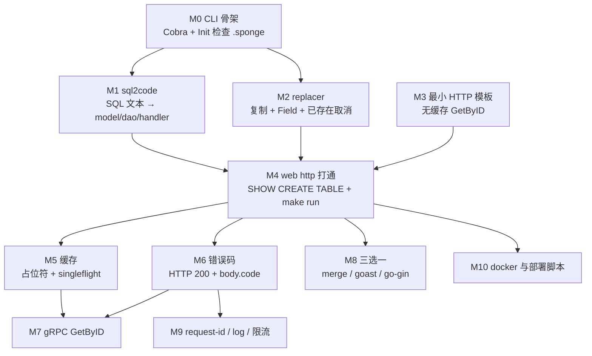
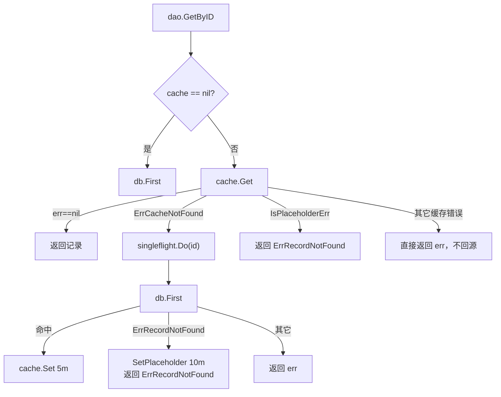

# 从零重新实现指南：按可运行闭环重写精简版 Sponge

> 状态：待复核生成稿
> 生成日期：2026-08-16
> 基准提交：`23807238c62e0f3b3e2d9a341bbef50547d3f5ec`
> 工作区：dirty（存在与本任务无关的本地改动：`go.mod` / `go.sum` / sqlite 测试库等；本文件为新增文档）
> 源码范围：`cmd/sponge/`、`pkg/sql2code/`、`pkg/replacer/`、`cmd/serverNameExample_httpExample/`、`cmd/serverNameExample_grpcExample/`、`internal/{handler,dao,cache,database,routers,server,service,ecode,model,types}`、`pkg/{app,httpsrv,gin,grpc,sgorm,cache,errcode,logger,shield}`、`cmd/protoc-gen-go-gin/`、`pkg/goast/`、`cmd/sponge/commands/merge/`、`deployments/`、`scripts/`、`Makefile-for-http`、`test/auto-test/files/1_web_http.sh`
> 生成方式：源码、测试、配置与部署资产静态分析；对照 [01](01-简单框架-系统骨架.md)–[16](16-配置错误码测试构建与部署.md) 的已确认契约

本篇是第四层文档：**按可运行闭环重写精简版 Sponge 的路线图**。它不重复抄写 04–16 的函数级细节，而是把那些文档里已经钉死的契约编排成 M0–M10。读完应能回答：先造哪一块、对照哪份源码、哪些行为不能改、哪些技术可以换、怎样用命令证明这一阶段做完了。

---

## 快速摘要

### 架构总览（模块与依赖）

精简版 Sponge 仍是两套代码、两类进程，依赖方向与 [01-简单框架-系统骨架.md](01-简单框架-系统骨架.md) 相同，禁止反向：

```text
精简 CLI（Cobra）
  → sql2code.Generate（SQL 文本或 SHOW CREATE TABLE）
  → replacer.SaveFiles（复制模板 + Field 替换 + 已存在整批取消）
  → 输出目录

生成项目
  → main → InitApp → CreateServices → pkg/app.Run
  → handler/service → dao → cache/db
  → response.Success / RPCStatus（HTTP 200+code 或 gRPC status）
```

M0–M4 打通 **生成器 + 最小 HTTP GetByID**。M5–M6 补齐运行时缓存与错误码契约。M7 加一条 gRPC GetByID。M8 三选一做增量合并或 Protobuf 胶水。M9–M10 补治理与部署。UI、AI assistant、压测、Mongo/PG/SQLite 全驱动、extended-api、mono-repo、注册中心 **不进入精简版闭环**。

### 核心调用序列（逐步逻辑）

对照 [02-简单例子-全路径走读.md](02-简单例子-全路径走读.md) 与 [03-详细逐步说明-主链路拆解.md](03-详细逐步说明-主链路拆解.md)，精简版必须最终复现这条链：

1. `cmd/sponge/main.go:main` → `generate.Init` 检查用户家目录下的 `.sponge`。
2. `commands.NewRootCMD().Execute` → `GenWebCommand` → `generate.HTTPCommand.RunE`。
3. `sql2code.Generate`：M1 用 `Args.SQL`；M4 用 `parser.GetMysqlTableInfo` 执行 `SHOW CREATE TABLE`。
4. `parser.ParseSQL` 产出 `map[string]string`，键至少含 `model` / `dao` / `handler` / `__table_name__`。
5. `httpGenerator.generateCode` → `replacer.SetReplacementFields` → `SaveFiles`。
6. 生成项目 `make run`：`InitApp` → `CreateServices` → `app.Run`。
7. `GET /api/v1/<table>/{id}` → `handler.GetByID` → `dao.GetByID` → JSON `{code,msg,data}`，成功时 HTTP 200 且 `code=0`。

### 易错点与边界条件

- **未 init 禁止生成**：`generate.Init` 在 `.sponge` 不存在时，除 `sponge` / `sponge -h` / `sponge init` 外一律拒绝；`main` 打印后 **return，退出码 0**（不是 1）。证据：`cmd/sponge/main.go`、`cmd/sponge/commands/generate/init.go:isShowCommand`。
- **module 替换顺序不可反**：先把 `github.com/go-dev-frame/sponge` 换成用户 module，再把 `userModule/pkg` 换回 `github.com/go-dev-frame/sponge/pkg`。反了则生成项目无法编译。证据：[05-代码生成器与模板写入.md](05-代码生成器与模板写入.md)、`httpGenerator.addFields`。
- **`SaveFiles` 已存在则整批取消**，一个文件都不写。重复生成到同一 `--out` 必须失败。
- **HTTP 业务错误走 200 + `body.code≠0`**；系统错误才 `response.Output` 改 HTTP 状态。`Output(200)` 的 `body.code` 是 200 不是 0。
- **缓存其它错误不回源**；占位符 `"*"` 映射为 `ErrRecordNotFound`。Redis 宕机变成 HTTP 500，这是契约不是 bug。
- 表名 / 服务名后缀 `_test`、`-test` 必须拒绝。DSN 形态是 `user:password@(host:port)/database`，`AdaptiveMysqlDsn` 只剥 `mysql://`。
- 本任务未运行测试套件；文中“建议测试”来自阅读 `*_test.go` 与 `test/auto-test/files/1_web_http.sh`，不宣称已经跑过。

---

## 目录

- [为什么按里程碑重写（Why）](#为什么按里程碑重写why)
- [精简版是什么（What）](#精简版是什么what)
- [全局契约对照表](#全局契约对照表)
- [里程碑总图](#里程碑总图)
- [阅读前面文档的顺序](#阅读前面文档的顺序)
- [M0 仓库与 CLI 骨架](#m0-仓库与-cli-骨架)
- [M1 sql2code：SQL 文本 → 片段](#m1-sql2codesql-文本--片段)
- [M2 replacer：复制、替换、取消](#m2-replacer复制替换取消)
- [M3 最小 HTTP 模板：无缓存 GetByID](#m3-最小-http-模板无缓存-getbyid)
- [M4 sponge web http 打通](#m4-sponge-web-http-打通)
- [M5 缓存与占位符、singleflight](#m5-缓存与占位符singleflight)
- [M6 错误码与 response 200+code](#m6-错误码与-response-200code)
- [M7 gRPC 一条 GetByID](#m7-grpc-一条-getbyid)
- [M8 merge / goast / protoc-gen-go-gin 三选一](#m8-merge--goast--protoc-gen-go-gin-三选一)
- [M9 治理：request-id、logging、可选限流](#m9-治理request-idlogging可选限流)
- [M10 部署脚本与 docker](#m10-部署脚本与-docker)
- [刻意不做的范围](#刻意不做的范围)
- [阅读源码建议顺序](#阅读源码建议顺序)
- [重新实现最终检查清单](#重新实现最终检查清单)
- [交叉链接](#交叉链接)

---

## 为什么按里程碑重写（Why）

Sponge 的核心价值不是“再包一层 Gin”。[01-简单框架-系统骨架.md](01-简单框架-系统骨架.md) 已经说明：它同时是 **代码生成器** 和 **被生成服务的模板 + 运行时库**。如果一上来就复刻全部 `pkg/`、全部 `generate.*Command`、UI 和三个 protoc 插件，会在还没有可运行产物时淹没在变体文件（`.mgo` / `.exp` / `.tpl` / `.noregistry`）里。

正确顺序是 **每阶段都留下一个可客观检查的闭环**：

| 阶段组 | 闭环形态 | 证明什么 |
|---|---|---|
| M0 | CLI 能启动、能拦未 init | 工具进程身份 |
| M1 | SQL 文本变成 Go 片段 | 生成器的“定义 → 代码”引擎 |
| M2 | 目录复制 + 占位符替换 + 拒绝覆盖 | 写出工程的机械能力 |
| M3 | 手写最小模板能 `go run` 并 GetByID | 运行时骨架先于生成器完整化 |
| M4 | `sponge web http` → `make run` → `curl code=0` | 与仓库自动测试 `1_web_http.sh` 同构 |
| M5–M10 | 在已能跑的 HTTP 服务上叠加 | 缓存、错误码、gRPC、增量、治理、部署 |

每一阶段的验收都必须是命令、退出码、文件是否存在或 JSON 字段，而不是“看起来差不多”。

---

## 精简版是什么（What）

精简版 = **能从一张 MySQL 表生成可运行的 HTTP CRUD 骨架，并至少提供 GetByID**；随后用同一套 dao 再挂一条 gRPC GetByID。它必须遵守原仓库的公开契约，但内部可以用更少文件、更少驱动、更少命令实现。

| 原仓库能力 | 精简版 | 依据 |
|---|---|---|
| `sponge init` 从 `$GOPATH/pkg/mod` 拷模板 | 必须有 `init` 把模板树落到用户家目录 `.sponge`；来源可改为本地目录 | [04-CLI入口命令树与生命周期.md](04-CLI入口命令树与生命周期.md) |
| `web http` / `micro rpc` / `http-pb` / … | M4 只做 `web http`；M7 加 `micro rpc` 的 GetByID 子集 | [05-代码生成器与模板写入.md](05-代码生成器与模板写入.md) |
| MySQL / TiDB / PostgreSQL / SQLite / MongoDB | M1 只解析 MySQL DDL 文本；M4 只连 MySQL | [06-SQL到代码片段引擎.md](06-SQL到代码片段引擎.md) |
| 5 API + extended 9 API | 最小闭环只要 GetByID；M4 建议带上 Create/List 以便对照自动测试 | `internal/routers/userExample.go` |
| Redis / memory / 无缓存 | M3 无缓存；M5 补 memory 或 Redis 二选一 | [11-数据层Model-DAO-Cache.md](11-数据层Model-DAO-Cache.md) |
| 三个 protoc 插件 + merge + patch | M8 **三选一**先做 | [07-Protoc插件与增量合并.md](07-Protoc插件与增量合并.md) |
| UI / assistant / perftest | 不做 | [08-UI-Assistant-Patch与性能测试.md](08-UI-Assistant-Patch与性能测试.md) |

占位符约定必须原样保留，否则 Field 替换会对不上：

| 占位符 | 生成后变成 | 出现位置 |
|---|---|---|
| `serverNameExample` | `--server-name`（`-` 已换成 `_`） | `cmd/`、`configs/`、`internal/config/` |
| `userExample` / `UserExample` | 表名驼峰（`codes["__table_name__"]`） | handler / dao / cache / routers |
| `_httpExample` / `_pbExample` / `_mixExample` | 空字符串 | `cmd/serverNameExample_httpExample` → `cmd/<server>` |
| `github.com/go-dev-frame/sponge` | `--module-name`，但 `.../pkg` 要换回 | `go.mod`、import |
| `Makefile-for-http` | `Makefile` | 生成项目根目录 |
| `// todo generate ... here` 与 `// delete the templates code start/end` | 被片段替换或整段删掉 | model / dao / handler |

---

## 全局契约对照表

下面两条列贯穿所有里程碑。实现时先问：这是契约还是实现细节？

| 类别 | 必须保持 | 可以替换 |
|---|---|---|
| 工具入口 | Cobra 根命令 `Use: "sponge"`；`main` 先 `Init` 再 `Execute` | 不用 Cobra，但子命令名与 flag 名要对齐，否则无法对照 `1_web_http.sh` |
| 模板根 | 生成读用户家目录 `.sponge`，不读当前 Git 工作区 | init 的拷贝源：`$GOPATH/pkg/mod` / 本地 clone / embed.FS |
| SQL 输入优先级 | `SQL` 文本 > `DDLFile` > `DBDsn+DBTable` | 解析器不必用 `github.com/zhufuyi/sqlparser`，但输出 map 的键名要兼容 |
| 写入安全 | 目标已存在 → 整批取消；禁止写回模板目录 | 复制实现可用 `io.Copy` / `embed` / 自写 walker |
| HTTP JSON | `{code,msg,data}`；`Success`/`Error` 永远 HTTP 200 | Web 框架不必是 Gin，但路由与 JSON 字段要对齐 |
| GetByID 找不到 | `errors.Is(err, ErrRecordNotFound)` → 业务码 NotFound（100004），仍 HTTP 200 | ORM 不必是 GORM |
| 缓存状态机 | 命中返回；`ErrCacheNotFound` 回源；占位符当 not found；其它错误不回源 | Redis 可换成 memory；singleflight 可用互斥 map 模拟，但同 id 并发只打一次库 |
| gRPC 错误 | 校验失败 `.Err()`；DAO 系统失败 `ToRPCErr()`；not found `.Err()` | 不必上拦截器全家桶 |
| 部署 | `make run` 能编能起；镜像把二进制 + `configs/` 放进容器 | 基础镜像、编排工具、是否 upx |

---

## 里程碑总图



M1 与 M2 可并行。M3 不依赖生成器，建议与 M1/M2 同时推进，避免 M4 才发现运行时骨架不可编译。M5 与 M6 可并行，但 M7 需要两者都在。M8 不阻塞 M9/M10。

---

## 阅读前面文档的顺序

重写前按层读，不可跳级。第四层按本里程碑用到的模块选读，不必一次读完 04–16。

| 顺序 | 文档 | 本指南用它做什么 |
|---|---|---|
| 1 | [01-简单框架-系统骨架.md](01-简单框架-系统骨架.md) | 分清生成器进程 vs 生成项目进程 |
| 2 | [02-简单例子-全路径走读.md](02-简单例子-全路径走读.md) | M4 的端到端样例与脱敏命令 |
| 3 | [03-详细逐步说明-主链路拆解.md](03-详细逐步说明-主链路拆解.md) | Init / SaveFiles / GetByID 失败出口 |
| 4 | [04-CLI入口命令树与生命周期.md](04-CLI入口命令树与生命周期.md) | M0：`isShowCommand`、退出码、init 拷贝 |
| 5 | [06-SQL到代码片段引擎.md](06-SQL到代码片段引擎.md) | M1 / M4：`Args`、`ParseSQL`、键名 |
| 6 | [05-代码生成器与模板写入.md](05-代码生成器与模板写入.md) | M2 / M4：Field 顺序、变体、selectFiles |
| 7 | [09-生成项目启动与HTTP请求链.md](09-生成项目启动与HTTP请求链.md) | M3 / M4：main 四步、路由、GetByID |
| 8 | [12-pkg应用生命周期与Gin.md](12-pkg应用生命周期与Gin.md) | M3 / M9：`pkg/app`、`httpsrv`、中间件顺序 |
| 9 | [11-数据层Model-DAO-Cache.md](11-数据层Model-DAO-Cache.md) | M5：缓存状态机 |
| 10 | [14-pkg数据库缓存与查询.md](14-pkg数据库缓存与查询.md) | M5：`Cache` 接口与 `"*"` |
| 11 | [16-配置错误码测试构建与部署.md](16-配置错误码测试构建与部署.md) | M6 / M10：ecode 编号、Makefile、镜像 |
| 12 | [10-gRPC服务网关与RPC客户端.md](10-gRPC服务网关与RPC客户端.md) | M7：service.GetByID |
| 13 | [13-pkg-gRPC与服务注册发现.md](13-pkg-gRPC与服务注册发现.md) | M7：拦截器可选；精简版可直连 |
| 14 | [07-Protoc插件与增量合并.md](07-Protoc插件与增量合并.md) | M8 三选一 |
| 15 | [15-pkg可观测性限流熔断与其余包.md](15-pkg可观测性限流熔断与其余包.md) | M9：logger / shield |
| 16 | [08-UI-Assistant-Patch与性能测试.md](08-UI-Assistant-Patch与性能测试.md) | 确认精简版不做这些 |

---

## M0 仓库与 CLI 骨架

### 要实现的组件

1. 模块路径与 `cmd/sponge/main.go`。
2. Cobra 根命令 `sponge`，至少挂 `init`、`web`（可先空）、`version`。
3. `generate.Init`：检查模板目录；放行 `sponge` / `sponge -h` / `sponge init`。
4. `sponge init`：把模板树写到用户家目录 `.sponge`，并写 `.sponge/.github/version`。

### 对应源码文件

| 组件 | 源码 |
|---|---|
| 进程入口 | `cmd/sponge/main.go:main` |
| 根命令 | `cmd/sponge/commands/root.go:NewRootCMD`、`GetSpongeDir` |
| Init 检查 | `cmd/sponge/commands/generate/init.go`：`Init`、`isShowCommand`、`SpongeDir`、`Replacers` |
| init 命令 | `cmd/sponge/commands/init.go:InitCommand` → `runUpgrade("latest")` |
| 拷贝模板 | `cmd/sponge/commands/upgrade.go:copyToTempDir` |
| web 挂载点 | `cmd/sponge/commands/web.go:GenWebCommand` |

原版 `init` 的真实步骤是：`go install` 二进制 → 从 `$GOPATH/pkg/mod/github.com/go-dev-frame/sponge@*` `cp -rf` 到 `.sponge` → `chmod -R 744` → 删掉 `cmd/sponge`、三个 `protoc-gen-*`、`pkg/`、`test/`、`assets/` → 写 version 文件。精简版 **不必** `go install`，但目录约定与“生成读 `.sponge`”必须保留。

### 必须保持的行为契约

| 契约 | 证据 |
|---|---|
| `SpongeDir = UserHomeDir + delimiter + ".sponge"` | `generate/init.go` |
| `.sponge` 不存在且不是 show 命令 → 返回 `` ⚠  not yet initialized, run the command "sponge init" `` | `Init` |
| `isShowCommand` 只认 `len==1`，或 `len==2` 且为 `init`/`-h`，或 `len>2` 且前三个参数拼接含 `"init"` | `isShowCommand`；**不**放行 `--help`、`version`、`web -h` |
| `Init` 失败：`fmt.Printf` 后 `return`，退出码 **0** | `main.go` |
| `Execute` 失败：`PrintErrln` + `os.Exit(1)` | `main.go` |
| `Replacers["sponge"]` 已存在则 `panic` | `Init` |
| 根命令 `SilenceErrors` / `SilenceUsage` 均为 true | `root.go` |

### 可以替换的技术

- 不用 Cobra，自己解析 `os.Args`，只要命令名与退出码一致。
- init 拷贝源改为：当前仓库（开发期）、`embed.FS`、或发布包里的 `templates/`。不要在精简版里依赖 `ls $GOPATH/pkg/mod`。
- version 文件格式只要是纯文本版本号；读不到时原版显示 `unknown, execute command "sponge init" to get version`。
- Windows 上原版 `rm`/`cp`/`chmod` 会失败；精简版可用 `os`/`io` 包实现跨平台拷贝。

### 客观验收条件

在未创建 `.sponge` 的干净环境（或临时把该目录改名）：

```bash
# 1. 无子命令：必须能跑，退出码 0，输出含 Usage 或 Long 描述
sponge ; echo "exit=$?"
# 期望：exit=0

# 2. 短帮助放行
sponge -h ; echo "exit=$?"
# 期望：exit=0，输出含 init / web

# 3. 未 init 时生成类命令被拦住，退出码仍为 0
sponge web http --module-name=x --server-name=x --project-name=x --db-dsn=x --db-table=x ; echo "exit=$?"
# 期望：stderr/stdout 含 not yet initialized；exit=0

# 4. init 之后目录存在
sponge init ; echo "exit=$?"
test -d "$HOME/.sponge"
test -f "$HOME/.sponge/.github/version"
# 期望：exit=0；两个 test 成功

# 5. 重复 Init 在同一进程会 panic；CLI 每次是新进程，第二次 sponge -h 应仍成功
sponge -h ; echo "exit=$?"
```

### 建议测试

原仓库 `cmd/sponge/` **没有任何** `*_test.go`。精简版应补：

| 测试 | 断言 |
|---|---|
| `TestIsShowCommand` 表驱动 | `[]string{"sponge"}`、`{"sponge","-h"}`、`{"sponge","init"}` → true；`{"sponge","--help"}`、`{"sponge","version"}`、`{"sponge","web","-h"}` → false |
| `TestInitMissingDir` | 把 `SpongeDir` 指到不存在路径，非 show args 时 error 含 `not yet initialized` |
| `TestInitCreatesReplacer` | 临时目录当 `SpongeDir` 后 `Replacers["sponge"] != nil` |

---

## M1 sql2code：SQL 文本 → 片段

### 要实现的组件

1. `sql2code.Args` + `Generate` / `GenerateOne`。
2. `getSQL` 的第一档：`Args.SQL` 非空直接返回。
3. `parser.ParseSQL`：MySQL `CREATE TABLE` → `map[string]string`。
4. 至少渲染 `model`、`dao`、`handler` 三种片段，并给出 `__table_name__`。

本阶段 **不连库**。`DDLFile` 与 `DBDsn` 可返回 “未实现”，但 `checkValid` 的拒绝规则要先写上。

### 对应源码文件

| 组件 | 源码 |
|---|---|
| 入口与校验 | `pkg/sql2code/sql2code.go`：`Args`、`checkValid`、`getSQL`、`setOptions`、`Generate` |
| 解析与渲染 | `pkg/sql2code/parser/parser.go`：`ParseSQL`、`makeCode`、键常量 |
| 类型映射 | `parser.go` 中 `mysqlToGoType`；Option 在 `parser/option.go` |
| 主键变体 | `parser/commonParser.go`、`commonTemplate.go`（M1 可只支持 `id` bigint 主键） |
| 命名 | `parser/nameFormat.go`：`toCamel`、缩写词表 |
| 测试输入 | `pkg/sql2code/sql2code_test.go` 的 `sqlData`；`parser/parser_test.go:TestParseSQL` |

`Generate` 返回值键（必须兼容，generate 层按名取值）：

| 键 | 常量 | M1 是否必做 |
|---|---|---|
| `model` | `CodeTypeModel` | 必做 |
| `dao` | `CodeTypeDAO` | 必做（更新字段片段，写入 `// todo generate the update fields code to here`） |
| `handler` | `CodeTypeHandler` | 必做 |
| `__table_name__` | `TableName` | 必做；表 `user` → 驼峰 `User`（`toCamel`） |
| `json` / `proto` / `service` | | M1 可空字符串；M7 再填 proto/service |
| `crud_info` / `table_info` | | 非标准主键才需要；M1 可只支持标准 `id` |

### 必须保持的行为契约

| 契约 | 证据 |
|---|---|
| 三者都空：`you must specify sql or ddl file` | `checkValid`（注意：即使只给了 DSN 没给 Table 也会在 `getSQL` 再报 `miss database table`） |
| 表名后缀 `_test` 拒绝 | `checkValid` |
| `DBDriver==""` 默认 `mysql` | `checkValid` |
| 输入优先级 `SQL > DDLFile > DSN` | `getSQL` |
| `DDLFile` 仅 mysql | 其它驱动 `not support driver` |
| CLI 路径 `NullStyle` 为空时强制 `NullDisable`，**覆盖** `parser.defaultOptions.NullInSql` | `setOptions`；直接调 `ParseSQL` 会得到 `sql.Null*` |
| 非法 `NullStyle` 打印后返回 `nil` option，`Generate` 仍调用无 option 的 `ParseSQL` | [06](06-SQL到代码片段引擎.md) 已记录；精简版可改为直接报错（**这是允许收紧的边界**，但要在 README 写明） |
| `web http` 传 `JSONTag: true`、`GormType: true`、`JSONNamedType` 默认 **1（驼峰）** | `HTTPCommand` |
| 嵌入 `gorm.Model` 由 `--embed` 控制，默认 false | flag `embed` |

### 可以替换的技术

- SQL 解析器：可用 `pingcap/tidb` parser、`sqlparser` 或手写只认 `CREATE TABLE` 的子集。
- 代码渲染：`text/template` 可换成 `fmt.Sprintf`，只要字段、tag、包名 `model` 对齐。
- M1 只支持：`bigint` 主键 `id`、`datetime` 时间戳、`char/varchar`、`tinyint`。`ENUM`/`SET`/`JSON`/`DECIMAL` 可放到 M4 之后。
- 不实现 PostgreSQL/SQLite/Mongo 的“伪 MySQL DDL”合成。

### 客观验收条件

把 `sql2code_test.go` 里的 `sqlData`（`create table user (... id bigint unsigned auto_increment primary key ...)`）交给 `Generate`：

```bash
go test ./pkg/sql2code/ -run 'TestGenerate$' -count=1 -v
```

若精简版另写了小工具 `sql2code-cli`：

```bash
sql2code-cli -sql 'create table user (id bigint unsigned auto_increment primary key, name char(50) not null);'
```

期望：

1. 退出码 0。
2. 输出 map 含键 `model`、`dao`、`handler`、`__table_name__`。
3. `model` 含 `type User struct`（或等价，但字段名 `Name`、json tag 在 `JSONNamedType=1` 时为 `name` 驼峰：`json:"name"` 来自列名；CLI 默认 camel 是 `json:"name"` 对单单词无差异，对 `user_id` 应为 `userId`）。
4. `__table_name__` 等于 `User`。
5. 空 Args 返回 error，字符串含 `you must specify sql or ddl file`。
6. `DBTable: "user_test"` 返回 error，含 `_test`。

json tag 对照：`HTTPCommand` 默认 `--json-name-type=1`。验收时显式传入 `JSONNamedType: 1`，对列 `created_at` 期望 `json:"createdAt"`。

### 建议测试

直接移植并裁剪：

- `pkg/sql2code/sql2code_test.go`：`TestGenerate` / `TestGenerateOne` 的 `sql form param`、`sql from file`（file 可 M4 再做）。
- `parser/parser_test.go:TestParseSQL` 第一份 `create table user`。
- 新增：`TestCheckValid_TableSuffix`、`TestGetSQL_PrioritySQLOverDSN`（DSN 即使乱填也不该被访问）。

---

## M2 replacer：复制、替换、取消

### 要实现的组件

1. `Replacer` 接口的子集：`New`、`SetReplacementFields`、`SetSubDirsAndFiles`、`SetIgnoreSub*`、`SetOutputDir`、`SaveFiles`。
2. `Field{Old,New,IsCaseSensitive}`：大小写敏感时拆成首字母大小写两条。
3. 内容替换 + 路径名替换。
4. 先扫描已存在文件，有则整批取消。
5. `isForbiddenFile`：禁止写回模板源目录。

### 对应源码文件

| 组件 | 源码 |
|---|---|
| 接口与实现 | `pkg/replacer/replacer.go` |
| 测试 | `pkg/replacer/replacer_test.go`（`testDir/` fixture） |
| 调用方 | `cmd/sponge/commands/generate/http.go:generateCode` |
| 文件列举 | `pkg/gofile.ListFiles`（可自写递归） |

`SaveFiles` 固定顺序（契约，不是优化建议）：

```text
过滤 ignore
  → 读文件
  → 按 Field 替换内容（bytes.ReplaceAll，全部出现）
  → 按 Field 替换目录名与文件名
  → 收集已存在目标；len>0 则 error，一个都不写
  → isForbiddenFile 拒绝写回 r.path
  → saveToNewFile
```

### 必须保持的行为契约

| 契约 | 证据 |
|---|---|
| `IsCaseSensitive && 首字母是字母` → 拆成 Upper/Lower 两条 Field | `SetReplacementFields` |
| `New==""` 且大小写敏感 → **跳过该 Field** | 同上 |
| 已存在：error 文案含 `existing files detected` 与 `Code generation has been cancelled` | `SaveFiles` |
| 写回模板树：`disable writing file(...) to directory(...)` | `isForbiddenFile` |
| `SetSubDirsAndFiles` 匹配不到时 **保持原 `r.files` 不变**（不把列表清空） | `len(files)==0 { return }` |
| 共享实例会被 `SetSubDirsAndFiles` 永久裁剪；HTTP 生成器因此 `replacer.New(SpongeDir)` 拿新实例 | [05](05-代码生成器与模板写入.md) |

### 可以替换的技术

- 不用 `embed.FS`（`NewFS`）直到需要把模板打进二进制。
- 路径匹配不必复用原版 `isSubPath` 对 `.sponge/configs` 的子串巧合；精简版用明确的相对路径前缀更安全。
- `SetOutputDir` 在 `absPath==""` 时原版拼 `name_150405`；精简版可强制要求 `--out`。

### 客观验收条件

准备临时目录：

```text
tpl/
  cmd/serverNameExample_httpExample/main.go   # 内容含 serverNameExample
  internal/handler/userExample.go             # 内容含 UserExample
out/   # 空
```

```bash
# 程序：New(tpl) → SetSubDirsAndFiles(["cmd","internal"]) →
# Field{Old:"serverNameExample", New:"user"} 、 {Old:"UserExample", New:"User", IsCaseSensitive:true}
# SetOutputDir(out) → SaveFiles

test -f out/cmd/user_httpExample/main.go -o -f out/cmd/user/main.go
# 精简版若同时做了 _httpExample→"" 的 Field，则路径是 cmd/user/main.go
grep -q user out/cmd/*/main.go
grep -q User out/internal/handler/*.go

# 第二次写入同一 out 必须失败
# 期望：error 含 existing files detected；exit ≠ 0；文件内容与第一次相同（未被截断）
```

大小写拆分验收：`Old:"userExample"` + `IsCaseSensitive:true` 必须同时替换 `UserExample` 与 `userExample`。

### 建议测试

运行并对照：

```bash
go test ./pkg/replacer/ -count=1
```

原版 `TestNewWithFS` 覆盖 `New`/`NewFS`、ignore、Field。精简版至少加：

- `TestSaveFiles_CancelWhenExists`
- `TestSaveFiles_ForbiddenWriteBack`
- `TestSetReplacementFields_CaseSensitiveSplit`

---

## M3 最小 HTTP 模板：无缓存 GetByID

本阶段 **先手写一份可编译模板**，不要等生成器。目标是证明运行时骨架能查一条记录。缓存、限流、Swagger 全部关掉。

### 要实现的组件

| 组件 | 职责 |
|---|---|
| `main` | `InitApp` → `CreateServices` → `Close` → `app.New(...).Run()` |
| `InitApp` | 读 YAML、`logger.Init`、`database.InitDB`；`InitCache` 可空操作 |
| `CreateServices` | `server.NewHTTPServer(":"+port)` |
| `httpServer` | 实现 `app.IServer`；`Start`=`httpsrv.Server.Run`；`Stop`=3s `Shutdown` |
| `NewRouter` | Recovery + 注册 `GET /api/v1/userExample/:id` |
| `handler.GetByID` | path id → `dao.GetByID` → `response.Success` / `Error` / `Output` |
| `dao.GetByID` | `cache==nil` 分支：`db.Where("id = ?", id).First` |
| `model.UserExample` | 与 M1 产出的 struct 同形，便于 M4 替换标记区 |

### 对应源码文件

| 组件 | 源码 |
|---|---|
| main 四步 | `cmd/serverNameExample_httpExample/main.go` |
| InitApp | `cmd/serverNameExample_httpExample/initial/initApp.go` |
| CreateServices | `cmd/serverNameExample_httpExample/initial/createService.go` |
| HTTP server（无注册中心） | `internal/server/http.go.noregistry`（生成时后缀会被处理成 `http.go`） |
| 路由 | `internal/routers/routers.go:NewRouter`、`internal/routers/userExample.go` |
| GetByID | `internal/handler/userExample.go:GetByID` |
| DAO 无缓存 | `internal/dao/userExample.go:GetByID` 开头 `if d.cache == nil` |
| 生命周期 | `pkg/app`、`pkg/httpsrv` |
| JSON | `pkg/gin/response/response.go` |
| 配置模板 | `configs/serverNameExample.yml`（`http.port` 默认 8080，`app.cacheType: ""`） |

`userExample.go` 路由：

```text
g.GET("/:id", h.GetByID)  →  GET /api/v1/userExample/:id
```

生成后 `userExample` 被换成表名驼峰首字母小写，表 `user` → `/api/v1/user/:id`。

### 必须保持的行为契约

| 契约 | 证据 |
|---|---|
| main 顺序固定，不可把 `Run` 放到 `InitApp` 里 | 七个 `cmd/serverNameExample_*` 相同 |
| `app.IServer` 三方法：`Start` / `Stop` / `String` | `pkg/app` |
| `Stop` 超时 3s | `http.go.noregistry` |
| `id==0` → `response.Error(c, ecode.InvalidParams)`，HTTP 200，`code=100001` | handler `getUserExampleIDFromPath` |
| `ErrRecordNotFound` → `response.Error(c, ecode.NotFound)`，HTTP 200，`code=100004` | handler GetByID |
| 其它 DAO 错误 → `response.Output(c, ecode.InternalServerError.ToHTTPCode())`，**HTTP 500** | handler GetByID |
| 成功 → `response.Success(c, gin.H{"userExample": data})`，HTTP 200，`code=0`，`msg=ok` | handler；生成后键名随表名变 |
| `data` 为 nil 时序列化成 `{}` 而不是 `null` | `newResp` |
| `cacheType` 空 → `NewUserExampleCache` 返回 nil → DAO 不走缓存 | `internal/cache/userExample.go` |

### 可以替换的技术

- Gin → chi/echo/stdlib，但路径与 JSON 字段必须可被 `curl` 对照。
- GORM → database/sql，但 `ErrRecordNotFound` 语义要可 `errors.Is`。
- YAML 配置库随意；字段 `http.port`、`database.mysql.dsn` 建议保持，便于 M4 生成。
- 不做 CORS / Timeout / Metrics / Swagger / pprof。

### 客观验收条件

手写项目（尚未接生成器），MySQL 中有 `user` 表且 `id=1` 有行：

```bash
# 配置 cacheType 为空，dsn 指向测试库
go run ./cmd/user/   # 或 make run 若已抄 scripts/run.sh
# 另开终端：
curl -s -o /tmp/body -w "%{http_code}" http://localhost:8080/api/v1/userExample/1
# 期望 HTTP 200；body 含 "code":0

curl -s http://localhost:8080/api/v1/userExample/0
# 期望 HTTP 200；"code":100001

curl -s http://localhost:8080/api/v1/userExample/999999
# 期望 HTTP 200；"code":100004（库中无此行）

# 停库或把 DSN 指错后再 GetByID
# 期望 HTTP 500（Output 路径），不要 200+100003
```

文件存在性：

```bash
test -f cmd/serverNameExample_httpExample/main.go
test -f internal/handler/userExample.go
test -f internal/dao/userExample.go
test -f configs/serverNameExample.yml
```

### 建议测试

- `internal/handler`：用 httptest 打 GetByID，mock dao 返回 record / `ErrRecordNotFound` / 其它 error，分别断言 HTTP 状态与 `code`。
- `internal/dao/userExample_test.go` 已有 sqlmock 路径；M3 先测 `cache==nil` 的 `First`。
- `pkg/app`：起一个 fake `IServer`，发 SIGTERM 能退出（精简版可测 `Stop` 被调用）。

---

## M4 sponge web http 打通

把 M0–M3 接成与仓库自动测试同构的闭环：连 MySQL `SHOW CREATE TABLE`，写出可 `make run` 的项目。

### 要实现的组件

1. `HTTPCommand` 必填 flags 与 `RunE`。
2. `sql2code.Generate` 第三档：`AdaptiveMysqlDsn` + `GetMysqlTableInfo`。
3. `httpGenerator.generateCode`：选模板子集、`addFields`、`SaveFiles`。
4. 生成项目含 `Makefile`（由 `Makefile-for-http` 改名）与 `scripts/run.sh`。
5. 成功打印 `generate %s's web server code successfully, out = %s`。

### 对应源码文件

| 步骤 | 源码 |
|---|---|
| flags / RunE | `cmd/sponge/commands/generate/http.go:HTTPCommand` |
| 服务名转换 | `generate/common.go:convertProjectAndServerName` |
| SHOW CREATE TABLE | `pkg/sql2code/parser/mysql.go:GetMysqlTableInfo` |
| DSN | `pkg/utils/dsn.go:AdaptiveMysqlDsn`（只删 `mysql://`） |
| 选文件 | `http.go:generateCode` 的 `subDirs` / `selectFiles` |
| Field | `http.go:addFields` |
| Makefile | `Makefile-for-http` → Field `Makefile-for-http`→`Makefile` |
| 启动脚本 | `scripts/run.sh`（`go build` 后跑二进制） |
| 对照测试 | `test/auto-test/files/1_web_http.sh` |

`HTTPCommand` 必填：`--module-name`、`--server-name`、`--project-name`、`--db-dsn`、`--db-table`。缺任一，Cobra 在 `RunE` 前失败（退出码 1）。

`GetMysqlTableInfo` 执行：

```sql
SHOW CREATE TABLE `tableName`
```

Scan 两列，返回第二列 DDL 文本。表不存在：`not found found table`（原文双 found）。

`addFields` 里与闭环相关的替换（完整列表见 [05](05-代码生成器与模板写入.md)）：

| Old | New |
|---|---|
| `// todo generate ...` 标记 | `codes["model"]` / `codes["dao"]` / `codes["handler"]` |
| `github.com/go-dev-frame/sponge` | `moduleName` |
| `moduleName + "/pkg"` | `github.com/go-dev-frame/sponge/pkg`（**必须后执行**） |
| `serverNameExample` | `serverName` |
| `UserExample`（大小写敏感） | `codes["__table_name__"]` |
| `_httpExample` | `""` |
| `Makefile-for-http` | `Makefile` |
| YAML 里示例 DSN | 用户 `--db-dsn` |
| `userExampleNO       = 1` | `rand.Intn(99)+1` |

`selectFiles` 最小集（精简版可再砍测试文件，但下面这些运行时文件必须在）：

```text
cmd/serverNameExample_httpExample/**
configs/
internal/{cache,config,dao,database,ecode,handler,model,routers,server,types}
go.mod  go.sum  Makefile-for-http  scripts/run.sh
```

原版还会拷 `deployments/`、`.gitignore`、`.golangci.yml`；M4 可延后到 M10。

### 必须保持的行为契约

| 契约 | 证据 |
|---|---|
| `serverName` 后缀 `-test`/`_test` 拒绝 | `convertProjectAndServerName` |
| `serverName` 的 `-` 换成 `_`；`projectName` 做 kebab-case | 同上 |
| 多表：第一张走 `httpGenerator`，其余走 `handlerGenerator` 追加到同一 `outPath` | `RunE` |
| Mongo 时 `IsEmbed=false` | `RunE`；精简版可不实现 Mongo，但不要改这个 if |
| `generateConfigmap` 失败被 `_ =` 忽略 | `RunE` 末尾 |
| 成功文案：`generate %s's web server code successfully, out = %s` | `RunE` |
| using help 提示 `make docs` 与 `make run` | 同上；精简版可暂不实现 `make docs` |
| 默认 `--out` 空则 `serverName_http_<HHMMSS>` | `SetOutputDir` |
| `http.go.noregistry` 才是 `web http` 实际写出的 server 文件 | [09](09-生成项目启动与HTTP请求链.md) |

### 可以替换的技术

- 模板不必含 Swagger、Jenkinsfile、k8s。
- `make docs`（`scripts/swag-docs.sh`）可跳过；`1_web_http.sh` 会调它，精简版验收改用 `make run` + curl 即可。
- TiDB 与 MySQL 共用 `GetMysqlTableInfo`，精简版只测 MySQL。
- `suited-mono-repo`、`--extended-api`、`--embed` 可声明未实现并在 flag 出现时报错。

### 客观验收条件

与 [02](02-简单例子-全路径走读.md) 相同的脱敏命令（DSN 换成本机，表 `user` 且 `id=1` 有数据）：

```bash
sponge init   # 若尚未做

sponge web http \
  --module-name=user \
  --server-name=user \
  --project-name=edusys \
  --db-driver=mysql \
  --db-dsn='root:******@(127.0.0.1:3306)/account' \
  --db-table=user \
  --out=./auto-01-web-http
# 期望：exit=0；打印 successfully, out = .../auto-01-web-http

test -f auto-01-web-http/go.mod
test -f auto-01-web-http/Makefile
test -f auto-01-web-http/cmd/user/main.go
test -f auto-01-web-http/internal/handler/user.go
test -f auto-01-web-http/internal/dao/user.go
test -f auto-01-web-http/internal/model/user.go
test -f auto-01-web-http/configs/user.yml
grep -q 'github.com/go-dev-frame/sponge/pkg' auto-01-web-http/go.mod
# go.mod 的 module 行应是 user，require sponge/pkg 仍指向 github.com/go-dev-frame/sponge

# 第二次相同 --out 必须取消
sponge web http ... --out=./auto-01-web-http ; echo "exit=$?"
# 期望：exit≠0；文案含 existing files detected 或 Code generation has been cancelled

cd auto-01-web-http
make run
# 另开终端：
curl -s http://localhost:8080/api/v1/user/1
# 期望：JSON 含 "code":0
```

服务名拒绝：

```bash
sponge web http --module-name=a --server-name=foo-test --project-name=p --db-dsn=x --db-table=user
# 期望：error 含 suffix "-test"；不写文件
```

缺 flag：

```bash
sponge web http --module-name=a
# 期望：Cobra required flag 错误；exit=1
```

### 建议测试

- 用 docker MySQL 或本机库跑裁剪版 `1_web_http.sh`（去掉 `make docs` 与 List 断言，只留 GetByID）。
- `sql2code` 连库测试原版被注释；精简版若有测试库，恢复 `Generate` 的 DSN 用例。
- 生成后 `go test ./internal/handler/ ./internal/dao/`（模板自带 `*_test.go`）。

---

## M5 缓存与占位符、singleflight

在 M4 已能无缓存 GetByID 之后，打开 `app.cacheType: memory` 或 `redis`。

### 要实现的组件

1. `pkg/cache.Cache`：`Set`/`Get`/`Del`/`SetCacheWithNotFound`。
2. 未命中错误与占位符错误分家。
3. `internal/cache.NewUserExampleCache`：未知类型返回 **nil**（不是 panic）。
4. `dao.GetByID` 完整状态机 + `singleflight.Do`。
5. 写路径在 Update/Delete 后 `deleteCache`（错误可忽略）。

### 对应源码文件

| 组件 | 源码 |
|---|---|
| 接口与哨兵 | `pkg/cache/cache.go`：`ErrPlaceholder`、`NotFoundPlaceholder="*"`、`DefaultNotFoundExpireTime=10m` |
| 内存/Redis | `pkg/cache/memory.go`、`redis.go` |
| 业务 cache | `internal/cache/userExample.go`：前缀 `userExample:`、TTL `UserExampleExpireTime=5m` |
| DAO 状态机 | `internal/dao/userExample.go:GetByID` |
| 别名 | `internal/database/redis.go:ErrCacheNotFound = goredis.ErrRedisNotFound` |
| 装配 | `internal/database.InitCache`、`InitApp` 读 `cfg.App.CacheType` |
| 详解 | [11-数据层Model-DAO-Cache.md](11-数据层Model-DAO-Cache.md)、[14-pkg数据库缓存与查询.md](14-pkg数据库缓存与查询.md) |

状态机（必须按这个分支，不能“miss 就查库”一笔带过）：



### 必须保持的行为契约

| 契约 | 证据 |
|---|---|
| 占位符值是字符串 `"*"` | `NotFoundPlaceholder` |
| 读到 `"*"` → `ErrPlaceholder` | memory/redis `Get` |
| `IsPlaceholderErr` → DAO 返回 `ErrRecordNotFound` | dao 末尾 |
| 命中记录 TTL 5 分钟 | `UserExampleExpireTime` |
| 占位符 TTL 10 分钟 | `DefaultNotFoundExpireTime` |
| 同 id 并发回源只执行一次 `First` | `singleflight.Do(utils.Uint64ToStr(id), ...)` |
| Redis/缓存基础设施错误 **不回源** | dao：非 `ErrCacheNotFound` 且非 placeholder 则 `return nil, err` |
| `Set` / `SetPlaceholder` 失败只 `logger.Warn`，不改变 DAO 返回值 | dao |
| `NewUserExampleCache` 未知 `CType`（含 `""`）返回 nil | cache 构造器；对比 `NewCacheNameExampleCache` 会 panic，**不要学错那个** |
| Create **不**删 SQL 缓存；占位符 TTL 内 GetByID 仍 not found | [11](11-数据层Model-DAO-Cache.md) |
| Update/Delete 之后删缓存，删失败忽略 | `deleteCache` |

### 可以替换的技术

- 只用 memory，不接 Redis；接口保持即可。
- `singleflight` 可用 `sync.Map`+`sync.Mutex` 按 id 锁，行为要“同 id 同时只有一个回源”。
- 编码可用 JSON；不必实现 `pkg/encoding` 全套。
- 键前缀生成后随表名替换；手写时用 `user:` 对应表 `user`。

### 客观验收条件

配置 `cacheType: "memory"`（或 redis），服务已启动：

```bash
# 第一次：回源
curl -s http://localhost:8080/api/v1/user/1
# 期望 code=0

# 第二次：应命中缓存。验收方法二选一：
# (a) 打开 SQL 日志，第二次 GetByID 不应再打 SELECT
# (b) 单元测试里 mock cache.Get 第一次 miss、第二次 hit

# 不存在的 id：
curl -s http://localhost:8080/api/v1/user/999999
# 期望 HTTP 200，code=100004
# 紧接着再打一次：不应再查库（占位符），仍 code=100004

# 模拟缓存故障（把 redis 关掉且 cacheType=redis）：
curl -s -o /tmp/b -w "%{http_code}" http://localhost:8080/api/v1/user/1
# 期望 HTTP 500，而不是回源成功
```

单元级（不启进程也可验收）：

```bash
go test ./pkg/cache/ -count=1
go test ./internal/dao/ -run GetByID -count=1
```

期望 `pkg/cache`：Set 记录后 Get 成功；`SetCacheWithNotFound` 后 Get 返回 `ErrPlaceholder`。

### 建议测试

- `pkg/cache/memory_test.go`、`cache_test.go`。
- `internal/dao/userExample_test.go`：sqlmock + `gotest.NewCache`。补三个分支：hit、miss 回源、placeholder。
- 并发：同一 id 两个 goroutine `GetByID`，sqlmock 只 ExpectQuery 一次。

---

## M6 错误码与 response 200+code

M3/M4 已调用 `Success`/`Error`/`Output`。本阶段把 **编号体系、重复检测、HTTP/gRPC 两套码** 做成可独立验收的库，避免业务码冲突在多表生成时 panic。

### 要实现的组件

1. `pkg/errcode.Error`：`NewError` 全局 map，重复 code panic。
2. 系统码 10000x：`Success=0`、`InvalidParams=100001`、`InternalServerError=100003`、`NotFound=100004`。
3. `HCode(n)`：`200000 + n*100`，`n∈[1,999]`。
4. `response.Result` 与 `Success`/`Error`/`Output`。
5. 生成侧 `internal/ecode/userExample_http.go`：`userExampleNO` + `HCode` + 业务码 +1…+5。
6. （为 M7 预留）`RCode` 与 `RPCStatus`。

### 对应源码文件

| 组件 | 源码 |
|---|---|
| HTTP Error | `pkg/errcode/http_error.go`、`http_system_code.go`、`http_sevice_code.go` |
| RPC Status | `pkg/errcode/rpc_error.go`、`rpc_system_code.go`、`rpc_sevice_code.go` |
| JSON 出口 | `pkg/gin/response/response.go` |
| 生成项目系统码 | `internal/ecode/systemCode_http.go` |
| 生成项目业务码 | `internal/ecode/userExample_http.go` |
| 测试 | `pkg/gin/response/response_test.go`、`pkg/errcode/http_error_test.go` |
| 编号冲突修补 | `cmd/sponge/commands/patch/modify-dup-num.go`（M6 可手改 NO；M8 再自动化） |

`HCode(1)+4` = `200104`，即 `ErrGetByIDUserExample`。`NewError` 在进程内第二次注册同一数字会 panic，因此生成器把 `userExampleNO = 1` 换成 `rand.Intn(99)+1`。

### 必须保持的行为契约

| 契约 | 证据 |
|---|---|
| JSON 字段名 `code`、`msg`、`data` | `Result` |
| `Success`：HTTP 200，`code=0`，`msg=ok` | `respJSONWith200` |
| `Error`：HTTP 200，`code=err.Code()`，`msg=err.Msg()` | `Error` |
| `Output(500)`：HTTP 500，body.code 也是 500 | `respJSONWithStatusCode` 用 HTTP 状态当 JSON code |
| `Output(200)` 的 body.code 是 **200 不是 0** | [12](12-pkg应用生命周期与Gin.md) |
| `InvalidParams=100001`，`NotFound=100004`，`InternalServerError=100003` | `http_system_code.go` |
| `HCode` 非法 n panic | `num > 999 \|\| num < 1`（注释写 0~1000，实现是 1~999） |
| 业务码区间 200000–300000；系统码 10000–20000 | 注释与 `HCode` |
| handler：校验失败 / 找不到走 `Error`；内部错误走 `Output(500)` | GetByID |
| 限流触发走 `Output(429)`，**不是** 200+100007 | `middleware.RateLimit`（M9） |

### 可以替换的技术

- 不必实现 `ErrToHTTP`、`Out`、gRPC↔HTTP 互转，直到接网关。
- 业务码文案可英可中，但数字要稳定，方便客户端。
- `rand.Intn(99)+1` 可改成按表名哈希，只要落在 1–99 且不重复。

### 客观验收条件

```bash
go test ./pkg/errcode/ -count=1
go test ./pkg/gin/response/ -count=1
```

httptest 或已启动的 M4 服务：

```bash
curl -s -D - http://localhost:8080/api/v1/user/1 | head
# 期望：HTTP/1.1 200；body "code":0

curl -s -D - http://localhost:8080/api/v1/user/0 | head
# 期望：HTTP/1.1 200；body "code":100001

curl -s -D - http://localhost:8080/api/v1/user/999999 | head
# 期望：HTTP/1.1 200；body "code":100004
```

重复码：

```go
errcode.NewError(100001, "dup") // 必须 panic
```

`HCode(0)`、`HCode(1000)` 必须 panic。

### 建议测试

- `response_test.go` 已覆盖 `Success`/`Error`/`Output` 的 HTTP 状态。
- 新增：`TestHCode_Range`、`TestNewError_DuplicatePanic`。
- 生成两张表后启动：若两个 `*NO` 碰撞，进程应在 `init` panic（这是原版行为）；精简版可用确定性 NO 分配避免。

---

## M7 gRPC 一条 GetByID

在同一 dao 上挂 unary `GetByID`。不做网关、不做服务发现、不做 stream。

### 要实现的组件

1. `sponge micro rpc` 的精简子集，或在已有 HTTP 工程里手加 `cmd/<server>` 的 gRPC `IServer`。
2. proto：`GetUserExampleByIDRequest{id}` / `GetUserExampleByIDReply`。
3. `service.userExample.GetByID`：`req.Validate` → `dao.GetByID` → convert。
4. `RegisterAllService`：health + `RegisterUserExampleServer`。
5. 默认监听 `cfg.Grpc.Port`（模板默认 **8282**）。

### 对应源码文件

| 组件 | 源码 |
|---|---|
| CLI | `cmd/sponge/commands/micro.go`、`generate/rpc.go:RPCCommand` |
| main | `cmd/serverNameExample_grpcExample/main.go`（同样四步） |
| gRPC server | `internal/server/grpc.go` |
| 业务 | `internal/service/userExample.go:GetByID` |
| 注册 | `internal/service/service.go:RegisterAllService` |
| 错误码 | `internal/ecode/userExample_rpc.go`、`systemCode_rpc.go` |
| proto 模板 | `api/serverNameExample/v1/userExample.proto` |
| 拦截器（可选） | `pkg/grpc/interceptor`；装配说明见 [10](10-gRPC服务网关与RPC客户端.md)、[13](13-pkg-gRPC与服务注册发现.md) |

`GetByID` 错误出口（与 HTTP **不对称**，必须照抄）：

| 条件 | 返回 |
|---|---|
| `req.Validate` 失败 | `ecode.StatusInvalidParams.Err()`（自定义数字 300003） |
| `ErrRecordNotFound` | `ecode.StatusNotFound.Err()`（300005） |
| 其它 DAO 错误 | `ecode.StatusInternalServerError.ToRPCErr()`（映射标准 `codes.Internal`） |
| convert 失败 | 业务 `StatusGetByIDUserExample.Err()`（`RCode(n)+4`） |

`RCode(1)+4` = 400104。系统 RPC 码在 30000x。

### 必须保持的行为契约

| 契约 | 证据 |
|---|---|
| 校验失败与 not found 用 `.Err()`，保留自定义数字码 | service GetByID |
| DAO 系统失败用 `ToRPCErr()` | 同上 |
| `RegisterAllService` 先挂 `grpc.health.v1` | `service.go` |
| `init` 把 `RegisterUserExampleServer` 推进 `registerFns` | `userExample.go` |
| 端口默认 8282 | 配置模板 / [10](10-gRPC服务网关与RPC客户端.md) |
| 原版 `addHTTPRouter` 会在 8283 再起 HTTP；精简版 **可以不做**，这是实现不是 GetByID 契约 | [10] 易错点 |

### 可以替换的技术

- 不用 protoc：手写 pb 消息结构体 + 手写 grpc service desc（仅学习用）；发布精简版仍建议 `protoc --go_out --go-grpc_out`。
- 拦截器链可只留 Recovery。
- 不实现 `rpc-gw-pb`、`grpc-http-pb`、`rpcclient`。
- TLS / keepalive / metrics 全部可关。

### 客观验收条件

```bash
# 若实现了 micro rpc 生成：
sponge micro rpc --module-name=user --server-name=user --project-name=edusys \
  --db-driver=mysql --db-dsn='...' --db-table=user --out=./auto-rpc
test -f auto-rpc/internal/service/user.go
test -f auto-rpc/api/user/v1/user.proto

# 启动后（grpcurl 或小客户端）：
grpcurl -plaintext -d '{"id":1}' 127.0.0.1:8282 user.v1.User/GetByID
# 期望：返回 user 字段；无 error

grpcurl -plaintext -d '{"id":999999}' 127.0.0.1:8282 user.v1.User/GetByID
# 期望：error；status 不是 codes.OK；自定义码路径下 message 含 Not Found
```

方法名、package 以生成后的 proto 为准。精简版若固定 `package api.user.v1`、service `User`、rpc `GetByID`，验收命令按实际 `grpcurl list` 调整，但 **id=1 成功、不存在失败** 不可变。

健康检查（若保留）：

```bash
grpcurl -plaintext 127.0.0.1:8282 grpc.health.v1.Health/Check
```

### 建议测试

- `internal/service` 的 GetByID：mock dao 三条错误路径，断言返回的是 `.Err()` 还是 `ToRPCErr()`（可用 `status.FromError`）。
- 不要用 HTTP 的 200+code 去测 gRPC。

---

## M8 merge / goast / protoc-gen-go-gin 三选一

Protobuf 胶水与增量合并是三条独立实现，职责重叠但调用链不同。[07-Protoc插件与增量合并.md](07-Protoc插件与增量合并.md) 已写清：**`pkg/goast.MergeGoFile` 不是 `sponge merge` 的实现**。精简版 **先做一条**，打通“第二次生成不丢手写逻辑”。

### 三种选项对比

| 选项 | 入口 | 产物策略 | 适合精简版的理由 |
|---|---|---|---|
| A. `sponge merge` | `cmd/sponge/commands/merge.go`：`http-pb` / `rpc-pb` / `rpc-gw-pb` | 扫描 `*.go.gen20*`，备份到 `/tmp/sponge_merge_backup_code/<ts>/`，专用 AST 合进已有 `.go` | 与 `scripts/protoc.sh` 脚本契约一致 |
| B. `pkg/goast` | `MergeGoCode` / `MergeGoFile` | 按声明名合并 import/const/type/func | 算法通用，AI 路径已用；不绑 `.gen` 文件名 |
| C. `protoc-gen-go-gin` | `cmd/protoc-gen-go-gin/main.go` | `*_router.pb.go` 每次覆盖；逻辑文件已存在则写 `.gen<ts>`；`plugin` 仅 `handler`/`service`/`mix` | 真正接 proto HTTP 路由时必做 |

**建议精简版先做 B（goast）或 A（merge）**：二者解决同一用户问题——增量。C 在没有 `make proto` 闭环时价值不大；若目标是 http-pb 而不是 SQL http，再做 C。

### 对应源码文件

| 选项 | 源码 |
|---|---|
| A | `cmd/sponge/commands/merge/http-pb.go`、`merge/module/*.go`；`RunE` 把 merge 错误打成 `[Warning]` 后 **返回 nil** |
| B | `pkg/goast/merge.go:MergeGoCode`、`MergeGoFile` |
| C | `cmd/protoc-gen-go-gin/main.go`；未知 plugin → `unknown plugin name`；空 plugin 也会失败 |

### 必须保持的行为契约（无论选哪条）

| 契约 | 证据 |
|---|---|
| 已有业务函数体不得被整文件覆盖 | 插件 `isNeedCovered=false`；merge 按符号合并 |
| `*_router.pb.go` 可整文件覆盖，文件头 `DO NOT EDIT` | 仅选项 C |
| proto 文件名后缀 `_test.proto` 拒绝 | 两个 Go 插件 |
| 选项 A：merge 失败对 `protoc.sh` 的 `checkResult` **不致命** | `RunE` return nil |
| 选项 B：按声明名合并，源文件已有函数保留 body | `mergeCode` |
| 备份目录（选 A 时） | `/tmp/sponge_merge_backup_code` |

### 可以替换的技术

- 不用 `go/ast`：也可用行级锚点（弱，不推荐），但验收仍是“手写函数还在”。
- 选项 C 的 `mix`/`service` 可只实现 `handler`。
- `patch del-omitempty` / `modify-dup-num` 可后做。

### 客观验收条件

**若选 B（推荐最小）：**

```bash
# old.go 含 func Foo() { return 1 } 与手写 func Bar() { return 42 }
# gen.go 含 func Foo() { return 2 } 与新 func Baz() { return 3 }
go test ./pkg/goast/ -run Merge -count=1
```

或写一个命令 `merge-go old.go gen.go`：

```bash
merge-go testdata/old.go testdata/gen.go > out.go
grep -q 'return 1' out.go          # Foo 保留旧 body
grep -q 'return 42' out.go         # Bar 仍在
grep -q 'return 3' out.go          # Baz 新增
```

**若选 A：**

```bash
# 在含 internal/handler/user.go 与 internal/handler/user.go.gen20260816120000 的目录
sponge merge http-pb --dir=.
test ! -f internal/handler/user.go.gen20260816120000
test -d /tmp/sponge_merge_backup_code
# user.go 里原有手写注释或函数仍在；gen 文件中的新函数已出现
```

**若选 C：**

```bash
protoc --proto_path=. --go-gin_out=. --go-gin_opt=paths=source_relative \
  --go-gin_opt=plugin=handler api/user/v1/user.proto
test -f api/user/v1/user_router.pb.go
# 第二次运行：
protoc ... 同上
ls internal/handler/*.go.gen* >/dev/null   # 必须产出 .gen 文件，不得覆盖已有 handler
```

空 plugin：

```bash
protoc --go-gin_out=. --go-gin_opt=plugin= api/...
# 期望：失败，文案含 unknown plugin name
```

### 建议测试

- 选项 B：`pkg/goast` 现有测试；补“同名函数保留 src body”。
- 选项 A：构造最小 `internal/handler` + `.gen20` fixture。
- 选项 C：用一份只含 `rpc GetByID` + `google.api.http` 的 proto 跑插件。

---

## M9 治理：request-id、logging、可选限流

在 M4 路由上按原版顺序挂中间件。熔断、trace、metrics 不做也可；限流默认关，打开后要可测。

### 要实现的组件

1. `RequestID`：读/写 `X-Request-Id`，写入 gin context `request_id`。
2. `Logging`：打请求日志，能带上 request id。
3. `RateLimit`：`App.EnableLimit==true` 时挂上；拒绝时 `Output(429)`。
4. `NewRouter` 顺序与原版一致（未实现的段可跳过，但 **RequestID 必须在 Logging 前**）。

### 对应源码文件

| 组件 | 源码 |
|---|---|
| 装配顺序 | `internal/routers/routers.go:NewRouter` |
| RequestID | `pkg/gin/middleware/requstid.go`（文件名少一个 e） |
| Logging | `pkg/gin/middleware/logging.go` |
| 限流 | `pkg/gin/middleware/ratelimit.go` → `pkg/shield/ratelimit` |
| 配置开关 | `configs/serverNameExample.yml`：`app.enableLimit` 默认 false |
| 测试 | `pkg/gin/middleware/requstid_test.go`、`logging_test.go`、`ratelimit_test.go` |
| 说明 | [12-pkg应用生命周期与Gin.md](12-pkg应用生命周期与Gin.md)、[15-pkg可观测性限流熔断与其余包.md](15-pkg可观测性限流熔断与其余包.md) |

原版顺序：

```text
Recovery → Cors → 可选 Timeout → RequestID → Logging
  → 可选 Metrics → 可选 RateLimit → 可选 CircuitBreaker → 可选 Tracing
  → 业务路由
```

RequestID 行为：

- Header 名 **`X-Request-Id`**（Id 不是 ID）。
- 请求未带则 `krand.String(..., 10)` 生成，写回请求头与响应头。
- context key 默认 `request_id`；自定义 key 长度 &lt; 4 则忽略 Option。

限流拒绝：`response.Output(c, http.StatusTooManyRequests, err.Error())` + `c.Abort()` → **HTTP 429**，JSON `code` 为 429，不是业务码 100007。

### 必须保持的行为契约

| 契约 | 证据 |
|---|---|
| 响应带回同一 `X-Request-Id` | `RequestID` 中间件 |
| 客户端传入的 id 原样使用，不覆盖 | `Header.Get` 非空则用 |
| Logging 从 context 取 id（`WithRequestIDFromContext`） | `NewRouter` |
| `enableLimit: false` 时不挂限流 | `if config.Get().App.EnableLimit` |
| 限流拒绝 HTTP 429 | `RateLimit` |
| 默认 window 10s、bucket 100、cpuThreshold 800 | `defaultRatelimitOptions` |

### 可以替换的技术

- logger 不必 zap；字段里有 `request_id` 即可。
- 自适应 CPU 限流可换成固定 QPS；打开开关后必须能 429。
- CORS 可省略。
- 熔断原版用 HTTP 状态比较，且 `WithValidCode(100003)` **对 HTTP 200 的业务错误无效**；精简版不做熔断更干净。

### 客观验收条件

```bash
curl -s -D - -H 'X-Request-Id: qaz12wx3ed4' http://localhost:8080/api/v1/user/1 | grep -i x-request
# 期望：响应头 X-Request-Id: qaz12wx3ed4
# 日志行含 qaz12wx3ed4 或 request_id 字段

curl -s -D - http://localhost:8080/api/v1/user/1 | grep -i x-request
# 期望：响应头存在；值为长度 10 的随机串（原版 krand.R_All）
```

打开 `enableLimit: true` 后，把 bucket 改成 1、用脚本连打：

```bash
for i in $(seq 1 50); do curl -s -o /dev/null -w "%{http_code}\n" http://localhost:8080/api/v1/user/1; done
# 期望：出现至少一个 429
```

（自适应限流依赖 CPU，本地可能不易触发；验收应用 `WithBucket(1)` + `WithCPUThreshold(0)` 或单测里 mock `Allow` 返回 `ErrLimitExceed`。）

```bash
go test ./pkg/gin/middleware/ -run 'RequestID|Logging|RateLimit' -count=1
```

### 建议测试

- `requstid_test.go`：有 header / 无 header。
- `ratelimit_test.go`：`Allow` 失败时状态码 429。
- Logging：断言 logger 收到的字段含 `request_id`。

---

## M10 部署脚本与 docker

生成项目要能被 **同一套脚本** 编进镜像并起容器。对照 `Makefile-for-http` 的 `run` / `image-build-local` / `run-docker`。

### 要实现的组件

1. `scripts/run.sh`：`go build -o cmd/<server>/<server> cmd/<server>/main.go` 再执行；支持 `-c` 配置。
2. `scripts/build/Dockerfile`：Alpine，COPY 二进制 + `configs/`，`EXPOSE 8080`，`CMD ["./server", "-c", "configs/xxx.yml"]`。
3. `scripts/image-build-local.sh` 或 `image-build.sh`：linux/amd64 编译，把二进制与 yml 放进 `scripts/build/`，`docker build`。
4. `deployments/docker-compose/docker-compose.yml`：端口 `8080:8080`，挂载 `configs`。
5. `scripts/deploy-docker.sh`：拷配置、`docker-compose up -d`。
6. HTTP 健康检查路径：compose 模板用 `curl -f http://localhost:8080/health`。

### 对应源码文件

| 组件 | 源码 |
|---|---|
| make 入口 | `Makefile-for-http`：`run`、`image-build-local`、`run-docker` |
| 本地运行 | `scripts/run.sh` |
| 镜像 | `scripts/image-build.sh`、`scripts/image-build-local.sh`、`scripts/build/Dockerfile` |
| compose | `deployments/docker-compose/docker-compose.yml` |
| 部署 | `scripts/deploy-docker.sh` |
| k8s（可延后） | `deployments/kubernetes/*.yml` |
| 二进制远程（可延后） | `scripts/deploy-binary.sh`、`deployments/binary/` |
| 占位符 | `image-build.sh` 里 `serverNameExample`、`project-name-example/server-name-example`；HTTP 生成器用 `imageBuildFileHTTPCode` 替换 grpc_health_probe 段 |

`web http` 的 Dockerfile 标记区应变成 **HTTP 版**：安装 `curl`、`EXPOSE 8080`、**不要**依赖 `grpc_health_probe`。原模板同时含 HTTP/gRPC 两段，靠 `// delete the templates code` + Field 裁剪。

### 必须保持的行为契约

| 契约 | 证据 |
|---|---|
| `make run` 调用 `scripts/run.sh $(Config)` | `Makefile-for-http` |
| 二进制路径 `cmd/${serverName}/${serverName}` | `run.sh` |
| 可选 `make run Config=configs/dev.yml` 传 `-c` | `run.sh` |
| 镜像内配置路径 `/app/configs` 或 `configs/`（WORKDIR /app） | Dockerfile `CMD` |
| compose 服务名 / image 名来自 `server-name-example`、`project-name-example` 的 Field | `addFields` |
| HTTP 健康检查用 curl `/health` | compose `healthcheck` |
| `image-build.sh` 第一个参数 repo host 为空则 exit 1 | 脚本开头 |
| 生成 HTTP 服务后脚本里不应再强制拷 `grpc_health_probe` | `imageBuildFileHTTPCode` |

路由 `/health` 来自 `pkg/gin/handlerfunc`；M3 若没挂，M10 前必须在 `NewRouter` 加上，否则 compose healthcheck 失败。

### 可以替换的技术

- Alpine → distroless / scratch（健康检查就不要用 curl，改 compose `test`）。
- docker-compose v3.7 → Compose spec；命令可用 `docker compose`。
- 不做 k8s、Jenkinsfile、二进制 ssh 部署。
- 不强制 `CGO_ENABLED=0 GOARCH=amd64`（本机 arm64 可改脚本），但交叉编到 linux 是原版行为。

### 客观验收条件

```bash
cd auto-01-web-http
make run
# 已在 M4 验证

# 镜像（本机有 docker）：
make image-build-local
# 或：
bash scripts/image-build.sh localhost:5000 v0.0.1
# 期望：exit=0；docker images 含 project 名 / server 名

docker run --rm -p 8080:8080 -v "$PWD/configs:/app/configs" <image>
curl -s http://localhost:8080/api/v1/user/1 | grep '"code":0'
curl -s -o /dev/null -w "%{http_code}" http://localhost:8080/health
# 期望：health 为 200

# compose：
bash scripts/deploy-docker.sh
curl -s http://localhost:8080/api/v1/user/1 | grep '"code":0'
```

文件存在性（生成后）：

```bash
test -f scripts/run.sh
test -f scripts/build/Dockerfile
test -f deployments/docker-compose/docker-compose.yml
grep -q '8080:8080' deployments/docker-compose/docker-compose.yml
```

`image-build.sh` 无参数：

```bash
bash scripts/image-build.sh ; echo "exit=$?"
# 期望：exit=1；文案含 repo host
```

### 建议测试

部署脚本几乎无 Go 测试。精简版可用：

- `shellcheck scripts/run.sh`（可选）。
- CI 里 `docker build` + `curl` 作为集成测试。
- 断言生成后的 Dockerfile **不含** `COPY grpc_health_probe`（HTTP 形态）。

---

## 刻意不做的范围

下列能力在 04–16 有完整契约，但 **不是** 精简版 M0–M10 的验收项。做了也不算错，没做不能宣称“未覆盖原仓库”。

| 能力 | 文档 | 原因 |
|---|---|---|
| `sponge run` UI | [08](08-UI-Assistant-Patch与性能测试.md) | UI 只是 `gobash` 调同一 CLI |
| assistant / perftest / graph | [08](08-UI-Assistant-Patch与性能测试.md) | 不参与 GetByID 闭环 |
| PostgreSQL / SQLite / Mongo 生成 | [06](06-SQL到代码片段引擎.md) | 伪 DDL 合成链独立 |
| extended-api、embed、mono-repo | [05](05-代码生成器与模板写入.md) | 变体文件爆炸 |
| 注册中心 / gateway / rpcclient | [10](10-gRPC服务网关与RPC客户端.md)、[13](13-pkg-gRPC与服务注册发现.md) | M7 直连足够 |
| JWT、熔断、Jaeger、pprof、Swagger | [09](09-生成项目启动与HTTP请求链.md)、[12](12-pkg应用生命周期与Gin.md) | 治理最小值是 M9 |
| `sponge patch` 全家桶 | [07](07-Protoc插件与增量合并.md) | M8 只选一条增量路径 |
| k8s YAML、二进制 ssh | [16](16-配置错误码测试构建与部署.md) | M10 以 docker 为准 |

---

## 阅读源码建议顺序

按里程碑读，不要按目录字母序。每读完一块就对照该阶段验收命令。

1. `cmd/sponge/main.go` → `generate/init.go` → `commands/root.go` → `commands/init.go` → `upgrade.go:copyToTempDir`（M0）
2. `pkg/sql2code/sql2code.go` → `parser/parser.go` 的 `ParseSQL` 返回 map → `sql2code_test.go` 的 `sqlData`（M1）
3. `pkg/replacer/replacer.go:SaveFiles` → `replacer_test.go`（M2）
4. `cmd/serverNameExample_httpExample/main.go` → `initial/initApp.go` → `routers.go` → `handler.GetByID` → `dao.GetByID` 无缓存分支（M3）
5. `generate/http.go:RunE` + `addFields` → `parser/mysql.go` → `test/auto-test/files/1_web_http.sh`（M4）
6. `dao.GetByID` 缓存分支 → `pkg/cache/cache.go` → `internal/cache/userExample.go`（M5）
7. `pkg/gin/response/response.go` → `pkg/errcode/http_system_code.go` → `internal/ecode/userExample_http.go`（M6）
8. `internal/service/userExample.go:GetByID` → `internal/server/grpc.go` → `generate/rpc.go`（M7）
9. 只读你选中的那条：`pkg/goast/merge.go` **或** `commands/merge/` **或** `cmd/protoc-gen-go-gin/main.go`（M8）
10. `internal/routers/routers.go` 中间件段 → `requstid.go` → `ratelimit.go`（M9）
11. `Makefile-for-http` → `scripts/run.sh` → `scripts/build/Dockerfile` → `deploy-docker.sh`（M10）

反向检查：从 `response.Success` 搜调用方，确认 handler 没有绕过它直接 `c.JSON`。从 `SaveFiles` 搜调用方，确认生成器都经过已存在检测。

---

## 重新实现最终检查清单

完成精简版后，下列项应全部能勾选。每条都对应上面某一阶段的客观命令。

### 生成器

- [ ] 未 init：`sponge web http ...` 打印 `not yet initialized` 且退出码 0
- [ ] `sponge`、`sponge -h`、`sponge init` 在无 `.sponge` 时仍可运行
- [ ] `test -d "$HOME/.sponge"` 在 `sponge init` 后为真
- [ ] `Generate(SQL文本)` 返回键 `model`/`dao`/`handler`/`__table_name__`
- [ ] 表名 `*_test`、服务名 `*-test`/`*_test` 被拒绝
- [ ] `SaveFiles` 对已存在目标整批取消，磁盘未被部分覆盖
- [ ] Field 先换 module、再换回 `github.com/go-dev-frame/sponge/pkg`
- [ ] `SHOW CREATE TABLE` 能驱动 `sponge web http` 写出 `cmd/<server>/main.go`
- [ ] 成功文案含 `generate ... successfully, out =`

### 生成项目 HTTP

- [ ] `test -f Makefile` 且 `make run` 能绑定 8080
- [ ] `GET /api/v1/<table>/1` → HTTP 200 且 `"code":0`
- [ ] `GET .../0` 或非法 id → HTTP 200 且 `"code":100001`
- [ ] 不存在 id → HTTP 200 且 `"code":100004`
- [ ] DAO 系统错误 → HTTP 500（不是 200+100003）
- [ ] JSON 形如 `{code,msg,data}`，成功时 `data` 非 `null`

### 缓存与治理

- [ ] `cacheType=""` 时行为与无缓存一致
- [ ] memory/redis 下 miss 回源、hit 不打库、占位符不打库
- [ ] 缓存基础设施错误不回源（HTTP 500）
- [ ] 响应头 `X-Request-Id` 回显或新生成
- [ ] `enableLimit=true` 且触发时 HTTP 429

### gRPC / 增量 / 部署

- [ ] unary GetByID：存在的 id 成功；不存在走 NotFound `.Err()`
- [ ] DAO 内部错误走 `ToRPCErr()` 而非 `.Err()`
- [ ] M8 所选路径：第二次生成不丢失手写函数
- [ ] Docker 镜像能 `curl` 到 `"code":0`；HTTP 镜像不含强制 `grpc_health_probe`
- [ ] `scripts/image-build.sh` 缺 repo host 时 exit 1

### 文档与边界

- [ ] 实现者能指出每个契约对应的源码文件（本篇表格）
- [ ] 未做 UI / Mongo / 注册中心，且不把它们标成“已等价重实现”
- [ ] 分析基准仍是 `23807238c62e0f3b3e2d9a341bbef50547d3f5ec`；若对照 dirty 工作区，以该提交为准

---

## 交叉链接

| 文档 | 关系 |
|---|---|
| [README.md](README.md) | 文档库地图与四层顺序 |
| [01-简单框架-系统骨架.md](01-简单框架-系统骨架.md) | 两类进程与依赖方向 |
| [02-简单例子-全路径走读.md](02-简单例子-全路径走读.md) | M4 命令与 GetByID 成功路径 |
| [03-详细逐步说明-主链路拆解.md](03-详细逐步说明-主链路拆解.md) | Init / SaveFiles / 缓存失败出口 |
| [04-CLI入口命令树与生命周期.md](04-CLI入口命令树与生命周期.md) | M0 |
| [05-代码生成器与模板写入.md](05-代码生成器与模板写入.md) | M2 / M4 Field 与变体 |
| [06-SQL到代码片段引擎.md](06-SQL到代码片段引擎.md) | M1 / M4 |
| [07-Protoc插件与增量合并.md](07-Protoc插件与增量合并.md) | M8 |
| [08-UI-Assistant-Patch与性能测试.md](08-UI-Assistant-Patch与性能测试.md) | 精简版不做 |
| [09-生成项目启动与HTTP请求链.md](09-生成项目启动与HTTP请求链.md) | M3 / M4 / M6 |
| [10-gRPC服务网关与RPC客户端.md](10-gRPC服务网关与RPC客户端.md) | M7 |
| [11-数据层Model-DAO-Cache.md](11-数据层Model-DAO-Cache.md) | M5 |
| [12-pkg应用生命周期与Gin.md](12-pkg应用生命周期与Gin.md) | M3 / M6 / M9 |
| [13-pkg-gRPC与服务注册发现.md](13-pkg-gRPC与服务注册发现.md) | M7 可选拦截器 |
| [14-pkg数据库缓存与查询.md](14-pkg数据库缓存与查询.md) | M5 `Cache` 接口 |
| [15-pkg可观测性限流熔断与其余包.md](15-pkg可观测性限流熔断与其余包.md) | M9 |
| [16-配置错误码测试构建与部署.md](16-配置错误码测试构建与部署.md) | M6 编号与 M10 脚本 |
| [18-源码索引与覆盖矩阵.md](18-源码索引与覆盖矩阵.md) | 文件→文档映射（若已生成） |

权威行为以源码与本篇“必须保持的行为契约”为准。04–16 与代码冲突时，以基准提交中的 `.go` 文件为准，并在重实现笔记里标明差异。
